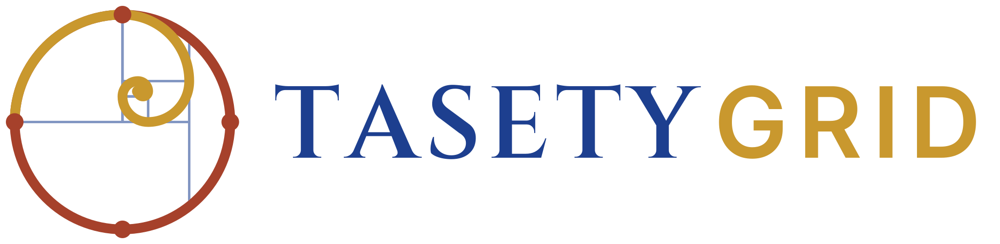

# TasetyGrid — Plateforme nationale de recensement territorial et patrimonial

> **TasetyGrid** : *Atlas des personnes, des terres et des ressources*. *Ta-Sety*, « le pays de l'arc », est le nom égyptien ancien de la Nubie. Ce nom remplace le nom de travail « POPGRID », déjà utilisé par le POPGRID Data Collaborative (CIESIN). Identité visuelle : [brand/charte-graphique.md](brand/charte-graphique.md).

## En une phrase

Une infrastructure numérique publique qui permet à un État de savoir, pour chaque localité,
**qui y vit, ce qui s'y trouve, à qui cela appartient (quand le droit le dit), dans quel état c'est,
comment c'est utilisé — et ce qui manque.**

## Ce qui change par rapport à la version précédente du concept

| Version précédente | Version affinée | Pourquoi |
|---|---|---|
| « 8 inventaires » (le 8ᵉ était en fait le résultat) | **7 inventaires thématiques + 1 couche transversale « Risques & environnement »** | Cohérence ; les inondations, l'érosion et les déplacés internes manquaient |
| « 6 objets fondamentaux » (5 étaient listés) | **6 objets explicites** : Territoire, Objet spatial, Acteur, Droit, Assertion, Mesure | Le modèle précédent ne savait pas représenter « qui affirme quoi, avec quelle preuve » |
| Chaque objet a « propriétaire + statut + source » | **Chaque information est une *assertion* sourcée et datée**, jamais une vérité unique | Plusieurs sources se contredisent ; la plateforme doit conserver le désaccord |
| Une seule base qui relie personnes, terres, ressources | **Cloisonnement** : les microdonnées du recensement restent dans une enclave statistique ; seuls des agrégats alimentent l'atlas | Secret statistique, risque de surveillance et de conflits fonciers |
| « Territorial Confidence Score 94/100 » | **Score décomposé et explicable** (couverture, concordance, fraîcheur, niveau de vérification) par couche | Un chiffre unique non expliqué n'est pas défendable devant une administration |
| « What is missing? » à partir de ratios | Déficits calculés **uniquement à partir de normes officielles paramétrées** + indicateurs d'accessibilité | Ne pas inventer de normes ; la distance compte autant que le nombre |
| Digital Twin | **Atlas territorial intégré** (le jumeau numérique est un horizon, pas le livrable initial) | Un jumeau numérique suppose simulation et mise à jour quasi temps réel |
| Pilote national en 7 étapes | **Socle national léger + pilote de terrain dans 3 communes contrastées** | Prouver la méthode et le coût unitaire avant de passer à l'échelle |

## Documentation

1. [Vision, périmètre et positionnement](docs/01-vision-et-perimetre.md)
2. [Les inventaires (nomenclature fonctionnelle)](docs/02-inventaires.md)
3. [Modèle de données](docs/03-modele-de-donnees.md) — schéma de référence : [`schema/schema_postgis.sql`](schema/schema_postgis.sql)
4. [Collecte, niveaux de vérification et rôles](docs/04-collecte-et-roles.md)
5. [Gouvernance des données, sensibilité et cadre juridique](docs/05-gouvernance-et-cadre-juridique.md)
6. [Intelligence territoriale : rapprochement, score de confiance, déficits](docs/06-intelligence-territoriale.md)
7. [Pilote Cameroun](docs/07-pilote-cameroun.md)
8. [Risques, points faibles et questions ouvertes](docs/08-risques-et-questions-ouvertes.md)

Nomenclatures : [`nomenclatures/`](nomenclatures/) · Marque et logo : [`brand/`](brand/charte-graphique.md)

## Statut

Document de conception (pas encore de code applicatif). Les références juridiques et institutionnelles
camerounaises ont été **vérifiées en octobre 2026 sur des sources secondaires** : bases LEAP/PNUE, FAOLEX,
INS, ITIE, UNESCO, presse. Le Journal officiel n'a pas été consulté directement ; une revue par un juriste
reste nécessaire. Détail et sources : [docs/05 §3](docs/05-gouvernance-et-cadre-juridique.md#3-cadre-juridique-et-institutionnel-camerounais).

**Changements de contexte majeurs identifiés lors de cette vérification :**
- circulaire MINDCAF du 20 février 2026 : les chefs de 3ᵉ degré délivrent des attestations foncières
  (ARDFC/AJPTER) depuis le 1ᵉʳ avril 2026 ;
- 4ᵉ RGPH couplé au RGAE réalisé d'avril à septembre 2026 ;
- loi sur les données personnelles n° 2024/017, en vigueur depuis le 23 juin 2026 ;
- nouvelle loi forestière n° 2024/008, qui abroge la loi de 1994 ;
- nouveau Code minier n° 2023/014.
