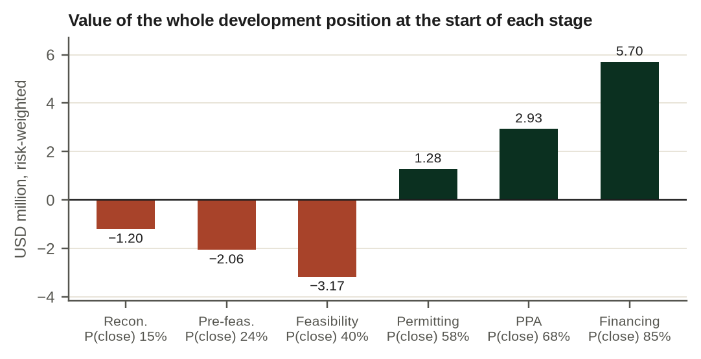
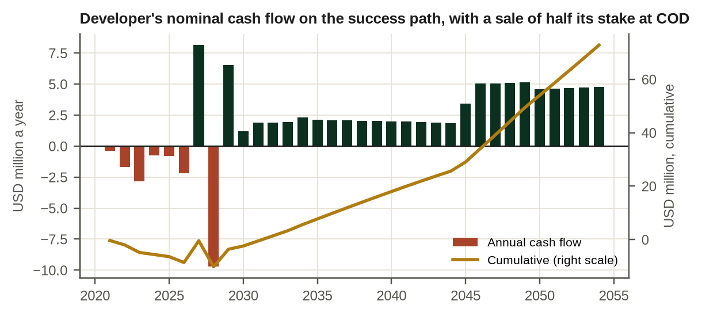
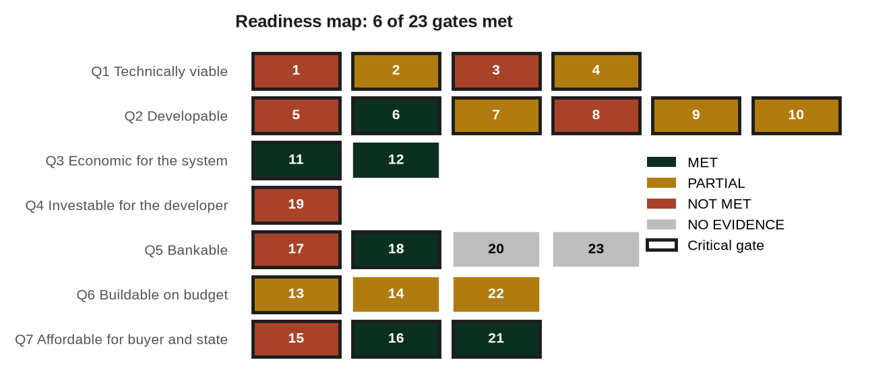

# About this book

Book 7. Hydropower Development and Finance. From River to Financial Close: A Developer, Lender and Government Framework for Hydropower Projects in Africa. First edition, version 0.3 (pre-publication).

The book belongs to the Africa Energy Finance collection, Business & Financial Models: a series of books, financial models, manuals, case studies and decision tools for energy businesses in African markets. Each book is built around one central question.

| Book | Subject | Central question | Status |
|---|---|---|---|
| Book 1 | Mini grids | Can this mini grid become a sustainable business? | Planned |
| Book 2 | Solar home systems (PAYGo) | Can PAYGo solar become profitable and financeable? | First edition |
| Book 3 | Clean cooking | Can clean cooking scale as a commercial business? | Planned |
| Book 4 | Commercial and industrial solar with storage | Should the customer invest, sign a PPA or use an energy service company? | Planned |
| Book 5 | Energy access fund | Can a fund mobilise capital and generate sustainable returns? | Planned |
| Book 6 | Power utilities | Can the utility become financially sustainable? | Planned |
| Book 7 | Hydropower: this book | Can this hydropower project be developed to financial close and financed on terms the developer, the lenders and the state can each accept? | First edition, v0.3 |

Each book is the centre of a set of products that share one method. For Book 7 they are:

| Product | Name | Role |
|---|---|---|
| Book | Hydropower Development and Finance (this book) | Explains the method and why it works |
| Model | MODEL 7: Hydropower Development and Finance Model | Quantifies the method: annual, 40-period, integrated project, utility and public-finance model with a development module and 23 financial close gates |
| Manual | MANUAL 7: User and Methodology Manual | Teaches the reader to operate the model |
| Case | CASE 7: Kasiri River Hydro | Demonstrates the method on a fictional 60 MW run-of-river project |
| Training | Video course | Walks through the book and the model |

The book is written to stand on its own. A reader who never opens the model loses the worked numbers, not the argument.

## What this book is, and what it is not

This is an investment committee guide to developing and financing hydropower projects in Africa. It connects hydrology, development risk, the power purchase agreement, construction, project finance, the developer's returns, the buyer's creditworthiness and the state's exposure in one route to financial close, and it asks for evidence at every step.

It is not a hydropower engineering textbook: the detailed design of dams, waterways and turbines is covered well elsewhere. But a decision-maker has to be able to challenge the engineer's numbers, so the book carries a technical reference, Annexes N to R, on hydrology and energy, layout and civil works, electromechanical equipment, construction and operation, and environmental and social due diligence, at the depth needed to ask the right questions and read the answers. It is not a general project finance book: debt sizing, cover ratios and security packages are treated only as far as hydro and African buyers change them. And it is not a guide to writing a feasibility study.

It is a decision framework for four questions that every hydro project faces before anyone puts more money into it. Should the project proceed? Who should fund each stage? Who should carry each risk? And is it actually ready to close?

Africa is not a chapter of the book; it is the setting of every chapter. Currency, the creditworthiness of state utilities, the role of development finance institutions and blended finance, the cost of transmission, the fiscal capacity of the state and the risk of regulatory change shape the answers throughout, and the evidence cited comes mostly from African projects.

# Preface

This book asks one question: can a given hydropower project be developed to financial close and financed on terms that the developer, the lenders and the state can each accept? Most hydro projects in Africa that never reach close do not fail on engineering. They fail because one of the three parties cannot accept the terms the other two need. The developer cannot earn enough to justify years of at-risk spending. The lenders cannot get comfortable with the river, the contractor or the buyer. Or the state is asked to carry obligations its budget cannot bear.

The book is written for the people who make those decisions. Developers and their finance directors building a development plan and a financing case. Credit officers and investment officers at development finance institutions and commercial banks sizing debt. Fund managers deciding whether to buy into a project before or after close. Transaction advisers who have to reconcile all of them. And staff in finance ministries and PPP units, who get one full chapter written for them, because a support package the ministry will not sign does not close.

Each chapter supports one decision. Chapter 1 sets out the business model and why a hydro project has to be read as three investments, not one. Chapters 2 to 4 cover the resource and the commercial route: the river, the configuration and the path to a power purchase agreement. Chapters 5 to 8 deal with development: the stage gates, the development budget, the consents and the contract set. Chapters 9 to 11 turn to construction and operation. Chapters 12 to 15 are about financing: sizing the debt, assembling the lender group, the developer's returns and the public side. Chapters 16 and 17 bring the analysis together for the people who carry the risk, through stress testing and the financial close gates. Chapter 18 walks through the complete case.

## Four ideas that run through the book

Four ideas recur in every chapter, and together they are the book's method.

The first is that a hydro project is three investments in one asset: a development option, a construction contract and an operating annuity. Each has its own risk, its own capital, its own cost of capital and its own way of failing. A project can be a good asset after commercial operation and a poor decision at the development stage, and the Kasiri case shows exactly that.

The second is that "feasible", "bankable", "investable", "affordable" and "ready" are different words for different tests. The book separates eight questions and answers each with its own evidence.

The third is that a project closes only if three parties accept it at once: the developer, the lenders and the state. A structure that satisfies two of them by moving risk onto the third is not a solution; it is a transfer, and the book measures it.

The fourth is that financial close is the result of evidence, not of negotiation alone. The book's 23 readiness gates, applied in the model, turn the eight questions into a close decision: STOP, NOT READY, CONDITIONAL GO or GO.

The second and fourth ideas together form the Hydro Readiness Framework™, set out in the Introduction: eight questions, 23 gates, one financial close decision.

## How this book relates to other works

Book 7 is not the first work to connect hydropower with finance, and it does not try to replace the works that came before it.

The most complete public guide is the IFC's *Hydroelectric Power: A Guide for Developers and Investors*, published in 2015 [LIT:S1]. It covers the whole development cycle, from site selection to operation. By its own account, its technical sections "are more detailed and can be used as reference, while the permitting/licensing and financing sections are intended more as a high-level review" [LIT:S1]. Book 7 starts where that guide stops. The IFC guide explains how a hydro project is developed; this book explains how to decide whether it should continue, how it should be financed, who should bear each risk and whether it is ready to close.

The closest predecessor in purpose appears to be the *Hydro Finance Handbook* of 2008, described as a companion to a hydro finance tutorial at HydroVision 2008 and as covering the financial aspects of hydro development and the steps towards financial close [LIT:S2]. We could see only a search summary of it, and its publisher and authors are not confirmed here, so the comparison rests on that description. On that basis, Book 7 differs in three ways: it values the development stage itself, before any financing; it tests the project from the positions of the developer, the lenders and the state at once; and it treats financial close as the outcome of 23 evidence gates rather than as a sequence of steps.

The University of Cambridge Institute for Sustainability Leadership published in 2019 an introduction to the concepts and terminology of financing sustainable hydropower in emerging markets [LIT:S3]. It introduces the terms and concepts of finance for large hydropower in emerging markets, for readers new to finance, to hydropower or to both. This book assumes that grounding and uses it to reach a decision.

General project finance works treat debt sizing, cash flow available for debt service and lender requirements in far more depth than this book does, among them Gatti's textbook [LIT:S5] and, for the power sector, Nongena's practical guide to senior debt for electricity projects, listed by Springer for 2026 [LIT:S4]. They are not specific to hydrology, to African utilities or to the state's balance sheet. Readers who need the full mechanics of project finance should read them alongside this book.

**Table P.1. What this book adds to existing works**
{: .cap}

| Work | Its strength | What it leaves to others | What this book adds |
|---|---|---|---|
| IFC guide (2015) [LIT:S1] | Full development cycle; detailed technical reference | Financing and permitting as a high-level review | The decisions to continue, finance and close, with the developer's, lenders' and state's tests side by side |
| Hydro Finance Handbook (2008) [LIT:S2] | Financial aspects and the steps to financial close, as described in a search summary | Not confirmed: the full text was not seen | Risk-weighted development value; the state's test alongside the lenders'; 23 evidence gates; a working model |
| CISL working paper (2019) [LIT:S3] | Concepts and terminology for readers new to finance, hydropower or both | A method for deciding | A decision sequence with numbers at every step |
| Project finance texts [LIT:S4; LIT:S5] | Depth in cash flow, debt sizing and security | Hydrology, African utilities, sovereign exposure | Hydro-specific lender cases, buyer payment capacity, contingent liabilities |
| This book | An investment committee framework for hydro in Africa, from river to financial close | Detailed engineering design, covered by the IFC guide and engineering texts | |

*Note: The table compares purpose and coverage as stated by each work, or for the 2008 handbook as described in a search summary; it is not a ranking.*

The book also has a companion in the author's own work. The author's *Bankable Is Not Enough* argues, across African independent power projects, that bankability alone can produce poor power deals. Book 7 applies that argument inside one sector, where the capital is heavy, the revenue depends on a river and the state is almost always a party, and turns it into a method for deciding whether a project should be developed, financed and closed.

## How the book works with the model

The book has a companion workbook, MODEL 7, together with a user manual and a worked case on Kasiri River Hydro, a fictional 60 MW run-of-river project in the fictional Republic of Navaria, developed by the fictional Tamarind Hydro Ltd. The chapters refer to the workbook by sheet name, so that each concept can be tested on numbers. A reader who prefers to stay with the text can ignore those references. A reader who works through them will finish the book able to build, challenge and defend a hydro investment case.

All default inputs in the workbook, and all Kasiri figures, are illustrative. They were chosen to make the mechanics visible and to sit inside the ranges found in public sources, not to describe any real project. Where the book cites figures about real projects or about the sector, it says where they come from and how far they have been verified. Where public sources conflict, the book reports the conflict rather than choosing the more convenient number. Where no public figure exists, as for development premiums or stage-by-stage attrition in African hydro, the book says so and treats the value as a model assumption.

A second fictional project, Lumora Falls, a 400 MW scheme structured as a public-private partnership, appears as a contrast in Chapters 1, 2, 4 and 15. It comes from the author's earlier policy paper on hydro and public liabilities, which is now a companion paper to this book.

## Conventions

The Kasiri case runs on model time: development from 2021, financial close in 2027 and commercial operation in 2030. When the book says that Tamarind is at the start of permitting, it refers to the stage reached, not to a calendar date.

Currency amounts are in US dollars (USD) unless stated, and "USDm" means millions of US dollars. Unless stated otherwise, amounts in the model are nominal; capital costs quoted "real 2026" are before escalation. Energy is in GWh and capacity in MW. P50 and P90 denote the energy exceeded with 50 and 90 percent probability; "one-year" and "ten-year" P90 are distinguished in Chapter 2. Unit costs are labelled by scope (plant, funding base, total uses or system), because a USD/kW figure without a scope cannot be compared with anything. Negative amounts are shown with a minus sign. British spelling is used throughout.

## Sources and evidence

The book draws on four kinds of material and labels each one. Institutional evidence comes from bodies such as the World Bank Group, the African Development Bank, IRENA and national regulators; project disclosures by development finance institutions are placed in the same class. Secondary reporting is trade press and law-firm guides that report those documents. A model assumption is an input of the companion workbook, chosen to make the mechanics visible. An illustrative case output is a figure produced by the workbook for Kasiri; it is never a benchmark for real projects.

Several numbers in this book are easily misread as findings about African hydro. Most of them are not, and the table below gives the status of each.

**Table P.2. Status of the key numbers used in the book**
{: .cap}

| Number | Value | Status | What it is not |
|---|---|---|---|
| Kasiri capacity factor | 55.6% | Illustrative case output | A benchmark for African hydro; IRENA's figures are cited separately in Chapters 2 and 3 |
| Probability of reaching close from reconnaissance | 15% | Model assumption, informed by Chapter 5 | A measured attrition rate; none is published for African hydro |
| Real cost overrun of large dams, reference-class median and mean | 27% and 96% | Public evidence [HY-08] | A forecast for any one project |
| Development premium | 3% of plant cost | Model assumption | A market rate; no public data were found [DE:BENCH] |
| Developer IRR on the success path | 16.0% | Illustrative case output | An expected return |
| Developer's risk-weighted NPV | USD −0.95 million | Illustrative case output | A valuation of any real position |
| Financial close decision | STOP: a critical gate is not met | Illustrative case output, from evidence statuses entered for the case | A verdict on any real project |

Every external claim carries a source identifier in square brackets, such as [HY-08] or [DE:S1], which points to Annex L. The annex records, for each source, whether its full text was read, only its landing page, or only a search-engine summary. Claims resting on a summary are flagged as such and should be checked against the original before they are quoted.

## Status of this edition

This is the first edition of Book 7, issued as version 0.3 for pre-publication review. It replaces, for developers and lenders, the author's earlier policy paper on structuring hydro without unsustainable public liabilities, whose material is condensed in Chapter 15. Three things must happen before release: the sources marked as summaries in Annex L must be read in full; the companion model must complete its test in Microsoft Excel (it has been recalculated in LibreOffice, reproduced cell by cell by a second calculation engine, adversarially reviewed twice and corrected; Annex K gives the results); and practitioners must review the text.

## Acknowledgements and disclaimer

The analysis and any errors are the author's. Nothing in this book is investment, legal, tax or accounting advice. Readers should take professional advice in the jurisdiction concerned before acting on any of it.

# Introduction: how to read a hydro project

A hydro project can be read in a fixed order, and the order matters more than any single ratio. Each link in the chain below takes an input from the link before it and passes a result to the next. A weakness found early, in the flow record or the permitting sequence, travels down the chain and arrives, larger, at the debt sizing and the close.

| Link | Question | What it passes on | Chapters |
|---|---|---|---|
| River and site | Is there a resource worth developing here? | Catchment, head, access, competing uses | 2, 3 |
| Hydrology evidence | How good is the flow record, and how uncertain is the energy? | Flow series, P50, one-year and ten-year P90 | 2 |
| Configuration | What should be built? | Design flow, MW, energy by season, cost envelope | 3 |
| Offtake route | Who buys, through which route, on which tariff? | PPA route, tariff form, indexation, currency | 4 |
| Development plan | What must be done, in what order, at what cost and probability? | Stage plan, budget, stage-gate probabilities | 5, 6 |
| Consents | Which permits gate which others? | Consent sequence, critical path, E&S conditions | 7 |
| Contract set | Is the chain of contracts bankable and consistent? | Concession, PPA, grid, direct agreements, termination amounts | 8 |
| Construction | Who takes geology and delay, and at what price? | Contract structure, contingency, owner's share of overruns | 9, 10 |
| Operations | Who runs it, and what will it cost to keep it available? | O&M model, availability, reserves, insurance | 11 |
| Debt | How much senior debt, at what tenor, on which case? | Debt quantum, DSCR, LLCR, reserve accounts | 12 |
| Lender group | Which lenders, guarantees and insurances? | DFI club, cover, local-currency tranches | 13 |
| Developer returns | Is it investable for the developer, and at what price can it sell down? | Risk-weighted NPV, premium, IRR, sell-down value | 14 |
| Public obligations | What does the state commit, and can it carry it? | Payment capacity, support, contingent liabilities | 15 |
| Stress | What breaks first, and who holds it? | Break-even flow, overrun, distance to default | 16 |
| Financial close | Go, conditional go or stop, on what evidence? | Gate status, decision and conditions | 17, 18 |

## The Hydro Readiness Framework™: eight questions, 23 gates, one financial close decision

Hydro projects are often described as "feasible" or "bankable" as if those words meant one thing. The book separates eight questions, because a project can pass one and fail the next, and each is answered by a different document or test. Each question must be accepted by a particular party, and each is tested by a set of the 23 financial close gates of Chapter 17. The eighth question, ready to close, is the sum of the other seven.

| Question | Answered by | Must be accepted by | Gates | Typical trap |
|---|---|---|---|---|
| Q1. Is the site technically viable? | Feasibility study and geotechnical investigation (Chapters 2, 3, 9) | Developer, lenders | 1 to 4 | A feasibility study built on a short or synthetic flow record presented as a long one |
| Q2. Is the project developable? | Consent sequence, land and water rights, PPA route (Chapters 5, 7) | Developer, state | 5 to 10 | Spending on bankable feasibility before the PPA route and water rights are secure |
| Q3. Is it economic for the power system? | Least-cost plan, LCOE against alternatives (Chapters 3, 4) | State | 11, 12 | Quoting plant cost when the system pays for plant and line |
| Q4. Is it investable for the developer? | Risk-weighted development NPV, premium, sell-down value (Chapters 6, 14) | Developer | 19 | Reading the equity IRR at close as the developer's return, ignoring at-risk spend and the chance of failure |
| Q5. Is it bankable? | Lender case, DSCR, LLCR, security package (Chapters 12, 13) | Lenders | 17, 18, 20, 23 | A project protected by backstops, so that lenders see none of the risk |
| Q6. Is it buildable on budget? | Contract structure, contingency, reference class (Chapters 9, 10) | Developer, lenders | 13, 14, 22 | A "fixed-price" EPC contract with ground conditions excluded |
| Q7. Is it affordable for the buyer and the state? | Payment capacity, support package, contingent liabilities (Chapter 15) | State | 15, 16, 21 | A bankable project whose arrangements move the risk onto the Treasury |
| Q8. Is it ready to close? | Evidence-based financial close gates (Chapter 17) | All three | All 23 | Treating a signed term sheet as a closed deal |

A project that passes Q1 to Q7 on evidence reaches CONDITIONAL GO when every critical gate is met, and GO when all 23 are. For Kasiri, at the start of permitting, the answer is STOP: the framework does not say the project is bad, it says which questions are still open and who has to close them.

The rest of the book follows the chain in order.

# Chapter 1. The hydro project: three investments in one asset

This chapter supports one decision, which comes before any other in the book: which kind of capital should fund which phase of a hydro project, and therefore which numbers each party should read first. A project funded as if it were one investment will be priced as one investment, and the price will be wrong for at least two of its three phases. The chapter sets out the three investments that sit inside one hydro project, shows where value and cash are created and where they diverge, describes who develops hydro in Africa and how projects fail, and explains how the rest of the book and the companion workbook are organised.

*Place in the analytical chain: the frame for the whole chain, the three investments inside one project.*

*Who must accept the answer: the developer, the lenders and the state.*

## 1.1 Three investments in one asset

Seen from a distance, a hydro project is a single asset: a weir or dam, a waterway, a powerhouse and a line to the grid, owned by one special-purpose company that sells electricity under one power purchase agreement. Inside, it is three investments made in sequence, each with its own risks, its own investors and its own cost of capital.

The first is a development option. Before anything is built, a developer spends money on studies, flow gauging, permits, land, negotiations and advisers, for years, with no assurance that the project will ever reach financial close. If it does, the developer is reimbursed and usually earns a premium. If it does not, the money is lost. This is venture capital in everything but name, and it should be priced like venture capital.

The second is a construction contract. From financial close to commercial operation, the project's owners and lenders are exposed to geology, contractor performance, delay and the interface with the transmission line. The money at stake is far larger than in development, and the risk is different: it is the risk that the asset costs more or takes longer than planned. In hydro, more than in any other power technology, that risk sits underground.

The third is an operating annuity. Once the plant runs, the project becomes a long-dated claim on two things: the river and the buyer. Revenue depends on how much water flows and on whether the utility pays. Lenders and long-term holders of equity price this phase, and they price it at a much lower cost of capital than development or construction, provided the river and the buyer have been understood.

| Area | Development option | Construction contract | Operating annuity |
|---|---|---|---|
| Period | Site to financial close, often five years or more | Close to commercial operation | Commercial operation to end of concession |
| Main risks | Permits, PPA, land, hydrology evidence, failure to close | Geology, contractor performance, delay, interface with the line | Hydrology, offtaker payment, currency, O&M, regulation |
| Who funds it | Developer equity, co-developers, project preparation facilities | Equity, senior debt, contingency, standby equity | Senior debt service, distributions, refinancing |
| How value shows | Step-ups at milestones; premium at close | Completion; liquidated damages; contingency release | DSCR, distributions, refinancing gains |
| Typical failure | Spending past a gate the project should have failed | Overrun beyond contingency; contractor default | Offtaker arrears; a run of dry years; a currency step |

Many of the costly mistakes in hydro come from funding one of these investments with capital meant for another. Development spending financed by a utility's operating budget is stopped when the budget is cut. Construction overruns financed by lenders who sized their debt on the operating annuity trigger a default. Operating cash flows priced at development-stage returns produce tariffs that the buyer cannot pay.

## 1.2 How value and cash are created

Value in a hydro project is created at three moments, and cash arrives at none of them.

The first is financial close. On the day the contracts are signed and the debt becomes available, a set of permits, studies and agreements that was worth almost nothing to an outsider the day before becomes a financeable project. The developer captures part of that value through the reimbursement of its development costs and a development premium, and part through its share of the equity.

The second is commercial operation. Once the plant is built and running, construction risk has gone. Investors who would demand a construction-stage return will now accept an operating-asset return, and the same future cash flows are worth more. That step-up is what allows a developer to sell part of its stake after commercial operation and recycle the proceeds into its next project.

The third is the long tail of operation. Revenue arrives monthly, debt service is paid twice a year, and distributions start only when the lenders' tests are met.

The Kasiri case shows the shape. Tamarind Hydro spends about USD 9.0 million, in 2026 dollars, over 6 years of development. In the model, the chance that a project at the reconnaissance stage reaches close is about 15%, a model assumption informed by the evidence in Chapter 5. If Kasiri closes, total uses of funds are about USD 215 million, of which senior debt provides about USD 145 million. On the success path, the developer's internal rate of return over the whole period, from the first study to the last distribution, is 16.0%, including a sale of half its stake at commercial operation. Weighted by the chance of failure, the same developer's expected net present value at a 25 percent discount rate is USD −0.95 million.

Those two numbers describe the same project. The first answers the question "what does the developer earn if it succeeds?" The second answers "should a developer start?" Chapter 14 is about the gap between them.

## 1.3 Who develops hydro in Africa

Three kinds of developer take hydro projects to close in Sub-Saharan Africa.

State utilities and governments develop most large schemes, often with export-credit or bilateral finance and an engineering, procurement and construction contractor who also arranges the loan. Julius Nyerere in Tanzania was funded from the state budget [A2:S65]. Isimba and Karuma in Uganda were 85 percent financed by China Exim [A2:S34; A2:S40].

Private developers, often regional companies backed by development finance institutions, develop most small and medium plants. The World Bank's 2024 review of private participation in large hydro found, worldwide, that private participation falls sharply with plant size: 74 percent of plants below 10 MW against 8 percent of plants above 2,500 MW [HY-06]. Uganda's GET FiT programme supported a portfolio of mostly small private hydro plants; KfW expected about EUR 94 million of public money to allow about EUR 450 million of private investment [DE:S35].

Development finance institutions increasingly co-develop. IFC InfraVentures funds a minority share of development costs, on average about USD 4 million for a 20 to 30 percent share [DE:S2]. The African Development Bank's Sustainable Energy Fund for Africa granted about USD 1 million to prepare a 7.8 MW community hydro project in Kenya [DE:S17].

This book is written mainly for the second and third groups, and for the lenders and ministries who deal with them. Its main case is a 60 MW private project because that is the scale at which a private developer is the protagonist.

## 1.4 How hydro projects fail

Hydro projects fail in three patterns, one for each investment.

Development stalls. Ngonye Falls in Zambia has been in development for more than a decade without reaching financial close [DE:S3]. Ruzizi III, a regional public-private partnership, has been in preparation since at least 2009 without reaching financial close [A2:S21; A2:S22]. Most of the money spent on such projects is never recovered.

Construction overruns. The reference class for large dams shows a median real cost overrun of 27 percent and a mean of 96 percent [HY-08]. African examples include a 27 percent cost increase at Bui [A1:S38], a 47 percent increase in the main civil works contract at Rusumo [A2:S16] and a commissioning date several years late at Karuma [A2:S40]. The reference class covers large dams, not medium run-of-river plants, so it is a warning rather than a calibrated forecast for a project like Kasiri.

The operating annuity breaks. A run of dry years cuts revenue. At Kariba the water allocated for generation in 2024 was 16 billion cubic metres [R1:S1], about half the 2023 allocation according to news reporting [CL-04]. A buyer that cannot pay leaves arrears: Ghana's ECG owed the Bui Power Authority about USD 612 million in March 2023 [A1:S40]. A currency step multiplies the local-currency cost of a dollar tariff overnight.

None of these failures is visible first in the project's income statement. All of them are visible first in the development budget, the flow record, the contract structure and the buyer's cash flow.

## 1.5 A contrast: Lumora Falls

The author's earlier policy paper used a fictional 400 MW public-private partnership, Lumora Falls, as its case. Lumora's tariff put about 71 percent of revenue into a capacity payment, which the utility owes whether or not the river flows. As a result, a three-year drought barely moved Lumora's equity return, and the paper's main finding was about the state, not the developer: the project's own debt cover stayed robust while the arrangements that made it so moved risk onto the utility and the Treasury.

Kasiri is the opposite case. Its tariff is paid only for energy delivered, as under East African feed-in tariffs, so the river is the developer's problem. Its size means that the state's exposure is small relative to the budget. And its developer has to decide, at each stage, whether to keep spending. The two cases together show why the same method gives different answers for different projects, and why the reader should never transfer a conclusion from one to the other without checking the tariff structure first.

## 1.6 How the book and the workbook are organised

The book has 18 chapters, built around the central question. Chapters 2 to 4 cover the resource and the commercial route. Chapters 5 to 8 cover development: the stage gates, the budget, the consents and the contracts. Chapters 9 to 11 cover construction and operation. Chapters 12 to 15 cover financing, from the lender case to the public side. Chapters 16 and 17 cover stress testing and financial close, and Chapter 18 walks through the Kasiri case from site to close.

The companion workbook, MODEL 7, is an annual, 40-period model with 38 sheets and about 11,000 formulas, no macros and no circular references. It links hydrology, transmission, demand, the utility's cash flow, the PPA, project finance, five financing structures, government support, contingent liabilities and a fiscal screen. A development module covers the years before close, a contracting module compares construction contract structures, and a readiness sheet applies 23 financial close gates. Its 14 integrity checks confirm internal consistency, not the realism of the assumptions. The model was reviewed adversarially before this edition; the review found and fixed defects that the model's own checks had missed, and Annex K records what was changed.

The workbook never rates a project. Its readiness sheet counts each gate only on evidence and applies a fixed rule: STOP when a critical gate is not met or its evidence is missing, CONDITIONAL GO when every critical gate is met, GO only when all gates are met. In its default state, Kasiri meets 6 of the 23 gates and reads "STOP: a critical gate is not met". That is a finding about the state of the project's evidence, not a judgement on the project.

## Points for the investment and credit committees

1. Ask the sponsor to present the project as three investments, with the development budget, the construction budget and the operating case shown separately, each with its own funding and its own target return.
2. Read the developer's return twice: on the success path and weighted by the probability of failure. Treat any presentation that shows only the first as incomplete.
3. Identify who carries the river. If the tariff pays for energy, the flow record is the core of the credit; if it pays for capacity, the buyer's balance sheet is.
4. Check that construction risk is funded by capital that can absorb it: contingency, standby equity or an overrun facility, not senior debt sized on the operating case.
5. Test the buyer's ability to pay before negotiating the tariff, and decide openly who funds any shortfall.
6. Do not transfer conclusions from a large public-private scheme to a mid-size private project, or the reverse, without checking the tariff structure and the size of the state's exposure.

## Working with the model

Open *01_CONTROL_PANEL* first: it sets the case, the generation case for cash flows and for debt sizing, the financing structure and the stress toggles. Then read *32_DASHBOARD*, which shows the project, financial, developer, power system, utility and public-finance results side by side. *01A_DEVELOPMENT* holds the development budget, the stage probabilities and the developer's returns; *05A_CONTRACTING* compares construction contract structures; *30A_CLOSE_READINESS* applies the 23 gates. *33_CHECKS* should read ALL OK before any output is relied on.

# Chapter 2. River, flow record and hydrology risk

This chapter supports a decision that is taken twice: is the hydrological evidence good enough to spend feasibility money, and later, is it good enough to size debt? The two thresholds are different. A developer can justify a feasibility study on a short record and a regional correlation; a lender cannot justify a sixteen-year loan on the same evidence. The chapter explains how flow becomes energy, how uncertainty in energy is measured, why a one-year P90 and a ten-year P90 answer different questions, and why the tariff structure decides who carries the river.

*Place in the analytical chain: hydrology evidence, the first link that every later number depends on.*

*Who must accept the answer: the developer and the lenders.*

## 2.1 Four kinds of capacity

Financing documents are full of capacity numbers, and they do not mean the same thing. Installed capacity is the nameplate rating of the generating units. Available capacity is installed capacity multiplied by the share of time the units can run, after planned and forced outages. Expected generation is the energy the river allows on average, which depends on flow, head and how often the flow exceeds what the turbines can use. Contracted energy is whatever the PPA refers to, and it may differ both from what is delivered, because of curtailment, and from what is paid for, because of deemed-energy clauses.

The gap between nameplate and energy can be large. Belo Monte in Brazil has 11,233 MW installed against 4,571 MW of assured energy [INT:S8]. For a run-of-river plant like Kasiri, the gap is set by the shape of the river's seasons: in the dry months the turbines run well below their rating.

## 2.2 The flow record

Everything in this book that depends on energy depends on the flow record. The IFC's guide for hydro developers says that flow data should cover at least 15 years for reliable statements [DE:S1]. Few African sites have that much measured data at the intake. Most developers start a gauging programme at pre-feasibility and extend the short on-site record by correlation with a longer regional gauge.

That practice is sound if it is done well and described honestly. The questions a lender's adviser will ask are concrete. How many years were measured on site, and how many were synthesised? How good is the correlation, and over which flow range was it tested? Were the rating curves checked at high flows, where most of the uncertainty sits? Are there gaps, and how were they filled? Has upstream land use, abstraction or a new dam changed the river since the regional record began?

In the model, the record is described by two inputs on *03_HYDROLOGY*: the number of reliable years and the maturity of the hydrology study, from desk study to independent review. Kasiri has 12 years, a mix of on-site gauging since pre-feasibility and regional correlation, and a feasibility-level study that has not yet been independently reviewed. Gate 1 of the financial close readiness sheet therefore reads NOT MET. That is the normal state of a project at Kasiri's stage, and it tells the developer where to spend next.

## 2.3 From flow to energy

For each month, the model computes usable flow, average power and energy:

> Qusable = min( max(Q − Qenv, 0), Qdesign )
>
> P = min( ρ · g · Qusable · H · ηturbine · ηgenerator / 106 , Pinstalled )
>
> E = P × hours × availability / 1000

Q is mean river flow in m³/s, Qenv the environmental flow release, Qdesign the rated turbine flow, H the net head in metres, η the efficiencies, P in MW and E in GWh. For Kasiri, mean monthly flows range from 20 to 70 m³/s, the design flow is 57 m³/s, the environmental release 4 m³/s and the net head 120 m. The long-term mean energy, the P50, is about 292 GWh a year, a capacity factor of 55.6%. IRENA classes plants above 10 MW as large hydro and reports a weighted average capacity factor of 48 percent for large hydro commissioned in Africa between 2018 and 2024, within a 5th to 95th percentile band of 33 to 81 percent [HY-01]. Chapter 3 compares Kasiri with both size classes.

The equations hide a bias that matters for finance. Energy is a concave function of flow: it rises with flow until the turbines are full and then stops. Applying the function to mean monthly flows overstates mean energy, because the water spilled in wet years cannot make up for the energy lost in dry ones. The IFC guide notes that even monthly averaging can overstate energy by 10 percent or more against shorter averaging periods [DE:S1]. For a bankable estimate, energy should be computed month by month, or more finely, over the whole record and then averaged. The model accepts a simulated series when one exists and flags the bias when it does not.

## 2.4 P50, one-year P90 and ten-year P90

Lenders size debt on a downside generation case. The usual reference is a P90: the energy exceeded with 90 percent probability. Without a full simulated series, the model uses the coefficient of variation (CV) of annual energy:

> P90one-year = P50 × (1 − 1.2816 × CV)

With a CV of 15 percent, Kasiri's one-year P90 is about 236 GWh.

A one-year P90 describes a single bad year. A sixteen-year loan is serviced by many years, and the average of many years is much less uncertain than any one of them, unless dry years cluster. The model therefore also computes the P90 of the ten-year average, allowing for persistence through a year-to-year correlation coefficient ρ:

> P90ten-year = P50 × (1 − 1.2816 × CV × √((1 + ρ) / (1 − ρ) / 10))

With ρ = 0.3, Kasiri's ten-year P90 is about 268 GWh, much closer to P50 than the one-year figure.

The choice between the two is not technical. It is a negotiation about who carries persistence risk. Sizing debt on the one-year P90 for every year of the loan is conservative for the average and says nothing about runs of dry years; sizing on the ten-year P90 is more generous but needs a separate test for a multi-year drought. The model's default sizes on the ten-year P90 and then tests a three-year drought explicitly, with the debt service reserve available. Chapter 12 shows the effect on debt capacity.

## 2.5 Who carries the river

The tariff structure decides who carries hydrology risk. Under a two-part tariff, a capacity charge pays the fixed costs whether or not the river flows, and the buyer carries most of the hydrology risk. Under an energy-only tariff, as in East African feed-in tariffs, the project is paid only for what it delivers, or under a deemed-energy clause could have delivered, and the river is the project's problem [DE:S8; DE:S42].

Kasiri has an energy-only tariff. With the financing package fixed at its base-case terms, a three-year drought at 55 percent of normal flow from the fourth operating year reduces the minimum DSCR from 1.53x to 0.69x and the equity return from 13.8% to 11.0%. Running the whole cash flow on the one-year P90 instead of P50 gives a minimum DSCR of 1.16x and an equity return of 8.1%. The contrast with Lumora, where a similar drought barely moved the equity return, is the tariff, not the river.

The drought factor deserves a word. For 2024 the Zambezi River Authority allocated 16 billion cubic metres of water for generation at Kariba [R1:S1], against 30 billion in 2023 according to news reporting [CL-04]. The model's default of 55 percent of normal flow is set close to the depth of that cut, and it is held for three years. A single-year statistic would never produce it.

## 2.6 Climate

Peer-reviewed work warns that planned hydro expansion in eastern and southern Africa concentrates capacity in basins with correlated rainfall, which raises the risk of concurrent climate-related supply disruption within each region [CL-03]. For a single project, the practical consequence is that the historical record may not describe the next thirty years. The IHA's climate resilience guide sets out how to test a design against climate scenarios [CL-01]. The model offers a flow trend per decade as a stress, labelled illustrative until a basin study supports a number. With a decline of 3 percent per decade, Kasiri's equity return falls from 13.8% to 12.8%.

## 2.7 What the Kasiri case shows

Kasiri's hydrology is adequate for a developer to keep spending and inadequate for a lender to commit. The record is shorter than 15 years and has not been independently reviewed. Because the tariff pays only for energy, the project's credit rests on that record. The next development money should go into extending the record, checking the rating curves and commissioning the independent review, before the bankable feasibility study is finalised.

## Points for the investment and credit committees

1. Ask how many years of the flow record were measured at or near the intake, and how many were synthesised by correlation. Treat the two differently.
2. Require energy to be computed month by month over the whole record, not from mean monthly flows.
3. Ask for both the one-year and the ten-year P90, and agree explicitly which one sizes the debt and how runs of dry years are tested.
4. Identify who carries hydrology risk under the tariff, and size reserves accordingly.
5. Test at least one multi-year drought set close to the worst sequence in the region's record.
6. Treat a climate trend as a stress, not a base case, unless a basin-specific study supports it.

## Working with the model

*03_HYDROLOGY* holds the monthly flows, the plant parameters, the P-values and the record inputs. *04_GENERATION* shows installed capacity, available capacity, generation, evacuable energy, delivered energy and contracted energy year by year. On *01_CONTROL_PANEL*, switch the generation case for cash flows between P50, P75 and P90, and the lender sizing case between one-year and ten-year P90. Switch on the drought and climate toggles and read the minimum DSCR on *20_CASH_FLOW*. Gate 1 on *30A_CLOSE_READINESS* reads the record inputs automatically.

The technical reference for this chapter is Annex N, which sets out the engineering and environmental detail behind it and the questions to put to the project's engineers.

# Chapter 3. Configuration, energy and the cost envelope

This chapter supports the decision on what to build: the design flow, the installed capacity and the scheme type, and therefore the capital cost envelope that every later chapter will try to finance. Configuration is usually treated as an engineering question. It is also a financing question, because each extra megawatt of installed capacity adds cost in every month but energy only in the wet ones.

*Place in the analytical chain: configuration, between the hydrology evidence and the offtake route.*

*Who must accept the answer: the developer and the state, as planner of the power system.*

## 3.1 Sizing the design flow

The design flow is the flow at which the turbines reach their rating. A larger design flow captures more of the wet-season water and raises annual energy, but each additional cubic metre per second is used for fewer months a year. The marginal megawatt-hour therefore costs more than the average one.

The standard tool is the flow duration curve: the share of time each flow is exceeded. A design flow exceeded 30 percent of the time captures most of the high-flow water but runs at part load for most of the year; one exceeded 60 percent of the time runs near full load more often but spills more water. The right choice depends on the tariff. Under an energy-only tariff with no seasonal price, energy is worth the same in every month and the developer maximises net present value by adding capacity until the cost of the last megawatt equals the value of the energy it adds. Under a tariff that pays more for dry-season energy, or a capacity charge, the optimum moves.

Kasiri's design flow is 57 m³/s. Only in May, the wettest month, does the river exceed the design flow plus the environmental release, and the excess is spilled; in April and June the plant runs close to its rating. In the four driest months it runs at between about a quarter and two fifths of its rating.

Kasiri is designed with two Francis units of about 30 MW each, a case fact set for this edition. A single unit would have to stop in the driest months, when the river falls below the minimum flow a Francis turbine can pass; two units keep the plant running through the dry season, which is what the model's monthly energy calculation assumes. Annex P sets out the turbine choice and the minimum-flow test.

## 3.2 Run-of-river, pondage and storage

Kasiri is a run-of-river scheme with a small daily pond. It can shift some energy within a day, from night into the evening peak, but not between seasons. A storage scheme can move water from the wet season into the dry season, which raises firm energy and its value to the system, at the cost of a larger dam, a larger reservoir, more resettlement and more geological risk.

For a private developer, storage changes the financing problem in three ways. It raises capital cost per kilowatt. It raises the environmental and social stakes, and with them the time and cost of consents. And it makes the project more valuable to the system, which argues for a two-part tariff that pays for the firm capacity storage provides. None of these is a reason not to build storage. All of them are reasons to price it explicitly.

## 3.3 Capacity factor and firm energy

For plants commissioned in Africa between 2018 and 2024, IRENA reports capacity factors of 33, 48 and 81 percent at the 5th percentile, weighted average and 95th percentile for large hydro (above 10 MW), and 50, 55 and 66 percent for small hydro (10 MW or less) [HY-01]. Kasiri's 55.6% is above the large-hydro average, the class a 60 MW plant belongs to, and close to the small-hydro average. It is an illustrative input, not evidence that the site is better than average.

Annual energy is not the whole story. The utility's planner cares about what the plant delivers in the driest month, because that is when the system is short. Kasiri's dry-season firm output, the lowest monthly average after availability, is about 16 MW against an installed 60 MW. A planner comparing Kasiri with a gas plant or a solar plant with storage would credit it with that firm figure, not the nameplate.

## 3.4 The cost envelope

IRENA's cost database gives a weighted average installed cost for large hydro (above 10 MW) in Africa of USD 2,330 per kW for projects commissioned in 2010 to 2017 and USD 2,515 per kW for 2018 to 2024, in 2024 dollars, and USD 4,084 per kW for small hydro (10 MW or less) in 2018 to 2024 [HY-01]. Project-level costs vary much more widely. Uganda's GET FiT-era small plants range from about USD 1,700 per kW at Nyamagasani 1 to about USD 6,200 per kW at Kikagati (derived from reported costs) [DE:S39b; DE:S53]. The IFC's guide gives a global small-hydro range of USD 1,300 to 8,000 per kW [DE:S1].

Kasiri's base plant cost is about USD 2,614 per kW in real 2026 terms, including development costs, the contractor's risk premium and a 10 percent contingency. That is a model assumption chosen inside the envelope, not a benchmark. The contingency is close to the median of 9.8 percent of total plant cost in the IFC guide's sample of appraised plants, within a range of 5.4 to 12.6 percent [DE:S1]. That comparison flatters the case. The model charges the 10 percent on a subtotal that includes development costs and the contractor's premium, which carry no physical risk; on the six base cost lines alone it comes to about USD 12.7 million, below the USD 13.4 to 14.4 million that the IFC guide's industry practice of 15 percent on civil works and 7.5 to 10 percent on equipment would give [DE:S1]. Annex O works through the comparison. A lender's technical adviser would ask for more contingency on the tunnel and the civil works.

| Item | USDm, real 2026 | Share |
|---|---|---|
| Civil works (weir, intake, tunnel, penstock, powerhouse) | 68 | Largest and most uncertain item |
| Hydro-mechanical and electro-mechanical equipment | 42 | Priced in hard currency |
| Environmental and social, engineering, owner's costs | 17 | Includes resettlement and supervision |
| Development costs reimbursed at close | 9.0 | From the development budget, Chapter 6 |
| Contractor risk premium and contingency | balance | Chapters 9 and 10 |
| **Total plant cost** | 157 | |

A cost figure is only comparable when its scope is stated. The model reports four measures separately: plant cost, the funding base (adding any project-built transmission and the development premium), total uses (adding interest during construction, fees and the initial debt service reserve), and system cost (adding publicly funded transmission). For Kasiri the first three are about USD 157 million real, USD 187 million and USD 215 million nominal.

## 3.5 Plant cost and system cost

The model computes two levelised costs of electricity at a 10 percent nominal discount rate: the plant LCOE, about USD 106 per MWh, and the system LCOE, which adds any publicly funded transmission and the energy lost on the line, about USD 108 per MWh. Because Kasiri's developer builds its own 35 km interconnector, the two are close. For a project whose line the state builds, the difference can be large and sits on the public side of the ledger.

## Points for the investment and credit committees

1. Ask to see the flow duration curve and the reason for the chosen design flow, expressed in money: the cost of the last megawatt against the value of the energy it adds.
2. Confirm whether the tariff values firm or dry-season energy, and whether the configuration responds to that.
3. Read unit cost only with its scope, and compare like with like.
4. Check the contingency against the uncertainty in the civil works, not as a single percentage.
5. Ask for the firm dry-season output, not only the capacity factor.

## Working with the model

*03_HYDROLOGY* holds the plant parameters and shows monthly usable flow, power and spill. *05_PLANT_CAPEX* holds the cost breakdown and the benchmark comparison; development costs come from *01A_DEVELOPMENT* and the contractor's premium from *05A_CONTRACTING*. *17_PROJECT_FINANCE* reports the LCOE measures, and *31_CASE_STUDY* compares Kasiri's unit cost with public benchmark projects.

The technical references for this chapter are Annexes N, O and P, which set out the engineering and environmental detail behind it and the questions to put to the project's engineers.

# Chapter 4. The route to a PPA: procurement, tariff and the buyer

This chapter supports the decision on which offtake route to pursue and which tariff structure to propose. The route decides how long development will take, which lenders can participate and how much negotiating power the developer has. The tariff structure decides who carries the river, the currency and the buyer's credit.

*Place in the analytical chain: the offtake route, which passes the tariff, its currency and its risk allocation to every later link.*

*Who must accept the answer: the developer and the state, as owner of the buyer.*

## 4.1 Four routes to a PPA

There are four routes, and most countries use more than one.

A standardised tariff, often called a renewable energy feed-in tariff, offers a published price and a standard PPA to plants below a size threshold. It shortens negotiation and lowers development cost, but the price is fixed by the regulator, not by the project's costs. Uganda's REFiT 5.0 sets small-hydro tariffs of about USD 0.0751 per kWh for 10 to 20 MW and USD 0.0792 per kWh for 0.5 to 5 MW, with 20-year PPAs, deemed energy and 60-day payment, according to a 2024 law-firm guide [DE:S8]. Kenya's 2012 feed-in tariff policy offered USD 0.105 per kWh at 0.5 MW, falling to USD 0.0825 at 10 to 20 MW, in US dollars for 20 years [DE:S42]. Tanzania's standardised small power PPAs cover plants up to 10 MW [DE:S44].

A competitive tender sets the price by competition. It is the route lenders and development finance institutions prefer, because it answers the question of value for money before they have to. Nyagak III in Uganda was awarded by tender [A2:S45].

Direct negotiation, including unsolicited proposals, is the most common route for plants above the standard-tariff threshold. It allows a tariff set on the project's costs, but it exposes the developer and the buyer to the charge that the price was not tested, and some lenders will not participate without an independent review of the tariff.

Bilateral sales to a large industrial buyer, such as a mine, bypass the utility for part of the output. They can improve the credit, if the buyer is strong, and they need a wheeling arrangement with the grid owner.

Kasiri, at 60 MW, is above the standard-tariff thresholds in the region. Tamarind is negotiating directly with the national utility, with the regulator's approval of the tariff as a condition of the PPA.

## 4.2 Procurement as a lender filter

The route matters to lenders for a reason that has little to do with price. At Gibe III in Ethiopia, the main civil works contract was awarded without competitive tender, which was incompatible with World Bank procurement policy; the African Development Bank and the European Investment Bank withdrew and the electro-mechanical package was financed by a Chinese commercial bank [A1:S53; A1:S54]. The first attempt at Bujagali collapsed after export credit agencies withdrew, amid corruption investigations involving one of the construction contractors [A2:S48]. At Batoka Gorge, Zambia withdrew from the 2019 arrangement in 2023, citing improper procurement [A2:S57].

A developer pursuing direct negotiation should therefore plan, from the start, how it will demonstrate value for money: an independent tariff review, a published cost benchmark or an open procurement of the construction contract.

## 4.3 Tariff structure

The main choice is between an energy-only tariff and a two-part tariff.

An energy-only tariff pays a price per MWh delivered. The project carries hydrology risk, and its lenders size debt on a downside energy case. It is simple, it is what feed-in tariff regimes in the region use, and it gives the project an incentive to maximise output.

A two-part tariff pays a capacity charge per kW per month, as long as the plant is available, and an energy charge per MWh. The buyer carries most of the hydrology risk. Lumora's two-part tariff put about 71 percent of revenue on the capacity side, which is why its equity return barely moved in a drought. The protection is not free. In a drought the buyer pays capacity charges for a plant that produces less and buys replacement energy elsewhere.

Kasiri's PPA is energy-only at USD 112 per MWh in 2026 dollars, half indexed to US inflation, for a 20-year term; the model assumes a five-year extension at the same tariff, a gap Chapter 8 discusses. That is well above the standard tariffs quoted above, for two reasons: Kasiri is too large to be eligible for them, and its unit cost is higher than that of the plants they were set for. Chapter 12 shows how close the tariff is to the level the project needs, and Chapter 14 shows how the developer's return depends on it. A tariff of 116 USD per MWh in 2026 dollars would bring the private equity return to the 15 percent target.

## 4.4 Indexation and currency

A dollar tariff moves currency risk from the project to a buyer whose revenue is in local currency. The model lets part of the tariff be denominated in local currency and indexed to local inflation. Tanzania's standardised PPAs set tariffs in dollars but pay them in shillings [DE:S44]. Kenya's feed-in tariffs were set in dollars [DE:S42].

For the project, indexation matters as much as currency. A tariff that is fixed in nominal terms loses value every year; a tariff fully indexed to US inflation raises the buyer's cost in local terms every time the currency weakens. Kasiri's 50 percent indexation is a compromise that the buyer's payment capacity, tested in Chapter 15, can absorb in the base case.

## 4.5 Volume, payment and support

Three further terms decide how much of the tariff the project actually collects.

Deemed energy pays for energy the plant could have delivered but the grid or the buyer could not take. Uganda's REFiT includes it [DE:S8]. Without it, a transmission delay or a grid constraint becomes the project's loss.

Payment security covers the risk that the buyer pays late. A letter of credit or an escrow sized to a number of months of billing is the minimum lenders expect. The model treats six months as ready and three as conditional; Kasiri has three.

Results-based support can bridge the gap between the tariff a project needs and the tariff a buyer can pay. Uganda's GET FiT programme paid a premium of about USD 0.014 per kWh for small hydro, calculated on 20 years of output but paid within five years, half at commercial operation [DE:S9]. Because the money arrives early, when equity is most expensive, a premium of that kind is worth more to the equity investor than its share of lifetime revenue suggests.

## 4.6 What the Kasiri case shows

Kasiri's route is direct negotiation with a utility whose payment capacity, in the base case, is several times the project's bill. The tariff is energy-only and close to, but below, the level the project needs for its sponsors' target return. The developer's negotiating priorities are clear from the model: a modest increase in the tariff or its indexation, six months of payment security, deemed energy for grid curtailment, and an independent tariff review to answer the procurement question before lenders ask it.

## Points for the investment and credit committees

1. Ask which route the project is on and why, and how value for money will be demonstrated if the route is direct negotiation.
2. Read the tariff structure as a risk allocation: who carries hydrology, currency and curtailment.
3. Compare the tariff with the level the project needs for its target return under the lender case, and treat a gap as a financing problem to solve, not a detail.
4. Require deemed energy and payment security in the PPA before relying on it.
5. Check whether a results-based premium or grant is available, and model its timing, not just its value.

## Working with the model

*14_PPA* holds the tariff, indexation, currency share, deemed-energy and termination terms. *15_TARIFF* shows the tariff path and the utility's collected revenue per MWh. *16_REVENUE* shows billed and cash revenue and the routing of any shortfall. The required tariff for each financing structure is reported in the full-engine snapshot on *17A_STRUCTURES*.

# Chapter 5. The development process and its stage gates

This chapter supports a decision taken at the end of every development stage: continue, change course or stop. Development money is the most expensive money in a hydro project, and the most common way to lose it is to keep spending after the project should have failed a gate. The chapter sets out the stages, what each must prove, how long they take, how often projects fail at each, and how to turn those facts into a stage-gate discipline.

*Place in the analytical chain: the development plan, the link between the offtake route and the money spent to reach close.*

*Who must accept the answer: the developer.*

## 5.1 Six stages from site to close

The model divides development into six stages. The names vary between developers and between guides, but the sequence does not.

| Stage | What it must prove | Kasiri duration (months) | Kasiri budget (USDm, real) | Kasiri P(success to next stage) |
|---|---|---|---|---|
| 1. Site identification and reconnaissance | That a site with useful head, flow and access exists, with no obvious fatal flaw | 6 | 0.10 | 60% |
| 2. Pre-feasibility and start of flow gauging | That a plant of a given size could produce energy at a cost the market might pay | 12 | 0.60 | 60% |
| 3. Feasibility, ESIA, geotechnical and grid studies | That the chosen configuration is technically sound, environmentally and socially acceptable, and connectable | 18 | 4.50 | 70% |
| 4. Licences, water rights, land and permits | That the project has the legal right to build and operate | 12 | 0.80 | 85% |
| 5. PPA, implementation agreement and tariff | That someone will buy the energy, on terms that can be financed | 12 | 0.80 | 80% |
| 6. Financing and close | That lenders and equity will commit on those terms | 12 | 2.20 | 85% |

The durations, budgets and probabilities are model assumptions for Kasiri, informed by the evidence in this chapter and the next. They are not statistics. In practice the stages overlap: the ESIA runs alongside the feasibility study, and PPA negotiations often start before permits are complete. The model treats them as sequential to keep the arithmetic transparent; a developer who can run them in parallel shortens the timeline and changes the value of the project, a point Chapter 14 returns to.

## 5.2 How long it takes

The IFC's guide for hydro developers gives indicative durations for small hydro: one to six months for site identification, about a month for pre-feasibility (three to six for larger plants), and two to six months for the feasibility study (nine to eighteen for medium and large plants), with procurement of the construction contract taking up to eighteen months for larger projects [DE:S1]. Those durations cover the studies themselves, not the waiting between them. An IFC InfraVentures presentation noted that development and construction of a hydro project can take eight to ten years [DE:S2]. Ngonye Falls in Zambia has been in development for more than a decade without reaching financial close [DE:S3], and Nyagak III in Uganda took about ten years from its launch in 2015 to commissioning in 2025 [DE:S4].

Kasiri's six stages take 6 years in the model, followed by three years of construction. That places it in the middle of the observed range.

## 5.3 How often projects fail

There is no public, stage-by-stage attrition data for African hydro. The closest evidence is general. Brookings, citing McKinsey, reported that about 80 percent of African infrastructure projects fail at the feasibility and business-plan stage, and that only about 10 percent reach financial close [DE:S23]. Castalia, reported in Engineering News, put the share of African renewable energy projects that reach financial close below 30 percent [DE:S18].

Kasiri's stage probabilities multiply to a chance of about 15% that a project at reconnaissance reaches close. That sits between the two published figures. The probabilities are a model input, and the right way to use them is to ask what they imply, not to argue about the third decimal. At 15%, a developer who wants one closed project should expect to start about 7.

## 5.4 What a gate is

A stage gate is a decision point with three possible outcomes: proceed, proceed with conditions, or stop. It is useful only if three things are fixed before the stage starts: the questions the stage must answer, the evidence that counts as an answer, and the person who decides. Without them, the gate becomes a formality and spending continues by default.

| Gate | Questions to answer | Evidence that counts |
|---|---|---|
| End of reconnaissance | Is there head, flow and access? Is anything obviously fatal (protected area, international river, unresolved land claim)? | Site visit, maps, regional flow data, preliminary land and environmental screening |
| End of pre-feasibility | Is the energy cost competitive with the likely tariff? Is the PPA route plausible? | Preliminary layout and cost, energy estimate from correlated flows, discussion with the buyer and regulator |
| End of feasibility | Is the design sound? Is the ESIA approvable? Is the grid connection feasible? | Feasibility report, geotechnical investigation, ESIA submission, grid study |
| End of permitting | Does the project hold the rights it needs? | Licences, water permit, land agreements, environmental approval |
| End of PPA stage | Is there a financeable offtake? | Signed or initialled PPA and implementation agreement, regulator approval |
| Financial close | Are all conditions precedent satisfied? | The 23 gates of Chapter 17 |

The most important gate is the one at the end of pre-feasibility, because the next stage costs several times more than everything spent so far. Kasiri's feasibility stage costs USD 4.5 million against USD 0.7 million spent before it. A developer that enters feasibility without a credible PPA route and a defensible energy estimate is spending most of its development budget on hope.

## 5.5 The probability-weighted timeline

Each stage that might fail might also be late. Lenders and buyers plan on a commercial operation date; the developer should plan on a distribution of dates. A simple discipline is to report, alongside the target date, the date by which the project has at least an even chance of closing if it survives, and to update both at every gate. The model does not simulate delay in development; it treats development as a fixed sequence ending at financial close in 2027. The value of time is captured in Chapter 14 through the developer's discount rate.

## 5.6 What the Kasiri case shows

Tamarind has completed feasibility and is at the start of permitting, with PPA discussions under way. Its remaining development budget is mostly the financing stage, and its remaining risks are concentrated in land rights, the regulator's approval of the tariff and the lenders' view of the flow record. That is a typical profile for a project at this point, and it explains the "ask" in Chapter 18: a co-developer to fund the rest of development and a DFI-led lender group.

## Points for the investment and credit committees

1. Ask for the stage plan with, for each stage, the questions, the evidence, the budget, the duration and the decision-maker, agreed before the stage starts.
2. Treat the end of pre-feasibility as the main go or stop decision, because the next stage costs several times more than everything before it.
3. Read stage probabilities as model inputs that make the economics explicit, not as statistics.
4. Ask how many projects the developer has started for each one it closed, and compare with the probabilities in its plan.
5. Report a probability-weighted timeline, not only a target date.

## Working with the model

*01A_DEVELOPMENT* holds the six stages with their durations, budgets and probabilities, the spend profile by year, the probability that the project is still alive when each dollar is spent, and the value of the development position at the start of each stage. Change a probability and read the risk-weighted developer NPV on the same sheet and on *32_DASHBOARD*.

# Chapter 6. The development budget and how it is funded

This chapter supports the decision on how much to spend on development, in what order, and with whose money. The development budget is small relative to the construction budget, but it is spent when the project is worth least and the risk of loss is highest. How it is funded decides who owns the project at close.

*Place in the analytical chain: the development plan, continued; the money that buys the option described in Chapter 1.*

*Who must accept the answer: the developer and any co-developer.*

## 6.1 What development costs

Public data on development budgets for African hydro are thin. The evidence that exists is scattered across scales. The IFC's guide puts site identification at about USD 10,000 to 20,000 for a small hydro site and USD 150,000 to 200,000 for a larger one [DE:S1]. Feasibility and ESIA work for two small sites of 2 to 3 MW cost about USD 227,000 in 2007 [DE:S14]; for a 1 MW site in Liberia, including design, about EUR 600,000 [DE:S15]; for a project of about 53 MW in Tanzania with its line, about USD 4.8 million [DE:S16]. Castalia, reported in Engineering News, put total development cost for a utility-scale renewable project in Africa at USD 1 million to 2.5 million [DE:S18], a range that reflects solar and wind more than hydro. An IFC InfraVentures presentation implies development budgets of roughly 7 to 10 percent of capital cost for large projects, a figure derived from its typical ticket and share [DE:S2]. Across the plants appraised for the IFC guide, project development, engineering and environmental and social costs together had a median of 7.5 percent of total plant cost, within a range of 3.0 to 17.2 percent [DE:S1]; that scope is wider than a development budget.

Kasiri's development budget is USD 9.0 million in 2026 dollars, about 5.7% of plant cost. The largest item is the feasibility stage, which carries the geotechnical investigation, the ESIA and the grid study.

## 6.2 At-risk and recoverable spend

Development spending is recovered only if the project closes. At close, lenders normally allow the project company to reimburse the developer's documented development costs out of the financing, within a cap agreed in the term sheet, and the developer receives a development premium on top. If the project fails, the money is lost.

That makes the timing of spend as important as its size. Spending that can be deferred to a later stage costs less in expectation than spending that cannot, because it is incurred only if the earlier stages succeed. Kasiri's model shows the effect in one row: the probability that the project is still alive when each dollar is spent. In the year the feasibility study starts, that probability is about 40%; in the year before close, about 17%.

## 6.3 Expected spend and the value of the position

Weighted by those probabilities and discounted at the developer's 25 percent rate, Kasiri's development spend has a present value at the start of development of about USD 1.38 million, against USD 3.95 million if every stage were certain to succeed.

The same logic values the development position at the start of each stage. That value is what a co-developer should be willing to pay to buy in, before negotiation.

| Stage about to start | P(close) from here | Risk-weighted value of the position (USDm, 100%) |
|---|---|---|
| 1. Reconnaissance | 15% | −1.20 |
| 2. Pre-feasibility | 24% | −2.06 |
| 3. Feasibility | 40% | −3.17 |
| 4. Permitting | 58% | 1.28 |
| 5. PPA | 68% | 2.93 |
| 6. Financing | 85% | 5.70 |

The table answers a practical question. A position that is worth little or less than nothing at reconnaissance becomes valuable as the probability of close rises and the remaining spend falls. A co-developer who enters before feasibility takes more risk and should get a larger share for its money than one who enters at the financing stage. In the base case the value is negative until the feasibility study has been paid for, and most negative just before it, because the largest single spend is still ahead and the developer's return at close is below its 25 percent cost of capital. It turns positive at permitting, once that spend is sunk and its reimbursement at close is in view. Chapter 14 shows how the premium and the tariff change that.

## 6.4 Who funds development

Five sources fund development in Africa.

The developer's own equity funds the early stages almost everywhere. It is the most expensive money, and the developer needs a portfolio of projects to absorb the failures.

Co-developers and development finance institutions buy in, usually after pre-feasibility. IFC InfraVentures funds an average of about USD 4 million per project, for a 20 to 30 percent share of development costs, according to a 2015 presentation [DE:S2]. Africa50's project development arm invests about USD 2 million to 10 million in projects above USD 100 million [DE:S21].

Project preparation grants fund studies. The African Development Bank's Sustainable Energy Fund for Africa granted about USD 1 million to prepare a community-owned hydro project in Kenya [DE:S17]. Grants lower the developer's cost of capital but often come with conditions on procurement and ownership.

Utilities and governments fund development of schemes they intend to own, or to tender. A tendered site, prepared by the state, shifts the development risk away from private bidders and changes the economics of Chapter 14 entirely.

Contractors sometimes fund development in exchange for the construction contract. This is fast, but it removes the competitive pressure on construction cost that lenders rely on, and it should be read as a price, not a gift.

## 6.5 What the Kasiri case shows

Tamarind has funded about USD 5.2 million of development so far from its own balance sheet. The remaining USD 3.8 million covers permitting, the PPA and the financing stage, and is what it wants a co-developer to provide. The value table shows that a buyer entering at the start of permitting would be paying for a position that is worth about USD 1.28 million on the developer's assumptions. That number, not the money already spent, is the starting point for the negotiation in Chapter 18.

## Points for the investment and credit committees

1. Ask for the development budget by stage and workstream, distinguishing at-risk spend from spend that will be reimbursed at close, and the cap on reimbursement in the term sheet.
2. Value the development position at the stage of entry, using explicit probabilities and a stated discount rate, before negotiating a share.
3. Defer spending to later, more certain stages where the critical path allows it.
4. Read contractor-funded development as a price paid in construction cost.
5. Record grants and their conditions, because they can restrict procurement and ownership later.

## Working with the model

*01A_DEVELOPMENT* section A holds the budget by stage; section C spreads it over the development years; section D values the developer's position; section D2 values it at the start of each stage. The development costs reimbursed at close flow into plant cost on *05_PLANT_CAPEX*, and the development premium into the funding base on *17_PROJECT_FINANCE*.

# Chapter 7. Consents, land and E&S: the permitting sequence

This chapter supports the decision on which consents to pursue first and which sit on the critical path to financial close. Permits are not a list to be completed; they are a network in which some approvals depend on others, and in which the slowest item sets the date of close.

*Place in the analytical chain: consents, the legal rights that turn a feasible project into a developable one.*

*Who must accept the answer: the developer and the state.*

## 7.1 The map of consents

A hydro project in Sub-Saharan Africa typically needs most of the following. The names and the authorities differ between countries; the dependencies do not.

| Consent | Typical authority | Depends on | Why lenders care |
|---|---|---|---|
| Water use permit or water right | Water resources authority | Hydrology study, environmental flow | Without it, the project has no legal right to the river |
| Environmental and social approval | Environment agency | ESIA, public consultation | Condition of lending under international standards |
| Generation licence | Electricity regulator | Feasibility, water permit, environmental approval | Required to sell power |
| Land rights and resettlement | Land authority, local government, communities | Resettlement action plan, compensation | Access for construction; reputational risk |
| Concession or implementation agreement | Government (energy and finance ministries) | Licence, PPA | Defines state obligations, including termination |
| Grid connection agreement | Transmission company or utility | Grid study | Evacuation and deemed energy |
| Dam safety approval | Dam safety authority, where one exists | Design review | Lenders expect international dam safety practice, such as the World Bank's dam safety requirements [HY-15; R2:S2] |
| Tax, customs and exchange control approvals | Revenue authority, central bank | Investment registration | Cash flow and repatriation |

The water permit and the environmental approval usually come first, because the licence and the concession depend on them. Land is often the slowest item and the one most likely to delay construction after close.

## 7.2 Durations

Published durations are scarce. Uganda's Electricity Act of 1999 requires the regulator to process a licence application within 180 days of receiving it [R2:S1; DE:S5]. Environmental approvals depend on the scale of the project and the quality of the ESIA. Land acquisition can take years where customary rights, graves or informal settlements are involved.

The practical rule is to identify the consent with the longest expected duration and the highest chance of failure, start it first, and avoid spending on later stages until it is secure.

## 7.3 Lender standards

International lenders apply environmental and social standards that are stricter than many national laws. The Equator Principles apply to project financings with a total capital cost of USD 10 million or more, and require projects in Sub-Saharan Africa to comply with the IFC Performance Standards [DE:S49; DE:S50]. The Hydropower Sustainability Standard offers a sector-specific certification, which its owners present as evidence for lenders' due diligence and for green bond investors and power buyers [HY-03; R2:S3]. In practice the lenders' environmental and social adviser will review the ESIA against those standards and agree an environmental and social action plan, which becomes a condition of disbursement.

A national approval is therefore necessary but not sufficient. Kasiri's ESIA has been approved nationally but not yet reviewed against lender standards, so Gate 5 of the financial close readiness sheet (Table 17.1) reads NOT MET.

## 7.4 Resettlement

Resettlement is the item most likely to delay construction and the one with the largest reputational risk. Lenders expect a resettlement action plan that is approved, budgeted and implemented before the land is needed. At Rusumo Falls, livelihood restoration and local development costs roughly doubled during implementation, from about USD 18 million to about USD 38 million, largely to repair houses damaged by construction blasting and to fund extra local works requested by the governments [A2:S16].

Kasiri's resettlement action plan has been approved but not yet implemented, and land rights for the tunnel portal and the powerhouse are not yet secured. That is the item on its critical path.

## 7.5 Rivers that cross borders

A river shared with another country brings a separate set of obligations: notification of riparian states, and in some cases their agreement. Lenders bound by safeguard policies treat unresolved transboundary issues as a reason not to lend. The Grand Ethiopian Renaissance Dam was completed without a binding operating agreement with Egypt and Sudan [A1:S1], which illustrates how long such questions can outlast construction. Kasiri's river lies entirely within Navaria.

## 7.6 What the Kasiri case shows

Kasiri's critical path runs through land and the lender-standard review of its ESIA, not through the licence or the PPA. The developer should secure land rights for the main works before it spends the bulk of the financing-stage budget on lenders' advisers.

## Points for the investment and credit committees

1. Ask for the consent map with dependencies, owners and expected dates, and identify the critical path.
2. Treat national environmental approval and lender-standard compliance as two separate gates.
3. Require a resettlement action plan that is approved, budgeted and scheduled against construction access dates.
4. Check that permit tenors cover the debt tenor plus a tail.
5. Ask whether the river crosses a border, and what notification or agreement has been obtained.

## Working with the model

*13_REGULATION* holds the regulatory readiness matrix and the E&S readiness inputs that feed Gate 9 of *30_BANKABILITY* and Gates 5 to 8 of *30A_CLOSE_READINESS*. *29_RISK_ALLOCATION* records who carries E&S risk.

The technical reference for this chapter is Annex R, which sets out the engineering and environmental detail behind it and the questions to put to the project's engineers.

# Chapter 8. The contract set: concession, PPA, grid connection and direct agreements

This chapter supports the decision on whether the chain of contracts is bankable, consistent and complete. Lenders lend against contracts, not against concrete. A gap or an inconsistency between two contracts is a risk that nobody has agreed to carry, and it will be found in due diligence or, worse, after close.

*Place in the analytical chain: the contract set, which turns the consents and the offtake route into enforceable obligations.*

*Who must accept the answer: the developer, the lenders and the state.*

## 8.1 The contract map

A hydro IPP sits at the centre of about ten contracts.

| Contract | Parties | What it must do |
|---|---|---|
| Concession or implementation agreement | Government and project company | Grant the right to build and operate; set state obligations, change in law, termination and compensation |
| Power purchase agreement | Utility and project company | Set tariff, indexation, currency, volume terms, payment security, force majeure, termination |
| Grid connection agreement | Transmission company and project company | Set connection works, responsibility, dates and consequences of delay |
| Water use permit (or agreement) | Water authority and project company | Set the right to abstract, environmental flow and conditions |
| EPC contract(s) | Contractors and project company | Set price, completion date, performance, liquidated damages, security |
| O&M contract | Operator and project company | Set availability, costs, incentives |
| Shareholders' agreement | Sponsors | Set funding obligations, governance, transfers |
| Financing agreements | Lenders and project company | Set debt terms, covenants, security, conditions precedent |
| Direct agreements | Lenders and each key counterparty | Give lenders step-in rights if the project company defaults |
| Guarantees and insurance | Guarantors, insurers, project company, lenders | Cover risks no counterparty can carry |

## 8.2 Consistency

The most common defects are inconsistencies between contracts. Four checks catch most of them.

Durations. The PPA, the concession, the water permit and the land rights should all run at least as long as the debt, with a tail. Kasiri's assumed 25-year operating term is longer than its 20-year PPA in the case description, an inconsistency the book flags deliberately: the model assumes a five-year extension at the same tariff, and a lender would want that extension written into the contracts or excluded from the base case.

Force majeure. An event that excuses the buyer from paying under the PPA must also excuse the project from its obligations under the EPC and financing contracts, or the project carries the gap.

Termination amounts. If the PPA or the concession can be terminated for government default or political force majeure, the compensation should at least repay the senior debt outstanding. The model computes the termination exposure each year as debt outstanding plus the larger of unrecovered private equity with a 15 percent premium and the present value of the distributions equity would still have received. At Kasiri's commercial operation date that exposure is about USD 216 million.

Grid interface. The PPA's deemed-energy clause and the grid connection agreement should agree on who pays when the line is late. Where the project builds its own interconnector, as Kasiri does, the risk sits with the project and its construction contract.

## 8.3 Guarantees and their counter-indemnities

Where the buyer's credit is weak, lenders often ask for a guarantee. Multilateral guarantees to commercial lenders are backed by indemnities from the host government. Uganda signed an indemnity agreement with IDA in 2007 to support the Bujagali partial risk guarantee of up to USD 115 million [A2:S53]. Cameroon backs the IBRD guarantees for Nachtigal through a similar indemnity [A2:S63]. A guarantee therefore changes the lender's counterparty without removing the state's obligation, which is why Chapter 15 counts these instruments as contingent liabilities.

## 8.4 What the Kasiri case shows

Kasiri's contract set is incomplete: the PPA and implementation agreement are agreed in principle but not signed, land agreements are outstanding, and the construction contracts are at term-sheet stage. Two consistency issues must be resolved before close: the gap between the 20-year PPA and the 25-year operating term, and a termination amount in the implementation agreement that covers the debt.

## Points for the investment and credit committees

1. Ask for the contract map and a consistency checklist covering durations, force majeure, termination and the grid interface.
2. Confirm that termination compensation for government default at least repays senior debt.
3. Require direct agreements with every key counterparty.
4. Record every guarantee with its counter-indemnity, and treat it as a state obligation.
5. Exclude from the base case any revenue that depends on a contract term not yet written.

## Working with the model

*14_PPA* holds the PPA terms and the termination premium. *23_GUARANTEES* computes debt-guarantee, PPA-guarantee, termination and currency exposures year by year; *24_CONTINGENT_LIABILITIES* combines them without double counting. *17A_STRUCTURES* records which structures carry a sovereign PPA guarantee and a termination obligation.

# Chapter 9. EPC and construction contracting

This chapter supports the decision on how to contract the construction, and therefore who takes ground and delay risk, at what price. In hydro the contract structure is a financing decision, because the largest cost risk is underground and lenders will size their comfort to whoever carries it.

*Place in the analytical chain: construction, the second of the three investments.*

*Who must accept the answer: the developer and the lenders.*

## 9.1 Three structures

There are three main ways to contract a hydro plant.

A single turnkey engineering, procurement and construction (EPC) contract makes one contractor responsible for the whole plant, at a fixed price and a fixed completion date, backed by liquidated damages and bonds. It buys price and date certainty, and the contractor charges for it.

Split packages divide the work into a civil contract and an electro-mechanical contract, sometimes with a separate hydro-mechanical package. Each contractor carries its own scope, and the owner carries the interface between them.

Multi-contracting divides the work further, with the owner, through its engineer, integrating many packages. It is the cheapest on paper and leaves the most risk with the owner.

The model compares the three with four parameters, all assumptions for comparison, to be replaced by bids.

| Parameter | Turnkey EPC | Split packages | Multi-contract |
|---|---|---|---|
| Contractor risk premium on civil, hydro-mechanical and electro-mechanical prices | 12% | 6% | 0% |
| Share of a cost overrun borne by the owner | 30% | 55% | 90% |
| Share of delay cost borne by the owner after liquidated damages | 35% | 60% | 90% |
| Interface risk | Low | Medium | High |

## 9.2 Ground risk

The label "fixed price" is misleading in hydro unless the contract says how unforeseen ground conditions are treated. Many turnkey contracts exclude them or cap the contractor's exposure, so the owner carries the largest risk whatever the contract is called. FIDIC's Emerald Book, published in 2019 for underground works, makes the geotechnical baseline report the sole contractual description of the expected ground: the contractor carries ground conditions within the baseline, the employer carries conditions beyond it, and time for completion is adjusted accordingly [DE:S47].

The consequence for the developer is that the quality of the geotechnical investigation sets the price of the contract. A thin investigation produces a baseline that the contractor will price defensively and a long list of exclusions. The consequence for lenders is that a turnkey label should be read through to the treatment of ground risk before any credit is given for it.

## 9.3 Payment terms, security and damages

The IFC's guide reports typical down payments of 10 to 30 percent of the contract price and retentions of 10 to 20 percent; electro-mechanical equipment is often paid 30 percent in advance, 50 percent on delivery and 20 percent on acceptance [DE:S1]. Down payments raise the project's early funding need and interest during construction. Retentions and performance bonds give the owner a hold over the contractor until completion.

Liquidated damages for delay should cover at least the project's lost revenue and interest during the delay; damages for performance shortfall should cover the value of lost energy over the life of the plant. Caps on damages, typically a share of the contract price, decide how much of the risk really passes to the contractor.

## 9.4 Contractor-financed packages

Several large African plants were built under an EPC contract bundled with export-credit finance arranged by the contractor. Isimba and Karuma in Uganda were 85 percent financed by China Exim [A2:S34; A2:S40]. Such packages close quickly, but they weaken competitive pressure on price and can weaken the owner's control of quality. At Isimba, several hundred defects were reported after commissioning, and at Karuma the contractor sought about USD 40 million to fix defects [A2:S34; A2:S42]. An independent owner's engineer and retentions sized to the risk are the minimum protection.

## 9.5 What the model shows

The model runs the three structures with debt sized in each case, first in the base case and then with an overrun at the reference-class mean of 96 percent. Because the debt is resized for each run, the overrun results differ slightly from the locked-financing stresses in Chapter 10.

| Run | Turnkey EPC | Split packages | Multi-contract |
|---|---|---|---|
| Plant cost, base (USDm, real) | 164 | 157 | 150 |
| Private equity IRR, base | 12.6% | 13.8% | 14.9% |
| Private equity IRR, 96% overrun | 7.4% | 5.6% | 3.8% |
| Financing gap, 96% overrun (USDm) | 43 | 65 | 96 |

The pattern is the point. Multi-contracting gives the best return when nothing goes wrong and the worst when something does; turnkey EPC gives the reverse. The choice is a trade between expected cost and the shape of the downside, and lenders, who do not share the upside, will prefer the structure with the narrower downside unless the owner has the balance sheet and the engineering capacity to absorb overruns.

## 9.6 The owner's team and the lenders' adviser

Whatever the structure, the owner needs an engineer who represents it on site, checks designs, certifies payments and manages claims. The lenders appoint their own technical adviser, who reviews the design, the contracts, the schedule and the budget before close and monitors construction afterwards. The two roles should not be combined.

## Points for the investment and credit committees

1. Read every "fixed-price" contract through to its treatment of ground conditions, and ask for the geotechnical baseline.
2. Compare structures on the downside, not only on price: the owner's share of an overrun and of delay.
3. Check that delay damages cover lost revenue and interest, and that caps leave the contractor with real exposure.
4. Treat contractor-arranged finance as a price paid in reduced competition, and require an independent owner's engineer.
5. Size retentions and bonds to the risk, not to convention.

## Working with the model

*05A_CONTRACTING* selects the structure and holds its parameters. The contractor's premium flows into *05_PLANT_CAPEX*; the owner's share of an overrun and of delay costs flows into the capital cost on *06_CONSTRUCTION* when the overrun or delay stress is switched on. The six contracting runs are in the full-engine snapshot.

The technical reference for this chapter is Annexes O and Q, which set out the engineering and environmental detail behind it and the questions to put to the project's engineers.

# Chapter 10. Construction budget, contingency and funding the build

This chapter supports two decisions: how large the contingency should be, and how construction will be funded if costs rise. A contingency sized by convention and a financing plan that assumes it will be enough are the two most common reasons why a hydro project that closed comfortably is in default before it is commissioned.

*Place in the analytical chain: construction, continued; the budget and the money behind it.*

*Who must accept the answer: the developer and the lenders.*

## 10.1 Total uses

Lenders and sponsors fund total uses, not plant cost. For Kasiri, in nominal terms:

| Use | USDm |
|---|---|
| Plant capital cost, escalated | 165 |
| Project-built transmission line | 18 |
| Development premium paid to the developer at close | 4.7 |
| **Funding base** | 187 |
| Interest during construction | 17 |
| Upfront financing fees | 2.9 |
| Initial debt service reserve | 7.3 |
| **Total uses** | 215 |

The plant cost already includes the development costs reimbursed at close and a 10 percent physical contingency.

## 10.2 Contingency

The IFC's guide reports a median contingency of 9.8 percent of total plant cost across its sample, with a range of 5.4 to 12.6 percent, and an industry practice of about 15 percent for civil works and 7.5 to 10 percent for electro-mechanical and grid works [DE:S1]. A contingency set by item, with the larger share on civil works and tunnels, is more defensible than a single percentage.

The reference class is less reassuring. Across 245 large dams, the median real cost overrun was 27 percent and the mean 96 percent [HY-08]. That study covers large dams, so it probably overstates the risk for a medium run-of-river plant with a short tunnel; it is still the best public reference class available, and it shows that a 10 percent contingency is a central estimate, not a margin of safety.

## 10.3 What an overrun does

With the financing package locked at its base-case terms, the model tests two overruns, applied to the owner's share under the split-package structure, and a two-year delay.

| Run | Financing gap (USDm) | Private equity IRR | Minimum DSCR |
|---|---|---|---|
| Base, financing locked | 4 | 13.8% | 1.53x |
| Overrun at the reference-class median (27%) | 22 | 10.2% | 1.52x |
| Overrun at the reference-class mean (96%) | 68 | 5.7% | 1.49x |
| Two-year delay | 24 | 10.1% | 1.55x |

With the debt locked, an overrun falls on equity. The DSCR barely moves, because debt service is fixed; the financing gap grows, because someone has to pay for the extra cost. That gap is the number that matters. Unless the sponsors have committed standby equity, or the lenders have provided a standby facility, an overrun of that size stops construction.

African projects show the same pattern in practice. Bujagali in Uganda was reported in 2012 to have cost about USD 862 million, against about USD 582 million estimated for the cancelled 2001 design, about 48 percent more; the 2001 scope also included a 100 km transmission line, so the gap is not a like-for-like overrun [A2:S48; A2:S52]. Bui in Ghana rose from about USD 622 million to about USD 790 million, some 27 percent [A1:S38]. At Rusumo Falls, shared by Rwanda, Tanzania and Burundi, the main civil works contract rose by about 47 percent and livelihood restoration and local development costs doubled [A2:S16]. Delay is as common as overrun. Karuma in Uganda, contracted in 2013 for five years of construction, was commissioned in 2024 [A2:S40; A2:S41], and Kafue Gorge Lower in Zambia reached full operation about three years late, with about USD 312 million of capitalised interest in a total cost of about USD 2.0 billion [A1:S57; A1:S58; A1:S60]. Most of these were public projects, so the overrun fell on the utility or the budget. In a private project with locked debt it falls first on the sponsors, which is why the financing gap in the table above is the number to negotiate.

## 10.4 Funding overruns

There are four ways to fund an overrun, and a bankable project has at least two of them in place at close.

Contingency inside the budget absorbs the expected overrun. Standby equity, committed by the sponsors at close and drawn only if needed, absorbs the next layer. A standby debt facility, provided by the lenders at a higher margin, absorbs a further layer within the lenders' coverage tests. Completion support, a guarantee by the sponsors to fund whatever is needed to reach commercial operation, transfers the residual risk to the sponsors' balance sheets until completion.

A developer without the balance sheet to give completion support should expect lenders to ask for more contingency, more standby equity or a turnkey contract.

## 10.5 Interest during construction and the draw schedule

Interest during construction depends on when money is drawn. Equity first, debt later, reduces interest during construction and is what lenders usually require; drawing debt and equity pro rata raises it. The model draws both pro rata with spending, on an annual basis, which slightly flatters the equity return; Annex K lists this among the model's limitations.

Interest during construction is funded by debt within the gearing limit. To avoid circularity, the model uses a closed form: if debt is drawn in proportion to spending, interest per dollar of debt is a constant *k* set by the drawdown profile and the rate, and the debt that respects a gearing limit *g* on a funding base *K*, with upfront fees *f*, is

> D = g × K / (1 − g × (k + f))

for a single tranche, with an extension for a concessional tranche. This is a standard technique, not an innovation; its advantage is that the model needs no macro and no iteration.

## Points for the investment and credit committees

1. Ask for the contingency by item, with the basis for each, and compare it with the reference class.
2. Test overruns with the financing package locked, and read the financing gap, not only the DSCR.
3. Require at least two layers of overrun funding at close: contingency and standby equity or debt.
4. Ask for the draw schedule and the order of drawdown, and its effect on interest during construction.
5. Read the reference class as a warning for medium plants, not as a calibrated forecast.

## Working with the model

*17_PROJECT_FINANCE* shows sources and uses, the gearing and the financing gap. *06_CONSTRUCTION* holds the spending profile and escalation. *18_DEBT* shows the drawdown and the closed-form interest factors. Switch on the overrun and delay stresses on *01_CONTROL_PANEL*, with *debt_mode* set to 2 to lock the financing package.

The technical reference for this chapter is Annexes O and Q, which set out the engineering and environmental detail behind it and the questions to put to the project's engineers.

# Chapter 11. Operations: availability, O&M, major maintenance and insurance

This chapter supports the decision on how the plant will be operated and maintained, and how to reserve for the large, irregular costs that come years after commissioning. Operations receive little attention in financing negotiations because hydro is cheap to run. That is exactly why operational failures are underestimated.

*Place in the analytical chain: operations, the start of the third investment.*

*Who must accept the answer: the lenders and the developer.*

## 11.1 Who operates the plant

Three models are common. The owner operates the plant with its own staff, which keeps control and knowledge but requires a team the developer may not have. An operations and maintenance contractor runs the plant under a contract with availability targets and incentives. The equipment manufacturer provides a long-term service agreement for the turbines and generators, usually alongside one of the first two. Lenders care less about the model than about the incentives: who pays when the plant is unavailable.

## 11.2 Costs

In a sample of 25 projects, IRENA found annual operation and maintenance costs of 1 to 3 percent of total installed cost, with an average a little under 2 percent and lower ratios for large plants [HY-01]. The IFC's guide gives 1 to 4 percent for small hydro [DE:S1]. Kasiri's operating costs in its second year of operation, including fixed and variable O&M, insurance, a major maintenance reserve, administration and community programmes, are about USD 6.1 million. The water-use royalty, a payment to the state, adds about USD 0.8 million.

## 11.3 Availability

The model assumes 95 percent availability after the first year and a commissioning ramp in the first. Under an energy-only tariff, every point of unavailability is lost revenue; under a two-part tariff, it reduces the capacity payment. Availability guarantees from the O&M contractor and the equipment supplier should be read against that exposure.

## 11.4 Major maintenance

Turbines need major overhauls, typically at intervals of a decade or more, and civil works need periodic repair. The costs are large and irregular. Lenders usually require a major maintenance reserve account funded from cash flow before distributions. The model funds a reserve contribution as an operating cost each year, a simplification that smooths the cost; a full model would schedule overhauls and draw the reserve.

Post-commissioning civil problems are not rare. At Reventazón in Costa Rica, spillway foundation repairs estimated at USD 15 million were needed after commercial operation [INT:S22]. The World Bank's handbook on operation and maintenance strategies for hydropower sets out how owners can plan maintenance over the life of a plant and avoid costly rehabilitation of neglected assets [HY-07; R2:S4].

## 11.5 Insurance

Construction all-risks and delay-in-start-up insurance protect the project during construction; operational all-risks and business interruption cover protect it afterwards. Hydro plants are exposed to floods, landslides and sediment, and insurers price those risks by site. The model carries insurance as a percentage of capital cost; the insurance adviser's report replaces it before close.

## 11.6 Defects after commissioning

Recent African plants show that the operating phase can start with the construction phase unfinished. As section 9.4 noted, Uganda's Isimba plant was reported in 2021, two years after commissioning, to have nearly 700 unrepaired defects [A2:S34], and the contractor at Karuma asked for an additional Shs 148 billion, about USD 40 million, to repair defects [A2:S42]. Both were state-financed plants built under contractor-financed packages. For a private project, the protections are contractual: a defects liability period long enough to cover a full wet and dry cycle, retention and a performance bond that survive commissioning, an owner's engineer with authority to refuse take-over, and a lenders' adviser who reports on the punch list before completion is certified.

## Points for the investment and credit committees

1. Ask who pays for unavailability under each operating contract, and compare with the tariff's exposure.
2. Require a major maintenance plan and a reserve funded before distributions.
3. Check that the insurance programme covers flood, landslide and sediment risks at the site, and delay in start-up.
4. Budget for civil repairs in the early years of operation.
5. Treat low operating cost as a reason for discipline, not for neglect.

## Working with the model

*07_OPEX* holds operating cost inputs and the annual cost lines, including the water royalty. *03_HYDROLOGY* holds availability and the commissioning ramp. *18_DEBT* and *20_CASH_FLOW* hold the debt service reserve; the major maintenance reserve is carried as an operating cost on *07_OPEX*.

The technical reference for this chapter is Annexes P and Q, which set out the engineering and environmental detail behind it and the questions to put to the project's engineers.

# Chapter 12. Sizing hydro debt: the lender case

This chapter supports the decision on how much senior debt the project can carry, at what tenor and on which generation case. The amount of debt sets the amount of equity, and the amount of equity, at the developer's cost of capital, sets the tariff the project needs. Debt sizing is therefore not a technical step after the commercial negotiation; it is part of it.

*Place in the analytical chain: debt, the first link of the financing layer.*

*Who must accept the answer: the lenders.*

## 12.1 Tenor

For an asset that can run for fifty years or more, the length of the debt matters more for the tariff than almost any other financing term. Debt tenors from development finance institutions and commercial lenders for African hydro have rarely been longer than 15 to 18 years [PF-13]. Kikagati in Uganda closed with a 16-year loan from FMO and the Emerging Africa Infrastructure Fund [DE:S53]. Bugoye was refinanced in 2017 with 12-year debt from the same two lenders [DE:S29; DE:S30]. Nachtigal raised an 18-year euro tranche and a 21-year local-currency tranche guaranteed by IBRD [PF-11].

Kasiri's senior debt is repaid over 16 years after commercial operation at an all-in rate of 8 percent, with three quarters of it fixed or swapped, and is sized to a target DSCR of 1.35.

## 12.2 Gearing and cover

Public evidence on gearing for small and medium African hydro sits between about 62 and 75 percent of total cost: about 70 percent at Nyamagasani 1, 75 percent at Nyamagasani 2 and about 62 percent at Kikagati (derived) [DE:S39b; DE:S39c; DE:S53]. The IFC's guide gives a usual DSCR range of 1.2 to 1.5 for small hydro, with cover above 1.0 under worst-case dry-year hydrology [DE:S1]. The most specific public covenant evidence for a large African hydro IPP is Nachtigal's lenders' base case, with a minimum DSCR of 1.45 and an average of 1.53, at a debt-to-equity ratio of 76:24 [PF-11].

Debt is sized by whichever constraint binds first: the gearing limit or the cover requirement. For a project with an energy-only tariff and a variable river, cover usually binds. At Kasiri the two constraints nearly coincide: the lender case on the ten-year P90 would support about USD 148 million at a DSCR of 1.35, and the 70 percent gearing limit, applied to the funding base plus debt-funded interest and fees, allows about USD 145 million, about 68% of total uses. On the one-year P90, cover binds by a wide margin, as section 12.4 shows.

## 12.3 Sculpting

The model sizes debt by sculpting debt service to the target DSCR on the lender case:

> DSk = CFADSlender, k / DSCRtarget
>
> Debt capacity = Σk DSk / (1 + r)k

where CFADS is cash flow available for debt service in loan year *k* and *r* the interest rate. Sculpting matches debt service to the shape of the cash flow, which suits a hydro plant whose output is roughly flat in real terms.

## 12.4 Which generation case

The lender case uses a downside generation case, and the choice changes the debt. Chapter 2 distinguished the one-year P90 from the P90 of the ten-year average. Sizing on the one-year P90 for every year is the most conservative choice; sizing on the ten-year P90 is more generous and needs a separate test for a multi-year drought. The model's default sizes on the ten-year P90 and tests a three-year drought explicitly.

| Lender case | Debt capacity (USDm) | Gearing on total uses |
|---|---|---|
| Ten-year P90 (default) | 145 | 68% |
| One-year P90, every year | 127 | 60% |

The difference is equity, which is the most expensive capital in the structure. The debate between sponsor and lender over the lender case is a debate about who funds that difference.

## 12.5 Reserves

A debt service reserve account holds a number of months of debt service, funded at close and drawn when cash falls short. The model holds six months, draws the reserve first in a shortfall, releases only the excess over the target and tops it up only from available cash. In Kasiri's three-year drought, the reserve is drawn and then rebuilt; the drought still pushes the minimum DSCR to 0.69x, below 1.0, which means that the reserve alone is not enough. A larger reserve, a cash sweep in wet years or a lender case sized on the one-year P90 would each address it at a cost in equity.

## 12.6 Results

**Table 12.1. Kasiri River Hydro: base-case debt and coverage (debt sized in the model)**
{: .cap}

| Metric | Value |
|---|---|
| Total uses | USD 215 million |
| Senior debt | USD 145 million |
| Gearing on total uses | 68% |
| Minimum and average DSCR, P50 case | 1.53x and 1.60x |
| LLCR at commercial operation | 1.59x |
| Project IRR, post-tax, nominal | 11.2% |
| Private equity IRR, nominal | 13.8% against a 15.0% target |
| Financing gap | USD 4.1 million |

The minimum DSCR in the P50 case is above the 1.35 sizing target because debt is sized on a downside case. The equity return is below target, and private equity required is slightly above what the sponsors have committed: the gap is small, but it is a gap.

## 12.7 Testing a package already sized

Once a package is sized, lenders ask how it performs when things go wrong, not how much they would lend in a bad world. The model's locked mode holds every tranche amount, the grant, the government's equity and the commercial principal schedule at their base-case values; interest floats only on the unhedged share, and equity absorbs the difference. All stress results in this book use that mode, except the comparison of contracting structures in section 9.5, where debt is resized for each structure.

## Points for the investment and credit committees

1. Ask which constraint binds, gearing or cover, and on which generation case.
2. Agree explicitly whether the lender case uses the one-year or the ten-year P90, and how a multi-year drought is tested.
3. Check that the debt service reserve, alone or with a cash sweep, covers a realistic drought.
4. Test stresses with the financing package locked.
5. Compare the tenor with the asset life, and ask what a longer tenor would do to the tariff.

## Working with the model

*18_DEBT* holds the sculpting, the tranches, the interest factors and the debt service reserve. *17_PROJECT_FINANCE* holds sources and uses, debt capacity, gearing, the financing gap and the main ratios. *20_CASH_FLOW* holds the waterfall, the DSCR row and the reserve movements. The lender case is selected on *01_CONTROL_PANEL*.

# Chapter 13. The lender group: DFIs, blended finance and credit enhancement

This chapter supports the decision on which lenders to approach, which guarantees and insurances to seek, and at what cost to whom. The lender group decides tenor, price and conditions; the credit enhancement decides who carries the risks that the lenders will not.

*Place in the analytical chain: the lender group, between the debt sizing and the developer's returns.*

*Who must accept the answer: the lenders and the state, which indemnifies most guarantees.*

## 13.1 Who lends to African hydro

Development finance institutions lend most of the senior debt for private African hydro, often in clubs. Nachtigal's debt came from eleven development finance institutions and four local banks, coordinated by IFC [A2:S4]. Small plants in Uganda were financed by FMO, the Emerging Africa Infrastructure Fund and Proparco, among others [DE:S39; DE:S53]. Commercial banks participate mainly through A/B loan structures, in which a development finance institution is the lender of record, and through local-currency tranches.

Export credit agencies finance equipment and sometimes whole plants, usually tied to a contractor from their country. Their terms can be long and cheap, and they come with the contractor.

## 13.2 Local currency

A local-currency tranche reduces the currency mismatch for a project paid in local currency. Nachtigal's 21-year local-currency tranche, guaranteed by IBRD, is the leading African example [PF-11]. For a project paid in dollars, as Kasiri is, local-currency debt would add currency risk to the project rather than remove it. Kasiri's mismatch sits with the utility, which earns in local currency and pays the PPA in dollars; the currency stress in Chapter 16 measures it.

## 13.3 Concessional and blended finance

Concessional debt, grants and results-based premiums lower the cost of capital and therefore the tariff. The model compares five structures for the same plant. The table shows the four with private equity; the fifth, fully public, has none. For each of the four, the full engine solves the tariff that gives the sponsors their target return.

| Structure | Private equity IRR at the base tariff | Tariff for target return (USD/MWh, 2026) |
|---|---|---|
| IPP with DFI debt (base) | 13.8% | 116 |
| PPP with concessional debt and viability gap funding | 22.3% | 92 |
| Hybrid, public civil works | 45.1% | 69 |
| Blended finance | 26.2% | 83 |

The table carries the most important rule of blended finance. At the same tariff, a grant raises the sponsors' return: in the hybrid structure, where the state funds 35 percent of the cost, the private equity return at the base tariff is 45.1%. A grant or concessional tranche that is not matched by a lower tariff or a cap on returns transfers public money to private shareholders. The right use of concessional money is to lower the tariff to the level in the last column.

Uganda's GET FiT programme is an example of results-based support designed with that in mind: a premium of about USD 0.014 per kWh for small hydro, calculated on 20 years of output but paid within five years, half at commercial operation [DE:S9], awarded alongside a regulated tariff.

## 13.4 Credit enhancement

Four instruments cover risks that lenders will not take.

Political risk insurance from MIGA covers, among other risks, currency transfer restriction, war and civil disturbance and breach of contract, and its non-honouring cover protects against a government's failure to make a payment due under an unconditional financial obligation [PF-03].

Partial risk and loan guarantees from the World Bank and the African Development Bank cover lenders against a government's failure to meet specific obligations, backed by an indemnity from the government [PF-01; PF-02; PF-06; R3:S3].

Liquidity facilities bridge temporary payment delays by the buyer. ATIDI's Regional Liquidity Support Facility can cover up to twelve months of revenue for projects of up to about 100 MW, according to its published description [PF-04].

Letters of credit and escrow accounts provided by the buyer cover a number of months of billing.

Each of these moves risk towards the state or towards an institution the state indemnifies. A liquidity facility is the partial exception, because it bridges delays rather than absorbing losses.

## 13.5 Refinancing

Once a plant is built and has a record of operation, its debt can be refinanced on better terms. Bugoye in Uganda, by then owned by the Africa Renewable Energy Fund, refinanced its senior debt in 2017 with the Emerging Africa Infrastructure Fund and FMO [DE:S30]; Norfund, one of its original sponsors, had exited in 2015 [R3:S1]. Refinancing allows the developer or its buyer to release equity and recycle it into new projects, and it is part of the value step-up between close and operation discussed in Chapter 14. The model does not refinance; the step-up is valued directly.

## Points for the investment and credit committees

1. Ask which lenders are in the group, on what terms, and which are lenders of record for commercial banks.
2. Match the currency of the debt to the currency of the revenue, and measure where the mismatch lands.
3. Require every grant or concessional tranche to be matched by a lower tariff or a cap on returns.
4. Record every guarantee and its counter-indemnity.
5. Plan for refinancing after operation, but do not rely on it in the base case.

## Working with the model

*17A_STRUCTURES* holds the five structures, the closed-form screen and the full-engine snapshot with the tariff each structure needs. *23_GUARANTEES* and *24_CONTINGENT_LIABILITIES* record the exposures created by each instrument. *11_OFFTAKER* holds the payment security.

# Chapter 14. Developer returns, valuation and sell-down

This chapter supports the decision on whether the project is investable for the developer, and at what price and stage the developer should bring in partners or sell. It is the chapter most often missing from hydro analysis, because the equity return at close is easy to compute and looks like the developer's return. It is not.

*Place in the analytical chain: developer returns, which close the financing layer from the sponsor's side.*

*Who must accept the answer: the developer.*

## 14.1 Three measures of the developer's return

The developer's economics need three measures, and each answers a different question.

The success-path return follows the developer's cash from the first study to the last distribution, assuming the project closes. It includes development spending, the reimbursement of development costs at close, the development premium, the developer's share of equity contributions and distributions, and any sale of part of its stake. For Kasiri, with a sale of half the developer's stake at commercial operation, the success-path IRR is 16.0% and the cash multiple 5.0x. The developer's peak cumulative cash at risk is about USD 10.2 million.

The risk-weighted net present value weights each stage's spending by the probability of reaching it and the value at close by the probability of closing, at a discount rate that reflects development risk. For Kasiri, at 25 percent and a 15% chance of close from reconnaissance, it is USD −0.95 million.

The value of the position at each stage, described in Chapter 6, prices entry by a co-developer.

## 14.2 Why the risk-weighted value is negative

On the base-case assumptions, Kasiri is not worth starting, and the reason is not the one usually given. The usual argument is attrition: a project with a 15 percent chance of closing must earn, when it closes, enough to pay for the five or six that fail. That argument holds only if the project creates value when it succeeds. Kasiri does not, at the developer's 25 percent rate. Even if it were certain to close, the developer's net present value at the start of development would be USD −1.00 million. Development money is returned at close at cost plus a 3 percent premium, years after it was spent, and the developer's share of the equity is worth less than it costs at a 15 percent construction-stage rate, because the equity return is below target.

That changes what the break-even values mean. The development premium that sets the risk-weighted value to zero is about 19% of plant cost, which no lender or buyer would accept. A break-even probability of close does not exist on these assumptions: raising the odds only makes it more likely that a loss-making path is followed to the end. The model reports "n/a: negative on the success path" for it.

The practical consequence is that the value at close must be fixed before the odds are worth improving. Private hydro development in Africa is done by developers with portfolios, by co-developers who enter later at higher probabilities, with grants that fund the riskiest studies, or by states that prepare and tender sites. Each of these lowers the cost of getting to close; none of them helps a project whose success path loses money.

Our research found no public data on development premiums for African hydro [DE:BENCH]. The 3 percent default is a model assumption.

## 14.3 What changes the answer

The model tests the levers available to a developer.

| Case | Risk-weighted NPV (USDm) | Success-path IRR |
|---|---|---|
| Base | −0.95 | 16.0% |
| Development discount rate 18% instead of 25% | −1.02 | 16.0% |
| Development premium 6% instead of 3% | −0.82 | 18.6% |
| Stage odds 10 points higher at every stage | −0.96 | 16.0% |
| Grant funds half of the feasibility stage | −0.59 | 18.4% |
| Tariff 10% higher | −0.76 | 20.7% |
| Rate, premium, odds and grant together (tariff unchanged) | −0.05 | 22.1% |

The risk-weighted NPV in this table, USD −0.95 million in the base case, differs from the value of the position at reconnaissance in Chapter 6, USD −1.20 million. Both answer the same question by different routes. The NPV discounts the nominal spend year by year in the development cash flow; the value by stage uses real stage budgets spent at mid-stage. Read the NPV for the decision to start, and the value by stage for pricing an entry.

Three lessons follow, and the first runs against common practice. Better stage odds on their own do not help: the risk-weighted value barely moves, for the reason given in section 14.2. A lower development discount rate makes things slightly worse, because the success-path return is below 18 percent as well. What helps is anything that raises the value at close or lowers the cost of getting there: a higher premium, a grant for the feasibility stage, or a higher tariff. Only the four development levers together, with the tariff unchanged, bring the risk-weighted value close to zero. A developer looking at numbers like these should first negotiate the tariff and the premium, then decide how much to spend on improving its odds.

## 14.4 Value step-ups

Value is created at two moments after development. At financial close, the private equity's value at a construction-stage rate of 15 percent, net of contributions, is about USD −5.1 million: slightly negative, because the equity return is below the 15 percent rate. Between close and commercial operation, construction risk falls away and the rate falls to 11 percent; the step-up in the value of the operating equity is about USD 18.3 million in present-value terms. That step-up is what a developer captures when it sells part of its stake after commercial operation.

## 14.5 Sell-down

In the model, the developer holds 40 percent of the private equity after close and sells half of that stake at commercial operation at the value of the operating equity. The sale brings in about USD 19.5 million. Bugoye in Uganda illustrates the pattern: Norfund, one of the original sponsors, exited in 2015 [R3:S1], and by 2017 the plant was wholly owned by the Africa Renewable Energy Fund, which refinanced its debt [DE:S30]. Selling at commercial operation recycles capital into the next project; holding captures the long-run yield. The right choice depends on the developer's pipeline and its cost of capital.

## 14.6 What the Kasiri case shows

Kasiri is attractive to a developer who is already at the financing stage and unattractive to one at reconnaissance. Tamarind's position at the start of the permitting stage is worth about USD 1.28 million on the developer's assumptions, which sets the starting point for the co-developer negotiation in Chapter 18. A modest increase in the tariff, enough to bring the equity return to its target, would raise that value and close the financing gap at the same time.

## Points for the investment and credit committees

1. Ask for the developer's return on the success path and weighted by the probability of failure, and for its peak cash at risk.
2. Price a co-developer's entry from the value of the position at the stage of entry, not from the money already spent.
3. Treat the development premium as a model assumption until evidence for the specific market exists.
4. Show the step-up between close and operation, and how the developer intends to capture it.
5. Check that the developer has the portfolio or the partners to absorb failed projects.

## Working with the model

*01A_DEVELOPMENT* holds every developer measure: the stage table, the spend profile, the risk-weighted value, the break-even premium and probability, the value by stage, the step-ups, the sell-down and the developer's cash flow and IRR. The developer sensitivities are in the full-engine snapshot.

# Chapter 15. The public side: affordability, support and contingent liabilities

This chapter supports the decision on what support to ask the state for, and whether the state can carry it. It is written for developers and lenders as much as for finance ministries, for a simple reason: a support package the ministry will not sign does not close. The chapter condenses the author's earlier policy paper on hydro and public liabilities into the questions a transaction team must answer.

*Place in the analytical chain: public obligations, the link that decides whether the arrangements behind bankability are affordable.*

*Who must accept the answer: the state.*

## 15.1 Can the buyer pay?

A project finance model usually assumes the buyer pays. In Sub-Saharan Africa that assumption needs testing. Transmission and distribution losses averaged about 15 percent of energy dispatched across the region, and about 23 percent excluding South Africa; bill collection ranged from about 58 to close to 100 percent [UT-02]. The power sector's quasi-fiscal deficit averaged about 1.5 percent of GDP [UT-02].

The model builds a simplified cash model of the buyer, translating local-currency flows into dollars. From it, the maximum sustainable PPA payment is the utility's cash available after displaced supply, before paying the new PPA, divided by a coverage buffer of 1.2:

> MSPt = max(0, CASHt) / 1.2
>
> GAPt = max(0, PPAt − MSPt)

For Kasiri, the ratio of the buyer's payment capacity to the PPA bill is about 6.0x in the worst of the first ten years. A 60 MW plant is small in a national system, and the buyer can pay it.

## 15.2 Can the buyer afford it?

Being able to pay is not the same as being better off. Kasiri's tariff is above what the utility collects for each megawatt-hour it sends out, after losses and non-payment. Every unit it buys from Kasiri therefore costs it money. The model measures that through a counterfactual: the utility's cash with and without the project. The central government's fiscal NPV from Kasiri, counting taxes, royalties and transmission, is about USD 35 million; the consolidated figure for government and state utility together is about USD −28 million at an 8 percent discount rate.

A negative consolidated figure is not a reason to reject the project. The utility may need the energy, the alternatives may cost more, and unserved demand has a cost that the model does not price. It is a reason to know the number before signing, and to compare the tariff with the utility's cost of the alternative.

## 15.3 Where a shortfall goes

When the buyer cannot pay, the shortfall goes through three doors in order: a budget transfer if the government has committed to one, a sovereign payment guarantee if the PPA has one (capped at a number of months of billing and reimbursed when the utility recovers), and otherwise arrears owed to the project.

With Kasiri's buyer under stress, the order matters more than the size. In the offtaker stress, with collections down 8 points, transfers cut by 30 percent and the retail tariff frozen for five years, the utility can no longer pay at all within ten years. With a budget backstop, the project's lenders see nothing, and the consolidated fiscal NPV falls to about USD −125 million. Without one, the twelve-month guarantee is exhausted in the first year of the shortfall, the remainder becomes arrears, and the project defaults: its minimum DSCR falls to −0.53x.

## 15.4 Direct support and contingent liabilities

Direct support is cash the state spends: equity, grants, transmission and budget transfers. Contingent liabilities are payments it may have to make: debt guarantees, PPA guarantees, termination payments and currency undertakings. The model reports the maximum simultaneous exposure, defined as the larger of the termination amount and the sum of guarantees, so that the two are not added.

For Kasiri, the peak contingent exposure is about USD 225 million, about 0.6% of Navaria's fictional GDP, mostly the termination amount. Multilateral guarantees, where used, are backed by indemnities from the government and count as its exposure [A2:S53].

## 15.5 The fiscal screen

The IMF and World Bank debt sustainability framework for low-income countries and the PPP fiscal risk assessment model are the standard tools for assessing public debt and PPP risks [FR-09; FR-01]. The model's screen does not replace them. It asks a narrower question: does this one project add material fiscal pressure? For Kasiri, the answer is "LOW additional fiscal pressure".

## 15.6 A contrast: Lumora Falls

The earlier policy paper's 400 MW Lumora scheme gave a different answer. Its peak contingent exposure was about 2.7 percent of GDP, its fiscal screen was moderate in the base case and high under cost overruns, the offtaker stress or the currency step, and the offtaker stress turned a small positive central-government fiscal NPV into a loss of more than a billion dollars in present value. Size, a capacity-heavy tariff and a state-built line put Lumora's risks on the public side. Kasiri's size and energy-only tariff keep most of its risks with the developer and the lenders. The method is the same; the answer depends on the project.

## Points for the investment and credit committees

1. Test the buyer's payment capacity before negotiating the tariff, and report the ratio for the worst of the first ten years.
2. Compare the tariff with what the utility collects per megawatt-hour, and report the consolidated fiscal effect alongside the Treasury view.
3. Make the routing of a shortfall explicit: budget, capped guarantee or arrears.
4. Record every guarantee and termination obligation, with its counter-indemnity, as state exposure.
5. Ask for the ministry's written sign-off on the support package and the fiscal screen before close.

## Working with the model

*12_UTILITY* holds the utility cash model, the maximum sustainable payment and the no-project counterfactual. *16_REVENUE* routes the shortfall. *22_GOVERNMENT_SUPPORT* to *26_DEBT_SUSTAINABILITY* hold direct support, guarantees, contingent liabilities, fiscal impact and the screen.

# Chapter 16. Risk allocation and stress testing

This chapter supports the decision every lender and investor makes before committing: what breaks first, when, and who holds it. Stress testing is often presented as a list of sensitivities. It is more useful as a search for the point at which the project fails.

*Place in the analytical chain: stress, which brings the earlier links together for the people who carry the risk.*

*Who must accept the answer: the developer, the lenders and the state.*

## 16.1 Who carries what

The model maps sixteen risks against eight parties: government, developer, construction contractor, lender, utility, consumer, insurer and development finance institution. The table shows the main ones for Kasiri. The allocation for a private IPP with an energy-only tariff differs from the earlier paper's PPP in one important way: the developer is the primary bearer of hydrology risk, because the tariff pays only for energy delivered.

| Risk | Primary bearer at Kasiri | Main instruments | Model stress |
|---|---|---|---|
| Hydrology | Developer | P90 sizing, debt service reserve, cash sweep | Drought, climate, P90 cash flows |
| Construction and overrun | Contractor and developer, by contract structure | Contract structure, contingency, standby equity | Overrun, delay |
| Transmission and grid | Developer (own interconnector); utility (grid) | Construction contract, deemed energy for grid curtailment | Transmission delay |
| Offtaker payment | Utility, then government | Payment security, guarantee, liquidity facility | Offtaker stress, FX step |
| Currency | Utility and government | Partial local-currency tariff, convertibility undertaking | FX step |
| Interest rate | Developer, for the unhedged share | Hedging | Interest +300 bp |
| Political and termination | Government | Political risk insurance, termination compensation | Termination exposure |

## 16.2 Stress results

All stresses below hold the financing package at its base-case terms.

**Table 16.1. Kasiri River Hydro: stress results with the financing package locked**
{: .cap}

| Scenario | Equity IRR | Minimum DSCR | Financing gap (USDm) | Utility payment capacity | Consolidated fiscal NPV (USDm) |
|---|---|---|---|---|---|
| Base | 13.8% | 1.53x | 4.1 | 6.0x | −28 |
| Low case | 9.1% | 1.36x | 16.2 | 6.0x | −106 |
| High case | 16.6% | 1.70x | 3.9 | 5.8x | −26 |
| Three-year drought | 11.0% | 0.69x | 4.1 | 6.0x | −27 |
| P90 one-year in every year | 8.1% | 1.16x | 4.1 | 7.2x | −29 |
| Climate trend | 12.8% | 1.46x | 4.1 | 6.0x | −29 |
| Overrun 27% | 10.2% | 1.52x | 22.1 | 6.0x | −30 |
| Overrun 96% | 5.7% | 1.49x | 68.3 | 6.0x | −37 |
| Two-year delay | 10.1% | 1.55x | 23.8 | 6.8x | −22 |
| Transmission two years late | 13.8% | 1.31x | 3.9 | 5.3x | −61 |
| Interest +300 bp (unhedged share) | 12.8% | 1.43x | 6.2 | 6.0x | −28 |
| Offtaker stress, budget backstop | 13.8% | 1.53x | 4.1 | 0.0x | −125 |
| Offtaker stress, no backstop | −100.0% | −0.53x | 4.1 | 0.0x | −152 |
| FX step 50% | 13.8% | 1.53x | 4.1 | 0.5x | −111 |
| Combined (overrun, delay, offtaker, FX) | 7.8% | 1.54x | 43.1 | 0.0x | −157 |

*Note: An equity IRR of −100% means the equity is wiped out. Utility payment capacity is the worst ratio of the first ten operating years.*

## 16.3 What breaks first

Three results stand out.

The river breaks the debt first. Under an energy-only tariff, a three-year drought at 55 percent of normal flow pushes the minimum DSCR to 0.69x. The reserve is drawn but does not cover the whole shortfall. A lender sizing on the ten-year P90 needs a larger reserve, a cash sweep in wet years or a smaller loan, and should see the drought test before close.

The buyer breaks the project only if the state steps aside. With a budget backstop, the offtaker stress costs the state and leaves the project whole; without one, the project defaults. The project's credit is therefore partly the state's credit, whatever the structure says.

African experience gives the drought and buyer stresses a real shape. For 2024 the Zambezi River Authority cut the water allocated for generation at Kariba by about 47 percent [CL-04], and the output of the 1,080 MW Kariba North Bank station was reported at 98 MW in June 2024, down from 166 MW a month earlier [R3:S2]. On the buyer side, Ghana's Electricity Company owed the Bui Power Authority about USD 612 million in March 2023 [A1:S40]. Neither event is a tail case for the region; both are recent.

Construction overruns break the equity, not the debt. With the financing locked, an overrun at the reference-class mean leaves a financing gap of about USD 68 million that only standby equity or new money can fill.

## 16.4 Reverse stress

Reverse stress asks how far a variable must move before the project fails. With the financing locked, the minimum DSCR reaches 1.0 when river flows fall by about 28% in every year. That is a larger move than the one-year P90 implies on average, and a smaller one than a severe multi-year drought produces in the years it lasts, which is why the drought test matters more than the average.

## Points for the investment and credit committees

1. Test with the financing package locked, and read the financing gap as well as the DSCR.
2. Test at least one multi-year drought under an energy-only tariff, and check the reserve against it.
3. Run the offtaker stress with and without a budget backstop, and record who carries the difference.
4. Ask for reverse stress results: the flow reduction and the overrun at which the project fails.
5. Read the allocation matrix for the specific tariff and structure; do not borrow it from another project.

## Working with the model

*27_SCENARIOS* holds the cases, stress parameters and the full-engine scenario snapshot; *28_SENSITIVITY* holds the tornado and the sensitivity snapshot. *29_RISK_ALLOCATION* holds the matrix. Stress toggles are on *01_CONTROL_PANEL*.

# Chapter 17. Financial close: conditions precedent, readiness gates and the close

This chapter supports the final decision of development: go, conditional go or stop for financial close, and on what evidence. Financial close is not a signing ceremony. It is the moment when every condition the lenders set has been met and the first money can be drawn, and many projects that "signed" never get there.

*Place in the analytical chain: financial close, the end of development and the start of construction.*

*Who must accept the answer: the developer, the lenders and the state.*

## 17.1 What financial close means

Three moments are often confused. Signing is when the financing agreements are executed. Satisfaction of conditions precedent is when every condition in those agreements has been met, certified and accepted by the lenders. First drawdown is when money moves. Financial close, in the sense that matters, is the second: the lenders are obliged to fund, subject only to ongoing conditions. A project can sign and then spend months satisfying conditions, and some never do.

## 17.2 Conditions precedent by workstream

Lenders' conditions precedent fall into seven workstreams. Annex F gives a full checklist; the essentials are below.

| Workstream | Typical conditions |
|---|---|
| Technical | Lenders' technical adviser's report on design, energy yield, construction contracts, budget and schedule |
| Hydrology | Independent energy assessment, flow record review, P50 and P90 agreed |
| Environmental and social | Lenders' E&S adviser's report; environmental and social action plan agreed; resettlement on schedule |
| Legal | All project contracts signed and effective; permits held; direct agreements; security perfected; legal opinions |
| Commercial | PPA and implementation agreement effective; payment security in place; tariff approved |
| Financial | Financial model audited; equity committed; hedging in place; insurance placed; accounts opened |
| Public sector | Government support approved; guarantees and indemnities executed; exchange control approvals |

## 17.3 The readiness gates

The model turns those conditions into 23 gates, each marked critical or not, each counted only on evidence. Model tests are computed automatically; other gates are counted only when the evidence status is entered as met. The decision follows a fixed rule: STOP if a critical gate is not met or has no evidence, NOT READY if critical gates are only partly met, CONDITIONAL GO if every critical gate is met, and GO only when all 23 are. A GO says the evidence file is complete for lenders and sponsors to decide; it is not a recommendation.

**Table 17.1. Kasiri River Hydro: financial close readiness gates**
{: .cap}

| # | Gate | Question | Critical | Status |
|---|---|---|---|---|
| 1 | Flow record of at least 15 years and independent hydrology review | Q1 | Yes | NOT MET (model test) |
| 2 | P90 energy confirmed by the lenders' technical adviser | Q1 | Yes | PARTIAL |
| 3 | Bankable feasibility study signed off by the lenders' technical adviser | Q1 | Yes | NOT MET (model test) |
| 4 | Geotechnical investigation sufficient for a baseline report | Q1 | Yes | PARTIAL |
| 5 | ESIA approved and compliant with lender standards | Q2 | Yes | NOT MET (model test) |
| 6 | Resettlement action plan approved and funded | Q2 | Yes | MET (model test) |
| 7 | Generation licence and water-use permit granted | Q2 | Yes | PARTIAL |
| 8 | Land rights secured for all project areas | Q2 | Yes | NOT MET |
| 9 | PPA signed and approved by the regulator | Q2 | Yes | PARTIAL |
| 10 | Implementation or concession agreement signed | Q2 | Yes | PARTIAL |
| 11 | Grid connection agreement signed and transmission financed | Q3 | Yes | MET (model test) |
| 12 | Transmission in service no later than plant COD | Q3 | No | MET (model test) |
| 13 | EPC contract(s) signed with fixed price, completion date and LDs | Q6 | Yes | PARTIAL |
| 14 | O&M arrangements and owner's team in place | Q6 | No | PARTIAL |
| 15 | Payment security of at least 6 months in place | Q7 | Yes | NOT MET (model test) |
| 16 | Offtaker payment capacity at least 1.2x the PPA bill (worst of first 10 years) | Q7 | Yes | MET (model test) |
| 17 | Financing plan fully committed (no financing gap) | Q5 | Yes | NOT MET (model test) |
| 18 | Minimum DSCR at or above the sizing target in the base case | Q5 | Yes | MET (model test) |
| 19 | Equity commitments signed and equity IRR at or above target | Q4 | Yes | NOT MET (model test) |
| 20 | Political risk cover or guarantees signed | Q5 | No | NO EVIDENCE |
| 21 | Government support approved by the finance ministry; fiscal screen not HIGH | Q7 | Yes | MET (model test) |
| 22 | Insurance programme placed (construction all risks, DSU) | Q6 | No | PARTIAL |
| 23 | Independent model audit completed | Q5 | No | NO EVIDENCE |

*Note: Statuses marked as model tests are computed by the model; the others are evidence statuses entered for the case.*

Kasiri meets 6 of the 23 gates. The decision reads "STOP: a critical gate is not met". Seven critical gates are not met: the flow record and its independent review, the bankable feasibility sign-off, an ESIA approved to lender standards, land rights, payment security of six months, a fully committed financing plan, and an equity return at target. Several others are partly met. None of them is a surprise for a project at Kasiri's stage, and each points to a specific task.

## 17.4 Reading the gates through the framework

The 23 gates are not a flat list. Each tests one of the eight questions of the Hydro Readiness Framework set out in the Introduction, and each question has to be accepted by a particular party. Read that way, Kasiri's STOP tells each party what it is waiting for.

**Table 17.2. Kasiri River Hydro: readiness by framework question**
{: .cap}

| Question | Must be accepted by | Gates | Met | Critical gates not met |
|---|---|---|---|---|
| Q1 Technically viable | Developer, lenders | 4 | 0 | 2 |
| Q2 Developable | Developer, state | 6 | 1 | 2 |
| Q3 Economic for the system | State | 2 | 2 | 0 |
| Q4 Investable for the developer | Developer | 1 | 0 | 1 |
| Q5 Bankable | Lenders | 4 | 1 | 1 |
| Q6 Buildable on budget | Developer, lenders | 3 | 0 | 0 |
| Q7 Affordable for buyer and state | State | 3 | 2 | 1 |
| Q8 Ready to close | Developer, lenders, state | 23 | 6 | 7 |

The map shows where the work is. The technical and development questions (Q1 and Q2) belong to the developer: four critical gates are open there, the flow record, the feasibility sign-off, the ESIA and land, and the remaining development budget pays for them. The investment question (Q4) and the financing gap under Q5 are one problem with two names: the tariff is slightly too low for the sponsors' target return. The state's questions are mostly answered: Q3 is met, and Q7 is met except for payment security. Construction (Q6) has no critical gate failing, but none met either, because the contracts are still drafts. One limitation should be stated plainly: Q3, whether the project is economic for the power system, is tested here only through the grid and transmission gates; a comparison with the utility's least-cost plan sits outside the model and should be added to the evidence file.

African projects show how long the path from mandate to close can be, and that it can stop. Kikagati in Uganda, a small private plant, reached financial close in 2019 with a 16-year loan [DE:S53]. Ruzizi III, a 206 MW regional project for the Democratic Republic of Congo, Rwanda and Burundi, has been under preparation for many years, and in 2025 the European Investment Bank was reported to be reviewing its financing because of the war in eastern Congo [A2:S22]. Gates measure readiness; they cannot remove a risk that no party is able to carry.

## 17.5 Funds flow at close

At close, the sources and uses table becomes a funds flow: who pays what into which account on which day. Development costs are reimbursed to the developer within the agreed cap, the development premium is paid, fees are paid, the debt service reserve is funded, and the first construction payments are made. The model's sources and uses on *17_PROJECT_FINANCE* are the starting point; a funds flow memorandum agreed by all parties replaces it.

## 17.6 The investment memo

The decision to close is recorded in two memos: the sponsor's investment committee paper and the lender's credit paper. Annex H gives a template. Both should place the readiness decision next to the recommendation, list the open gates as conditions, and show the project's results on the success path, under stress and on the public side.

## Points for the investment and credit committees

1. Distinguish signing, satisfaction of conditions precedent and first drawdown, and plan for the gap between them.
2. Track conditions precedent by workstream, with an owner and a date for each.
3. Count a gate as met only on evidence, with the document, the signatory and the date recorded.
4. Treat a model test that fails as a finding about the project, not a gap in the file.
5. Record the readiness decision next to the recommendation in every committee paper.

## Working with the model

*30A_CLOSE_READINESS* holds the 23 gates, their evidence status, the automatic tests and the decision. *30_BANKABILITY* holds the nine-gate screening framework used earlier in development. *17_PROJECT_FINANCE* holds sources and uses.

# Chapter 18. The Kasiri case from site to close

This chapter supports two decisions taken together, as they usually are in practice: whether a co-developer should fund the rest of Kasiri's development, and on what terms, and whether a group of development finance lenders should start due diligence. It walks the case through the analytical chain of the book and ends with a recommendation and the conditions for moving the readiness decision from STOP to CONDITIONAL GO.

*Place in the analytical chain: the whole chain, applied to one project.*

*Who must accept the answer: the developer, the lenders and the state.*

## 18.1 The ask

Tamarind Hydro has completed reconnaissance, pre-feasibility and a feasibility study for Kasiri River Hydro, a 60 MW run-of-river plant in fictional Navaria. It has spent about USD 5.2 million of its own money. Two requests are on the table.

The first goes to a co-developer: fund the remaining USD 3.8 million of development, which covers permitting, the negotiation of the PPA and the financing stage, in exchange for a share of the development company. The second goes to a group of development finance institutions: issue a mandate to arrange senior debt of about USD 145 million over 16 years, on the basis of the feasibility study and the model.

The two requests depend on each other. The co-developer's money buys a position whose value rests on the lenders' terms, and the lenders will not commit until the work that the co-developer's money pays for has been done.

## 18.2 The project in one table

**Table 18.1. Kasiri River Hydro: base case at a glance**
{: .cap}

| Item | Value |
|---|---|
| Installed capacity | 60 MW |
| Mean generation (P50) | 292 GWh a year; capacity factor 56% |
| P90, one year and ten-year average | 236 and 268 GWh |
| Plant cost (2026 dollars) | USD 157 million; USD 2,614 per kW |
| Total uses of funds at close | USD 215 million |
| Senior debt and gearing | USD 145 million; 68% |
| Tariff | USD 112 per MWh, energy only, half indexed to US inflation |
| Levelised cost of energy | USD 106 per MWh |
| Private equity IRR | 13.8% against a 15.0% target |
| Minimum DSCR, P50 case | 1.53x |
| Financing gap | USD 4.1 million |
| Developer IRR on the success path | 16.0% |
| Fiscal screen | LOW additional fiscal pressure |
| Readiness decision | STOP: a critical gate is not met; 6 of 23 gates met |

The table already tells most of the story. The plant is a sound one, with a good capacity factor, a moderate cost for its size and a buyer able to pay. It is slightly short of the tariff its sponsors need, and it is far from ready for close.

## 18.3 The development question

What is the co-developer buying? Not the USD 5.2 million that Tamarind has spent: that money is sunk, and a buyer pays for what the position is worth from here. At the start of the permitting stage, the model gives a probability of reaching close of 58%. Weighted by that probability and discounted at 25 percent, the value received at close is worth about USD 3.34 million today, and the remaining spend about USD 2.06 million. The difference, USD 1.28 million, is the value of the whole position before the co-developer's money comes in.

That gives a simple rule for the co-developer's share. If it funds all the remaining spend, a fair share of the value at close is the ratio of the remaining spend to the value at close, both risk-weighted: about 62%. Tamarind keeps the rest, which is worth the value of its position. A co-developer with a lower discount rate, or with a better view of the odds, would accept a smaller share; one with a higher rate would ask for more. The rule treats the reimbursement of all development costs at close, including Tamarind's USD 5.2 million, as value shared between the two. That is why the position is worth something at this stage although the project as a whole loses money from reconnaissance at 25 percent (Chapter 14): the sunk costs are recovered from the financing if the project closes. A term sheet that pays each party's reimbursement to the party that funded it would change the split, and should be modelled before the share is agreed.

Three refinements matter in the negotiation.

The money should be committed in tranches, one per stage, each released when the previous stage succeeds. The co-developer then never funds a stage that the project did not reach, and its risk-weighted cost falls.

The share should be adjusted at close for the development premium and the reimbursement of costs that the lenders actually allow, because both are paid out of the financing and both are uncertain until the term sheet is signed.

The tariff is the largest single driver of value. A tariff that brings the equity return to its target would raise the value of the position at every stage, as Chapter 14 showed. A co-developer whose share is fixed now captures part of any later improvement in the tariff; Tamarind should either negotiate the tariff first or agree a share that steps down if the tariff improves.

## 18.4 The credit question

What would lenders see in due diligence? On the base case, a project that meets the usual tests with a margin: a minimum DSCR of 1.53x on the P50 case and an LLCR of 1.59x, with debt set by the 70 percent gearing limit, which binds just before cover on the ten-year P90.

Under stress, three findings would come out of the lenders' model review, and they should come out of the developer's first.

The drought test fails. A three-year drought at 55 percent of normal flow takes the minimum DSCR to 0.69x. The debt service reserve is not enough on its own. The lenders will ask for a larger reserve, a cash sweep in wet years, a smaller loan, or a combination.

The overrun test leaves a gap that no one has committed to fill. With the financing locked, an overrun at the reference-class mean leaves about USD 68 million unfunded. The lenders will ask for standby equity or a contingent loan, sized against the overrun they believe, and for a contract structure that moves part of the risk to the contractor.

The buyer is sound in the base case but not under stress. With collections down, transfers cut and the retail tariff frozen, the utility can no longer pay within ten years. With a budget backstop the project is protected; without one, it defaults. The lenders will ask for six months of payment security, a liquidity facility, or a government payment undertaking, and the ministry will have to decide whether it signs.

None of these findings is unusual. Each is a condition that can be met before close, and each has a cost that should be in the model before the mandate is signed.

## 18.5 The public question

What does Navaria take on? Its direct support is nil: the developer builds the line and the state contributes no equity or grant. Its contingent exposure is the termination amount under the implementation agreement, which peaks at about USD 225 million, about 0.6% of GDP, and any guarantee it gives the buyer. The central government gains about USD 35 million in present value from taxes and royalties. The consolidated figure for government and utility together is about USD −28 million, because the utility pays more for Kasiri's energy than it collects from its customers.

That last number is the one the ministry will look at if the developer asks for a tariff increase. A higher tariff closes the developer's gap and widens the utility's. The case for it rests on what the utility would otherwise pay for the energy, or on the cost of the demand it would otherwise not serve, and the developer should bring that analysis to the table rather than wait to be asked.

## 18.6 Readiness

The readiness sheet reads "STOP: a critical gate is not met", with 6 of 23 gates met. That is the right answer for a project at the start of permitting, and it is not a reason to stop developing. It is a reason not to commit to close, and it sets the work programme.

**Table 18.2. Work programme from STOP to CONDITIONAL GO**
{: .cap}

| Critical gate not met | Task | Stage | Funded by |
|---|---|---|---|
| Flow record and independent review | Install and calibrate gauges; independent energy assessment | Permitting | Co-developer tranche 1 |
| Bankable feasibility sign-off | Lenders' technical adviser reviews design, cost and schedule | Financing | Co-developer tranche 3 |
| ESIA to lender standards | Gap analysis against IFC Performance Standards; action plan | Permitting | Co-developer tranche 1 |
| Land rights | Acquisition and compensation plan; titles or long leases | Permitting | Co-developer tranche 1 |
| Payment security of six months | Letter of credit or liquidity facility in the PPA | PPA | Co-developer tranche 2 |
| Financing plan fully committed | Close the equity gap through the tariff, lower costs or more committed equity | PPA and financing | Co-developer tranches 2 and 3 |
| Equity return at target | Tariff, indexation or deemed-energy terms; or lower costs | PPA | Co-developer tranche 2 |

A project that completes this programme reaches CONDITIONAL GO when every critical gate is met, and GO only when the remaining non-critical gates are too.

## 18.7 The verdict by party

The framework asks each party its own question. On today's evidence, the three answers differ, and the recommendation follows from the difference.

**Table 18.3. Kasiri River Hydro: the verdict by party**
{: .cap}

| Party | Its question | Answer today | What would change it |
|---|---|---|---|
| Developer | Q4: is it investable? | Not from reconnaissance (risk-weighted value USD −0.95 million); yes from permitting (position worth USD 1.28 million) | A tariff at the sponsors' target, a higher premium, or grant funding for studies |
| Lenders | Q5: is it bankable? | On the base case, yes (minimum DSCR 1.53x); under a three-year drought, no (minimum DSCR 0.69x); financing gap USD 4.1 million | A larger reserve or cash sweep; standby equity; closing the gap through the tariff |
| State | Q3 and Q7: is it economic and affordable? | The buyer can pay (6.0x cover in the worst early year) and the fiscal screen reads "LOW additional fiscal pressure", but the consolidated fiscal NPV is USD −28 million | Evidence that the tariff is below the utility's avoided cost; a decision on payment security |
| All three | Q8: is it ready to close? | STOP: a critical gate is not met (6 of 23 gates) | The work programme in Table 18.2 |

The table shows why the case is a negotiation and not a calculation. A higher tariff answers the developer's question and part of the lenders', and makes the state's harder. The recommendation therefore asks for the tariff question to be settled on evidence of the utility's avoided cost, not on the developer's required return alone.

## 18.8 Recommendation

To the co-developer: proceed, on three conditions. Commit the USD 3.8 million in three tranches, one each for permitting, the PPA and financing, each released on the success of the previous stage. Price the entry from the value of the position at the start of permitting, not from Tamarind's sunk costs, which implies a share of the value at close of about 62% at a 25 percent discount rate. Make the share adjustable for the tariff achieved in the PPA and for the development premium and reimbursement the lenders allow.

To the lenders: do not issue a mandate yet. Agree an indicative term sheet that sets the generation case for sizing, the drought test, the minimum reserve and the standby equity requirement, so that the developer and the co-developer can price them now. Revisit at the end of the PPA stage, when the payment security and the tariff are known.

To the developer: settle the tariff question before the co-developer's share is fixed. On the model, the tariff that gives the target return in the IPP structure is about USD 116 per MWh, against 112. Bring an independent view of the utility's avoided cost to the negotiation, and test a drought reserve and a standby equity line in the model before the term sheet is discussed.

## 18.9 What would change the recommendation

The recommendation would change if the flow record under way showed a mean flow materially below the feasibility study's estimate; if the utility's finances deteriorated before the PPA was signed; if the construction contract came in above the reference-class mean; or if the ministry declined to provide any payment support. Each of these would lower the value of the position and the co-developer should be free to stop at the next tranche. It would also change, in the other direction, if a grant were found for the permitting studies or the tariff were agreed at the level the sponsors need.

## Points for the investment and credit committees

1. Price a development position from its value at the stage of entry, not from the money already spent.
2. Commit development money in tranches tied to stage success.
3. Fix the share only after the tariff, or make it adjustable for the tariff achieved.
4. Bring the lenders' stress tests forward into development, so that their cost is known before the mandate.
5. Read STOP as a work programme, not as a verdict on the project.

## Working with the model

Every number in this chapter comes from the base case of MODEL 7 and the full-engine snapshot. *01A_DEVELOPMENT* section D2 gives the value of the position by stage; *30A_CLOSE_READINESS* gives the gates; *27_SCENARIOS* gives the stress results; *32_DASHBOARD* gathers the headline results. To test the recommendation, change the tariff, the stage probabilities or the developer's discount rate on *01_CONTROL_PANEL* and *01A_DEVELOPMENT* and read the value of the position again.

# Annexes

The annexes are working tools. Annex A defines the key results; Annexes B to I are checklists and templates for use on a live transaction; Annex J lists the public benchmark cases; Annex K records how the model was tested and what it does not do; Annex L lists every source cited, with its verification status; Annex M is a glossary. Annexes N to R follow in a separate part, the Technical due-diligence reference: each sets out what a decision-maker needs to know about one part of the engineering and environmental case, works it through on Kasiri where the case allows, and ends with decision tests for the investment and credit committees.

## Annex A. Key results: definitions

| Result | Definition | Where in MODEL 7 |
|---|---|---|
| P50, P90 one-year, P90 ten-year | Mean annual generation; generation exceeded in nine years out of ten; ten-year average exceeded with 90 percent probability | *03_HYDROLOGY* |
| Capacity factor | P50 generation divided by installed capacity times 8,760 hours | *03_HYDROLOGY* |
| Total uses | Plant cost, project-built transmission, development costs and premium, interest during construction, fees and the initial debt service reserve, all nominal | *17_PROJECT_FINANCE* |
| Gearing | Senior debt divided by total uses | *17_PROJECT_FINANCE* |
| CFADS | Cash flow available for debt service: revenue less operating costs and taxes, and less any project-funded transmission spending during operation | *20_CASH_FLOW* |
| DSCR | CFADS divided by scheduled debt service in a year; minimum and average over the loan life | *20_CASH_FLOW* |
| LLCR | Present value of CFADS over the life of the longest tranche, at the weighted interest rate, divided by debt outstanding at commercial operation | *17_PROJECT_FINANCE* |
| Project IRR | Post-tax, nominal, on all capital | *17_PROJECT_FINANCE* |
| Private equity IRR | Nominal, on private equity contributions and distributions | *17_PROJECT_FINANCE* |
| Financing gap | Private equity required less private equity committed | *17_PROJECT_FINANCE* |
| LCOE | Levelised cost of energy delivered, nominal | *17_PROJECT_FINANCE* |
| Developer IRR | Success path, from first study to last distribution, with sell-down | *01A_DEVELOPMENT* |
| Risk-weighted developer NPV | Probability of close times the present value of value at close, less risk-weighted development spend, at the development discount rate | *01A_DEVELOPMENT* |
| Value of the position by stage | Risk-weighted value at close less risk-weighted remaining spend, at the start of each stage | *01A_DEVELOPMENT* |
| Utility payment capacity | Maximum sustainable PPA payment divided by the PPA bill, worst of first ten operating years | *12_UTILITY* |
| Fiscal NPV, central and consolidated | Present value of net flows to central government, and to government and state utility together, at 8 percent | *25_FISCAL_IMPACT* |
| Peak contingent exposure | Larger of the termination amount and the sum of guarantees, at its highest | *24_CONTINGENT_LIABILITIES* |
| Readiness decision | STOP, NOT READY, CONDITIONAL GO or GO on 23 gates | *30A_CLOSE_READINESS* |

## Annex B. Development budget template

| Stage | Workstream | Activity | Budget (USD '000) | Months | At risk or reimbursable | Funded by | Exit test |
|---|---|---|---|---|---|---|---|
| 1. Reconnaissance | Technical | Desk study, site visit, preliminary head and flow | | | At risk | | Site worth a pre-feasibility study |
| 2. Pre-feasibility | Technical | Layout options, cost estimate, energy estimate | | | At risk | | Least-cost option clears a tariff test |
| 2. Pre-feasibility | Hydrology | Gauge installation and calibration begins | | | At risk | | Record running |
| 3. Feasibility | Technical | Bankable design, geotechnical campaign, cost and schedule | | | Reimbursable within cap | | Feasibility accepted by the developer |
| 3. Feasibility | E&S | ESIA and resettlement planning to lender standards | | | Reimbursable within cap | | ESIA submitted |
| 4. Permitting | Legal | Licence, water-use permit, land acquisition | | | Reimbursable within cap | | Permits held |
| 5. PPA | Commercial | PPA, implementation agreement, grid connection | | | Reimbursable within cap | | PPA initialled |
| 6. Financing | Finance | Lender advisers, model audit, insurance, legal | | | Reimbursable within cap | | Close |
| All | Management | Developer's team, travel, overheads | | | At risk | | |

Record for each line the probability of moving to the next stage, the latest date the spend can be deferred to, and the cap on reimbursement in the term sheet.

## Annex C. Consents tracker

| Consent | Issuing authority | Law or regulation | Pre-condition | Applied | Expected | Granted | Expiry | Conditions | Owner |
|---|---|---|---|---|---|---|---|---|---|
| Permit to study | | | | | | | | | |
| Water-use permit | | | | | | | | | |
| Environmental approval | | | ESIA | | | | | | |
| Generation licence | | | | | | | | | |
| Land rights | | | Valuation and compensation | | | | | | |
| Construction permit | | | | | | | | | |
| Grid connection approval | | | Grid study | | | | | | |
| Tariff approval | | | PPA | | | | | | |
| Exchange control approval | | | Financing terms | | | | | | |
| Tax incentives | | | Investment certificate | | | | | | |

## Annex D. Construction contract term sheet checklist

1. Structure: single EPC, split civil and electromechanical, or multi-contract, and who carries interface risk.
2. Price: lump sum, with the items excluded and the provisional sums listed; price adjustment formula, if any.
3. Ground risk: geotechnical baseline report, who carries conditions outside it, and how claims are measured.
4. Time: completion date, milestones, extension of time events and the procedure for claiming them.
5. Delay liquidated damages: rate per day, cap, and comparison with debt service and fixed costs during delay.
6. Performance: output and efficiency guarantees, test procedure, performance liquidated damages and cap.
7. Security: performance bond, advance payment bond, retention, parent company guarantee.
8. Overall cap on liability and the exclusions.
9. Defects liability period and warranties on equipment.
10. Insurance: construction all risks, delay in start-up, who places it.
11. Change and variation procedure; owner's engineer's role.
12. Dispute resolution: dispute board, arbitration seat and rules.
13. Termination rights and payments on each side.
14. Lenders' direct agreement and step-in rights.
15. Local content and labour conditions, E&S obligations flowing from the ESIA.

## Annex E. PPA checklist

1. Term, start date, and conditions for commercial operation.
2. Tariff: energy and capacity components, currency, indexation, and how each is billed.
3. Deemed energy: for grid unavailability and curtailment, how it is measured, and any annual cap.
4. Hydrology risk: who carries it, and whether there is any minimum take or banking of energy.
5. Payment: invoicing, due date, late-payment interest, and the order of application of payments.
6. Payment security: letter of credit or escrow, number of months, replenishment, and any government or liquidity support behind it.
7. Change in law and change in tax, and the compensation mechanism.
8. Force majeure: natural and political, relief and payments during each.
9. Termination events on each side, and the termination payment formula for each, distinguishing debt and equity.
10. Transfer of the plant at the end of the term, if any.
11. Dispute resolution and governing law.
12. Lenders' direct agreement, assignment and step-in.
13. Dispatch and grid code obligations, outage planning.
14. Metering, testing and data.
15. Regulator's approval of the tariff and of the PPA itself.

## Annex F. Conditions precedent checklist

| Workstream | Condition | Evidence | Owner | Status |
|---|---|---|---|---|
| Technical | Lenders' technical adviser's final report | Report and reliance letter | | |
| Hydrology | Independent energy assessment with P50 and P90 | Report | | |
| Hydrology | Flow record reviewed and accepted | Adviser's letter | | |
| E&S | Lenders' E&S adviser's report; action plan agreed | Report; signed action plan | | |
| E&S | Resettlement action plan approved and funded | Approval; funding evidence | | |
| Legal | All project agreements signed and effective | Certified copies; effectiveness certificates | | |
| Legal | Permits and licences held | Certified copies | | |
| Legal | Land rights secured | Titles or leases | | |
| Legal | Security perfected; direct agreements signed | Registrations; signed agreements | | |
| Legal | Legal opinions | Opinions from lenders' and borrower's counsel | | |
| Commercial | PPA and implementation agreement effective | Effectiveness certificates | | |
| Commercial | Payment security issued | Letter of credit or facility agreement | | |
| Commercial | Tariff approved | Regulator's decision | | |
| Financial | Financial model audited | Auditor's report | | |
| Financial | Equity committed; standby equity in place | Equity contribution agreement; guarantees | | |
| Financial | Hedging executed | Confirmations | | |
| Financial | Insurance placed | Broker's letter; certificates | | |
| Financial | Accounts opened | Account bank confirmations | | |
| Public sector | Government support approved | Ministry of finance approval | | |
| Public sector | Guarantees and indemnities executed | Signed instruments | | |
| Public sector | Exchange control approvals | Central bank letter | | |

## Annex G. Lender data request

1. Flow record: daily or monthly flows, gauge history, rating curves, gaps and how they were filled, and any regional correlation used to extend the record.
2. Energy model: inputs, losses, environmental flow, outages, and the P50 and P90 calculation.
3. Feasibility study: design, geotechnical data, quantities, cost estimate and schedule.
4. Construction contracts: drafts or signed versions, bids received, and the evaluation.
5. Financial model: the model, the assumptions book and the model audit scope.
6. Offtaker: last five years of audited accounts, tariff decisions, collection rates, losses and arrears to existing IPPs.
7. Permits and land: copies, conditions and status.
8. E&S: ESIA, resettlement action plan, stakeholder engagement record and grievance log.
9. Government support: drafts of the implementation agreement, guarantees and any support letters.
10. Sponsors: corporate structure, accounts, track record and equity sources.
11. Insurance: broker's programme and indications.
12. Transmission: grid study, connection agreement, line design and cost.

## Annex H. Investment memo template

1. Recommendation, in one paragraph, and the readiness decision next to it.
2. The project in one table (as Table 18.1).
3. The development position: spend to date, remaining spend, value of the position by stage, terms of entry.
4. The commercial structure: PPA, implementation agreement, payment security, government support.
5. Construction: contract structure, cost, contingency, schedule, overrun and delay protection.
6. Financing: sources and uses, lender group, debt terms, binding sizing constraint, reserves.
7. Returns: project and equity IRR on the base case; developer IRR and risk-weighted value.
8. Stress results with the financing package locked, including drought, overrun at the reference-class mean, and offtaker stress with and without a backstop.
9. The public side: utility payment capacity, consolidated fiscal NPV, contingent exposure and fiscal screen.
10. Open gates and conditions, each with owner and date.
11. What would change the recommendation.

## Annex I. Government support note

A short note for the ministry of finance, to accompany any request for support.

1. The support requested: equity, grant, transmission, budget transfer, payment guarantee, termination payment, currency undertaking.
2. Why it is needed: the specific risk it covers and why the market will not carry it.
3. Its size: maximum simultaneous exposure, its profile over time, and its share of GDP and revenue.
4. The routing of a utility shortfall: budget, capped guarantee or arrears, and the cap.
5. The consolidated fiscal effect, for government and utility together, with and without the project.
6. The counter-indemnities given to any multilateral guarantor.
7. The fiscal screen result and the stress case that would change it.
8. The disclosure the government will make of the commitment.

## Annex J. Public benchmark cases

**Table J.1. Public benchmark cases (as published; nominal, unadjusted)**
{: .cap}

| Project | Country | Structure | MW | USD/kW | Timeline | Credit support |
|---|---|---|---|---|---|---|
| Nachtigal | Cameroon | IPP/PPP, IFC-led DFI debt | 420 | 3,293 | FC Nov 2018; 57-month build planned, COD 2023; 7th unit coupled 27 Feb 2025 | IBRD payment guarantee EUR 86m + loan guarantee EUR 171m (sovereign indemnity); MIGA up to EUR 224.8m; 76:24 debt:equity (PAD) |
| Bujagali | Uganda | IPP + IDA PRG | 250 | 3,448 | c.2007-2012 | IDA PRG US$115m with sovereign indemnity; MIGA US$115m; liquidity facility |
| Bui | Ghana | Public (BPA), China Exim, cocoa escrow | 400 | 1,975 | COD Dec 2013 | China Exim tranches secured on cocoa export escrow |
| Kafue Gorge Lower | Zambia | State-owned, sovereign-guaranteed Chinese debt | 750 | 2,667 | Nov 2015 → full COD Mar 2023 | Sovereign guarantee; ZESCO arrears entered sovereign DSA |
| Isimba | Uganda | Public, 85% China Exim / 15% GoU | 183 | 3,102 | Apr 2015 → Mar 2019 | Sovereign borrower |
| Karuma | Uganda | Public, 85% China Exim / 15% GoU | 600 | 2,833 | Contract 2013 (5 yrs) → COD Jun 2024 | Sovereign borrower |
| Julius Nyerere (Rufiji) | Tanzania | 100% state budget | 2,115 | 1,348 | Construction 2019 → 2025/26 (42-month EPC) | None (budget-funded; 99.5% domestic revenue) |
| Rusumo Falls | Rwanda/Tanzania/Burundi | Regional public, IDA-financed | 80 | 5,861 | Approval 2013 → COD Feb 2025 | IDA grants/credits; transmission parallel-financed AfDB/EU |
| Mpatamanga | Malawi | PPP, storage + peaking | 358 | 4,563 | Pre-construction; 5-yr build in 35-yr PPA | IDA PRG US$100m; MIGA US$180m; IDA grant US$350m to govt |
| Ruzizi III | DRC/Rwanda/Burundi | Regional PPP (stalled) | 206 | 3,689 | Target 2030 before conflict pause | IFIs ~60% expected; EIB lead arranger |
| GERD | Ethiopia | State, domestically financed | 5,150 | 971 | 2011 → inauguration Sep 2025 | 91% domestic (bonds, payroll, public); China Exim ~US$1bn for E&M; no MDB finance |
| Gibe III | Ethiopia | State, ICBC-financed EPC | 1,870 | n/a | Inaugurated Dec 2016 | ICBC loan after MDBs withdrew |
| Nam Theun 2 (intl.) | Lao PDR | Export IPP, MDB-guaranteed | 1,070 | 1,355 | FC Jun 2005 → commissioned Apr 2010 | IDA & ADB PRGs, MIGA (~US$186m debt covered); EGAT take-or-pay PPA |
| Upper Trishuli-1 (intl.) | Nepal | DFI-led domestic IPP | 216 | 2,997 | Completion slipped 2024 → Dec 2026 (scheduled) | DFI debt ~70% |
| Reventazón (intl.) | Costa Rica | Utility trust & lease, project bond | 306 | 4,583 | FC Jan 2014 → inaugurated Sep 2016 (search summary) | Trust owns plant, leased to ICE; IDB A-loan, IFC, IG-rated bond, local-currency bank debt |

*Note: Sources for each row are in the research case files. Costs reported in euros are not converted (n/a). PUBLIC DATA NOT FOUND means the research found no public figure.*

## Annex K. Validation summary

### How the model was tested

MODEL 7 is built from a single specification. Every formula refers to named inputs and rows, a dependency check on the workbook found no circular references, and 14 integrity checks on *33_CHECKS* test sources against uses, the cash waterfall, debt balances, reserve balances and the treatment of project-built transmission. The checks confirm internal consistency, not the realism of the assumptions. Every number in this book was produced by recalculating the model and running the scenarios through the full engine.

### The adversarial review

Before this edition, the model behind the earlier policy paper was reviewed by an adversarial reviewer who traced formulas and re-ran the model on separate copies. The review reported thirty findings: three critical, ten high, ten medium and seven low. The workbook passed all its own checks while several of these defects were present. The main corrections were:

- the sovereign payment guarantee is capped and reimbursed, so a shortfall beyond the cap becomes arrears to the project;
- the utility can only buy the supply that exists, and unserved demand is shown;
- the fiscal perimeter includes the state utility, through a no-project counterfactual;
- the debt service reserve is drawn first, released only above target and topped up only from available cash;
- locked financing holds every tranche and the commercial principal schedule at base-case values;
- interest during construction and fees are funded within the gearing limit, without circularity;
- the overrun stress at the reference-class mean and a deeper drought were added.

### The findings and what was done

The full review, with formula-level evidence for each finding, is kept with the model files. The table records each finding and its status in this edition.

**Table K.1. Adversarial review findings and their status**
{: .cap}

| ID | Severity | Finding (short) | Status in this edition |
|---|---|---|---|
| C-01 | Critical | Sovereign payment guarantee and budget backstop had no cap | Fixed: capped, reimbursed guarantee; arrears beyond the cap |
| C-02 | Critical | The utility could buy supply that did not exist | Fixed: other supply capped; unserved demand shown |
| C-03 | Critical | Fiscal perimeter excluded the state utility | Fixed: no-project counterfactual and consolidated fiscal NPV |
| H-01 | High | Debt service reserve never drawn | Fixed: drawn first, released above target, topped up from cash |
| H-02 | High | Locked debt did not lock the financing package | Fixed: tranches and principal schedule locked |
| H-03 | High | Low-demand stress did not propagate | Fixed |
| H-04 | High | Transmission delay modelled as a rescheduled line | Fixed: late line with cost penalty |
| H-05 | High | Project-built transmission after COD dropped out of funding | Fixed; new integrity check |
| H-06 | High | Financing gap an artefact of equity-funded IDC and fees | Fixed: IDC and fees debt-funded within the gearing limit |
| H-07 | High | Gate metrics could be text or blank and mis-scored | Fixed: explicit fallbacks |
| H-08 | High | Closed-form structure screen inconsistent with the full engine | Fixed: tax and IDC included; full-engine tariffs reported; identity stated as such |
| H-09 | High | Contingent liabilities mixed stocks and flows | Fixed |
| H-10 | High | Stress sizes inconsistent with the evidence base | Partly fixed: reference-class mean overrun and deeper drought added; no currency pass-through (see M-06) |
| M-01 | Medium | LLCR covered only the commercial tranche | Fixed |
| M-02 | Medium | No on-budget debt test in the fiscal gate | Fixed |
| M-03 | Medium | Regulatory gate threshold inconsistent | Fixed |
| M-04 | Medium | Lender case decorative; one-year P90 in every year | Addressed: ten-year P90 lender case with a separate drought test; one-year P90 run reported |
| M-05 | Medium | Royalty charged on energy not generated | Fixed for the royalty |
| M-06 | Medium | Currency step permanent in real terms | Not changed; stated as a limitation |
| M-07 | Medium | Tax losses consumed during the tax holiday | Fixed for loss use; tax on cash revenue not changed |
| M-08 | Medium | Screening measure added maxima from different years | Fixed |
| M-09 | Medium | Debt drawn pro rata, not equity first | Not changed; stated as a limitation |
| M-10 | Medium | Repayment check could not fail | Fixed: balloon check added |
| L-01 to L-07 | Low | Labels, memo rows, dashboard ordering, a tautological gate test | Not recorded individually; to be closed before version 1.0 |

### The integrity checks

**Table K.2. Integrity checks in MODEL 7 and their result for the base case**
{: .cap}

| Check | Result |
|---|---|
| Sources = uses | OK |
| Construction funding balances every year | OK |
| CAPEX phasing sums to 100% | OK |
| Concessional debt fully repaid by end of term | OK |
| Commercial debt fully repaid by end of term | OK |
| Concessional repayment within concession | OK |
| Commercial tenor within concession | OK |
| Timeline fits model horizon | OK |
| Energy chain: delivered ≤ generation | OK |
| Unpaid amounts non-negative | OK |
| Commercial debt: no forced balloon in final year | OK |
| DSRA balance never negative | OK |
| Project-funded transmission fully funded (construction + CFADS) | OK |
| Structure check | OK |
| ALL CHECKS | ALL OK |

### Independent model test

Before this version the workbook was tested a second time, by a reviewer working on copies and with no access to the generator's intentions. Microsoft Excel was not available for the test, so it relied on a second calculation engine and on a strict reading of the Excel formula grammar.

**Table K.3. Independent test of MODEL 7: results**
{: .cap}

| Test | Result |
|---|---|
| Recalculation with a second, independent engine | All 11,166 formula cells agree with LibreOffice within a relative difference of one in a million |
| Accounting identities computed outside the workbook (sources and uses, debt roll-forward, cash waterfall, energy, IRR and NPV) | 44 of 44 pass on the base case; stressed copies pass except where the developer IRR fault below applied |
| Behavioural tests (tariff, cost, flow, debt terms, hurdle, development odds) | Every result moved in the expected direction; with all development probabilities at one, the risk-weighted developer value equals the success-path value |
| Integrity checks forced to fail | Each check fired when its condition was broken |
| Published scenarios re-run | Eleven of eleven reproduce the stored results exactly |
| Numbers in this book checked against the workbook | 48 of 48 match |
| Structure (circular references, array and volatile functions, external links, length and nesting limits) | None found |

The test found five faults, all corrected in this version. The most serious was in packaging, not in calculation: the recalculation step saved the workbook without the quotation marks Excel requires around sheet names that begin with a digit, in 10,818 formulas and four charts. A strict Excel grammar parser refused the file. The quotation marks are now restored automatically after every recalculation. The developer IRR returned a placeholder of minus 100 percent in six stress runs where a valid rate exists, because an error trap caught the first attempt before the fallback could run; it now tries three starting values in turn. Two input selectors accepted a value the model cannot use, and no validation showed an error message; both are corrected. With no debt, the minimum cover ratio showed a placeholder of 99 that let the readiness gate on cover read as met; the gate now requires debt to exist, and the average cover ratio no longer returns an error.

Four minor points remain open and are listed here so that users are not surprised. The model does not degrade gracefully at zero river flow, where division errors appear. The design flow is not linked to installed capacity or cost, so raising it changes nothing and lowering it reduces energy without reducing cost. The label of the readiness gate on cover says "in the base case" but the gate reads the selected case. With a zero tariff and locked debt, sponsors fund the shortfall indefinitely and no default is triggered. The full test report is kept with the model files.

### What changed in this edition

This edition added the development module, the construction contracting module and the readiness sheet, an energy-only tariff option, a ten-year P90 lender case with an explicit multi-year drought test, and the Kasiri case. It also corrected the risk-weighted developer value so that it is discounted to the start of development, and replaced a developer IRR that could return a spurious root with one that tries three starting values and reports minus 100 percent only when no rate exists.

### What the model does not do

- It is annual. It has no monthly construction draws, no seasonal dispatch and no peak or off-peak pricing.
- Debt and equity are drawn pro rata with spending, not equity first, which slightly flatters the equity return.
- There is no developer promote or carried interest, and no shareholder loans.
- There is no refinancing; the step-up in value after commercial operation is valued directly.
- The currency step is permanent in real terms, with no pass-through to local prices.
- The utility model has no balance sheet.
- Stresses are deterministic. There is no Monte Carlo over hydrology and currency and no joint distribution of drought, currency and utility distress.
- Stage probabilities, the development premium and the developer's discount rate are user judgements; no public data were found to calibrate them for African hydro.
- The model has been recalculated in LibreOffice and reproduced by a second engine. A test in Microsoft Excel itself is outstanding.

## Annex L. Sources and verification status

Identifiers with two letters and a number (such as HY-08) refer to the research source database; identifiers with a prefix and S-number (such as DE:S1) refer to the numbered source lists of the research files: A1 and A2, African case files; INT, international benchmarks; DE, development evidence; LIT, works compared in the front matter; R1 to R4, sources added during the pre-publication source audit. Verification status records what the research team saw. Claims resting on a search summary only should be checked against the original before reliance.

| ID | Source | Verification |
|---|---|---|
| A1:S1 | ENR, "Ethiopia Inaugurates $5B Renaissance Dam, Africa's Largest Hydropower Project". https://www.enr.com/articles/61317-ethiopia-inaugurates-5b-renaissance-dam-africas-largest-hydropower-project | Page or document opened |
| A1:S38 | Graphic Online, "The power of Bui Dam". https://graphic.com.gh/features/opinion/the-power-of-bui-dam.html | Page or document opened |
| A1:S40 | Ghana News Agency, "ECG owes BPA US$612 million to Chief Executive Officer" (31 Mar 2023). https://gna.org.gh/2023/03/ecg-owes-bpa-us612-million-chief-executive-officer/ | Page or document opened |
| A1:S53 | BankTrack / International Rivers, "Gibe 3: African Development Bank and European Investment Bank out. Who's in?" (2010). https://www.banktrack.org/news/gibe_3_african_development_bank_and_european_investment_bank_out_who_s_in_ | Page or document opened |
| A1:S54 | AidData, Project ID 105839: ICBC loan for Gibe III Hydro Power Generating Set Project. https://china.aiddata.org/projects/105839 | Page or document opened |
| A1:S57 | AidData, Project ID 92289: ICBC and China Eximbank syndicated loan for Kafue Gorge Lower. https://china.aiddata.org/projects/92289 | Page or document opened |
| A1:S58 | Power Technology, "Kafue Gorge Lower (KGL) Power Station". https://www.power-technology.com/projects/kafue-gorge-lower-kgl-power-station/ | Page or document opened |
| A1:S60 | African Energy, "Zambia cuts Kafue Gorge Lower cost to $2bn, enabling lower tariffs" (19 Dec 2023). https://www.africa-energy.com/news-centre/article/zambia-cuts-kafue-gorge-lower-cost-2bn-enabling-lower-tariffs | Page or document opened |
| A2:S4 | Renewable Energy World , "EDF, IFC, Republic of Cameroon sign agreements to build 420-MW Nachtigal hydropower plant". https://www.renewableenergyworld.com/energy-business/energy-finance/edf-ifc-republic-of-cameroon-sign-agreements-to-build-420-mw-nachtigal-hydropower-plant/ | Opened; see research file |
| A2:S16 | World Bank , Restructuring Paper RES00514, "AFR RI-Regional Rusumo Falls Hydroelectric Project (P075941)" (2025). https://documents1.worldbank.org/curated/en/099031425175016420/pdf/P075941-6b9b2d48-2b91-41d5-bc03-4a588d5ae309.pdf | Opened; see research file |
| A2:S21 | EIB , Press release 2020-065 "One step closer to clean energy for 30 million people in Africa" (20 Feb 2020). https://www.eib.org/en/press/all/2020-065-one-step-closer-to-clean-energy-for-30-million-people-in-africa | Opened; see research file |
| A2:S22 | Engineering News (Reuters) , "EIB reviews financing for $760m hydro project over DRC war" (13 Mar 2025). https://www.engineeringnews.co.za/article/eib-reviews-financing-for-760m-hydro-project-over-drc-war-2025-03-13 | Opened; see research file |
| A2:S34 | AidData (China's Global Development Footprint) , Project ID 36216, Isimba. https://china.aiddata.org/projects/36216 | Opened; see research file |
| A2:S40 | Eagle Online , "It's a milestone as Museveni commissions 600MW Karuma hydro power station" (26 Sep 2024). https://eagle.co.ug/2024/09/26/its-a-milestone-as-museveni-commissions-600mw-karuma-hydro-power-station | Opened; see research file |
| A2:S41 | Renewable Energy World , "600 MW Karuma hydropower plant commissioned in Uganda". https://www.renewableenergyworld.com/news/600-mw-karuma-hydropower-plant-commissioned-in-uganda/ | Opened; see research file |
| A2:S42 | Daily Monitor , "Karuma dam contractor wants additional Shs148b to fix defects". https://www.monitor.co.ug/uganda/news/national/karuma-dam-contractor-wants-additional-shs148b-to-fix-defects-5570110 | Opened; see research file |
| A2:S45 | IFC , "Public-Private Partnership Stories: Uganda: Nyagak Hydro" (09/2016). https://www.ifc.org/content/dam/ifc/doc/2010/2016-uganda-nyagak-hydro-ppp-brief.pdf | Opened; see research file |
| A2:S48 | World Bank / IFC , "Project Completion Note, Guarantee No. B-003-0-UG, IDA Partial Risk Guarantee… Bujagali Hydropower Project", Report No. 33722-UG (3 Oct 2005). https://documents1.worldbank.org/curated/en/655591468311069662/pdf/33722.pdf | Opened; see research file |
| A2:S52 | The Independent (Uganda) , "Bujagali power expensive" (same as S37; cited for cost, lenders, tariff debate). https://independent.co.ug/bujagali-power-expensive | Opened; see research file |
| A2:S53 | (fetched 2026-10-04) World Bank , "Indemnity Agreement (Partial Risk Guarantee for the Private Power Generation (Bujagali) Project) between IDA and Republic of Uganda", conformed copy (18 Jul 2007). https://documents1.worldbank.org/curated/en/316361468119086474/pdf/B01301UG1IA10CONFORMED.pdf | Page or document opened |
| A2:S57 | Engineering News , "Batoka Gorge hydroelectric scheme, Zambia and Zimbabwe to update" (29 Mar 2024). https://www.engineeringnews.co.za/article/batoka-gorge-hydroelectric-scheme-zambia-and-zimbabwe-2024-03-29 | Opened; see research file |
| A2:S63 | World Bank , "Project Appraisal Document … Nachtigal Hydropower Project", Report No. 122876-CM (2018), P157734; retrieved via the EWS mirror (fetched 2026-10-04). https://ewsdata.rightsindevelopment.org/files/documents/34/WB-P157734_j0tmCq4.pdf | Page or document opened |
| A2:S65 | The Citizen (Tanzania) , "Julius Nyerere Hydropower Project reaches major milestone with full turbine activation" (5 Apr 2025) (fetched 2026-10-04). https://thecitizen.co.tz/tanzania/news/national/julius-nyerere-hydropower-project-reaches-major-milestone-with-full-turbine-activation-4991572 | Page or document opened |
| CL-01 | IHA with EBRD and World Bank Group (KGGTF) (2019). Hydropower Sector Climate Resilience Guide. Technical guide (launch page). https://www.hydropower.org/news/new-guide-to-help-hydropower-build-resilience-to-climate-change | Landing or summary page read |
| CL-02 | Cervigni, Liden, Neumann, Strzepek (eds.) / World Bank (Africa Development Forum) (2015). Enhancing the Climate Resilience of Africa's Infrastructure: The Power and Water Sectors. Book. https://www.worldbank.org/content/dam/Worldbank/Feature%20Story/Africa/Conference%20Edition%20Enhancing%20Africas%20Infrastructure.pdf | Search summary only |
| CL-03 | Conway, Dalin, Landman, Osborn (Nature Energy 2:946-953) (2017). Hydropower plans in eastern and southern Africa increase risk of concurrent climate-related electricity supply disruption. Peer-reviewed article. https://www.lse.ac.uk/granthaminstitute/publication/hydropower-plans-eastern-southern-africa-increase-risk-concurrent-climate-related-electricity-supply-disruption/ | Search summary only |
| CL-04 | The Energy Industry Times (news) (2024). Kariba Dam water allocation for electricity generation cut in half. News (secondary). https://teitimes.com/post/kariba-dam-water-allocation-for-electricity-generation-cut-in-half | Search summary only |
| CL-06 | World Bank Group (PPIAF) (2023). Climate Toolkits for Infrastructure PPPs: Hydropower Sector. Toolkit. https://openknowledge.worldbank.org/bitstreams/5743a31b-98f9-48f6-9f91-68a2a08c22c3/download | Landing or summary page read |
| DE:BENCH | Benchmark table for development model defaults, development evidence file (research note). Records where no public data were found. | Research note |
| DE:S1 | IFC / World Bank (2015), *Hydroelectric Power: A Guide for Developers and Investors* (Fichtner). https://documents1.worldbank.org/curated/en/917841468188335073/pdf/99392-WP-Box393199B-PUBLIC-Hydropower-Report.pdf | Opened; see research file |
| DE:S2 | L. Shah, IFC InfraVentures, "Early Stage Risk Capital for Renewable Energy", Asia Clean Energy Forum, June 2015. https://asiacleanenergyforum.adb.org/wp-content/uploads/2015/06/Lopa-Shah-ACEF-Presentation_Submitted.pdf | Opened; see research file |
| DE:S3 | Ecofin Agency, "Zambia's long-delayed Ngonye hydropower project secures new investor", 19 June 2026. https://www.ecofinagency.com/news-infrastructures/1906-56617-zambias-long-delayed-ngonye-hydropower-project-secures-new-investor | Opened; see research file |
| DE:S4 | Business Front, "Uganda commissions $20 million Nyagak III hydropower project". https://businessfront.com/energy/news/uganda-commissions-20-million-nyagak-iii-hydropower-project-to-boost-electricity-supply/ | Opened; see research file |
| DE:S5 | WikiProcedure, "Uganda: Apply for Electricity Generation License". https://wikiprocedure.com/index.php/Uganda_-_Apply_for_Electricity_Generation_License | Opened; see research file |
| DE:S8 | ALN, *Uganda Power Guide 2024*. https://aln.africa/wp-content/uploads/2024/06/ALN-Uganda-Power-Guide-2024.pdf | Opened; see research file |
| DE:S9 | ERA / KfW, *GET FiT Program Uganda Overview Brief*. https://www.era.go.ug/wp-content/uploads/2025/05/GET-FiT-Info-Brief.pdf | Opened; see research file |
| DE:S12 | Renewable Energy World, "Serengeti Energy reports small hydro project commissioned in Uganda". https://www.renewableenergyworld.com/hydro-power/serengeti-energy-reports-small-hydro-project-commissioned-in-uganda/ | Opened; see research file |
| DE:S13 | World Bank Blogs, "Hydropower in Cameroon: made possible through local banks' participation & novel infrastructure financing". https://blogs.worldbank.org/ppps/hydropower-cameroon-made-possible-through-local-banks-participation-novel-infrastructure | Opened; see research file |
| DE:S14 | IED, Small Hydro Power Projects for tea factories, Kenya and Uganda (2007). https://extranet.ied-sa.fr/en/projects-and-references/references/details/10/85/fiches-gb-2007.html | Opened; see research file |
| DE:S15 | Hydropower & Dams, Sinoe Rapids small hydro (Liberia). https://www.hydropower-dams.com/?p=1009 | Opened; see research file |
| DE:S16 | Water Power Magazine, Kakono hydropower FS/ESIA (Tanzania). https://www.waterpowermagazine.com/?p=10699 | Opened; see research file |
| DE:S17 | AllAfrica / AfDB, "SEFA grants US$1 million to prepare an innovative community-owned hydropower project in Kenya", Jan 2017. https://allafrica.com/stories/201701060627.html | Opened; see research file |
| DE:S18 | Engineering News, "Financing and legal frameworks key for successful renewables projects in Africa", 19 July 2016 (Castalia). https://www.engineeringnews.co.za/article/financing-and-legal-frameworks-key-for-successful-renewables-projects-in-africa-2016-07-19 | Opened; see research file |
| DE:S21 | Cities Climate Finance Leadership Alliance, Africa50 Project Development. https://citiesclimatefinance.org/project-preparation-resource-directory/africa50-project-development | Opened; see research file |
| DE:S23 | Brookings, "Figures of the week: Africa's infrastructure paradox", 24 Feb 2021 (citing McKinsey 2020). https://www.brookings.edu/articles/figures-of-the-week-africas-infrastructure-paradox | Opened; see research file |
| DE:S29 | Renewable Energy World, "Plant refinancing leading to more hydroelectric power in Uganda". https://www.renewableenergyworld.com/energy-business/energy-finance/plant-refinancing-leading-to-more-hydroelectric-power-in-uganda/ | Opened; see research file |
| DE:S30 | FMO project detail, Bugoye Hydro Limited (51836). https://www.fmo.nl/project-detail/51836 | Opened; see research file |
| DE:S35 | KfW Development Bank, "Energy Supply: Uganda: GET FIT" factsheet (last updated 05/2017). https://www.kfw-entwicklungsbank.de/PDF/Entwicklungsfinanzierung/Themen-NEU/Get-Fit-Programme-EN_Mai2015.pdf | Opened; see research file |
| DE:S39 | FMO news, "FMO enhances renewable energy provision in Uganda" (Nyamagasani, 22 Sep 2017). https://www.fmo.nl/news-detail/d6343286-eecc-4e35-b477-f22c01c2697a/fmo-enhances-renewable-energy-provision-in-uganda | Opened; see research file |
| DE:S39b | Proparco, Nyamagasani 1. https://www.proparco.fr/en/carte-des-projets/nyamagasani-1 | Opened; see research file |
| DE:S39c | Proparco, Nyamagasani 2. https://proparco.fr/en/carte-des-projets/nyamagasani-2 | Opened; see research file |
| DE:S40b | FMO project detail, Africa EMS Nyamwamba Ltd (44304). https://www.fmo.nl/project-detail/44304 | Opened; see research file |
| DE:S42 | Republic of Kenya, Ministry of Energy, *Feed-in-Tariffs Policy ... 2nd revision, December 2012*. https://knowledgehub.ksg.ac.ke/images/2023/Policies/Feed%20in%20Tariff%20Policy%202012.pdf | Opened; see research file |
| DE:S44 | ALN, *Power Guide Tanzania* (2023). https://aln.africa/wp-content/uploads/2023/06/ALN-Power-Guide-Tanzania.pdf | Opened; see research file |
| DE:S47 | Fenwick Elliott, "The Emerald Book: the new FIDIC Tunnelling Contract". https://www.fenwickelliott.com/research-insight/newsletters/international-quarterly/emerald-book-new-fidic-tunnelling-contract | Opened; see research file |
| DE:S49 | Equator Principles Association, About. https://equator-principles.com/about/ | Opened; see research file |
| DE:S50 | Norton Rose Fulbright, "Equator Principles 4 enter into force: what will this mean in practice?". https://nortonrosefulbright.com/en/knowledge/publications/3a6e7a7b/equator-principles-4-enter-into-force-what-will-this-mean-in-practice | Search summary only |
| DE:S51 | FMO project detail, Kikagati Power Company Ltd (52073). https://fmo.nl/project-detail/52073 | Opened; see research file |
| DE:S52 | FMO project detail, Elgon Hydro Siti (48986). https://www.fmo.nl/project-detail/48986 | Opened; see research file |
| DE:S53 | Renewable Energy World, "Kikagati small hydropower station in Africa achieves financial close", Aug 2019. https://www.renewableenergyworld.com/energy-business/energy-finance/kikagati-small-hydropower-station-in-africa-achieves-financial-close/ | Opened; see research file |
| FR-01 | IMF & World Bank Group (via PPIAF) (2019). Guidance Note for the Public-Private Partnerships Fiscal Risk Assessment Model (PFRAM) 2.0. Guidance note. https://ppiaf.org/documents/5783 | Search summary only |
| FR-09 | IMF & World Bank (IMF Policy Paper) (2018). Guidance Note on the Bank-Fund Debt Sustainability Framework for Low Income Countries. Policy paper / guidance. https://www.worldbank.org/content/dam/LIC%20DSF/Site%20File/assets/documentation/pp122617guidance-note-on-lic-dsf.pdf | Full text read |
| HY-01 | IRENA (2025). Renewable Power Generation Costs in 2024. Statistical report. https://www.irena.org/-/media/Files/IRENA/Agency/Publication/2025/Jul/IRENA_TEC_RPGC_in_2024_2025.pdf | Full text read |
| HY-03 | Hydropower Sustainability Council / IHA (2021). Hydropower Sustainability Standard. Certification standard. https://hydrosustainability.org/standard | Search summary only |
| HY-06 | World Bank / ESMAP (2024). Leveraging Private Sector Solutions in Large Hydropower Projects. Report. https://openknowledge.worldbank.org/server/api/core/bitstreams/fe010c7b-1276-4c4c-8c86-7ca960ca5e60/content | Full text read |
| HY-07 | World Bank / ESMAP (with IHA; SECO-funded) (2020). Operation and Maintenance Strategies for Hydropower: Handbook for Practitioners and Decision Makers. Handbook. https://openknowledge.worldbank.org/handle/10986/33313 | Search summary only |
| HY-08 | Ansar, Flyvbjerg, Budzier, Lunn (Energy Policy, 2014; arXiv:1409.0002) (2014). Should we build more large dams? The actual costs of hydropower megaproject development. Peer-reviewed article. https://arxiv.org/abs/1409.0002 | Full text read |
| HY-15 | World Bank (ESF guidance) (n.d. (c. 2021, per document IDs)). Good Practice Note on Dam Safety. Good practice note. https://www.worldbank.org/en/topic/watersupply/publication/good-practice-note-on-dam-safety-new-guidance-on-managing-risks-associated-with-dams | Search summary only |
| INT:S8 | Agência Pública, "Belo Monte está de pé mas precisa de mais dinheiro para ficar pronta" (Nov 2017): https://apublica.org/2017/11/belo-monte-esta-de-pe-mas-precisa-de-mais-dinheiro-para-ficar-pronta/ | Opened; see research file |
| INT:S22 | CRHoy, "ICE asegura que reparaciones en planta Reventazón están al 71%" (May 2018): https://crhoy.com/nacionales/ice-asegura-que-reparaciones-en-planta-reventazon-estan-al-71/ | Opened; see research file |
| LIT:S1 | IFC (2015), *Hydroelectric Power: A Guide for Developers and Investors*, prepared by Fichtner Management Consulting for IFC. The guide states that its technical sections "are more detailed and can be used as reference, while the permitting/licensing and financing sections are intended more as a high-level review." https://documents1.worldbank.org/curated/en/917841468188335073/pdf/99392-WP-Box393199B-PUBLIC-Hydropower-Report.pdf (full text read) | Opened; see research file |
| LIT:S2 | Hydro Finance Handbook (2008), companion document to the Hydro Finance Tutorial, HydroVision 2008; covers the financial aspects of hydropower development and the steps towards financial closing. Publisher and authors not confirmed. https://www.researchgate.net/publication/304749148 (search-result only) | Opened; see research file |
| LIT:S3 | Markkanen, S. and Plummer Braeckman, J. (2019), *Financing Sustainable Hydropower Projects in Emerging Markets: An Introduction to Concepts and Terminology*, University of Cambridge Institute for Sustainability Leadership, FutureDAMS working paper. https://www.cisl.cam.ac.uk/node/1709 (page read) | Opened; see research file |
| LIT:S4 | Nongena, Y. (2026), *Project Financing Electricity Projects with Senior Debt: A Practical Guide*, Springer, ISBN 9783032162090; publication date and page count differ between sources. https://www.jpc.de/jpcng/books/detail/-/art/yandisa-nongena-project-financing-electricity-projects-with-senior-debt/hnum/12716557 (page read) | Opened; see research file |
| LIT:S5 | Gatti, S. (2023), *Project Finance in Theory and Practice*, 4th edition, Academic Press (Elsevier). https://shop.elsevier.com/books/project-finance-in-theory-and-practice/gatti/978-0-323-98360-0 (page read) | Opened; see research file |
| LIT:S6 | ESHA (2004), *Guide on How to Develop a Small Hydropower Plant*, European Small Hydropower Association, Thematic Network on Small Hydropower; updated version of C. Penche's Layman's Guidebook (1998). https://canyonhydro.com/images/Part_1_ESHA_Guide_on_how_to_develop_a_small_hydropower_plant.pdf (full text read) | Opened; see research file |
| LIT:S7 | Addleshaw Goddard and International Hydropower Association (2021), *An Investor's Guide to Hydropower in Africa*. https://www.addleshawgoddard.com/globalassets/insights/energy/investors-guide-to-hydropower-in-africa.pdf (full text read) | Opened; see research file |
| PF-01 | World Bank (n.d.). World Bank Guarantees Program. Program page. https://www.worldbank.org/en/programs/guarantees-program | Search summary only |
| PF-02 | World Bank Treasury (n.d.). IBRD Financial Products: Credit Enhancement. Product page. https://treasury.worldbank.org/en/about/unit/treasury/ibrd-financial-products/creditenhancement | Search summary only |
| PF-03 | MIGA (n.d.). Non-Honoring of Sovereign Financial Obligations (NHSFO) / Non-honoring of public debt. Product page. https://www.miga.org/product/non-honoring-public-debt | Search summary only |
| PF-04 | African Trade & Investment Development Insurance (ATIDI), KfW, Norad (2017- (ongoing)). Regional Liquidity Support Facility (RLSF). Product page. https://www.atidi.africa/our-solutions/energy-solutions/regional-liquidity-support-facility-rlsf/ | Search summary only |
| PF-06 | African Development Bank (press release) (n.d.). Madagascar: African Development Bank approves guarantee of $100 million to hydropower project (Sahofika PRG). Press release. https://afdb.africa-newsroom.com/press/madagascar-african-development-bank-approves-guarantee-of-100-million-to-hydropower-project-to-benefit-over-2-million-people | Search summary only |
| PF-11 | World Bank (2018). Project Appraisal Document: Nachtigal Hydropower Project, Cameroon (IBRD Payment & Loan Guarantees; Report No. 122876-CM). Project appraisal document. https://ewsdata.rightsindevelopment.org/files/documents/34/WB-P157734_j0tmCq4.pdf | Full text read |
| PF-13 | Alain Ebobisse (Africa50) & Amadou Hott (AfDB) / Brookings Africa in Focus (2018). Enhancing the attractiveness of private investment in hydropower in Africa. Policy blog/article. https://www.brookings.edu/articles/enhancing-the-attractiveness-of-private-investment-in-hydropower-in-africa | Landing or summary page read |
| R1:S1 | Zambezi River Authority (2023), Press statement: Water allocation for power generation at Kariba for the 2023/2024 hydrological year, Lusaka, 28 December 2023. https://www.zambezira.org/sites/default/files/Press%20Statement%20-%20Water%20allocation%20at%20Kariba%20Dam_28%20December%202023_Final.pdf (full text read) | Opened; see research file |
| R2:S1 | Republic of Uganda (1999), Electricity Act, 1999 (Act 6 of 1999), section 35. https://www.tradebarriers.org/library/regulations/Uganda/Electricity%20Act,%201999..pdf (full text read) | Opened; see research file |
| R2:S2 | Renewable Energy World (2021), World Bank releases Good Practice Note on Dam Safety. https://www.renewableenergyworld.com/hydro-power/dams-civil-structures/world-bank-releases-good-practice-note-on-dam-safety/ (page read) | Opened; see research file |
| R2:S3 | Hydropower Sustainability Alliance (n.d.), Hydropower Sustainability Standard. https://www.hs-alliance.org/standard (page read) | Opened; see research file |
| R2:S4 | World Bank (2020), Operation and Maintenance Strategies for Hydropower: Handbook for Practitioners and Decision Makers, publication page. https://www.worldbank.org/en/topic/energy/publication/operation-and-maintenance-strategies-for-hydropower (page read) | Opened; see research file |
| R3:S1 | Norfund (2016), Annual Report 2015 (states: "In 2015 Norfund exited from five equity investments: ... the hydropower plant Bugoye in Uganda"; Note 10, Exited investments). https://www.norfund.no/wp-content/uploads/2020/02/Annual-Report-2015.pdf (full text read) | Opened; see research file |
| R3:S2 | The Zambian Digest (24 June 2024), Kariba power generation falls by a worrying 91%: Kariba operating at 9% of installed capacity as supply-demand gap rises to 948MW (reports ZESCO disclosure: Kariba North Bank output "dropped by 90.9% from 1,080MW to 98MW"; "Barely a month ago, it was producing 166MW"). https://www.zambiandigest.net/2024/06/24/kariba-power-generation-falls-by-a-worrying-91kariba-operating-at-9-of-installed-capacity-as-supply-demand-gap-rises-to-948mw/ (page read) | Opened; see research file |
| R3:S3 | Hansen, K. (Norton Rose Fulbright) and Molle, A. (World Bank) (2016), World Bank guarantees for private projects ("A partial risk guarantee protects private lenders against debt service defaults ... caused by a government's failure to meet specific obligations under project contracts"; "All World Bank guarantees require a sovereign indemnity of the bank"). https://www.projectfinance.law/publications/2016/april/world-bank-guarantees-for-private-projects (page read) | Opened; see research file |
| R4:S1 | Renewable Energy World (2021), World Bank releases Good Practice Note on Dam Safety. https://www.renewableenergyworld.com/hydro-power/dams-civil-structures/world-bank-releases-good-practice-note-on-dam-safety/ (page read; panel-of-experts terms of reference appendix confirmed by search summary only) | Opened; see research file |
| UT-02 | Trimble, Kojima, Perez Arroyo, Mohammadzadeh / World Bank (2016). Financial Viability of Electricity Sectors in Sub-Saharan Africa: Quasi-Fiscal Deficits and Hidden Costs (WPS7788). Policy research working paper. https://documents1.worldbank.org/curated/en/182071470748085038/pdf/WPS7788.pdf | Full text read |

## Annex M. Glossary

| Term | Meaning |
|---|---|
| Availability or capacity payment | Payment for a plant being available, whether or not energy is taken |
| CFADS | Cash flow available for debt service |
| Commercial operation date (COD) | The date the plant starts selling energy under the PPA |
| Conditions precedent | Conditions that must be met before lenders are obliged to fund |
| Co-developer | An investor who funds part of development in exchange for a share of the project |
| Deemed energy | Energy paid for but not taken, because of grid or buyer failure |
| Development premium | A payment to the developer at close, above the reimbursement of development costs |
| DFI | Development finance institution |
| DSCR | Debt service coverage ratio |
| DSRA | Debt service reserve account |
| EPC | Engineering, procurement and construction contract |
| ESIA | Environmental and social impact assessment |
| Financial close | The point at which all conditions precedent are met and lenders are obliged to fund |
| Gearing | Senior debt as a share of total uses |
| IDC | Interest during construction |
| IPP | Independent power producer |
| LLCR | Loan life coverage ratio |
| Locked financing | Stress testing with the financing package held at its base-case terms |
| P50, P90 | Central estimate of annual generation; generation exceeded with 90 percent probability, in one year (one-year P90) or on average over ten years (ten-year P90) |
| PPA | Power purchase agreement |
| PPP | Public-private partnership |
| Reference class | A set of comparable past projects used to estimate overruns or delays |
| Risk-weighted value | A value that weights each outcome by its probability |
| Run-of-river | A plant with little or no storage, generating with the river's flow |
| Sculpting | Setting debt service in each period as CFADS divided by a target DSCR |
| Sell-down | Sale of part of the developer's stake, usually after commercial operation |
| Step-up | The rise in value when a risk falls away, at close or at commercial operation |

# Technical due-diligence reference

The five annexes that follow are a reference, not the core of the book. The book's method is the decision framework of the eighteen chapters. These annexes give the investment or credit committee member enough engineering and environmental knowledge to challenge the engineering case: to know what a sound hydrology study, layout, equipment choice, construction plan or environmental and social assessment looks like, and which questions expose a weak one.

They draw on the full texts of the IFC guide [DE:S1], the ESHA guide [LIT:S6], the Addleshaw Goddard and IHA investor's guide [LIT:S7] and the World Bank and ESMAP report on private solutions for large hydropower [HY-06], together with the book's source database. Each annex works through Kasiri where the case defines the values, flags every illustrative assumption it adds, and ends with decision tests. The table shows which questions of the Hydro Readiness Framework and which chapters each annex informs.

| Annex | Topic | Framework questions | Chapters |
|---|---|---|---|
| N | Hydrology and energy assessment | Q1, Q5 | 2, 12, 16 |
| O | Scheme layout, civil works and geotechnics | Q1, Q6 | 3, 9, 10 |
| P | Electromechanical equipment and grid connection | Q1, Q3, Q6 | 3, 9, 11 |
| Q | Construction, commissioning, operation and maintenance | Q6 | 9, 10, 11 |
| R | Environmental, social and climate due diligence | Q2, Q5, Q7 | 2, 7, 15, 16 |

## Annex N. Hydrology and energy assessment

### N.1 Purpose and scope

The IFC guide calls expected generation "one of the most important determinants" of viability and ranks hydrology as the highest development risk [DE:S1]. ESMAP reaches the same view for large projects and adds that climate change makes rigorous assessment more necessary [HY-06]. This annex follows the energy estimate from gauge to metered output, using Kasiri as the worked example. Kasiri values are case facts unless labelled as illustrative assumptions.

### N.2 Hydrological data: sources and quality

Water authorities usually hold measured discharge for main rivers but not for secondary rivers or future intake sites [DE:S1]. National hydrological institutes may publish gauged flows, flow statistics and runoff maps [LIT:S6]. In much of Africa the constraint is the base data itself: ESMAP lists insufficient data on hydrological flows as a barrier and recommends support to hydromet monitoring [HY-06].

A gauge records water level (stage), not discharge. Discharge comes from a rating curve fitted to paired stage and discharge measurements across the range of levels, preferably over at least a year [DE:S1; LIT:S6]:

> Q = a (H + B)n

where H is stage, B a datum correction and a, n fitted constants [LIT:S6]. High flows are seldom measured directly and are often estimated by the slope-area (Manning) method, which is sensitive to roughness: for natural streams with n of about 0.035, an error of 0.001 in n changes discharge by about 3% [LIT:S6].

The committee should ask for the share of infilled days, the highest discharge measured for the rating curve and how far it is extrapolated, whether a mobile bed shifts the curve after floods, and how the gauge is protected against floods [DE:S1].

### N.3 Length of record and record extension

The IFC guide asks for at least 15 years of flow or precipitation data, preferably consecutive [DE:S1]. Kasiri's record is 12 years, built from pre-feasibility gauging plus regional correlation. It is shorter than the benchmark and partly synthesised.

The IFC guide describes three ways to transpose station data to an intake [DE:S1]:

1. *Simultaneous measurements* at a temporary profile near the intake and an existing station, correlated and used to transpose the long series. It needs at least five dry, five average and five wet-period measurements and is the most accurate method.
2. *Specific runoff against altitude*, a regional curve of runoff (l/s/km²) against mean catchment altitude from several stations.
3. *Catchment area ratio*, which ignores vegetation, soil and geology and works best when the gauge is close to the intake:

> Qintake = Qgauge × (Aintake / Agauge)

ESHA adds standardised flow duration curves (flows divided by catchment area and rainfall, or by mean flow), which allow transfer from neighbouring rivers of similar topography and climate, and rainfall-runoff estimation where no flow record exists: mean runoff depth from a catchment water balance, converted as Qm = (runoff depth in mm × area in km²) / 31,536, with the curve shape chosen from soil and base-flow indices, or a watershed model driven by daily rainfall [LIT:S6].

Two credit questions follow: does the extended series contain a drought as severe as the debt must survive, and is the correlation scatter carried into the P90? The IFC guide recommends verifying hydrology during design and, where possible, installing a permanent gauge at the intake [DE:S1].

### N.4 Flow duration curve and choice of design flow

A flow duration curve (FDC) ranks flows from highest to lowest against the percentage of time each is equalled or exceeded; Q95 is often taken as the characteristic low flow [DE:S1; LIT:S6]. A flat FDC means even flow through the year, a steep one large seasonal swings [DE:S1]. The averaging period matters: monthly averages smooth out peaks the turbines cannot use, and energy from monthly data can be overestimated by 10% or more compared with daily data [DE:S1].

Table N.1 ranks the twelve Kasiri monthly means. Usable flow is river flow less the 4 m3/s environmental flow, capped at the 57 m3/s design flow; power is derived in N.6.

**Table N.1. Kasiri monthly flow duration reading (case flows)**
{: .cap}

| Rank | Month | Flow (m3/s) | Exceedance m/12 (%) | Exceedance m/13 (%) | Usable flow (m3/s) | Power (MW) |
|---|---|---|---|---|---|---|
| 1 | May | 70 | 8.3 | 7.7 | 57 (9 spilled) | 60.5 |
| 2 | Jun | 58 | 16.7 | 15.4 | 54 | 57.3 |
| 3 | Apr | 52 | 25.0 | 23.1 | 48 | 50.9 |
| 4 | Nov | 46 | 33.3 | 30.8 | 42 | 44.6 |
| 5 | Jul | 40 | 41.7 | 38.5 | 36 | 38.2 |
| 6 | Dec | 36 | 50.0 | 46.2 | 32 | 34.0 |
| 7 | Oct | 30 | 58.3 | 53.8 | 26 | 27.6 |
| 8 | Mar | 28 | 66.7 | 61.5 | 24 | 25.5 |
| 9 | Aug | 28 | 75.0 | 69.2 | 24 | 25.5 |
| 10 | Jan | 24 | 83.3 | 76.9 | 20 | 21.2 |
| 11 | Sep | 22 | 91.7 | 84.6 | 18 | 19.1 |
| 12 | Feb | 20 | 100.0 | 92.3 | 16 | 17.0 |

*Note: Mean flow 37.8 m3/s; mean usable flow 33.1 m3/s; median about 33 m3/s. Twelve monthly means cannot resolve Q95 or flood peaks. At 57 m3/s the hydraulic calculation gives 60.5 MW, slightly above the 60 MW rating; capping May at 60 MW would remove about 0.3 GWh.*

First, full load needs 61 m3/s in the river (57 + 4), which only May exceeds, so on monthly data the plant runs at full output about one month in twelve; daily data would show more full-load days. Second, the level of use fa = Qd/Qav = 57/37.8 = 1.51, at the top of the 1.0 to 1.5 range the IFC guide gives for run-of-river plants, whose first-estimate rule is a design flow available 100 to 120 days a year, about 30% of the time [DE:S1]. Third, ESHA notes that optimisation normally gives a design flow "significantly larger than" mean flow less reserved flow [LIT:S6], here 33.8 m3/s. A 57 m3/s design flow is defensible only if the optimisation is shown: IRR, NPV, benefit/cost or LCOE computed across a range of design flows, with stepwise cost changes as unit and penstock sizes change [DE:S1; LIT:S6]. It should run on daily flows: a monthly FDC rewards oversizing.

Below a technical minimum flow the turbine cannot run [DE:S1]. The IFC guide gives about 40% of design flow for Francis, 20 to 40% for Kaplan and 10 to 20% for Pelton; ESHA gives Francis 50%, Kaplan 15% and Pelton 10% [DE:S1; LIT:S6]. Two units instead of one lower the plant minimum [DE:S1]. The case does not define the units. As an illustrative assumption: with one Francis unit at a 40% minimum (22.8 m3/s), January, February and September fall below it and the monthly model loses about 14% of energy; with two equal units the minimum falls to 11.4 m3/s and no month is lost.

### N.5 Environmental flow

The environmental (residual, reserved or compensation) flow is the water a licence requires to remain in the diverted reach. Too little damages aquatic life; too much cuts output, especially in low-flow periods [LIT:S6]. The IFC guide treats minimum flow as ecological needs plus downstream uses such as irrigation, water supply and fisheries, set case by case. Its sequence is: understand the flow regime, ecology and downstream uses; consult communities whose ecosystem services are at stake; define the values to preserve; then select "the most appropriate method" and monitor the release [DE:S1]. Ecologically, the ideal release would mimic the natural regime [DE:S1].

Neither guide prescribes a method or percentage. Practice ranges from hydrological indices (a share of mean flow or a low-flow percentile) through habitat methods to expert-panel seasonal regimes; a constant release is the simplest and most exposed to revision.

Kasiri's 4 m3/s is 10.6% of mean flow and 20% of the driest monthly mean. Each extra 1 m3/s costs about 1.06 MW whenever the plant is below full load, eleven months in twelve on Table N.1, or roughly 8 GWh a year (1.06 MW × 8,760 h × 11/12 × 0.95). The IFC checklist places minimum flow in Phase 3 due diligence because flow "is the key determinant of annual energy generation" [DE:S1]. The committee should know whether the licence fixes the release for the concession term.

### N.6 Energy calculation, step by step

Power at the transformer is

> P = ηt × ηg × ηtr × ρ × g × Q × Hn / 106 (MW)

with ρ = 1,000 kg/m3 and g = 9.81 m/s2 [DE:S1]. At a typical 87% overall efficiency this reduces to P (kW) = 8.5 × Q × H [DE:S1]. Generator efficiencies are 90 to 98% and transformer efficiencies 98 to 99.5% [DE:S1].

**Gross to net head.** Gross head is headwater to tailwater for Francis and Kaplan units, and headwater to runner centre for Pelton units [DE:S1]. Net head deducts local losses (trash rack, entrance, bends, valves) and friction losses, which vary with the square of velocity, so net head is lowest at maximum flow; tailwater also rises with discharge [DE:S1; LIT:S6]. ESHA's example (3 m3/s, 85 m gross head) finds 1.52 m of losses and a 1.8% power loss [LIT:S6]. In medium and high-head schemes head can be treated as roughly constant [LIT:S6], which supports Kasiri's single 120 m net head as a first approximation.

**Energy and deductions.** Energy is the sum of power times hours over daily steps or FDC strips, stopping where flow falls below the larger of the minimum turbine flow and the reserved flow [DE:S1; LIT:S6]. Then deduct:

- *availability*: about 95% in year one (11 days scheduled maintenance, 7 days forced outage), rising to 97 to 98% after three years [DE:S1];
- *auxiliary demand*: 0.5 to 3.0% of generation [DE:S1];
- *transmission losses*, if the metering point is distant from the plant [DE:S1].

> Enet = Σi (ρ g Qu,i Hn,i ηi ti) × A × (1 − aaux) × (1 − ltx)

**Table N.2. Kasiri energy check from case values**
{: .cap}

| Step | Calculation | Result |
|---|---|---|
| Overall efficiency | 0.92 × 0.98 | 0.9016 |
| Rated power | 9.81 × 57 × 120 × 0.9016 / 1,000 | 60.5 MW |
| Power per m3/s | 9.81 × 120 × 0.9016 / 1,000 | 1.061 MW |
| Mean usable flow | Table N.1 | 33.1 m3/s |
| Mean power | 1.061 × 33.1 | 35.1 MW |
| Gross energy | 35.1 × 8,760 h | 307.6 GWh |
| After availability | × 0.95 | 292.2 GWh |
| Capacity factor | 292.2 / (60 × 8.76) | 55.6% |

*Note: Reproduces the case P50 (about 292 GWh) and capacity factor (about 56%); weighting months by days gives 292.7 GWh. The IFC range for run-of-river capacity factors is 40 to 70% [DE:S1].*

The arithmetic holds, but the case figure is a monthly calculation with constant head and efficiency and no minimum flow, auxiliary use or line loss. Table N.3 sizes each omission.

**Table N.3. Kasiri: items outside the case P50 (effect on 292.2 GWh, one at a time)**
{: .cap}

| Item | Basis | Result |
|---|---|---|
| Auxiliary demand 0.5 to 3.0% | [DE:S1] | 290.7 to 283.4 GWh |
| Monthly data overestimate of 10% (292.2 / 1.10) | [DE:S1] | 266 GWh |
| One Francis unit, 40% minimum flow | Illustrative assumption | about 252 GWh |
| Losses on 35 km, 132 kV line | No source value | not quantified |
| Availability 97 to 98% after year three | [DE:S1] | 298 to 301 GWh |
| All flows 10% lower | Illustrative stress | 264 GWh |

*Note: Effects are not additive. The case does not state where 292 GWh is measured; the PPA metering point decides which losses the project bears.*

Outage timing matters: maintenance in February, at about 17 MW, costs far less than the same days in May at 60 MW.

### N.7 Firm energy and seasonal profile

ESHA defines firm energy as the power deliverable during a given period with at least 90 to 95% certainty; run-of-river schemes have little, storage adds more [LIT:S6]. In the IFC example, firm capacity at 90% of the year is 11 MW for a run-of-river plant and 23 MW for a storage plant at the same site [DE:S1]. On monthly means Kasiri's firm capacity is about 17 MW (February) to 19 MW (flow exceeded in 11 of 12 months) before outages, or about 16 MW in February after 95% availability, the figure Chapter 3 uses; that is under a third of installed capacity, and a daily Q95 would give less. The May to February power ratio is 3.6, milder than the ten-fold swing in the IFC central African example [DE:S1]. Where the PPA pays for capacity, the firm figure matters most.

### N.8 Inter-annual variability: P50, P90, one-year and multi-year

The IFC guide defines dry-year (P75) and very-dry-year (P95) energy and requires a DSCR above one under worst-case hydrology such as dry years [DE:S1]. A one-year P90 tests whether a single year's debt service is met; a multi-year P90 tests the average over a loan period. With the case CV of 0.15 and an assumed normal distribution:

> EPx = EP50 × (1 − zx × CV / √N)

where N is the number of averaged years and z = 1.282 for P90. The √N reduction assumes independent years. Dry years tend to cluster, which widens the true spread, so MODEL 7 adds a first-order serial correlation ρ between years, set at 0.3 for Kasiri as a model assumption:

> EP90,N = EP50 × (1 − 1.2816 × CV × √((1 + ρ) / (1 − ρ) / N))

A second uncertainty sits on the mean: 12 years estimate it with a standard error of about 0.15/√12 = 4.3%, before rating-curve and correlation errors, and this term does not shrink with tenor.

**Table N.4. Kasiri exceedance values (CV 0.15, normal distribution assumed)**
{: .cap}

| Measure | Spread | GWh |
|---|---|---|
| P50 | none | 292 |
| P75, one year | 0.674 × 0.15 | 262 |
| P90, one year | 1.282 × 0.15 | 236 |
| P95, one year | 1.645 × 0.15 | 220 |
| P99, one year | 2.326 × 0.15 | 190 |
| P90, ten-year average | 1.282 × 0.15/√10 | 274 |
| P90, ten-year average, serial correlation 0.3 (MODEL 7 lender case) | 1.282 × 0.15 × √(1.857/10) | 268 |
| P90, 25-year average | 1.282 × 0.15/√25 | 281 |
| P90, ten-year average, with 4.3% mean uncertainty | 1.282 × √(0.047² + 0.043²) | 268 |

*Note: Analyst calculation, except the MODEL 7 row. The two 268 GWh rows reach the same value by different routes: one widens the spread for correlated years, the other for the short record. Applied together they would give a lower figure. Skewed records give lower dry-year values still.*

The one-year P90 is 19% below P50; a multi-year view alone understates what a debt service reserve must bridge. Kariba's 2024 drought allocation cut of about 47% shows how far the tail can reach in a regional drought [CL-04]. African PPAs often share this risk through deemed energy or a hydrological floor, negotiated on the quality of the hydrological data [LIT:S7].

### N.9 Design floods

The hydrological study must also cover flood frequency and severity, described by a hydrograph and not only a peak [LIT:S6]. The normal operation design flood is the largest flood passed in normal operation, defined by a return period; the maximum inflow design flood is the largest the structures must survive without failure, usually the probable maximum flood (PMF) or a 10,000-year flood [DE:S1; LIT:S6].

**Table N.5. Typical design flood criteria by hazard class**
{: .cap}

| Hazard class | Design flood |
|---|---|
| High | Maximum inflow: PMF or similar, or 10,000-year; normal operation: 1,000-year |
| Medium | 100-year to 1,000-year |
| Low | Typically 100-year; some countries set no requirement |

*Note: Source [LIT:S6]. National legislation or industry guidelines bind [DE:S1; LIT:S6].*

Reservoir routing lowers outflow peaks, so inflow flood and spillway capacity differ; for medium and low-hazard dams rules often ignore routing and require spillway capacity above a 100 to 1,000-year peak [LIT:S6]. Statistical frequency analysis suits less critical structures; dangerous dams need hydrological modelling to a PMF [LIT:S6]. Method choice matters: ESHA's 20-year series gives a 100-year flood of 83 m3/s under a lognormal fit and 103 m3/s under log-Pearson III, almost 25% higher, and extrapolation magnifies errors [LIT:S6]. World Bank dam safety guidance covers hydrological risk [HY-15].

The risk of exceeding a T-year flood in n years is

> R = 1 − (1 − 1/T)n

For Kasiri's 3-year construction, that is 14% for a 20-year flood and 3% for a 100-year flood; over 28 years of construction and operation, 25% for the 100-year flood. A 12-year record cannot define a 1,000-year flood statistically, so regional data or a rainfall-runoff model is needed, and the diversion flood should match the contractor's insurance and EPC risk allocation.

### N.10 Sediment

The IFC guide lists sedimentation among risks investors must cover and includes sediment transport in pre-feasibility work [DE:S1]. Rivers carry large sediment loads in floods [DE:S1]; the sources give no regional yield values, so yield must come from site sampling that includes flood flows.

In medium and high-head plants suspended sediment wears turbines and steelwork, cutting efficiency and life; quartz and angular particles are most abrasive [DE:S1]. Above 100 m head, all particles larger than 0.2 mm must be removed by the sand trap, against 0.3 mm at lower heads [DE:S1], so Kasiri's 120 m puts it in the 0.2 mm class. ESHA links trap performance to Francis repair intervals of about 6 to 7 years at 0.2 mm, 3 to 4 years at 0.3 mm and 1 to 2 years at 0.5 mm [LIT:S6]. Coatings and variable-speed units reduce abrasion [DE:S1].

In run-of-river schemes a flushed sand trap is essential, since most sediment otherwise reaches the turbines [DE:S1; LIT:S6]. In reservoirs, sedimentation erodes live storage and generation; remedies include catchment protection, check structures, flushing, mechanical removal and dam raising [DE:S1]. Global storage lost to sedimentation now exceeds storage added by new reservoirs [HY-06]. The energy model should include flushing losses and sediment outages, and the O&M budget the repair interval implied by the trap.

### N.11 Climate change and non-stationarity

A historical FDC assumes the future resembles the past. The IFC guide warns that discharges may deviate from historical values because of climate change, with significant regional changes in flow volume and timing [DE:S1]. ESMAP notes it is often transferred partly or fully to government [HY-06]. Planned hydropower in eastern and southern Africa concentrates capacity in a few basins and rainfall clusters, raising the risk of simultaneous drought [CL-03]. The IHA climate resilience guide sets out a phased screening and stress-test method [CL-01].

Three tests follow: trend and break tests on the record; a stress case from basin climate projections; and confirmation that covenants hold under that stress, not only under the historical P90. For Kasiri, a uniform 10% flow cut lowers energy by about 9.7% to 264 GWh: the fixed environmental flow takes a larger share, while the spilled May peak absorbs part of the cut.

### N.12 Independent energy assessment by the lenders' technical adviser

Lenders should have the energy estimate re-run by their technical adviser, not accept the sponsor's figure. The IFC due-diligence checklist covers catchment and hydro-meteorological data, the data basis (stations, data type, record length), flow available for generation, flood discharges, minimum flow, installed capacity, annual generation and dry-year probability analysis [DE:S1].

A complete review audits gauge data and rating curves on site; re-derives the transposition and its scatter; rebuilds the model on daily flows with flow-dependent head, efficiency and minimum flow; confirms the environmental flow against licence and ESIA; applies losses to the PPA metering point; reports P50, one-year and multi-year P90 with all uncertainty sources; runs climate and sediment cases; and reconciles results with PPA hydrology risk-sharing [LIT:S7]. The adviser's P50 and P90 should drive debt sizing.

### N.13 Decision tests

1. How many of Kasiri's 12 record years were measured near the intake, how many transposed, with what correlation scatter, and why is the record below the IFC's 15 years?
2. What is the highest measured discharge behind the rating curve, and what share of usable flow lies above it?
3. Was energy modelled on daily flows, and if not, what correction offsets the monthly overestimate of up to 10% or more?
4. Where is the IRR or LCOE curve against design flow that justifies 57 m3/s, given a level of use of 1.51?
5. How many units, of what type and minimum flow, and how much dry-season energy is lost below that minimum?
6. Is the 4 m3/s environmental flow fixed for the concession term, and what happens to debt service if a higher or seasonal release is imposed?
7. At which metering point is 292 GWh measured, and are auxiliary use and losses on the 35 km line deducted?
8. Does the debt service reserve cover a one-year P90 shortfall of about 56 GWh at the minimum DSCR?
9. Does the record show clustering of dry years, and has the multi-year P90 been widened for it?
10. Which design floods were used for spillway, diversion and powerhouse, how were they derived from 12 years of data, and which hazard class applies?
11. What sediment load was measured at what flows, what particle size does the trap remove, and what runner repair interval does the O&M budget assume?
12. Which climate stress case was run, and do covenants hold under it?

## Annex O. Scheme layout, civil works and geotechnics

### O.1 Purpose and scope

This annex gives a credit committee enough civil engineering to test a feasibility study, an EPC price and a technical adviser's report. Civil works are the largest and least predictable block of hydropower capital cost [DE:S1]. Kasiri figures are case values; every Kasiri layout dimension is an illustrative assumption and is labelled as such.

### O.2 Scheme types and what they mean for revenue and risk

The IFC guide classifies schemes by operation as run-of-river, storage and pumped storage [DE:S1]. Two further categories matter to a financier: pondage (a run-of-river plant with a small daily or weekly storage) and cascades (several plants on one river whose operation interacts).

**Table O.1. Scheme types, revenue profile and characteristic risk**
{: .cap}

| Scheme type | How it works | Revenue profile | Characteristic civil and E&S risk |
|---|---|---|---|
| Run-of-river | Uses inflow as it arrives; little or no storage, so peaking lasts a few hours at most [DE:S1] | Follows seasonal and inter-annual flow [DE:S1] | Sediment reaches the turbines, so a sand trap is essential [DE:S1]; perceived lower E&S risk, favoured by private investors [HY-06] |
| Pondage | Run-of-river with enough storage to shift flow within the day | Same energy, part moved into peak hours | Higher weir or small dam; may cross dam safety thresholds (O.7) |
| Storage | Reservoir stores wet-season water; its volume sets the peaking period [DE:S1] | Firm energy and capacity; less exposed to dry months | Large dam; resettlement; leakage in karst [DE:S1] |
| Pumped storage | Pumps off peak, generates at peak; cycle efficiency up to about 80 percent [DE:S1] | Price spreads and ancillary services such as inertia and frequency regulation [HY-06] | Two reservoirs; revenue depends on market design |
| Cascade | Several plants on one river | Flow and head depend on the other plants | Reservoir levels must not raise tailwater at the plant upstream; upstream storage changes downstream flow [DE:S1] |

Topography usually decides the type: a steep, narrow valley allows a short high dam to form a reservoir at modest cost, while flat terrain needs a long expensive dam [DE:S1]. Pumped storage holds over 90 percent of world electricity storage capacity, 160 GW in 2021 [HY-06].

### O.3 Layout components in water order

The two basic layouts are a powerhouse at the headworks or a diversion scheme with the powerhouse downstream to gain head; the choice optimises head against waterway length [DE:S1].

1. **Diversion weir or dam.** Raises water to the intake level and passes floods. A weir only holds the upstream level; it cannot store water [DE:S1]. Gated weirs hold a constant level; fixed overflow weirs do not [DE:S1].
2. **Spillway and bottom outlet.** The spillway passes surplus flow without damaging the dam; the bottom outlet lowers or empties the reservoir for maintenance or emergencies [DE:S1].
3. **Intake.** Screen, screen cleaner and gate, ideally on a straight reach with a stable bed [DE:S1]. Submergence of about three pipe diameters prevents vortices [DE:S1]. Intakes are usually the most maintenance-intensive component [DE:S1].
4. **Trash racks.** Approach velocity is typically 0.25 to 1.0 m/s [LIT:S6]; a blocked rack is a head loss and an outage risk.
5. **Desander (sand trap).** Directly downstream of the intake. Where head exceeds 100 m, particles larger than 0.2 mm must be retained; for lower heads 0.3 mm is acceptable, and hard angular minerals such as quartz call for a smaller cut size [DE:S1].
6. **Headrace canal or tunnel.** Canal velocity between 1.0 and 1.5 m/s, freeboard about 10 cm for lined and one third of water depth (minimum 15 cm) for unlined canals [DE:S1]. Tunnel velocity below 3 to 4 m/s to limit head loss [DE:S1].
7. **Forebay or surge tank.** A forebay holds enough water for start-up, prevents air entering the penstock and absorbs load-rejection surges [DE:S1]. A surge tank (simple, restricted orifice or differential) controls water hammer on pressurised systems [DE:S1].
8. **Penstock.** Designed for static head plus water hammer; held by anchor blocks at every change of direction or slope [DE:S1]. Steel suits high heads; prestressed concrete is limited to about 15 bar, equivalent to 150 m [DE:S1].
9. **Powerhouse, surface or underground.** The crane must lift the heaviest part; underground siting can reduce environmental impact [DE:S1]. Surface powerhouses on river terraces may need special foundation treatment such as jet grouting [LIT:S6].
10. **Tailrace.** Returns water to the river; its level sets the bottom of the usable head and, in a cascade, interacts with the next reservoir [DE:S1].

The value of a metre of head is a useful yardstick when the waterway is being optimised:

> P = ρ g Q Hn ηt ηg

> ΔP per metre of head loss at rated flow = ρ g Qd ηt ηg

### O.4 Dams and weirs: types and selection drivers

The IFC guide gives the selection drivers in Table O.2 [DE:S1]. The ICOLD definition of a large dam is height above 15 m, or 5 to 15 m with reservoir storage above 3 million m3 [DE:S1]. ESHA cites ICOLD's "small" dam as no more than 15 m high, crest under 500 m and storage under 1 million m3 [LIT:S6].

**Table O.2. Dam types and selection drivers**
{: .cap}

| Type | Strengths | Limitations | Selection drivers |
|---|---|---|---|
| Concrete gravity | Crest spillway, powerhouse at the toe, tolerant of overtopping [LIT:S6] | Needs sound foundation; sliding, uplift and thermal cracking govern design [LIT:S6] | Narrow U-shaped valley; rock foundation; seismic zones (with embankments) [DE:S1] |
| Roller compacted concrete (RCC) | Continuous, highly mechanised placement and low unit cost [LIT:S6] | Needs aggregate and cementitious supply at scale | Same as gravity; most new large dams are RCC or CFRD [LIT:S6] |
| Arch or cupola | Structurally efficient, much less concrete [LIT:S6] | Narrow valley and strong abutment rock are essential [LIT:S6] | Narrow V-shaped valley [DE:S1] |
| Embankment (earth or rockfill, core) | Adapts to many foundations; local materials [LIT:S6]; clay cores suit seismic areas [DE:S1] | Sensitive to overtopping, leakage and internal erosion; higher failure rate than concrete dams [LIT:S6] | Wide valleys, plains, gravel, silt or clay foundations [DE:S1] |
| Concrete faced rockfill (CFRD) | Less sensitive to leakage and erosion; no core material needed [LIT:S6] | Needs rock quarry; face slab and plinth quality critical | Rockfill available, no suitable clay [LIT:S6] |

Materials must be available locally or at short haul distance [DE:S1], so a committee should see the quarry and borrow investigation, not only the dam drawings.

### O.5 Tunnels and underground works

Rock quality drives tunnel cost [DE:S1]. Tunnels can be unlined or lined with concrete or shotcrete; the choice and the rock condition set head loss and leakage [DE:S1]. An unlined tunnel needs a larger section for the same head loss [DE:S1], so it trades excavation for lining and is only sound where the rock is competent and the internal water pressure cannot jack open joints or leak into unstable slopes.

Drill and blast is the conventional method in hard rock; tunnel boring machines (TBMs) have raised efficiency and lowered cost [DE:S1]. The trade-off is flexibility against rate: drill and blast adapts support face by face, while a TBM is fast in the ground it was specified for and slow to recover in ground it was not. Two geological characteristics govern either method: lithological variation along the alignment and the structural stability of the rock mass, including major faults [LIT:S6]. ESHA's La Rienda tunnel crossed a thrust fault in "completely altered" rock without incident only because the fault was known beforehand [LIT:S6].

Unforeseen ground is a recurring source of dispute over what counts as "unforeseen": some standard forms let the contractor claim time and cost, others put all the risk on the contractor, and many contractors will not price that risk at an acceptable level [LIT:S7]. Prudent owners have tunnels dewatered and inspected within the EPC defects notification period (for example 24 months), with a major payment milestone or credit cover held until it expires [LIT:S7].

### O.6 Geological and geotechnical investigation stages

Without accurate rock and soil parameters, the design rests on unknown variables, "a significant source of risk" [DE:S1]. ESHA notes that the need for detailed geological study is "very often" underestimated, with seepage under weirs and canal slides as the consequence [LIT:S6]. Each stage should answer the question on which the next commitment depends.

**Table O.3. Investigation stages and what each should deliver**
{: .cap}

| Stage | Typical methods | Deliverable a lender should see |
|---|---|---|
| Site identification and pre-feasibility | National geological maps (indicative only), aerial photo interpretation, walkover [DE:S1; LIT:S6] | Geological reconnaissance report; fatal-flaw screen for faults, landslides, karst and dam foundation |
| Feasibility | Geological and geomorphological mapping at 1:10,000 to 1:5,000; geophysics (electrical or seismic refraction); test pits; boreholes at dam, intake, tunnel portals and powerhouse; permeability (Lugeon) and strength tests [LIT:S6; DE:S1] | Engineering geological model; rock mass classification along the waterway; foundation and seepage assessment; borrow and quarry assessment; seismic hazard input |
| Tender and detailed design | Additional boreholes on the final alignment, in situ tests at caverns and dam foundation | Geotechnical baseline report (GBR) forming part of the contract; design basis for support classes and grouting |
| Construction | Face mapping, probe drilling, monitoring | Comparison of encountered ground with the baseline; the basis for measuring ground-condition claims |

Neither IFC nor ESHA gives a required borehole quantity; the test is that every major structure and geological unit on the waterway is represented.

**Geotechnical baseline report.** The FIDIC Emerald Book (2019), produced with the tunnelling association ITA-AITES, makes the GBR "the sole source or contractual document that describes the anticipated subsurface conditions" [DE:S47]. The employer bears ground conditions worse than the baseline and benefits if ground is better, time for completion adjusts using the contractor's production rates, and payment varies with the ground [DE:S47]. Sophisticated hydropower developers use the same principle in EPC contracts: baseline ground data plus a cost-sharing formula outside it [LIT:S7]. The GBR turns open-ended geological risk into a measurable one; the residual exposure, baseline against plausible adverse ground, must be covered by contingency or sponsor support.

### O.7 Dam safety

Dams have been described as "the single man-made structures capable of causing most deaths", and small dams can also be dangerous: Sweden's only dam-failure fatality came from a dam under 4 m high [LIT:S6].

**Classification.** Most countries require owners to classify dams by hazard (low, significant, high), based on the consequence of failure [LIT:S6; DE:S1]. Classification sets the design flood. Typical criteria are the probable maximum flood, or alternatively the 10,000-year flood, as the maximum inflow design flood for high-hazard structures with a 1,000-year normal operation flood; 100 to 1,000 years for medium hazard; and typically 100 years for low hazard [LIT:S6]. The IFC guide's rough assessment is a design discharge near the 1,000-year flood [DE:S1].

**Independent review.** IFC Performance Standard 4 requires competent professionals to design and build structural elements to good international industry practice and, in high-risk situations, external experts to review the project through its stages [DE:S1]. The World Bank Good Practice Note on Dam Safety (2021) includes sample terms of reference for a panel of experts and technical notes on hydrological and seismic risk [HY-15; R4:S1]. A panel of experts should be appointed early, review investigation, design, construction and first filling, and report to lenders as well as to the owner.

**Instrumentation and surveillance.** Dam safety improves with monitoring systems, reviews and regular inspections [LIT:S6]. Instruments should measure what the design relies on: uplift and seepage (uplift is a design load [DE:S1]), deformation and settlement, and strong motion in seismic zones. First filling should follow a written plan.

**Emergency preparedness.** The ESIA and management plans should include emergency plans [DE:S1], built on a dam break and flood inundation study that maps downstream communities, warning times and evacuation routes, tested with local authorities before impoundment.

### O.8 River diversion during construction

Cofferdams are classified as dams built to divert a river [DE:S1]. Diversion works are temporary but govern the schedule: if overtopped, the excavation floods and the critical path stops. The exceedance risk over the construction period follows from the return period:

> Pexceed = 1 − (1 − 1/T)n

where T is the return period in years and n the years of exposure. ESHA tabulates this relationship: a 100-year event has a 9.6 percent chance over 10 years [LIT:S6]. The design flood should be estimated from peak flows, not monthly means, and the diversion plan should state who bears the cost of a flood above the design event: the contractor (and its insurers) or the owner.

### O.9 Civil works dominate cost and overrun risk

In Fichtner's benchmark for the IFC guide, civil works ranged from 33.2 to 76.5 percent of total plant cost, median 55.2 percent, with the middle half between 47 and 61 percent; dam schemes sit at the high end [DE:S1]. Because each project is one-off and exposed to geology, natural hazards and weather, these costs are "unpredictable and high-risk" [DE:S1].

Contingencies in the benchmark averaged 9.1 percent of total plant cost (median 9.8 percent), while industry practice is 15 percent for civil works and 7.5 to 10 percent for electromechanical equipment and grid connection [DE:S1]. The guide adds that final soil investigations have often not been done at feasibility stage, and that cost risk is "even higher if a tunnel must be built" [DE:S1]. ESMAP survey respondents ranked geotechnical and seismic risk as the most significant technical risk for large hydropower [HY-06].

The reference class for large dams is sobering: across 245 dams, real cost overrun had a median of 27 percent and a mean of 96 percent, and schedule overrun a median of 27 percent and a mean of 44 percent [HY-08]. The distribution is right-skewed. Applied to a run-of-river civil package it is a stress test, not a forecast.

Civil estimates should rest on bills of quantities benchmarked to national unit rates and checked by an independent engineer with local experience [DE:S1].

### O.10 Site access and logistics

Site selection must check whether access roads exist, need upgrading or must be built [DE:S1]. Access roads through difficult terrain can be a "deal breaker" because of cost [DE:S1], and benchmark cost outliers come from sites without infrastructure [DE:S1]. The IFC guide lists access roads, penstock construction, tunnelling, E&M manufacturing and grid connection as critical path items [DE:S1]. DFIs can support governments by financing project transmission lines [HY-06]; access roads need the same early funding.

Logistics questions that move cost: the heaviest transport load against bridge ratings; wet-season reliability of cement, steel and fuel routes; and quarry haul distance.

### O.11 Kasiri worked example

Case facts: 60 MW run-of-river, net rated head 120 m, design flow 57 m3/s, environmental flow 4 m3/s, turbine efficiency 0.92, generator and transformer efficiency 0.98, P50 about 292 GWh/yr, civil works USD 68m within a plant cost of about USD 157m, contingency 10 percent, 3-year construction. The layout (a diversion weir, desander, headrace tunnel, surge tank, surface penstock and surface powerhouse) is an **illustrative assumption**, not a case fact.

Power check: 1,000 × 9.81 × 57 × 120 × 0.92 × 0.98 ≈ 60.5 MW, consistent with 60 MW. Each metre of head lost at rated flow costs 1,000 × 9.81 × 57 × 0.92 × 0.98 ≈ 0.50 MW. Scaling P50 linearly with head gives about 292 / 120 ≈ 2.4 GWh/yr per metre; this is an upper bound because friction loss falls with the square of flow at part load.

**Table O.4. Kasiri illustrative sizing from sourced rules of thumb**
{: .cap}

| Item | Rule | Source | Kasiri result (illustrative) |
|---|---|---|---|
| Desander cut size | Head above 100 m: retain particles above 0.2 mm | [DE:S1] | 0.2 mm, smaller if sediment is quartz-rich |
| Trash rack gross area | Approach velocity 0.25 to 1.0 m/s | [LIT:S6] | 57 / 1.0 to 57 / 0.25 = 57 to 228 m2 before bar blockage factor |
| Headrace tunnel | Velocity below 3 to 4 m/s | [DE:S1] | Area 14.3 to 19.0 m2; circular equivalent diameter about 4.3 to 4.9 m |
| Headrace canal, if chosen | Velocity 1.0 to 1.5 m/s | [DE:S1] | Wetted area 38 to 57 m2 |
| Penstock material | Prestressed concrete limited to about 15 bar (150 m) | [DE:S1] | Static head above 120 m plus a water hammer allowance of 25 to 50% for reaction turbines [LIT:S6] exceeds 150 m; steel is the expected choice |

Pondage (illustrative): in February the mean flow is 20 m3/s, leaving 16 m3/s after the environmental flow. Running at 57 m3/s for 4 peak hours requires (57 − 16) × 14,400 s ≈ 0.59 million m3 of live storage. That is below the 1 million m3 in ESHA's small-dam definition [LIT:S6], but a weir high enough to hold it could still exceed 15 m or need dam safety classification. Pondage pays only if the PPA rewards peak delivery, which the case does not define.

River diversion: monthly flows (20 m3/s in February, 22 m3/s in September, 70 m3/s in May) give two dry windows a year for riverbed works. Over the 3-year build, the chance that the diversion design flood is exceeded at least once is about 27 percent for a 10-year flood, 14 percent for a 20-year flood, 6 percent for a 50-year flood and 3 percent for a 100-year flood. Kasiri's 12-year record is shorter than the 15 years the IFC guide expects for hydrology [DE:S1], so flood peaks for these return periods carry wide uncertainty and should be checked by regional analysis.

Cost: civil works of USD 68m are 43 percent of the USD 157m plant cost and 54 percent of the USD 127m sum of the six base cost lines, close to the benchmark median of 55.2 percent [DE:S1]. The model's plant cost adds to those lines USD 9.0m of development costs reimbursed at close and a USD 6.6m contractor's risk premium, giving a subtotal of USD 142.6m, and then a 10 percent contingency of USD 14.3m. That contingency is close to what industry practice would give on the works alone (15 percent on civil, 7.5 to 10 percent on the USD 42m of equipment: USD 13.4m to 14.4m) [DE:S1], but only because it is also charged on development costs and the premium, which carry no physical risk. Charged on the six base lines alone, 10 percent would be USD 12.7m, below that practice range, and below what a scheme with a tunnel warrants. A civil overrun at the large-dam median of 27 percent [HY-08] adds USD 18.4m; at the mean of 96 percent, USD 65.3m. With the illustrative tunnel, the gap between contingency and the median stress case should be covered by GBR risk sharing, sponsor support or a standby facility.

### O.12 Component risks and the evidence lenders ask for

**Table O.5. Component, typical risk and lender evidence**
{: .cap}

| Component | Typical risk | Evidence a lender asks for |
|---|---|---|
| Weir or dam | Foundation seepage and undermining; sliding; overtopping | Foundation boreholes and permeability tests; stability for all load cases [DE:S1]; hazard class |
| Spillway and bottom outlet | Undersized for floods; gate failure | Flood study matched to hazard class [LIT:S6]; gate reliability |
| Intake and trash racks | Blockage, vortices, sediment entry | Siting and submergence check [DE:S1]; rack cleaning |
| Desander | Turbine abrasion; flushing failure | Sediment sampling and mineralogy; settling design [DE:S1] |
| Headrace canal | Leakage triggering slope failure | Slope stability, drainage and lining design [LIT:S6] |
| Headrace tunnel | Adverse ground, faults, water inflow, collapse; lining leakage | Geological long section; rock mass classes; GBR and risk sharing [DE:S47; LIT:S7]; dewatering inspection [LIT:S7] |
| Forebay or surge tank | Air entrainment; water hammer; foundation load | Load rejection transient analysis |
| Penstock | Rupture under water hammer; anchor block movement on slopes | Pressure class including surge; anchor geotechnics [DE:S1] |
| Powerhouse | Foundation settlement; flooding; cavern stability if underground | Foundation investigation; flood levels; cavern support |
| Tailrace | Backwater from floods or downstream reservoir | Tailwater rating curve; cascade operating rules [DE:S1] |
| Diversion works | Overtopping during construction | Exceedance probability; risk allocation |
| Access and logistics | Delay on the critical path; heavy load transport | Route survey; wet-season plan [DE:S1] |

### O.13 Decision tests

1. Does the scheme type match the revenue contract: if the PPA pays for peak or firm capacity, is there storage to deliver it, and if not, is the tariff energy-only?
2. Has the waterway been optimised on lifecycle value, with the energy cost of each metre of head loss (about 2.4 GWh/yr per metre at Kasiri as an upper bound) priced against excavation and lining cost?
3. Is the dam type supported by foundation boreholes and by an investigated quarry or borrow source within short haul distance?
4. Does every major structure and every geological unit along the waterway have site-specific investigation, or are parts of the design still based on regional maps?
5. Is there a GBR in the civil contract, who bears ground worse than the baseline, and is the employer's share covered by contingency or committed sponsor funding?
6. What hazard class has the dam or weir been given, which design and check floods follow from it, and were they estimated from peak-flow data rather than monthly means?
7. Has an independent panel reviewed design and construction, will it review first filling, and are a dam break study, emergency plan and instrumentation plan in place?
8. What is the probability that the diversion design flood is exceeded during construction, and who pays if it is?
9. Is the civil contingency at least the 15 percent industry norm, and does the sources and uses survive a civil overrun at the 27 percent median of the large-dam reference class?
10. Are access roads, heavy load routes and the grid connection on the critical path funded and permitted before notice to proceed?
11. Will tunnels be dewatered and inspected before the EPC defects notification period ends, with retention or credit cover still in place?

## Annex P. Electromechanical equipment and grid connection

### P.1 Purpose and scope

The electromechanical (E&M) package turns head and flow into saleable energy: turbines, generators, governors and excitation, transformers, switchyard, protection, SCADA, auxiliaries, and the hydromechanical gates and valves that control water to the units. Each large plant's E&M equipment is custom-designed [DE:S1]. In the IFC benchmark sample E&M averages 30.3% of total plant cost (median 29.2%), with a range of 14.9 to 56.6% [DE:S1]. The decisions a committee must test are few: turbine type, number and speed of units, turbine setting, sediment protection, and the contract and test regime that makes supplier guarantees enforceable.

### P.2 Turbine types and selection by head and flow

Turbine choice rests on the site's head and flow, including how often the turbine will run at part load because available flow is below design discharge [DE:S1]. Turbines divide into two families [DE:S1]:

- **Impulse** (Pelton, Turgo, cross-flow): the runner turns in air under one or more jets. They hold efficiency under fluctuating flow, avoid penstock overpressure, control overspeed easily and are easy to maintain.
- **Reaction** (Francis, propeller, Kaplan, bulb): the runner is immersed in a pressure casing and driven by lift; a draft tube recovers head below the runner. Runners are smaller and faster than Peltons, can run submerged, and give higher efficiency at higher power.

The IFC guide classes schemes as high head above 100 m, medium head 30 to 100 m and low head below 30 m [DE:S1]. Its turbine section uses a different low-head limit (below 10 m) and misprints the medium range ("50 m < H < 10 m"), so quote the scheme classes [DE:S1]. The guide's head-flow chart (Figure 4-19, on log axes of 1 to 1000 m head and 1 to 1000 m3/s flow) places, as far as it can be read, Pelton and Turgo at high head and low flow, Kaplan at low head and high flow, cross-flow at low to medium head and small flow, and Francis across the wide middle field; the boundaries depend on each manufacturer's design [DE:S1].

**Table P.1. Turbine types: principle, application and part-load features**
{: .cap}

| Type | Principle | Application as stated in the sources | Features relevant to a committee |
|---|---|---|---|
| Pelton | Impulse; double-spoon buckets, one or more nozzles with needle valves | High head, low flow; most widely used impulse turbine [DE:S1] | Up to 2 nozzles (horizontal) or 6 (vertical); deflector limits overspeed on load rejection [DE:S1] |
| Turgo | Impulse; jet strikes runner plane at about 20 degrees | Pelton field, higher flow per runner [DE:S1] | Smaller runner than a Pelton for the same power [DE:S1] |
| Cross-flow (Banki-Michell) | Impulse; drum rotor, water crosses runner twice | Low to medium head, small flow (as read from the IFC chart) [DE:S1] | Gross head counts only 2/3 of runner-to-tailwater drop [DE:S1] |
| Francis | Reaction; radial inflow, axial outflow, spiral case with guide vanes | Most common turbine in use; broad middle field of head and flow [DE:S1] | Efficiency falls sharply below about half design flow [DE:S1] |
| Propeller (fixed blade) | Reaction; axial flow, 3 to 6 blades | Low head [DE:S1] | Minimum technical flow 75% of design [LIT:S6] |
| Kaplan | Propeller with adjustable blades and guide vanes (double regulated) | Low head, variable flow [DE:S1] | Higher cost, high efficiency over a wide flow range [DE:S1] |
| Bulb | Horizontal Kaplan with generator in a watertight bulb | Heads up to 30 m, high output [DE:S1] | Smaller excavation than vertical Kaplan [DE:S1] |

Low-head bulb and Kaplan plants use low-speed generators; high-head Francis and Pelton plants use high-speed ones [DE:S1].

### P.3 Specific speed

Specific speed condenses head, flow (or power) and rotational speed into one number that characterises runner shape: low for Pelton, intermediate for Francis, high for propeller and Kaplan. A propeller runs faster than a Francis for the same head and flow, which is why it superseded the low-head Francis [DE:S1]. ESHA makes specific speed its main selection criterion [LIT:S6], but none of the source texts available here gives numerical bands by turbine type, so the annex gives definitions only; the engineer should show the manufacturer's experience chart behind any proposed speed.

Three forms are in common use (n in rpm, Q in m3/s per unit, H net head in m, P shaft power per unit):

> ns = n × P0.5 / H1.25 (P in kW; metric power-based form)

> nq = n × Q0.5 / H0.75 (flow-based form)

> nQE = (n / 60) × Q0.5 / (g × H)0.75 (dimensionless form)

The rotational speed of a synchronous unit is fixed by grid frequency f and the number of pole pairs p:

> n = 60 × f / p

Speed therefore comes in discrete steps. At fixed specific speed, speed rises as unit size falls; a higher specific speed shrinks the generator but needs a deeper setting against cavitation (P.6).

### P.4 Efficiency and part-load behaviour

Turbine selection must compare efficiency across the whole flow range, not only at the design point [DE:S1]. Pelton and Kaplan turbines keep high efficiency below design flow; cross-flow and Francis efficiency drops more sharply below half flow, which suits them to steady flows [DE:S1]. Below a minimum flow the unit must stop to avoid damage from heavy vibration [DE:S1]. The two sources state different minimum flows, and the difference matters for low-flow months.

**Table P.2. Minimum technical flow by turbine type, % of design flow**
{: .cap}

| Turbine | IFC guide [DE:S1] | ESHA guide [LIT:S6] |
|---|---|---|
| Pelton | 10 to 20 (depends on number of nozzles) | 10 |
| Turgo | not stated | 20 |
| Francis | 40 | 50 |
| Kaplan (double regulated) | 20 | 15 |
| Semi-Kaplan (single regulated) | 40 | 30 |
| Propeller (fixed) | not stated | 75 |

*Note: IFC gives Kaplan as 20 to 40% for double and semi regulated machines respectively.*

The energy estimate should apply the efficiency curve strip by strip over the flow duration curve, ending at the larger of minimum technical flow and reserved flow [LIT:S6]. Net head is lowest at maximum discharge, because losses rise with velocity squared and tailwater rises with flow [DE:S1], so a rated net head must be stated with its flow.

Variable-speed generation reduces efficiency variability off nominal head or flow and reduces abrasion [DE:S1].

### P.5 Number and size of units

The unit count trades three things:

1. **Low-flow operation.** The IFC guide's own example: instead of one 60 MW Francis unit, two 30 MW units allow operation down to 20% of plant design discharge instead of 40% [DE:S1]. Each scheme needs an assessment of whether the extra energy pays for the extra cost [DE:S1].
2. **Availability.** With one unit, every unit outage is a plant outage. Major overhauls recur every 7 to 12 years and take 4 to 6 weeks for units above 20 MW [DE:S1]; with several units they can fall in low-flow months.
3. **Cost.** More units mean more turbines, generators, valves, controls and powerhouse length; in the IFC optimisation example, IRR moves in steps with turbine unit costs [DE:S1]. Identical units share spares and need performance tests on one unit only [DE:S1].

The powerhouse crane is sized for the heaviest lift, a generator part or the runner [DE:S1], so fewer, larger units also raise crane and transport loads.

### P.6 Cavitation and turbine setting

Cavitation occurs where pressure falls below vapour pressure; the vapour cavities collapse in higher-pressure zones and can be extremely damaging [LIT:S6]. In a reaction turbine the tailwater level governs its onset [LIT:S6]. Cavitation and erosion damage runners and cut efficiency; the O&M response is inspection and in-situ weld repair [DE:S1].

The setting (elevation of the runner relative to the minimum tailwater) is governed by the plant cavitation coefficient (Thoma sigma):

> σplant = (Hatm − Hv − Hs) / H

where Hatm is atmospheric pressure head (falling with altitude), Hv vapour pressure head, Hs suction head (runner above tailwater positive) and H net head. The setting must satisfy σplant above the turbine's critical sigma with a margin set by the manufacturer from model tests. The sources do not give sigma values by specific speed, so the annex quotes none. The arithmetic is still useful: at 120 m net head, each 0.01 of sigma is 1.2 m of setting depth, so a change of runner speed or a lower minimum tailwater can move the powerhouse floor by metres and change civil cost.

### P.7 Sediment abrasion and coatings

In medium- and high-head plants, suspended sediment wears hydraulic steel structures and turbines, reducing efficiency and life [DE:S1]. The higher the head, the smaller the particle that must be removed: above 100 m head, all particles larger than 0.2 mm should be retained in the sand trap; 0.3 mm is acceptable at lower heads; hard (quartz) and angular particles justify a smaller limit [DE:S1]. ESHA expresses the abrasive power of grains on a Francis runner as:

> Pe = μ × Vg × ((ρs − ρw) / R) × v3

with μ a friction coefficient, Vg grain volume, ρs and ρw grain and water densities, R blade radius and v grain velocity [LIT:S6]. Because grain velocity scales with head, abrasion rises steeply with head. ESHA reports Francis repair intervals of about 6 to 7 years with a sand trap retaining 0.2 mm, 3 to 4 years at 0.3 mm and 1 to 2 years at 0.5 mm, and finds the economic optimum near 0.2 mm in severe conditions (high head, quartz) and 0.3 mm in normal conditions [LIT:S6].

Mitigations are an efficient desander, hard ceramic coatings [DE:S1], variable speed [DE:S1] and, on silty rivers, silt monitoring to plan repairs [DE:S1]. The sources do not quantify coating life or cost.

### P.8 Generators, excitation and governors

Large and medium units usually have vertical shafts; small units horizontal [DE:S1]. Excitation is brushless or with brushes [DE:S1]. **Synchronous generators** have DC or permanent-magnet excitation and a voltage regulator; their excitation is independent of the grid, so they can operate islanded and control voltage [DE:S1]. **Asynchronous generators** cannot regulate voltage, run at a speed tied to grid frequency and cannot produce power when isolated because their excitation comes from the grid [DE:S1]. For a 60 MW grid plant expected to support voltage, synchronous machines are the normal choice. Generator efficiency rises with rating, approaching 98% above 1 MW [DE:S1].

The governor moves guide vanes or needles to hold speed and load; modern practice is digital PID governors [DE:S1]. Closure time and the waterway interact: normal water hammer under governor shutdown can raise penstock pressure by 25 to 50% of gross head for reaction turbines, depending on governor time constants [LIT:S6]. ESHA's water acceleration time th tests whether the waterway is governable:

> th = V × L / (g × H)

If th is below 3 s a surge tower is unnecessary; above 6 s a surge tower or other device is needed to avoid strong oscillation in the turbine controller, and a badly designed governor can interact with surge-tank oscillation [LIT:S6]. Where valves must close fast, a relief valve in parallel with the turbine slows flow changes in the penstock [LIT:S6].

### P.9 Transformers, switchyard, protection, SCADA and auxiliaries

Step-up transformers raise voltage to cut line losses [DE:S1]. The switchyard should sit close to the powerhouse, above design tailwater (for example the 100-year flood level), sized by the number and direction of outgoing lines [DE:S1]. Transformer upkeep relies on oil and winding temperature monitoring, dissolved gas analysis and tan delta tests [DE:S1]. Protection receives primary and secondary injection testing, and generator relays are function-tested on no-load runs [DE:S1]. Software-based control and SCADA allow remote diagnostics where permanent supplier presence is uneconomic [DE:S1]. Auxiliaries comprise drainage and dewatering pumps, cooling, compressed air, ventilation, AC and DC supplies and the emergency diesel [DE:S1].

**Table P.3. Expected useful life of E&M components [DE:S1]**
{: .cap}

| Component | Life (years) |
|---|---|
| Turbine (excluding runner), generator, governor, excitation, main inlet valves | 40 |
| Turbine runners | 10 |
| Power transformers; HV switchgear and switchyard | 40 |
| MV and LV switchgear | 30 |
| Control, protection, SCADA, communications, metering | 20 |
| Auxiliary mechanical and electrical equipment | 30 |
| Penstocks, gates, stoplogs, trash racks; transmission lines | 70 |

*Note: averages; actual life depends on water quality, sediment load, climate and number of starts and stops [DE:S1].*

### P.10 Hydromechanical equipment

Hydraulic steel structures are classed by purpose [DE:S1]: service gates regulate flow or level (spillway, bottom outlet); emergency gates are only fully open or shut (intake, draft tube, upstream of penstock valves); maintenance gates, usually stoplogs, dewater conduits; guide vanes or needles regulate turbine flow; trash racks protect intakes. Gate type depends on purpose, opening size, climate and operation [DE:S1]. Commissioning checks gate speeds, leakage of closed gates and emergency valves, and inlet valve timing [DE:S1].

### P.11 Grid connection and grid code

Grid connection cost is driven mainly by distance to the grid [DE:S1]. Industry contingency practice is 7.5 to 10% for grid connection and E&M, against 15% for civil works [DE:S1]. Missing transmission and grid upgrades are a key barrier to commercial operation, producing large deemed-energy claims on offtakers [HY-06], and commissioning needs early coordination with the grid operator [DE:S1].

The sources quote no grid code numbers (frequency and voltage ranges, fault ride-through, reserve). Its test content is visible in the commissioning list: synchronisation, reactive capability test, power system stabiliser test, V-curve, load rejection at 25, 50, 75, 100 and 110% of design load, and joint active and reactive power sharing for multi-unit plants, with results compared against the supply contract and the PPA [DE:S1]. The committee should obtain the national grid code and map each clause to an equipment specification item and a test.

### P.12 Supply contracts, factory and site testing

Developers often split civil, E&M and grid contracts; lenders generally prefer a turnkey EPC, which costs more because risk moves to the contractor [DE:S1]. Split packages typically use FIDIC Yellow Book for E&M and Red Book for civil works, and only a handful of turbine suppliers compete [LIT:S7]. E&M payments are typically 30% advance, 50% on delivery, 20% on acceptance [DE:S1], and E&M manufacturing sits on the critical path [DE:S1]. Supplier warranties often outlast the EPC defects period (for example 24 months); the owner should capture them by assignment or collateral warranty [LIT:S7].

Future O&M staff should attend shop assembly and testing [DE:S1]. Site tests run dry (alignment, bearing clearances, gate and valve timing, winding insulation and withstand, governor logic), no-load (overspeed, vibration, excitation) and on load [DE:S1]. For units above 5 MW, an IEC 60041 field acceptance test and an index test verify turbine efficiency on at least one unit, and generator losses are measured on at least one generator [DE:S1]. Large projects commonly run a 30-day trial per unit; a defect forces a restart [DE:S1]. Spares stock is about 2.5 to 3.0% of FOB equipment price, and the annual E&M maintenance budget about 2.0 to 2.5% of initial investment, of which about 60% is a reserve for the 7 to 12 year major overhauls [DE:S1]. First-year availability is about 95%, improving to 97 to 98% after three years [DE:S1].

### P.13 Kasiri worked example

**Power check.** With the case values:

> P = ρ × g × Q × H × η = 1,000 × 9.81 × 57 × 120 × 0.92 × 0.98 = 60.5 MW

Hydraulic power is 67.1 MW, shaft power 61.7 MW and output 60.5 MW, so the 60 MW rating is consistent. Two comments. First, 0.92 is a design-point efficiency; at part load the Francis curve falls (P.4), so the energy model needs a curve, not a constant. Second, 0.98 for generator and transformer combined is optimistic: IFC puts generator efficiency alone at up to about 98% above 1 MW [DE:S1], and transformer losses come on top. The P50 of about 292 GWh over 60 MW × 8,760 h gives the case capacity factor of 55.6% (Table N.2).

**Turbine type.** At 120 m net head and 57 m3/s (19 to 57 m3/s per unit), Kasiri sits in the high-head class (above 100 m) and in the Francis field of the IFC head-flow chart, well above the bulb ceiling of 30 m and at flows beyond the Pelton field [DE:S1]. The design ratio Qd/Qav = 57/38 = 1.5 is at the top of the 1.0 to 1.5 range for run-of-river, and the 56% capacity factor lies within the 40 to 70% run-of-river range [DE:S1].

**Specific speed.** The case sets two units (Chapter 3). The one- and three-unit rows, the grid frequency (50 Hz) and the speeds below are illustrative assumptions, used to show why two units were chosen.

**Table P.4. Illustrative Kasiri unit configurations (H = 120 m, ηt = 0.92, 50 Hz)**
{: .cap}

| Units | Q per unit (m3/s) | Shaft power per unit (MW) | Speed (rpm) | Pole pairs | ns (kW) | nq | nQE |
|---|---|---|---|---|---|---|---|
| 1 | 57.0 | 61.7 | 214.3 | 14 | 134 | 44.6 | 0.134 |
| 2 | 28.5 | 30.9 | 300.0 | 10 | 133 | 44.2 | 0.133 |
| 2 | 28.5 | 30.9 | 333.3 | 9 | 147 | 49.1 | 0.148 |
| 3 | 19.0 | 20.6 | 375.0 | 8 | 135 | 45.1 | 0.136 |
| 3 | 19.0 | 20.6 | 428.6 | 7 | 155 | 51.5 | 0.155 |

*Note: H1.25 = 397.2; H0.75 = 36.3; (gH)0.75 = 201.0. Speeds are synchronous steps n = 3000/p.*

Holding specific speed near 134, moving from one to three units raises speed from 214 to 375 rpm and shrinks each generator; the next speed step raises specific speed by 11 to 15%, saving generator cost but needing a deeper setting. The supplier must confirm the choice against its reference list and model tests.

**Low-flow operation.** Available turbine flow is river flow less the 4 m3/s environmental flow, capped at 57 m3/s.

**Table P.5. Months below minimum technical flow, Kasiri monthly means (illustrative unit counts)**
{: .cap}

| Configuration | Unit design flow (m3/s) | Minimum flow, IFC 40% (m3/s) | Months below (IFC) | Minimum flow, ESHA 50% (m3/s) | Months below (ESHA) |
|---|---|---|---|---|---|
| 1 × Francis | 57.0 | 22.8 | Jan, Feb, Sep | 28.5 | Jan, Feb, Mar, Aug, Sep, Oct |
| 2 × Francis | 28.5 | 11.4 | none | 14.3 | none |
| 3 × Francis | 19.0 | 7.6 | none | 9.5 | none |

*Note: available flows Jan to Dec are 20, 16, 24, 48, 57, 54, 36, 24, 18, 26, 42, 32 m3/s. Monthly means hide daily lows, so the daily flow duration curve must confirm the result.*

A single unit would stop for three to six months of an average year, inconsistent with a 56% capacity factor. Two units remove the problem on monthly means and allow overhauls in February or September; three add dry-year margin (energy CV 0.15) at extra cost. Two units is the natural base case to test.

**Sediment and cost.** At 120 m head the sand trap should retain particles above 0.2 mm [DE:S1], and quartz content must be known before runner coating is specified. E&M at USD 33m is 26% of the USD 127m of listed base components (33% with hydromechanical), within IFC's 14.9 to 56.6% range [DE:S1], or about USD 550 per kW. The 0.95 availability matches IFC's first-year figure and is conservative against the 97 to 98% expected after year three [DE:S1].

### P.14 Decision tests

1. Does the feasibility study show the head-flow point on a selection chart and justify the turbine type against the full flow duration curve, not only the design point?
2. Is the rated net head stated at rated flow, with the head loss and tailwater rating curve used to compute it?
3. What efficiency curve (by supplier or reference machine) underlies the energy estimate, and is part-load efficiency applied strip by strip?
4. Which minimum technical flow (IFC 40% or ESHA 50% for Francis) is assumed, and how many days per average and dry year would each unit configuration stop?
5. What unit count and speed are proposed, and does the optimisation show the incremental cost of each extra unit against the energy and availability gained?
6. What setting below minimum tailwater is proposed, what sigma margin does it assume, and has the supplier confirmed it from model tests?
7. What are the measured sediment concentration, grain size and quartz content, what particle size will the desander retain, and what runner coating and repair interval are assumed in OPEX?
8. Does the governor and waterway analysis show the water acceleration time and pressure rise on load rejection within penstock design limits?
9. Has the grid operator issued a connection offer for the 132 kV line, and is each grid code clause mapped to an equipment specification and a commissioning test?
10. Who bears deemed-energy risk if the line or grid upgrades are late?
11. Do the E&M contract guarantees (output, efficiency, pressure rise, speed rise) carry liquidated damages, and are they verified by an IEC 60041 field test?
12. Are extended manufacturer warranties assigned to the owner, and are spares (2.5 to 3.0% of FOB price) and the major overhaul reserve in the budget?

## Annex Q. Construction, commissioning, operation and maintenance

### Q.1 Purpose and scope

Hydropower value is won or lost in two windows: construction, when the plant only consumes capital, and the first decade of operation, when learning-curve outages, warranty claims and the first major overhaul occur. No revenue flows before commissioning, so a shorter construction period shortens payback [DE:S1]. This annex gives a committee the benchmarks needed to test a contractor's programme, a commissioning plan and an O&M budget. Where the sources give no number, it states the method.

### Q.2 Construction planning and the critical path

Construction starts before the first concrete is poured. Hydro sites are often remote, access can be difficult, and weather can stop work in rainy seasons, so access roads, offices and worker accommodation must be built before work on the scheme itself begins [DE:S1]. The schedule should show durations, contingency per task, milestones, interdependencies, responsibilities, the critical path and progress against plan, broken down by lot: access; dam and diversion; headrace and penstock; powerhouse; electromechanical (E&M) manufacture, transport and installation; switchyard and grid connection; commissioning [DE:S1].

The typical critical path given by the IFC guide runs through access roads, penstock construction, tunnelling, E&M equipment manufacturing and connection to the grid, although critical items vary by project [DE:S1]. E&M installation can only follow completion of powerhouse civil works, and long-lead items must be ordered in time, though equipment that arrives too early must be stored on site at added risk [DE:S1]. River diversion is the hinge between these chains: the dam and powerhouse foundations cannot be built in the dry until the river has been diverted, and on run-of-river projects dry commissioning tests must be completed before the construction pit is flooded and the cofferdams removed (Q.6) [DE:S1]. A programme that shows diversion slipping past a dry season, without showing the knock-on to the next low-flow window, is incomplete.

Missing transmission lines and grid upgrades are often a key barrier to reaching COD, leading to deemed energy claims that burden offtakers [HY-06].

**Table Q.1. Schedule benchmarks from the sources**
{: .cap}

| Item | Benchmark | Source |
|---|---|---|
| Detailed design | A few months (small HPP); more than a year (large HPP) | [DE:S1] |
| Tendering and procuring EPC contractors, medium and large HPP | Up to 18 months; up to two years for a BOO tender | [DE:S1] |
| Construction, small HPP | 9 to 18 months | [DE:S1] |
| Construction, medium and large HPP | Up to four years | [DE:S1] |
| Observed: Nyamwamba II, 7.8 MW, Uganda | About 29 months, construction start to COD | [DE:S12] |
| Observed: Nachtigal, 420 MW, Cameroon | Five-year construction period | [DE:S13] |
| Large hydro, initiation to COD | Typically 8 to 10 years or more | [HY-06] |
| Schedule overrun, large dams reference class | Median 27%, mean 44% of planned period | [HY-08] |
| Commissioning, one test phase | About one month each; less for small HPP | [DE:S1] |
| Commissioning, two 150 MW units (E&M plant) | About seven months in the IFC example schedule | [DE:S1] |

*Note: The HY-08 overrun data refer to large dams (245 projects in 65 countries) and are a reference class, not an Africa-specific or run-of-river distribution.*

Payment profile is part of planning. The IFC guide gives a typical EPC payment schedule: civil works 10% advance, 80% against milestones and 10% on handover; E&M 30% advance, 50% on delivery of equipment and 20% on acceptance [DE:S1]. Contractors tend to load cost into delivery items, so the commissioning line in a price schedule does not represent actual commissioning cost [DE:S1].

### Q.3 Construction methods and their risks

Civil works are 50% or more of project cost and the least predictable block, driven by geology, natural hazards and weather [DE:S1]. Stakeholders rank geotechnical and seismic conditions as the top technical risk [HY-06].

Underground works. Drill and blast is conventional in hard rock; tunnel boring machines (TBMs) raise efficiency and install support as they advance [DE:S1]. Poor rock entails large costs, so an experienced geologist should assess tunnel risk individually [DE:S1]. ESHA documents a tunnel under heterogeneous colluvium where TBMs were not feasible and excavation proceeded metre by metre with small charges and grouting, and a fault zone that needed an entirely different support system; lithology along the alignment decides the method, and major faults must be known in advance [LIT:S6].

Surface works and first filling. ESHA records a canal on weathered sandstone where first filling saturated the slope and a landslide broke the reservoir embankment [LIT:S6]. First filling is a construction risk, not an operating event.

Risk allocation for ground conditions. "Unforeseen conditions" clauses breed disputes, and full transfer of ground risk is often refused or priced high; experienced developers agree a geotechnical baseline with a cost-sharing formula outside it [LIT:S7]. Turnkey EPC passes most risk but is expensive and few contractors can do everything, so many owners split the work into an E&M contract with a turbine supplier, a civil contract (often with local contractors where local content rules apply) and a transmission contract [LIT:S7]. FIDIC is the market standard: Silver Book for turnkey EPC, Yellow Book for E&M and transmission, Red Book for civil works [LIT:S7; DE:S1]. Splitting lots moves interface risk to the owner, and the IFC guide calls interface management a demanding task requiring highly experienced engineering [DE:S1].

Contingency. Estimates in the IFC sample average 9.1% of total plant cost, while industry practice is 15% on civil works, 7.5% to 10% on E&M and 7.5% to 10% on grid connection [DE:S1]. Real cost overruns on large dams have a median of 27% and a mean of 96% [HY-08].

### Q.4 Quality assurance, supervision and lender monitoring

Three parties check the contractor.

- The owner's engineer supervises the EPC contractor on the owner's behalf and, under split-lot procurement, manages the interfaces between lots and specifies them in the detailed design [DE:S1]. Under the FIDIC Silver Book there is no independent "Engineer" in the contract, so the employer carries the engineering role itself [DE:S1].
- The lenders' technical adviser (independent engineer) reviews the feasibility study and draft contracts during due diligence, then monitors construction for lenders [DE:S1]. Monitoring uses progress reports and site visits, with quarterly reviews; lenders may also hire an independent engineer for commissioning [DE:S1].
- The commissioning engineer receives, before any commissioning test, all quality certificates, test procedures and installation test results [DE:S1].

Construction and installation quality is a key technical risk: plants are one-off designs and terminating an underperforming contractor is expensive and slow, so contractor due diligence, full specifications, performance guarantees and adequate supervision are needed [HY-06]. The IFC guide adds that design must conform to national standards and, where these are silent, to USACE manuals and ICOLD bulletins [DE:S1].

A useful monitoring report (recommended format, not a source requirement) shows float on the critical path, cost to complete and contingency drawn, ground encountered against the baseline, open non-conformances, safety and E&S performance, and long-lead equipment status.

### Q.5 Health, safety and construction-phase E&S

The IFC guide requires that human health and safety be considered at all times during construction and flags worker health and safety as a specific issue where tunnelling is involved, together with noise, dust and vibration [DE:S1]. Under the Equator Principles, projects in non-designated countries, which include all of sub-Saharan Africa, are assessed against the IFC Performance Standards and the World Bank Group EHS Guidelines [DE:S1; DE:S49]. Contractor environmental rules, with penalties for non-compliance, should cover camp siting, gravel extraction, waste disposal, water pollution and worker behaviour; access road impacts can exceed those of the reservoir [DE:S1].

The sources do not give accident frequency benchmarks for hydro construction. A committee should ask for the contractor's injury record on comparable underground work.

### Q.6 Commissioning sequence and tests

Commissioning tests the plant "from water to wire" and requires civil, mechanical and electrical expertise [DE:S1]. The sequence below follows the IFC guide.

**Table Q.2. Commissioning sequence and principal tests**
{: .cap}

| Phase | Preconditions | Principal tests | Source |
|---|---|---|---|
| Dry tests | Installation complete; before impounding, waterway filling, or (run-of-river) flooding of the construction pit and cofferdam removal | Gate speeds; alignment and bearing clearances; tightness tests; wicket gate and valve timing; governor sequences with simulated signals; winding insulation and high-voltage withstand; protection checks | [DE:S1] |
| Wet tests, hydro-mechanical | Water-retaining structures inspected; impounding and waterway filling planned with groundwater, leakage and deformation monitoring | Leakage of closed gates and valves; pressure tests on tunnels and penstocks; discharge tests on regulating gates (spillway tests may wait for the right season) | [DE:S1] |
| Speed-no-load tests | Waterways filled | Start and stop sequences with braking; initial run with over-speed test; bearing temperature stabilisation; shaft run-out and vibration; protection and excitation tests; short-circuit and no-load curves; synchronisation | [DE:S1] |
| Load tests | Switchyard and line tested and ready | Load rejection at 25, 50, 75, 100 and 110% of design load; reactive capability; power system stabiliser; V-curve; temperature rise and output; vibration | [DE:S1] |
| Joint tests (multi-unit) | All units commissioned | Simultaneous load rejection at maximum load, checking pressure and speed rise against contract limits; active and reactive power sharing | [DE:S1] |
| Performance tests | Units above 5 MW | Field acceptance test to IEC 60041 for turbine efficiency and an index test on at least one turbine; generator losses on at least one generator | [DE:S1] |
| Trial operation and reliability run | Tests on completion passed | Continuous normal operation across a range of loads: 3 to 10 days for small projects, about 30 days per unit for large projects; restarted in full if a defect shows reliability is not achieved | [DE:S1] |

Three points matter for a lender. First, if units are identical, performance tests are normally done on one unit only, but any sign that guarantees will be missed may require tests on all units to establish the basis for liquidated damages [DE:S1]. Second, the index test measures relative efficiency; its value is as a baseline for later index tests, so it must be recorded and kept. Third, turnover points between contractors must be signed, for example line readiness before synchronisation, and the grid operator, which usually controls the line, must be engaged early [DE:S1].

### Q.7 Taking-over, defects liability and warranties

The acceptance certificate usually releases the EPC contractor and triggers final payment [DE:S1]. The IFC example schedule shows a provisional acceptance certificate per unit after its reliability run and a final acceptance certificate after joint tests [DE:S1].

During the defects notification period, for example 24 months, the contractor must return to rectify defects found after taking-over [LIT:S7]. Prudent owners de-water and re-inspect tunnels inside that period, with a major payment milestone or credit cover tied to its expiry, and capture longer manufacturer warranties by assignment, collateral warranty or a multi-layered defects regime [LIT:S7].

### Q.8 O&M organisation and staffing

Three organisational models appear in the sources.

- Owner-operated. Large utilities typically have their own O&M division [DE:S1]. Utilities with many plants operate them remotely from a central control room, with "flying teams" for scheduled maintenance and troubleshooting [DE:S1].
- O&M contractor. Smaller producers often outsource to specialised O&M companies or to equipment suppliers. The contract should require the operator to meet the owner's PPA obligations, with PPA responsibilities and non-performance penalties passed through [DE:S1].
- Manufacturer support. Supplier presence on site during the guarantee period on larger projects; on smaller projects, remote diagnostics and parameter adjustment through software-based control systems [DE:S1].

Future staff should train at the manufacturer and join installation and commissioning [DE:S1]. For a 300 MW, two-unit plant in a middle-income country, the IFC guide gives 40 staff, including 14 shift operators; in a developing country with high unemployment, three to ten times as many [DE:S1].

### Q.9 Maintenance regime, intervals and component lives

Preventive (scheduled) maintenance remains the core of most programmes; reliability-centred maintenance must never become a cost-cutting substitute for it; condition-based (predictive) maintenance, monitoring temperature, vibration and dissolved gas, is unsuitable as the sole regime. The recommended practice combines them, using as-found records at each teardown to adjust intervals [DE:S1]. Starts and stops should be minimised to extend life, and spares procurement should follow actual consumption [DE:S1].

Routine tasks include gate and valve testing, dam monitoring, waterway inspection, runner cavitation repair, silt monitoring and transformer oil analysis [DE:S1].

**Table Q.3. Component lives and maintenance intervals**
{: .cap}

| Item | Value | Source |
|---|---|---|
| Economic life of plant, with rehabilitation | 70 to 100 years | [DE:S1] |
| Main generating equipment (turbine other than runner, generator, governor, excitation, inlet valves) | 40 years | [DE:S1] |
| Turbine runners | 10 years | [DE:S1] |
| Power transformers; HV switchgear and switchyard | 40 years | [DE:S1] |
| MV and LV switchgear; plant auxiliaries | 30 years | [DE:S1] |
| Control, protection, SCADA, communication, metering | 20 years | [DE:S1] |
| Penstocks, gates, stoplogs, trash racks; transmission lines | 70 years | [DE:S1] |
| Major overhaul of generating units | Every 7 to 12 years; 4 to 6 weeks for units above 20 MW, 1 to 3 weeks below 5 MW | [DE:S1] |
| Major rehabilitation and upgrade of E&M | Typically at plant age 45 to 60 years | [HY-06] |

*Note: IFC lives are averages under normal conditions; sediment load, water quality, climate and the number of starts change them [DE:S1].*

O&M cost. Annual O&M is quoted at 1.0% to 4.0% of investment; IEA assumes 2.2% for large plants, and including major E&M replacement IFC gives about USD 45/kW/yr for large and USD 52/kW/yr for small plants [DE:S1]. IRENA's sample gives 1% to 3% of total installed cost, averaging slightly below 2% [HY-01]. The IFC guide breaks this down: E&M maintenance at 2.0% to 2.5% of initial E&M investment, of which about 40% for ongoing maintenance, spares and services and about 60% for a reserve fund for the major works every 7 to 12 years; civil maintenance at 0.4% to 0.6% of civil cost; and a spares stock worth 2.5% to 3.0% of the FOB equipment price [DE:S1]. OPEX also includes insurance and, in some countries, concession and water fees [DE:S1].

### Q.10 Performance monitoring

Availability is defined on a period basis; the formulas below are standard definitions.

> A = (T − SOh − FOh) / T

> FOR = FOh / (FOh + Sh)

> η = P / (ρ g Q H)

where T is period hours, SOh scheduled outage hours, FOh forced outage hours, Sh service hours, P electrical or shaft power, Q flow and H net head. The IFC guide gives a typical trajectory: about 95% availability in year one (18 days unavailable: 11 days scheduled, 7 days forced), improving to 97% to 98% after three years (4 to 6 days scheduled, 3 to 5 days forced) [DE:S1]. Required availability is usually set in the PPA [DE:S1]. Efficiency degradation is tracked by repeating index tests against the commissioning baseline. Plants should keep event and incident reports to detect equipment weaknesses, and often must record discharges and levels daily or hourly under the water permit [DE:S1].

### Q.11 Insurance

The IFC guide distinguishes pre-completion insurance (construction risks, environmental and political risks) from post-completion insurance (operational failures, environmental, political, non-payment and transfer risks), and notes that obligatory construction insurances are usually required [DE:S1]. Political risk insurance is typically available to both equity and debt where credit-worthy cover is needed [LIT:S7]. Parametric weather insurance and hydrological hedges have not been widely deployed in Africa and remain difficult to place and expensive because local capital and insurance markets lack depth [LIT:S7]. The sources give no premium rates; a committee should ask for quoted rates, deductibles and the treatment of underground works.

### Q.12 Refurbishment and end of concession

Under a BOT concession the facility is transferred to the public authority at the end of the term without further payment [DE:S1]. Nachtigal is being developed as a BOT with transfer to the government of Cameroon after 35 years [LIT:S7]. With main equipment lasting about 40 years [DE:S1], transfer condition is a negotiated issue; the sources set no hand-back tests. The method is to define, in the concession, minimum residual-life or condition criteria per component class (Table Q.3), a final joint inspection including waterway de-watering, and a hand-back reserve funded in the last years.

In Africa, refurbishment is a large market in its own right: 60% of screened facilities have a high or medium need for refurbishment, totalling USD 6.8 billion and 14.7 GW [HY-06]. Rehabilitation is lower risk than greenfield, but uncertainty over ownership, valuation and tariffs has limited private participation [HY-06].

### Q.13 Kasiri illustration

Case values: 60 MW, construction three years, operations 25 years, plant cost about USD 157m (civil 68, hydromechanical 9, electromechanical 33), contingency 10%, availability 0.95, P50 about 292 GWh/yr. Check: P = 1,000 × 9.81 × 57 × 120 × 0.92 × 0.98 ≈ 60.5 MW, consistent with the rating.

**Table Q.4. Kasiri construction and O&M checks using source benchmarks**
{: .cap}

| Check | Calculation | Result |
|---|---|---|
| Schedule against reference class | 36 months × 1.27 (median) and × 1.44 (mean) [HY-08] | About 46 and 52 months |
| Contingency at industry practice | 15% × 68 + (7.5% to 10%) × (9 + 33) [DE:S1] | USD 13.4m to 14.4m, about 12% to 13% of these lines; the case charges 10% on a USD 142.6m subtotal that includes development costs and the contractor's premium (USD 14.3m) |
| EPC advances | 10% × 68 civil; 30% × 42 HM and E&M [DE:S1] | USD 6.8m and 12.6m |
| E&M maintenance budget | 2.0% to 2.5% × 42 [DE:S1] | USD 0.84m to 1.05m/yr, of which about 60% to the major overhaul reserve |
| Civil maintenance | 0.4% to 0.6% × 68 [DE:S1] | USD 0.27m to 0.41m/yr |
| Total O&M cross-check | USD 45/kW/yr × 60,000 kW [DE:S1] | USD 2.7m/yr, about 1.7% of plant cost |
| Overhauls in 25 years | 7 to 12 year cycle [DE:S1] | Two to three per unit |
| Runner and control system renewal | 10 and 20 year lives [DE:S1] | Runners around years 10 and 20; controls around year 20 |
| Availability | Case 0.95 against IFC year 1 of 95% and later 97% to 98% [DE:S1] | Conservative after year 3 |

*Note: Applying the IFC E&M percentage to hydromechanical as well as electromechanical cost is an analyst assumption.*

Each percentage point of availability is worth roughly 292 / 0.95 × 0.01 ≈ 3.1 GWh/yr if outages fell evenly across the year. They need not. Usable flow in February is 20 minus 4 = 16 m3/s, 28% of rated flow. Under the two-unit base case of Annex P (28.5 m3/s each, not a case fact), one unit can pass all usable February flow and stays above its 40% minimum of 11.4 m3/s, so an overhaul of the other unit then loses almost no energy, subject to part-load efficiency. The O&M plan should therefore place overhauls in the lowest-flow months (February, September and January), and the model should not deduct scheduled outages pro rata.

### Q.14 Decision tests

1. Does the baseline programme show the critical path through access, diversion, tunnelling, powerhouse, E&M delivery and grid connection, with float stated for each, and does it survive a 27% schedule overrun on debt sizing?
2. Is diversion timed to a named dry season, and what is the delay if that window is missed?
3. How is ground risk allocated: a geotechnical baseline with a sharing formula, full contractor risk, or "unforeseen conditions" claims, and what does the price include for it?
4. Is contingency on civil works at least 15%, or is a lower figure justified by completed underground investigations?
5. Who manages interfaces between lots, and how many engineers with comparable underground and E&M experience are on the owner's engineer's team?
6. What do the lenders' technical adviser's reports cover, how often, and who receives them?
7. Does the commissioning plan include an IEC 60041 field test and a recorded index-test baseline, and do liquidated damages attach to measured efficiency and output?
8. Is the reliability run defined in days per unit, with full restart if it fails, and linked to provisional acceptance?
9. Is a tunnel de-watering inspection scheduled inside the defects notification period, with a payment milestone or security still held, and are manufacturer warranties assigned to the owner?
10. Who will operate the plant, what are its staffing plan and training programme, and are PPA availability obligations passed through to the O&M contractor with penalties?
11. Is there a funded major-maintenance reserve sized for overhauls every 7 to 12 years and runner and control-system renewal?
12. For a concession, what condition and residual-life criteria apply at hand-back, and who pays for works needed to meet them?

## Annex R. Environmental, social and climate due diligence

### R.1 Why E&S risk is credit risk

Lenders treat environmental and social (E&S) performance as a loan condition. Under Equator Principles transactions the borrower covenants to carry out specified E&S actions; failure is a breach that lets the lender act, up to cancelling the loan and demanding repayment [DE:S1]. Private participants in large hydro rank resettlement and biodiversity risk among the main barriers to investment, and prefer projects with minimal resettlement, community support and IFC-compliant standards [HY-06]. Site selection is the largest determinant of E&S risk: on an unsuitable site no mitigation can redress the balance of costs and benefits [DE:S1]. Due diligence therefore starts at screening, not after the design is fixed.

### R.2 The lender standards framework

**National law.** An environmental licence normally depends on an approved E&S impact assessment (ESIA) and carries obligations for mitigation, monitoring and reporting over the project life [DE:S1]. Licences can lapse if construction does not start in time (one year in Jordan, in the IFC guide's example), and fees apply; Mozambique's was 0.2 percent of total project cost [DE:S1]. A heritage clearance, a water use permit that also covers transboundary conflicts, and confirmation that the site is outside protected areas are typical related permits [DE:S1].

**IFC Performance Standards (2012).** The eight Performance Standards (PS) are de facto the private sector E&S benchmark, have no size threshold, and are mirrored closely by the African Development Bank, EBRD and other multilaterals [DE:S1]. Uganda's GET FiT programme made PS compliance an eligibility condition for small hydro [DE:S9].

**Equator Principles.** EP4 took effect on 1 October 2020 and applies to project finance with total capital cost of USD 10 million or more [DE:S49; DE:S50]. In non-designated countries, which include all of sub-Saharan Africa, the review tests compliance with the PS and the World Bank Group EHS Guidelines [DE:S1; DE:S49; DE:S50]. The IFC guide lists the ten EP III principles: categorisation, assessment, applicable standards, management system and action plan, stakeholder engagement, grievance mechanism, independent review, covenants, independent monitoring, and reporting [DE:S1]. EP4's changes should be checked against its text; the sources reviewed do not summarise them.

**World Bank framework.** Where the World Bank lends or guarantees, its own framework applies, including its good practice note on dam safety [HY-15]. IDA-financed Rusumo Falls was supervised against a safeguards rating [A2:S16].

**Categorisation.** FMO classified Kikagati in Uganda as Category A and Siti and Nyamwamba as B+ [DE:S51; DE:S52; DE:S40b]. Installed capacity does not indicate impact [DE:S1]; the dewatered reach, land take and habitat decide the category.

**Table R.1. IFC Performance Standards: typical hydro issues and evidence lenders request**
{: .cap}

| Performance Standard | Typical hydro issues | Evidence lenders ask for |
|---|---|---|
| PS 1 Assessment and management | Area of influence; cumulative impacts of other plants; greenhouse gas significance; emergency plans [DE:S1] | ESIA to PS and EHS Guidelines; management system; ESMP and sub-plans; cumulative assessment; engagement plan and grievance mechanism [DE:S1] |
| PS 2 Labour | Large workforce, tunnelling safety, camps, subcontractor terms [DE:S1] | HR policy; contractor E&S clauses; underground safety plan; worker grievance channel |
| PS 3 Pollution prevention | Spoil, runoff, noise, dust, vibration, blasting [DE:S1] | Spoil and waste plan [DE:S1]; water quality baseline; blasting plan |
| PS 4 Community health and safety | Dam safety, releases, drowning, vector-borne disease, traffic [DE:S1] | Design to good practice with external review where risk is high [DE:S1]; design flood basis; emergency preparedness plan; dam safety panel where required [HY-15] |
| PS 5 Land and resettlement | Land for headworks, roads, quarries and line; customary tenure; loss of fishing, farming, grazing [DE:S1; LIT:S7] | RAP or livelihood restoration plan; census and cut-off date; entitlement matrix; budget; completion audit |
| PS 6 Biodiversity | Habitat conversion, river fragmentation, fish migration, flow change, threatened species [DE:S1] | Seasonal baseline; critical habitat assessment; e-flow study; biodiversity management plan [DE:S1]; offset design for residual loss |
| PS 7 Indigenous peoples | Groups with distinct identity and customary resource use [DE:S1] | Screening; tailored consultation record; indigenous peoples plan if triggered |
| PS 8 Cultural heritage | Archaeological and sacred sites in inundation or works areas [DE:S1] | Heritage survey; authority clearance [DE:S1]; chance finds procedure |

*Note: Uncited evidence items are the standard outputs of a PS review, listed as a checklist.*

### R.3 The ESIA: process and scope

The ESIA starts at site selection, informs the feasibility design and produces an E&S management plan (ESMP) made of specific plans, such as a resettlement action plan (RAP), biodiversity plan, spoil plan and stakeholder engagement plan [DE:S1]. The feasibility study should report ESIA results and management plans next to the technical concept [DE:S1]. The logic is the mitigation hierarchy: avoid, minimise, then compensate or offset [DE:S1].

**Area of influence.** PS 1 requires it to be defined [DE:S1]. For a diversion scheme it covers the impoundment, headworks, dewatered reach, river below the tailrace, roads, quarries, spoil areas, camps and the line corridor. Access roads can have impacts far larger than the reservoir, lines fragment forest and kill large birds, and quarries enlarge the land lost [DE:S1]. Kasiri's 35 km, 132 kV line is inside the area of influence.

**Baseline seasons.** The sources set no minimum duration. The test is whether surveys cover the flow extremes that drive impacts. Kasiri's mean monthly flow ranges from 20 m3/s in February to 70 m3/s in May (case values); a single-season baseline would miss either low-flow stress in the dewatered reach or high-flow conditions for fish movement.

**Cumulative impact assessment.** The ESIA for the first dam on a river should assess all known proposed dams, and cumulative mitigation should be complete or well advanced before the second dam is built [DE:S1]. In a cascade each reservoir must not raise the tailwater of the plant upstream [DE:S1]. The World Bank report proposes that DFIs help governments prepare pre-feasibility studies that include river basin management plans and cumulative impact assessments [HY-06].

### R.4 Key hydro impacts

**Flow alteration.** Downstream regime change can destroy floodplain ecosystems, worsen low-flow pollution and cut sediment and nutrient loads [DE:S1]; diversion can leave a reach almost dry [DE:S1; LIT:S6]. Base-load operation reproduces natural flows more easily than peaking [DE:S1]. Management plans should specify environmental releases, including for private dams [DE:S1].

**Environmental flows.** The residual, reserved or compensation flow is almost always a permit condition; too little damages aquatic life, too much cuts output, especially in dry periods [LIT:S6]. Setting it is specialist work: understand the river, ecology and downstream uses, consult dependent communities, define values to protect, choose a method, then monitor [DE:S1]. The flow duration curve and low-flow statistics such as Q95 give the hydrological reference [LIT:S6]. The energy cost follows from the case data:

> Eloss = ρ × g × Hn × ηt × ηgt × A × Σ (Qe × hm), over months where Qm < Qd + Qe

With Hn = 120 m, ηt = 0.92, ηgt = 0.98 and A = 0.95, each m3/s gives about 1.01 MW. Only May's mean (70 m3/s) exceeds Qd + Qe = 61 m3/s, so the release costs energy in eleven months, about 8,016 hours.

**Table R.2. Kasiri environmental flow by month (case mean flows)**
{: .cap}

| Month | Mean flow (m3/s) | Turbine flow after 4 m3/s release | Release as share of flow |
|---|---|---|---|
| Jan | 24 | 20 | 17% |
| Feb | 20 | 16 | 20% |
| Mar | 28 | 24 | 14% |
| Apr | 52 | 48 | 8% |
| May | 70 | 57 (9 spilled) | 6% |
| Jun | 58 | 54 | 7% |
| Jul | 40 | 36 | 10% |
| Aug | 28 | 24 | 14% |
| Sep | 22 | 18 | 18% |
| Oct | 30 | 26 | 13% |
| Nov | 46 | 42 | 9% |
| Dec | 36 | 32 | 11% |

*Note: Derived from case values; monthly means hide daily variation. The same method reproduces the case P50 of about 292 GWh/yr.*

The release costs about 32 GWh/yr, 11 percent of P50. Each further 1 m3/s costs about 8 GWh/yr (close to 3 percent of P50) until the release exceeds 13 m3/s and bites in May too. The release is 10.6 percent of mean flow but 17 to 20 percent of flow in the driest months, where ecologists will test its adequacy.

**Fish passage.** Dams block upstream migration, downstream passage through turbines and spillways often fails, and ladders, lifts and trap-and-truck schemes are usually of limited effectiveness [DE:S1]. Fish-friendly turbines are emerging [DE:S1]; intakes need fish diversion and passes where required [LIT:S6]. Stocking with non-native species is undesirable [DE:S1].

**Sediment.** Sedimentation erodes live storage; catchment management, flushing, check structures and mechanical removal are the responses [DE:S1]. Hard sediment abrades turbines [DE:S1]. At Rusumo, sediment and organic matter in the cooling-water system caused shaft-seal wear and outages [A2:S16].

**Water quality.** Impoundment lowers oxygen and dilution, flooded biomass decays, and low oxygen or gas supersaturation kills fish; selective clearing before filling is standard mitigation [DE:S1].

**Reservoir greenhouse gases.** Flooded biomass emits carbon dioxide and methane. Most hydro more than offsets this, but some reservoirs, such as Balbina in Brazil, appear to emit more than gas-fired generation would for many years; the best mitigation is to flood little land, especially forest [DE:S1]. PS 1 requires significance to be assessed [DE:S1], and Climate Bonds Initiative criteria require low greenhouse gas infrastructure [HY-06]. The sources give no threshold; for run-of-river with small pondage the issue is usually minor, but the ESIA should state flooded area and biomass.

**Biodiversity and critical habitat.** Flooded riverine forest is usually worth more than the aquatic habitat created [DE:S1]. PS 6 bars significant conversion of natural and critical habitat unless specific conditions are met; compensatory protected areas of comparable size and quality are the preferred offset, and wildlife rescue rarely succeeds [DE:S1].

### R.5 Land acquisition and resettlement

Involuntary displacement is considered the most adverse social impact of hydro [DE:S1]. PS 5 requires design alternatives that avoid or minimise displacement and aims to restore or improve livelihoods; economic losses from fisheries, farmland, grazing or clay need replacement resources or income restoration [DE:S1]. Land registration may be incomplete and land may be state or customary, so acquisition is negotiated or compulsory; lenders want the government's commitment to compulsory acquisition, and the allocation of resettlement cost, written into the implementation agreement [LIT:S7]. Customary ownership is often contested and entitlement is hard to determine [HY-06].

Resettlement is a cost and schedule risk. At Rusumo Falls the livelihood restoration and local development programmes rose from USD 18 million to about USD 38 million, more than double; after blasting damage, 580 structures in Tanzania needed repair; 80 households in Rwanda had to be relocated, with the decision taken only in 2023; and the closing date moved from December 2020 to June 2025 through three restructurings [A2:S16]. Not all of that delay was E&S, but the case shows a land line item doubling on the critical path. The RAP should contain a census and cut-off date, entitlement matrix, budget with its own contingency, and a schedule tied to contractor access dates, because late access becomes a claim.

### R.6 Indigenous peoples and cultural heritage

PS 7 requires full respect for indigenous peoples' rights, livelihoods and culture, recognising their often marginal legal and economic status [DE:S1]. The IFC guide's summary does not set out PS 7's consent conditions, so the committee should ask whether screening found indigenous peoples and which PS 7 requirements apply. Under PS 8, heritage objects can be salvaged, but sacred sites usually cannot be replaced [DE:S1]. Many countries require a heritage clearance for the land [DE:S1]; a chance finds procedure belongs in the construction contract.

### R.7 Community health, safety and dam safety

PS 4 requires design, construction and operation to good international practice by competent professionals, with external review in high-risk cases [DE:S1]. The IFC guide distinguishes the normal operation design flood, defined by a return period such as 100 years and set by national rules for the hazard class, from the maximum design flood the structures must survive, the probable maximum or 10,000-year flood [DE:S1]. The World Bank's dam safety note is accompanied by technical notes on hydrological and seismic risk [HY-15; R4:S1]. Other risks are drowning, which needs access control, and water-related disease such as malaria and schistosomiasis around reservoirs in warm climates [DE:S1]. PS 1 requires emergency plans [DE:S1]; for a dam this means a tested emergency preparedness plan for downstream communities.

### R.8 Stakeholder engagement and grievance

PS 1 requires stakeholder engagement, disclosure and a grievance mechanism, and the Equator Principles treat engagement and grievance as separate principles [DE:S1]. Even small projects face local distrust, and communication must run from inception to commissioning [DE:S1]. Benefit sharing through local content, a revenue contribution such as a water royalty, or profit sharing can reduce opposition [LIT:S7]. The committee should ask for the grievance log: numbers, categories, time to close and open cases.

### R.9 Transboundary rivers

Water use is treated as a sovereignty matter where rivers cross borders, as the Grand Ethiopian Renaissance Dam dispute shows; treaties such as that behind the Zambezi River Authority provide cooperation and dispute resolution [LIT:S7]. The host government may need to join international agreements [HY-06], and the water permit covers transboundary conflicts [DE:S1]. Rusumo, on a border river, is owned equally by three states [A2:S16]. Multilateral lenders apply their own procedures for international waterways; the sources do not describe them, so obtain the requirement in writing and put any riparian notification on the schedule.

### R.10 Sustainability tools and green labels

The Hydropower Sustainability Tools comprise the good practice guidelines, the Assessment Protocol (HSAP) and the ESG Gap Analysis Tool (HESG), covering more than 20 topics; an HESG review found Gabon's Dibwangui scheme met 11 of 12 good practice criteria [LIT:S7]. The Hydropower Sustainability Standard certifies at Bronze, Silver and Gold [HY-03]. One green bond index admits large hydro only with an HSAP score of 3 or more or a commitment to the eight PS [HY-06]. A pre-emptive gap analysis is a cheap way to find weaknesses before lenders do.

### R.11 Climate resilience and screening

Climate change may bring significant regional changes in flow volume and timing; the uncertainty is outside the developer's control but can be simulated [DE:S1]. A 2015 drought at Kariba caused load shedding in Zambia [LIT:S7], and the 2024 Kariba generation allocation was cut by about 47 percent, from 30 to 16 billion m3 [CL-04]. Planned dams would concentrate regional capacity in single basins, raising the risk of simultaneous shortfall [CL-03]. Methods exist: a six-phase screening and stress test [CL-01], basin-level revenue studies for African rivers [CL-02], and contract allocation of hydrology and flood risk [CL-06]. Hydrology risk transferred to government becomes a contingent liability [HY-06].

For Kasiri, scaling every monthly mean flow by 0.9 with the 4 m3/s release held fixed cuts modelled energy by about 10 percent, to roughly 264 GWh/yr; in February the release would then be 22 percent of flow. The 10 percent scenario is an analyst's test value, not a projection. The 12-year record is shorter than the 15 years the IFC guide expects [DE:S1], widening uncertainty before any climate adjustment. Screening should also re-run the design floods for heavier extreme rainfall and report spillway capacity and freeboard.

### R.12 E&S action plan and covenants

Lender review ends in an E&S action plan (ESAP): each gap against the PS, the action, owner, deadline and completion evidence. Action plan, independent review, covenants and monitoring are separate Equator Principles [DE:S1]. The IFC guide advises monitorable outcomes, annual work plans and budgets, and warns that delays can threaten a company's ability to meet E&S commitments [DE:S1].

**Table R.3. Where E&S requirements sit in the financing documents**
{: .cap}

| Stage | Typical requirement | What to verify |
|---|---|---|
| Conditions precedent | ESIA licence; ESAP agreed; RAP approved; early-works land secured; E&S staff in place | Licence expiry; ESAP status; land dates against contractor programme |
| Construction | ESMP and ESAP to deadline; contractor obligations; independent monitoring | Contractor clauses; reporting frequency; adviser budget |
| Before impoundment or COD | RAP implemented; e-flow outlet and gauge installed; emergency plan tested; dam safety review | Completion audit; e-flow data logging; drill record |
| Operation | E-flow compliance; grievance mechanism; annual E&S report; incident notice | Compliance history; grievance statistics |

*Note: Sequence follows the Equator Principles as described in the IFC guide [DE:S1]; items are a checklist, not quotations from a loan agreement.*

ESAP deadlines that depend on government action, such as land acquisition, should be matched by government undertakings in the implementation agreement [LIT:S7].

### R.13 E&S cost and schedule

Kasiri carries USD 5m for E&S within a plant cost of about USD 157m (case values), about 3.2 percent. The line should be built up from the ESMP and RAP: land and compensation, livelihood restoration, e-flow outlet and monitoring, fish measures, biodiversity, community safety, the E&S team and lenders' adviser. Study costs sit in development costs; single data points are about USD 4.8 million for the feasibility study and ESIA of the 53 MW Kakono project and line [DE:S16], and a USD 992,000 preparation grant, including the ESIA, for a 7.8 MW Kenyan community hydro [DE:S17].

If Kasiri's E&S line doubled, as Rusumo's livelihood programmes did [A2:S16], the extra USD 5m would equal about 3 percent of plant cost and absorb part of the 10 percent contingency. Schedule risk can exceed cost risk: a missed survey season, late RAP, open grievance or e-flow dispute can delay close or site access, and a lapsed licence must be renewed [DE:S1]. The schedule should show survey windows, disclosure periods, licence issue, RAP implementation and lender review as linked tasks with float.

### R.14 Decision tests

1. Which E&S category has each lender assigned, and does the ESIA scope match it?
2. Does the area of influence include the dewatered reach, roads, quarries, camps and the 35 km line, each with baseline data?
3. Did baseline surveys cover both the low-flow months (January to March, September) and the high-flow months (April to June)?
4. Is the 4 m3/s e-flow fixed in the water permit, what method set it, and does the model show about 8 GWh/yr lost per additional 1 m3/s?
5. Are other plants existing or planned on the river, and has a cumulative impact assessment been done?
6. How many households are physically or economically displaced, and is the RAP budget built from the census with its own contingency?
7. Has the government committed to compulsory acquisition if needed, and who bears resettlement overruns?
8. What did screening find on indigenous peoples, critical habitat and cultural heritage?
9. Which design floods were used, has an independent reviewer accepted them, and is there a tested emergency preparedness plan?
10. Is the river transboundary, and are notification or treaty steps on the schedule?
11. What are P50 energy and minimum DSCR under a 10 percent flow reduction?
12. Which ESAP items are conditions precedent, which depend on government action, and are their deadlines achievable?