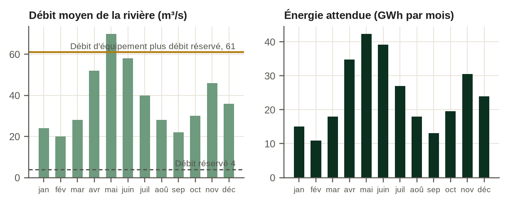
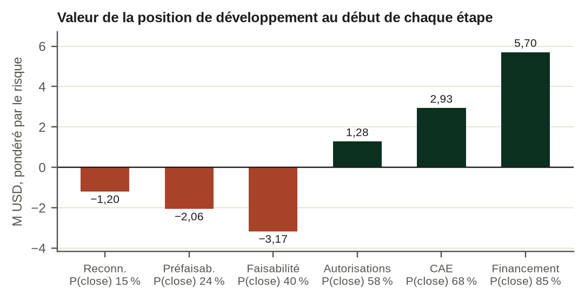
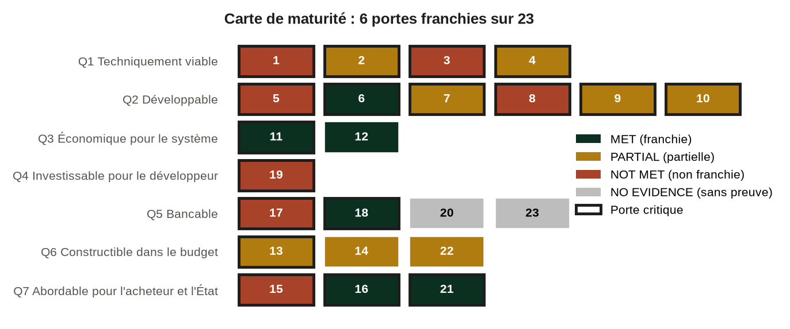

# À propos de ce livre

Livre 7. Développement et financement de l'hydroélectricité. De la rivière au bouclage financier : un cadre pour les développeurs, les prêteurs et les États, appliqué aux projets hydroélectriques en Afrique. Première édition française, version 1.0 release candidate 1 (prépublication), traduite de l'édition anglaise (édition brochée, ISBN-13 : 979-8178961780, publiée à compte d'auteur). L'ISBN de l'édition française reste à attribuer.

Le livre fait partie de la collection Africa Energy Finance, Business & Financial Models : une série de livres, de modèles financiers, de manuels, d'études de cas et d'outils de décision destinés aux entreprises du secteur de l'énergie sur les marchés africains. Chaque livre est construit autour d'une question centrale.

| Livre | Sujet | Question centrale | Statut |
|---|---|---|---|
| Livre 1 | Mini-réseaux | Ce mini-réseau peut-il devenir une entreprise durable ? | Prévu |
| Livre 2 | Systèmes solaires domestiques (PAYGo) | Le solaire PAYGo peut-il devenir rentable et finançable ? | Première édition |
| Livre 3 | Cuisson propre | La cuisson propre peut-elle se développer à grande échelle comme activité commerciale ? | Prévu |
| Livre 4 | Solaire commercial et industriel avec stockage | Le client doit-il investir, signer un contrat d'achat d'électricité (CAE) ou recourir à une société de services énergétiques ? | Prévu |
| Livre 5 | Fonds d'accès à l'énergie | Un fonds peut-il mobiliser des capitaux et générer des rendements durables ? | Prévu |
| Livre 6 | Compagnies d'électricité | La compagnie d'électricité peut-elle devenir financièrement viable ? | Prévu |
| Livre 7 | Hydroélectricité : ce livre | Ce projet hydroélectrique peut-il être développé jusqu'au bouclage financier et financé à des conditions que le développeur, les prêteurs et l'État peuvent chacun accepter ? | Première édition, v1.0 RC1 |

Chaque livre est au centre d'un ensemble de produits qui partagent une même méthode. Pour le Livre 7, ce sont :

| Produit | Nom | Rôle |
|---|---|---|
| Livre | Développement et financement de l'hydroélectricité (ce livre) | Expose la méthode et explique pourquoi elle fonctionne |
| Modèle | MODEL 7 : modèle de développement et de financement de l'hydroélectricité, v1.0 RC1 | Chiffre la méthode : modèle annuel sur 40 périodes, intégrant le projet, la compagnie d'électricité et les finances publiques, avec un module de développement, un filtre de développement à neuf portes, les 23 portes du bouclage financier, une carte du cadre et un contrôle de cohérence avec le livre |
| Manuel | MANUAL 7 : manuel d'utilisation et de méthodologie, v1.0 RC1 | Apprend au lecteur à utiliser le modèle |
| Cas | CASE 7 : Kasiri River Hydro, v1.0 RC1 | Applique la méthode à un projet fictif au fil de l'eau de 60 MW |
| Formation | Cours vidéo | Parcourt le livre et le modèle |

Le livre est conçu pour se suffire à lui-même. Un lecteur qui n'ouvre jamais le modèle perd les calculs chiffrés, pas le raisonnement.

## Ce que ce livre est, et ce qu'il n'est pas

Ce livre est un guide, à l'usage des comités d'investissement, du développement et du financement des projets hydroélectriques en Afrique. Il relie l'hydrologie, le risque de développement, le contrat d'achat d'électricité, la construction, le financement de projet, les rendements du développeur, la solvabilité de l'acheteur et l'exposition de l'État en un seul parcours jusqu'au bouclage financier, et il exige des preuves à chaque étape.

Ce n'est pas un manuel d'ingénierie hydroélectrique : la conception détaillée des barrages, des ouvrages hydrauliques et des turbines est bien traitée ailleurs. Mais un décideur doit pouvoir contester les chiffres de l'ingénieur ; le livre comporte donc un référentiel technique, les annexes N à R, sur l'hydrologie et l'énergie, l'aménagement et le génie civil, les équipements électromécaniques, la construction et l'exploitation, et la due diligence (audit préalable) environnementale et sociale, avec le niveau de détail nécessaire pour poser les bonnes questions et lire les réponses. Ce n'est pas non plus un ouvrage général de financement de projet : le dimensionnement de la dette, les ratios de couverture et les dispositifs de sûretés ne sont traités que dans la mesure où l'hydroélectricité et les acheteurs africains les modifient. Et ce n'est pas un guide de rédaction d'une étude de faisabilité.

C'est un cadre de décision pour quatre questions que se pose tout projet hydroélectrique avant que quiconque y engage davantage d'argent. Le projet doit-il se poursuivre ? Qui doit financer chaque étape ? Qui doit porter chaque risque ? Et est-il réellement prêt pour le bouclage ?

L'Afrique n'est pas un chapitre du livre ; elle est le cadre de chaque chapitre. La monnaie, la solvabilité des compagnies d'électricité publiques, le rôle des institutions de financement du développement (IFD) et du financement mixte, le coût du transport d'électricité, la capacité budgétaire de l'État et le risque de changement réglementaire déterminent les réponses tout au long du livre, et les preuves citées proviennent pour l'essentiel de projets africains.

# Préface

Ce livre pose une seule question : un projet hydroélectrique donné peut-il être développé jusqu'au bouclage financier et financé à des conditions que le développeur, les prêteurs et l'État peuvent chacun accepter ? La plupart des projets hydroélectriques africains qui n'atteignent jamais le bouclage n'échouent pas sur l'ingénierie. Ils échouent parce que l'une des trois parties ne peut pas accepter les conditions dont les deux autres ont besoin. Le développeur ne peut pas gagner assez pour justifier des années de dépenses à risque. Les prêteurs ne parviennent pas à se rassurer sur la rivière, l'entrepreneur ou l'acheteur. Ou bien l'on demande à l'État de porter des obligations que son budget ne peut pas supporter.

Le livre s'adresse aux personnes qui prennent ces décisions. Les développeurs et leurs directeurs financiers, qui construisent un plan de développement et un dossier de financement. Les chargés de crédit et les chargés d'investissement des institutions de financement du développement et des banques commerciales, qui dimensionnent la dette. Les gérants de fonds qui décident d'entrer ou non dans un projet avant ou après le bouclage. Les conseillers en transaction, qui doivent concilier tous ces acteurs. Et les agents des ministères des Finances et des cellules PPP, à qui un chapitre entier est consacré, car un dispositif de soutien que le ministère ne signera pas ne mène pas au bouclage.

Chaque chapitre éclaire une décision. Le chapitre 1 présente le modèle économique et explique pourquoi un projet hydroélectrique doit se lire comme trois investissements, et non un seul. Les chapitres 2 à 4 couvrent la ressource et la voie commerciale : la rivière, la configuration et le chemin vers un contrat d'achat d'électricité. Les chapitres 5 à 8 traitent du développement : les portes d'étape, le budget de développement, les autorisations et l'ensemble contractuel. Les chapitres 9 à 11 portent sur la construction et l'exploitation. Les chapitres 12 à 15 concernent le financement : le dimensionnement de la dette, la constitution du pool de prêteurs, les rendements du développeur et le volet public. Les chapitres 16 et 17 rassemblent l'analyse pour ceux qui portent le risque, au moyen des tests de résistance et des portes du bouclage financier. Le chapitre 18 déroule le cas complet.

## Quatre idées qui traversent le livre

Quatre idées reviennent dans chaque chapitre ; ensemble, elles forment la méthode du livre.

La première est qu'un projet hydroélectrique, ce sont trois investissements dans un seul actif : une option de développement, un contrat de construction et une rente d'exploitation. Chacun a son propre risque, son propre capital, son propre coût du capital et sa propre manière d'échouer. Un projet peut être un bon actif après la mise en service commerciale et une mauvaise décision au stade du développement ; le cas Kasiri le montre précisément.

La deuxième est que « faisable », « bancable », « investissable », « abordable » et « prêt » sont des mots différents pour des tests différents. Le livre distingue huit questions et répond à chacune avec ses propres preuves.

La troisième est qu'un projet n'atteint le bouclage que si trois parties l'acceptent en même temps : le développeur, les prêteurs et l'État. Une structure qui satisfait deux d'entre elles en reportant le risque sur la troisième n'est pas une solution ; c'est un transfert, et le livre le mesure.

La quatrième est que le bouclage financier résulte des preuves, et pas seulement de la négociation. Les 23 portes de maturité du livre, appliquées dans le modèle, transforment les huit questions en une décision de bouclage : STOP (arrêt), NOT READY (non prêt), CONDITIONAL GO (feu vert sous conditions) ou GO (feu vert).

La deuxième et la quatrième idée forment ensemble le Hydro Readiness Framework™, présenté dans l'introduction : huit questions, 23 portes, une décision de bouclage financier.

## La place de ce livre parmi les autres ouvrages

Le Livre 7 n'est pas le premier ouvrage à relier l'hydroélectricité et la finance, et il ne cherche pas à remplacer les ouvrages qui l'ont précédé.

Le guide public le plus complet est celui de l'IFC, *Hydroelectric Power: A Guide for Developers and Investors*, publié en 2015 [LIT:S1]. Il couvre l'ensemble du cycle de développement, du choix du site à l'exploitation. Selon ses propres termes, ses sections techniques « sont plus détaillées et peuvent servir de référence, tandis que les sections sur les permis et licences et sur le financement sont davantage conçues comme une vue d'ensemble » (notre traduction) [LIT:S1]. Le Livre 7 commence là où ce guide s'arrête. Le guide de l'IFC explique comment un projet hydroélectrique se développe ; ce livre explique comment décider s'il doit se poursuivre, comment il doit être financé, qui doit porter chaque risque et s'il est prêt pour le bouclage.

Le prédécesseur le plus proche par son objet semble être le *Hydro Finance Handbook* de 2008, décrit comme le support d'un tutoriel sur le financement de l'hydroélectricité donné à HydroVision 2008 et comme couvrant les aspects financiers du développement hydroélectrique et les étapes menant au bouclage financier [LIT:S2]. Nous n'avons pu en consulter qu'un résumé de recherche, et son éditeur et ses auteurs ne sont pas confirmés ici ; la comparaison repose donc sur cette description. Sur cette base, le Livre 7 s'en distingue de trois manières : il valorise l'étape de développement elle-même, avant tout financement ; il teste le projet à la fois du point de vue du développeur, des prêteurs et de l'État ; et il traite le bouclage financier comme le résultat de 23 portes de preuve plutôt que comme une suite d'étapes.

Le University of Cambridge Institute for Sustainability Leadership a publié en 2019 une introduction aux concepts et à la terminologie du financement de l'hydroélectricité durable dans les marchés émergents [LIT:S3]. Elle présente les termes et les concepts du financement de la grande hydroélectricité dans les marchés émergents, pour des lecteurs qui découvrent la finance, l'hydroélectricité ou les deux. Ce livre suppose ces bases acquises et s'en sert pour aboutir à une décision.

Les ouvrages généraux de financement de projet traitent le dimensionnement de la dette, les flux de trésorerie disponibles pour le service de la dette et les exigences des prêteurs de façon bien plus approfondie que ce livre ; parmi eux, le manuel de Gatti [LIT:S5] et, pour le secteur électrique, le guide pratique de Nongena sur la dette senior des projets d'électricité, annoncé par Springer pour 2026 [LIT:S4]. Ils ne sont spécifiques ni à l'hydrologie, ni aux compagnies d'électricité africaines, ni au bilan de l'État. Les lecteurs qui ont besoin de toute la mécanique du financement de projet devraient les lire en parallèle de ce livre.

**Tableau P.1. Ce que ce livre ajoute aux ouvrages existants**
{: .cap}

| Ouvrage | Son point fort | Ce qu'il laisse à d'autres | Ce que ce livre ajoute |
|---|---|---|---|
| Guide de l'IFC (2015) [LIT:S1] | Cycle de développement complet ; référentiel technique détaillé | Le financement et les permis, traités comme une vue d'ensemble | Les décisions de poursuivre, de financer et de boucler, avec les tests du développeur, des prêteurs et de l'État côte à côte |
| Hydro Finance Handbook (2008) [LIT:S2] | Les aspects financiers et les étapes jusqu'au bouclage financier, selon un résumé de recherche | Non confirmé : le texte intégral n'a pas été consulté | Valeur de développement pondérée par le risque ; le test de l'État à côté de celui des prêteurs ; 23 portes de preuve ; un modèle opérationnel |
| Document de travail du CISL (2019) [LIT:S3] | Concepts et terminologie pour les lecteurs qui découvrent la finance, l'hydroélectricité ou les deux | Une méthode de décision | Une séquence de décision chiffrée à chaque étape |
| Ouvrages de financement de projet [LIT:S4; LIT:S5] | Approfondissement des flux de trésorerie, du dimensionnement de la dette et des sûretés | L'hydrologie, les compagnies d'électricité africaines, l'exposition souveraine | Cas prêteurs propres à l'hydroélectricité, capacité de paiement de l'acheteur, passifs éventuels |
| Ce livre | Un cadre pour comité d'investissement consacré à l'hydroélectricité en Afrique, de la rivière au bouclage financier | La conception technique détaillée, couverte par le guide de l'IFC et les ouvrages d'ingénierie | |

*Note : Le tableau compare l'objet et le champ couvert tels que chaque ouvrage les présente ou, pour le manuel de 2008, tels qu'ils sont décrits dans un résumé de recherche ; ce n'est pas un classement.*

Le livre a aussi un pendant dans l'œuvre de l'auteur. Dans *Bankable Is Not Enough*, l'auteur soutient, à partir des projets de producteurs indépendants d'électricité (PIE) en Afrique, que la bancabilité seule peut aboutir à de mauvais contrats d'électricité. Le Livre 7 applique ce raisonnement à un seul secteur, où le capital est lourd, les recettes dépendent d'une rivière et l'État est presque toujours partie prenante, et il en fait une méthode pour décider si un projet doit être développé, financé et bouclé.

## Comment le livre s'articule avec le modèle

Le livre s'accompagne d'un classeur, MODEL 7, ainsi que d'un manuel d'utilisation et d'un cas pratique sur Kasiri River Hydro, un projet fictif au fil de l'eau de 60 MW situé dans la République de Navaria, elle aussi fictive, et développé par la société fictive Tamarind Hydro Ltd. Les chapitres renvoient au classeur par nom de feuille, afin que chaque concept puisse être testé sur des chiffres. Un lecteur qui préfère s'en tenir au texte peut ignorer ces renvois. Un lecteur qui les suit terminera le livre en sachant construire, contester et défendre un dossier d'investissement hydroélectrique.

Toutes les données d'entrée par défaut du classeur, et tous les chiffres de Kasiri, sont illustratifs. Ils ont été choisis pour rendre la mécanique visible et pour rester dans les fourchettes observées dans les sources publiques, non pour décrire un projet réel. Lorsque le livre cite des chiffres relatifs à des projets réels ou au secteur, il en indique la provenance et le degré de vérification. Lorsque des sources publiques se contredisent, le livre signale la contradiction plutôt que de retenir le chiffre le plus commode. Lorsqu'aucun chiffre public n'existe, comme pour les primes de développement ou le taux d'abandon étape par étape dans l'hydroélectricité africaine, le livre le dit et traite la valeur comme une hypothèse du modèle.

Un second projet fictif, Lumora Falls, un aménagement de 400 MW structuré en partenariat public-privé (PPP), sert de contrepoint aux chapitres 1, 2, 4 et 15. Il provient d'une note de politique publique antérieure de l'auteur sur l'hydroélectricité et les passifs publics, devenue un document d'accompagnement de ce livre.

## Ressources d'accompagnement

Les ressources qui accompagnent ce livre sont réunies dans un seul dossier en ligne. Scannez le code ci-dessous avec l'appareil photo d'un téléphone, ou saisissez l'adresse dans un navigateur web.

{: style="width:32mm"}

L'adresse, si vous préférez la saisir :

https://drive.google.com/drive/folders/1cLpEF8qvR_OMg0JKVFHKvLxtROvZAmfr

Le dossier contient sept sous-dossiers :

- **01_Hydro_Readiness_Framework** : le livre complet en PDF, ainsi que les huit questions, les 23 portes et l'échelle de décision sous forme de référence autonome.
- **02_Bankable_Hydro_Model** : MODEL 7, le classeur qui produit chaque chiffre de ce livre, avec ses rapports de test.
- **03_Model_User_Manual** : MANUAL 7, le manuel d'utilisation et de méthodologie, des guides vidéo commentés du modèle en anglais et en français, sous-titrés, et un guide audio.
- **04_Kasiri_River_Case** : le cas pratique du chapitre 18 et ses chiffres clés.
- **05_Transaction_Tools** : les versions modifiables des listes de contrôle et des modèles de documents des annexes A à I.
- **06_Technical_Due_Diligence** : les annexes N à R sous forme de référence autonome, en PDF et au format Word.
- **07_Sources_and_References** : la liste des sources avec leur statut de vérification, et les fichiers de recherche sur lesquels elle repose.

Les ressources en français se trouvent dans les mêmes dossiers, avec le suffixe _FR lorsqu'une version française existe.

Pour utiliser les ressources :

1. Ouvrez le dossier dans un navigateur web. Les fichiers peuvent être consultés et téléchargés, mais pas modifiés en ligne.
2. Téléchargez le classeur et ouvrez-le dans Microsoft Excel ou un tableur compatible. Il ne contient aucune macro.
3. Commencez par la feuille de couverture du classeur, puis suivez le guide vidéo ou le guide de démarrage rapide du manuel.
4. Travaillez sur votre propre copie. Ne remplacez les données d'entrée illustratives de Kasiri par les données d'un projet que dans cette copie, et consignez chaque hypothèse et sa source.
5. Vérifiez que la version indiquée sur la couverture du classeur correspond à celle de ce livre. Des ressources mises à jour peuvent être ajoutées au même dossier sous un nouveau numéro de version.

Si le code ou l'adresse n'ouvre plus le dossier, cherchez une adresse mise à jour sur la page de l'auteur chez le libraire auprès duquel vous avez acheté ce livre.

## Conventions

Le cas Kasiri se déroule en temps de modèle : développement à partir de 2021, bouclage financier en 2027 et mise en service commerciale en 2030. Quand le livre indique que Tamarind en est au début de l'obtention des permis, il désigne l'étape atteinte, non une date du calendrier.

Sauf indication contraire, les montants sont exprimés en dollars des États-Unis (USD), et « M USD » signifie millions de dollars des États-Unis. Sauf mention contraire, les montants du modèle sont nominaux ; les coûts d'investissement exprimés « en termes réels 2026 » s'entendent avant indexation. L'énergie est exprimée en GWh et la puissance en MW. P50 et P90 désignent l'énergie dépassée avec une probabilité de 50 et de 90 % ; la distinction entre P90 à un an et P90 à dix ans est expliquée au chapitre 2. Les coûts unitaires sont étiquetés selon leur périmètre (centrale, base de financement, emplois totaux ou système), car un chiffre en USD/kW sans périmètre ne peut être comparé à rien. Les montants négatifs sont précédés du signe moins. L'édition anglaise suit l'orthographe britannique.

## Sources et preuves

Le livre s'appuie sur quatre types de matériaux et indique pour chacun sa nature. Les preuves institutionnelles proviennent d'organismes tels que le Groupe de la Banque mondiale, la Banque africaine de développement, l'IRENA et les régulateurs nationaux ; les informations publiées par les institutions de financement du développement sur leurs projets sont rangées dans la même catégorie. Les sources secondaires sont la presse spécialisée et les guides de cabinets d'avocats qui rendent compte de ces documents. Une hypothèse du modèle est une donnée d'entrée du classeur d'accompagnement, choisie pour rendre la mécanique visible. Un résultat illustratif du cas est un chiffre produit par le classeur pour Kasiri ; ce n'est jamais une référence pour des projets réels.

Plusieurs chiffres de ce livre peuvent facilement être pris pour des constats sur l'hydroélectricité africaine. La plupart n'en sont pas, et le tableau ci-dessous donne le statut de chacun.

**Tableau P.2. Statut des principaux chiffres utilisés dans le livre**
{: .cap}

| Chiffre | Valeur | Statut | Ce qu'il n'est pas |
|---|---|---|---|
| Facteur de charge de Kasiri | 55,6 % | Résultat illustratif du cas | Une référence pour l'hydroélectricité africaine ; les chiffres de l'IRENA sont cités séparément aux chapitres 2 et 3 |
| Probabilité d'atteindre le bouclage à partir de la reconnaissance | 15 % | Hypothèse du modèle, éclairée par le chapitre 5 | Un taux d'abandon mesuré ; aucun n'est publié pour l'hydroélectricité africaine |
| Dépassement de coûts réel des grands barrages, médiane et moyenne de la classe de référence | 27 % et 96 % | Preuve publique [HY-08] | Une prévision pour un projet donné |
| Prime de développement | 3 % du coût de la centrale | Hypothèse du modèle | Un taux de marché ; aucune donnée publique n'a été trouvée [DE:BENCH] |
| TRI du développeur sur le scénario de succès | 16,0 % | Résultat illustratif du cas | Un rendement espéré |
| VAN du développeur pondérée par le risque | −0,95 million USD | Résultat illustratif du cas | Une valorisation d'une position réelle |
| Décision de bouclage financier | STOP : une porte critique n'est pas franchie | Résultat illustratif du cas, à partir des statuts de preuve saisis pour le cas | Un verdict sur un projet réel |

Chaque affirmation externe porte un identifiant de source entre crochets, par exemple [HY-08] ou [DE:S1], qui renvoie à l'annexe L. L'annexe indique, pour chaque source, si son texte intégral a été lu, seulement sa page d'accueil, ou seulement un résumé de moteur de recherche. Les affirmations qui reposent sur un résumé sont signalées comme telles et doivent être vérifiées sur l'original avant d'être citées.

## Statut de cette édition

Ceci est la première édition du Livre 7, diffusée en version 1.0 release candidate 1 pour relecture avant publication. Elle remplace, pour les développeurs et les prêteurs, la note de politique publique antérieure de l'auteur sur la structuration de l'hydroélectricité sans passifs publics insoutenables, dont le contenu est condensé au chapitre 15. Trois conditions doivent être remplies avant la publication : les sources signalées comme résumés à l'annexe L doivent être lues en intégralité ; le modèle d'accompagnement doit achever son test dans Microsoft Excel (il a été recalculé dans LibreOffice, reproduit cellule par cellule par un second moteur de calcul, soumis deux fois à une revue contradictoire et corrigé ; l'annexe K en donne les résultats) ; et des praticiens doivent relire le texte.

## Remerciements et avertissement

L'analyse et les éventuelles erreurs relèvent de l'auteur. Rien dans ce livre ne constitue un conseil en investissement, ni un conseil juridique, fiscal ou comptable. Les lecteurs doivent consulter un professionnel dans la juridiction concernée avant d'agir sur cette base.

# Introduction : comment lire un projet hydroélectrique

Un projet hydroélectrique se lit dans un ordre fixe, et cet ordre compte davantage que n'importe quel ratio pris isolément. Chaque maillon de la chaîne ci-dessous reçoit une donnée du maillon précédent et transmet un résultat au suivant. Une faiblesse repérée tôt, dans la série de débits ou dans la séquence des permis, descend la chaîne et arrive, amplifiée, au dimensionnement de la dette et au bouclage.

| Maillon | Question | Ce qu'il transmet | Chapitres |
|---|---|---|---|
| Rivière et site | Y a-t-il ici une ressource qui mérite d'être développée ? | Bassin versant, hauteur de chute, accès, usages concurrents | 2, 3 |
| Preuves hydrologiques | Quelle est la qualité de la série de débits, et quelle est l'incertitude sur l'énergie ? | Série de débits, P50, P90 à un an et à dix ans | 2 |
| Configuration | Que faut-il construire ? | Débit d'équipement, MW, énergie par saison, enveloppe de coûts | 3 |
| Voie de commercialisation | Qui achète, par quelle voie, à quel tarif ? | Voie du CAE (PPA), forme du tarif, indexation, monnaie | 4 |
| Plan de développement | Que faut-il faire, dans quel ordre, à quel coût et avec quelle probabilité ? | Plan par étapes, budget, probabilités de passage des portes d'étape | 5, 6 |
| Autorisations | Quels permis conditionnent quels autres ? | Séquence des autorisations, chemin critique, conditions environnementales et sociales | 7 |
| Ensemble contractuel | La chaîne de contrats est-elle bancable et cohérente ? | Concession, CAE, raccordement au réseau, accords directs, indemnités de résiliation | 8 |
| Construction | Qui prend en charge la géologie et les retards, et à quel prix ? | Structure contractuelle, provisions pour aléas, part des dépassements à la charge du maître d'ouvrage | 9, 10 |
| Exploitation | Qui exploite l'ouvrage, et combien coûtera son maintien en disponibilité ? | Modèle d'O&M, disponibilité, réserves, assurances | 11 |
| Dette | Combien de dette senior, sur quelle durée, sur quel cas ? | Montant de la dette, DSCR, LLCR, comptes de réserve | 12 |
| Pool de prêteurs | Quels prêteurs, quelles garanties et quelles assurances ? | Club d'IFD, couverture, tranches en monnaie locale | 13 |
| Rendements du développeur | Le projet est-il investissable pour le développeur, et à quel prix peut-il céder une partie de sa participation ? | VAN pondérée par le risque, prime, TRI, valeur de cession partielle | 14 |
| Obligations publiques | À quoi l'État s'engage-t-il, et peut-il le supporter ? | Capacité de paiement, soutien, passifs éventuels | 15 |
| Résistance | Qu'est-ce qui cède en premier, et qui le porte ? | Débit de point mort, dépassement, distance au défaut | 16 |
| Bouclage financier | Feu vert, feu vert sous conditions ou arrêt, sur quelles preuves ? | Statut des portes, décision et conditions | 17, 18 |

## Le Hydro Readiness Framework™ : huit questions, 23 portes, une décision de bouclage financier

On qualifie souvent les projets hydroélectriques de « faisables » ou de « bancables » comme si ces mots signifiaient la même chose. Le livre distingue huit questions, car un projet peut réussir l'une et échouer à la suivante, et chacune trouve sa réponse dans un document ou un test différent. Chaque question doit être acceptée par une partie donnée, et chacune est testée par un sous-ensemble des 23 portes du bouclage financier du chapitre 17. La huitième question, prêt pour le bouclage, est la somme des sept autres.

| Question | Réponse apportée par | Doit être acceptée par | Portes | Piège typique |
|---|---|---|---|---|
| Q1. Le site est-il techniquement viable ? | Étude de faisabilité et reconnaissance géotechnique (chapitres 2, 3, 9) | Développeur, prêteurs | 1 à 4 | Une étude de faisabilité fondée sur une série de débits courte ou synthétique présentée comme une longue série |
| Q2. Le projet est-il développable ? | Séquence des autorisations, droits fonciers et droits d'eau, voie du CAE (chapitres 5, 7) | Développeur, État | 5 à 10 | Engager des dépenses de faisabilité bancable avant que la voie du CAE et les droits d'eau soient sécurisés |
| Q3. Est-il économique pour le système électrique ? | Plan de développement à moindre coût, LCOE comparé aux solutions de rechange (chapitres 3, 4) | État | 11, 12 | Citer le coût de la centrale alors que le système paie la centrale et la ligne |
| Q4. Est-il investissable pour le développeur ? | VAN de développement pondérée par le risque, prime, valeur de cession partielle (chapitres 6, 14) | Développeur | 19 | Prendre le TRI des fonds propres au bouclage pour le rendement du développeur, en ignorant les dépenses à risque et la probabilité d'échec |
| Q5. Est-il bancable ? | Cas prêteurs, DSCR, LLCR, dispositif de sûretés (chapitres 12, 13) | Prêteurs | 17, 18, 20, 23 | Un projet protégé par des garanties de dernier recours, de sorte que les prêteurs ne voient aucun risque |
| Q6. Est-il réalisable dans le budget ? | Structure contractuelle, provisions pour aléas, classe de référence (chapitres 9, 10) | Développeur, prêteurs | 13, 14, 22 | Un contrat EPC « à prix fixe » qui exclut les conditions géologiques |
| Q7. Est-il abordable pour l'acheteur et l'État ? | Capacité de paiement, dispositif de soutien, passifs éventuels (chapitre 15) | État | 15, 16, 21 | Un projet bancable dont les montages reportent le risque sur le Trésor |
| Q8. Est-il prêt pour le bouclage ? | Portes du bouclage financier fondées sur les preuves (chapitre 17) | Les trois parties | Les 23 | Considérer une term sheet (feuille de modalités) signée comme une opération bouclée |

Un projet qui franchit Q1 à Q7 sur preuves atteint CONDITIONAL GO lorsque toutes les portes critiques sont franchies, et GO lorsque les 23 le sont. Pour Kasiri, au début de l'obtention des permis, la réponse est STOP : le cadre ne dit pas que le projet est mauvais, il dit quelles questions restent ouvertes et qui doit les régler.

La suite du livre suit la chaîne dans l'ordre.

# Chapitre 1. Le projet hydroélectrique : trois investissements dans un seul actif

Ce chapitre éclaire une décision qui précède toutes les autres dans ce livre : quel type de capital doit financer quelle phase d'un projet hydroélectrique, et donc quels chiffres chaque partie doit lire en premier. Un projet financé comme s'il s'agissait d'un seul investissement sera évalué comme un seul investissement, et ce prix sera faux pour au moins deux de ses trois phases. Le chapitre présente les trois investissements que contient un projet hydroélectrique, montre où se créent la valeur et la trésorerie et où elles divergent, décrit qui développe l'hydroélectricité en Afrique et comment les projets échouent, puis explique l'organisation du reste du livre et du classeur d'accompagnement.

*Place dans la chaîne d'analyse : le cadre de toute la chaîne, les trois investissements que contient un projet.*

*Qui doit accepter la réponse : le développeur, les prêteurs et l'État.*

## 1.1 Trois investissements dans un seul actif

Vu de loin, un projet hydroélectrique est un actif unique : un seuil ou un barrage, un ouvrage d'amenée, une centrale et une ligne vers le réseau, détenus par une société de projet dédiée qui vend son électricité au titre d'un seul contrat d'achat d'électricité (CAE). Vu de l'intérieur, ce sont trois investissements réalisés l'un après l'autre, chacun avec ses risques, ses investisseurs et son coût du capital.

Le premier est une option de développement. Avant toute construction, un développeur dépense de l'argent pendant des années en études, jaugeages, permis, foncier, négociations et conseillers, sans aucune assurance que le projet atteindra un jour le bouclage financier. S'il l'atteint, le développeur est remboursé et perçoit en général une prime. Sinon, l'argent est perdu. C'est du capital-risque qui ne dit pas son nom, et il doit être rémunéré comme du capital-risque.

Le deuxième est un contrat de construction. Du bouclage financier à la mise en service commerciale, les propriétaires et les prêteurs du projet sont exposés à la géologie, à la performance de l'entrepreneur, aux retards et à l'interface avec la ligne de transport. Les montants en jeu sont bien plus élevés qu'en phase de développement, et le risque est d'une autre nature : c'est le risque que l'actif coûte plus cher ou prenne plus de temps que prévu. Dans l'hydroélectricité, plus que dans toute autre technologie de production d'électricité, ce risque se trouve sous terre.

Le troisième est une rente d'exploitation. Une fois la centrale en marche, le projet devient une créance de longue durée sur deux choses : la rivière et l'acheteur. Les revenus dépendent du débit de l'eau et de la capacité de la compagnie d'électricité à payer. Ce sont les prêteurs et les détenteurs de fonds propres à long terme qui évaluent cette phase, et ils l'évaluent à un coût du capital bien inférieur à celui du développement ou de la construction, à condition que la rivière et l'acheteur aient été bien compris.

| Domaine | Option de développement | Contrat de construction | Rente d'exploitation |
|---|---|---|---|
| Période | Du site au bouclage financier, souvent cinq ans ou plus | Du bouclage à la mise en service commerciale | De la mise en service commerciale à la fin de la concession |
| Principaux risques | Permis, CAE, foncier, preuves hydrologiques, échec du bouclage | Géologie, performance de l'entrepreneur, retard, interface avec la ligne | Hydrologie, paiement par l'acheteur, change, O&M, réglementation |
| Qui le finance | Fonds propres du développeur, co-développeurs, facilités de préparation de projets | Fonds propres, dette senior, provisions pour aléas, fonds propres de réserve | Service de la dette senior, distributions, refinancement |
| Comment la valeur apparaît | Revalorisations aux étapes clés ; prime au bouclage | Achèvement ; pénalités forfaitaires ; libération des provisions pour aléas | DSCR, distributions, plus-values de refinancement |
| Échec typique | Dépenser au-delà d'une porte que le projet aurait dû échouer à franchir | Dépassement au-delà des provisions pour aléas ; défaillance de l'entrepreneur | Arriérés de l'acheteur ; une série d'années sèches ; une dévaluation brutale |

Une bonne partie des erreurs coûteuses dans l'hydroélectricité vient du financement de l'un de ces investissements avec un capital destiné à un autre. Des dépenses de développement financées sur le budget d'exploitation d'une compagnie d'électricité s'arrêtent dès que ce budget est réduit. Des dépassements de construction financés par des prêteurs qui ont dimensionné leur dette sur la rente d'exploitation provoquent un défaut. Des flux d'exploitation rémunérés aux rendements exigés en phase de développement produisent des tarifs que l'acheteur ne peut pas payer.

## 1.2 Comment se créent la valeur et la trésorerie

Dans un projet hydroélectrique, la valeur se crée à trois moments, et la trésorerie n'arrive à aucun d'eux.

Le premier est le bouclage financier. Le jour où les contrats sont signés et où la dette devient disponible, un ensemble de permis, d'études et d'accords qui ne valait presque rien la veille pour un tiers devient un projet finançable. Le développeur capte une partie de cette valeur par le remboursement de ses coûts de développement et une prime de développement, et une autre partie par sa part des fonds propres.

Le deuxième est la mise en service commerciale. Une fois la centrale construite et en marche, le risque de construction a disparu. Des investisseurs qui exigeraient un rendement de phase de construction acceptent désormais un rendement d'actif en exploitation, et les mêmes flux futurs valent davantage. C'est cette revalorisation qui permet à un développeur de vendre une partie de sa participation après la mise en service commerciale et de réinvestir le produit dans son projet suivant.

Le troisième est la longue période d'exploitation. Les revenus arrivent chaque mois, le service de la dette est payé deux fois par an, et les distributions ne commencent qu'une fois les tests des prêteurs satisfaits.

Le cas Kasiri illustre ce profil. Tamarind Hydro dépense environ 9,0 millions USD, en dollars de 2026, sur 6 ans de développement. Dans le modèle, la probabilité qu'un projet au stade de la reconnaissance atteigne le bouclage est d'environ 15 %, une hypothèse du modèle fondée sur les éléments du chapitre 5. Si Kasiri boucle, le total des emplois atteint environ 215 millions USD, dont environ 145 millions USD de dette senior. Sur le scénario de succès, le taux de rendement interne (TRI) du développeur sur toute la période, de la première étude à la dernière distribution, est de 16,0 %, y compris la vente de la moitié de sa participation à la mise en service commerciale. Pondérée par la probabilité d'échec, la valeur actuelle nette (VAN) espérée du même développeur, à un taux d'actualisation de 25 %, est de −0,95 million USD.

Ces deux chiffres décrivent le même projet. Le premier répond à la question « que gagne le développeur s'il réussit ? ». Le second répond à la question « un développeur doit-il se lancer ? ». Le chapitre 14 porte sur l'écart entre les deux.

## 1.3 Qui développe l'hydroélectricité en Afrique

Trois types de développeurs mènent des projets hydroélectriques jusqu'au bouclage en Afrique subsaharienne.

Les compagnies d'électricité publiques et les gouvernements développent la plupart des grands aménagements, souvent avec des crédits à l'exportation ou des financements bilatéraux et un entrepreneur EPC (ingénierie, approvisionnement et construction) qui arrange aussi le prêt. Julius Nyerere, en Tanzanie, a été financé sur le budget de l'État [A2:S65]. Isimba et Karuma, en Ouganda, ont été financés à 85 % par China Exim [A2:S34; A2:S40].

Les développeurs privés, souvent des sociétés régionales soutenues par des institutions de financement du développement (IFD), développent la plupart des petites et moyennes centrales. L'examen de la participation privée dans la grande hydroélectricité publié par la Banque mondiale en 2024 constate, à l'échelle mondiale, que la participation privée chute fortement avec la taille de la centrale : 74 % des centrales de moins de 10 MW contre 8 % des centrales de plus de 2 500 MW [HY-06]. Le programme GET FiT de l'Ouganda a soutenu un portefeuille composé surtout de petites centrales hydroélectriques privées ; KfW estimait qu'environ 94 millions EUR de fonds publics permettraient environ 450 millions EUR d'investissement privé [DE:S35].

Les IFD sont de plus en plus souvent co-développeurs. IFC InfraVentures finance une part minoritaire des coûts de développement, en moyenne environ 4 millions USD pour une participation de 20 à 30 % [DE:S2]. Le Sustainable Energy Fund for Africa (Fonds pour l'énergie durable en Afrique) de la Banque africaine de développement a accordé un don d'environ 1 million USD pour préparer un projet hydroélectrique communautaire de 7,8 MW au Kenya [DE:S17].

Ce livre s'adresse surtout aux deuxième et troisième groupes, ainsi qu'aux prêteurs et aux ministères qui traitent avec eux. Son cas principal est un projet privé de 60 MW, car c'est l'échelle à laquelle le développeur privé tient le premier rôle.

## 1.4 Comment les projets hydroélectriques échouent

Les projets hydroélectriques échouent selon trois schémas, un par investissement.

Le développement s'enlise. Ngonye Falls, en Zambie, est en développement depuis plus de dix ans sans avoir atteint le bouclage financier [DE:S3]. Ruzizi III, un partenariat public-privé (PPP) régional, est en préparation depuis au moins 2009 sans avoir atteint le bouclage financier [A2:S21; A2:S22]. L'essentiel de l'argent dépensé pour de tels projets n'est jamais récupéré.

La construction dérape. La classe de référence des grands barrages montre un dépassement de coûts réel médian de 27 % et moyen de 96 % [HY-08]. Parmi les exemples africains figurent une hausse de coûts de 27 % à Bui [A1:S38], une hausse de 47 % du marché principal de génie civil à Rusumo [A2:S16] et une mise en service avec plusieurs années de retard à Karuma [A2:S40]. La classe de référence porte sur les grands barrages, pas sur les centrales moyennes au fil de l'eau ; c'est donc un avertissement plutôt qu'une prévision calibrée pour un projet comme Kasiri.

La rente d'exploitation se rompt. Une série d'années sèches réduit les revenus. À Kariba, l'eau allouée à la production en 2024 était de 16 milliards de mètres cubes [R1:S1], soit environ la moitié de l'allocation de 2023 selon la presse [CL-04]. Un acheteur qui ne peut pas payer laisse des arriérés : l'ECG du Ghana devait environ 612 millions USD à la Bui Power Authority en mars 2023 [A1:S40]. Une dévaluation brutale multiplie du jour au lendemain le coût en monnaie locale d'un tarif libellé en dollars.

Aucun de ces échecs n'apparaît d'abord dans le compte de résultat du projet. Tous apparaissent d'abord dans le budget de développement, la série de débits, la structure contractuelle et la trésorerie de l'acheteur.

## 1.5 Un contraste : Lumora Falls

Le précédent document de politique publique de l'auteur prenait comme cas un PPP fictif de 400 MW, Lumora Falls. Le tarif de Lumora plaçait environ 71 % des revenus dans un paiement de capacité, que la compagnie d'électricité doit, que la rivière coule ou non. En conséquence, une sécheresse de trois ans modifiait à peine le rendement des fonds propres de Lumora, et la principale conclusion du document portait sur l'État, pas sur le développeur : la couverture de la dette du projet restait solide, alors que les dispositifs qui la rendaient solide transféraient le risque sur la compagnie d'électricité et le Trésor.

Kasiri est le cas inverse. Son tarif ne rémunère que l'énergie livrée, comme dans les tarifs d'achat garantis d'Afrique de l'Est, si bien que la rivière est le problème du développeur. Sa taille fait que l'exposition de l'État est faible par rapport au budget. Et son développeur doit décider, à chaque étape, s'il continue à dépenser. Ensemble, les deux cas montrent pourquoi la même méthode donne des réponses différentes pour des projets différents, et pourquoi le lecteur ne doit jamais transposer une conclusion de l'un à l'autre sans vérifier d'abord la structure tarifaire.

## 1.6 Organisation du livre et du classeur

Le livre compte 18 chapitres, construits autour de la question centrale. Les chapitres 2 à 4 traitent de la ressource et de la voie commerciale. Les chapitres 5 à 8 traitent du développement : les portes d'étape, le budget, les autorisations et les contrats. Les chapitres 9 à 11 traitent de la construction et de l'exploitation. Les chapitres 12 à 15 traitent du financement, du cas des prêteurs au volet public. Les chapitres 16 et 17 traitent des tests de résistance et du bouclage financier, et le chapitre 18 parcourt le cas Kasiri du site au bouclage.

Le classeur d'accompagnement, MODEL 7, est un modèle annuel sur 40 périodes, avec 41 feuilles, dont une page de garde, et environ 11 300 formules, sans macros ni références circulaires. Il relie l'hydrologie, le transport, la demande, la trésorerie de la compagnie d'électricité, le CAE, le financement de projet, cinq structures de financement, le soutien de l'État, les passifs éventuels et un filtre budgétaire. Un module de développement couvre les années précédant le bouclage, un module de contractualisation compare les structures de contrat de construction, et une feuille de maturité applique 23 portes de bouclage financier. Ses 14 contrôles d'intégrité confirment la cohérence interne, pas le réalisme des hypothèses. Le modèle a fait l'objet d'une revue critique avant cette édition ; cette revue a trouvé et corrigé des défauts que les propres contrôles du modèle n'avaient pas détectés, et l'annexe K consigne les modifications. Le classeur, son manuel et les autres ressources d'accompagnement peuvent être téléchargés depuis le dossier décrit sous « Ressources d'accompagnement », dans la préface. Deux feuilles le relient à ce livre : *34_FRAMEWORK_MAP* rattache chacune des 23 portes à sa question du cadre, à la partie qui doit l'accepter, à la feuille qui la teste et aux chapitres qui la traitent ; *35_BOOK_CHECK* compare le modèle actif avec chaque chiffre de Kasiri imprimé ici et affiche ALL PASS (tous les contrôles réussis) avec les données d'entrée par défaut.

Le classeur ne note jamais un projet. Sa feuille de maturité ne compte chaque porte que sur preuve et applique une règle fixe : STOP (arrêt) lorsqu'une porte critique n'est pas franchie ou que sa preuve manque, CONDITIONAL GO (feu vert sous conditions) lorsque toutes les portes critiques sont franchies, GO (feu vert) seulement lorsque toutes les portes sont franchies. Dans son état par défaut, Kasiri franchit 6 des 23 portes et affiche « STOP : une porte critique n'est pas franchie ». C'est un constat sur l'état des preuves du projet, pas un jugement sur le projet.

## Points pour les comités d'investissement et de crédit

1. Demander au promoteur de présenter le projet comme trois investissements, avec le budget de développement, le budget de construction et le cas d'exploitation présentés séparément, chacun avec son financement et son rendement cible.
2. Lire deux fois le rendement du développeur : sur le scénario de succès et pondéré par la probabilité d'échec. Considérer comme incomplète toute présentation qui ne montre que le premier.
3. Identifier qui porte le risque de la rivière. Si le tarif rémunère l'énergie, la série de débits est le cœur du crédit ; s'il rémunère la capacité, c'est le bilan de l'acheteur.
4. Vérifier que le risque de construction est financé par un capital capable de l'absorber : provisions pour aléas, fonds propres de réserve ou facilité de dépassement, et non une dette senior dimensionnée sur le cas d'exploitation.
5. Tester la capacité de paiement de l'acheteur avant de négocier le tarif, et décider ouvertement qui finance un éventuel déficit.
6. Ne pas transposer les conclusions d'un grand aménagement en PPP à un projet privé de taille moyenne, ou inversement, sans vérifier la structure tarifaire et l'ampleur de l'exposition de l'État.

## Travailler avec le modèle

Ouvrir d'abord *01_CONTROL_PANEL* : cette feuille fixe le cas, le cas de production pour les flux de trésorerie et pour le dimensionnement de la dette, la structure de financement et les options de stress. Lire ensuite *32_DASHBOARD*, qui présente côte à côte les résultats du projet, les résultats financiers, ceux du développeur, du système électrique, de la compagnie d'électricité et des finances publiques. *01A_DEVELOPMENT* contient le budget de développement, les probabilités par étape et les rendements du développeur ; *05A_CONTRACTING* compare les structures de contrat de construction ; *30A_CLOSE_READINESS* applique les 23 portes. *33_CHECKS* doit afficher ALL OK (tout est correct) avant que l'on se fie à un résultat.

# Chapitre 2. La rivière, la série de débits et le risque hydrologique

Ce chapitre éclaire une décision prise deux fois : les preuves hydrologiques sont-elles suffisantes pour engager des dépenses de faisabilité, puis, plus tard, sont-elles suffisantes pour dimensionner la dette ? Les deux seuils diffèrent. Un développeur peut justifier une étude de faisabilité par une série courte et une corrélation régionale ; un prêteur ne peut pas justifier un prêt de seize ans sur les mêmes preuves. Le chapitre explique comment le débit devient de l'énergie, comment se mesure l'incertitude sur l'énergie, pourquoi un P90 à un an et un P90 à dix ans répondent à des questions différentes, et pourquoi la structure tarifaire détermine qui porte le risque de la rivière.

*Place dans la chaîne d'analyse : les preuves hydrologiques, premier maillon dont dépendent tous les chiffres suivants.*

*Qui doit accepter la réponse : le développeur et les prêteurs.*

## 2.1 Quatre notions de capacité

Les documents de financement regorgent de chiffres de capacité, qui ne signifient pas tous la même chose. La puissance installée est la puissance nominale des groupes de production. La puissance disponible est la puissance installée multipliée par la part du temps pendant laquelle les groupes peuvent fonctionner, après les arrêts programmés et les arrêts fortuits. La production attendue est l'énergie que la rivière permet en moyenne ; elle dépend du débit, de la hauteur de chute et de la fréquence à laquelle le débit dépasse ce que les turbines peuvent utiliser. L'énergie contractuelle est celle à laquelle se réfère le contrat d'achat d'électricité (CAE, ou PPA) ; elle peut différer à la fois de l'énergie livrée, en raison de l'écrêtement, et de l'énergie payée, en raison des clauses d'énergie réputée livrée.

L'écart entre puissance nominale et énergie peut être important. Belo Monte, au Brésil, compte 11 233 MW installés pour 4 571 MW d'énergie garantie [INT:S8]. Pour une centrale au fil de l'eau comme Kasiri, cet écart est déterminé par le profil saisonnier de la rivière : pendant les mois secs, les turbines fonctionnent bien en dessous de leur puissance nominale.

## 2.2 La série de débits

Tout ce qui, dans ce livre, dépend de l'énergie dépend de la série de débits. Le guide de l'IFC destiné aux développeurs hydroélectriques indique que les données de débit doivent couvrir au moins 15 ans pour permettre des conclusions fiables [DE:S1]. Peu de sites africains disposent d'autant de données mesurées à la prise d'eau. La plupart des développeurs lancent un programme de jaugeage au stade de la préfaisabilité et prolongent la courte série mesurée sur site par corrélation avec une station régionale disposant d'une série plus longue.

Cette pratique est saine si elle est bien menée et décrite honnêtement. Les questions que posera le conseiller des prêteurs sont concrètes. Combien d'années ont été mesurées sur site, et combien ont été reconstituées ? Quelle est la qualité de la corrélation, et sur quelle plage de débits a-t-elle été testée ? Les courbes de tarage ont-elles été vérifiées aux débits élevés, où se concentre l'essentiel de l'incertitude ? Y a-t-il des lacunes, et comment ont-elles été comblées ? L'occupation des sols en amont, des prélèvements ou un nouveau barrage ont-ils modifié la rivière depuis le début de la série régionale ?

Dans le modèle, la série est décrite par deux données d'entrée de la feuille *03_HYDROLOGY* : le nombre d'années fiables et le degré de maturité de l'étude hydrologique, de l'étude documentaire à la revue indépendante. Kasiri dispose de 12 ans, qui combinent un jaugeage sur site depuis la préfaisabilité et une corrélation régionale, et d'une étude de niveau faisabilité qui n'a pas encore fait l'objet d'une revue indépendante. La porte 1 de la feuille de maturité pour le bouclage financier affiche donc NOT MET (non franchie). C'est l'état normal d'un projet au stade de Kasiri, et cela indique au développeur où dépenser ensuite.

## 2.3 Du débit à l'énergie

Pour chaque mois, le modèle calcule le débit utilisable, la puissance moyenne et l'énergie :

> Qutil = min( max(Q − Qrés, 0), Qéquip )
>
> P = min( ρ · g · Qutil · H · ηturbine · ηalternateur / 106 , Pinst )
>
> E = P × heures × disponibilité / 1000

Q est le débit moyen de la rivière en m³/s, Qrés le débit réservé, Qéquip le débit nominal des turbines, H la hauteur de chute nette en mètres, η les rendements, P en MW et E en GWh. Pour Kasiri, les débits moyens mensuels vont de 20 à 70 m³/s, le débit d'équipement est de 57 m³/s, le débit réservé de 4 m³/s et la hauteur de chute nette de 120 m. L'énergie moyenne de long terme, le P50, est d'environ 292 GWh par an, soit un facteur de charge de 55,6 %. L'IRENA classe les centrales de plus de 10 MW dans la grande hydroélectricité et indique un facteur de charge moyen pondéré de 48 % pour la grande hydroélectricité mise en service en Afrique entre 2018 et 2024, dans une fourchette de 33 à 81 % entre le 5e et le 95e centile [HY-01]. Le chapitre 3 compare Kasiri aux deux catégories de taille.

Les équations masquent un biais qui compte pour le financement. L'énergie est une fonction concave du débit : elle augmente avec le débit jusqu'à ce que les turbines soient à pleine charge, puis plafonne. Appliquer la fonction aux débits moyens mensuels surestime l'énergie moyenne, car l'eau déversée les années humides ne compense pas l'énergie perdue les années sèches. Le guide de l'IFC note que même une moyenne mensuelle peut surestimer l'énergie de 10 % ou plus par rapport à des pas de temps plus courts [DE:S1]. Pour une estimation bancable, l'énergie doit être calculée mois par mois, ou à un pas plus fin, sur toute la série, puis moyennée. Le modèle accepte une série simulée lorsqu'elle existe et signale le biais dans le cas contraire.

## 2.4 P50, P90 à un an et P90 à dix ans

Les prêteurs dimensionnent la dette sur un cas de production défavorable. La référence habituelle est un P90 : l'énergie dépassée avec une probabilité de 90 %. En l'absence de série simulée complète, le modèle utilise le coefficient de variation (CV) de l'énergie annuelle :

> P90un an = P50 × (1 − 1,2816 × CV)

Avec un CV de 15 %, le P90 à un an de Kasiri est d'environ 236 GWh.

Un P90 à un an décrit une seule mauvaise année. Un prêt de seize ans est remboursé sur de nombreuses années, et la moyenne de nombreuses années est bien moins incertaine que chacune d'elles, sauf si les années sèches se regroupent. Le modèle calcule donc aussi le P90 de la moyenne sur dix ans, en tenant compte de la persistance au moyen d'un coefficient de corrélation d'une année sur l'autre ρ :

> P90dix ans = P50 × (1 − 1,2816 × CV × √((1 + ρ) / (1 − ρ) / 10))

Avec ρ = 0,3, le P90 à dix ans de Kasiri est d'environ 268 GWh, bien plus proche du P50 que le chiffre à un an.

Le choix entre les deux n'est pas technique. C'est une négociation sur la question de savoir qui porte le risque de persistance. Dimensionner la dette sur le P90 à un an pour chaque année du prêt est prudent pour la moyenne mais ne dit rien des séries d'années sèches ; dimensionner sur le P90 à dix ans est plus généreux mais exige un test distinct pour une sécheresse pluriannuelle. Par défaut, le modèle dimensionne sur le P90 à dix ans, puis teste explicitement une sécheresse de trois ans, avec la réserve du service de la dette disponible. Le chapitre 12 montre l'effet sur la capacité d'endettement.

## 2.5 Qui porte le risque de la rivière

La structure tarifaire détermine qui porte le risque hydrologique. Avec un tarif binôme, une redevance de capacité couvre les coûts fixes, que la rivière coule ou non, et l'acheteur porte l'essentiel du risque hydrologique. Avec un tarif rémunérant uniquement l'énergie, comme dans les tarifs d'achat garantis d'Afrique de l'Est, le projet n'est payé que pour ce qu'il livre, ou, au titre d'une clause d'énergie réputée livrée, pour ce qu'il aurait pu livrer, et la rivière est le problème du projet [DE:S8; DE:S42].

Kasiri a un tarif rémunérant uniquement l'énergie. Avec le montage financier figé aux conditions du cas de base, une sécheresse de trois ans à 55 % du débit normal à partir de la quatrième année d'exploitation fait passer le ratio de couverture du service de la dette (DSCR) minimum de 1,53x à 0,69x et le rendement des fonds propres de 13,8 % à 11,0 %. Calculer l'ensemble des flux de trésorerie sur le P90 à un an au lieu du P50 donne un DSCR minimum de 1,16x et un rendement des fonds propres de 8,1 %. Le contraste avec Lumora, où une sécheresse comparable modifiait à peine le rendement des fonds propres, tient au tarif, pas à la rivière.

Le facteur de sécheresse mérite une explication. Pour 2024, la Zambezi River Authority a alloué 16 milliards de mètres cubes d'eau à la production à Kariba [R1:S1], contre 30 milliards en 2023 selon la presse [CL-04]. La valeur par défaut du modèle, 55 % du débit normal, est fixée près de l'ampleur de cette réduction et maintenue pendant trois ans. Une statistique portant sur une seule année ne la produirait jamais.

## 2.6 Climat

Des travaux évalués par les pairs avertissent que l'expansion hydroélectrique prévue en Afrique de l'Est et en Afrique australe concentre la capacité dans des bassins aux précipitations corrélées, ce qui accroît le risque de perturbations simultanées de l'approvisionnement liées au climat dans chaque région [CL-03]. Pour un projet donné, la conséquence pratique est que la série historique peut ne pas décrire les trente prochaines années. Le guide de l'IHA sur la résilience climatique explique comment tester une conception face à des scénarios climatiques [CL-01]. Le modèle propose une tendance du débit par décennie comme test de stress, présentée comme indicative tant qu'une étude de bassin n'étaye pas un chiffre. Avec une baisse de 3 % par décennie, le rendement des fonds propres de Kasiri passe de 13,8 % à 12,8 %.

## 2.7 Ce que montre le cas Kasiri

L'hydrologie de Kasiri suffit pour qu'un développeur continue à dépenser, mais pas pour qu'un prêteur s'engage. La série couvre moins de 15 ans et n'a pas fait l'objet d'une revue indépendante. Comme le tarif ne rémunère que l'énergie, le crédit du projet repose sur cette série. Les prochaines dépenses de développement doivent servir à prolonger la série, à vérifier les courbes de tarage et à commander la revue indépendante, avant la finalisation de l'étude de faisabilité bancable.

## Points pour les comités d'investissement et de crédit

1. Demander combien d'années de la série de débits ont été mesurées à la prise d'eau ou à proximité, et combien ont été reconstituées par corrélation. Traiter les deux différemment.
2. Exiger que l'énergie soit calculée mois par mois sur toute la série, et non à partir des débits moyens mensuels.
3. Demander à la fois le P90 à un an et le P90 à dix ans, et convenir explicitement de celui qui sert à dimensionner la dette et de la manière dont les séries d'années sèches sont testées.
4. Identifier qui porte le risque hydrologique au titre du tarif, et dimensionner les réserves en conséquence.
5. Tester au moins une sécheresse pluriannuelle proche de la pire séquence de la série régionale.
6. Traiter une tendance climatique comme un test de stress, et non comme un cas de base, sauf si une étude propre au bassin l'étaye.

## Travailler avec le modèle

*03_HYDROLOGY* contient les débits mensuels, les paramètres de la centrale, les valeurs P et les données d'entrée sur la série. *04_GENERATION* présente, année par année, la puissance installée, la puissance disponible, la production, l'énergie évacuable, l'énergie livrée et l'énergie contractuelle. Dans *01_CONTROL_PANEL*, basculer le cas de production pour les flux de trésorerie entre P50, P75 et P90, et le cas de dimensionnement des prêteurs entre P90 à un an et P90 à dix ans. Activer les options de sécheresse et de climat et lire le DSCR minimum dans *20_CASH_FLOW*. La porte 1 de *30A_CLOSE_READINESS* lit automatiquement les données d'entrée sur la série.

Le référentiel technique de ce chapitre est l'annexe N, qui expose le détail technique et environnemental sous-jacent et les questions à poser aux ingénieurs du projet.

# Chapitre 3. Configuration, énergie et enveloppe de coûts

Ce chapitre éclaire la décision sur ce qu'il faut construire : le débit d'équipement, la puissance installée et le type d'aménagement, et donc l'enveloppe de coût d'investissement que chaque chapitre suivant cherchera à financer. La configuration est souvent traitée comme une question d'ingénierie. C'est aussi une question de financement, car chaque mégawatt de puissance installée supplémentaire ajoute un coût tous les mois, mais de l'énergie seulement pendant les mois humides.

*Place dans la chaîne d'analyse : la configuration, entre les preuves hydrologiques et la voie de vente de l'électricité.*

*Qui doit accepter la réponse : le développeur et l'État, en tant que planificateur du système électrique.*

## 3.1 Dimensionner le débit d'équipement

Le débit d'équipement est le débit auquel les turbines atteignent leur puissance nominale. Un débit d'équipement plus élevé capte davantage d'eau de la saison des pluies et accroît l'énergie annuelle, mais chaque mètre cube par seconde supplémentaire n'est utilisé que pendant un nombre réduit de mois dans l'année. Le mégawattheure marginal coûte donc plus cher que le mégawattheure moyen.

L'outil de référence est la courbe des débits classés : la part du temps pendant laquelle chaque débit est dépassé. Un débit d'équipement dépassé 30 % du temps capte l'essentiel des eaux de crue, mais fonctionne à charge partielle la plus grande partie de l'année ; un débit dépassé 60 % du temps fonctionne plus souvent près de la pleine charge, mais déverse davantage d'eau. Le bon choix dépend du tarif. Avec un tarif rémunérant uniquement l'énergie, sans prix saisonnier, l'énergie vaut la même chose chaque mois, et le développeur maximise la valeur actuelle nette (VAN) en ajoutant de la puissance jusqu'à ce que le coût du dernier mégawatt soit égal à la valeur de l'énergie qu'il apporte. Avec un tarif qui paie davantage l'énergie de saison sèche, ou avec un paiement de capacité, l'optimum se déplace.

Le débit d'équipement de Kasiri est de 57 m³/s. Ce n'est qu'en mai, le mois le plus humide, que la rivière dépasse le débit d'équipement augmenté du débit réservé, et l'excédent est déversé ; en avril et en juin, la centrale fonctionne près de sa puissance nominale. Pendant les quatre mois les plus secs, elle fonctionne entre environ un quart et deux cinquièmes de sa puissance nominale.

Kasiri est conçu avec deux groupes Francis d'environ 30 MW chacun, une donnée de l'étude de cas fixée pour cette édition. Un groupe unique devrait s'arrêter pendant les mois les plus secs, lorsque le débit de la rivière tombe sous le débit minimal qu'une turbine Francis peut turbiner ; deux groupes permettent à la centrale de fonctionner pendant toute la saison sèche, ce que suppose le calcul mensuel de l'énergie dans le modèle. L'annexe P présente le choix des turbines et le test du débit minimal.

## 3.2 Fil de l'eau, éclusée et retenue

Kasiri est un aménagement au fil de l'eau doté d'un petit bassin de modulation journalière. Il peut déplacer une partie de l'énergie au sein d'une journée, de la nuit vers la pointe du soir, mais pas d'une saison à l'autre. Un aménagement à retenue peut transférer de l'eau de la saison des pluies vers la saison sèche, ce qui accroît l'énergie garantie et sa valeur pour le système, au prix d'un barrage plus grand, d'un réservoir plus vaste, d'une réinstallation plus importante et d'un risque géologique plus élevé.

Pour un développeur privé, la retenue modifie le problème de financement de trois façons. Elle augmente le coût d'investissement par kilowatt. Elle accroît les enjeux environnementaux et sociaux, et avec eux le délai et le coût des autorisations. Enfin, elle rend le projet plus précieux pour le système, ce qui plaide pour un tarif binôme qui rémunère la capacité garantie qu'apporte la retenue. Aucun de ces éléments n'est une raison de renoncer à la retenue. Tous sont des raisons d'en chiffrer explicitement le prix.

## 3.3 Facteur de charge et énergie garantie

Pour les centrales mises en service en Afrique entre 2018 et 2024, l'IRENA indique des facteurs de charge de 33 %, 48 % et 81 % respectivement au 5e centile, en moyenne pondérée et au 95e centile pour la grande hydroélectricité (plus de 10 MW), et de 50 %, 55 % et 66 % pour la petite hydroélectricité (10 MW ou moins) [HY-01]. Le facteur de charge de Kasiri, 55,6 %, est supérieur à la moyenne de la grande hydroélectricité, catégorie à laquelle appartient une centrale de 60 MW, et proche de la moyenne de la petite hydroélectricité. C'est une donnée d'entrée illustrative, pas la preuve que le site est meilleur que la moyenne.

L'énergie annuelle ne dit pas tout. Le planificateur de la compagnie d'électricité s'intéresse à ce que la centrale fournit pendant le mois le plus sec, car c'est à ce moment que le système est déficitaire. La production garantie de Kasiri en saison sèche, soit la plus faible moyenne mensuelle après prise en compte de la disponibilité, est d'environ 16 MW pour une puissance installée de 60 MW. Un planificateur qui compare Kasiri à une centrale à gaz ou à une centrale solaire avec stockage lui attribuerait ce chiffre garanti, et non la puissance nominale.

## 3.4 L'enveloppe de coûts

La base de données de coûts de l'IRENA donne, pour la grande hydroélectricité (plus de 10 MW) en Afrique, un coût d'installation moyen pondéré de 2 330 USD/kW pour les projets mis en service de 2010 à 2017 et de 2 515 USD/kW pour ceux de 2018 à 2024, en dollars de 2024, et de 4 084 USD/kW pour la petite hydroélectricité (10 MW ou moins) sur la période 2018 à 2024 [HY-01]. Les coûts par projet varient beaucoup plus largement. Les petites centrales ougandaises de l'époque GET FiT vont d'environ 1 700 USD/kW à Nyamagasani 1 à environ 6 200 USD/kW à Kikagati (valeurs calculées à partir des coûts publiés) [DE:S39b; DE:S53]. Le guide de l'IFC donne pour la petite hydroélectricité une fourchette mondiale de 1 300 à 8 000 USD/kW [DE:S1].

Le coût de base de la centrale de Kasiri est d'environ 2 614 USD/kW en termes réels de 2026, y compris les coûts de développement, la prime de risque de l'entrepreneur et des provisions pour aléas de 10 %. Il s'agit d'une hypothèse du modèle choisie à l'intérieur de l'enveloppe, et non d'une valeur de référence. Les provisions pour aléas sont proches de la médiane de 9,8 % du coût total de la centrale dans l'échantillon de centrales évaluées du guide de l'IFC, dans une fourchette de 5,4 % à 12,6 % [DE:S1]. Cette comparaison flatte le cas. Le modèle applique les 10 % à un sous-total qui comprend les coûts de développement et la prime de l'entrepreneur, lesquels ne portent aucun risque physique ; sur les six seules lignes de coût de base, les provisions représentent environ 12,7 millions USD, en deçà des 13,4 à 14,4 millions USD que donnerait la pratique du secteur citée par le guide de l'IFC, soit 15 % sur le génie civil et 7,5 % à 10 % sur les équipements [DE:S1]. L'annexe O détaille cette comparaison. Un conseiller technique des prêteurs (LTA) demanderait davantage de provisions pour aléas sur la galerie et le génie civil.

| Poste | M USD, réels 2026 | Part |
|---|---|---|
| Génie civil (seuil, prise d'eau, galerie, conduite forcée, centrale) | 68 | Poste le plus important et le plus incertain |
| Équipements hydromécaniques et électromécaniques | 42 | Prix en devises fortes |
| Environnement et social, ingénierie, coûts du maître d'ouvrage | 17 | Comprend la réinstallation et la supervision |
| Coûts de développement remboursés au bouclage | 9,0 | Issus du budget de développement, chapitre 6 |
| Prime de risque de l'entrepreneur et provisions pour aléas | solde | Chapitres 9 et 10 |
| **Coût total de la centrale** | 157 | |

Un chiffre de coût n'est comparable que si son périmètre est précisé. Le modèle présente séparément quatre mesures : le coût de la centrale, la base de financement (qui ajoute toute ligne de transport construite par le projet et la prime de développement), le total des emplois (qui ajoute les intérêts intercalaires, les commissions et la dotation initiale de la réserve du service de la dette) et le coût système (qui ajoute les lignes de transport financées sur fonds publics). Pour Kasiri, les trois premières mesures s'élèvent à environ 157 millions USD en termes réels, 187 millions USD et 215 millions USD en termes nominaux.

## 3.5 Coût de la centrale et coût système

Le modèle calcule deux coûts actualisés de l'énergie (LCOE) avec un taux d'actualisation nominal de 10 % : le LCOE de la centrale, d'environ 106 USD/MWh, et le LCOE système, qui ajoute toute ligne de transport financée sur fonds publics et l'énergie perdue sur la ligne, d'environ 108 USD/MWh. Comme le développeur de Kasiri construit lui-même sa ligne de raccordement de 35 km, les deux valeurs sont proches. Pour un projet dont la ligne est construite par l'État, l'écart peut être important, et il pèse sur les comptes publics.

## Points pour les comités d'investissement et de crédit

1. Demander à voir la courbe des débits classés et la justification du débit d'équipement retenu, exprimée en argent : le coût du dernier mégawatt face à la valeur de l'énergie qu'il apporte.
2. Vérifier si le tarif valorise l'énergie garantie ou l'énergie de saison sèche, et si la configuration en tient compte.
3. Ne lire un coût unitaire qu'avec son périmètre, et comparer des grandeurs comparables.
4. Examiner les provisions pour aléas au regard de l'incertitude sur le génie civil, et non comme un pourcentage unique.
5. Demander la production garantie en saison sèche, et pas seulement le facteur de charge.

## Utiliser le modèle

*03_HYDROLOGY* contient les paramètres de la centrale et présente, mois par mois, le débit utilisable, la puissance et les déversements. *05_PLANT_CAPEX* contient la ventilation des coûts et la comparaison avec les valeurs de référence ; les coûts de développement proviennent de *01A_DEVELOPMENT* et la prime de l'entrepreneur de *05A_CONTRACTING*. *17_PROJECT_FINANCE* présente les mesures de LCOE, et *31_CASE_STUDY* compare le coût unitaire de Kasiri à celui de projets de référence publics.

Les références techniques de ce chapitre sont les annexes N, O et P, qui exposent les détails d'ingénierie et d'environnement qui le sous-tendent et les questions à poser aux ingénieurs du projet.

# Chapitre 4. La voie vers un CAE : passation des marchés, tarif et acheteur

Ce chapitre éclaire la décision sur la voie de vente de l'électricité à suivre et sur la structure tarifaire à proposer. La voie détermine la durée du développement, les prêteurs qui peuvent participer et le pouvoir de négociation du développeur. La structure tarifaire détermine qui porte le risque de la rivière, celui de la monnaie et celui du crédit de l'acheteur.

*Place dans la chaîne d'analyse : la voie de vente de l'électricité, qui transmet le tarif, sa monnaie et sa répartition des risques à tous les maillons suivants.*

*Qui doit accepter la réponse : le développeur et l'État, en tant que propriétaire de l'acheteur.*

## 4.1 Quatre voies vers un CAE

Il existe quatre voies pour obtenir un contrat d'achat d'électricité, CAE (PPA), et la plupart des pays en utilisent plusieurs.

Un tarif standardisé, souvent appelé tarif d'achat garanti des énergies renouvelables, offre un prix publié et un CAE type aux centrales d'une taille inférieure à un seuil. Il raccourcit la négociation et réduit le coût de développement, mais le prix est fixé par le régulateur, et non à partir des coûts du projet. Selon un guide publié en 2024 par un cabinet d'avocats, le REFiT 5.0 de l'Ouganda fixe pour la petite hydroélectricité des tarifs d'environ 0,0751 USD/kWh pour les centrales de 10 à 20 MW et de 0,0792 USD/kWh pour celles de 0,5 à 5 MW, avec des CAE de 20 ans, une énergie réputée livrée et un paiement à 60 jours [DE:S8]. La politique de tarif d'achat garanti adoptée par le Kenya en 2012 offrait 0,105 USD/kWh à 0,5 MW, puis 0,0825 USD à 10 à 20 MW, en dollars américains sur 20 ans [DE:S42]. Les CAE standardisés de la Tanzanie pour les petites centrales couvrent les installations jusqu'à 10 MW [DE:S44].

Un appel d'offres concurrentiel fixe le prix par la mise en concurrence. C'est la voie que préfèrent les prêteurs et les institutions de financement du développement (IFD), car elle répond à la question de l'optimisation de la dépense publique avant qu'ils aient à la poser. Nyagak III, en Ouganda, a été attribué par appel d'offres [A2:S45].

La négociation directe, y compris les propositions spontanées, est la voie la plus courante pour les centrales au-dessus du seuil du tarif standardisé. Elle permet de fixer un tarif à partir des coûts du projet, mais elle expose le développeur et l'acheteur au reproche que le prix n'a pas été mis à l'épreuve, et certains prêteurs refusent de participer sans examen indépendant du tarif.

Les ventes bilatérales à un grand acheteur industriel, comme une mine, contournent la compagnie d'électricité pour une partie de la production. Elles peuvent améliorer le crédit, si l'acheteur est solide, et elles exigent un accord de transit (wheeling) avec le propriétaire du réseau.

Avec 60 MW, Kasiri dépasse les seuils des tarifs standardisés de la région. Tamarind négocie directement avec la compagnie nationale d'électricité, l'approbation du tarif par le régulateur étant une condition du CAE.

## 4.2 La passation des marchés, filtre des prêteurs

La voie compte pour les prêteurs pour une raison qui a peu à voir avec le prix. À Gibe III, en Éthiopie, le principal marché de génie civil a été attribué sans appel d'offres concurrentiel, ce qui était incompatible avec la politique de passation des marchés de la Banque mondiale ; la Banque africaine de développement et la Banque européenne d'investissement se sont retirées, et le lot électromécanique a été financé par une banque commerciale chinoise [A1:S53; A1:S54]. La première tentative à Bujagali a échoué après le retrait des agences de crédit à l'exportation, sur fond d'enquêtes pour corruption visant l'un des entrepreneurs de construction [A2:S48]. À Batoka Gorge, la Zambie s'est retirée en 2023 de l'accord de 2019, en invoquant une passation des marchés irrégulière [A2:S57].

Un développeur qui choisit la négociation directe doit donc prévoir, dès le départ, comment il démontrera l'optimisation de la dépense : un examen indépendant du tarif, une valeur de référence de coût publiée ou une mise en concurrence ouverte du contrat de construction.

## 4.3 Structure tarifaire

Le choix principal se fait entre un tarif rémunérant uniquement l'énergie et un tarif binôme.

Un tarif rémunérant uniquement l'énergie paie un prix par MWh livré. Le projet porte le risque hydrologique, et ses prêteurs dimensionnent la dette sur un cas d'énergie dégradé. Ce tarif est simple, c'est celui qu'utilisent les régimes de tarif d'achat garanti de la région, et il incite le projet à maximiser sa production.

Un tarif binôme verse un paiement de capacité par kW et par mois, tant que la centrale est disponible, et un paiement d'énergie par MWh. L'acheteur porte l'essentiel du risque hydrologique. Le tarif binôme de Lumora plaçait environ 71 % des recettes du côté de la capacité, ce qui explique que le rendement de ses fonds propres ait à peine bougé lors d'une sécheresse. Cette protection a un coût. En cas de sécheresse, l'acheteur paie des paiements de capacité pour une centrale qui produit moins et achète ailleurs de l'énergie de remplacement.

Le CAE de Kasiri rémunère uniquement l'énergie, à 112 USD/MWh en dollars de 2026, indexé pour moitié sur l'inflation américaine, pour une durée de 20 ans ; le modèle suppose une prolongation de cinq ans au même tarif, un écart que le chapitre 8 examine. Ce tarif est nettement supérieur aux tarifs standardisés cités plus haut, pour deux raisons : Kasiri est trop grand pour y être éligible, et son coût unitaire est plus élevé que celui des centrales pour lesquelles ils ont été fixés. Le chapitre 12 montre à quel point le tarif est proche du niveau dont le projet a besoin, et le chapitre 14 montre comment le rendement du développeur en dépend. Un tarif de 116 USD/MWh en dollars de 2026 porterait le taux de rendement interne (TRI) des fonds propres privés à l'objectif de 15 %.

Ce choix apparaît aussi dans le filtre de développement à neuf portes du modèle. Sa porte relative à la régulation et au CAE exige qu'au moins 20 % des recettes soient fixes, sous forme de paiement de capacité, avant d'afficher mieux qu'une lacune critique, car les prêteurs, sur les marchés où l'acheteur est fragile, préfèrent des recettes qui ne dépendent pas de la rivière. Le tarif de Kasiri, qui rémunère uniquement l'énergie, ne comporte aucune recette fixe ; la porte affiche donc CRITICAL GAP (lacune critique) pour cette seule raison. Le seuil est une hypothèse modifiable du modèle, et non une règle : un tarif rémunérant uniquement l'énergie peut être bancable, comme le montre le chapitre 12, si la dette est dimensionnée sur un cas d'énergie dégradé et si la réserve couvre une sécheresse.

## 4.4 Indexation et monnaie

Un tarif en dollars transfère le risque de change du projet vers un acheteur dont les recettes sont en monnaie locale. Le modèle permet de libeller une partie du tarif en monnaie locale et de l'indexer sur l'inflation locale. Les CAE standardisés de la Tanzanie fixent les tarifs en dollars, mais les paient en shillings [DE:S44]. Les tarifs d'achat garanti du Kenya étaient fixés en dollars [DE:S42].

Pour le projet, l'indexation compte autant que la monnaie. Un tarif fixe en termes nominaux perd de la valeur chaque année ; un tarif entièrement indexé sur l'inflation américaine augmente le coût de l'acheteur en monnaie locale à chaque dépréciation de la monnaie. L'indexation de 50 % de Kasiri est un compromis que la capacité de paiement de l'acheteur, testée au chapitre 15, peut absorber dans le cas de base.

## 4.5 Volume, paiement et soutien

Trois autres clauses déterminent la part du tarif que le projet perçoit réellement.

L'énergie réputée livrée rémunère l'énergie que la centrale aurait pu fournir, mais que le réseau ou l'acheteur n'a pas pu absorber. Le REFiT de l'Ouganda la prévoit [DE:S8]. Sans elle, un retard de la ligne de transport ou une contrainte du réseau devient une perte pour le projet.

La garantie de paiement couvre le risque de retard de paiement de l'acheteur. Une lettre de crédit ou un compte séquestre dimensionné sur un certain nombre de mois de facturation est le minimum qu'attendent les prêteurs. Le modèle considère six mois comme prêt et trois mois comme conditionnel ; Kasiri en a trois.

Le soutien fondé sur les résultats peut combler l'écart entre le tarif dont un projet a besoin et celui qu'un acheteur peut payer. Le programme GET FiT de l'Ouganda versait à la petite hydroélectricité une prime d'environ 0,014 USD/kWh, calculée sur 20 ans de production mais versée en cinq ans, dont la moitié à la mise en service commerciale [DE:S9]. Comme l'argent arrive tôt, au moment où les fonds propres coûtent le plus cher, une prime de ce type vaut davantage pour l'investisseur en fonds propres que ne le laisse penser sa part dans les recettes sur la durée de vie.

## 4.6 Ce que montre le cas Kasiri

La voie de Kasiri est la négociation directe avec une compagnie d'électricité dont la capacité de paiement, dans le cas de base, représente plusieurs fois la facture du projet. Le tarif rémunère uniquement l'énergie et se situe près du niveau, mais en dessous du niveau, dont le projet a besoin pour atteindre le rendement visé par ses promoteurs. Les priorités de négociation du développeur ressortent clairement du modèle : une hausse modérée du tarif ou de son indexation, six mois de garantie de paiement, l'énergie réputée livrée en cas d'écrêtement par le réseau, et un examen indépendant du tarif pour répondre à la question de la passation des marchés avant que les prêteurs ne la posent.

## Points pour les comités d'investissement et de crédit

1. Demander quelle voie suit le projet et pourquoi, et comment l'optimisation de la dépense sera démontrée si la voie retenue est la négociation directe.
2. Lire la structure tarifaire comme une répartition des risques : qui porte l'hydrologie, la monnaie et l'écrêtement.
3. Comparer le tarif au niveau dont le projet a besoin pour atteindre son rendement cible dans le cas des prêteurs, et traiter un écart comme un problème de financement à résoudre, non comme un détail.
4. Exiger l'énergie réputée livrée et une garantie de paiement dans le CAE avant de s'y fier.
5. Vérifier si une prime ou une subvention fondée sur les résultats est disponible, et modéliser son calendrier, pas seulement son montant.

## Utiliser le modèle

*14_PPA* contient le tarif, l'indexation, la part en monnaie locale, ainsi que les clauses d'énergie réputée livrée et de résiliation. *15_TARIFF* présente l'évolution du tarif et les recettes encaissées par la compagnie d'électricité par MWh. *16_REVENUE* présente les recettes facturées et encaissées, ainsi que l'affectation de tout manque à gagner. Le tarif requis pour chaque structure de financement figure dans l'instantané du moteur complet de *17A_STRUCTURES*.

# Chapitre 5. Le processus de développement et ses portes d'étape

Ce chapitre éclaire une décision prise à la fin de chaque étape de développement : continuer, changer de cap ou arrêter. L'argent du développement est l'argent le plus cher d'un projet hydroélectrique, et la façon la plus courante de le perdre est de continuer à dépenser alors que le projet aurait dû échouer à une porte. Le chapitre présente les étapes, ce que chacune doit prouver, leur durée, la fréquence des échecs à chacune d'elles, et la manière de transformer ces faits en une discipline de portes d'étape.

*Place dans la chaîne d'analyse : le plan de développement, le maillon entre la voie de vente de l'électricité et l'argent dépensé pour atteindre le bouclage.*

*Qui doit accepter la réponse : le développeur.*

## 5.1 Six étapes, du site au bouclage

Le modèle divise le développement en six étapes. Les noms varient d'un développeur à l'autre et d'un guide à l'autre, mais la séquence ne varie pas.

| Étape | Ce qu'elle doit prouver | Durée Kasiri (mois) | Budget Kasiri (M USD, réels) | Kasiri P(succès jusqu'à l'étape suivante) |
|---|---|---|---|---|
| 1. Identification du site et reconnaissance | Qu'il existe un site présentant une hauteur de chute, un débit et un accès utiles, sans défaut rédhibitoire évident | 6 | 0,10 | 60 % |
| 2. Préfaisabilité et début du jaugeage des débits | Qu'une centrale d'une taille donnée pourrait produire de l'énergie à un coût que le marché pourrait payer | 12 | 0,60 | 60 % |
| 3. Faisabilité, EIES, études géotechniques et de réseau | Que la configuration retenue est techniquement solide, acceptable sur les plans environnemental et social, et raccordable | 18 | 4,50 | 70 % |
| 4. Licences, droits d'eau, foncier et permis | Que le projet a le droit légal de construire et d'exploiter | 12 | 0,80 | 85 % |
| 5. CAE, convention de mise en œuvre et tarif | Que quelqu'un achètera l'énergie, à des conditions finançables | 12 | 0,80 | 80 % |
| 6. Financement et bouclage | Que les prêteurs et les investisseurs en fonds propres s'engageront à ces conditions | 12 | 2,20 | 85 % |

Les durées, les budgets et les probabilités sont des hypothèses du modèle pour Kasiri, éclairées par les éléments présentés dans ce chapitre et le suivant. Ce ne sont pas des statistiques. En pratique, les étapes se chevauchent : l'étude d'impact environnemental et social (EIES) se déroule parallèlement à l'étude de faisabilité, et les négociations du contrat d'achat d'électricité (CAE) commencent souvent avant que les permis soient obtenus. Le modèle les traite comme successives pour que le calcul reste transparent ; un développeur capable de les mener en parallèle raccourcit le calendrier et modifie la valeur du projet, un point sur lequel revient le chapitre 14.

## 5.2 Combien de temps cela prend

Le guide de l'IFC destiné aux développeurs hydroélectriques donne des durées indicatives pour la petite hydroélectricité : un à six mois pour l'identification du site, environ un mois pour la préfaisabilité (trois à six pour les centrales plus grandes) et deux à six mois pour l'étude de faisabilité (neuf à dix-huit pour les centrales moyennes et grandes), la passation du contrat de construction pouvant prendre jusqu'à dix-huit mois pour les projets plus importants [DE:S1]. Ces durées couvrent les études elles-mêmes, et non l'attente entre elles. Une présentation d'IFC InfraVentures notait que le développement et la construction d'un projet hydroélectrique peuvent prendre huit à dix ans [DE:S2]. Ngonye Falls, en Zambie, est en développement depuis plus de dix ans sans avoir atteint le bouclage financier [DE:S3], et Nyagak III, en Ouganda, a mis environ dix ans entre son lancement en 2015 et sa mise en service en 2025 [DE:S4].

Dans le modèle, les six étapes de Kasiri durent 6 ans, suivies de trois ans de construction. Cela le place au milieu de la fourchette observée.

## 5.3 À quelle fréquence les projets échouent

Il n'existe pas de données publiques d'attrition étape par étape pour l'hydroélectricité africaine. Les éléments les plus proches sont d'ordre général. Brookings, citant McKinsey, indiquait qu'environ 80 % des projets d'infrastructure africains échouent au stade de la faisabilité et du plan d'affaires, et que seuls 10 % environ atteignent le bouclage financier [DE:S23]. Castalia, cité par Engineering News, estimait à moins de 30 % la part des projets africains d'énergie renouvelable qui atteignent le bouclage financier [DE:S18].

Multipliées entre elles, les probabilités par étape de Kasiri donnent une probabilité d'environ 15 % qu'un projet au stade de la reconnaissance atteigne le bouclage. Ce chiffre se situe entre les deux valeurs publiées. Les probabilités sont une donnée d'entrée du modèle, et la bonne façon de les utiliser est de se demander ce qu'elles impliquent, non de discuter de la troisième décimale. À 15 %, un développeur qui veut un projet bouclé doit s'attendre à en lancer environ 7.

## 5.4 Ce qu'est une porte

Une porte d'étape est un point de décision qui a trois issues possibles : poursuivre, poursuivre sous conditions ou arrêter. Elle n'est utile que si trois éléments sont fixés avant le début de l'étape : les questions auxquelles l'étape doit répondre, les preuves qui valent réponse et la personne qui décide. Sans eux, la porte devient une formalité et les dépenses continuent par défaut.

| Porte | Questions auxquelles répondre | Preuves recevables |
|---|---|---|
| Fin de la reconnaissance | Y a-t-il une hauteur de chute, un débit et un accès ? Y a-t-il un défaut manifestement rédhibitoire (aire protégée, cours d'eau international, revendication foncière non réglée) ? | Visite du site, cartes, données de débit régionales, examen préliminaire foncier et environnemental |
| Fin de la préfaisabilité | Le coût de l'énergie est-il compétitif par rapport au tarif probable ? La voie vers un CAE est-elle plausible ? | Implantation et coût préliminaires, estimation de l'énergie à partir de débits corrélés, échanges avec l'acheteur et le régulateur |
| Fin de la faisabilité | La conception est-elle solide ? L'EIES peut-elle être approuvée ? Le raccordement au réseau est-il faisable ? | Rapport de faisabilité, reconnaissance géotechnique, dépôt de l'EIES, étude de réseau |
| Fin de l'obtention des permis | Le projet détient-il les droits dont il a besoin ? | Licences, permis d'utilisation de l'eau, accords fonciers, autorisation environnementale |
| Fin de l'étape du CAE | Existe-t-il un débouché finançable ? | CAE et convention de mise en œuvre signés ou paraphés, approbation du régulateur |
| Bouclage financier | Toutes les conditions suspensives sont-elles remplies ? | Les 23 portes du chapitre 17 |

La porte la plus importante est celle de la fin de la préfaisabilité, car l'étape suivante coûte plusieurs fois plus que tout ce qui a été dépensé jusque-là. L'étape de faisabilité de Kasiri coûte 4,5 millions USD, contre 0,7 million USD dépensé avant elle. Un développeur qui entre en faisabilité sans voie crédible vers un CAE ni estimation défendable de l'énergie dépense l'essentiel de son budget de développement sur un espoir.

## 5.5 Le calendrier pondéré par les probabilités

Chaque étape qui peut échouer peut aussi prendre du retard. Les prêteurs et les acheteurs raisonnent sur une date de mise en service commerciale ; le développeur doit raisonner sur une distribution de dates. Une discipline simple consiste à indiquer, à côté de la date cible, la date à laquelle le projet a au moins une chance sur deux d'atteindre le bouclage s'il survit, et à mettre à jour ces deux dates à chaque porte. Le modèle ne simule pas les retards de développement ; il traite le développement comme une séquence fixe qui s'achève au bouclage financier en 2027. La valeur du temps est prise en compte au chapitre 14 par le taux d'actualisation du développeur.

## 5.6 Ce que montre le cas Kasiri

Tamarind a achevé la faisabilité et entame l'obtention des permis, avec des discussions en cours sur le CAE. Son budget de développement restant correspond surtout à l'étape de financement, et ses risques restants se concentrent sur les droits fonciers, l'approbation du tarif par le régulateur et l'appréciation de la série de débits par les prêteurs. C'est un profil typique pour un projet à ce stade, et il explique la « demande » formulée au chapitre 18 : un co-développeur pour financer la suite du développement et un pool de prêteurs mené par une institution de financement du développement (IFD).

## Points pour les comités d'investissement et de crédit

1. Demander le plan par étapes avec, pour chaque étape, les questions, les preuves, le budget, la durée et le décideur, convenus avant le début de l'étape.
2. Traiter la fin de la préfaisabilité comme la principale décision de poursuite ou d'arrêt, car l'étape suivante coûte plusieurs fois plus que tout ce qui la précède.
3. Lire les probabilités par étape comme des données d'entrée du modèle qui rendent l'économie du projet explicite, et non comme des statistiques.
4. Demander combien de projets le développeur a lancés pour chaque projet bouclé, et comparer avec les probabilités de son plan.
5. Présenter un calendrier pondéré par les probabilités, et pas seulement une date cible.

## Utiliser le modèle

*01A_DEVELOPMENT* contient les six étapes avec leurs durées, leurs budgets et leurs probabilités, le profil de dépenses par année, la probabilité que le projet soit toujours en vie au moment où chaque dollar est dépensé, et la valeur de la position de développement au début de chaque étape. Modifiez une probabilité et lisez la valeur actuelle nette (VAN) du développeur pondérée par le risque sur la même feuille et sur *32_DASHBOARD*.

# Chapitre 6. Le budget de développement et son financement

Ce chapitre éclaire la décision sur le montant à consacrer au développement, l'ordre des dépenses et l'origine des fonds. Le budget de développement est modeste au regard du budget de construction, mais il est dépensé au moment où le projet vaut le moins et où le risque de perte est le plus élevé. Son mode de financement détermine qui détient le projet au bouclage financier.

*Place dans la chaîne d'analyse : le plan de développement, suite ; l'argent qui achète l'option décrite au chapitre 1.*

*Qui doit accepter la réponse : le développeur et tout co-développeur.*

## 6.1 Ce que coûte le développement

Les données publiques sur les budgets de développement de l'hydroélectricité africaine sont rares. Les éléments disponibles sont dispersés entre des projets de tailles très différentes. Le guide de l'IFC chiffre l'identification du site à environ 10 000 à 20 000 USD pour un petit site hydroélectrique et à 150 000 à 200 000 USD pour un site plus grand [DE:S1]. Les études de faisabilité et l'étude d'impact environnemental et social (EIES) de deux petits sites de 2 à 3 MW ont coûté environ 227 000 USD en 2007 [DE:S14] ; pour un site de 1 MW au Liberia, conception comprise, environ 600 000 EUR [DE:S15] ; pour un projet d'environ 53 MW en Tanzanie avec sa ligne, environ 4,8 millions USD [DE:S16]. Castalia, cité par Engineering News, estime le coût total de développement d'un projet renouvelable à l'échelle d'un réseau national en Afrique entre 1 million et 2,5 millions USD [DE:S18], une fourchette qui reflète davantage le solaire et l'éolien que l'hydroélectricité. Une présentation d'IFC InfraVentures suppose des budgets de développement d'environ 7 à 10 % du coût d'investissement pour les grands projets, chiffre déduit de son ticket et de sa participation habituels [DE:S2]. Sur l'ensemble des centrales évaluées pour le guide de l'IFC, les coûts de développement du projet, d'ingénierie et environnementaux et sociaux représentaient ensemble une médiane de 7,5 % du coût total de la centrale, dans une fourchette de 3,0 à 17,2 % [DE:S1] ; ce périmètre est plus large qu'un budget de développement.

Le budget de développement de Kasiri s'élève à 9,0 millions USD en dollars de 2026, soit environ 5,7 % du coût de la centrale. Le poste le plus important est l'étape de faisabilité, qui porte la campagne géotechnique, l'EIES et l'étude de réseau.

## 6.2 Dépenses à risque et dépenses récupérables

Les dépenses de développement ne sont récupérées que si le projet atteint le bouclage financier. Au bouclage, les prêteurs autorisent normalement la société de projet à rembourser au développeur, sur le financement, ses coûts de développement justifiés, dans la limite d'un plafond fixé dans la term sheet (feuille de modalités), et le développeur perçoit en plus une prime de développement. Si le projet échoue, l'argent est perdu.

Le calendrier des dépenses compte donc autant que leur montant. Une dépense qui peut être reportée à une étape ultérieure coûte moins, en espérance, qu'une dépense qui ne le peut pas, car elle n'est engagée que si les étapes précédentes réussissent. Le modèle de Kasiri montre cet effet sur une seule ligne : la probabilité que le projet soit toujours en vie au moment où chaque dollar est dépensé. L'année où démarre l'étude de faisabilité, cette probabilité est d'environ 40 % ; l'année précédant le bouclage, d'environ 17 %.

## 6.3 Dépense espérée et valeur de la position

Pondérées par ces probabilités et actualisées au taux de 25 % du développeur, les dépenses de développement de Kasiri ont une valeur actuelle au début du développement d'environ 1,38 million USD, contre 3,95 millions USD si chaque étape était certaine de réussir.

La même logique permet de valoriser la position de développement au début de chaque étape. Cette valeur correspond à ce qu'un co-développeur devrait être prêt à payer pour entrer au capital, avant négociation.

| Étape sur le point de démarrer | P(bouclage) à partir de ce point | Valeur pondérée par le risque de la position (M USD, 100 %) |
|---|---|---|
| 1. Reconnaissance | 15 % | −1,20 |
| 2. Préfaisabilité | 24 % | −2,06 |
| 3. Faisabilité | 40 % | −3,17 |
| 4. Permis | 58 % | 1,28 |
| 5. CAE (PPA) | 68 % | 2,93 |
| 6. Financement | 85 % | 5,70 |

Le tableau répond à une question pratique. Une position qui ne vaut presque rien, voire moins que rien, au stade de la reconnaissance prend de la valeur à mesure que la probabilité de bouclage augmente et que les dépenses restantes diminuent. Un co-développeur qui entre avant la faisabilité prend plus de risque et doit obtenir, pour le même apport, une part plus importante qu'un co-développeur qui entre au stade du financement. Dans le cas de base, la valeur reste négative jusqu'au paiement de l'étude de faisabilité, et atteint son minimum juste avant, car la dépense unitaire la plus lourde est encore à venir et le rendement du développeur au bouclage est inférieur à son coût du capital de 25 %. Elle devient positive à l'étape des permis, une fois cette dépense engagée et son remboursement au bouclage en vue. Le chapitre 14 montre comment la prime et le tarif modifient ce résultat.

## 6.4 Qui finance le développement

Cinq sources financent le développement en Afrique.

Les fonds propres du développeur financent les premières étapes presque partout. C'est l'argent le plus cher, et le développeur a besoin d'un portefeuille de projets pour absorber les échecs.

Les co-développeurs et les institutions de financement du développement (IFD) entrent au capital, généralement après la préfaisabilité. IFC InfraVentures finance en moyenne environ 4 millions USD par projet, pour une part de 20 à 30 % des coûts de développement, selon une présentation de 2015 [DE:S2]. La branche de développement de projets d'Africa50 investit environ 2 à 10 millions USD dans des projets de plus de 100 millions USD [DE:S21].

Les subventions de préparation de projets financent les études. Le Sustainable Energy Fund for Africa (Fonds pour l'énergie durable en Afrique) de la Banque africaine de développement a accordé environ 1 million USD pour préparer un projet hydroélectrique communautaire au Kenya [DE:S17]. Les subventions réduisent le coût du capital du développeur, mais s'accompagnent souvent de conditions sur la passation des marchés et l'actionnariat.

Les compagnies d'électricité et les États financent le développement des aménagements qu'ils comptent détenir ou mettre en appel d'offres. Un site mis en appel d'offres, préparé par l'État, transfère le risque de développement hors du périmètre des soumissionnaires privés et modifie entièrement l'économie décrite au chapitre 14.

Les entrepreneurs financent parfois le développement en échange du contrat de construction. C'est rapide, mais cela supprime la pression concurrentielle sur le coût de construction sur laquelle comptent les prêteurs, et il faut y voir un prix, pas un cadeau.

## 6.5 Ce que montre le cas Kasiri

Tamarind a financé jusqu'ici environ 5,2 millions USD de développement sur son propre bilan. Les 3,8 millions USD restants couvrent les permis, le CAE et l'étape de financement, et c'est ce montant qu'il attend d'un co-développeur. Le tableau de valeur montre qu'un acquéreur entrant au début de l'étape des permis paierait pour une position valant environ 1,28 million USD selon les hypothèses du développeur. C'est ce chiffre, et non l'argent déjà dépensé, qui sert de point de départ à la négociation décrite au chapitre 18.

## Points pour les comités d'investissement et de crédit

1. Demander le budget de développement par étape et par volet de travail, en distinguant les dépenses à risque de celles qui seront remboursées au bouclage, ainsi que le plafond de remboursement prévu dans la term sheet.
2. Valoriser la position de développement à l'étape d'entrée, avec des probabilités explicites et un taux d'actualisation déclaré, avant de négocier une participation.
3. Reporter les dépenses vers des étapes ultérieures, plus certaines, lorsque le chemin critique le permet.
4. Considérer le développement financé par un entrepreneur comme un prix payé en coût de construction.
5. Consigner les subventions et leurs conditions, car elles peuvent restreindre ultérieurement la passation des marchés et l'actionnariat.

## Travailler avec le modèle

La section A de *01A_DEVELOPMENT* contient le budget par étape ; la section C le répartit sur les années de développement ; la section D valorise la position du développeur ; la section D2 la valorise au début de chaque étape. Les coûts de développement remboursés au bouclage alimentent le coût de la centrale dans *05_PLANT_CAPEX*, et la prime de développement la base de financement dans *17_PROJECT_FINANCE*.

# Chapitre 7. Autorisations, foncier et E&S : la séquence des permis

Ce chapitre éclaire la décision sur les autorisations à engager en premier et sur celles qui se trouvent sur le chemin critique du bouclage financier. Les permis ne sont pas une liste à cocher ; ils forment un réseau dans lequel certaines approbations dépendent d'autres, et dans lequel l'élément le plus lent fixe la date du bouclage.

*Place dans la chaîne d'analyse : les autorisations, c'est-à-dire les droits juridiques qui transforment un projet faisable en projet développable.*

*Qui doit accepter la réponse : le développeur et l'État.*

## 7.1 La carte des autorisations

En Afrique subsaharienne, un projet hydroélectrique a généralement besoin de la plupart des autorisations suivantes. Les dénominations et les autorités varient d'un pays à l'autre ; les dépendances, non.

| Autorisation | Autorité habituelle | Dépend de | Pourquoi les prêteurs y tiennent |
|---|---|---|---|
| Permis d'utilisation de l'eau ou droit d'eau | Autorité de gestion des ressources en eau | Étude hydrologique, débit réservé | Sans lui, le projet n'a aucun droit légal sur la rivière |
| Approbation environnementale et sociale | Agence de l'environnement | EIES, consultation publique | Condition de financement selon les normes internationales |
| Licence de production | Régulateur de l'électricité | Faisabilité, permis d'eau, approbation environnementale | Nécessaire pour vendre l'électricité |
| Droits fonciers et réinstallation | Autorité foncière, collectivités locales, communautés | Plan d'action de réinstallation, indemnisation | Accès pour la construction ; risque de réputation |
| Convention de concession ou de mise en œuvre | Gouvernement (ministères de l'Énergie et des Finances) | Licence, CAE (PPA) | Définit les obligations de l'État, y compris en cas de résiliation |
| Contrat de raccordement au réseau | Société de transport ou compagnie d'électricité | Étude de réseau | Évacuation et énergie réputée livrée |
| Approbation de la sécurité du barrage | Autorité de sûreté des barrages, lorsqu'elle existe | Revue de la conception | Les prêteurs attendent des pratiques internationales de sécurité des barrages, comme les exigences de la Banque mondiale en la matière [HY-15; R2:S2] |
| Approbations fiscales, douanières et de contrôle des changes | Administration fiscale, banque centrale | Enregistrement de l'investissement | Flux de trésorerie et rapatriement des fonds |

Le permis d'eau et l'approbation environnementale viennent généralement en premier, car la licence et la concession en dépendent. Le foncier est souvent l'élément le plus lent et celui qui risque le plus de retarder la construction après le bouclage.

## 7.2 Délais

Les délais publiés sont rares. L'Electricity Act de 1999 de l'Ouganda impose au régulateur de traiter une demande de licence dans les 180 jours suivant sa réception [R2:S1; DE:S5]. Les approbations environnementales dépendent de la taille du projet et de la qualité de l'étude d'impact environnemental et social (EIES). L'acquisition foncière peut prendre des années lorsque des droits coutumiers, des sépultures ou des habitats informels sont en jeu.

La règle pratique consiste à identifier l'autorisation dont le délai attendu est le plus long et le risque d'échec le plus élevé, à l'engager en premier, et à éviter de dépenser pour les étapes suivantes tant qu'elle n'est pas acquise.

## 7.3 Normes des prêteurs

Les prêteurs internationaux appliquent des normes environnementales et sociales plus strictes que de nombreuses lois nationales. Les Principes de l'Équateur s'appliquent aux financements de projet dont le coût d'investissement total atteint ou dépasse 10 millions USD, et exigent que les projets d'Afrique subsaharienne respectent les normes de performance de l'IFC [DE:S49; DE:S50]. Le Hydropower Sustainability Standard offre une certification propre au secteur, que ses promoteurs présentent comme un élément de preuve pour la due diligence (audit préalable) des prêteurs ainsi que pour les investisseurs en obligations vertes et les acheteurs d'électricité [HY-03; R2:S3]. En pratique, le conseiller environnemental et social des prêteurs examine l'EIES au regard de ces normes et convient d'un plan d'action environnemental et social, qui devient une condition de décaissement.

Une approbation nationale est donc nécessaire mais pas suffisante. L'EIES de Kasiri a été approuvée au niveau national mais pas encore examinée au regard des normes des prêteurs ; la porte 5 de la feuille de préparation au bouclage financier (tableau 17.1) indique donc NOT MET (non franchie).

## 7.4 Réinstallation

La réinstallation est l'élément le plus susceptible de retarder la construction et celui qui comporte le plus grand risque de réputation. Les prêteurs attendent un plan d'action de réinstallation (PAR) approuvé, budgété et mis en œuvre avant que les terrains ne soient nécessaires. À Rusumo Falls, les coûts de restauration des moyens de subsistance et de développement local ont à peu près doublé pendant la mise en œuvre, passant d'environ 18 millions USD à environ 38 millions USD, en grande partie pour réparer des maisons endommagées par les tirs de mines du chantier et pour financer des travaux locaux supplémentaires demandés par les gouvernements [A2:S16].

Le PAR de Kasiri a été approuvé mais pas encore mis en œuvre, et les droits fonciers pour la tête du tunnel et la centrale ne sont pas encore acquis. C'est l'élément qui se trouve sur son chemin critique.

## 7.5 Les cours d'eau transfrontaliers

Un cours d'eau partagé avec un autre pays entraîne une série distincte d'obligations : la notification des États riverains et, dans certains cas, leur accord. Les prêteurs tenus par des politiques de sauvegarde considèrent les questions transfrontalières non résolues comme un motif de refus de prêt. Le Grand barrage de la Renaissance éthiopienne a été achevé sans accord d'exploitation contraignant avec l'Égypte et le Soudan [A1:S1], ce qui montre combien de temps ces questions peuvent survivre à la construction. La rivière Kasiri se trouve entièrement en Navaria.

## 7.6 Ce que montre le cas Kasiri

Le chemin critique de Kasiri passe par le foncier et par l'examen de son EIES au regard des normes des prêteurs, et non par la licence ou le CAE. Le développeur doit acquérir les droits fonciers pour les ouvrages principaux avant de consacrer l'essentiel du budget de l'étape de financement aux conseillers des prêteurs.

## Points pour les comités d'investissement et de crédit

1. Demander la carte des autorisations avec leurs dépendances, leurs responsables et leurs dates prévues, et identifier le chemin critique.
2. Traiter l'approbation environnementale nationale et la conformité aux normes des prêteurs comme deux portes distinctes.
3. Exiger un plan d'action de réinstallation approuvé, budgété et calé sur les dates d'accès au chantier.
4. Vérifier que la durée des permis couvre la durée de la dette, plus une marge.
5. Demander si le cours d'eau franchit une frontière, et quelle notification a été faite ou quel accord a été obtenu.

## Travailler avec le modèle

*13_REGULATION* contient la matrice de maturité réglementaire et les données d'entrée sur la maturité E&S, qui alimentent la porte 9 de *30_BANKABILITY* et les tests automatiques des portes 5 et 6 de *30A_CLOSE_READINESS* ; les portes 7 et 8, permis et foncier, sont comptées d'après les preuves saisies sur cette feuille. *29_RISK_ALLOCATION* indique qui porte le risque E&S.

Le référentiel technique de ce chapitre est l'annexe R, qui expose le détail technique et environnemental qui le sous-tend et les questions à poser aux ingénieurs du projet.

# Chapitre 8. L'ensemble contractuel : concession, CAE, raccordement au réseau et accords directs

Ce chapitre éclaire la décision sur le caractère bancable, cohérent et complet de la chaîne de contrats. Les prêteurs prêtent sur des contrats, pas sur du béton. Une lacune ou une incohérence entre deux contrats est un risque que personne n'a accepté de porter, et elle sera découverte pendant la due diligence (audit préalable) ou, pire, après le bouclage financier.

*Place dans la chaîne d'analyse : l'ensemble contractuel, qui transforme les autorisations et le mode de vente de l'électricité en obligations exécutoires.*

*Qui doit accepter la réponse : le développeur, les prêteurs et l'État.*

## 8.1 La carte des contrats

Un producteur indépendant d'électricité (PIE) hydroélectrique se trouve au centre d'une dizaine de contrats.

| Contrat | Parties | Ce qu'il doit faire |
|---|---|---|
| Convention de concession ou de mise en œuvre | Gouvernement et société de projet | Accorder le droit de construire et d'exploiter ; fixer les obligations de l'État, le changement de loi, la résiliation et l'indemnisation |
| Contrat d'achat d'électricité | Compagnie d'électricité et société de projet | Fixer le tarif, l'indexation, la devise, les conditions de volume, la garantie de paiement, la force majeure, la résiliation |
| Contrat de raccordement au réseau | Société de transport et société de projet | Fixer les travaux de raccordement, les responsabilités, les dates et les conséquences d'un retard |
| Permis (ou convention) d'utilisation de l'eau | Autorité de l'eau et société de projet | Fixer le droit de prélèvement, le débit réservé et les conditions |
| Contrat(s) EPC | Entrepreneurs et société de projet | Fixer le prix, la date d'achèvement, les performances, les pénalités forfaitaires (liquidated damages), les sûretés |
| Contrat d'O&M | Exploitant et société de projet | Fixer la disponibilité, les coûts, les incitations |
| Pacte d'actionnaires | Promoteurs | Fixer les obligations de financement, la gouvernance, les cessions |
| Contrats de financement | Prêteurs et société de projet | Fixer les conditions de la dette, les engagements (covenants), les sûretés, les conditions suspensives |
| Accords directs | Prêteurs et chaque cocontractant clé | Donner aux prêteurs un droit de substitution si la société de projet est défaillante |
| Garanties et assurances | Garants, assureurs, société de projet, prêteurs | Couvrir les risques qu'aucun cocontractant ne peut porter |

## 8.2 Cohérence

Les défauts les plus fréquents sont des incohérences entre contrats. Quatre contrôles permettent d'en détecter la plupart.

Les durées. Le contrat d'achat d'électricité (CAE), la concession, le permis d'eau et les droits fonciers doivent tous courir au moins aussi longtemps que la dette, avec une marge. La durée d'exploitation de 25 ans retenue pour Kasiri est plus longue que son CAE de 20 ans dans la description du cas, une incohérence que le livre signale délibérément : le modèle suppose une prolongation de cinq ans au même tarif, et un prêteur voudrait que cette prolongation soit inscrite dans les contrats ou exclue du cas de base.

La force majeure. Un événement qui dispense l'acheteur de payer au titre du CAE doit aussi dispenser le projet de ses obligations au titre des contrats EPC et de financement, faute de quoi le projet porte l'écart.

Les montants de résiliation. Si le CAE ou la concession peuvent être résiliés pour manquement de l'État ou pour force majeure politique, l'indemnisation doit au minimum rembourser l'encours de la dette senior. Le modèle calcule chaque année l'exposition en cas de résiliation comme l'encours de la dette plus le plus élevé de deux montants : les fonds propres privés non récupérés majorés d'une prime de 15 %, ou la valeur actuelle des distributions que les actionnaires auraient encore perçues. À la date de mise en service commerciale (COD) de Kasiri, cette exposition est d'environ 216 millions USD.

L'interface avec le réseau. La clause d'énergie réputée livrée du CAE et le contrat de raccordement au réseau doivent concorder sur qui paie lorsque la ligne est en retard. Lorsque le projet construit sa propre ligne de raccordement, comme c'est le cas pour Kasiri, le risque reste au projet et à son contrat de construction.

## 8.3 Les garanties et leurs contre-garanties

Lorsque la signature de l'acheteur est faible, les prêteurs demandent souvent une garantie. Les garanties multilatérales accordées aux prêteurs commerciaux sont adossées à des accords d'indemnisation du gouvernement hôte. L'Ouganda a signé en 2007 un accord d'indemnisation avec l'IDA pour soutenir la garantie partielle de risque de Bujagali, d'un montant maximal de 115 millions USD [A2:S53]. Le Cameroun adosse les garanties de la BIRD pour Nachtigal à un accord d'indemnisation similaire [A2:S63]. Une garantie change donc la contrepartie du prêteur sans supprimer l'obligation de l'État, et c'est pourquoi le chapitre 15 compte ces instruments parmi les passifs éventuels.

## 8.4 Ce que montre le cas Kasiri

L'ensemble contractuel de Kasiri est incomplet : le CAE et la convention de mise en œuvre sont convenus sur le principe mais non signés, les accords fonciers restent à conclure, et les contrats de construction en sont au stade de la term sheet (feuille de modalités). Deux questions de cohérence doivent être réglées avant le bouclage : l'écart entre le CAE de 20 ans et la durée d'exploitation de 25 ans, et un montant de résiliation dans la convention de mise en œuvre qui couvre la dette.

## Points pour les comités d'investissement et de crédit

1. Demander la carte des contrats et une liste de contrôle de cohérence couvrant les durées, la force majeure, la résiliation et l'interface avec le réseau.
2. Confirmer que l'indemnité de résiliation pour manquement de l'État rembourse au minimum la dette senior.
3. Exiger des accords directs avec chaque cocontractant clé.
4. Consigner chaque garantie avec son accord d'indemnisation, et la traiter comme une obligation de l'État.
5. Exclure du cas de base tout revenu qui dépend d'une clause contractuelle pas encore rédigée.

## Travailler avec le modèle

*14_PPA* contient les conditions du CAE et la prime de résiliation. *23_GUARANTEES* calcule année par année les expositions au titre de la garantie de la dette, de la garantie du CAE, de la résiliation et du change ; *24_CONTINGENT_LIABILITIES* les agrège sans double comptage. *17A_STRUCTURES* indique quelles structures comportent une garantie souveraine du CAE et une obligation de résiliation.

# Chapitre 9. Contrat EPC et contractualisation de la construction

Ce chapitre éclaire la décision sur le mode de contractualisation de la construction, et donc sur qui prend le risque géologique et le risque de retard, et à quel prix. En hydroélectricité, la structure contractuelle est une décision de financement, car le principal risque de coût se trouve sous terre et les prêteurs calibrent leur confort en fonction de celui qui le porte.

*Place dans la chaîne d'analyse : la construction, le deuxième des trois investissements.*

*Qui doit accepter la réponse : le développeur et les prêteurs.*

## 9.1 Trois structures

Il existe trois grandes façons de contractualiser une centrale hydroélectrique.

Un contrat unique clés en main d'ingénierie, d'approvisionnement et de construction (EPC) rend un seul entrepreneur responsable de l'ensemble de la centrale, à prix ferme et à date d'achèvement fixe, avec des pénalités forfaitaires (liquidated damages) et des garanties bancaires. Il achète la certitude du prix et de la date, et l'entrepreneur la facture.

Les lots séparés divisent les travaux entre un contrat de génie civil et un contrat d'équipements électromécaniques, parfois avec un lot hydromécanique distinct. Chaque entrepreneur porte son propre périmètre, et le maître d'ouvrage porte l'interface entre eux.

Les multicontrats divisent davantage les travaux, le maître d'ouvrage intégrant de nombreux lots par l'intermédiaire de son ingénieur. C'est la solution la moins chère sur le papier, et celle qui laisse le plus de risque au maître d'ouvrage.

Le modèle compare les trois structures à l'aide de quatre paramètres, tous des hypothèses de comparaison, à remplacer par les offres.

| Paramètre | EPC clés en main | Lots séparés | Multicontrats |
|---|---|---|---|
| Prime de risque de l'entrepreneur sur les prix du génie civil, de l'hydromécanique et de l'électromécanique | 12 % | 6 % | 0 % |
| Part d'un dépassement de coûts supportée par le maître d'ouvrage | 30 % | 55 % | 90 % |
| Part du coût des retards supportée par le maître d'ouvrage après pénalités forfaitaires | 35 % | 60 % | 90 % |
| Risque d'interface | Faible | Moyen | Élevé |

## 9.2 Le risque géologique

En hydroélectricité, l'étiquette « prix ferme » est trompeuse si le contrat ne précise pas le traitement des conditions géologiques imprévues. De nombreux contrats clés en main les excluent ou plafonnent l'exposition de l'entrepreneur, de sorte que le maître d'ouvrage porte le risque le plus lourd, quel que soit le nom du contrat. L'Emerald Book de la FIDIC, publié en 2019 pour les travaux souterrains, fait du rapport géotechnique de référence la seule description contractuelle des terrains attendus : l'entrepreneur porte les conditions géologiques comprises dans la référence, le maître d'ouvrage porte celles qui la dépassent, et le délai d'achèvement est ajusté en conséquence [DE:S47].

Pour le développeur, la conséquence est que la qualité de la campagne géotechnique fixe le prix du contrat. Une campagne insuffisante produit une référence que l'entrepreneur chiffrera de manière défensive, assortie d'une longue liste d'exclusions. Pour les prêteurs, la conséquence est qu'il faut lire une étiquette « clés en main » jusqu'au traitement du risque géologique avant de lui accorder le moindre crédit.

## 9.3 Conditions de paiement, sûretés et pénalités

Le guide de l'IFC indique des avances habituelles de 10 à 30 % du prix du contrat et des retenues de garantie de 10 à 20 % ; les équipements électromécaniques sont souvent payés à 30 % d'avance, 50 % à la livraison et 20 % à la réception [DE:S1]. Les avances augmentent le besoin de financement initial du projet et les intérêts intercalaires. Les retenues de garantie et les garanties de bonne exécution donnent au maître d'ouvrage un moyen de pression sur l'entrepreneur jusqu'à l'achèvement.

Les pénalités de retard doivent couvrir au minimum les revenus perdus du projet et les intérêts pendant le retard ; les pénalités pour insuffisance de performance doivent couvrir la valeur de l'énergie perdue sur la durée de vie de la centrale. Les plafonds de pénalités, généralement exprimés en part du prix du contrat, déterminent la part du risque réellement transférée à l'entrepreneur.

## 9.4 Les lots financés par l'entrepreneur

Plusieurs grandes centrales africaines ont été construites dans le cadre d'un contrat EPC couplé à un financement par crédit à l'exportation arrangé par l'entrepreneur. Isimba et Karuma, en Ouganda, ont été financées à 85 % par China Exim [A2:S34; A2:S40]. Ces montages se bouclent vite, mais ils affaiblissent la pression concurrentielle sur le prix et peuvent affaiblir le contrôle du maître d'ouvrage sur la qualité. À Isimba, plusieurs centaines de défauts ont été signalés après la mise en service, et à Karuma l'entrepreneur a réclamé environ 40 millions USD pour corriger des défauts [A2:S34; A2:S42]. Un ingénieur du maître d'ouvrage indépendant et des retenues de garantie dimensionnées en fonction du risque sont la protection minimale.

## 9.5 Ce que montre le modèle

Le modèle fait tourner les trois structures en redimensionnant la dette dans chaque cas, d'abord dans le cas de base, puis avec un dépassement égal à la moyenne de la classe de référence, soit 96 %. Comme la dette est redimensionnée à chaque passage, les résultats avec dépassement diffèrent légèrement des tests de résistance à financement figé du chapitre 10.

| Passage | EPC clés en main | Lots séparés | Multicontrats |
|---|---|---|---|
| Coût de la centrale, base (M USD, réel) | 164 | 157 | 150 |
| TRI des fonds propres privés, base | 12,6 % | 13,8 % | 14,9 % |
| TRI des fonds propres privés, dépassement de 96 % | 7,4 % | 5,6 % | 3,8 % |
| Besoin de financement non couvert, dépassement de 96 % (M USD) | 43 | 65 | 96 |

C'est la forme des résultats qui compte. Les multicontrats donnent le meilleur rendement quand tout se passe bien et le pire quand quelque chose tourne mal ; l'EPC clés en main donne l'inverse. Le choix est un arbitrage entre le coût espéré et la forme du risque de baisse, et les prêteurs, qui ne partagent pas le potentiel de hausse, préféreront la structure dont le risque de baisse est le plus étroit, sauf si le maître d'ouvrage dispose du bilan et des capacités d'ingénierie nécessaires pour absorber les dépassements.

## 9.6 L'équipe du maître d'ouvrage et le conseiller des prêteurs

Quelle que soit la structure, le maître d'ouvrage a besoin d'un ingénieur qui le représente sur le chantier, vérifie les plans, certifie les paiements et gère les réclamations. Les prêteurs nomment leur propre conseiller technique (LTA), qui examine la conception, les contrats, le calendrier et le budget avant le bouclage financier, puis suit la construction. Les deux rôles ne doivent pas être confiés à la même personne.

## Points pour les comités d'investissement et de crédit

1. Lire chaque contrat « à prix ferme » jusqu'à son traitement des conditions géologiques, et demander le rapport géotechnique de référence.
2. Comparer les structures sur le risque de baisse, pas seulement sur le prix : la part d'un dépassement et d'un retard supportée par le maître d'ouvrage.
3. Vérifier que les pénalités de retard couvrent les revenus perdus et les intérêts, et que les plafonds laissent à l'entrepreneur une exposition réelle.
4. Considérer le financement arrangé par l'entrepreneur comme un prix payé en concurrence réduite, et exiger un ingénieur du maître d'ouvrage indépendant.
5. Dimensionner les retenues de garantie et les garanties bancaires en fonction du risque, pas de l'usage.

## Travailler avec le modèle

*05A_CONTRACTING* sélectionne la structure et contient ses paramètres. La prime de l'entrepreneur alimente *05_PLANT_CAPEX* ; la part d'un dépassement et des coûts de retard supportée par le maître d'ouvrage alimente le coût d'investissement dans *06_CONSTRUCTION* lorsque le test de résistance de dépassement ou de retard est activé. Les six passages de contractualisation figurent dans l'instantané complet du moteur de calcul.

Le référentiel technique de ce chapitre se trouve dans les annexes O et Q, qui exposent le détail technique et environnemental qui le sous-tend et les questions à poser aux ingénieurs du projet.

# Chapitre 10. Budget de construction, provisions pour aléas et financement du chantier

Ce chapitre éclaire deux décisions : quel niveau de provisions pour aléas retenir, et comment financer la construction si les coûts augmentent. Des provisions pour aléas fixées par convention et un plan de financement qui suppose qu'elles suffiront sont les deux causes les plus fréquentes pour lesquelles un projet hydroélectrique qui a bouclé son financement sans difficulté se retrouve en défaut avant sa mise en service.

*Place dans la chaîne d'analyse : la construction, suite ; le budget et l'argent qui le finance.*

*Qui doit accepter la réponse : le développeur et les prêteurs.*

## 10.1 Total des emplois

Les prêteurs et les promoteurs financent le total des emplois, pas seulement le coût de la centrale. Pour Kasiri, en termes nominaux :

| Emploi | M USD |
|---|---|
| Coût d'investissement de la centrale, indexé | 165 |
| Ligne de transport construite par le projet | 18 |
| Prime de développement versée au développeur au bouclage | 4,7 |
| **Base de financement** | 187 |
| Intérêts intercalaires | 17 |
| Commissions de financement initiales | 2,9 |
| Dotation initiale de la réserve du service de la dette | 7,3 |
| **Total des emplois** | 215 |

Le coût de la centrale comprend déjà les coûts de développement remboursés au bouclage et des provisions pour aléas physiques de 10 %.

## 10.2 Provisions pour aléas

Le guide de l'IFC fait état de provisions pour aléas médianes de 9,8 % du coût total de la centrale dans son échantillon, dans une fourchette de 5,4 à 12,6 %, et d'une pratique du secteur d'environ 15 % pour le génie civil et de 7,5 à 10 % pour les équipements électromécaniques et les ouvrages de raccordement au réseau [DE:S1]. Des provisions pour aléas fixées poste par poste, avec la part la plus importante sur le génie civil et les tunnels, se défendent mieux qu'un pourcentage unique.

La classe de référence est moins rassurante. Sur 245 grands barrages, le dépassement de coûts réel médian a été de 27 % et le dépassement moyen de 96 % [HY-08]. Cette étude porte sur de grands barrages ; elle surestime donc probablement le risque pour une centrale moyenne au fil de l'eau dotée d'un tunnel court. Elle reste néanmoins la meilleure classe de référence publique disponible, et elle montre que des provisions pour aléas de 10 % constituent une estimation centrale, pas une marge de sécurité.

## 10.3 Les effets d'un dépassement

Le montage financier étant figé à ses conditions du cas de base, le modèle teste deux dépassements de coûts, appliqués à la part du maître d'ouvrage dans la structure en lots séparés, ainsi qu'un retard de deux ans.

| Simulation | Besoin de financement non couvert (M USD) | TRI des fonds propres privés | DSCR minimum |
|---|---|---|---|
| Cas de base, financement figé | 4 | 13,8 % | 1,53x |
| Dépassement égal à la médiane de la classe de référence (27 %) | 22 | 10,2 % | 1,52x |
| Dépassement égal à la moyenne de la classe de référence (96 %) | 68 | 5,7 % | 1,49x |
| Retard de deux ans | 24 | 10,1 % | 1,55x |

Avec une dette figée, le dépassement retombe sur les fonds propres. Le ratio de couverture du service de la dette (DSCR) bouge à peine, car le service de la dette est fixe ; le besoin de financement non couvert augmente, car il faut bien que quelqu'un paie le surcoût. C'est ce chiffre qui compte. Si les promoteurs n'ont pas engagé de fonds propres de réserve (standby equity), ou si les prêteurs n'ont pas mis en place une facilité de réserve, un dépassement de cette ampleur arrête le chantier.

Les projets africains montrent la même tendance dans la pratique. Selon les informations publiées en 2012, Bujagali, en Ouganda, aurait coûté environ 862 millions USD, contre environ 582 millions USD estimés pour la conception de 2001, abandonnée, soit environ 48 % de plus ; le périmètre de 2001 comprenait aussi une ligne de transport de 100 km, si bien que l'écart n'est pas un dépassement à périmètre constant [A2:S48; A2:S52]. Bui, au Ghana, est passé d'environ 622 millions USD à environ 790 millions USD, soit quelque 27 % [A1:S38]. À Rusumo Falls, partagé par le Rwanda, la Tanzanie et le Burundi, le principal marché de génie civil a augmenté d'environ 47 % et les coûts de restauration des moyens de subsistance et de développement local ont doublé [A2:S16]. Les retards sont aussi fréquents que les dépassements. Karuma, en Ouganda, dont le contrat a été signé en 2013 pour cinq ans de construction, a été mis en service en 2024 [A2:S40; A2:S41], et Kafue Gorge Lower, en Zambie, a atteint sa pleine exploitation avec environ trois ans de retard, avec environ 312 millions USD d'intérêts capitalisés pour un coût total d'environ 2,0 milliards USD [A1:S57; A1:S58; A1:S60]. La plupart de ces projets étaient publics, si bien que le dépassement a été supporté par la compagnie d'électricité ou par le budget de l'État. Dans un projet privé dont la dette est figée, il retombe d'abord sur les promoteurs ; c'est pourquoi le besoin de financement non couvert du tableau ci-dessus est le chiffre à négocier.

## 10.4 Financer les dépassements

Il existe quatre moyens de financer un dépassement, et un projet bancable en a au moins deux en place au bouclage.

Les provisions pour aléas inscrites au budget absorbent le dépassement attendu. Les fonds propres de réserve, engagés par les promoteurs au bouclage et appelés seulement en cas de besoin, absorbent la tranche suivante. Une facilité de dette de réserve, consentie par les prêteurs avec une marge plus élevée, absorbe une tranche supplémentaire dans la limite des ratios de couverture exigés par les prêteurs. Le soutien à l'achèvement, garantie par laquelle les promoteurs s'engagent à financer tout ce qui est nécessaire pour atteindre la mise en service commerciale, transfère le risque résiduel sur le bilan des promoteurs jusqu'à l'achèvement.

Un développeur qui n'a pas le bilan nécessaire pour apporter un soutien à l'achèvement doit s'attendre à ce que les prêteurs exigent davantage de provisions pour aléas, davantage de fonds propres de réserve ou un contrat clés en main.

## 10.5 Intérêts intercalaires et calendrier des tirages

Les intérêts intercalaires dépendent du moment où les fonds sont tirés. Tirer d'abord les fonds propres, puis la dette, réduit les intérêts intercalaires et correspond à ce que les prêteurs exigent généralement ; tirer la dette et les fonds propres au prorata les augmente. Le modèle tire les deux au prorata des dépenses, sur une base annuelle, ce qui flatte légèrement le rendement des fonds propres ; l'annexe K mentionne ce point parmi les limites du modèle.

Les intérêts intercalaires sont financés par la dette dans la limite du taux d'endettement (gearing). Pour éviter la circularité, le modèle utilise une formule fermée : si la dette est tirée proportionnellement aux dépenses, les intérêts par dollar de dette forment une constante *k* déterminée par le profil de tirage et le taux, et la dette qui respecte un taux d'endettement maximal *g* sur une base de financement *K*, avec des commissions initiales *f*, est

> D = g × K / (1 − g × (k + f))

pour une tranche unique, avec une extension pour une tranche concessionnelle. Il s'agit d'une technique classique, pas d'une innovation ; son avantage est que le modèle ne nécessite ni macro ni itération.

## Points pour les comités d'investissement et de crédit

1. Demander les provisions pour aléas poste par poste, avec la justification de chacune, et les comparer à la classe de référence.
2. Tester les dépassements avec un montage financier figé, et lire le besoin de financement non couvert, pas seulement le DSCR.
3. Exiger au moins deux niveaux de financement des dépassements au bouclage : les provisions pour aléas et des fonds propres ou une dette de réserve.
4. Demander le calendrier et l'ordre des tirages, et leur effet sur les intérêts intercalaires.
5. Lire la classe de référence comme un avertissement pour les centrales moyennes, et non comme une prévision calibrée.

## Travailler avec le modèle

*17_PROJECT_FINANCE* présente les ressources et emplois, le taux d'endettement et le besoin de financement non couvert. *06_CONSTRUCTION* contient le profil des dépenses et l'indexation. *18_DEBT* présente le tirage et les facteurs d'intérêts en formule fermée. Activer les tests de dépassement et de retard dans *01_CONTROL_PANEL*, avec *debt_mode* réglé sur 2 pour figer le montage financier.

Le référentiel technique de ce chapitre se trouve dans les annexes O et Q, qui exposent le détail technique et environnemental sur lequel il s'appuie et les questions à poser aux ingénieurs du projet.

# Chapitre 11. Exploitation : disponibilité, O&M, gros entretien et assurance

Ce chapitre éclaire la décision sur la façon dont la centrale sera exploitée et entretenue, et sur la manière de constituer des réserves pour les coûts importants et irréguliers qui surviennent des années après la mise en service. L'exploitation retient peu l'attention dans les négociations de financement, car une centrale hydroélectrique coûte peu à exploiter. C'est précisément pour cette raison que les défaillances d'exploitation sont sous-estimées.

*Place dans la chaîne d'analyse : l'exploitation, début du troisième investissement.*

*Qui doit accepter la réponse : les prêteurs et le développeur.*

## 11.1 Qui exploite la centrale

Trois modèles sont courants. Le maître d'ouvrage exploite la centrale avec son propre personnel, ce qui lui garde la maîtrise et le savoir-faire mais exige une équipe que le développeur n'a pas forcément. Un exploitant chargé de l'exploitation et de la maintenance (O&M) gère la centrale dans le cadre d'un contrat assorti d'objectifs de disponibilité et d'incitations. Le fabricant des équipements fournit un contrat de service à long terme pour les turbines et les alternateurs, généralement en complément de l'un des deux premiers modèles. Les prêteurs se soucient moins du modèle que des incitations : qui paie lorsque la centrale est indisponible.

## 11.2 Coûts

Sur un échantillon de 25 projets, l'IRENA a constaté des coûts annuels d'exploitation et de maintenance de 1 à 3 % du coût total installé, avec une moyenne légèrement inférieure à 2 % et des ratios plus faibles pour les grandes centrales [HY-01]. Le guide de l'IFC indique 1 à 4 % pour la petite hydroélectricité [DE:S1]. Les coûts d'exploitation de Kasiri au cours de sa deuxième année d'exploitation, y compris l'O&M fixe et variable, l'assurance, une réserve pour gros entretien, les frais administratifs et les programmes communautaires, s'élèvent à environ 6,1 millions USD. La redevance d'utilisation de l'eau, versée à l'État, ajoute environ 0,8 million USD.

## 11.3 Disponibilité

Le modèle retient une disponibilité de 95 % après la première année et une montée en charge progressive pendant la première. Avec un tarif rémunérant uniquement l'énergie, chaque point d'indisponibilité est une perte de recettes ; avec un tarif binôme, il réduit le paiement de capacité. Les garanties de disponibilité de l'exploitant O&M et du fournisseur des équipements doivent être examinées au regard de cette exposition.

## 11.4 Gros entretien

Les turbines exigent des révisions majeures, généralement à des intervalles d'une décennie ou plus, et les ouvrages de génie civil exigent des réparations périodiques. Les coûts sont importants et irréguliers. Les prêteurs exigent généralement un compte de réserve pour gros entretien, alimenté par les flux de trésorerie avant les distributions. Le modèle comptabilise chaque année une dotation à cette réserve comme coût d'exploitation, une simplification qui lisse le coût ; un modèle complet planifierait les révisions et puiserait dans la réserve.

Les problèmes de génie civil après la mise en service ne sont pas rares. À Reventazón, au Costa Rica, des réparations des fondations de l'évacuateur de crues, estimées à 15 millions USD, ont été nécessaires après la mise en service commerciale [INT:S22]. Le manuel de la Banque mondiale sur les stratégies d'exploitation et de maintenance de l'hydroélectricité explique comment les maîtres d'ouvrage peuvent planifier l'entretien sur la durée de vie d'une centrale et éviter la réhabilitation coûteuse d'ouvrages négligés [HY-07; R2:S4].

## 11.5 Assurance

L'assurance tous risques chantier et l'assurance perte d'exploitation anticipée (retard de mise en service) protègent le projet pendant la construction ; l'assurance tous risques en exploitation et l'assurance perte d'exploitation le protègent ensuite. Les centrales hydroélectriques sont exposées aux crues, aux glissements de terrain et aux sédiments, et les assureurs tarifent ces risques site par site. Le modèle retient l'assurance sous forme de pourcentage du coût d'investissement ; le rapport du conseiller en assurance remplace cette hypothèse avant le bouclage.

## 11.6 Défauts après la mise en service

Des centrales africaines récentes montrent que la phase d'exploitation peut commencer alors que la phase de construction n'est pas achevée. Comme l'a noté la section 9.4, la centrale ougandaise d'Isimba présentait, selon les informations publiées en 2021, deux ans après sa mise en service, près de 700 défauts non réparés [A2:S34], et l'entrepreneur de Karuma a demandé 148 milliards de shillings supplémentaires, soit environ 40 millions USD, pour réparer des défauts [A2:S42]. Il s'agissait dans les deux cas de centrales financées par l'État et construites dans le cadre de marchés financés par l'entrepreneur. Pour un projet privé, les protections sont contractuelles : une période de garantie des défauts assez longue pour couvrir un cycle complet de saison des pluies et de saison sèche, une retenue de garantie et une garantie de bonne exécution qui restent en vigueur après la mise en service, un ingénieur du maître d'ouvrage habilité à refuser la réception, et un conseiller des prêteurs qui rend compte de la liste des réserves avant la certification de l'achèvement.

## Points pour les comités d'investissement et de crédit

1. Demander qui paie l'indisponibilité au titre de chaque contrat d'exploitation, et comparer avec l'exposition du tarif.
2. Exiger un plan de gros entretien et une réserve alimentée avant les distributions.
3. Vérifier que le programme d'assurance couvre les risques de crue, de glissement de terrain et de sédiments propres au site, ainsi que le retard de mise en service.
4. Budgéter des réparations de génie civil pour les premières années d'exploitation.
5. Voir dans le faible coût d'exploitation une raison de rigueur, et non de négligence.

## Travailler avec le modèle

*07_OPEX* contient les données d'entrée des coûts d'exploitation et les lignes de coûts annuels, y compris la redevance sur l'eau. *03_HYDROLOGY* contient la disponibilité et la montée en charge à la mise en service. *18_DEBT* et *20_CASH_FLOW* contiennent la réserve du service de la dette ; la réserve pour gros entretien est comptabilisée comme coût d'exploitation dans *07_OPEX*.

Le référentiel technique de ce chapitre se trouve dans les annexes P et Q, qui exposent le détail technique et environnemental sur lequel il s'appuie et les questions à poser aux ingénieurs du projet.

# Chapitre 12. Dimensionner la dette d'un projet hydroélectrique : le cas prêteur

Ce chapitre éclaire la décision sur le montant de dette senior que le projet peut supporter, sur quelle durée et sur quel cas de production. Le montant de la dette détermine le montant des fonds propres, et le montant des fonds propres, au coût du capital du développeur, détermine le tarif dont le projet a besoin. Le dimensionnement de la dette n'est donc pas une étape technique postérieure à la négociation commerciale ; il en fait partie.

*Place dans la chaîne d'analyse : la dette, premier maillon du volet financement.*

*Qui doit accepter la réponse : les prêteurs.*

## 12.1 Durée

Pour un actif qui peut fonctionner cinquante ans ou plus, la durée de la dette pèse davantage sur le tarif que presque toute autre condition de financement. Les durées des prêts accordés par les institutions de financement du développement (IFD) et les prêteurs commerciaux aux projets hydroélectriques africains ont rarement dépassé 15 à 18 ans [PF-13]. Kikagati, en Ouganda, a bouclé son financement avec un prêt de 16 ans de FMO et de l'Emerging Africa Infrastructure Fund [DE:S53]. Bugoye a été refinancé en 2017 avec une dette de 12 ans des deux mêmes prêteurs [DE:S29; DE:S30]. Nachtigal a levé une tranche en euros de 18 ans et une tranche en monnaie locale de 21 ans garantie par la BIRD [PF-11].

La dette senior de Kasiri est remboursée sur 16 ans après la mise en service commerciale, à un taux global de 8 %, dont les trois quarts sont fixes ou couverts par un swap, et elle est dimensionnée sur un ratio de couverture du service de la dette (DSCR) cible de 1,35.

## 12.2 Taux d'endettement et couverture

Les données publiques sur le taux d'endettement (gearing) des petites et moyennes centrales hydroélectriques africaines se situent entre environ 62 et 75 % du coût total : environ 70 % à Nyamagasani 1, 75 % à Nyamagasani 2 et environ 62 % à Kikagati (valeur déduite) [DE:S39b; DE:S39c; DE:S53]. Le guide de l'IFC indique une fourchette usuelle de DSCR de 1,2 à 1,5 pour la petite hydroélectricité, avec une couverture supérieure à 1,0 dans l'hypothèse hydrologique d'année sèche la plus défavorable [DE:S1]. Les données publiques les plus précises sur les engagements financiers d'un grand producteur indépendant d'électricité (PIE) hydroélectrique africain proviennent du cas de base des prêteurs de Nachtigal, avec un DSCR minimum de 1,45 et un DSCR moyen de 1,53, pour un rapport dette/fonds propres de 76:24 [PF-11].

La dette est dimensionnée par la contrainte qui s'impose en premier : le plafond du taux d'endettement ou l'exigence de couverture. Pour un projet doté d'un tarif rémunérant uniquement l'énergie et alimenté par une rivière au débit variable, c'est généralement la couverture qui s'impose. À Kasiri, les deux contraintes coïncident presque : le cas prêteur sur le P90 à dix ans permettrait environ 148 millions USD à un DSCR de 1,35, et le plafond de 70 % du taux d'endettement, appliqué à la base de financement augmentée des intérêts et commissions financés par la dette, autorise environ 145 millions USD, soit environ 68 % du total des emplois. Sur le P90 à un an, la couverture s'impose avec une large marge, comme le montre la section 12.4.

## 12.3 Sculptage

Le modèle dimensionne la dette en sculptant le service de la dette sur le DSCR cible dans le cas prêteur :

> DSk = CFADSprêteur, k / DSCRcible
>
> Capacité d'endettement = Σk DSk / (1 + r)k

où CFADS désigne les flux de trésorerie disponibles pour le service de la dette pendant l'année de prêt *k* et *r* le taux d'intérêt. Le sculptage aligne le service de la dette sur le profil des flux de trésorerie, ce qui convient à une centrale hydroélectrique dont la production est à peu près constante en termes réels.

## 12.4 Quel cas de production

Le cas prêteur repose sur un cas de production défavorable, et ce choix modifie la dette. Le chapitre 2 a distingué le P90 à un an du P90 de la moyenne sur dix ans. Dimensionner sur le P90 à un an pour chaque année est le choix le plus prudent ; dimensionner sur le P90 à dix ans est plus généreux et exige un test distinct pour une sécheresse pluriannuelle. Par défaut, le modèle dimensionne sur le P90 à dix ans et teste explicitement une sécheresse de trois ans.

| Cas prêteur | Capacité d'endettement (M USD) | Taux d'endettement sur le total des emplois |
|---|---|---|
| P90 à dix ans (par défaut) | 145 | 68 % |
| P90 à un an, chaque année | 127 | 60 % |

La différence se reporte sur les fonds propres, qui constituent le capital le plus coûteux de la structure. Le débat entre promoteur et prêteur sur le cas prêteur est un débat sur la question de savoir qui finance cette différence.

## 12.5 Réserves

Un compte de réserve du service de la dette (DSRA) contient un certain nombre de mois de service de la dette ; il est alimenté au bouclage et mobilisé lorsque la trésorerie est insuffisante. Le modèle retient six mois, puise d'abord dans la réserve en cas d'insuffisance, ne libère que l'excédent par rapport à la cible et ne la reconstitue qu'à partir de la trésorerie disponible. Lors de la sécheresse de trois ans de Kasiri, la réserve est mobilisée puis reconstituée ; la sécheresse fait néanmoins tomber le DSCR minimum à 0,69x, sous 1,0, ce qui signifie que la réserve ne suffit pas à elle seule. Une réserve plus importante, un balayage de trésorerie (cash sweep) les années humides ou un cas prêteur dimensionné sur le P90 à un an permettraient chacun d'y remédier, au prix de fonds propres supplémentaires.

## 12.6 Résultats

**Tableau 12.1. Kasiri River Hydro : dette et couverture dans le cas de base (dette dimensionnée dans le modèle)**
{: .cap}

| Indicateur | Valeur |
|---|---|
| Total des emplois | 215 millions USD |
| Dette senior | 145 millions USD |
| Taux d'endettement sur le total des emplois | 68 % |
| DSCR minimum et moyen, cas P50 | 1,53x et 1,60x |
| LLCR à la mise en service commerciale | 1,59x |
| TRI du projet, après impôt, nominal | 11,2 % |
| TRI des fonds propres privés, nominal | 13,8 % pour un objectif de 15,0 % |
| Besoin de financement non couvert | 4,1 millions USD |

Le DSCR minimum dans le cas P50 est supérieur à la cible de dimensionnement de 1,35, car la dette est dimensionnée sur un cas défavorable. Le rendement des fonds propres est inférieur à l'objectif, et les fonds propres privés nécessaires dépassent légèrement ce que les promoteurs ont engagé : l'écart est faible, mais c'est un écart.

## 12.7 Tester un montage déjà dimensionné

Une fois le montage dimensionné, les prêteurs demandent comment il se comporte lorsque les choses tournent mal, et non combien ils prêteraient dans un environnement défavorable. Le mode figé du modèle maintient le montant de chaque tranche, la subvention, les fonds propres de l'État et l'échéancier de remboursement du principal commercial à leurs valeurs du cas de base ; les intérêts ne varient que sur la part non couverte, et les fonds propres absorbent la différence. Tous les résultats des tests de résistance de ce livre utilisent ce mode, à l'exception de la comparaison des structures contractuelles de la section 9.5, où la dette est redimensionnée pour chaque structure.

## Points pour les comités d'investissement et de crédit

1. Demander quelle contrainte s'impose, le taux d'endettement ou la couverture, et sur quel cas de production.
2. Convenir explicitement si le cas prêteur repose sur le P90 à un an ou à dix ans, et de la manière de tester une sécheresse pluriannuelle.
3. Vérifier que la réserve du service de la dette, seule ou avec un balayage de trésorerie, couvre une sécheresse réaliste.
4. Tester la résistance avec un montage financier figé.
5. Comparer la durée de la dette à la durée de vie de l'actif, et demander quel serait l'effet d'une durée plus longue sur le tarif.

## Travailler avec le modèle

*18_DEBT* contient le sculptage, les tranches, les facteurs d'intérêts et la réserve du service de la dette. *17_PROJECT_FINANCE* contient les ressources et emplois, la capacité d'endettement, le taux d'endettement, le besoin de financement non couvert et les principaux ratios. *20_CASH_FLOW* contient la cascade des flux (waterfall), la ligne du DSCR et les mouvements de la réserve. Le cas prêteur se sélectionne dans *01_CONTROL_PANEL*.

# Chapitre 13. Le pool de prêteurs : IFD, financement mixte et rehaussement de crédit

Ce chapitre éclaire la décision sur les prêteurs à solliciter, les garanties et assurances à rechercher, et leur coût pour chacun. Le pool de prêteurs décide de la durée, du prix et des conditions ; le rehaussement de crédit détermine qui porte les risques que les prêteurs ne prendront pas.

*Place dans la chaîne d'analyse : le pool de prêteurs, entre le dimensionnement de la dette et les rendements du développeur.*

*Qui doit accepter la réponse : les prêteurs et l'État, qui contre-garantit la plupart des garanties.*

## 13.1 Qui prête à l'hydroélectricité africaine

Les institutions de financement du développement (IFD) apportent l'essentiel de la dette senior des projets hydroélectriques privés en Afrique, souvent en club. La dette de Nachtigal provenait de onze IFD et de quatre banques locales, coordonnées par l'IFC [A2:S4]. De petites centrales en Ouganda ont été financées notamment par FMO, l'Emerging Africa Infrastructure Fund et Proparco [DE:S39; DE:S53]. Les banques commerciales interviennent principalement par des structures de prêts A/B, dans lesquelles une IFD est le prêteur en titre, et par des tranches en monnaie locale.

Les organismes de crédit à l'exportation financent des équipements et parfois des centrales entières, généralement en lien avec un entrepreneur de leur pays. Leurs conditions peuvent être longues et bon marché, et elles s'accompagnent de l'entrepreneur.

## 13.2 Monnaie locale

Une tranche en monnaie locale réduit l'asymétrie de change d'un projet rémunéré en monnaie locale. La tranche de 21 ans en monnaie locale de Nachtigal, garantie par la BIRD, est l'exemple africain de référence [PF-11]. Pour un projet rémunéré en dollars, comme Kasiri, une dette en monnaie locale ajouterait un risque de change au projet au lieu de le supprimer. L'asymétrie de change de Kasiri se situe au niveau de la compagnie d'électricité, qui perçoit ses recettes en monnaie locale et paie le contrat d'achat d'électricité (CAE) en dollars ; le test de résistance de change du chapitre 16 la mesure.

## 13.3 Financement concessionnel et financement mixte

La dette concessionnelle, les subventions et les primes fondées sur les résultats réduisent le coût du capital et donc le tarif. Le modèle compare cinq structures pour la même centrale. Le tableau présente les quatre qui comportent des fonds propres privés ; la cinquième, entièrement publique, n'en comporte pas. Pour chacune des quatre, le moteur de calcul complet détermine le tarif qui procure aux promoteurs leur rendement cible.

| Structure | TRI des fonds propres privés au tarif de base | Tarif pour le rendement cible (USD/MWh, 2026) |
|---|---|---|
| Producteur indépendant d'électricité (PIE) avec dette d'IFD (cas de base) | 13,8 % | 116 |
| PPP avec dette concessionnelle et financement du déficit de viabilité | 22,3 % | 92 |
| Hybride, génie civil public | 45,1 % | 69 |
| Financement mixte | 26,2 % | 83 |

Le tableau illustre la règle la plus importante du financement mixte. À tarif égal, une subvention augmente le rendement des promoteurs : dans la structure hybride, où l'État finance 35 % du coût, le rendement des fonds propres privés au tarif de base est de 45,1 %. Une subvention ou une tranche concessionnelle qui n'a pas pour contrepartie une baisse du tarif ou un plafonnement des rendements transfère de l'argent public vers des actionnaires privés. Le bon usage des fonds concessionnels consiste à abaisser le tarif au niveau indiqué dans la dernière colonne.

Le programme GET FiT de l'Ouganda est un exemple de soutien fondé sur les résultats conçu dans cet esprit : une prime d'environ 0,014 USD par kWh pour la petite hydroélectricité, calculée sur 20 ans de production mais versée en cinq ans, dont la moitié à la mise en service commerciale [DE:S9], accordée en complément d'un tarif réglementé.

## 13.4 Rehaussement de crédit

Quatre instruments couvrent les risques que les prêteurs ne prendront pas.

L'assurance contre le risque politique de la MIGA couvre, entre autres risques, les restrictions aux transferts de devises, la guerre et les troubles civils et la rupture de contrat, et sa couverture contre le non-respect d'obligations financières protège contre le défaut d'un État à effectuer un paiement dû au titre d'une obligation financière inconditionnelle [PF-03].

Les garanties partielles de risque et les garanties de prêt de la Banque mondiale et de la Banque africaine de développement couvrent les prêteurs contre le manquement d'un État à des obligations précises, avec une contre-garantie de l'État [PF-01; PF-02; PF-06; R3:S3].

Les facilités de liquidité couvrent les retards temporaires de paiement de l'acheteur. La Regional Liquidity Support Facility de l'ATIDI peut couvrir jusqu'à douze mois de recettes pour des projets d'une puissance allant jusqu'à environ 100 MW, selon sa description publiée [PF-04].

Les lettres de crédit et les comptes séquestres fournis par l'acheteur couvrent un certain nombre de mois de facturation.

Chacun de ces instruments transfère le risque vers l'État ou vers une institution que l'État contre-garantit. La facilité de liquidité fait en partie exception, car elle comble des retards au lieu d'absorber des pertes.

## 13.5 Refinancement

Une fois la centrale construite et dotée d'un historique d'exploitation, sa dette peut être refinancée à de meilleures conditions. Bugoye, en Ouganda, alors détenue par l'Africa Renewable Energy Fund, a refinancé sa dette senior en 2017 auprès de l'Emerging Africa Infrastructure Fund et de FMO [DE:S30] ; Norfund, l'un de ses promoteurs d'origine, en était sorti en 2015 [R3:S1]. Le refinancement permet au développeur ou à son acquéreur de libérer des fonds propres et de les réinvestir dans de nouveaux projets, et il fait partie de la revalorisation entre le bouclage et l'exploitation examinée au chapitre 14. Le modèle ne simule pas de refinancement ; la revalorisation est évaluée directement.

## Points pour les comités d'investissement et de crédit

1. Demander quels prêteurs composent le pool, à quelles conditions, et lesquels sont prêteurs en titre pour le compte de banques commerciales.
2. Aligner la monnaie de la dette sur la monnaie des recettes, et mesurer où se situe l'asymétrie de change.
3. Exiger que chaque subvention ou tranche concessionnelle ait pour contrepartie une baisse du tarif ou un plafonnement des rendements.
4. Recenser chaque garantie et sa contre-garantie.
5. Prévoir un refinancement après la mise en service, sans en faire une hypothèse du cas de base.

## Travailler avec le modèle

*17A_STRUCTURES* contient les cinq structures, le filtre en formule fermée et l'instantané du moteur complet avec le tarif dont chaque structure a besoin. *23_GUARANTEES* et *24_CONTINGENT_LIABILITIES* enregistrent les expositions créées par chaque instrument. *11_OFFTAKER* contient la garantie de paiement.

# Chapitre 14. Rendements du développeur, valorisation et cession partielle

Ce chapitre éclaire la décision suivante : le projet est-il un investissement acceptable pour le développeur, et à quel prix et à quel stade le développeur doit-il faire entrer des partenaires ou céder une partie de sa participation ? C'est le chapitre qui manque le plus souvent dans l'analyse des projets hydroélectriques, parce que le rendement des fonds propres au bouclage financier se calcule facilement et ressemble au rendement du développeur. Ce n'est pas le cas.

*Place dans la chaîne d'analyse : les rendements du développeur, qui bouclent le volet financement du côté du promoteur.*

*Qui doit accepter la réponse : le développeur.*

## 14.1 Trois mesures du rendement du développeur

L'économie du développeur se lit avec trois mesures, et chacune répond à une question différente.

Le rendement sur le scénario de succès suit la trésorerie du développeur depuis la première étude jusqu'à la dernière distribution, en supposant que le projet atteint le bouclage. Il comprend les dépenses de développement, le remboursement des coûts de développement au bouclage, la prime de développement, la part du développeur dans les apports et les distributions de fonds propres, et toute cession d'une partie de sa participation. Pour Kasiri, avec la cession de la moitié de la participation du développeur à la mise en service commerciale, le taux de rendement interne (TRI) sur le scénario de succès est de 16,0 % et le multiple de trésorerie de 5,0x. Le pic de trésorerie cumulée exposée par le développeur atteint environ 10,2 millions USD.

La valeur actuelle nette (VAN) pondérée par le risque pondère les dépenses de chaque étape par la probabilité de l'atteindre, et la valeur au bouclage par la probabilité de boucler, à un taux d'actualisation qui reflète le risque de développement. Pour Kasiri, à 25 % et avec une probabilité de bouclage de 15 % depuis la reconnaissance, elle s'élève à −0,95 million USD.

La valeur de la position à chaque étape, décrite au chapitre 6, sert à fixer le prix d'entrée d'un co-développeur.

## 14.2 Pourquoi la valeur pondérée par le risque est négative

Avec les hypothèses du cas de base, Kasiri ne vaut pas la peine d'être lancé, et la raison n'est pas celle qu'on avance d'habitude. L'argument habituel est celui de l'attrition : un projet qui a 15 % de chances d'atteindre le bouclage doit rapporter, s'il y parvient, de quoi payer les cinq ou six projets qui échouent. Cet argument ne vaut que si le projet crée de la valeur lorsqu'il réussit. Ce n'est pas le cas de Kasiri au taux de 25 % du développeur. Même avec un bouclage certain, la valeur actuelle nette du développeur au début du développement serait de −1,00 million USD. L'argent du développement est remboursé au bouclage au coût majoré d'une prime de 3 %, des années après avoir été dépensé, et la part de fonds propres du développeur vaut moins que ce qu'elle coûte à un taux de 15 % en phase de construction, parce que le rendement des fonds propres est inférieur à l'objectif.

Cela change le sens des seuils d'équilibre. La prime de développement qui ramène la valeur pondérée par le risque à zéro représente environ 26 % du coût de la centrale lorsque l'on fait tourner le modèle complet, car une prime plus élevée augmente aussi le coût de la centrale, la dette et les fonds propres que le développeur doit apporter ; une estimation au premier ordre qui maintient ces éléments constants donne environ 19 %. Les deux chiffres dépassent de loin ce qu'un prêteur ou un acheteur accepterait. Il n'existe pas de probabilité de bouclage d'équilibre avec ces hypothèses : améliorer les chances ne fait qu'augmenter la probabilité de mener jusqu'au bout un parcours déficitaire. Le modèle affiche « sans objet : négative sur le scénario de succès » pour cette valeur.

La conséquence pratique est qu'il faut corriger la valeur au bouclage avant qu'il vaille la peine d'améliorer les chances. Le développement hydroélectrique privé en Afrique est mené par des développeurs qui disposent d'un portefeuille, par des co-développeurs qui entrent plus tard avec des probabilités plus élevées, avec des subventions qui financent les études les plus risquées, ou par des États qui préparent les sites et les mettent en appel d'offres. Chacune de ces voies réduit le coût pour atteindre le bouclage ; aucune n'aide un projet dont le scénario de succès perd de l'argent.

Nos recherches n'ont trouvé aucune donnée publique sur les primes de développement des projets hydroélectriques africains [DE:BENCH]. La valeur par défaut de 3 % est une hypothèse du modèle.

## 14.3 Ce qui change la réponse

Le modèle teste les leviers dont dispose un développeur.

| Cas | VAN pondérée par le risque (M USD) | TRI sur le scénario de succès |
|---|---|---|
| Cas de base | −0,95 | 16,0 % |
| Taux d'actualisation du développement de 18 % au lieu de 25 % | −1,02 | 16,0 % |
| Prime de développement de 6 % au lieu de 3 % | −0,82 | 18,6 % |
| Probabilités supérieures de 10 points à chaque étape | −0,96 | 16,0 % |
| Subvention finançant la moitié de l'étape de faisabilité | −0,59 | 18,4 % |
| Tarif supérieur de 10 % | −0,76 | 20,7 % |
| Taux, prime, probabilités et subvention combinés (tarif inchangé) | −0,05 | 22,1 % |

La VAN pondérée par le risque de ce tableau, soit −0,95 million USD dans le cas de base, diffère de la valeur de la position au stade de la reconnaissance présentée au chapitre 6, soit −1,20 million USD. Les deux répondent à la même question par des voies différentes. La VAN actualise année par année les dépenses nominales du flux de trésorerie de développement ; la valeur par étape utilise des budgets d'étape en termes réels, dépensés à mi-étape. Il faut lire la VAN pour décider de lancer le projet, et la valeur par étape pour fixer le prix d'une entrée.

Trois enseignements en découlent, et le premier va à l'encontre de la pratique courante. De meilleures probabilités par étape, à elles seules, n'aident pas : la valeur pondérée par le risque bouge à peine, pour la raison exposée à la section 14.2. Un taux d'actualisation du développement plus bas aggrave légèrement la situation, parce que le rendement sur le scénario de succès est lui aussi inférieur à 18 %. Ce qui aide, c'est tout ce qui augmente la valeur au bouclage ou réduit le coût pour y parvenir : une prime plus élevée, une subvention pour l'étape de faisabilité ou un tarif plus élevé. Seuls les quatre leviers de développement réunis, à tarif inchangé, rapprochent la valeur pondérée par le risque de zéro. Un développeur face à de tels chiffres doit d'abord négocier le tarif et la prime, puis décider combien dépenser pour améliorer ses chances.

## 14.4 Revalorisations

La valeur se crée à deux moments après le développement. Au bouclage financier, la valeur des fonds propres privés à un taux de 15 % en phase de construction, nette des apports, est d'environ −5,1 millions USD : légèrement négative, parce que le rendement des fonds propres est inférieur au taux de 15 %. Entre le bouclage et la mise en service commerciale, le risque de construction disparaît et le taux tombe à 11 % ; la revalorisation des fonds propres en exploitation atteint environ 18,3 millions USD en valeur actuelle. C'est cette revalorisation que capte un développeur lorsqu'il cède une partie de sa participation après la mise en service commerciale.

## 14.5 Cession partielle

Dans le modèle, le développeur détient 40 % des fonds propres privés après le bouclage et cède la moitié de cette participation à la mise en service commerciale, à la valeur des fonds propres en exploitation. La cession rapporte environ 19,5 millions USD. Bugoye, en Ouganda, illustre ce schéma : Norfund, l'un des promoteurs d'origine, est sorti en 2015 [R3:S1], et en 2017 la centrale appartenait en totalité à l'Africa Renewable Energy Fund, qui a refinancé sa dette [DE:S30]. Céder à la mise en service commerciale permet de recycler le capital dans le projet suivant ; conserver la participation permet de capter le rendement de long terme. Le bon choix dépend du portefeuille de projets du développeur et de son coût du capital.

## 14.6 Ce que montre le cas Kasiri

Kasiri est attrayant pour un développeur qui en est déjà au stade du financement, et peu attrayant pour un développeur au stade de la reconnaissance. La position de Tamarind au début de l'étape des autorisations vaut environ 1,28 million USD selon les hypothèses du développeur, ce qui fixe le point de départ de la négociation avec le co-développeur au chapitre 18. Une hausse modeste du tarif, suffisante pour porter le rendement des fonds propres à son objectif, augmenterait cette valeur et comblerait en même temps le besoin de financement non couvert.

## Points pour les comités d'investissement et de crédit

1. Demander le rendement du développeur sur le scénario de succès et pondéré par la probabilité d'échec, ainsi que son pic de trésorerie exposée.
2. Fixer le prix d'entrée d'un co-développeur à partir de la valeur de la position à l'étape d'entrée, et non à partir des sommes déjà dépensées.
3. Traiter la prime de développement comme une hypothèse du modèle tant qu'il n'existe pas de données probantes pour le marché concerné.
4. Montrer la revalorisation entre le bouclage et l'exploitation, et la manière dont le développeur compte la capter.
5. Vérifier que le développeur dispose du portefeuille ou des partenaires nécessaires pour absorber les projets qui échouent.

## Travailler avec le modèle

*01A_DEVELOPMENT* regroupe toutes les mesures relatives au développeur : le tableau des étapes, le profil de dépenses, la valeur pondérée par le risque, la prime et la probabilité d'équilibre, la valeur par étape, les revalorisations, la cession partielle, ainsi que le flux de trésorerie et le TRI du développeur. Les sensibilités relatives au développeur figurent dans l'instantané du moteur complet.

# Chapitre 15. Le côté public : capacité financière, soutien et passifs éventuels

Ce chapitre éclaire la décision suivante : quel soutien demander à l'État, et l'État peut-il le porter ? Il s'adresse autant aux développeurs et aux prêteurs qu'aux ministères des Finances, pour une raison simple : un dispositif de soutien que le ministère ne signera pas ne permet pas d'atteindre le bouclage financier. Le chapitre ramène l'étude de politique publique antérieure de l'auteur sur l'hydroélectricité et les passifs publics aux questions auxquelles une équipe de transaction doit répondre.

*Place dans la chaîne d'analyse : les obligations publiques, le maillon qui détermine si les dispositifs sur lesquels repose la bancabilité sont soutenables financièrement.*

*Qui doit accepter la réponse : l'État.*

## 15.1 L'acheteur peut-il payer ?

Un modèle de financement de projet suppose en général que l'acheteur paie. En Afrique subsaharienne, cette hypothèse doit être testée. Les pertes de transport et de distribution représentaient en moyenne environ 15 % de l'énergie injectée dans la région, et environ 23 % hors Afrique du Sud ; le recouvrement des factures allait d'environ 58 % à près de 100 % [UT-02]. Le déficit quasi budgétaire du secteur électrique atteignait en moyenne environ 1,5 % du PIB [UT-02].

Le modèle construit un modèle de trésorerie simplifié de l'acheteur, qui convertit les flux en monnaie locale en dollars. On en tire le paiement maximal soutenable au titre du contrat d'achat d'électricité (CAE) : la trésorerie disponible de la compagnie d'électricité après l'approvisionnement évité, avant le paiement du nouveau CAE, divisée par une marge de couverture de 1,2 :

> MSPt = max(0, CASHt) / 1.2
>
> GAPt = max(0, PPAt − MSPt)

Pour Kasiri, le ratio entre la capacité de paiement de l'acheteur et la facture du CAE est d'environ 6,0x pour la pire des dix premières années. Une centrale de 60 MW pèse peu dans un système national, et l'acheteur peut la payer.

## 15.2 L'acheteur peut-il se le permettre ?

Pouvoir payer ne signifie pas s'en trouver mieux. Le tarif de Kasiri est supérieur à ce que la compagnie d'électricité encaisse pour chaque mégawattheure injecté, après pertes et impayés. Chaque unité qu'elle achète à Kasiri lui fait donc perdre de l'argent. Le modèle mesure cet effet par un scénario contrefactuel : la trésorerie de la compagnie d'électricité avec et sans le projet. La VAN budgétaire de Kasiri pour l'administration centrale, en comptant impôts, redevances et transport, est d'environ 35 millions USD ; le chiffre consolidé pour l'administration et la compagnie publique d'électricité réunies est d'environ −28 millions USD, avec un taux d'actualisation de 8 %.

Un chiffre consolidé négatif n'est pas une raison de rejeter le projet. La compagnie d'électricité peut avoir besoin de l'énergie, les solutions de remplacement peuvent coûter davantage, et la demande non satisfaite a un coût que le modèle ne chiffre pas. C'est une raison de connaître ce chiffre avant de signer, et de comparer le tarif au coût de la solution de remplacement pour la compagnie d'électricité.

## 15.3 Où va un déficit de paiement

Lorsque l'acheteur ne peut pas payer, le déficit passe par trois portes, dans l'ordre : un transfert budgétaire si le gouvernement s'y est engagé, une garantie souveraine de paiement si le CAE en prévoit une (plafonnée à un certain nombre de mois de facturation et remboursée lorsque la compagnie d'électricité se rétablit), et à défaut des arriérés dus au projet.

Avec un acheteur de Kasiri en difficulté, l'ordre compte davantage que le montant. Dans le test de résistance de l'acheteur, avec un recouvrement en baisse de 8 points, des transferts réduits de 30 % et un tarif de détail gelé pendant cinq ans, la compagnie d'électricité n'est plus du tout en mesure de payer dans les dix ans. Avec une garantie budgétaire (filet de sécurité budgétaire), les prêteurs du projet ne voient rien, et la VAN budgétaire consolidée tombe à environ −125 millions USD. Sans elle, la garantie de douze mois est épuisée dès la première année du déficit, le reliquat devient des arriérés et le projet fait défaut : son ratio de couverture du service de la dette (DSCR) minimum tombe à −0,53x.

## 15.4 Soutien direct et passifs éventuels

Le soutien direct est l'argent que l'État dépense : fonds propres, subventions, transport et transferts budgétaires. Les passifs éventuels sont les paiements qu'il pourrait devoir effectuer : garanties de dette, garanties du CAE, indemnités de résiliation et engagements de change. Le modèle indique l'exposition simultanée maximale, définie comme le plus élevé du montant de résiliation et de la somme des garanties, afin de ne pas additionner les deux.

Pour Kasiri, le pic d'exposition éventuelle est d'environ 225 millions USD, soit environ 0,6 % du PIB fictif de la Navaria, essentiellement le montant de résiliation. Les garanties multilatérales, lorsqu'elles sont utilisées, sont adossées à des contre-garanties de l'État et comptent dans son exposition [A2:S53].

## 15.5 Le filtre budgétaire

Le cadre de viabilité de la dette du FMI et de la Banque mondiale pour les pays à faible revenu et le modèle d'évaluation des risques budgétaires des PPP sont les outils de référence pour évaluer la dette publique et les risques liés aux partenariats public-privé (PPP) [FR-09; FR-01]. Le filtre du modèle ne les remplace pas. Il pose une question plus étroite : ce projet, à lui seul, ajoute-t-il une pression budgétaire significative ? Pour Kasiri, la réponse est « LOW : faible pression budgétaire supplémentaire ».

## 15.6 Un contraste : Lumora Falls

Le projet Lumora de 400 MW, étudié dans l'étude de politique publique antérieure, donnait une réponse différente. Son pic d'exposition éventuelle atteignait environ 2,7 % du PIB, son filtre budgétaire était modéré dans le cas de base et élevé en cas de dépassement de coûts, de test de résistance de l'acheteur ou de choc de change, et le test de résistance de l'acheteur transformait une faible VAN budgétaire positive pour l'administration centrale en une perte de plus d'un milliard de dollars en valeur actuelle. La taille, un tarif fortement axé sur la capacité et une ligne construite par l'État faisaient porter les risques de Lumora par le secteur public. La taille de Kasiri et son tarif rémunérant uniquement l'énergie laissent l'essentiel de ses risques au développeur et aux prêteurs. La méthode est la même ; la réponse dépend du projet.

## Points pour les comités d'investissement et de crédit

1. Tester la capacité de paiement de l'acheteur avant de négocier le tarif, et indiquer le ratio pour la pire des dix premières années.
2. Comparer le tarif à ce que la compagnie d'électricité encaisse par mégawattheure, et présenter l'effet budgétaire consolidé à côté de la vue du Trésor.
3. Expliciter le traitement d'un déficit de paiement : budget, garantie plafonnée ou arriérés.
4. Enregistrer chaque garantie et chaque obligation de résiliation, avec sa contre-garantie, comme une exposition de l'État.
5. Obtenir l'accord écrit du ministère sur le dispositif de soutien et le filtre budgétaire avant le bouclage.

## Travailler avec le modèle

*12_UTILITY* regroupe le modèle de trésorerie de la compagnie d'électricité, le paiement maximal soutenable et le scénario contrefactuel sans projet. *16_REVENUE* traite l'affectation du déficit de paiement. Les feuilles *22_GOVERNMENT_SUPPORT* à *26_DEBT_SUSTAINABILITY* regroupent le soutien direct, les garanties, les passifs éventuels, l'impact budgétaire et le filtre.

# Chapitre 16. Répartition des risques et tests de résistance

Ce chapitre éclaire la décision que tout prêteur et tout investisseur prend avant de s'engager : qu'est-ce qui cède en premier, à quel moment, et qui en supporte la charge ? Les tests de résistance sont souvent présentés comme une liste de sensibilités. Ils sont plus utiles comme recherche du point à partir duquel le projet échoue.

*Place dans la chaîne d'analyse : les tests de résistance, qui réunissent les maillons précédents pour ceux qui portent le risque.*

*Qui doit accepter la réponse : le développeur, les prêteurs et l'État.*

## 16.1 Qui porte quoi

Le modèle met en regard seize risques et huit parties : l'État, le développeur, l'entrepreneur de construction, le prêteur, la compagnie d'électricité, le consommateur, l'assureur et l'institution de financement du développement (IFD). Le tableau présente les principaux risques pour Kasiri. La répartition pour un producteur indépendant d'électricité (PIE) privé doté d'un tarif rémunérant uniquement l'énergie diffère sur un point important de celle du partenariat public-privé (PPP) de l'étude antérieure : le développeur est le premier à porter le risque hydrologique, parce que le tarif ne rémunère que l'énergie livrée.

| Risque | Porteur principal à Kasiri | Principaux instruments | Test de résistance du modèle |
|---|---|---|---|
| Hydrologie | Développeur | Dimensionnement sur le P90, réserve du service de la dette, balayage de trésorerie (cash sweep) | Sécheresse, climat, flux de trésorerie P90 |
| Construction et dépassement | Entrepreneur et développeur, selon la structure contractuelle | Structure contractuelle, provisions pour aléas, fonds propres de réserve (standby equity) | Dépassement, retard |
| Transport et réseau | Développeur (son propre raccordement) ; compagnie d'électricité (réseau) | Contrat de construction, énergie réputée livrée en cas d'écrêtement imposé par le réseau | Retard de la ligne de transport |
| Paiement par l'acheteur | Compagnie d'électricité, puis État | Garantie de paiement, garantie, facilité de liquidité | Test de résistance de l'acheteur, choc de change |
| Change | Compagnie d'électricité et État | Tarif partiellement en monnaie locale, engagement de convertibilité | Choc de change |
| Taux d'intérêt | Développeur, pour la part non couverte | Couverture | Taux d'intérêt +300 pb |
| Risque politique et résiliation | État | Assurance contre le risque politique, indemnité de résiliation | Exposition en cas de résiliation |

## 16.2 Résultats des tests de résistance

Tous les tests ci-dessous maintiennent le plan de financement aux conditions du cas de base.

**Tableau 16.1. Kasiri River Hydro : résultats des tests de résistance avec le plan de financement figé**
{: .cap}

| Scénario | TRI des fonds propres | DSCR minimum | Besoin de financement non couvert (M USD) | Capacité de paiement de la compagnie d'électricité | VAN budgétaire consolidée (M USD) |
|---|---|---|---|---|---|
| Cas de base | 13,8 % | 1,53x | 4,1 | 6,0x | −28 |
| Cas bas | 9,1 % | 1,36x | 16,2 | 6,0x | −106 |
| Cas haut | 16,6 % | 1,70x | 3,9 | 5,8x | −26 |
| Sécheresse de trois ans | 11,0 % | 0,69x | 4,1 | 6,0x | −27 |
| P90 à un an chaque année | 8,1 % | 1,16x | 4,1 | 7,2x | −29 |
| Tendance climatique | 12,8 % | 1,46x | 4,1 | 6,0x | −29 |
| Dépassement de 27 % | 10,2 % | 1,52x | 22,1 | 6,0x | −30 |
| Dépassement de 96 % | 5,7 % | 1,49x | 68,3 | 6,0x | −37 |
| Retard de deux ans | 10,1 % | 1,55x | 23,8 | 6,8x | −22 |
| Ligne de transport en retard de deux ans | 13,8 % | 1,31x | 3,9 | 5,3x | −61 |
| Taux d'intérêt +300 pb (part non couverte) | 12,8 % | 1,43x | 6,2 | 6,0x | −28 |
| Acheteur en difficulté, avec garantie budgétaire | 13,8 % | 1,53x | 4,1 | 0,0x | −125 |
| Acheteur en difficulté, sans garantie budgétaire | −100,0 % | −0,53x | 4,1 | 0,0x | −152 |
| Choc de change de 50 % | 13,8 % | 1,53x | 4,1 | 0,5x | −111 |
| Combiné (dépassement, retard, acheteur, change) | 7,8 % | 1,54x | 43,1 | 0,0x | −157 |

*Note : Un TRI des fonds propres de −100 % signifie que les fonds propres sont entièrement perdus. La capacité de paiement de la compagnie d'électricité correspond au ratio le plus défavorable des dix premières années d'exploitation.*

## 16.3 Ce qui cède en premier

Trois résultats ressortent.

C'est la rivière qui fait céder la dette en premier. Avec un tarif rémunérant uniquement l'énergie, une sécheresse de trois ans à 55 % du débit normal fait tomber le ratio de couverture du service de la dette (DSCR) minimum à 0,69x. La réserve est mobilisée mais ne couvre pas la totalité du manque. Un prêteur qui dimensionne sur le P90 à dix ans a besoin d'une réserve plus importante, d'un balayage de trésorerie les années humides ou d'un prêt plus petit, et doit voir le test de sécheresse avant le bouclage financier.

L'acheteur ne fait céder le projet que si l'État se retire. Avec une garantie budgétaire, le test de résistance de l'acheteur coûte à l'État et laisse le projet intact ; sans elle, le projet fait défaut. Le crédit du projet est donc en partie celui de l'État, quoi qu'en dise la structure.

L'expérience africaine donne une forme concrète aux tests de sécheresse et de défaillance de l'acheteur. Pour 2024, la Zambezi River Authority a réduit d'environ 47 % l'eau allouée à la production à Kariba [CL-04], et la production de la centrale de Kariba North Bank, d'une puissance de 1 080 MW, a été rapportée à 98 MW en juin 2024, contre 166 MW un mois plus tôt [R3:S2]. Du côté de l'acheteur, l'Electricity Company of Ghana devait environ 612 millions USD à la Bui Power Authority en mars 2023 [A1:S40]. Aucun de ces événements n'est un cas extrême pour la région ; tous deux sont récents.

Les dépassements de coûts de construction font céder les fonds propres, pas la dette. Avec le financement figé, un dépassement égal à la moyenne de la classe de référence laisse un besoin de financement non couvert d'environ 68 millions USD, que seuls des fonds propres de réserve ou de l'argent frais peuvent combler.

## 16.4 Test de résistance inversé

Le test de résistance inversé cherche de combien une variable doit varier avant que le projet n'échoue. Avec le financement figé, le DSCR minimum atteint 1,0 lorsque les débits de la rivière baissent d'environ 28 % chaque année. C'est une variation plus forte que celle qu'implique en moyenne le P90 à un an, et plus faible que celle que produit une sécheresse pluriannuelle sévère pendant les années où elle dure ; c'est pourquoi le test de sécheresse compte davantage que la moyenne.

## Points pour les comités d'investissement et de crédit

1. Tester avec le plan de financement figé, et lire le besoin de financement non couvert autant que le DSCR.
2. Tester au moins une sécheresse pluriannuelle avec un tarif rémunérant uniquement l'énergie, et vérifier la réserve au regard de ce test.
3. Mener le test de résistance de l'acheteur avec et sans garantie budgétaire, et consigner qui porte la différence.
4. Demander les résultats du test de résistance inversé : la baisse de débit et le dépassement à partir desquels le projet échoue.
5. Lire la matrice de répartition pour le tarif et la structure du projet concerné ; ne pas la reprendre d'un autre projet.

## Travailler avec le modèle

*27_SCENARIOS* regroupe les cas, les paramètres des tests de résistance et l'instantané des scénarios du moteur complet ; *28_SENSITIVITY* regroupe le diagramme en tornade et l'instantané des sensibilités. *29_RISK_ALLOCATION* contient la matrice. Les commutateurs des tests de résistance se trouvent dans *01_CONTROL_PANEL*.

# Chapitre 17. Bouclage financier : conditions suspensives, portes de maturité et bouclage

Ce chapitre éclaire la dernière décision du développement : feu vert, feu vert sous conditions ou arrêt pour le bouclage financier, et sur quelles preuves. Le bouclage financier n'est pas une cérémonie de signature. C'est le moment où toutes les conditions fixées par les prêteurs sont remplies et où les premiers fonds peuvent être tirés. Beaucoup de projets qui « ont signé » n'y arrivent jamais.

*Place dans la chaîne d'analyse : le bouclage financier, la fin du développement et le début de la construction.*

*Qui doit accepter la réponse : le développeur, les prêteurs et l'État.*

## 17.1 Ce que signifie le bouclage financier

Trois moments sont souvent confondus. La signature est le moment où les contrats de financement sont conclus. La levée des conditions suspensives est le moment où chaque condition prévue par ces contrats est remplie, certifiée et acceptée par les prêteurs. Le premier tirage est le moment où l'argent circule. Le bouclage financier, au sens qui compte, est le deuxième : les prêteurs sont tenus de financer, sous la seule réserve des conditions continues. Un projet peut signer puis passer des mois à lever les conditions, et certains n'y parviennent jamais.

## 17.2 Les conditions suspensives par domaine

Les conditions suspensives des prêteurs se répartissent en sept domaines. L'annexe F donne une liste de contrôle complète ; l'essentiel figure ci-dessous.

| Domaine | Conditions types |
|---|---|
| Technique | Rapport du conseiller technique des prêteurs sur la conception, le productible, les contrats de construction, le budget et le calendrier |
| Hydrologie | Évaluation indépendante du productible, revue de la série de débits, P50 et P90 arrêtés |
| Environnemental et social | Rapport du conseiller environnemental et social des prêteurs ; plan d'action environnemental et social arrêté ; réinstallation conforme au calendrier |
| Juridique | Tous les contrats du projet signés et en vigueur ; permis obtenus ; accords directs ; sûretés valablement constituées ; avis juridiques |
| Commercial | Contrat d'achat d'électricité (CAE) et convention de mise en œuvre en vigueur ; garantie de paiement en place ; tarif approuvé |
| Financier | Modèle financier audité ; fonds propres engagés ; couvertures en place ; assurances souscrites ; comptes ouverts |
| Secteur public | Soutien de l'État approuvé ; garanties et indemnisations signées ; autorisations au titre du contrôle des changes |

## 17.3 Les portes de maturité

Le modèle transforme ces conditions en 23 portes, chacune qualifiée de critique ou non, chacune comptée uniquement sur preuve. Les tests du modèle sont calculés automatiquement ; les autres portes ne sont comptées que lorsque le statut de preuve saisi est « franchie ». La décision suit une règle fixe : STOP (arrêt) si une porte critique est non franchie ou sans preuve, NOT READY (non prêt) si les portes critiques ne sont que partiellement franchies, CONDITIONAL GO (feu vert sous conditions) si toutes les portes critiques sont franchies, et GO (feu vert) seulement si les 23 le sont. Un GO indique que le dossier de preuves est complet pour que les prêteurs et les promoteurs décident ; ce n'est pas une recommandation.

**Tableau 17.1. Kasiri River Hydro : portes de maturité pour le bouclage financier**
{: .cap}

| N° | Porte | Question | Critique | Statut |
|---|---|---|---|---|
| 1 | Série de débits d'au moins 15 ans et revue hydrologique indépendante | Q1 | Oui | NOT MET (test du modèle) |
| 2 | Énergie P90 confirmée par le conseiller technique des prêteurs | Q1 | Oui | PARTIAL |
| 3 | Étude de faisabilité bancable validée par le conseiller technique des prêteurs | Q1 | Oui | NOT MET (test du modèle) |
| 4 | Reconnaissance géotechnique suffisante pour un rapport de référence | Q1 | Oui | PARTIAL |
| 5 | EIES approuvée et conforme aux normes des prêteurs | Q2 | Oui | NOT MET (test du modèle) |
| 6 | Plan d'action de réinstallation approuvé et financé | Q2 | Oui | MET (test du modèle) |
| 7 | Licence de production et permis d'utilisation de l'eau délivrés | Q2 | Oui | PARTIAL |
| 8 | Droits fonciers acquis sur toutes les emprises du projet | Q2 | Oui | NOT MET |
| 9 | CAE signé et approuvé par le régulateur | Q2 | Oui | PARTIAL |
| 10 | Convention de mise en œuvre ou de concession signée | Q2 | Oui | PARTIAL |
| 11 | Transport financé (test du modèle) ; contrat de raccordement signé à justifier | Q3 | Oui | MET (test du modèle) |
| 12 | Transport en service au plus tard à la COD de la centrale | Q3 | Non | MET (test du modèle) |
| 13 | Contrat(s) EPC signé(s) à prix ferme, date d'achèvement et pénalités | Q6 | Oui | PARTIAL |
| 14 | Dispositif O&M et équipe du maître d'ouvrage en place | Q6 | Non | PARTIAL |
| 15 | Garantie de paiement d'au moins 6 mois en place | Q7 | Oui | NOT MET (test du modèle) |
| 16 | Capacité de paiement de l'acheteur d'au moins 1,2x la facture du CAE (pire des 10 premières années) | Q7 | Oui | MET (test du modèle) |
| 17 | Plan de financement entièrement engagé (aucun besoin non couvert) | Q5 | Oui | NOT MET (test du modèle) |
| 18 | DSCR minimum au moins égal à la cible de dimensionnement dans le cas retenu | Q5 | Oui | MET (test du modèle) |
| 19 | TRI des fonds propres au moins égal à la cible (test du modèle) ; engagements de fonds propres signés à justifier | Q4 | Oui | NOT MET (test du modèle) |
| 20 | Couverture du risque politique ou garanties signées | Q5 | Non | NO EVIDENCE |
| 21 | Filtre budgétaire non HIGH (test du modèle) ; approbation du soutien par le ministère des Finances à justifier | Q7 | Oui | MET (test du modèle) |
| 22 | Programme d'assurances placé (tous risques chantier, DSU) | Q6 | Non | PARTIAL |
| 23 | Audit indépendant du modèle réalisé | Q5 | Non | NO EVIDENCE |

*Note : Les statuts marqués « test du modèle » sont calculés par le modèle ; les autres sont des statuts de preuve saisis pour le cas. MET : franchie ; PARTIAL : partielle ; NOT MET : non franchie ; NO EVIDENCE : sans preuve.*

Kasiri franchit 6 des 23 portes. La décision indique « STOP : une porte critique n'est pas franchie ». Sept portes critiques ne sont pas franchies : la série de débits et sa revue indépendante, la validation de l'étude de faisabilité bancable, une étude d'impact environnemental et social (EIES) approuvée selon les normes des prêteurs, les droits fonciers, une garantie de paiement de six mois, un plan de financement entièrement engagé et une rentabilité des fonds propres au niveau visé. Plusieurs autres sont partiellement franchies. Aucune n'est une surprise pour un projet au stade de Kasiri, et chacune renvoie à une tâche précise.

## 17.4 Lire les portes à travers le cadre

Les 23 portes ne forment pas une liste à plat. Chacune teste l'une des huit questions du Hydro Readiness Framework présenté dans l'introduction, et chaque question doit être acceptée par une partie donnée. Lu ainsi, le STOP de Kasiri dit à chaque partie ce qu'elle attend.

**Tableau 17.2. Kasiri River Hydro : maturité par question du cadre**
{: .cap}

| Question | Doit être acceptée par | Portes | Franchies | Portes critiques non franchies |
|---|---|---|---|---|
| Q1 Techniquement viable | Développeur, prêteurs | 4 | 0 | 2 |
| Q2 Développable | Développeur, État | 6 | 1 | 2 |
| Q3 Économique pour le système | État | 2 | 2 | 0 |
| Q4 Investissable pour le développeur | Développeur | 1 | 0 | 1 |
| Q5 Bancable | Prêteurs | 4 | 1 | 1 |
| Q6 Constructible dans le budget | Développeur, prêteurs | 3 | 0 | 0 |
| Q7 Abordable pour l'acheteur et l'État | État | 3 | 2 | 1 |
| Q8 Prêt pour le bouclage | Développeur, prêteurs, État | 23 | 6 | 7 |

La carte montre où se trouve le travail. Les questions technique et de développement (Q1 et Q2) relèvent du développeur : quatre portes critiques y restent ouvertes, la série de débits, la validation de la faisabilité, l'EIES et le foncier, et le budget de développement restant sert à les financer. La question de l'investissement (Q4) et le besoin de financement non couvert relevant de Q5 sont un seul problème sous deux noms : le tarif est un peu trop bas pour la rentabilité visée par les promoteurs. Les questions de l'État ont pour l'essentiel une réponse : Q3 est franchie, et Q7 l'est aussi, sauf pour la garantie de paiement. La construction (Q6) n'a aucune porte critique en échec, mais aucune franchie non plus, car les contrats sont encore à l'état de projet. Une limite doit être dite clairement : Q3, la question de savoir si le projet est économique pour le système électrique, n'est testée ici qu'au travers des portes relatives au réseau et au transport ; une comparaison avec le plan de développement au moindre coût de la compagnie d'électricité sort du cadre du modèle et devrait être ajoutée au dossier de preuves.

Les projets africains montrent combien le chemin du mandat au bouclage peut être long, et qu'il peut s'interrompre. Kikagati, en Ouganda, une petite centrale privée, a atteint le bouclage financier en 2019 avec un prêt sur 16 ans [DE:S53]. Ruzizi III, projet régional de 206 MW pour la République démocratique du Congo, le Rwanda et le Burundi, est en préparation depuis de nombreuses années, et en 2025 la Banque européenne d'investissement réexaminait, selon la presse, son financement en raison de la guerre dans l'est du Congo [A2:S22]. Les portes mesurent la maturité ; elles ne peuvent pas supprimer un risque qu'aucune partie n'est en mesure de porter.

## 17.5 Les flux de fonds au bouclage

Au bouclage, le tableau des ressources et emplois devient un plan de flux de fonds : qui verse quoi, sur quel compte, à quelle date. Les coûts de développement sont remboursés au développeur dans la limite du plafond convenu, la prime de développement est versée, les commissions sont payées, la réserve du service de la dette est constituée et les premiers paiements de construction sont effectués. Les ressources et emplois du modèle, dans *17_PROJECT_FINANCE*, constituent le point de départ ; un mémorandum de flux de fonds arrêté par toutes les parties les remplace.

## 17.6 La note d'investissement

La décision de boucler est consignée dans deux notes : la note du promoteur au comité d'investissement et la note de crédit du prêteur. L'annexe H en donne un modèle. Les deux devraient placer la décision de maturité à côté de la recommandation, lister les portes ouvertes comme autant de conditions et présenter les résultats du projet sur le scénario de succès, sous stress et du côté public.

## Points pour les comités d'investissement et de crédit

1. Distinguer la signature, la levée des conditions suspensives et le premier tirage, et prévoir le délai qui les sépare.
2. Suivre les conditions suspensives par domaine, avec un responsable et une date pour chacune.
3. Ne compter une porte comme franchie que sur preuve, en consignant le document, le signataire et la date.
4. Traiter l'échec d'un test du modèle comme un constat sur le projet, et non comme une lacune du dossier.
5. Consigner la décision de maturité à côté de la recommandation dans chaque note aux comités.

## Utiliser le modèle

*30A_CLOSE_READINESS* contient les 23 portes, leur statut de preuve, les tests automatiques, la décision et la synthèse par question du cadre. *34_FRAMEWORK_MAP* indique, pour chaque porte, la question, la partie qui doit l'accepter, la feuille qui la teste et les chapitres de ce livre. Le tableau de bord présente les deux niveaux côte à côte : le filtre de bancabilité à neuf portes pour la phase de développement et le test de maturité à 23 portes pour la phase de transaction. *30_BANKABILITY* contient le filtre à neuf portes utilisé plus tôt dans le développement. *17_PROJECT_FINANCE* contient les ressources et emplois.

# Chapitre 18. Le cas Kasiri, du site au bouclage

Ce chapitre éclaire deux décisions prises ensemble, comme c'est souvent le cas en pratique : un co-développeur doit-il financer la fin du développement de Kasiri, et à quelles conditions, et un pool de prêteurs du financement du développement doit-il lancer la due diligence (audit préalable) ? Il fait passer le cas par toute la chaîne d'analyse du livre et se termine par une recommandation et par les conditions qui permettent de faire passer la décision de maturité de STOP (arrêt) à CONDITIONAL GO (feu vert sous conditions).

*Place dans la chaîne d'analyse : toute la chaîne, appliquée à un projet.*

*Qui doit accepter la réponse : le développeur, les prêteurs et l'État.*

## 18.1 La demande

Tamarind Hydro a mené à bien la reconnaissance, la préfaisabilité et une étude de faisabilité pour Kasiri River Hydro, une centrale au fil de l'eau de 60 MW dans la République de Navaria (fictive). Elle y a consacré environ 5,2 millions USD de ses fonds propres. Deux demandes sont sur la table.

La première s'adresse à un co-développeur : financer les 3,8 millions USD de développement restants, qui couvrent les autorisations, la négociation du contrat d'achat d'électricité (CAE) et la phase de financement, en échange d'une participation dans la société de développement. La seconde s'adresse à un groupe d'institutions de financement du développement (IFD) : délivrer un mandat pour arranger une dette senior d'environ 145 millions USD sur 16 ans, sur la base de l'étude de faisabilité et du modèle.

Les deux demandes dépendent l'une de l'autre. L'argent du co-développeur achète une position dont la valeur repose sur les conditions des prêteurs, et les prêteurs ne s'engageront pas tant que le travail que finance l'argent du co-développeur n'aura pas été fait.

## 18.2 Le projet en un tableau

**Tableau 18.1. Kasiri River Hydro : le cas de base en un coup d'œil**
{: .cap}

| Élément | Valeur |
|---|---|
| Puissance installée | 60 MW |
| Production moyenne (P50) | 292 GWh par an ; facteur de charge 56 % |
| P90 à un an et P90 à dix ans | 236 et 268 GWh |
| Coût de la centrale (dollars 2026) | 157 millions USD ; 2 614 USD/kW |
| Total des emplois au bouclage | 215 millions USD |
| Dette senior et taux d'endettement (gearing) | 145 millions USD ; 68 % |
| Tarif | 112 USD/MWh, énergie uniquement, indexé pour moitié sur l'inflation américaine |
| Coût actualisé de l'énergie (LCOE) | 106 USD/MWh |
| TRI des fonds propres privés | 13,8 % pour un objectif de 15,0 % |
| DSCR minimum, cas P50 | 1,53x |
| Besoin de financement non couvert | 4,1 millions USD |
| TRI du développeur sur le scénario de succès | 16,0 % |
| Filtre budgétaire | LOW : faible pression budgétaire supplémentaire |
| Décision de maturité | STOP : une porte critique n'est pas franchie ; 6 portes franchies sur 23 |

Le tableau raconte déjà l'essentiel. La centrale est saine, avec un bon facteur de charge, un coût modéré pour sa taille et un acheteur capable de payer. Il lui manque un peu de tarif par rapport à ce dont ses promoteurs ont besoin, et elle est loin d'être prête pour le bouclage.

## 18.3 La question du développement

Qu'achète le co-développeur ? Pas les 5,2 millions USD dépensés par Tamarind : cet argent est irrécupérable, et un acheteur paie ce que vaut la position à partir de maintenant. Au début de la phase d'autorisation, le modèle donne une probabilité d'atteindre le bouclage de 58 %. Pondérée par cette probabilité et actualisée à 25 %, la valeur reçue au bouclage vaut aujourd'hui environ 3,34 millions USD, et les dépenses restantes environ 2,06 millions USD. La différence, 1,28 million USD, est la valeur de l'ensemble de la position avant l'apport du co-développeur.

On en tire une règle simple pour la part du co-développeur. S'il finance la totalité des dépenses restantes, une part équitable de la valeur au bouclage est le rapport entre les dépenses restantes et la valeur au bouclage, toutes deux pondérées par le risque : environ 62 %. Tamarind garde le reste, qui vaut la valeur de sa position. Un co-développeur dont le taux d'actualisation est plus bas, ou qui a une meilleure lecture des probabilités, accepterait une part plus faible ; un co-développeur dont le taux est plus élevé en demanderait davantage. La règle traite le remboursement de tous les coûts de développement au bouclage, y compris les 5,2 millions USD de Tamarind, comme une valeur partagée entre les deux. C'est pourquoi la position vaut quelque chose à ce stade alors que le projet dans son ensemble perd de l'argent depuis la reconnaissance à 25 % (chapitre 14) : les coûts irrécupérables sont recouvrés sur le financement si le projet est bouclé. Une term sheet (feuille de modalités) qui verserait à chaque partie le remboursement des sommes qu'elle a elle-même financées modifierait la répartition, et devrait être modélisée avant que la part soit arrêtée.

Trois affinements comptent dans la négociation.

L'argent devrait être engagé par tranches, une par phase, chacune débloquée lorsque la phase précédente a réussi. Le co-développeur ne finance alors jamais une phase que le projet n'a pas atteinte, et son coût pondéré par le risque diminue.

La part devrait être ajustée au bouclage en fonction de la prime de développement et du remboursement des coûts que les prêteurs acceptent effectivement, car les deux sont payés sur le financement et restent incertains jusqu'à la signature de la term sheet.

Le tarif est le premier facteur de valeur. Un tarif qui porte la rentabilité des fonds propres à son objectif relèverait la valeur de la position à chaque phase, comme l'a montré le chapitre 14. Un co-développeur dont la part est fixée dès maintenant capte une partie de toute amélioration ultérieure du tarif ; Tamarind devrait soit négocier d'abord le tarif, soit convenir d'une part dégressive si le tarif s'améliore.

## 18.4 La question du crédit

Que verraient les prêteurs lors de la due diligence ? Dans le cas de base, un projet qui satisfait les tests habituels avec une marge : un ratio de couverture du service de la dette (DSCR) minimum de 1,53x dans le cas P50 et un ratio de couverture sur la durée du prêt (LLCR) de 1,59x, avec une dette fixée par la limite de taux d'endettement de 70 %, qui devient contraignante juste avant la couverture sur le P90 à dix ans.

Sous stress, la revue du modèle par les prêteurs ferait ressortir trois constats, et c'est la revue du développeur qui devrait les faire ressortir en premier.

Le test de sécheresse échoue. Une sécheresse de trois ans à 55 % du débit normal ramène le DSCR minimum à 0,69x. La réserve du service de la dette ne suffit pas à elle seule. Les prêteurs demanderont une réserve plus importante, un balayage de trésorerie (cash sweep) les années humides, un prêt plus petit, ou une combinaison de ces mesures.

Le test de dépassement de coûts laisse un écart que personne ne s'est engagé à combler. Avec un financement figé, un dépassement égal à la moyenne de la classe de référence laisse environ 68 millions USD non financés. Les prêteurs demanderont des fonds propres de réserve (standby equity) ou un prêt conditionnel, dimensionnés en fonction du dépassement qu'ils jugent crédible, ainsi qu'une structure contractuelle qui transfère une partie du risque à l'entrepreneur.

L'acheteur est solide dans le cas de base, mais pas sous stress. Avec un recouvrement en baisse, des transferts réduits et un tarif de détail gelé, la compagnie d'électricité ne peut plus payer dans les dix ans. Avec une garantie budgétaire, le projet est protégé ; sans elle, il fait défaut. Les prêteurs demanderont six mois de garantie de paiement, une facilité de liquidité ou un engagement de paiement de l'État, et le ministère devra décider s'il signe.

Aucun de ces constats n'est inhabituel. Chacun est une condition qui peut être remplie avant le bouclage, et chacun a un coût qui devrait figurer dans le modèle avant la signature du mandat.

## 18.5 La question publique

Que prend en charge la République de Navaria ? Son soutien direct est nul : le développeur construit la ligne et l'État n'apporte ni fonds propres ni subvention. Son exposition éventuelle correspond au montant de résiliation prévu par la convention de mise en œuvre, qui culmine à environ 225 millions USD, soit environ 0,6 % du PIB, et à toute garantie qu'elle accorde à l'acheteur. L'administration centrale gagne environ 35 millions USD en valeur actuelle grâce aux impôts et aux redevances. Le chiffre consolidé pour l'État et la compagnie d'électricité ensemble est d'environ −28 millions USD, car la compagnie paie l'énergie de Kasiri plus cher qu'elle n'encaisse auprès de ses clients.

C'est ce dernier chiffre que le ministère regardera si le développeur demande une hausse du tarif. Un tarif plus élevé comble l'écart du développeur et creuse celui de la compagnie d'électricité. Les arguments en sa faveur reposent sur ce que la compagnie paierait autrement pour cette énergie, ou sur le coût de la demande qu'elle ne servirait pas autrement, et le développeur devrait apporter cette analyse à la table des négociations plutôt que d'attendre qu'on la lui demande.

## 18.6 Maturité

La feuille de maturité indique « STOP : une porte critique n'est pas franchie », avec 6 portes franchies sur 23. C'est la bonne réponse pour un projet au début de la phase d'autorisation, et ce n'est pas une raison d'arrêter le développement. C'est une raison de ne pas s'engager sur le bouclage, et cela fixe le programme de travail.

**Tableau 18.2. Programme de travail de STOP à CONDITIONAL GO**
{: .cap}

| Porte critique non franchie | Tâche | Phase | Financée par |
|---|---|---|---|
| Série de débits et revue indépendante | Installer et étalonner les stations de jaugeage ; évaluation indépendante du productible | Autorisations | Co-développeur, tranche 1 |
| Validation de la faisabilité bancable | Revue de la conception, du coût et du calendrier par le conseiller technique des prêteurs | Financement | Co-développeur, tranche 3 |
| EIES conforme aux normes des prêteurs | Analyse des écarts au regard des normes de performance de l'IFC ; plan d'action | Autorisations | Co-développeur, tranche 1 |
| Droits fonciers | Plan d'acquisition et d'indemnisation ; titres ou baux de longue durée | Autorisations | Co-développeur, tranche 1 |
| Garantie de paiement de six mois | Lettre de crédit ou facilité de liquidité dans le CAE | CAE | Co-développeur, tranche 2 |
| Plan de financement entièrement engagé | Combler l'écart de fonds propres par le tarif, par des coûts plus bas ou par davantage de fonds propres engagés | CAE et financement | Co-développeur, tranches 2 et 3 |
| Rentabilité des fonds propres au niveau visé | Tarif, indexation ou clauses d'énergie réputée livrée ; ou coûts plus bas | CAE | Co-développeur, tranche 2 |

Un projet qui mène ce programme à son terme atteint CONDITIONAL GO lorsque toutes les portes critiques sont franchies, et GO (feu vert) seulement lorsque les portes non critiques restantes le sont aussi.

## 18.7 Le verdict par partie

Le cadre pose à chaque partie sa propre question. Sur les preuves disponibles aujourd'hui, les trois réponses diffèrent, et la recommandation découle de cette différence.

**Tableau 18.3. Kasiri River Hydro : le verdict par partie**
{: .cap}

| Partie | Sa question | Réponse aujourd'hui | Ce qui la changerait |
|---|---|---|---|
| Développeur | Q4 : le projet est-il investissable ? | Pas depuis la reconnaissance (valeur pondérée par le risque de −0,95 million USD) ; oui depuis la phase d'autorisation (position valant 1,28 million USD) | Un tarif au niveau visé par les promoteurs, une prime plus élevée ou des subventions pour les études |
| Prêteurs | Q5 : le projet est-il bancable ? | Dans le cas de base, oui (DSCR minimum 1,53x) ; avec une sécheresse de trois ans, non (DSCR minimum 0,69x) ; besoin de financement non couvert de 4,1 millions USD | Une réserve plus importante ou un cash sweep ; des fonds propres de réserve ; combler l'écart par le tarif |
| État | Q3 et Q7 : le projet est-il économique et abordable ? | L'acheteur peut payer (couverture de 6,0x la pire des premières années) et le filtre budgétaire indique « LOW : faible pression budgétaire supplémentaire », mais la VAN budgétaire consolidée est de −28 millions USD | La preuve que le tarif est inférieur au coût évité de la compagnie d'électricité ; une décision sur la garantie de paiement |
| Les trois | Q8 : le projet est-il prêt pour le bouclage ? | STOP : une porte critique n'est pas franchie (6 portes sur 23) | Le programme de travail du tableau 18.2 |

Le tableau montre pourquoi le cas relève de la négociation et non du calcul. Un tarif plus élevé répond à la question du développeur et à une partie de celle des prêteurs, et rend plus difficile celle de l'État. La recommandation demande donc que la question du tarif soit tranchée sur la base du coût évité de la compagnie d'électricité, et non sur la seule rentabilité exigée par le développeur.

## 18.8 Recommandation

Au co-développeur : avancer, à trois conditions. Engager les 3,8 millions USD en trois tranches, une pour les autorisations, une pour le CAE et une pour le financement, chacune débloquée en cas de succès de la phase précédente. Fixer le prix d'entrée à partir de la valeur de la position au début de la phase d'autorisation, et non à partir des coûts irrécupérables de Tamarind, ce qui implique une part de la valeur au bouclage d'environ 62 % à un taux d'actualisation de 25 %. Rendre la part ajustable en fonction du tarif obtenu dans le CAE ainsi que de la prime de développement et du remboursement acceptés par les prêteurs.

Aux prêteurs : ne pas délivrer de mandat pour l'instant. Convenir d'une term sheet indicative qui fixe le cas de production retenu pour le dimensionnement, le test de sécheresse, la réserve minimale et l'exigence de fonds propres de réserve, afin que le développeur et le co-développeur puissent en chiffrer le coût dès maintenant. Réexaminer le dossier à la fin de la phase du CAE, lorsque la garantie de paiement et le tarif seront connus.

Au développeur : régler la question du tarif avant que la part du co-développeur soit fixée. Selon le modèle, le tarif qui donne la rentabilité visée dans la structure de producteur indépendant d'électricité (PIE) est d'environ 116 USD/MWh, contre 112. Apporter à la négociation une évaluation indépendante du coût évité de la compagnie d'électricité, et tester dans le modèle une réserve sécheresse et une ligne de fonds propres de réserve avant la discussion de la term sheet.

## 18.9 Ce qui changerait la recommandation

La recommandation changerait si la série de débits en cours montrait un débit moyen nettement inférieur à l'estimation de l'étude de faisabilité ; si les finances de la compagnie d'électricité se dégradaient avant la signature du CAE ; si le contrat de construction ressortait au-dessus de la moyenne de la classe de référence ; ou si le ministère refusait tout soutien au paiement. Chacun de ces événements réduirait la valeur de la position, et le co-développeur devrait être libre de s'arrêter à la tranche suivante. Elle changerait aussi, dans l'autre sens, si une subvention était trouvée pour les études d'autorisation ou si le tarif était arrêté au niveau dont les promoteurs ont besoin.

## Points pour les comités d'investissement et de crédit

1. Évaluer une position de développement à partir de sa valeur à la phase d'entrée, et non à partir de l'argent déjà dépensé.
2. Engager l'argent du développement par tranches liées au succès de chaque phase.
3. Ne fixer la part qu'après le tarif, ou la rendre ajustable en fonction du tarif obtenu.
4. Avancer les tests de résistance des prêteurs dans la phase de développement, afin que leur coût soit connu avant le mandat.
5. Lire un STOP comme un programme de travail, et non comme un verdict sur le projet.

## Utiliser le modèle

Tous les chiffres de ce chapitre proviennent du cas de base de MODEL 7 et de l'instantané du moteur complet. *01A_DEVELOPMENT*, section D2, donne la valeur de la position par phase ; *30A_CLOSE_READINESS* donne les portes ; *27_SCENARIOS* donne les résultats des tests de résistance ; *32_DASHBOARD* rassemble les principaux résultats. Pour tester la recommandation, modifier le tarif, les probabilités par phase ou le taux d'actualisation du développeur dans *01_CONTROL_PANEL* et *01A_DEVELOPMENT*, puis relire la valeur de la position.

# Annexes

Les annexes sont des outils de travail. L'annexe A définit les principaux résultats ; les annexes B à I sont des listes de contrôle et des modèles à utiliser sur une transaction réelle ; l'annexe J recense les cas de référence publics ; l'annexe K explique comment le modèle a été testé et ce qu'il ne fait pas ; l'annexe L liste toutes les sources citées, avec leur statut de vérification ; l'annexe M est un glossaire. Les annexes N à R figurent dans une partie distincte, le Référentiel de due diligence technique : chacune expose ce qu'un décideur doit savoir sur un volet du dossier technique et environnemental, l'applique à Kasiri lorsque le cas s'y prête, et se termine par des tests de décision pour les comités d'investissement et de crédit.

## Annexe A. Principaux résultats : définitions

| Résultat | Définition | Emplacement dans MODEL 7 |
|---|---|---|
| P50, P90 à un an, P90 à dix ans | Production annuelle moyenne ; production dépassée neuf années sur dix ; moyenne sur dix ans dépassée avec une probabilité de 90 % | *03_HYDROLOGY* |
| Facteur de charge | Production P50 divisée par le produit de la puissance installée et de 8 760 heures | *03_HYDROLOGY* |
| Total des emplois | Coût de la centrale, ouvrages de transport construits par le projet, coûts et prime de développement, intérêts intercalaires, commissions et dotation initiale de la réserve du service de la dette, le tout en valeur nominale | *17_PROJECT_FINANCE* |
| Taux d'endettement (gearing) | Dette senior divisée par le total des emplois | *17_PROJECT_FINANCE* |
| CFADS | Flux de trésorerie disponible pour le service de la dette : chiffre d'affaires diminué des charges d'exploitation et des impôts, et de toute dépense de transport financée par le projet pendant l'exploitation | *20_CASH_FLOW* |
| DSCR | CFADS divisé par le service de la dette prévu sur une année ; minimum et moyenne sur la durée du prêt | *20_CASH_FLOW* |
| LLCR | Valeur actuelle des CFADS sur la durée de la tranche la plus longue, au taux d'intérêt pondéré, divisée par l'encours de la dette à la mise en service commerciale | *17_PROJECT_FINANCE* |
| TRI du projet | Après impôts, nominal, sur l'ensemble des capitaux | *17_PROJECT_FINANCE* |
| TRI des fonds propres privés | Nominal, sur les apports de fonds propres privés et les distributions | *17_PROJECT_FINANCE* |
| Besoin de financement non couvert | Fonds propres privés requis moins fonds propres privés engagés | *17_PROJECT_FINANCE* |
| LCOE | Coût actualisé de l'énergie livrée, nominal | *17_PROJECT_FINANCE* |
| TRI du développeur | Sur le scénario de succès, de la première étude à la dernière distribution, avec cession partielle | *01A_DEVELOPMENT* |
| VAN du développeur pondérée par le risque | Probabilité de bouclage multipliée par la valeur actuelle de la valeur au bouclage, moins les dépenses de développement pondérées par le risque, au taux d'actualisation du développement | *01A_DEVELOPMENT* |
| Valeur de la position par étape | Valeur au bouclage pondérée par le risque moins dépenses restantes pondérées par le risque, au début de chaque étape | *01A_DEVELOPMENT* |
| Capacité de paiement de la compagnie d'électricité | Paiement maximal soutenable au titre du CAE divisé par la facture du CAE, pour la plus défavorable des dix premières années d'exploitation | *12_UTILITY* |
| VAN budgétaire, centrale et consolidée | Valeur actuelle des flux nets vers l'administration centrale, et vers l'État et la compagnie publique d'électricité ensemble, à 8 % | *25_FISCAL_IMPACT* |
| Exposition éventuelle maximale | Le plus élevé du montant de résiliation et de la somme des garanties, à son point haut | *24_CONTINGENT_LIABILITIES* |
| Décision de maturité | STOP (arrêt), NOT READY (non prêt), CONDITIONAL GO (feu vert sous conditions) ou GO (feu vert) sur 23 portes | *30A_CLOSE_READINESS* |

## Annexe B. Modèle de budget de développement

| Étape | Volet | Activité | Budget (milliers USD) | Mois | À risque ou remboursable | Financé par | Critère de passage |
|---|---|---|---|---|---|---|---|
| 1. Reconnaissance | Technique | Étude documentaire, visite du site, hauteur de chute et débit préliminaires | | | À risque | | Site justifiant une étude de préfaisabilité |
| 2. Préfaisabilité | Technique | Variantes d'aménagement, estimation des coûts, estimation de l'énergie | | | À risque | | La variante au moindre coût passe un test tarifaire |
| 2. Préfaisabilité | Hydrologie | Début de l'installation et de l'étalonnage de la station de jaugeage | | | À risque | | Série de mesures en cours |
| 3. Faisabilité | Technique | Conception bancable, campagne géotechnique, coûts et calendrier | | | Remboursable dans la limite du plafond | | Faisabilité acceptée par le développeur |
| 3. Faisabilité | E&S | EIES et planification de la réinstallation selon les normes des prêteurs | | | Remboursable dans la limite du plafond | | EIES déposée |
| 4. Autorisations | Juridique | Licence, permis d'utilisation de l'eau, acquisition foncière | | | Remboursable dans la limite du plafond | | Permis obtenus |
| 5. CAE | Commercial | CAE, convention de mise en œuvre, raccordement au réseau | | | Remboursable dans la limite du plafond | | CAE paraphé |
| 6. Financement | Finance | Conseillers des prêteurs, audit du modèle, assurances, juridique | | | Remboursable dans la limite du plafond | | Bouclage |
| Toutes | Gestion | Équipe du développeur, déplacements, frais généraux | | | À risque | | |

Pour chaque ligne, consigner la probabilité de passer à l'étape suivante, la date la plus tardive à laquelle la dépense peut être reportée et le plafond de remboursement prévu dans la term sheet (feuille de modalités).

## Annexe C. Suivi des autorisations

| Autorisation | Autorité de délivrance | Loi ou règlement | Condition préalable | Demandée | Prévue | Accordée | Expiration | Conditions | Responsable |
|---|---|---|---|---|---|---|---|---|---|
| Permis d'étude | | | | | | | | | |
| Permis d'utilisation de l'eau | | | | | | | | | |
| Autorisation environnementale | | | EIES | | | | | | |
| Licence de production | | | | | | | | | |
| Droits fonciers | | | Évaluation et indemnisation | | | | | | |
| Permis de construire | | | | | | | | | |
| Autorisation de raccordement au réseau | | | Étude de réseau | | | | | | |
| Homologation du tarif | | | CAE | | | | | | |
| Autorisation au titre du contrôle des changes | | | Conditions de financement | | | | | | |
| Incitations fiscales | | | Certificat d'investissement | | | | | | |

## Annexe D. Liste de contrôle de la term sheet du contrat de construction

1. Structure : EPC unique, lots séparés génie civil et électromécanique, ou multicontrats, et qui porte le risque d'interface.
2. Prix : forfaitaire, avec la liste des éléments exclus et des sommes provisionnelles ; formule de révision des prix, le cas échéant.
3. Risque géologique : rapport géotechnique de référence, qui porte les conditions qui s'en écartent, et comment les réclamations sont évaluées.
4. Délais : date d'achèvement, jalons, événements ouvrant droit à prolongation de délai et procédure pour les invoquer.
5. Pénalités forfaitaires de retard (liquidated damages) : taux journalier, plafond, et comparaison avec le service de la dette et les coûts fixes pendant le retard.
6. Performances : garanties de production et de rendement, procédure d'essai, pénalités forfaitaires de performance et plafond.
7. Sûretés : garantie de bonne exécution, garantie de restitution d'avance, retenue de garantie, garantie de la société mère.
8. Plafond global de responsabilité et exclusions.
9. Période de garantie des défauts et garanties sur les équipements.
10. Assurances : tous risques chantier, perte d'exploitation anticipée (retard de mise en service), qui les souscrit.
11. Procédure de modification et d'avenant ; rôle de l'ingénieur du maître d'ouvrage.
12. Règlement des différends : comité de règlement des différends, siège et règlement d'arbitrage.
13. Droits de résiliation et paiements de chaque partie.
14. Accord direct des prêteurs et droits de substitution.
15. Contenu local et conditions de travail, obligations E&S découlant de l'EIES.

## Annexe E. Liste de contrôle du CAE

1. Durée, date de prise d'effet et conditions de mise en service commerciale.
2. Tarif : composantes énergie et capacité, monnaie, indexation, et modalités de facturation de chacune.
3. Énergie réputée livrée : en cas d'indisponibilité du réseau et d'écrêtement, mode de mesure et plafond annuel éventuel.
4. Risque hydrologique : qui le porte, et s'il existe un enlèvement minimal ou une mise en réserve (banking) de l'énergie.
5. Paiement : facturation, date d'échéance, intérêts de retard et ordre d'imputation des paiements.
6. Garantie de paiement : lettre de crédit ou compte séquestre, nombre de mois, reconstitution, et tout soutien de l'État ou de liquidité qui la sous-tend.
7. Changement de loi et changement de fiscalité, et mécanisme d'indemnisation.
8. Force majeure : naturelle et politique, exonérations et paiements dans chaque cas.
9. Cas de résiliation de chaque partie, et formule de l'indemnité de résiliation pour chacun, en distinguant dette et fonds propres.
10. Transfert de la centrale en fin de contrat, le cas échéant.
11. Règlement des différends et droit applicable.
12. Accord direct des prêteurs, cession et substitution.
13. Obligations de dispatching et du code de réseau, planification des arrêts.
14. Comptage, essais et données.
15. Approbation par le régulateur du tarif et du CAE lui-même.

## Annexe F. Liste de contrôle des conditions suspensives

| Volet | Condition | Justificatif | Responsable | Statut |
|---|---|---|---|---|
| Technique | Rapport final du conseiller technique des prêteurs | Rapport et lettre de reliance | | |
| Hydrologie | Évaluation indépendante de l'énergie avec P50 et P90 | Rapport | | |
| Hydrologie | Série de débits examinée et acceptée | Lettre du conseiller | | |
| E&S | Rapport du conseiller E&S des prêteurs ; plan d'action convenu | Rapport ; plan d'action signé | | |
| E&S | Plan d'action de réinstallation approuvé et financé | Approbation ; preuve du financement | | |
| Juridique | Tous les contrats du projet signés et en vigueur | Copies certifiées ; certificats d'entrée en vigueur | | |
| Juridique | Permis et licences obtenus | Copies certifiées | | |
| Juridique | Droits fonciers sécurisés | Titres ou baux | | |
| Juridique | Sûretés constituées et rendues opposables ; accords directs signés | Inscriptions ; accords signés | | |
| Juridique | Avis juridiques | Avis des conseils des prêteurs et de l'emprunteur | | |
| Commercial | CAE et convention de mise en œuvre en vigueur | Certificats d'entrée en vigueur | | |
| Commercial | Garantie de paiement émise | Lettre de crédit ou contrat de facilité | | |
| Commercial | Tarif homologué | Décision du régulateur | | |
| Financier | Modèle financier audité | Rapport de l'auditeur | | |
| Financier | Fonds propres engagés ; fonds propres de réserve (standby equity) en place | Contrat d'apport de fonds propres ; garanties | | |
| Financier | Couvertures conclues | Confirmations | | |
| Financier | Assurances souscrites | Lettre du courtier ; attestations | | |
| Financier | Comptes ouverts | Confirmations de la banque teneuse des comptes | | |
| Secteur public | Soutien de l'État approuvé | Approbation du ministère des Finances | | |
| Secteur public | Garanties et indemnités signées | Instruments signés | | |
| Secteur public | Autorisations au titre du contrôle des changes | Lettre de la banque centrale | | |

## Annexe G. Demande d'informations des prêteurs

1. Série de débits : débits journaliers ou mensuels, historique de la station de jaugeage, courbes de tarage, lacunes et manière dont elles ont été comblées, et toute corrélation régionale utilisée pour prolonger la série.
2. Modèle énergétique : données d'entrée, pertes, débit réservé, indisponibilités, et calcul des P50 et P90.
3. Étude de faisabilité : conception, données géotechniques, quantités, estimation des coûts et calendrier.
4. Contrats de construction : projets ou versions signées, offres reçues et leur évaluation.
5. Modèle financier : le modèle, le recueil des hypothèses et le périmètre de l'audit du modèle.
6. Acheteur : comptes audités des cinq dernières années, décisions tarifaires, taux de recouvrement, pertes et arriérés envers les PIE existants.
7. Permis et foncier : copies, conditions et statut.
8. E&S : EIES, plan d'action de réinstallation, registre de consultation des parties prenantes et registre des plaintes.
9. Soutien de l'État : projets de convention de mise en œuvre, garanties et lettres de soutien éventuelles.
10. Promoteurs : structure du groupe, comptes, références et origine des fonds propres.
11. Assurances : programme du courtier et indications de prime.
12. Transport : étude de réseau, contrat de raccordement, conception et coût de la ligne.

## Annexe H. Modèle de note d'investissement

1. Recommandation, en un paragraphe, avec la décision de maturité en regard.
2. Le projet en un tableau (comme le tableau 18.1).
3. La position de développement : dépenses à date, dépenses restantes, valeur de la position par étape, conditions d'entrée.
4. La structure commerciale : CAE, convention de mise en œuvre, garantie de paiement, soutien de l'État.
5. Construction : structure contractuelle, coût, provisions pour aléas, calendrier, protection contre les dépassements de coûts et les retards.
6. Financement : ressources et emplois, pool de prêteurs, conditions de la dette, contrainte de dimensionnement déterminante, réserves.
7. Rendements : TRI du projet et des fonds propres dans le cas de base ; TRI du développeur et valeur pondérée par le risque.
8. Résultats des tests de résistance avec le montage financier verrouillé, y compris la sécheresse, le dépassement de coûts à la moyenne de la classe de référence, et la défaillance de l'acheteur avec et sans garantie budgétaire.
9. Le volet public : capacité de paiement de la compagnie d'électricité, VAN budgétaire consolidée, exposition éventuelle et filtre budgétaire.
10. Portes ouvertes et conditions, chacune avec un responsable et une date.
11. Ce qui modifierait la recommandation.

## Annexe I. Note sur le soutien de l'État

Une note courte destinée au ministère des Finances, à joindre à toute demande de soutien.

1. Le soutien demandé : fonds propres, subvention, ouvrages de transport, transfert budgétaire, garantie de paiement, indemnité de résiliation, engagement de change.
2. Pourquoi il est nécessaire : le risque précis qu'il couvre et pourquoi le marché ne le portera pas.
3. Son montant : exposition simultanée maximale, son profil dans le temps, et sa part du PIB et des recettes publiques.
4. Le traitement d'un déficit de la compagnie d'électricité : budget, garantie plafonnée ou arriérés, et le plafond.
5. L'effet budgétaire consolidé, pour l'État et la compagnie d'électricité ensemble, avec et sans le projet.
6. Les contre-garanties accordées à tout garant multilatéral.
7. Le résultat du filtre budgétaire et le scénario de stress qui le modifierait.
8. La publicité que l'État donnera à l'engagement.

## Annexe J. Cas de référence publics

**Tableau J.1. Cas de référence publics (tels que publiés ; valeurs nominales, non ajustées)**
{: .cap}

| Projet | Pays | Structure | MW | USD/kW | Calendrier | Soutien au crédit |
|---|---|---|---|---|---|---|
| Nachtigal | Cameroun | PIE/PPP  dette d'IFD menée par l'IFC | 420 | 3 293 | BF nov. 2018 ; 57 mois de travaux prévus  COD 2023 ; 7e groupe couplé le 27 févr. 2025 | Garantie de paiement BIRD 86 M EUR + garantie de prêt 171 M EUR (contre-garantie souveraine) ; MIGA jusqu'à 224 8 M EUR ; dette/fonds propres 76:24 (PAD) |
| Bujagali | Ouganda | PIE + PRG IDA | 250 | 3 448 | c.2007-2012 | PRG IDA 115 M USD avec contre-garantie souveraine ; MIGA 115 M USD ; facilité de liquidité |
| Bui | Ghana | Public (BPA)  China Exim  séquestre cacao | 400 | 1 975 | COD déc. 2013 | Tranches China Exim garanties par un séquestre sur exportations de cacao |
| Kafue Gorge Lower | Zambie | Public  dette chinoise sous garantie souveraine | 750 | 2 667 | Nov. 2015 → COD complète mars 2023 | Garantie souveraine ; arriérés de ZESCO intégrés à l'AVD souveraine |
| Isimba | Ouganda | Public  85 % China Exim / 15 % GoU | 183 | 3 102 | Avr. 2015 → mars 2019 | Emprunteur souverain |
| Karuma | Ouganda | Public  85 % China Exim / 15 % GoU | 600 | 2 833 | Contrat 2013 (5 ans) → COD juin 2024 | Emprunteur souverain |
| Julius Nyerere (Rufiji) | Tanzanie | 100 % budget de l'État | 2 115 | 1 348 | Construction 2019 → 2025/26 (EPC de 42 mois) | Aucun (financé par le budget ; 99 5 % recettes intérieures) |
| Rusumo Falls | Rwanda/Tanzanie/Burundi | Public régional  financé par l'IDA | 80 | 5 861 | Approbation 2013 → COD févr. 2025 | Dons/crédits IDA ; transport cofinancé en parallèle BAD/UE |
| Mpatamanga | Malawi | PPP  retenue + pointe | 358 | 4 563 | Avant construction ; 5 ans de travaux dans un CAE de 35 ans | PRG IDA 100 M USD ; MIGA 180 M USD ; don IDA de 350 M USD à l'État |
| Ruzizi III | RDC/Rwanda/Burundi | PPP régional (bloqué) | 206 | 3 689 | Cible 2030 avant la pause due au conflit | IFI ~60 % prévus ; BEI arrangeur principal |
| GERD | Éthiopie | Public  financement intérieur | 5 150 | 971 | 2011 → inauguration sept. 2025 | 91 % intérieur (obligations  retenues sur salaires  public) ; China Exim ~1 Md USD pour l'électromécanique ; aucun financement BMD |
| Gibe III | Éthiopie | Public  EPC financé par ICBC | 1 870 | n.d. | Inauguré en déc. 2016 | Prêt ICBC après le retrait des BMD |
| Nam Theun 2 (intl.) | RDP lao | PIE d'export  garanti par des BMD | 1 070 | 1 355 | BF juin 2005 → mise en service avr. 2010 | PRG IDA et BAsD  MIGA (~186 M USD de dette couverts) ; CAE take-or-pay EGAT |
| Upper Trishuli-1 (intl.) | Népal | PIE national mené par des IFD | 216 | 2 997 | Achèvement repoussé de 2024 → déc. 2026 (prévu) | Dette d'IFD ~70 % |
| Reventazón (intl.) | Costa Rica | Fiducie et bail compagnie  obligation | 306 | 4 583 | BF janv. 2014 → inauguration sept. 2016 (résumé de recherche) | La fiducie détient la centrale  louée à l'ICE ; prêt A BID  IFC  obligation notée IG  dette bancaire en monnaie locale |

*Note : Les sources de chaque ligne figurent dans les fichiers de recherche sur les cas. Les coûts publiés en euros ne sont pas convertis (n.d.). DONNÉE PUBLIQUE NON TROUVÉE signifie que la recherche n'a trouvé aucun chiffre public.*

## Annexe K. Synthèse de la validation

### Comment le modèle a été testé

MODEL 7 est construit à partir d'une spécification unique. Chaque formule renvoie à des données d'entrée et des lignes nommées, une analyse des dépendances du classeur n'a trouvé aucune référence circulaire, et 14 contrôles d'intégrité sur *33_CHECKS* vérifient les ressources par rapport aux emplois, la cascade des flux, les soldes de la dette, les soldes des réserves et le traitement des ouvrages de transport construits par le projet. Les contrôles confirment la cohérence interne, pas le réalisme des hypothèses. Chaque chiffre de ce livre a été produit en recalculant le modèle et en faisant passer les scénarios par le moteur de calcul complet.

### La revue contradictoire

Avant cette édition, le modèle qui sous-tendait la note de politique publique antérieure a été soumis à un examinateur contradictoire, qui a retracé les formules et relancé le modèle sur des copies distinctes. La revue a relevé trente constats : trois critiques, dix élevés, dix moyens et sept faibles. Le classeur passait tous ses propres contrôles alors que plusieurs de ces défauts étaient présents. Les principales corrections sont les suivantes :

- la garantie souveraine de paiement est plafonnée et remboursée, de sorte qu'un déficit au-delà du plafond devient un arriéré envers le projet ;
- la compagnie d'électricité ne peut acheter que l'offre qui existe, et la demande non servie est affichée ;
- le périmètre budgétaire inclut la compagnie publique d'électricité, au moyen d'un scénario contrefactuel sans projet ;
- la réserve du service de la dette est mobilisée en premier, libérée seulement au-dessus de son niveau cible et reconstituée seulement à partir de la trésorerie disponible ;
- le financement figé fige chaque tranche et l'échéancier du principal de la tranche commerciale aux valeurs du cas de base ;
- les intérêts intercalaires et les commissions sont financés dans la limite du taux d'endettement, sans circularité ;
- le stress de dépassement de coûts à la moyenne de la classe de référence et une sécheresse plus sévère ont été ajoutés.

### Les constats et les suites données

La revue complète, avec pour chaque constat les preuves au niveau des formules, est conservée avec les fichiers du modèle. Le tableau reprend chaque constat et son statut dans cette édition.

**Tableau K.1. Constats de la revue contradictoire et leur statut**
{: .cap}

| ID | Gravité | Constat (résumé) | Statut dans cette édition |
|---|---|---|---|
| C-01 | Critique | La garantie souveraine de paiement et la garantie budgétaire n'avaient pas de plafond | Corrigé : garantie plafonnée et remboursée ; arriérés au-delà du plafond |
| C-02 | Critique | La compagnie d'électricité pouvait acheter une offre qui n'existait pas | Corrigé : autres sources d'offre plafonnées ; demande non servie affichée |
| C-03 | Critique | Le périmètre budgétaire excluait la compagnie publique d'électricité | Corrigé : scénario contrefactuel sans projet et VAN budgétaire consolidée |
| H-01 | Élevée | La réserve du service de la dette n'était jamais mobilisée | Corrigé : mobilisée en premier, libérée au-dessus du niveau cible, reconstituée à partir de la trésorerie |
| H-02 | Élevée | La dette verrouillée ne verrouillait pas le montage financier | Corrigé : tranches et échéancier du principal verrouillés |
| H-03 | Élevée | Le stress de demande faible ne se propageait pas | Corrigé |
| H-04 | Élevée | Retard de la ligne de transport modélisé comme une ligne simplement replanifiée | Corrigé : ligne tardive avec pénalité de coût |
| H-05 | Élevée | Les ouvrages de transport construits par le projet après la COD sortaient du financement | Corrigé ; nouveau contrôle d'intégrité |
| H-06 | Élevée | Besoin de financement non couvert créé artificiellement par des intérêts intercalaires et des commissions financés en fonds propres | Corrigé : intérêts intercalaires et commissions financés par la dette dans la limite du taux d'endettement |
| H-07 | Élevée | Les indicateurs des portes pouvaient être du texte ou vides et mal notés | Corrigé : valeurs de repli explicites |
| H-08 | Élevée | Le filtre de structure en forme fermée était incohérent avec le moteur complet | Corrigé : impôts et intérêts intercalaires inclus ; tarifs du moteur complet affichés ; identité présentée comme telle |
| H-09 | Élevée | Les passifs éventuels mélangeaient stocks et flux | Corrigé |
| H-10 | Élevée | Ampleur des stress incohérente avec la base de preuves | Partiellement corrigé : dépassement à la moyenne de la classe de référence et sécheresse plus sévère ajoutés ; pas de répercussion du change (voir M-06) |
| M-01 | Moyenne | Le LLCR ne couvrait que la tranche commerciale | Corrigé |
| M-02 | Moyenne | Pas de test de la dette inscrite au budget dans la porte budgétaire | Corrigé |
| M-03 | Moyenne | Seuil de la porte réglementaire incohérent | Corrigé |
| M-04 | Moyenne | Cas prêteurs décoratif ; P90 à un an appliqué chaque année | Traité : cas prêteurs en P90 à dix ans avec un test de sécheresse distinct ; résultat en P90 à un an affiché |
| M-05 | Moyenne | Redevance prélevée sur une énergie non produite | Corrigé pour la redevance |
| M-06 | Moyenne | Choc de change permanent en termes réels | Non modifié ; présenté comme une limite |
| M-07 | Moyenne | Déficits fiscaux consommés pendant l'exonération fiscale | Corrigé pour l'utilisation des déficits ; imposition sur les recettes encaissées non modifiée |
| M-08 | Moyenne | L'indicateur de filtrage additionnait des maxima d'années différentes | Corrigé |
| M-09 | Moyenne | Dette tirée au prorata, et non fonds propres en premier | Non modifié ; présenté comme une limite |
| M-10 | Moyenne | Le contrôle de remboursement ne pouvait pas échouer | Corrigé : contrôle de l'échéance in fine ajouté |
| L-01 à L-07 | Faible | Libellés, lignes pour mémoire, ordre du tableau de bord, un test de porte tautologique | Non consignés individuellement ; à clore avant la version 1.0 |

### Les contrôles d'intégrité

**Tableau K.2. Contrôles d'intégrité de MODEL 7 et leur résultat pour le cas de base**
{: .cap}

| Contrôle | Résultat |
|---|---|
| Ressources = emplois | OK |
| Financement de la construction équilibré chaque année | OK |
| Phasage du CAPEX totalisant 100 % | OK |
| Dette concessionnelle remboursée en fin de durée | OK |
| Dette commerciale remboursée en fin de durée | OK |
| Remboursement concessionnel dans la concession | OK |
| Maturité commerciale dans la concession | OK |
| Calendrier dans l'horizon du modèle | OK |
| Chaîne énergétique : livrée ≤ production | OK |
| Montants impayés non négatifs | OK |
| Dette commerciale : pas de remboursement in fine forcé la dernière année | OK |
| Solde du DSRA jamais négatif | OK |
| Transport financé par le projet entièrement couvert (construction + CFADS) | OK |
| Contrôle de structure | OK |
| TOUS CONTRÔLES | ALL OK |

### Test indépendant du modèle

Avant cette version, le classeur a été testé une seconde fois par un examinateur travaillant sur des copies et sans accès aux intentions du générateur. Microsoft Excel n'étant pas disponible pour ce test, celui-ci s'est appuyé sur un second moteur de calcul et sur une lecture stricte de la grammaire des formules Excel.

**Tableau K.3. Test indépendant de MODEL 7 : résultats**
{: .cap}

| Test | Résultat |
|---|---|
| Recalcul avec un second moteur indépendant | Les 11 166 cellules de formule concordent avec LibreOffice à un écart relatif d'un millionième près |
| Identités comptables calculées hors du classeur (ressources et emplois, évolution de la dette, cascade des flux, énergie, TRI et VAN) | 44 sur 44 réussies dans le cas de base ; les copies stressées réussissent sauf là où s'appliquait le défaut du TRI du développeur décrit ci-dessous |
| Tests de comportement (tarif, coût, débit, conditions de la dette, taux de rendement minimal, probabilités de développement) | Chaque résultat a évolué dans le sens attendu ; avec toutes les probabilités de développement à un, la valeur du développeur pondérée par le risque est égale à la valeur sur le scénario de succès |
| Contrôles d'intégrité forcés à l'échec | Chaque contrôle s'est déclenché lorsque sa condition était violée |
| Scénarios publiés relancés | Onze sur onze reproduisent exactement les résultats enregistrés |
| Chiffres de ce livre vérifiés par rapport au classeur | 48 sur 48 concordent |
| Structure (références circulaires, fonctions matricielles et volatiles, liaisons externes, limites de longueur et d'imbrication) | Aucune anomalie trouvée |

Le test a relevé cinq défauts, tous corrigés dans cette version. Le plus grave tenait à la mise en forme du fichier, non au calcul : l'étape de recalcul enregistrait le classeur sans les apostrophes qu'Excel exige autour des noms de feuilles commençant par un chiffre, dans 10 818 formules et quatre graphiques. Un analyseur strict de la grammaire Excel rejetait le fichier. Les apostrophes sont désormais rétablies automatiquement après chaque recalcul. Le TRI du développeur renvoyait une valeur par défaut de moins 100 % dans six simulations de stress où un taux valide existe, parce qu'un piège à erreurs interceptait la première tentative avant que la solution de repli ne puisse s'exécuter ; il essaie désormais successivement trois valeurs de départ. Deux sélecteurs de données d'entrée acceptaient une valeur que le modèle ne peut pas utiliser, sans qu'aucune validation n'affiche de message d'erreur ; les deux sont corrigés. En l'absence de dette, le ratio de couverture minimal affichait une valeur par défaut de 99 qui permettait à la porte de maturité sur la couverture d'apparaître franchie ; la porte exige désormais l'existence d'une dette, et le ratio de couverture moyen ne renvoie plus d'erreur.

Trois points mineurs restent ouverts et sont mentionnés ici pour que les utilisateurs ne soient pas surpris. Le modèle ne se dégrade pas proprement à débit nul de la rivière, où des erreurs de division apparaissent. Le débit d'équipement n'est lié ni à la puissance installée ni au coût : l'augmenter ne change rien, et le réduire diminue l'énergie sans réduire le coût. Avec un tarif nul et une dette verrouillée, les promoteurs financent le déficit indéfiniment et aucun défaut n'est déclenché. Un second test a ensuite examiné les 23 portes de maturité et les formules critiques. Sur 54 recalculs, chacune des douze portes automatiques a changé de statut exactement à son seuil, les cinq décisions possibles ont suivi l'échelle annoncée, et un cas franchissant les 23 portes a été construit et a donné GO. Le TRI du projet et des fonds propres, la VAN, le DSCR, le LLCR, le LCOE, les VAN budgétaires et tous les indicateurs du développeur ont été recalculés de manière indépendante à partir des propres lignes du classeur dans cinq cas et ont concordé aux erreurs d'arrondi près. Le test a montré qu'un statut de preuve vide ou mal saisi sur une porte critique était ignoré au lieu d'être compté comme une preuve manquante, ce qui aurait pu produire un CONDITIONAL GO ; il est désormais traité comme une absence de preuve. Il a aussi montré que la prime de développement au point mort calculée au premier ordre sous-estimait la valeur issue du modèle complet, que le chapitre 14 indique désormais ; et que trois libellés de portes promettaient un document signé alors qu'ils ne testaient qu'un chiffre du modèle, ce que les libellés précisent désormais. Deux conventions sont utiles à connaître : les valeurs actuelles nettes sont actualisées en fin d'année, et le coût actualisé de l'énergie est nominal, environ 106 USD/MWh contre environ 84 USD en termes réels de 2026.

### Ce qui a changé dans cette édition

Cette édition a ajouté le module de développement, le module de contractualisation de la construction et la feuille de maturité, une option de tarif rémunérant uniquement l'énergie, un cas prêteurs en P90 à dix ans avec un test explicite de sécheresse pluriannuelle, et le cas Kasiri. Elle a aussi corrigé la valeur du développeur pondérée par le risque afin qu'elle soit actualisée au début du développement, et remplacé un TRI du développeur qui pouvait renvoyer une racine parasite par un calcul qui essaie trois valeurs de départ et ne renvoie moins 100 % que lorsqu'aucun taux n'existe.

### Ce que le modèle ne fait pas

- Il est annuel. Il n'a ni tirages mensuels pendant la construction, ni dispatching saisonnier, ni tarification heures pleines et heures creuses.
- La dette et les fonds propres sont tirés au prorata des dépenses, et non les fonds propres en premier, ce qui flatte légèrement le rendement des fonds propres.
- Il n'y a ni intéressement du développeur (promote ou carried interest), ni prêts d'actionnaires.
- Il n'y a pas de refinancement ; la revalorisation après la mise en service commerciale est évaluée directement.
- Le choc de change est permanent en termes réels, sans répercussion sur les prix locaux.
- Le modèle de la compagnie d'électricité n'a pas de bilan.
- Les stress sont déterministes. Il n'y a ni simulation de Monte-Carlo sur l'hydrologie et le change, ni distribution conjointe de la sécheresse, du change et de la détresse de la compagnie d'électricité.
- Les probabilités par étape, la prime de développement et le taux d'actualisation du développeur relèvent du jugement de l'utilisateur ; aucune donnée publique n'a été trouvée pour les calibrer pour l'hydroélectricité africaine.
- Le modèle a été recalculé dans LibreOffice et reproduit par un second moteur. Un test dans Microsoft Excel lui-même reste à faire.

## Annexe L. Sources et statut de vérification

Les identifiants composés de deux lettres et d'un nombre (comme HY-08) renvoient à la base de données des sources de la recherche ; les identifiants formés d'un préfixe et d'un numéro S (comme DE:S1) renvoient aux listes numérotées de sources des fichiers de recherche : A1 et A2, fichiers des cas africains ; INT, références internationales ; DE, preuves sur le développement ; LIT, ouvrages comparés dans les pages liminaires ; R1 à R4, sources ajoutées lors de l'audit des sources avant publication. Le statut de vérification indique ce que l'équipe de recherche a consulté. Les affirmations qui ne reposent que sur un résumé de recherche doivent être vérifiées sur l'original avant d'être utilisées. Les références bibliographiques sont données dans leur langue d'origine.

| Réf. | Source | Vérification |
|---|---|---|
| A1:S1 | ENR, "Ethiopia Inaugurates $5B Renaissance Dam, Africa's Largest Hydropower Project". https://www.enr.com/articles/61317-ethiopia-inaugurates-5b-renaissance-dam-africas-largest-hydropower-project | Page ou document ouvert |
| A1:S38 | Graphic Online, "The power of Bui Dam". https://graphic.com.gh/features/opinion/the-power-of-bui-dam.html | Page ou document ouvert |
| A1:S40 | Ghana News Agency, "ECG owes BPA US$612 million to Chief Executive Officer" (31 Mar 2023). https://gna.org.gh/2023/03/ecg-owes-bpa-us612-million-chief-executive-officer/ | Page ou document ouvert |
| A1:S53 | BankTrack / International Rivers, "Gibe 3: African Development Bank and European Investment Bank out. Who's in?" (2010). https://www.banktrack.org/news/gibe_3_african_development_bank_and_european_investment_bank_out_who_s_in_ | Page ou document ouvert |
| A1:S54 | AidData, Project ID 105839: ICBC loan for Gibe III Hydro Power Generating Set Project. https://china.aiddata.org/projects/105839 | Page ou document ouvert |
| A1:S57 | AidData, Project ID 92289: ICBC and China Eximbank syndicated loan for Kafue Gorge Lower. https://china.aiddata.org/projects/92289 | Page ou document ouvert |
| A1:S58 | Power Technology, "Kafue Gorge Lower (KGL) Power Station". https://www.power-technology.com/projects/kafue-gorge-lower-kgl-power-station/ | Page ou document ouvert |
| A1:S60 | African Energy, "Zambia cuts Kafue Gorge Lower cost to $2bn, enabling lower tariffs" (19 Dec 2023). https://www.africa-energy.com/news-centre/article/zambia-cuts-kafue-gorge-lower-cost-2bn-enabling-lower-tariffs | Page ou document ouvert |
| A2:S4 | Renewable Energy World , "EDF, IFC, Republic of Cameroon sign agreements to build 420-MW Nachtigal hydropower plant". https://www.renewableenergyworld.com/energy-business/energy-finance/edf-ifc-republic-of-cameroon-sign-agreements-to-build-420-mw-nachtigal-hydropower-plant/ | Ouvert ; voir le fichier de recherche |
| A2:S16 | World Bank , Restructuring Paper RES00514, "AFR RI-Regional Rusumo Falls Hydroelectric Project (P075941)" (2025). https://documents1.worldbank.org/curated/en/099031425175016420/pdf/P075941-6b9b2d48-2b91-41d5-bc03-4a588d5ae309.pdf | Ouvert ; voir le fichier de recherche |
| A2:S21 | EIB , Press release 2020-065 "One step closer to clean energy for 30 million people in Africa" (20 Feb 2020). https://www.eib.org/en/press/all/2020-065-one-step-closer-to-clean-energy-for-30-million-people-in-africa | Ouvert ; voir le fichier de recherche |
| A2:S22 | Engineering News (Reuters) , "EIB reviews financing for $760m hydro project over DRC war" (13 Mar 2025). https://www.engineeringnews.co.za/article/eib-reviews-financing-for-760m-hydro-project-over-drc-war-2025-03-13 | Ouvert ; voir le fichier de recherche |
| A2:S34 | AidData (China's Global Development Footprint) , Project ID 36216, Isimba. https://china.aiddata.org/projects/36216 | Ouvert ; voir le fichier de recherche |
| A2:S40 | Eagle Online , "It's a milestone as Museveni commissions 600MW Karuma hydro power station" (26 Sep 2024). https://eagle.co.ug/2024/09/26/its-a-milestone-as-museveni-commissions-600mw-karuma-hydro-power-station | Ouvert ; voir le fichier de recherche |
| A2:S41 | Renewable Energy World , "600 MW Karuma hydropower plant commissioned in Uganda". https://www.renewableenergyworld.com/news/600-mw-karuma-hydropower-plant-commissioned-in-uganda/ | Ouvert ; voir le fichier de recherche |
| A2:S42 | Daily Monitor , "Karuma dam contractor wants additional Shs148b to fix defects". https://www.monitor.co.ug/uganda/news/national/karuma-dam-contractor-wants-additional-shs148b-to-fix-defects-5570110 | Ouvert ; voir le fichier de recherche |
| A2:S45 | IFC , "Public-Private Partnership Stories: Uganda: Nyagak Hydro" (09/2016). https://www.ifc.org/content/dam/ifc/doc/2010/2016-uganda-nyagak-hydro-ppp-brief.pdf | Ouvert ; voir le fichier de recherche |
| A2:S48 | World Bank / IFC , "Project Completion Note, Guarantee No. B-003-0-UG, IDA Partial Risk Guarantee… Bujagali Hydropower Project", Report No. 33722-UG (3 Oct 2005). https://documents1.worldbank.org/curated/en/655591468311069662/pdf/33722.pdf | Ouvert ; voir le fichier de recherche |
| A2:S52 | The Independent (Uganda) , "Bujagali power expensive" (same as S37; cited for cost, lenders, tariff debate). https://independent.co.ug/bujagali-power-expensive | Ouvert ; voir le fichier de recherche |
| A2:S53 | (fetched 2026-10-04) World Bank , "Indemnity Agreement (Partial Risk Guarantee for the Private Power Generation (Bujagali) Project) between IDA and Republic of Uganda", conformed copy (18 Jul 2007). https://documents1.worldbank.org/curated/en/316361468119086474/pdf/B01301UG1IA10CONFORMED.pdf | Page ou document ouvert |
| A2:S57 | Engineering News , "Batoka Gorge hydroelectric scheme, Zambia and Zimbabwe to update" (29 Mar 2024). https://www.engineeringnews.co.za/article/batoka-gorge-hydroelectric-scheme-zambia-and-zimbabwe-2024-03-29 | Ouvert ; voir le fichier de recherche |
| A2:S63 | World Bank , "Project Appraisal Document … Nachtigal Hydropower Project", Report No. 122876-CM (2018), P157734; retrieved via the EWS mirror (fetched 2026-10-04). https://ewsdata.rightsindevelopment.org/files/documents/34/WB-P157734_j0tmCq4.pdf | Page ou document ouvert |
| A2:S65 | The Citizen (Tanzania) , "Julius Nyerere Hydropower Project reaches major milestone with full turbine activation" (5 Apr 2025) (fetched 2026-10-04). https://thecitizen.co.tz/tanzania/news/national/julius-nyerere-hydropower-project-reaches-major-milestone-with-full-turbine-activation-4991572 | Page ou document ouvert |
| CL-01 | IHA with EBRD and World Bank Group (KGGTF) (2019). Hydropower Sector Climate Resilience Guide. Technical guide (launch page). https://www.hydropower.org/news/new-guide-to-help-hydropower-build-resilience-to-climate-change | Page d'accueil ou résumé lu |
| CL-02 | Cervigni, Liden, Neumann, Strzepek (eds.) / World Bank (Africa Development Forum) (2015). Enhancing the Climate Resilience of Africa's Infrastructure: The Power and Water Sectors. Book. https://www.worldbank.org/content/dam/Worldbank/Feature%20Story/Africa/Conference%20Edition%20Enhancing%20Africas%20Infrastructure.pdf | Résumé de recherche seulement |
| CL-03 | Conway, Dalin, Landman, Osborn (Nature Energy 2:946-953) (2017). Hydropower plans in eastern and southern Africa increase risk of concurrent climate-related electricity supply disruption. Peer-reviewed article. https://www.lse.ac.uk/granthaminstitute/publication/hydropower-plans-eastern-southern-africa-increase-risk-concurrent-climate-related-electricity-supply-disruption/ | Résumé de recherche seulement |
| CL-04 | The Energy Industry Times (news) (2024). Kariba Dam water allocation for electricity generation cut in half. News (secondary). https://teitimes.com/post/kariba-dam-water-allocation-for-electricity-generation-cut-in-half | Résumé de recherche seulement |
| CL-06 | World Bank Group (PPIAF) (2023). Climate Toolkits for Infrastructure PPPs: Hydropower Sector. Toolkit. https://openknowledge.worldbank.org/bitstreams/5743a31b-98f9-48f6-9f91-68a2a08c22c3/download | Page d'accueil ou résumé lu |
| DE:BENCH | Tableau de référence des valeurs par défaut du modèle de développement, fichier de preuves sur le développement (note de recherche). Indique où aucune donnée publique n'a été trouvée. | Note de recherche |
| DE:S1 | IFC / World Bank (2015), *Hydroelectric Power: A Guide for Developers and Investors* (Fichtner). https://documents1.worldbank.org/curated/en/917841468188335073/pdf/99392-WP-Box393199B-PUBLIC-Hydropower-Report.pdf | Ouvert ; voir le fichier de recherche |
| DE:S2 | L. Shah, IFC InfraVentures, "Early Stage Risk Capital for Renewable Energy", Asia Clean Energy Forum, June 2015. https://asiacleanenergyforum.adb.org/wp-content/uploads/2015/06/Lopa-Shah-ACEF-Presentation_Submitted.pdf | Ouvert ; voir le fichier de recherche |
| DE:S3 | Ecofin Agency, "Zambia's long-delayed Ngonye hydropower project secures new investor", 19 June 2026. https://www.ecofinagency.com/news-infrastructures/1906-56617-zambias-long-delayed-ngonye-hydropower-project-secures-new-investor | Ouvert ; voir le fichier de recherche |
| DE:S4 | Business Front, "Uganda commissions $20 million Nyagak III hydropower project". https://businessfront.com/energy/news/uganda-commissions-20-million-nyagak-iii-hydropower-project-to-boost-electricity-supply/ | Ouvert ; voir le fichier de recherche |
| DE:S5 | WikiProcedure, "Uganda: Apply for Electricity Generation License". https://wikiprocedure.com/index.php/Uganda_-_Apply_for_Electricity_Generation_License | Ouvert ; voir le fichier de recherche |
| DE:S8 | ALN, *Uganda Power Guide 2024*. https://aln.africa/wp-content/uploads/2024/06/ALN-Uganda-Power-Guide-2024.pdf | Ouvert ; voir le fichier de recherche |
| DE:S9 | ERA / KfW, *GET FiT Program Uganda Overview Brief*. https://www.era.go.ug/wp-content/uploads/2025/05/GET-FiT-Info-Brief.pdf | Ouvert ; voir le fichier de recherche |
| DE:S12 | Renewable Energy World, "Serengeti Energy reports small hydro project commissioned in Uganda". https://www.renewableenergyworld.com/hydro-power/serengeti-energy-reports-small-hydro-project-commissioned-in-uganda/ | Ouvert ; voir le fichier de recherche |
| DE:S13 | World Bank Blogs, "Hydropower in Cameroon: made possible through local banks' participation & novel infrastructure financing". https://blogs.worldbank.org/ppps/hydropower-cameroon-made-possible-through-local-banks-participation-novel-infrastructure | Ouvert ; voir le fichier de recherche |
| DE:S14 | IED, Small Hydro Power Projects for tea factories, Kenya and Uganda (2007). https://extranet.ied-sa.fr/en/projects-and-references/references/details/10/85/fiches-gb-2007.html | Ouvert ; voir le fichier de recherche |
| DE:S15 | Hydropower & Dams, Sinoe Rapids small hydro (Liberia). https://www.hydropower-dams.com/?p=1009 | Ouvert ; voir le fichier de recherche |
| DE:S16 | Water Power Magazine, Kakono hydropower FS/ESIA (Tanzania). https://www.waterpowermagazine.com/?p=10699 | Ouvert ; voir le fichier de recherche |
| DE:S17 | AllAfrica / AfDB, "SEFA grants US$1 million to prepare an innovative community-owned hydropower project in Kenya", Jan 2017. https://allafrica.com/stories/201701060627.html | Ouvert ; voir le fichier de recherche |
| DE:S18 | Engineering News, "Financing and legal frameworks key for successful renewables projects in Africa", 19 July 2016 (Castalia). https://www.engineeringnews.co.za/article/financing-and-legal-frameworks-key-for-successful-renewables-projects-in-africa-2016-07-19 | Ouvert ; voir le fichier de recherche |
| DE:S21 | Cities Climate Finance Leadership Alliance, Africa50 Project Development. https://citiesclimatefinance.org/project-preparation-resource-directory/africa50-project-development | Ouvert ; voir le fichier de recherche |
| DE:S23 | Brookings, "Figures of the week: Africa's infrastructure paradox", 24 Feb 2021 (citing McKinsey 2020). https://www.brookings.edu/articles/figures-of-the-week-africas-infrastructure-paradox | Ouvert ; voir le fichier de recherche |
| DE:S29 | Renewable Energy World, "Plant refinancing leading to more hydroelectric power in Uganda". https://www.renewableenergyworld.com/energy-business/energy-finance/plant-refinancing-leading-to-more-hydroelectric-power-in-uganda/ | Ouvert ; voir le fichier de recherche |
| DE:S30 | FMO project detail, Bugoye Hydro Limited (51836). https://www.fmo.nl/project-detail/51836 | Ouvert ; voir le fichier de recherche |
| DE:S35 | KfW Development Bank, "Energy Supply: Uganda: GET FIT" factsheet (last updated 05/2017). https://www.kfw-entwicklungsbank.de/PDF/Entwicklungsfinanzierung/Themen-NEU/Get-Fit-Programme-EN_Mai2015.pdf | Ouvert ; voir le fichier de recherche |
| DE:S39 | FMO news, "FMO enhances renewable energy provision in Uganda" (Nyamagasani, 22 Sep 2017). https://www.fmo.nl/news-detail/d6343286-eecc-4e35-b477-f22c01c2697a/fmo-enhances-renewable-energy-provision-in-uganda | Ouvert ; voir le fichier de recherche |
| DE:S39b | Proparco, Nyamagasani 1. https://www.proparco.fr/en/carte-des-projets/nyamagasani-1 | Ouvert ; voir le fichier de recherche |
| DE:S39c | Proparco, Nyamagasani 2. https://proparco.fr/en/carte-des-projets/nyamagasani-2 | Ouvert ; voir le fichier de recherche |
| DE:S40b | FMO project detail, Africa EMS Nyamwamba Ltd (44304). https://www.fmo.nl/project-detail/44304 | Ouvert ; voir le fichier de recherche |
| DE:S42 | Republic of Kenya, Ministry of Energy, *Feed-in-Tariffs Policy ... 2nd revision, December 2012*. https://knowledgehub.ksg.ac.ke/images/2023/Policies/Feed%20in%20Tariff%20Policy%202012.pdf | Ouvert ; voir le fichier de recherche |
| DE:S44 | ALN, *Power Guide Tanzania* (2023). https://aln.africa/wp-content/uploads/2023/06/ALN-Power-Guide-Tanzania.pdf | Ouvert ; voir le fichier de recherche |
| DE:S47 | Fenwick Elliott, "The Emerald Book: the new FIDIC Tunnelling Contract". https://www.fenwickelliott.com/research-insight/newsletters/international-quarterly/emerald-book-new-fidic-tunnelling-contract | Ouvert ; voir le fichier de recherche |
| DE:S49 | Equator Principles Association, About. https://equator-principles.com/about/ | Ouvert ; voir le fichier de recherche |
| DE:S50 | Norton Rose Fulbright, "Equator Principles 4 enter into force: what will this mean in practice?". https://nortonrosefulbright.com/en/knowledge/publications/3a6e7a7b/equator-principles-4-enter-into-force-what-will-this-mean-in-practice | Résumé de recherche seulement |
| DE:S51 | FMO project detail, Kikagati Power Company Ltd (52073). https://fmo.nl/project-detail/52073 | Ouvert ; voir le fichier de recherche |
| DE:S52 | FMO project detail, Elgon Hydro Siti (48986). https://www.fmo.nl/project-detail/48986 | Ouvert ; voir le fichier de recherche |
| DE:S53 | Renewable Energy World, "Kikagati small hydropower station in Africa achieves financial close", Aug 2019. https://www.renewableenergyworld.com/energy-business/energy-finance/kikagati-small-hydropower-station-in-africa-achieves-financial-close/ | Ouvert ; voir le fichier de recherche |
| FR-01 | IMF & World Bank Group (via PPIAF) (2019). Guidance Note for the Public-Private Partnerships Fiscal Risk Assessment Model (PFRAM) 2.0. Guidance note. https://ppiaf.org/documents/5783 | Résumé de recherche seulement |
| FR-09 | IMF & World Bank (IMF Policy Paper) (2018). Guidance Note on the Bank-Fund Debt Sustainability Framework for Low Income Countries. Policy paper / guidance. https://www.worldbank.org/content/dam/LIC%20DSF/Site%20File/assets/documentation/pp122617guidance-note-on-lic-dsf.pdf | Texte intégral lu |
| HY-01 | IRENA (2025). Renewable Power Generation Costs in 2024. Statistical report. https://www.irena.org/-/media/Files/IRENA/Agency/Publication/2025/Jul/IRENA_TEC_RPGC_in_2024_2025.pdf | Texte intégral lu |
| HY-03 | Hydropower Sustainability Council / IHA (2021). Hydropower Sustainability Standard. Certification standard. https://hydrosustainability.org/standard | Résumé de recherche seulement |
| HY-06 | World Bank / ESMAP (2024). Leveraging Private Sector Solutions in Large Hydropower Projects. Report. https://openknowledge.worldbank.org/server/api/core/bitstreams/fe010c7b-1276-4c4c-8c86-7ca960ca5e60/content | Texte intégral lu |
| HY-07 | World Bank / ESMAP (with IHA; SECO-funded) (2020). Operation and Maintenance Strategies for Hydropower: Handbook for Practitioners and Decision Makers. Handbook. https://openknowledge.worldbank.org/handle/10986/33313 | Résumé de recherche seulement |
| HY-08 | Ansar, Flyvbjerg, Budzier, Lunn (Energy Policy, 2014; arXiv:1409.0002) (2014). Should we build more large dams? The actual costs of hydropower megaproject development. Peer-reviewed article. https://arxiv.org/abs/1409.0002 | Texte intégral lu |
| HY-15 | World Bank (ESF guidance) (n.d. (c. 2021, per document IDs)). Good Practice Note on Dam Safety. Good practice note. https://www.worldbank.org/en/topic/watersupply/publication/good-practice-note-on-dam-safety-new-guidance-on-managing-risks-associated-with-dams | Résumé de recherche seulement |
| INT:S8 | Agência Pública, "Belo Monte está de pé mas precisa de mais dinheiro para ficar pronta" (Nov 2017): https://apublica.org/2017/11/belo-monte-esta-de-pe-mas-precisa-de-mais-dinheiro-para-ficar-pronta/ | Ouvert ; voir le fichier de recherche |
| INT:S22 | CRHoy, "ICE asegura que reparaciones en planta Reventazón están al 71 %" (May 2018): https://crhoy.com/nacionales/ice-asegura-que-reparaciones-en-planta-reventazon-estan-al-71/ | Ouvert ; voir le fichier de recherche |
| LIT:S1 | IFC (2015), *Hydroelectric Power: A Guide for Developers and Investors*, prepared by Fichtner Management Consulting for IFC. The guide states that its technical sections "are more detailed and can be used as reference, while the permitting/licensing and financing sections are intended more as a high-level review." https://documents1.worldbank.org/curated/en/917841468188335073/pdf/99392-WP-Box393199B-PUBLIC-Hydropower-Report.pdf (full text read) | Ouvert ; voir le fichier de recherche |
| LIT:S2 | Hydro Finance Handbook (2008), companion document to the Hydro Finance Tutorial, HydroVision 2008; covers the financial aspects of hydropower development and the steps towards financial closing. Publisher and authors not confirmed. https://www.researchgate.net/publication/304749148 (search-result only) | Ouvert ; voir le fichier de recherche |
| LIT:S3 | Markkanen, S. and Plummer Braeckman, J. (2019), *Financing Sustainable Hydropower Projects in Emerging Markets: An Introduction to Concepts and Terminology*, University of Cambridge Institute for Sustainability Leadership, FutureDAMS working paper. https://www.cisl.cam.ac.uk/node/1709 (page read) | Ouvert ; voir le fichier de recherche |
| LIT:S4 | Nongena, Y. (2026), *Project Financing Electricity Projects with Senior Debt: A Practical Guide*, Springer, ISBN 9783032162090; publication date and page count differ between sources. https://www.jpc.de/jpcng/books/detail/-/art/yandisa-nongena-project-financing-electricity-projects-with-senior-debt/hnum/12716557 (page read) | Ouvert ; voir le fichier de recherche |
| LIT:S5 | Gatti, S. (2023), *Project Finance in Theory and Practice*, 4th edition, Academic Press (Elsevier). https://shop.elsevier.com/books/project-finance-in-theory-and-practice/gatti/978-0-323-98360-0 (page read) | Ouvert ; voir le fichier de recherche |
| LIT:S6 | ESHA (2004), *Guide on How to Develop a Small Hydropower Plant*, European Small Hydropower Association, Thematic Network on Small Hydropower; updated version of C. Penche's Layman's Guidebook (1998). https://canyonhydro.com/images/Part_1_ESHA_Guide_on_how_to_develop_a_small_hydropower_plant.pdf (full text read) | Ouvert ; voir le fichier de recherche |
| LIT:S7 | Addleshaw Goddard and International Hydropower Association (2021), *An Investor's Guide to Hydropower in Africa*. https://www.addleshawgoddard.com/globalassets/insights/energy/investors-guide-to-hydropower-in-africa.pdf (full text read) | Ouvert ; voir le fichier de recherche |
| PF-01 | World Bank (n.d.). World Bank Guarantees Program. Program page. https://www.worldbank.org/en/programs/guarantees-program | Résumé de recherche seulement |
| PF-02 | World Bank Treasury (n.d.). IBRD Financial Products: Credit Enhancement. Product page. https://treasury.worldbank.org/en/about/unit/treasury/ibrd-financial-products/creditenhancement | Résumé de recherche seulement |
| PF-03 | MIGA (n.d.). Non-Honoring of Sovereign Financial Obligations (NHSFO) / Non-honoring of public debt. Product page. https://www.miga.org/product/non-honoring-public-debt | Résumé de recherche seulement |
| PF-04 | African Trade & Investment Development Insurance (ATIDI), KfW, Norad (2017- (ongoing)). Regional Liquidity Support Facility (RLSF). Product page. https://www.atidi.africa/our-solutions/energy-solutions/regional-liquidity-support-facility-rlsf/ | Résumé de recherche seulement |
| PF-06 | African Development Bank (press release) (n.d.). Madagascar: African Development Bank approves guarantee of $100 million to hydropower project (Sahofika PRG). Press release. https://afdb.africa-newsroom.com/press/madagascar-african-development-bank-approves-guarantee-of-100-million-to-hydropower-project-to-benefit-over-2-million-people | Résumé de recherche seulement |
| PF-11 | World Bank (2018). Project Appraisal Document: Nachtigal Hydropower Project, Cameroon (IBRD Payment & Loan Guarantees; Report No. 122876-CM). Project appraisal document. https://ewsdata.rightsindevelopment.org/files/documents/34/WB-P157734_j0tmCq4.pdf | Texte intégral lu |
| PF-13 | Alain Ebobisse (Africa50) & Amadou Hott (AfDB) / Brookings Africa in Focus (2018). Enhancing the attractiveness of private investment in hydropower in Africa. Policy blog/article. https://www.brookings.edu/articles/enhancing-the-attractiveness-of-private-investment-in-hydropower-in-africa | Page d'accueil ou résumé lu |
| R1:S1 | Zambezi River Authority (2023), Press statement: Water allocation for power generation at Kariba for the 2023/2024 hydrological year, Lusaka, 28 December 2023. https://www.zambezira.org/sites/default/files/Press%20Statement%20-%20Water%20allocation%20at%20Kariba%20Dam_28%20December%202023_Final.pdf (full text read) | Ouvert ; voir le fichier de recherche |
| R2:S1 | Republic of Uganda (1999), Electricity Act, 1999 (Act 6 of 1999), section 35. https://www.tradebarriers.org/library/regulations/Uganda/Electricity%20Act,%201999..pdf (full text read) | Ouvert ; voir le fichier de recherche |
| R2:S2 | Renewable Energy World (2021), World Bank releases Good Practice Note on Dam Safety. https://www.renewableenergyworld.com/hydro-power/dams-civil-structures/world-bank-releases-good-practice-note-on-dam-safety/ (page read) | Ouvert ; voir le fichier de recherche |
| R2:S3 | Hydropower Sustainability Alliance (n.d.), Hydropower Sustainability Standard. https://www.hs-alliance.org/standard (page read) | Ouvert ; voir le fichier de recherche |
| R2:S4 | World Bank (2020), Operation and Maintenance Strategies for Hydropower: Handbook for Practitioners and Decision Makers, publication page. https://www.worldbank.org/en/topic/energy/publication/operation-and-maintenance-strategies-for-hydropower (page read) | Ouvert ; voir le fichier de recherche |
| R3:S1 | Norfund (2016), Annual Report 2015 (states: "In 2015 Norfund exited from five equity investments: ... the hydropower plant Bugoye in Uganda"; Note 10, Exited investments). https://www.norfund.no/wp-content/uploads/2020/02/Annual-Report-2015.pdf (full text read) | Ouvert ; voir le fichier de recherche |
| R3:S2 | The Zambian Digest (24 June 2024), Kariba power generation falls by a worrying 91 %: Kariba operating at 9 % of installed capacity as supply-demand gap rises to 948MW (reports ZESCO disclosure: Kariba North Bank output "dropped by 90.9 % from 1,080MW to 98MW"; "Barely a month ago, it was producing 166MW"). https://www.zambiandigest.net/2024/06/24/kariba-power-generation-falls-by-a-worrying-91kariba-operating-at-9-of-installed-capacity-as-supply-demand-gap-rises-to-948mw/ (page read) | Ouvert ; voir le fichier de recherche |
| R3:S3 | Hansen, K. (Norton Rose Fulbright) and Molle, A. (World Bank) (2016), World Bank guarantees for private projects ("A partial risk guarantee protects private lenders against debt service defaults ... caused by a government's failure to meet specific obligations under project contracts"; "All World Bank guarantees require a sovereign indemnity of the bank"). https://www.projectfinance.law/publications/2016/april/world-bank-guarantees-for-private-projects (page read) | Ouvert ; voir le fichier de recherche |
| R4:S1 | Renewable Energy World (2021), World Bank releases Good Practice Note on Dam Safety. https://www.renewableenergyworld.com/hydro-power/dams-civil-structures/world-bank-releases-good-practice-note-on-dam-safety/ (page read; panel-of-experts terms of reference appendix confirmed by search summary only) | Ouvert ; voir le fichier de recherche |
| UT-02 | Trimble, Kojima, Perez Arroyo, Mohammadzadeh / World Bank (2016). Financial Viability of Electricity Sectors in Sub-Saharan Africa: Quasi-Fiscal Deficits and Hidden Costs (WPS7788). Policy research working paper. https://documents1.worldbank.org/curated/en/182071470748085038/pdf/WPS7788.pdf | Texte intégral lu |

## Annexe M. Glossaire

| Terme | Définition |
|---|---|
| Au fil de l'eau (*run-of-river*) | Centrale avec peu ou pas de retenue, qui produit avec le débit de la rivière |
| Bouclage financier (*financial close*) | Moment où toutes les conditions suspensives sont remplies et où les prêteurs sont tenus de financer |
| CAE (*PPA, power purchase agreement*) | Contrat d'achat d'électricité |
| Cession partielle (*sell-down*) | Vente d'une partie de la participation du développeur, généralement après la mise en service commerciale |
| CFADS (*cash flow available for debt service*) | Flux de trésorerie disponible pour le service de la dette |
| Classe de référence (*reference class*) | Ensemble de projets passés comparables, utilisé pour estimer les dépassements de coûts ou les retards |
| Co-développeur (*co-developer*) | Investisseur qui finance une partie du développement en échange d'une participation dans le projet |
| Conditions suspensives (*conditions precedent*) | Conditions à remplir avant que les prêteurs soient tenus de financer |
| Date de mise en service commerciale, COD (*commercial operation date*) | Date à laquelle la centrale commence à vendre de l'énergie au titre du CAE |
| DSCR (*debt service coverage ratio*) | Ratio de couverture du service de la dette |
| DSRA (*debt service reserve account*) | Compte de réserve du service de la dette |
| EIES (*ESIA, environmental and social impact assessment*) | Étude d'impact environnemental et social |
| Énergie réputée livrée (*deemed energy*) | Énergie payée mais non enlevée, en raison d'une défaillance du réseau ou de l'acheteur |
| EPC (*engineering, procurement and construction*) | Contrat d'ingénierie, d'approvisionnement et de construction |
| Financement figé (*locked financing*) | Test de résistance réalisé avec le montage financier maintenu à ses conditions du cas de base |
| IFD (*DFI, development finance institution*) | Institution de financement du développement |
| Intérêts intercalaires (*IDC, interest during construction*) | Intérêts dus pendant la construction |
| LLCR (*loan life coverage ratio*) | Ratio de couverture sur la durée du prêt |
| P50, P90 (*P50, P90*) | Estimation centrale de la production annuelle ; production dépassée avec une probabilité de 90 %, sur une année (P90 à un an) ou en moyenne sur dix ans (P90 à dix ans) |
| Paiement de disponibilité ou de capacité (*availability or capacity payment*) | Paiement rémunérant la disponibilité de la centrale, que l'énergie soit enlevée ou non |
| PIE (*IPP, independent power producer*) | Producteur indépendant d'électricité |
| PPP (*public-private partnership*) | Partenariat public-privé |
| Prime de développement (*development premium*) | Paiement versé au développeur au bouclage, en plus du remboursement des coûts de développement |
| Remboursement sculpté (*sculpting*) | Fixation du service de la dette de chaque période au niveau des CFADS divisés par un DSCR cible |
| Revalorisation (*step-up*) | Hausse de la valeur lorsqu'un risque disparaît, au bouclage ou à la mise en service commerciale |
| Taux d'endettement (*gearing*) | Dette senior rapportée au total des emplois |
| Valeur pondérée par le risque (*risk-weighted value*) | Valeur qui pondère chaque résultat par sa probabilité |

# Référentiel de due diligence technique

Les cinq annexes qui suivent sont un référentiel, pas l'essentiel du livre. La méthode du livre est le cadre de décision des dix-huit chapitres. Ces annexes donnent au membre du comité d'investissement ou du comité de crédit assez de connaissances en ingénierie et en environnement pour contester le dossier technique : savoir à quoi ressemblent une étude hydrologique, un aménagement, un choix d'équipements, un plan de construction ou une évaluation environnementale et sociale solides, et quelles questions révèlent un dossier faible.

Elles s'appuient sur les textes intégraux du guide de l'IFC [DE:S1], du guide de l'ESHA [LIT:S6], du guide de l'investisseur d'Addleshaw Goddard et de l'IHA [LIT:S7] et du rapport de la Banque mondiale et de l'ESMAP sur les solutions privées pour la grande hydroélectricité [HY-06], ainsi que sur la base de sources du livre. Chaque annexe applique son contenu à Kasiri lorsque l'étude de cas définit les valeurs, signale chaque hypothèse illustrative qu'elle ajoute et se termine par des tests de décision. Le tableau indique, pour chaque annexe, les questions du Hydro Readiness Framework et les chapitres qu'elle éclaire.

| Annexe | Thème | Questions du cadre | Chapitres |
|---|---|---|---|
| N | Hydrologie et évaluation du productible | Q1, Q5 | 2, 12, 16 |
| O | Aménagement, génie civil et géotechnique | Q1, Q6 | 3, 9, 10 |
| P | Équipements électromécaniques et raccordement au réseau | Q1, Q3, Q6 | 3, 9, 11 |
| Q | Construction, mise en service, exploitation et maintenance | Q6 | 9, 10, 11 |
| R | Due diligence environnementale, sociale et climatique | Q2, Q5, Q7 | 2, 7, 15, 16 |

## Annexe N. Hydrologie et évaluation du productible

### N.1 Objet et périmètre

Le guide de l'IFC qualifie la production attendue de « l'un des déterminants les plus importants » de la viabilité et classe l'hydrologie comme le premier risque de développement [DE:S1]. L'ESMAP aboutit à la même conclusion pour les grands projets et ajoute que le changement climatique rend une évaluation rigoureuse encore plus nécessaire [HY-06]. Cette annexe suit l'estimation du productible depuis la station de jaugeage jusqu'à l'énergie comptée, avec Kasiri comme exemple d'application. Les valeurs de Kasiri sont des données de l'étude de cas, sauf lorsqu'elles sont signalées comme hypothèses illustratives.

### N.2 Données hydrologiques : sources et qualité

Les autorités de l'eau disposent généralement de débits mesurés pour les cours d'eau principaux, mais pas pour les cours d'eau secondaires ni pour les futurs sites de prise d'eau [DE:S1]. Les services hydrologiques nationaux peuvent publier des débits jaugés, des statistiques de débits et des cartes d'écoulement [LIT:S6]. Dans une grande partie de l'Afrique, la contrainte tient aux données de base elles-mêmes : l'ESMAP cite l'insuffisance des données sur les débits comme un obstacle et recommande de soutenir la surveillance hydrométéorologique [HY-06].

Une station de jaugeage enregistre la hauteur d'eau (cote), pas le débit. Le débit est obtenu à partir d'une courbe de tarage ajustée sur des couples de mesures de hauteur et de débit couvrant toute la plage des niveaux, de préférence sur au moins un an [DE:S1; LIT:S6] :

> Q = a (H + B)n

où H est la hauteur d'eau, B une correction du zéro de l'échelle et a, n des constantes ajustées [LIT:S6]. Les hautes eaux sont rarement mesurées directement et sont souvent estimées par la méthode pente-section (Manning), sensible à la rugosité : pour des cours d'eau naturels dont le coefficient n vaut environ 0,035, une erreur de 0,001 sur n modifie le débit d'environ 3 % [LIT:S6].

Le comité doit demander la part de jours reconstitués, le débit le plus élevé effectivement mesuré pour établir la courbe de tarage et l'ampleur de son extrapolation, si un lit mobile déplace la courbe après les crues, et comment la station est protégée contre les crues [DE:S1].

### N.3 Longueur de la série et extension de la série

Le guide de l'IFC demande au moins 15 années de données de débit ou de précipitations, de préférence consécutives [DE:S1]. La série de Kasiri compte 12 ans, constituée à partir des jaugeages de préfaisabilité et d'une corrélation régionale. Elle est plus courte que la référence et en partie synthétique.

Le guide de l'IFC décrit trois méthodes pour transposer les données d'une station au site de prise d'eau [DE:S1] :

1. *Mesures simultanées* sur une section temporaire proche de la prise d'eau et à une station existante, corrélées puis utilisées pour transposer la série longue. Cette méthode exige au moins cinq mesures en période sèche, cinq en période moyenne et cinq en période humide ; c'est la plus précise.
2. *Débit spécifique en fonction de l'altitude* : courbe régionale du débit spécifique (l/s/km²) en fonction de l'altitude moyenne du bassin versant, établie à partir de plusieurs stations.
3. *Rapport des superficies de bassin versant* : méthode qui ignore la végétation, les sols et la géologie, et donne les meilleurs résultats lorsque la station est proche de la prise d'eau :

> Qintake = Qgauge × (Aintake / Agauge)

L'ESHA ajoute les courbes des débits classés normalisées (débits divisés par la superficie du bassin et la pluviométrie, ou par le débit moyen), qui permettent un transfert depuis des cours d'eau voisins de topographie et de climat semblables, ainsi que l'estimation par modèle pluie-débit en l'absence de série de débits : lame d'eau écoulée moyenne tirée d'un bilan hydrique du bassin versant, convertie selon Qm = (lame écoulée en mm × superficie en km²) / 31 536, la forme de la courbe étant choisie à partir d'indices de sol et de débit de base, ou modèle de bassin versant alimenté par la pluviométrie journalière [LIT:S6].

Deux questions de crédit en découlent : la série étendue contient-elle une sécheresse aussi sévère que celle à laquelle la dette doit résister, et la dispersion de la corrélation est-elle reportée dans le P90 ? Le guide de l'IFC recommande de vérifier l'hydrologie pendant la conception et, si possible, d'installer une station de jaugeage permanente à la prise d'eau [DE:S1].

### N.4 Courbe des débits classés et choix du débit d'équipement

Une courbe des débits classés (CDC, en anglais FDC) range les débits du plus élevé au plus faible en fonction du pourcentage de temps pendant lequel chacun est égalé ou dépassé ; Q95 est souvent retenu comme débit caractéristique d'étiage [DE:S1; LIT:S6]. Une CDC plate traduit un débit régulier sur l'année, une CDC pentue de fortes variations saisonnières [DE:S1]. Le pas de temps compte : les moyennes mensuelles lissent les pointes que les turbines ne peuvent pas exploiter, et le productible calculé sur données mensuelles peut être surestimé de 10 % ou plus par rapport aux données journalières [DE:S1].

Le tableau N.1 classe les douze moyennes mensuelles de Kasiri. Le débit turbinable est le débit de la rivière diminué du débit réservé de 4 m³/s, plafonné au débit d'équipement de 57 m³/s ; la puissance est calculée en N.6.

**Tableau N.1. Lecture de la courbe des débits classés mensuels de Kasiri (débits de l'étude de cas)**
{: .cap}

| Rang | Mois | Débit (m³/s) | Fréquence de dépassement m/12 (%) | Fréquence de dépassement m/13 (%) | Débit turbinable (m³/s) | Puissance (MW) |
|---|---|---|---|---|---|---|
| 1 | Mai | 70 | 8,3 | 7,7 | 57 (9 déversés) | 60,5 |
| 2 | Juin | 58 | 16,7 | 15,4 | 54 | 57,3 |
| 3 | Avr. | 52 | 25,0 | 23,1 | 48 | 50,9 |
| 4 | Nov. | 46 | 33,3 | 30,8 | 42 | 44,6 |
| 5 | Juil. | 40 | 41,7 | 38,5 | 36 | 38,2 |
| 6 | Déc. | 36 | 50,0 | 46,2 | 32 | 34,0 |
| 7 | Oct. | 30 | 58,3 | 53,8 | 26 | 27,6 |
| 8 | Mars | 28 | 66,7 | 61,5 | 24 | 25,5 |
| 9 | Août | 28 | 75,0 | 69,2 | 24 | 25,5 |
| 10 | Janv. | 24 | 83,3 | 76,9 | 20 | 21,2 |
| 11 | Sept. | 22 | 91,7 | 84,6 | 18 | 19,1 |
| 12 | Févr. | 20 | 100,0 | 92,3 | 16 | 17,0 |

*Note : Débit moyen (module) 37,8 m³/s ; débit turbinable moyen 33,1 m³/s ; médiane d'environ 33 m³/s. Douze moyennes mensuelles ne permettent pas de déterminer Q95 ni les pointes de crue. À 57 m³/s, le calcul hydraulique donne 60,5 MW, légèrement au-dessus de la puissance nominale de 60 MW ; plafonner mai à 60 MW retirerait environ 0,3 GWh.*

Premièrement, la pleine charge exige 61 m³/s dans la rivière (57 + 4), débit que seul mai dépasse : sur données mensuelles, la centrale fonctionne donc à pleine puissance environ un mois sur douze ; des données journalières feraient apparaître davantage de jours à pleine charge. Deuxièmement, le taux d'équipement fa = Qd/Qav = 57/37,8 = 1,51 se situe en haut de la fourchette de 1,0 à 1,5 que le guide de l'IFC indique pour les centrales au fil de l'eau, pour lesquelles la règle de première estimation est un débit d'équipement disponible 100 à 120 jours par an, soit environ 30 % du temps [DE:S1]. Troisièmement, l'ESHA observe que l'optimisation conduit normalement à un débit d'équipement « nettement supérieur » au module diminué du débit réservé [LIT:S6], ici 33,8 m³/s. Un débit d'équipement de 57 m³/s n'est défendable que si l'optimisation est démontrée : taux de rendement interne (TRI), valeur actuelle nette (VAN), rapport avantages/coûts ou coût actualisé de l'énergie (LCOE) calculés pour une gamme de débits d'équipement, avec les variations de coût par paliers lorsque la taille des groupes et de la conduite forcée change [DE:S1; LIT:S6]. Cette optimisation doit porter sur des débits journaliers : une CDC mensuelle favorise le surdimensionnement.

En dessous d'un débit minimal technique, la turbine ne peut pas fonctionner [DE:S1]. Le guide de l'IFC indique environ 40 % du débit d'équipement pour une turbine Francis, 20 à 40 % pour une Kaplan et 10 à 20 % pour une Pelton ; l'ESHA indique 50 % pour une Francis, 15 % pour une Kaplan et 10 % pour une Pelton [DE:S1; LIT:S6]. Deux groupes au lieu d'un abaissent le minimum de la centrale [DE:S1]. L'étude de cas ne définit pas les groupes. Hypothèse illustrative : avec un seul groupe Francis à 40 % de minimum (22,8 m³/s), janvier, février et septembre passent en dessous et le modèle mensuel perd environ 14 % du productible ; avec deux groupes identiques, le minimum tombe à 11,4 m³/s et aucun mois n'est perdu.

### N.5 Débit réservé

Le débit réservé (débit résiduel, débit écologique ou débit de compensation) est l'eau qu'une autorisation impose de maintenir dans le tronçon court-circuité. Un débit trop faible nuit à la vie aquatique ; un débit trop élevé réduit la production, surtout en période d'étiage [LIT:S6]. Le guide de l'IFC considère le débit minimal comme la somme des besoins écologiques et des usages en aval, tels que l'irrigation, l'alimentation en eau et la pêche, fixée au cas par cas. Sa démarche est la suivante : comprendre le régime hydrologique, l'écologie et les usages en aval ; consulter les communautés dont les services écosystémiques sont en jeu ; définir les valeurs à préserver ; puis choisir « la méthode la plus appropriée » et surveiller le lâcher [DE:S1]. Sur le plan écologique, le lâcher idéal reproduirait le régime naturel [DE:S1].

Aucun des deux guides ne prescrit de méthode ni de pourcentage. La pratique va des indices hydrologiques (une fraction du module ou un percentile d'étiage) aux méthodes d'habitat, jusqu'aux régimes saisonniers fixés par un panel d'experts ; un lâcher constant est la solution la plus simple et la plus exposée à une révision.

Les 4 m³/s de Kasiri représentent 10,6 % du module et 20 % de la moyenne mensuelle la plus sèche. Chaque m³/s supplémentaire coûte environ 1,06 MW chaque fois que la centrale est en dessous de la pleine charge, soit onze mois sur douze d'après le tableau N.1, ou environ 8 GWh par an (1,06 MW × 8 760 h × 11/12 × 0,95). La liste de contrôle de l'IFC place le débit minimal dans la due diligence de phase 3, car le débit « est le principal déterminant de la production annuelle d'énergie » [DE:S1]. Le comité doit savoir si l'autorisation fixe le lâcher pour toute la durée de la concession.

### N.6 Calcul du productible, étape par étape

La puissance au transformateur est

> P = ηt × ηg × ηtr × ρ × g × Q × Hn / 106 (MW)

avec ρ = 1 000 kg/m³ et g = 9,81 m/s² [DE:S1]. Avec un rendement global type de 87 %, la formule se réduit à P (kW) = 8,5 × Q × H [DE:S1]. Le rendement des alternateurs est de 90 à 98 % et celui des transformateurs de 98 à 99,5 % [DE:S1].

**De la hauteur de chute brute à la hauteur de chute nette.** La hauteur de chute brute se mesure du niveau amont au niveau aval pour les groupes Francis et Kaplan, et du niveau amont au centre de la roue pour les groupes Pelton [DE:S1]. La hauteur de chute nette déduit les pertes de charge singulières (grille, entrée, coudes, vannes) et les pertes de charge linéaires, qui varient avec le carré de la vitesse : la hauteur de chute nette est donc la plus faible au débit maximal ; le niveau aval monte aussi avec le débit [DE:S1; LIT:S6]. L'exemple de l'ESHA (3 m³/s, 85 m de hauteur de chute brute) aboutit à 1,52 m de pertes de charge et à une perte de puissance de 1,8 % [LIT:S6]. Dans les aménagements de moyenne et haute chute, la hauteur de chute peut être considérée comme à peu près constante [LIT:S6], ce qui justifie, en première approximation, la hauteur de chute nette unique de 120 m retenue pour Kasiri.

**Productible et déductions.** Le productible est la somme des puissances multipliées par les durées, par pas journaliers ou par tranches de la CDC, en s'arrêtant là où le débit tombe sous le plus élevé du débit minimal de la turbine et du débit réservé [DE:S1; LIT:S6]. On déduit ensuite :

- la *disponibilité* : environ 95 % la première année (11 jours de maintenance programmée, 7 jours d'arrêts fortuits), puis 97 à 98 % après trois ans [DE:S1] ;
- la *consommation des auxiliaires* : 0,5 à 3,0 % de la production [DE:S1] ;
- les *pertes de transport*, si le point de comptage est éloigné de la centrale [DE:S1].

> Enet = Σi (ρ g Qu,i Hn,i ηi ti) × A × (1 − aaux) × (1 − ltx)

**Tableau N.2. Vérification du productible de Kasiri à partir des valeurs de l'étude de cas**
{: .cap}

| Étape | Calcul | Résultat |
|---|---|---|
| Rendement global | 0,92 × 0,98 | 0,9016 |
| Puissance nominale | 9,81 × 57 × 120 × 0,9016 / 1 000 | 60,5 MW |
| Puissance par m³/s | 9,81 × 120 × 0,9016 / 1 000 | 1,061 MW |
| Débit turbinable moyen | Tableau N.1 | 33,1 m³/s |
| Puissance moyenne | 1,061 × 33,1 | 35,1 MW |
| Productible brut | 35,1 × 8 760 h | 307,6 GWh |
| Après disponibilité | × 0,95 | 292,2 GWh |
| Facteur de charge | 292,2 / (60 × 8,76) | 55,6 % |

*Note : Le calcul reproduit le P50 de l'étude de cas (environ 292 GWh) et son facteur de charge (environ 56 %) ; une pondération des mois par leur nombre de jours donne 292,7 GWh. La fourchette de l'IFC pour le facteur de charge des centrales au fil de l'eau est de 40 à 70 % [DE:S1].*

L'arithmétique tient, mais le chiffre de l'étude de cas résulte d'un calcul mensuel à hauteur de chute et rendement constants, sans débit minimal, consommation des auxiliaires ni pertes en ligne. Le tableau N.3 chiffre chacune de ces omissions.

**Tableau N.3. Kasiri : éléments non pris en compte dans le P50 de l'étude de cas (effet sur 292,2 GWh, un élément à la fois)**
{: .cap}

| Élément | Fondement | Résultat |
|---|---|---|
| Consommation des auxiliaires de 0,5 à 3,0 % | [DE:S1] | 290,7 à 283,4 GWh |
| Surestimation de 10 % due aux données mensuelles (292,2 / 1,10) | [DE:S1] | 266 GWh |
| Un seul groupe Francis, débit minimal de 40 % | Hypothèse illustrative | environ 252 GWh |
| Pertes sur la ligne de 35 km en 132 kV | Aucune valeur de source | non chiffré |
| Disponibilité de 97 à 98 % après la troisième année | [DE:S1] | 298 à 301 GWh |
| Tous les débits inférieurs de 10 % | Stress illustratif | 264 GWh |

*Note : Les effets ne s'additionnent pas. L'étude de cas ne précise pas où les 292 GWh sont mesurés ; le point de comptage du contrat d'achat d'électricité (CAE) détermine les pertes supportées par le projet.*

Le calendrier des arrêts compte : une maintenance en février, à environ 17 MW, coûte bien moins que les mêmes jours en mai à 60 MW.

### N.7 Énergie garantie et profil saisonnier

L'ESHA définit l'énergie garantie comme la puissance que l'on peut fournir pendant une période donnée avec une certitude d'au moins 90 à 95 % ; les aménagements au fil de l'eau en offrent peu, une retenue en apporte davantage [LIT:S6]. Dans l'exemple de l'IFC, la puissance garantie à 90 % de l'année est de 11 MW pour une centrale au fil de l'eau et de 23 MW pour une centrale à réservoir sur le même site [DE:S1]. Sur la base des moyennes mensuelles, la puissance garantie de Kasiri est d'environ 17 MW (février) à 19 MW (débit dépassé 11 mois sur 12) avant arrêts, soit environ 16 MW en février après une disponibilité de 95 %, le chiffre utilisé au chapitre 3 ; c'est moins d'un tiers de la puissance installée, et un Q95 journalier donnerait moins. Le rapport des puissances de mai et de février est de 3,6, plus modéré que l'écart du simple au décuple de l'exemple de l'IFC en Afrique centrale [DE:S1]. Lorsque le CAE rémunère la capacité, c'est le chiffre de puissance garantie qui compte le plus.

### N.8 Variabilité interannuelle : P50, P90, à un an et pluriannuel

Le guide de l'IFC définit le productible d'année sèche (P75) et d'année très sèche (P95) et exige un ratio de couverture du service de la dette (DSCR) supérieur à un dans les pires conditions hydrologiques, comme les années sèches [DE:S1]. Un P90 à un an vérifie si le service de la dette d'une seule année est couvert ; un P90 pluriannuel vérifie la moyenne sur une période de prêt. Avec le coefficient de variation (CV) de 0,15 de l'étude de cas et une loi normale supposée :

> EPx = EP50 × (1 − zx × CV / √N)

où N est le nombre d'années moyennées et z = 1,282 pour le P90. La réduction en √N suppose des années indépendantes. Les années sèches ont tendance à se regrouper, ce qui élargit la dispersion réelle ; MODEL 7 ajoute donc une autocorrélation d'ordre un ρ entre les années, fixée à 0,3 pour Kasiri comme hypothèse du modèle :

> EP90,N = EP50 × (1 − 1.2816 × CV × √((1 + ρ) / (1 − ρ) / N))

Une seconde incertitude porte sur la moyenne : 12 années l'estiment avec une erreur type d'environ 0,15/√12 = 4,3 %, avant les erreurs de courbe de tarage et de corrélation, et ce terme ne diminue pas avec la maturité du prêt.

**Tableau N.4. Valeurs de dépassement de Kasiri (CV de 0,15, loi normale supposée)**
{: .cap}

| Mesure | Dispersion | GWh |
|---|---|---|
| P50 | aucune | 292 |
| P75, à un an | 0,674 × 0,15 | 262 |
| P90, à un an | 1,282 × 0,15 | 236 |
| P95, à un an | 1,645 × 0,15 | 220 |
| P99, à un an | 2,326 × 0,15 | 190 |
| P90, moyenne sur dix ans | 1,282 × 0,15/√10 | 274 |
| P90, moyenne sur dix ans, autocorrélation de 0,3 (cas prêteurs de MODEL 7) | 1,282 × 0,15 × √(1,857/10) | 268 |
| P90, moyenne sur 25 ans | 1,282 × 0,15/√25 | 281 |
| P90, moyenne sur dix ans, avec 4,3 % d'incertitude sur la moyenne | 1,282 × √(0,047² + 0,043²) | 268 |

*Note : Calcul de l'analyste, sauf la ligne MODEL 7. Les deux lignes à 268 GWh aboutissent à la même valeur par des voies différentes : l'une élargit la dispersion pour tenir compte de la corrélation entre années, l'autre pour tenir compte de la brièveté de la série. Appliquées ensemble, elles donneraient un chiffre plus bas. Des séries asymétriques donnent des valeurs d'année sèche plus basses encore.*

Le P90 à un an est inférieur de 19 % au P50 ; une vision uniquement pluriannuelle sous-estime ce que le compte de réserve du service de la dette doit couvrir. La réduction d'environ 47 % des allocations de Kariba lors de la sécheresse de 2024 montre jusqu'où peut aller la queue de distribution en cas de sécheresse régionale [CL-04]. En Afrique, les CAE partagent souvent ce risque au moyen de l'énergie réputée livrée ou d'un plancher hydrologique, négocié en fonction de la qualité des données hydrologiques [LIT:S7].

### N.9 Crues de projet

L'étude hydrologique doit aussi couvrir la fréquence et la sévérité des crues, décrites par un hydrogramme et pas seulement par un débit de pointe [LIT:S6]. La crue de projet d'exploitation normale est la plus forte crue évacuée en exploitation normale, définie par une période de retour ; la crue de projet maximale est la plus forte à laquelle les ouvrages doivent résister sans rupture, en général la crue maximale probable (CMP) ou la crue décamillénale [DE:S1; LIT:S6].

**Tableau N.5. Critères types de crue de projet par classe de danger**
{: .cap}

| Classe de danger | Crue de projet |
|---|---|
| Élevée | Crue maximale : CMP ou équivalent, ou crue décamillénale ; exploitation normale : crue millénale |
| Moyenne | Crue centennale à millénale |
| Faible | En général crue centennale ; certains pays ne fixent aucune exigence |

*Note : Source [LIT:S6]. La législation nationale ou les lignes directrices du secteur s'imposent [DE:S1; LIT:S6].*

Le laminage dans la retenue réduit les pointes de débit sortant : la crue entrante et la capacité de l'évacuateur de crues diffèrent donc ; pour les barrages de danger moyen et faible, les règles ignorent souvent le laminage et exigent une capacité d'évacuation supérieure à une pointe de période de retour de 100 à 1 000 ans [LIT:S6]. L'analyse statistique des fréquences convient aux ouvrages moins critiques ; les barrages dangereux exigent une modélisation hydrologique jusqu'à la CMP [LIT:S6]. Le choix de la méthode compte : sur la série de 20 ans de l'ESHA, la crue centennale est de 83 m³/s avec un ajustement log-normal et de 103 m³/s avec une loi log-Pearson III, soit près de 25 % de plus, et l'extrapolation amplifie les erreurs [LIT:S6]. Les lignes directrices de la Banque mondiale sur la sécurité des barrages couvrent le risque hydrologique [HY-15].

Le risque de dépassement d'une crue de période de retour T sur n années est

> R = 1 − (1 − 1/T)n

Pour les 3 ans de construction de Kasiri, ce risque est de 14 % pour une crue vicennale et de 3 % pour une crue centennale ; sur 28 ans de construction et d'exploitation, il atteint 25 % pour la crue centennale. Une série de 12 ans ne permet pas de définir statistiquement une crue millénale : il faut des données régionales ou un modèle pluie-débit, et la crue de dérivation doit être cohérente avec l'assurance de l'entrepreneur et la répartition des risques du contrat EPC (clés en main).

### N.10 Sédiments

Le guide de l'IFC range la sédimentation parmi les risques que les investisseurs doivent couvrir et inclut le transport solide dans les études de préfaisabilité [DE:S1]. Les cours d'eau charrient d'importantes quantités de sédiments en crue [DE:S1] ; les sources ne donnent aucune valeur régionale d'apports solides, qui doivent donc être déterminés par des prélèvements sur site incluant les débits de crue.

Dans les centrales de moyenne et haute chute, les matières en suspension usent les turbines et les pièces métalliques, réduisant leur rendement et leur durée de vie ; le quartz et les particules anguleuses sont les plus abrasifs [DE:S1]. Au-delà de 100 m de hauteur de chute, toutes les particules de plus de 0,2 mm doivent être retenues par le dessableur, contre 0,3 mm pour les chutes plus faibles [DE:S1] : avec 120 m, Kasiri relève de la classe 0,2 mm. L'ESHA relie l'efficacité du dessableur aux intervalles de réparation des turbines Francis : environ 6 à 7 ans à 0,2 mm, 3 à 4 ans à 0,3 mm et 1 à 2 ans à 0,5 mm [LIT:S6]. Les revêtements et les groupes à vitesse variable réduisent l'abrasion [DE:S1].

Dans les aménagements au fil de l'eau, un dessableur à chasse est indispensable, car sinon la plupart des sédiments atteignent les turbines [DE:S1; LIT:S6]. Dans les réservoirs, la sédimentation réduit la tranche utile et la production ; les remèdes comprennent la protection du bassin versant, les ouvrages de retenue des sédiments, les chasses, l'enlèvement mécanique et la surélévation du barrage [DE:S1]. À l'échelle mondiale, la capacité de stockage perdue par sédimentation dépasse désormais celle qu'apportent les nouveaux réservoirs [HY-06]. Le modèle de productible doit inclure les pertes dues aux chasses et les arrêts liés aux sédiments, et le budget d'exploitation et maintenance (O&M) l'intervalle de réparation qu'implique le dessableur.

### N.11 Changement climatique et non-stationnarité

Une CDC historique suppose que l'avenir ressemblera au passé. Le guide de l'IFC avertit que les débits peuvent s'écarter des valeurs historiques sous l'effet du changement climatique, avec des modifications régionales importantes du volume et du calendrier des écoulements [DE:S1]. L'ESMAP note que ce risque est souvent transféré en partie ou en totalité à l'État [HY-06]. L'hydroélectricité prévue en Afrique de l'Est et australe concentre la puissance dans quelques bassins et zones pluviométriques, ce qui accroît le risque de sécheresse simultanée [CL-03]. Le guide de l'IHA sur la résilience climatique propose une méthode par étapes de criblage et de tests de résistance [CL-01].

Trois tests en découlent : des tests de tendance et de rupture sur la série ; un cas de stress fondé sur les projections climatiques du bassin ; et la confirmation que les engagements financiers (covenants) sont respectés dans ce cas de stress, et pas seulement au P90 historique. Pour Kasiri, une baisse uniforme de 10 % des débits réduit le productible d'environ 9,7 %, à 264 GWh : le débit réservé fixe prend une part plus importante, tandis que la pointe déversée de mai absorbe une partie de la baisse.

### N.12 Évaluation indépendante du productible par le conseiller technique des prêteurs

Les prêteurs doivent faire recalculer l'estimation du productible par leur conseiller technique, plutôt que d'accepter le chiffre du promoteur. La liste de contrôle de due diligence de l'IFC couvre le bassin versant et les données hydrométéorologiques, la base de données (stations, type de données, longueur des séries), le débit disponible pour la production, les débits de crue, le débit minimal, la puissance installée, la production annuelle et l'analyse probabiliste des années sèches [DE:S1].

Une revue complète contrôle sur site les données de jaugeage et les courbes de tarage ; refait la transposition et en évalue la dispersion ; reconstruit le modèle sur débits journaliers avec une hauteur de chute, un rendement et un débit minimal fonction du débit ; vérifie le débit réservé au regard de l'autorisation et de l'étude d'impact environnemental et social (EIES) ; applique les pertes jusqu'au point de comptage du CAE ; présente le P50 et le P90 à un an et pluriannuel avec toutes les sources d'incertitude ; traite des cas climatiques et sédimentaires ; et rapproche les résultats du partage du risque hydrologique prévu par le CAE [LIT:S7]. Le P50 et le P90 du conseiller doivent servir de base au dimensionnement de la dette.

### N.13 Tests de décision

1. Sur les 12 années de la série de Kasiri, combien ont été mesurées près de la prise d'eau, combien transposées, avec quelle dispersion de corrélation, et pourquoi la série est-elle inférieure aux 15 ans de l'IFC ?
2. Quel est le débit le plus élevé mesuré à l'appui de la courbe de tarage, et quelle part du débit turbinable se situe au-dessus ?
3. Le productible a-t-il été modélisé sur des débits journaliers et, sinon, quelle correction compense la surestimation mensuelle, qui peut atteindre 10 % ou plus ?
4. Où se trouve la courbe du TRI ou du LCOE en fonction du débit d'équipement qui justifie 57 m³/s, compte tenu d'un taux d'équipement de 1,51 ?
5. Combien de groupes, de quel type et avec quel débit minimal, et combien de productible de saison sèche est perdu en dessous de ce minimum ?
6. Le débit réservé de 4 m³/s est-il fixé pour toute la durée de la concession, et qu'advient-il du service de la dette si un lâcher plus élevé ou saisonnier est imposé ?
7. À quel point de comptage les 292 GWh sont-ils mesurés, et la consommation des auxiliaires et les pertes sur la ligne de 35 km sont-elles déduites ?
8. La réserve du service de la dette couvre-t-elle un déficit P90 à un an d'environ 56 GWh au DSCR minimum ?
9. La série montre-t-elle un regroupement des années sèches, et le P90 pluriannuel a-t-il été élargi en conséquence ?
10. Quelles crues de projet ont été retenues pour l'évacuateur de crues, la dérivation et la centrale, comment ont-elles été déduites de 12 années de données, et quelle classe de danger s'applique ?
11. Quelle charge solide a été mesurée et à quels débits, quelle taille de particules le dessableur retient-il, et quel intervalle de réparation des roues le budget d'O&M suppose-t-il ?
12. Quel cas de stress climatique a été simulé, et les engagements financiers (covenants) sont-ils respectés dans ce cas ?

## Annexe O. Schéma d'aménagement, génie civil et géotechnique

### O.1 Objet et champ d'application

Cette annexe donne à un comité de crédit assez de notions de génie civil pour éprouver une étude de faisabilité, un prix EPC et le rapport d'un conseiller technique. Le génie civil est le poste le plus important et le moins prévisible du coût d'investissement d'un aménagement hydroélectrique [DE:S1]. Les chiffres de Kasiri sont des valeurs de l'étude de cas ; chaque dimension de l'aménagement de Kasiri est une hypothèse illustrative, présentée comme telle.

### O.2 Types d'aménagement et conséquences sur les revenus et les risques

Le guide de l'IFC classe les aménagements selon leur mode d'exploitation : au fil de l'eau, à réservoir et de pompage-turbinage (STEP) [DE:S1]. Deux autres catégories comptent pour un financier : l'éclusée (une centrale au fil de l'eau dotée d'une petite retenue journalière ou hebdomadaire) et les aménagements en cascade (plusieurs centrales sur une même rivière dont l'exploitation interagit).

**Tableau O.1. Types d'aménagement, profil de revenus et risque caractéristique**
{: .cap}

| Type d'aménagement | Fonctionnement | Profil de revenus | Risque caractéristique (génie civil et E&S) |
|---|---|---|---|
| Au fil de l'eau | Turbine les apports au fur et à mesure ; peu ou pas de retenue, donc une production de pointe de quelques heures au plus [DE:S1] | Suit l'hydraulicité saisonnière et interannuelle [DE:S1] | Les sédiments atteignent les turbines, un dessableur est donc indispensable [DE:S1] ; risque E&S perçu comme plus faible, apprécié des investisseurs privés [HY-06] |
| Éclusée | Fil de l'eau avec une retenue suffisante pour déplacer le débit au cours de la journée | Même énergie, dont une partie reportée sur les heures de pointe | Seuil plus haut ou petit barrage ; peut franchir les seuils de sécurité des barrages (O.7) |
| À réservoir | Le réservoir stocke l'eau de la saison des pluies ; son volume fixe la durée de pointe [DE:S1] | Énergie et puissance garanties ; moins exposé aux mois secs | Grand barrage ; réinstallation ; fuites en terrain karstique [DE:S1] |
| Pompage-turbinage | Pompe en heures creuses, turbine en heures de pointe ; rendement du cycle jusqu'à environ 80 % [DE:S1] | Écarts de prix et services système tels que l'inertie et le réglage de fréquence [HY-06] | Deux réservoirs ; revenus dépendants de l'organisation du marché |
| Cascade | Plusieurs centrales sur une même rivière | Débit et hauteur de chute dépendent des autres centrales | Les niveaux de retenue ne doivent pas relever le niveau aval de la centrale située en amont ; une retenue amont modifie le débit à l'aval [DE:S1] |

La topographie décide en général du type : une vallée étroite et encaissée permet de créer un réservoir à coût modéré avec un barrage court et haut, alors qu'un relief plat exige un barrage long et coûteux [DE:S1]. Le pompage-turbinage représente plus de 90 % de la capacité mondiale de stockage d'électricité, soit 160 GW en 2021 [HY-06].

### O.3 Ouvrages de l'aménagement dans le sens de l'écoulement

Les deux dispositions de base sont une centrale en pied d'ouvrage de tête ou un aménagement en dérivation avec une centrale à l'aval pour gagner de la chute ; le choix arbitre entre la hauteur de chute et la longueur de l'adduction [DE:S1].

1. **Seuil ou barrage de dérivation.** Relève le plan d'eau jusqu'au niveau de la prise et évacue les crues. Un seuil ne fait que maintenir le niveau amont ; il ne peut pas stocker d'eau [DE:S1]. Les seuils vannés maintiennent un niveau constant, les seuils déversants fixes non [DE:S1].
2. **Évacuateur de crues et vidange de fond.** L'évacuateur de crues fait transiter les débits excédentaires sans endommager le barrage ; la vidange de fond abaisse ou vide la retenue pour la maintenance ou en cas d'urgence [DE:S1].
3. **Prise d'eau.** Grille, dégrilleur et vanne, de préférence sur un tronçon rectiligne au lit stable [DE:S1]. Une submersion d'environ trois diamètres de conduite évite la formation de vortex [DE:S1]. La prise d'eau est en général l'ouvrage qui demande le plus de maintenance [DE:S1].
4. **Grilles.** La vitesse d'approche est typiquement de 0,25 à 1,0 m/s [LIT:S6] ; une grille colmatée provoque une perte de charge et un risque d'arrêt.
5. **Dessableur.** Placé juste à l'aval de la prise. Au-delà de 100 m de chute, les particules de plus de 0,2 mm doivent être retenues ; pour des chutes plus faibles, 0,3 mm est acceptable, et des minéraux durs et anguleux comme le quartz imposent un diamètre de coupure plus petit [DE:S1].
6. **Canal ou galerie d'amenée.** Vitesse dans le canal comprise entre 1,0 et 1,5 m/s, revanche d'environ 10 cm pour un canal revêtu et d'un tiers du tirant d'eau (15 cm au minimum) pour un canal non revêtu [DE:S1]. Vitesse en galerie inférieure à 3 à 4 m/s pour limiter les pertes de charge [DE:S1].
7. **Chambre de mise en charge ou cheminée d'équilibre.** Une chambre de mise en charge contient assez d'eau pour le démarrage, empêche l'entrée d'air dans la conduite forcée et amortit les surpressions lors des déclenchements [DE:S1]. Une cheminée d'équilibre (simple, à orifice étranglé ou différentielle) maîtrise le coup de bélier dans les systèmes en charge [DE:S1].
8. **Conduite forcée.** Dimensionnée pour la charge statique plus le coup de bélier ; tenue par des massifs d'ancrage à chaque changement de direction ou de pente [DE:S1]. L'acier convient aux hautes chutes ; le béton précontraint est limité à environ 15 bar, soit 150 m [DE:S1].
9. **Centrale, en surface ou souterraine.** Le pont roulant doit pouvoir lever la pièce la plus lourde ; une implantation souterraine peut réduire l'impact environnemental [DE:S1]. Les centrales de surface sur terrasses alluviales peuvent nécessiter un traitement spécial des fondations, par exemple par jet grouting [LIT:S6].
10. **Canal de fuite.** Restitue l'eau à la rivière ; son niveau fixe la limite inférieure de la chute utile et, dans une cascade, interagit avec la retenue suivante [DE:S1].

La valeur d'un mètre de chute est un repère utile pour optimiser l'adduction :

> P = ρ g Q Hn ηt ηg

> ΔP par mètre de perte de charge au débit nominal = ρ g Qd ηt ηg

### O.4 Barrages et seuils : types et critères de choix

Le guide de l'IFC donne les critères de choix du tableau O.2 [DE:S1]. Selon la définition de la CIGB (ICOLD), un grand barrage dépasse 15 m de hauteur, ou mesure de 5 à 15 m avec une retenue de plus de 3 millions de m³ [DE:S1]. L'ESHA cite la définition du « petit » barrage de la CIGB : 15 m de hauteur au plus, crête de moins de 500 m et retenue de moins de 1 million de m³ [LIT:S6].

**Tableau O.2. Types de barrages et critères de choix**
{: .cap}

| Type | Atouts | Limites | Critères de choix |
|---|---|---|---|
| Poids en béton | Évacuateur en crête, centrale en pied, tolère la submersion [LIT:S6] | Exige une fondation saine ; glissement, sous-pressions et fissuration thermique dimensionnent l'ouvrage [LIT:S6] | Vallée étroite en U ; fondation rocheuse ; zones sismiques (comme les remblais) [DE:S1] |
| Béton compacté au rouleau (BCR) | Mise en place continue et très mécanisée, faible coût unitaire [LIT:S6] | Exige un approvisionnement en granulats et en liants à grande échelle | Comme le barrage poids ; la plupart des nouveaux grands barrages sont en BCR ou en CFRD [LIT:S6] |
| Voûte ou coupole | Structurellement efficace, beaucoup moins de béton [LIT:S6] | Vallée étroite et rocher d'appui résistant indispensables [LIT:S6] | Vallée étroite en V [DE:S1] |
| Remblai (terre ou enrochement, à noyau) | S'adapte à de nombreuses fondations ; matériaux locaux [LIT:S6] ; les noyaux argileux conviennent aux zones sismiques [DE:S1] | Sensible à la submersion, aux fuites et à l'érosion interne ; taux de rupture plus élevé que les barrages en béton [LIT:S6] | Vallées larges, plaines, fondations en graviers, limons ou argiles [DE:S1] |
| Enrochement à masque amont en béton (CFRD) | Moins sensible aux fuites et à l'érosion ; pas besoin de matériau de noyau [LIT:S6] | Exige une carrière de roche ; qualité du masque et de la plinthe déterminante | Enrochement disponible, pas d'argile adaptée [LIT:S6] |

Les matériaux doivent être disponibles sur place ou à faible distance de transport [DE:S1] ; un comité doit donc voir les reconnaissances des carrières et des zones d'emprunt, pas seulement les plans du barrage.

### O.5 Galeries et ouvrages souterrains

La qualité du rocher détermine le coût des galeries [DE:S1]. Une galerie peut être non revêtue ou revêtue de béton ou de béton projeté ; ce choix et l'état du rocher fixent les pertes de charge et les fuites [DE:S1]. Une galerie non revêtue exige une section plus grande pour la même perte de charge [DE:S1] : elle échange du revêtement contre de l'excavation et ne se justifie que si le rocher est de bonne qualité et que la pression interne de l'eau ne peut ni ouvrir les joints par vérinage ni s'infiltrer dans des versants instables.

Le forage-minage (drill and blast) est la méthode classique en rocher dur ; les tunneliers (TBM) ont amélioré les rendements et réduit les coûts [DE:S1]. L'arbitrage oppose souplesse et cadence : le forage-minage adapte le soutènement front par front, alors qu'un tunnelier avance vite dans le terrain pour lequel il a été conçu et se rétablit lentement dans un terrain pour lequel il ne l'a pas été. Deux caractéristiques géologiques commandent l'une et l'autre méthode : la variation lithologique le long du tracé et la stabilité structurale du massif rocheux, y compris les failles majeures [LIT:S6]. La galerie de La Rienda citée par l'ESHA a traversé sans incident une faille de chevauchement dans une roche « complètement altérée », uniquement parce que la faille était connue à l'avance [LIT:S6].

Les terrains imprévus sont une source récurrente de litiges sur ce qui est « imprévu » : certains contrats types permettent à l'entrepreneur de réclamer des délais et des coûts, d'autres mettent tout le risque à sa charge, et beaucoup d'entrepreneurs refusent de chiffrer ce risque à un niveau acceptable [LIT:S7]. Les maîtres d'ouvrage prudents font vidanger et inspecter les galeries pendant la période de notification des défauts du contrat EPC (par exemple 24 mois), en conservant jusqu'à son expiration une échéance de paiement importante ou une garantie de crédit [LIT:S7].

### O.6 Phases des reconnaissances géologiques et géotechniques

Sans paramètres précis du rocher et des sols, la conception repose sur des inconnues, « une source de risque importante » [DE:S1]. L'ESHA note que le besoin d'une étude géologique détaillée est « très souvent » sous-estimé, avec pour conséquence des infiltrations sous les seuils et des glissements de canaux [LIT:S6]. Chaque phase doit répondre à la question dont dépend l'engagement suivant.

**Tableau O.3. Phases de reconnaissance et livrables attendus**
{: .cap}

| Phase | Méthodes types | Livrable que le prêteur doit voir |
|---|---|---|
| Identification du site et préfaisabilité | Cartes géologiques nationales (indicatives seulement), photo-interprétation aérienne, visite de terrain [DE:S1; LIT:S6] | Rapport de reconnaissance géologique ; recherche des vices rédhibitoires : failles, glissements de terrain, karst et fondation du barrage |
| Faisabilité | Cartographie géologique et géomorphologique au 1/10 000 à 1/5 000 ; géophysique (électrique ou sismique réfraction) ; puits de reconnaissance ; sondages au barrage, à la prise, aux têtes de galerie et à la centrale ; essais de perméabilité (Lugeon) et de résistance [LIT:S6; DE:S1] | Modèle géologique de l'ingénieur ; classification du massif rocheux le long de l'adduction ; évaluation des fondations et des infiltrations ; évaluation des zones d'emprunt et des carrières ; données d'aléa sismique |
| Appel d'offres et études d'exécution | Sondages complémentaires sur le tracé définitif, essais in situ dans les cavernes et en fondation du barrage | Rapport géotechnique de référence (GBR) intégré au contrat ; base de conception des classes de soutènement et des injections |
| Construction | Levé des fronts, forages de reconnaissance à l'avancement, auscultation | Comparaison du terrain rencontré avec la référence ; base de mesure des réclamations pour conditions de terrain |

Ni l'IFC ni l'ESHA ne fixent un nombre de sondages requis ; le critère est que chaque ouvrage majeur et chaque unité géologique le long de l'adduction soient représentés.

**Rapport géotechnique de référence.** Le FIDIC Emerald Book (2019), élaboré avec l'association des tunnels ITA-AITES, fait du GBR « la seule source ou le seul document contractuel décrivant les conditions souterraines prévues » [DE:S47]. Le maître d'ouvrage supporte les terrains plus défavorables que la référence et bénéficie des terrains meilleurs ; le délai d'achèvement s'ajuste selon les cadences de production de l'entrepreneur, et le paiement varie avec le terrain [DE:S47]. Les développeurs hydroélectriques avertis appliquent le même principe dans les contrats EPC : des données de terrain de référence, plus une formule de partage des coûts au-delà [LIT:S7]. Le GBR transforme un risque géologique illimité en risque mesurable ; l'exposition résiduelle, entre la référence et un terrain défavorable plausible, doit être couverte par les provisions pour aléas ou le soutien des promoteurs.

### O.7 Sécurité des barrages

Les barrages ont été décrits comme « les seules structures construites par l'homme capables de causer le plus de morts », et les petits barrages peuvent eux aussi être dangereux : le seul décès lié à une rupture de barrage en Suède a été causé par un barrage de moins de 4 m de haut [LIT:S6].

**Classement.** La plupart des pays imposent aux propriétaires de classer leurs barrages selon le danger (faible, significatif, élevé), en fonction des conséquences d'une rupture [LIT:S6; DE:S1]. Le classement fixe la crue de projet. Les critères types sont la crue maximale probable, ou à défaut la crue décamillénale, comme crue de projet maximale pour les ouvrages à danger élevé, avec une crue d'exploitation normale millénale ; 100 à 1 000 ans pour un danger moyen ; et en général 100 ans pour un danger faible [LIT:S6]. L'évaluation sommaire du guide de l'IFC retient un débit de projet proche de la crue millénale [DE:S1].

**Revue indépendante.** La norme de performance 4 de l'IFC exige que des professionnels compétents conçoivent et construisent les éléments structurels selon les bonnes pratiques internationales du secteur et, dans les situations à risque élevé, que des experts externes examinent le projet tout au long de ses phases [DE:S1]. La note de bonnes pratiques de la Banque mondiale sur la sécurité des barrages (*Good Practice Note on Dam Safety*, 2021) contient des modèles de termes de référence pour un panel d'experts et des notes techniques sur les risques hydrologique et sismique [HY-15; R4:S1]. Un panel d'experts doit être nommé tôt, examiner les reconnaissances, la conception, la construction et le premier remplissage, et rendre compte aux prêteurs autant qu'au maître d'ouvrage.

**Instrumentation et surveillance.** La sécurité des barrages s'améliore avec des systèmes d'auscultation, des revues et des inspections régulières [LIT:S6]. Les instruments doivent mesurer ce sur quoi repose la conception : sous-pressions et infiltrations (la sous-pression est une charge de calcul [DE:S1]), déformations et tassements, et mouvements forts en zone sismique. Le premier remplissage doit suivre un plan écrit.

**Préparation aux situations d'urgence.** L'EIES et les plans de gestion doivent comprendre des plans d'urgence [DE:S1], fondés sur une étude de rupture de barrage et d'onde de submersion qui cartographie les populations à l'aval, les délais d'alerte et les itinéraires d'évacuation, et testés avec les autorités locales avant la mise en eau.

### O.8 Dérivation provisoire de la rivière pendant les travaux

Les batardeaux sont classés comme des barrages construits pour dériver une rivière [DE:S1]. Les ouvrages de dérivation sont provisoires mais commandent le planning : s'ils sont submergés, la fouille est inondée et le chemin critique s'arrête. Le risque de dépassement sur la durée des travaux découle de la période de retour :

> Pexceed = 1 − (1 − 1/T)n

où T est la période de retour en années et n le nombre d'années d'exposition. L'ESHA tabule cette relation : un événement centennal a 9,6 % de chances de se produire sur 10 ans [LIT:S6]. La crue de projet doit être estimée à partir des débits de pointe, pas des moyennes mensuelles, et le plan de dérivation doit préciser qui supporte le coût d'une crue supérieure à la crue de projet : l'entrepreneur (et ses assureurs) ou le maître d'ouvrage.

### O.9 Le génie civil domine les coûts et le risque de dépassement

Dans l'étude comparative de Fichtner pour le guide de l'IFC, le génie civil représentait de 33,2 à 76,5 % du coût total de la centrale, avec une médiane de 55,2 % et la moitié centrale de l'échantillon entre 47 et 61 % ; les aménagements avec barrage se situent dans le haut de la fourchette [DE:S1]. Comme chaque projet est unique et exposé à la géologie, aux aléas naturels et à la météo, ces coûts sont « imprévisibles et à haut risque » [DE:S1].

Dans cette étude comparative, les provisions pour aléas représentaient en moyenne 9,1 % du coût total de la centrale (médiane 9,8 %), alors que la pratique du secteur est de 15 % pour le génie civil et de 7,5 à 10 % pour les équipements électromécaniques et le raccordement au réseau [DE:S1]. Le guide ajoute que les reconnaissances de sol définitives n'ont souvent pas été faites au stade de la faisabilité, et que le risque de coût est « encore plus élevé s'il faut construire une galerie » [DE:S1]. Les répondants à l'enquête de l'ESMAP ont classé le risque géotechnique et sismique comme le risque technique le plus important pour la grande hydroélectricité [HY-06].

La classe de référence des grands barrages donne à réfléchir : sur 245 barrages, le dépassement de coûts réel avait une médiane de 27 % et une moyenne de 96 %, et le dépassement de délai une médiane de 27 % et une moyenne de 44 % [HY-08]. La distribution est asymétrique à droite. Appliquée à un lot de génie civil au fil de l'eau, elle sert de test de résistance, pas de prévision.

Les estimations de génie civil doivent reposer sur des devis quantitatifs comparés aux prix unitaires nationaux et vérifiés par un ingénieur indépendant ayant l'expérience du pays [DE:S1].

### O.10 Accès au site et logistique

Le choix du site doit vérifier si les routes d'accès existent, doivent être améliorées ou doivent être construites [DE:S1]. Des routes d'accès en terrain difficile peuvent faire échouer le projet (« deal breaker ») en raison de leur coût [DE:S1], et les valeurs de coût aberrantes de l'étude comparative viennent de sites dépourvus d'infrastructures [DE:S1]. Le guide de l'IFC classe les routes d'accès, la construction de la conduite forcée, le creusement des galeries, la fabrication des équipements électromécaniques et le raccordement au réseau parmi les éléments du chemin critique [DE:S1]. Les IFD peuvent appuyer les États en finançant les lignes de transport des projets [HY-06] ; les routes d'accès ont besoin du même financement précoce.

Questions logistiques qui font varier les coûts : le colis le plus lourd au regard de la capacité portante des ponts ; la fiabilité en saison des pluies des itinéraires d'acheminement du ciment, de l'acier et du carburant ; et la distance de transport depuis la carrière.

### O.11 Exemple chiffré de Kasiri

Données du cas : centrale au fil de l'eau de 60 MW, hauteur de chute nette nominale de 120 m, débit d'équipement de 57 m³/s, débit réservé de 4 m³/s, rendement de la turbine de 0,92, rendement alternateur et transformateur de 0,98, P50 d'environ 292 GWh/an, génie civil de 68 millions USD pour un coût de centrale d'environ 157 millions USD, provisions pour aléas de 10 %, construction en 3 ans. Le schéma d'aménagement (seuil de dérivation, dessableur, galerie d'amenée, cheminée d'équilibre, conduite forcée en surface et centrale de surface) est une **hypothèse illustrative**, et non une donnée du cas.

Vérification de la puissance : 1 000 × 9,81 × 57 × 120 × 0,92 × 0,98 ≈ 60,5 MW, cohérent avec 60 MW. Chaque mètre de chute perdu au débit nominal coûte 1 000 × 9,81 × 57 × 0,92 × 0,98 ≈ 0,50 MW. Une mise à l'échelle linéaire du P50 avec la chute donne environ 292 / 120 ≈ 2,4 GWh/an par mètre ; c'est une borne supérieure, car la perte de charge par frottement diminue avec le carré du débit à charge partielle.

**Tableau O.4. Dimensionnement illustratif de Kasiri à partir de règles empiriques sourcées**
{: .cap}

| Élément | Règle | Source | Résultat pour Kasiri (illustratif) |
|---|---|---|---|
| Diamètre de coupure du dessableur | Chute supérieure à 100 m : retenir les particules de plus de 0,2 mm | [DE:S1] | 0,2 mm, moins si les sédiments sont riches en quartz |
| Surface brute des grilles | Vitesse d'approche de 0,25 à 1,0 m/s | [LIT:S6] | 57 / 1,0 à 57 / 0,25 = 57 à 228 m² avant coefficient d'obstruction des barreaux |
| Galerie d'amenée | Vitesse inférieure à 3 à 4 m/s | [DE:S1] | Section de 14,3 à 19,0 m² ; diamètre circulaire équivalent d'environ 4,3 à 4,9 m |
| Canal d'amenée, si retenu | Vitesse de 1,0 à 1,5 m/s | [DE:S1] | Section mouillée de 38 à 57 m² |
| Matériau de la conduite forcée | Béton précontraint limité à environ 15 bar (150 m) | [DE:S1] | Charge statique de plus de 120 m plus une majoration pour coup de bélier de 25 à 50 % pour les turbines à réaction [LIT:S6] : dépasse 150 m ; l'acier est le choix attendu |

Éclusée (illustratif) : en février, le débit moyen est de 20 m³/s, soit 16 m³/s après le débit réservé. Turbiner 57 m³/s pendant 4 heures de pointe exige (57 − 16) × 14 400 s ≈ 0,59 million de m³ de volume utile. C'est moins que le 1 million de m³ de la définition du petit barrage de l'ESHA [LIT:S6], mais un seuil assez haut pour retenir ce volume pourrait tout de même dépasser 15 m ou relever du classement de sécurité des barrages. L'éclusée n'est rentable que si le CAE (PPA) rémunère la production de pointe, ce que le cas ne précise pas.

Dérivation de la rivière : les débits mensuels (20 m³/s en février, 22 m³/s en septembre, 70 m³/s en mai) offrent deux fenêtres d'étiage par an pour les travaux en lit de rivière. Sur les 3 ans de construction, la probabilité que la crue de projet de la dérivation soit dépassée au moins une fois est d'environ 27 % pour une crue décennale, 14 % pour une crue vicennale, 6 % pour une crue cinquantennale et 3 % pour une crue centennale. La série de 12 ans de Kasiri est plus courte que les 15 ans que le guide de l'IFC attend pour l'hydrologie [DE:S1] ; les débits de pointe pour ces périodes de retour sont donc très incertains et doivent être vérifiés par une analyse régionale.

Coût : le génie civil, à 68 millions USD, représente 43 % du coût de la centrale de 157 millions USD et 54 % de la somme de 127 millions USD des six postes de coût de base, proche de la médiane de référence de 55,2 % [DE:S1]. Le coût de la centrale dans le modèle ajoute à ces postes 9,0 millions USD de coûts de développement remboursés au bouclage et une prime de risque de l'entrepreneur de 6,6 millions USD, soit un sous-total de 142,6 millions USD, puis des provisions pour aléas de 10 %, soit 14,3 millions USD. Ces provisions sont proches de ce que donnerait la pratique du secteur sur les seuls travaux (15 % sur le génie civil, 7,5 à 10 % sur les 42 millions USD d'équipements : 13,4 à 14,4 millions USD) [DE:S1], mais uniquement parce qu'elles s'appliquent aussi aux coûts de développement et à la prime, qui ne portent aucun risque physique. Appliqués aux six postes de base seuls, 10 % représenteraient 12,7 millions USD, en dessous de cette fourchette de pratique et en dessous de ce que justifie un aménagement avec galerie. Un dépassement du génie civil égal à la médiane des grands barrages, 27 % [HY-08], ajoute 18,4 millions USD ; à la moyenne de 96 %, 65,3 millions USD. Avec la galerie illustrative, l'écart entre les provisions pour aléas et le cas de stress médian doit être couvert par le partage des risques du GBR, le soutien des promoteurs ou une facilité de réserve.

### O.12 Risques par ouvrage et preuves demandées par les prêteurs

**Tableau O.5. Ouvrage, risque type et preuves pour les prêteurs**
{: .cap}

| Ouvrage | Risque type | Preuves demandées par le prêteur |
|---|---|---|
| Seuil ou barrage | Infiltrations et affouillement sous la fondation ; glissement ; submersion | Sondages de fondation et essais de perméabilité ; stabilité pour tous les cas de charge [DE:S1] ; classe de danger |
| Évacuateur de crues et vidange de fond | Sous-dimensionnement face aux crues ; défaillance des vannes | Étude des crues adaptée à la classe de danger [LIT:S6] ; fiabilité des vannes |
| Prise d'eau et grilles | Colmatage, vortex, entrée de sédiments | Vérification de l'implantation et de la submersion [DE:S1] ; dégrillage |
| Dessableur | Abrasion des turbines ; défaillance des chasses | Échantillonnage et minéralogie des sédiments ; conception de la décantation [DE:S1] |
| Canal d'amenée | Fuites provoquant une rupture de versant | Stabilité des versants, drainage et conception du revêtement [LIT:S6] |
| Galerie d'amenée | Terrain défavorable, failles, venues d'eau, effondrement ; fuites à travers le revêtement | Profil géologique en long ; classes de massif rocheux ; GBR et partage des risques [DE:S47; LIT:S7] ; inspection après vidange [LIT:S7] |
| Chambre de mise en charge ou cheminée d'équilibre | Entraînement d'air ; coup de bélier ; charge sur la fondation | Analyse des régimes transitoires en cas de déclenchement |
| Conduite forcée | Rupture sous coup de bélier ; déplacement des massifs d'ancrage sur les pentes | Classe de pression incluant les surpressions ; géotechnique des massifs d'ancrage [DE:S1] |
| Centrale | Tassement des fondations ; inondation ; stabilité de la caverne si souterraine | Reconnaissance des fondations ; niveaux de crue ; soutènement de la caverne |
| Canal de fuite | Remous dus aux crues ou à la retenue aval | Courbe de tarage du niveau aval ; règles d'exploitation en cascade [DE:S1] |
| Ouvrages de dérivation | Submersion pendant les travaux | Probabilité de dépassement ; répartition des risques |
| Accès et logistique | Retard sur le chemin critique ; transport des colis lourds | Reconnaissance des itinéraires ; plan pour la saison des pluies [DE:S1] |

### O.13 Tests de décision

1. Le type d'aménagement correspond-il au contrat de revenus : si le CAE paie une puissance de pointe ou garantie, existe-t-il une retenue pour la fournir, et sinon, le tarif rémunère-t-il uniquement l'énergie ?
2. L'adduction a-t-elle été optimisée sur la valeur en cycle de vie, en mettant en regard le coût énergétique de chaque mètre de perte de charge (environ 2,4 GWh/an par mètre à Kasiri, en borne supérieure) et le coût d'excavation et de revêtement ?
3. Le type de barrage s'appuie-t-il sur des sondages de fondation et sur une carrière ou une zone d'emprunt reconnue à faible distance de transport ?
4. Chaque ouvrage majeur et chaque unité géologique le long de l'adduction ont-ils fait l'objet de reconnaissances propres au site, ou certaines parties de la conception reposent-elles encore sur des cartes régionales ?
5. Le contrat de génie civil comporte-t-il un GBR, qui supporte les terrains plus défavorables que la référence, et la part du maître d'ouvrage est-elle couverte par les provisions pour aléas ou par un financement engagé des promoteurs ?
6. Quelle classe de danger a été attribuée au barrage ou au seuil, quelles crues de projet et de vérification en découlent, et ont-elles été estimées à partir de données de débits de pointe plutôt que de moyennes mensuelles ?
7. Un panel indépendant a-t-il examiné la conception et la construction, examinera-t-il le premier remplissage, et une étude de rupture de barrage, un plan d'urgence et un plan d'instrumentation sont-ils en place ?
8. Quelle est la probabilité que la crue de projet de la dérivation soit dépassée pendant les travaux, et qui paie si c'est le cas ?
9. Les provisions pour aléas du génie civil atteignent-elles au moins la norme du secteur de 15 %, et le tableau des ressources et emplois résiste-t-il à un dépassement du génie civil égal à la médiane de 27 % de la classe de référence des grands barrages ?
10. Les routes d'accès, les itinéraires des colis lourds et le raccordement au réseau situés sur le chemin critique sont-ils financés et autorisés avant l'ordre de commencer les travaux ?
11. Les galeries seront-elles vidangées et inspectées avant la fin de la période de notification des défauts du contrat EPC, avec une retenue de garantie ou une garantie de crédit encore en place ?

## Annexe P. Équipements électromécaniques et raccordement au réseau

### P.1 Objet et champ

Le lot électromécanique transforme la hauteur de chute et le débit en énergie vendable : turbines, alternateurs, régulateurs de vitesse et systèmes d'excitation, transformateurs, poste d'évacuation, protections, SCADA, auxiliaires, ainsi que les vannes et organes hydromécaniques qui commandent l'arrivée d'eau aux groupes. Dans chaque grande centrale, les équipements électromécaniques sont conçus sur mesure [DE:S1]. Dans l'échantillon de référence de l'IFC, les équipements électromécaniques représentent en moyenne 30,3 % du coût total de la centrale (médiane 29,2 %), dans une fourchette de 14,9 à 56,6 % [DE:S1]. Les décisions qu'un comité doit tester sont peu nombreuses : le type de turbine, le nombre et la vitesse des groupes, le calage de la turbine, la protection contre les sédiments, et le régime contractuel et d'essais qui rend les garanties des fournisseurs opposables.

### P.2 Types de turbines et choix selon la hauteur de chute et le débit

Le choix de la turbine repose sur la hauteur de chute et le débit du site, y compris la fréquence à laquelle la turbine fonctionnera à charge partielle parce que le débit disponible est inférieur au débit d'équipement [DE:S1]. Les turbines se répartissent en deux familles [DE:S1] :

- **Turbines à action** (Pelton, Turgo, Banki) : la roue tourne dans l'air sous un ou plusieurs jets. Elles conservent leur rendement lorsque le débit fluctue, évitent les surpressions dans la conduite forcée, maîtrisent facilement la survitesse et sont faciles à entretenir.
- **Turbines à réaction** (Francis, hélice, Kaplan, bulbe) : la roue est noyée dans une enveloppe sous pression et entraînée par la portance ; un aspirateur récupère la chute sous la roue. Leurs roues sont plus petites et plus rapides que celles des Pelton, peuvent fonctionner noyées et offrent un meilleur rendement aux fortes puissances.

Le guide de l'IFC classe les aménagements en haute chute au-dessus de 100 m, moyenne chute de 30 à 100 m et basse chute en dessous de 30 m [DE:S1]. Sa section consacrée aux turbines retient une autre limite pour la basse chute (moins de 10 m) et comporte une coquille sur la plage moyenne (« 50 m < H < 10 m ») ; il faut donc citer les classes d'aménagement [DE:S1]. L'abaque hauteur de chute-débit du guide (figure 4-19, en axes logarithmiques de 1 à 1000 m de chute et de 1 à 1000 m3/s de débit) place, autant qu'on puisse le lire, les Pelton et Turgo en haute chute et faible débit, les Kaplan en basse chute et fort débit, les Banki en basse à moyenne chute et faible débit, et les Francis sur le vaste domaine intermédiaire ; les limites dépendent de la conception de chaque constructeur [DE:S1].

**Tableau P.1. Types de turbines : principe, domaine d'emploi et comportement à charge partielle**
{: .cap}

| Type | Principe | Domaine d'emploi selon les sources | Caractéristiques utiles pour un comité |
|---|---|---|---|
| Pelton | Action ; augets à double cuillère, un ou plusieurs injecteurs à pointeau | Haute chute, faible débit ; turbine à action la plus répandue [DE:S1] | Jusqu'à 2 injecteurs (axe horizontal) ou 6 (axe vertical) ; le déflecteur limite la survitesse lors d'un rejet de charge [DE:S1] |
| Turgo | Action ; le jet frappe le plan de la roue sous un angle d'environ 20 degrés | Domaine Pelton, débit plus élevé par roue [DE:S1] | Roue plus petite qu'une Pelton à puissance égale [DE:S1] |
| Banki (cross-flow, Banki-Michell) | Action ; rotor en tambour, l'eau traverse la roue deux fois | Basse à moyenne chute, faible débit (lecture de l'abaque de l'IFC) [DE:S1] | Seuls les 2/3 de la dénivelée entre la roue et le niveau aval comptent dans la chute brute [DE:S1] |
| Francis | Réaction ; entrée radiale, sortie axiale, bâche spirale avec directrices | Turbine la plus répandue ; vaste domaine intermédiaire de chute et de débit [DE:S1] | Le rendement chute fortement en dessous d'environ la moitié du débit d'équipement [DE:S1] |
| Hélice (pales fixes) | Réaction ; écoulement axial, 3 à 6 pales | Basse chute [DE:S1] | Débit technique minimal de 75 % du débit d'équipement [LIT:S6] |
| Kaplan | Hélice à pales et directrices réglables (double réglage) | Basse chute, débit variable [DE:S1] | Coût plus élevé, rendement élevé sur une large plage de débit [DE:S1] |
| Bulbe | Kaplan à axe horizontal dont l'alternateur est logé dans un bulbe étanche | Chutes jusqu'à 30 m, forte puissance [DE:S1] | Excavation plus réduite qu'une Kaplan à axe vertical [DE:S1] |

Les centrales bulbe et Kaplan de basse chute utilisent des alternateurs lents ; les centrales Francis et Pelton de haute chute, des alternateurs rapides [DE:S1].

### P.3 Vitesse spécifique

La vitesse spécifique condense la hauteur de chute, le débit (ou la puissance) et la vitesse de rotation en un seul nombre qui caractérise la forme de la roue : faible pour les Pelton, intermédiaire pour les Francis, élevée pour les hélices et les Kaplan. À chute et débit égaux, une hélice tourne plus vite qu'une Francis, ce qui explique qu'elle ait supplanté la Francis en basse chute [DE:S1]. L'ESHA fait de la vitesse spécifique son principal critère de sélection [LIT:S6], mais aucun des textes sources disponibles ici ne donne de plages numériques par type de turbine ; l'annexe se limite donc aux définitions, et l'ingénieur doit présenter l'abaque d'expérience du constructeur à l'appui de toute vitesse proposée.

Trois formes sont d'usage courant (n en tr/min, Q en m3/s par groupe, H hauteur de chute nette en m, P puissance sur l'arbre par groupe) :

> ns = n × P0.5 / H1.25 (P en kW ; forme métrique fondée sur la puissance)

> nq = n × Q0.5 / H0.75 (forme fondée sur le débit)

> nQE = (n / 60) × Q0.5 / (g × H)0.75 (forme adimensionnelle)

La vitesse de rotation d'un groupe synchrone est fixée par la fréquence du réseau f et le nombre de paires de pôles p :

> n = 60 × f / p

La vitesse varie donc par paliers discrets. À vitesse spécifique constante, la vitesse augmente quand la taille du groupe diminue ; une vitesse spécifique plus élevée réduit la taille de l'alternateur mais impose un calage plus profond pour se prémunir contre la cavitation (P.6).

### P.4 Rendement et comportement à charge partielle

Le choix de la turbine doit comparer les rendements sur toute la plage de débit, et pas seulement au point de dimensionnement [DE:S1]. Les turbines Pelton et Kaplan conservent un rendement élevé en dessous du débit d'équipement ; le rendement des Banki et des Francis baisse plus fortement en dessous de la moitié du débit, ce qui les destine aux débits réguliers [DE:S1]. En dessous d'un débit minimal, le groupe doit être arrêté pour éviter les dommages causés par de fortes vibrations [DE:S1]. Les deux sources indiquent des débits minimaux différents, et l'écart compte pour les mois d'étiage.

**Tableau P.2. Débit technique minimal par type de turbine, en % du débit d'équipement**
{: .cap}

| Turbine | Guide de l'IFC [DE:S1] | Guide de l'ESHA [LIT:S6] |
|---|---|---|
| Pelton | 10 à 20 (selon le nombre d'injecteurs) | 10 |
| Turgo | non indiqué | 20 |
| Francis | 40 | 50 |
| Kaplan (double réglage) | 20 | 15 |
| Semi-Kaplan (simple réglage) | 40 | 30 |
| Hélice (pales fixes) | non indiqué | 75 |

*Note : l'IFC indique pour les Kaplan 20 à 40 %, respectivement pour les machines à double réglage et à simple réglage.*

L'estimation de l'énergie doit appliquer la courbe de rendement tranche par tranche sur la courbe des débits classés, en s'arrêtant au plus élevé du débit technique minimal et du débit réservé [LIT:S6]. La hauteur de chute nette est la plus faible au débit maximal, car les pertes de charge croissent avec le carré de la vitesse et le niveau aval monte avec le débit [DE:S1] ; une hauteur de chute nette nominale doit donc être indiquée avec le débit correspondant.

La production à vitesse variable réduit les variations de rendement hors chute ou débit nominal et diminue l'abrasion [DE:S1].

### P.5 Nombre et taille des groupes

Le nombre de groupes résulte d'un arbitrage entre trois éléments :

1. **Fonctionnement à faible débit.** Exemple tiré du guide de l'IFC : au lieu d'un seul groupe Francis de 60 MW, deux groupes de 30 MW permettent de fonctionner jusqu'à 20 % du débit d'équipement de la centrale au lieu de 40 % [DE:S1]. Chaque aménagement exige d'évaluer si l'énergie supplémentaire paie le surcoût [DE:S1].
2. **Disponibilité.** Avec un seul groupe, tout arrêt du groupe est un arrêt de la centrale. Les grandes révisions reviennent tous les 7 à 12 ans et durent 4 à 6 semaines pour les groupes de plus de 20 MW [DE:S1] ; avec plusieurs groupes, elles peuvent être placées pendant les mois d'étiage.
3. **Coût.** Plus de groupes signifie plus de turbines, d'alternateurs, de vannes, de systèmes de commande et une centrale plus longue ; dans l'exemple d'optimisation de l'IFC, le TRI évolue par paliers avec le coût unitaire des turbines [DE:S1]. Des groupes identiques partagent les pièces de rechange et n'exigent des essais de performance que sur un seul groupe [DE:S1].

Le pont roulant de la centrale est dimensionné pour la pièce la plus lourde, un élément de l'alternateur ou la roue [DE:S1] ; des groupes moins nombreux et plus gros alourdissent donc aussi les charges de levage et de transport.

### P.6 Cavitation et calage de la turbine

La cavitation se produit là où la pression descend sous la pression de vapeur ; les cavités de vapeur implosent dans les zones de pression plus élevée et peuvent causer des dégâts très importants [LIT:S6]. Dans une turbine à réaction, le niveau aval détermine son apparition [LIT:S6]. La cavitation et l'érosion endommagent les roues et réduisent le rendement ; en exploitation et maintenance (O&M), la parade consiste en inspections et en recharges par soudure sur place [DE:S1].

Le calage (cote de la roue par rapport au niveau aval minimal) est régi par le coefficient de cavitation de l'installation (sigma de Thoma) :

> σplant = (Hatm − Hv − Hs) / H

où Hatm est la hauteur représentative de la pression atmosphérique (qui diminue avec l'altitude), Hv la hauteur représentative de la pression de vapeur, Hs la hauteur d'aspiration (positive lorsque la roue est au-dessus du niveau aval) et H la hauteur de chute nette. Le calage doit donner un σplant supérieur au sigma critique de la turbine, avec une marge fixée par le constructeur à partir des essais sur modèle. Les sources ne donnent pas de valeurs de sigma en fonction de la vitesse spécifique ; l'annexe n'en cite donc aucune. Le calcul reste utile : à 120 m de chute nette, chaque 0,01 de sigma représente 1,2 m de profondeur de calage, de sorte qu'un changement de vitesse de la roue ou un niveau aval minimal plus bas peut déplacer le plancher de la centrale de plusieurs mètres et modifier le coût du génie civil.

### P.7 Abrasion par les sédiments et revêtements

Dans les centrales de moyenne et haute chute, les sédiments en suspension usent les ouvrages hydrauliques métalliques et les turbines, ce qui réduit leur rendement et leur durée de vie [DE:S1]. Plus la chute est haute, plus la particule à éliminer est petite : au-dessus de 100 m de chute, toutes les particules de plus de 0,2 mm doivent être retenues dans le dessableur ; 0,3 mm est acceptable pour des chutes plus faibles ; des particules dures (quartz) et anguleuses justifient une limite plus basse [DE:S1]. L'ESHA exprime le pouvoir abrasif des grains sur une roue Francis ainsi :

> Pe = μ × Vg × ((ρs − ρw) / R) × v3

avec μ un coefficient de frottement, Vg le volume du grain, ρs et ρw les masses volumiques du grain et de l'eau, R le rayon de l'aube et v la vitesse du grain [LIT:S6]. Comme la vitesse des grains croît avec la chute, l'abrasion augmente fortement avec la hauteur de chute. L'ESHA fait état d'intervalles de réparation des roues Francis d'environ 6 à 7 ans avec un dessableur retenant 0,2 mm, de 3 à 4 ans à 0,3 mm et de 1 à 2 ans à 0,5 mm, et situe l'optimum économique vers 0,2 mm en conditions sévères (haute chute, quartz) et 0,3 mm en conditions normales [LIT:S6].

Les mesures d'atténuation sont un dessableur efficace, des revêtements céramiques durs [DE:S1], la vitesse variable [DE:S1] et, sur les rivières chargées en limons, le suivi des limons pour planifier les réparations [DE:S1]. Les sources ne chiffrent ni la durée de vie ni le coût des revêtements.

### P.8 Alternateurs, excitation et régulateurs de vitesse

Les groupes de grande et moyenne taille ont généralement un arbre vertical ; les petits groupes, un arbre horizontal [DE:S1]. L'excitation est sans balais ou à balais [DE:S1]. Les **alternateurs synchrones** ont une excitation en courant continu ou à aimants permanents et un régulateur de tension ; leur excitation est indépendante du réseau, ce qui leur permet de fonctionner en réseau isolé (îlotage) et de régler la tension [DE:S1]. Les **générateurs asynchrones** ne peuvent pas régler la tension, tournent à une vitesse liée à la fréquence du réseau et ne peuvent pas produire d'énergie lorsqu'ils sont isolés, car leur excitation provient du réseau [DE:S1]. Pour une centrale de 60 MW raccordée au réseau et censée contribuer au réglage de la tension, les machines synchrones sont le choix normal. Le rendement de l'alternateur augmente avec sa puissance nominale et approche 98 % au-dessus de 1 MW [DE:S1].

Le régulateur de vitesse agit sur les directrices ou les pointeaux pour maintenir la vitesse et la charge ; la pratique actuelle est le régulateur numérique PID [DE:S1]. Le temps de fermeture et le circuit hydraulique interagissent : le coup de bélier normal lors d'un arrêt commandé par le régulateur peut élever la pression dans la conduite forcée de 25 à 50 % de la chute brute pour les turbines à réaction, selon les constantes de temps du régulateur [LIT:S6]. Le temps de démarrage de l'eau th de l'ESHA permet de vérifier que le circuit hydraulique est réglable :

> th = V × L / (g × H)

Si th est inférieur à 3 s, une cheminée d'équilibre est inutile ; au-delà de 6 s, une cheminée d'équilibre ou un autre dispositif est nécessaire pour éviter de fortes oscillations du régulateur de la turbine, et un régulateur mal conçu peut interagir avec les oscillations de la cheminée d'équilibre [LIT:S6]. Lorsque les vannes doivent se fermer rapidement, une vanne de décharge montée en parallèle sur la turbine ralentit les variations de débit dans la conduite forcée [LIT:S6].

### P.9 Transformateurs, poste d'évacuation, protections, SCADA et auxiliaires

Les transformateurs élévateurs relèvent la tension pour réduire les pertes en ligne [DE:S1]. Le poste d'évacuation doit être implanté près de la centrale, au-dessus du niveau aval de projet (par exemple le niveau de la crue centennale), et dimensionné selon le nombre et la direction des lignes de départ [DE:S1]. L'entretien des transformateurs repose sur la surveillance de la température de l'huile et des enroulements, l'analyse des gaz dissous et les essais de tangente delta [DE:S1]. Les protections font l'objet d'essais par injection primaire et secondaire, et les relais de l'alternateur sont testés fonctionnellement lors de marches à vide [DE:S1]. Le contrôle-commande logiciel et le SCADA permettent un diagnostic à distance lorsque la présence permanente du fournisseur n'est pas rentable [DE:S1]. Les auxiliaires comprennent les pompes de drainage et d'épuisement, le refroidissement, l'air comprimé, la ventilation, les alimentations en courant alternatif et continu et le groupe diesel de secours [DE:S1].

**Tableau P.3. Durée de vie utile attendue des composants électromécaniques [DE:S1]**
{: .cap}

| Composant | Durée de vie (années) |
|---|---|
| Turbine (hors roue), alternateur, régulateur de vitesse, excitation, vannes de garde principales | 40 |
| Roues de turbine | 10 |
| Transformateurs de puissance ; appareillage HT et poste d'évacuation | 40 |
| Appareillage MT et BT | 30 |
| Contrôle-commande, protections, SCADA, télécommunications, comptage | 20 |
| Équipements auxiliaires mécaniques et électriques | 30 |
| Conduites forcées, vannes, batardeaux, grilles ; lignes de transport | 70 |

*Note : moyennes ; la durée de vie réelle dépend de la qualité de l'eau, de la charge sédimentaire, du climat et du nombre de démarrages et d'arrêts [DE:S1].*

### P.10 Équipements hydromécaniques

Les ouvrages hydrauliques métalliques sont classés selon leur fonction [DE:S1] : les vannes de service règlent le débit ou le niveau (évacuateur de crues, vidange de fond) ; les vannes de garde sont seulement entièrement ouvertes ou fermées (prise d'eau, aspirateur, amont des vannes de tête de conduite forcée) ; les vannes de maintenance, généralement des batardeaux, permettent de mettre à sec les conduits ; les directrices ou les pointeaux règlent le débit de la turbine ; les grilles protègent les prises d'eau. Le type de vanne dépend de la fonction, de la taille de l'ouverture, du climat et du mode d'exploitation [DE:S1]. La mise en service vérifie la vitesse de manœuvre des vannes, l'étanchéité des vannes fermées et des vannes de secours, et le temps de manœuvre des vannes de tête [DE:S1].

### P.11 Raccordement au réseau et code de réseau

Le coût du raccordement au réseau dépend surtout de la distance au réseau [DE:S1]. Dans la pratique du secteur, les provisions pour aléas sont de 7,5 à 10 % pour le raccordement au réseau et les équipements électromécaniques, contre 15 % pour le génie civil [DE:S1]. L'absence de ligne de transport et de renforcements du réseau est un obstacle majeur à la mise en service commerciale, qui génère d'importantes réclamations d'énergie réputée livrée à la charge des acheteurs [HY-06], et la mise en service exige une coordination précoce avec le gestionnaire du réseau [DE:S1].

Les sources ne citent aucune valeur de code de réseau (plages de fréquence et de tension, tenue aux creux de tension, réserve). Son contenu en matière d'essais ressort de la liste de mise en service : synchronisation, essai de capacité de puissance réactive, essai du stabilisateur de puissance (PSS), courbe en V, rejet de charge à 25, 50, 75, 100 et 110 % de la charge nominale, et répartition conjointe des puissances active et réactive pour les centrales à plusieurs groupes, avec comparaison des résultats au contrat de fourniture et au contrat d'achat d'électricité (CAE) [DE:S1]. Le comité doit se procurer le code de réseau national et rattacher chaque clause à un article de la spécification des équipements et à un essai.

### P.12 Contrats de fourniture, essais en usine et sur site

Les développeurs séparent souvent les contrats de génie civil, d'équipements électromécaniques et de raccordement au réseau ; les prêteurs préfèrent en général un contrat EPC clés en main, plus coûteux parce que le risque est transféré à l'entrepreneur [DE:S1]. En lots séparés, on utilise généralement le Livre jaune de la FIDIC pour les équipements électromécaniques et le Livre rouge pour le génie civil, et seule une poignée de fournisseurs de turbines est en concurrence [LIT:S7]. Les paiements des équipements électromécaniques sont généralement de 30 % à l'avance, 50 % à la livraison et 20 % à la réception [DE:S1], et leur fabrication se trouve sur le chemin critique [DE:S1]. Les garanties des fournisseurs dépassent souvent la période de garantie de l'EPC (par exemple 24 mois) ; le maître d'ouvrage doit en bénéficier par cession ou par garantie collatérale (collateral warranty) [LIT:S7].

Le futur personnel d'exploitation et de maintenance doit assister au montage et aux essais en usine [DE:S1]. Les essais sur site se font à sec (alignement, jeux des paliers, temps de manœuvre des vannes, isolement et tenue diélectrique des enroulements, logique du régulateur), à vide (survitesse, vibrations, excitation) et en charge [DE:S1]. Pour les groupes de plus de 5 MW, un essai de réception sur site selon la norme IEC 60041 et un essai par méthode indicielle vérifient le rendement de la turbine sur au moins un groupe, et les pertes de l'alternateur sont mesurées sur au moins un alternateur [DE:S1]. Les grands projets imposent couramment une marche probatoire de 30 jours par groupe ; tout défaut oblige à la recommencer [DE:S1]. Le stock de pièces de rechange représente environ 2,5 à 3,0 % du prix FOB des équipements, et le budget annuel de maintenance électromécanique environ 2,0 à 2,5 % de l'investissement initial, dont environ 60 % constituent une réserve pour les grandes révisions tous les 7 à 12 ans [DE:S1]. La disponibilité est d'environ 95 % la première année et passe à 97 à 98 % après trois ans [DE:S1].

### P.13 Exemple chiffré de Kasiri

**Vérification de la puissance.** Avec les valeurs du cas :

> P = ρ × g × Q × H × η = 1 000 × 9,81 × 57 × 120 × 0,92 × 0,98 = 60,5 MW

La puissance hydraulique est de 67,1 MW, la puissance sur l'arbre de 61,7 MW et la puissance délivrée de 60,5 MW : la puissance nominale de 60 MW est donc cohérente. Deux remarques. D'abord, 0,92 est un rendement au point de dimensionnement ; à charge partielle, la courbe de la Francis baisse (P.4), de sorte que le modèle énergétique a besoin d'une courbe et non d'une constante. Ensuite, 0,98 pour l'alternateur et le transformateur réunis est optimiste : l'IFC situe le rendement du seul alternateur à environ 98 % au maximum au-dessus de 1 MW [DE:S1], et les pertes du transformateur s'y ajoutent. Le P50 d'environ 292 GWh rapporté à 60 MW × 8 760 h donne le facteur de charge du cas, 55,6 % (tableau N.2).

**Type de turbine.** Avec 120 m de chute nette et 57 m3/s (19 à 57 m3/s par groupe), Kasiri se situe dans la classe haute chute (plus de 100 m) et dans le domaine Francis de l'abaque hauteur de chute-débit de l'IFC, bien au-dessus du plafond de 30 m des bulbes et à des débits supérieurs au domaine Pelton [DE:S1]. Le rapport de dimensionnement Qd/Qav = 57/38 = 1,5 se situe au sommet de la fourchette de 1,0 à 1,5 des aménagements au fil de l'eau, et le facteur de charge de 56 % se trouve dans la fourchette de 40 à 70 % des aménagements au fil de l'eau [DE:S1].

**Vitesse spécifique.** Le cas retient deux groupes (chapitre 3). Les lignes à un et trois groupes, la fréquence du réseau (50 Hz) et les vitesses ci-dessous sont des hypothèses illustratives, utilisées pour montrer pourquoi deux groupes ont été retenus.

**Tableau P.4. Configurations illustratives des groupes de Kasiri (H = 120 m, ηt = 0,92, 50 Hz)**
{: .cap}

| Groupes | Q par groupe (m3/s) | Puissance sur l'arbre par groupe (MW) | Vitesse (tr/min) | Paires de pôles | ns (kW) | nq | nQE |
|---|---|---|---|---|---|---|---|
| 1 | 57,0 | 61,7 | 214,3 | 14 | 134 | 44,6 | 0,134 |
| 2 | 28,5 | 30,9 | 300,0 | 10 | 133 | 44,2 | 0,133 |
| 2 | 28,5 | 30,9 | 333,3 | 9 | 147 | 49,1 | 0,148 |
| 3 | 19,0 | 20,6 | 375,0 | 8 | 135 | 45,1 | 0,136 |
| 3 | 19,0 | 20,6 | 428,6 | 7 | 155 | 51,5 | 0,155 |

*Note : H1.25 = 397,2 ; H0.75 = 36,3 ; (gH)0.75 = 201,0. Les vitesses sont les paliers synchrones n = 3000/p.*

En maintenant la vitesse spécifique vers 134, passer d'un à trois groupes porte la vitesse de 214 à 375 tr/min et réduit la taille de chaque alternateur ; le palier de vitesse suivant augmente la vitesse spécifique de 11 à 15 %, ce qui économise sur le coût de l'alternateur mais exige un calage plus profond. Le fournisseur doit confirmer ce choix au regard de ses références et de ses essais sur modèle.

**Fonctionnement à faible débit.** Le débit turbinable disponible est le débit de la rivière diminué du débit réservé de 4 m3/s, plafonné à 57 m3/s.

**Tableau P.5. Mois sous le débit technique minimal, moyennes mensuelles de Kasiri (nombres de groupes illustratifs)**
{: .cap}

| Configuration | Débit d'équipement par groupe (m3/s) | Débit minimal, IFC 40 % (m3/s) | Mois en dessous (IFC) | Débit minimal, ESHA 50 % (m3/s) | Mois en dessous (ESHA) |
|---|---|---|---|---|---|
| 1 × Francis | 57,0 | 22,8 | janv., févr., sept. | 28,5 | janv., févr., mars, août, sept., oct. |
| 2 × Francis | 28,5 | 11,4 | aucun | 14,3 | aucun |
| 3 × Francis | 19,0 | 7,6 | aucun | 9,5 | aucun |

*Note : débits disponibles de janvier à décembre : 20, 16, 24, 48, 57, 54, 36, 24, 18, 26, 42, 32 m3/s. Les moyennes mensuelles masquent les étiages journaliers ; la courbe des débits classés journaliers doit donc confirmer le résultat.*

Un groupe unique serait arrêté trois à six mois pendant une année moyenne, ce qui est incompatible avec un facteur de charge de 56 %. Deux groupes éliminent le problème sur les moyennes mensuelles et permettent de placer les révisions en février ou en septembre ; trois groupes ajoutent une marge en année sèche (coefficient de variation de l'énergie de 0,15) moyennant un surcoût. Deux groupes constituent le cas de base naturel à tester.

**Sédiments et coût.** À 120 m de chute, le dessableur doit retenir les particules de plus de 0,2 mm [DE:S1], et la teneur en quartz doit être connue avant de spécifier le revêtement de la roue. Les équipements électromécaniques, à 33 millions USD, représentent 26 % des 127 millions USD de composants de base recensés (33 % avec les équipements hydromécaniques), dans la fourchette de 14,9 à 56,6 % de l'IFC [DE:S1], soit environ 550 USD par kW. La disponibilité de 0,95 correspond au chiffre de première année de l'IFC et reste prudente au regard des 97 à 98 % attendus après la troisième année [DE:S1].

### P.14 Tests de décision

1. L'étude de faisabilité place-t-elle le point hauteur de chute-débit sur un abaque de sélection et justifie-t-elle le type de turbine au regard de toute la courbe des débits classés, et pas seulement du point de dimensionnement ?
2. La hauteur de chute nette nominale est-elle indiquée au débit nominal, avec les pertes de charge et la courbe de tarage du niveau aval utilisées pour la calculer ?
3. Quelle courbe de rendement (du fournisseur ou d'une machine de référence) sous-tend l'estimation de l'énergie, et le rendement à charge partielle est-il appliqué tranche par tranche ?
4. Quel débit technique minimal (IFC 40 % ou ESHA 50 % pour une Francis) est retenu, et combien de jours par année moyenne et par année sèche chaque configuration de groupes serait-elle arrêtée ?
5. Quels nombre et vitesse de groupes sont proposés, et l'optimisation montre-t-elle le coût marginal de chaque groupe supplémentaire au regard de l'énergie et de la disponibilité gagnées ?
6. Quel calage sous le niveau aval minimal est proposé, quelle marge de sigma suppose-t-il, et le fournisseur l'a-t-il confirmé par des essais sur modèle ?
7. Quels sont la concentration en sédiments, la granulométrie et la teneur en quartz mesurées, quelle taille de particule le dessableur retiendra-t-il, et quels revêtement de roue et intervalle de réparation sont supposés dans les OPEX ?
8. L'analyse du régulateur et du circuit hydraulique montre-t-elle que le temps de démarrage de l'eau et la surpression lors d'un rejet de charge restent dans les limites de dimensionnement de la conduite forcée ?
9. Le gestionnaire du réseau a-t-il émis une offre de raccordement pour la ligne de 132 kV, et chaque clause du code de réseau est-elle rattachée à une spécification d'équipement et à un essai de mise en service ?
10. Qui supporte le risque d'énergie réputée livrée si la ligne ou les renforcements du réseau sont en retard ?
11. Les garanties du contrat d'équipements électromécaniques (puissance, rendement, surpression, survitesse) sont-elles assorties de pénalités forfaitaires (liquidated damages), et sont-elles vérifiées par un essai sur site selon la norme IEC 60041 ?
12. Les garanties prolongées des constructeurs sont-elles cédées au maître d'ouvrage, et les pièces de rechange (2,5 à 3,0 % du prix FOB) ainsi que la réserve pour grandes révisions sont-elles prévues au budget ?

## Annexe Q. Construction, mise en service, exploitation et maintenance

### Q.1 Objet et champ

La valeur d'un projet hydroélectrique se gagne ou se perd dans deux fenêtres : la construction, quand la centrale ne fait que consommer du capital, et la première décennie d'exploitation, quand surviennent les arrêts liés à l'apprentissage, les réclamations au titre des garanties et la première grande révision. Aucune recette n'entre avant la mise en service ; une construction plus courte raccourcit donc le délai de récupération [DE:S1]. Cette annexe donne à un comité les références nécessaires pour tester le programme d'un entrepreneur, un plan de mise en service et un budget d'exploitation et de maintenance (O&M). Quand les sources ne donnent pas de chiffre, elle expose la méthode.

### Q.2 Planification des travaux et chemin critique

La construction commence avant le premier coulage de béton. Les sites hydroélectriques sont souvent isolés, l'accès peut être difficile et la météo peut arrêter les travaux en saison des pluies : il faut donc construire les routes d'accès, les bureaux et le logement des ouvriers avant de commencer l'aménagement lui-même [DE:S1]. Le planning doit indiquer les durées, la marge pour aléas de chaque tâche, les jalons, les interdépendances, les responsabilités, le chemin critique et l'avancement par rapport au plan, ventilés par lot : accès ; barrage et dérivation ; canal d'amenée et conduite forcée ; centrale ; fabrication, transport et montage des équipements électromécaniques ; poste d'évacuation et raccordement au réseau ; mise en service [DE:S1].

Le chemin critique type décrit par le guide de l'IFC passe par les routes d'accès, la construction de la conduite forcée, le creusement des galeries, la fabrication des équipements électromécaniques et le raccordement au réseau, même si les éléments critiques varient d'un projet à l'autre [DE:S1]. Le montage électromécanique ne peut suivre que l'achèvement du génie civil de la centrale, et les équipements à long délai de livraison doivent être commandés à temps ; mais un équipement qui arrive trop tôt doit être stocké sur site, ce qui ajoute un risque [DE:S1]. La dérivation de la rivière est la charnière entre ces chaînes : les fondations du barrage et de la centrale ne peuvent être réalisées à sec qu'une fois la rivière dérivée et, sur les projets au fil de l'eau, les essais à sec doivent être achevés avant la mise en eau de la fouille et l'enlèvement des batardeaux (Q.6) [DE:S1]. Un programme qui montre la dérivation glissant au-delà d'une saison sèche sans montrer l'effet en cascade jusqu'à la fenêtre d'étiage suivante est incomplet.

L'absence de lignes de transport et de renforcements du réseau est souvent un obstacle majeur pour atteindre la date de mise en service commerciale (COD), et elle entraîne des réclamations au titre de l'énergie réputée livrée qui pèsent sur les acheteurs [HY-06].

**Tableau Q.1. Références de délais tirées des sources**
{: .cap}

| Poste | Référence | Source |
|---|---|---|
| Conception détaillée | Quelques mois (petite centrale) ; plus d'un an (grande centrale) | [DE:S1] |
| Appel d'offres et passation des contrats EPC, centrales moyennes et grandes | Jusqu'à 18 mois ; jusqu'à deux ans pour un appel d'offres BOO | [DE:S1] |
| Construction, petite centrale | 9 à 18 mois | [DE:S1] |
| Construction, centrales moyennes et grandes | Jusqu'à quatre ans | [DE:S1] |
| Observé : Nyamwamba II, 7,8 MW, Ouganda | Environ 29 mois, du début de la construction à la COD | [DE:S12] |
| Observé : Nachtigal, 420 MW, Cameroun | Construction sur cinq ans | [DE:S13] |
| Grande hydroélectricité, du lancement à la COD | En général 8 à 10 ans ou plus | [HY-06] |
| Dépassement de délai, classe de référence des grands barrages | Médiane 27 %, moyenne 44 % de la durée prévue | [HY-08] |
| Mise en service, une phase d'essais | Environ un mois chacune ; moins pour une petite centrale | [DE:S1] |
| Mise en service, deux groupes de 150 MW (équipements électromécaniques) | Environ sept mois dans le planning type de l'IFC | [DE:S1] |

*Note : Les données de dépassement HY-08 portent sur de grands barrages (245 projets dans 65 pays) ; elles forment une classe de référence, pas une distribution propre à l'Afrique ou aux centrales au fil de l'eau.*

Le profil de paiement fait partie de la planification. Le guide de l'IFC donne un échéancier de paiement EPC type : pour le génie civil, 10 % d'avance, 80 % sur jalons et 10 % à la remise des ouvrages ; pour l'électromécanique, 30 % d'avance, 50 % à la livraison des équipements et 20 % à la réception [DE:S1]. Les entrepreneurs ont tendance à charger les coûts sur les postes de livraison ; la ligne « mise en service » d'un bordereau de prix ne reflète donc pas le coût réel de la mise en service [DE:S1].

### Q.3 Méthodes de construction et risques associés

Le génie civil représente 50 % ou plus du coût du projet et c'est le bloc le moins prévisible, car il dépend de la géologie, des aléas naturels et de la météo [DE:S1]. Les parties prenantes classent les conditions géotechniques et sismiques au premier rang des risques techniques [HY-06].

Travaux souterrains. L'abattage à l'explosif est la méthode classique en roche dure ; les tunneliers (TBM) améliorent le rendement et posent le soutènement au fur et à mesure de l'avancement [DE:S1]. Une roche de mauvaise qualité entraîne des coûts élevés ; un géologue expérimenté doit donc évaluer le risque de chaque galerie au cas par cas [DE:S1]. L'ESHA documente une galerie creusée sous des colluvions hétérogènes, où les tunneliers n'étaient pas utilisables et où l'excavation a progressé mètre par mètre avec de petites charges et des injections, ainsi qu'une zone de faille qui a exigé un système de soutènement entièrement différent ; la lithologie le long du tracé détermine la méthode, et les failles majeures doivent être connues à l'avance [LIT:S6].

Ouvrages de surface et premier remplissage. L'ESHA rapporte le cas d'un canal sur grès altéré où le premier remplissage a saturé le versant et où un glissement de terrain a rompu la digue du réservoir [LIT:S6]. Le premier remplissage est un risque de construction, pas un événement d'exploitation.

Répartition du risque géologique. Les clauses de « conditions imprévues » sont source de litiges, et le transfert intégral du risque géologique est souvent refusé ou facturé cher ; les développeurs expérimentés conviennent d'un référentiel géotechnique (geotechnical baseline), assorti d'une formule de partage des coûts au-delà [LIT:S7]. Le contrat EPC clés en main transfère l'essentiel du risque, mais il coûte cher et peu d'entrepreneurs savent tout faire ; beaucoup de maîtres d'ouvrage divisent donc les travaux entre un contrat électromécanique avec un fournisseur de turbines, un contrat de génie civil (souvent avec des entreprises locales lorsque des règles de contenu local s'appliquent) et un contrat de transport d'électricité [LIT:S7]. Les conditions FIDIC sont la norme du marché : Silver Book (Livre argent) pour l'EPC clés en main, Yellow Book (Livre jaune) pour l'électromécanique et le transport, Red Book (Livre rouge) pour le génie civil [LIT:S7; DE:S1]. La division en lots transfère le risque d'interface au maître d'ouvrage, et le guide de l'IFC qualifie la gestion des interfaces de tâche exigeante, qui demande une ingénierie très expérimentée [DE:S1].

Provisions pour aléas. Dans l'échantillon de l'IFC, les estimations représentent en moyenne 9,1 % du coût total de la centrale, alors que la pratique du secteur retient 15 % sur le génie civil, 7,5 % à 10 % sur l'électromécanique et 7,5 % à 10 % sur le raccordement au réseau [DE:S1]. Les dépassements de coûts réels des grands barrages ont une médiane de 27 % et une moyenne de 96 % [HY-08].

### Q.4 Assurance qualité, supervision et suivi par les prêteurs

Trois intervenants contrôlent l'entrepreneur.

- L'ingénieur du maître d'ouvrage supervise l'entrepreneur EPC pour le compte du maître d'ouvrage et, en cas de passation par lots séparés, gère les interfaces entre lots et les spécifie dans la conception détaillée [DE:S1]. Dans le Silver Book de la FIDIC, le contrat ne prévoit pas d'« Ingénieur » indépendant : le maître d'ouvrage assume lui-même le rôle d'ingénierie [DE:S1].
- Le conseiller technique des prêteurs (ingénieur indépendant) examine l'étude de faisabilité et les projets de contrats pendant la due diligence (audit préalable), puis suit la construction pour le compte des prêteurs [DE:S1]. Le suivi s'appuie sur les rapports d'avancement et les visites de site, avec des revues trimestrielles ; les prêteurs peuvent aussi engager un ingénieur indépendant pour la mise en service [DE:S1].
- L'ingénieur de mise en service reçoit, avant tout essai de mise en service, l'ensemble des certificats de qualité, des procédures d'essai et des résultats des essais de montage [DE:S1].

La qualité de la construction et du montage est un risque technique majeur : les centrales sont des conceptions uniques, et résilier le contrat d'un entrepreneur défaillant coûte cher et prend du temps ; il faut donc une due diligence sur l'entrepreneur, des spécifications complètes, des garanties de performance et une supervision adéquate [HY-06]. Le guide de l'IFC ajoute que la conception doit être conforme aux normes nationales et, lorsque celles-ci sont muettes, aux manuels de l'USACE et aux bulletins de l'ICOLD (CIGB) [DE:S1].

Un rapport de suivi utile (format recommandé, non exigé par les sources) indique la marge sur le chemin critique, le coût restant à engager et les provisions pour aléas consommées, les terrains rencontrés par rapport au référentiel géotechnique, les non-conformités ouvertes, les résultats en matière de sécurité et sur le plan environnemental et social (E&S), ainsi que l'état des équipements à long délai de livraison.

### Q.5 Santé, sécurité et volet E&S pendant la construction

Le guide de l'IFC exige que la santé et la sécurité des personnes soient prises en compte en permanence pendant la construction et signale la santé et la sécurité des travailleurs comme un enjeu particulier en cas de travaux en souterrain, de même que le bruit, la poussière et les vibrations [DE:S1]. Selon les Principes de l'Équateur, les projets situés dans des pays non désignés, ce qui comprend toute l'Afrique subsaharienne, sont évalués au regard des normes de performance de l'IFC et des Directives environnementales, sanitaires et sécuritaires (EHS) du Groupe de la Banque mondiale [DE:S1; DE:S49]. Les règles environnementales imposées à l'entrepreneur, assorties de pénalités en cas de non-respect, doivent couvrir l'implantation des camps, l'extraction de graviers, l'élimination des déchets, la pollution des eaux et le comportement des travailleurs ; les impacts des routes d'accès peuvent dépasser ceux du réservoir [DE:S1].

Les sources ne donnent pas de référence de fréquence des accidents pour la construction hydroélectrique. Un comité doit demander le bilan d'accidents du travail de l'entrepreneur sur des travaux souterrains comparables.

### Q.6 Séquence et essais de mise en service

La mise en service teste la centrale « de l'eau jusqu'au réseau » et exige des compétences en génie civil, en mécanique et en électricité [DE:S1]. La séquence ci-dessous suit le guide de l'IFC.

**Tableau Q.2. Séquence de mise en service et principaux essais**
{: .cap}

| Phase | Conditions préalables | Principaux essais | Source |
|---|---|---|---|
| Essais à sec | Montage achevé ; avant la mise en eau de la retenue, le remplissage des ouvrages d'amenée ou (au fil de l'eau) la mise en eau de la fouille et l'enlèvement des batardeaux | Vitesses de manœuvre des vannes ; alignement et jeux des paliers ; essais d'étanchéité ; temps de manœuvre des directrices et des vannes ; séquences du régulateur avec signaux simulés ; isolement des enroulements et tenue diélectrique haute tension ; vérification des protections | [DE:S1] |
| Essais en eau, hydromécanique | Ouvrages de retenue inspectés ; mise en eau de la retenue et remplissage des ouvrages d'amenée planifiés avec surveillance des eaux souterraines, des fuites et des déformations | Fuites des vannes fermées ; essais de pression des galeries et des conduites forcées ; essais de débit des vannes de réglage (les essais de l'évacuateur de crues peuvent attendre la bonne saison) | [DE:S1] |
| Essais en marche à vide | Ouvrages d'amenée remplis | Séquences de démarrage et d'arrêt avec freinage ; première rotation avec essai de survitesse ; stabilisation de la température des paliers ; faux-rond de l'arbre et vibrations ; essais des protections et de l'excitation ; courbes de court-circuit et à vide ; synchronisation | [DE:S1] |
| Essais en charge | Poste d'évacuation et ligne testés et prêts | Déclenchements à 25, 50, 75, 100 et 110 % de la charge nominale ; capacité en puissance réactive ; stabilisateur de puissance ; courbe en V ; échauffement et puissance ; vibrations | [DE:S1] |
| Essais conjoints (plusieurs groupes) | Tous les groupes mis en service | Déclenchement simultané à pleine charge, avec contrôle des surpressions et des survitesses par rapport aux limites contractuelles ; répartition des puissances active et réactive | [DE:S1] |
| Essais de performance | Groupes de plus de 5 MW | Essai de réception sur site selon la norme CEI 60041 pour le rendement de la turbine et essai indiciel sur au moins une turbine ; pertes de l'alternateur sur au moins un alternateur | [DE:S1] |
| Marche d'essai et essai de fiabilité | Essais à l'achèvement réussis | Fonctionnement normal continu sur une plage de charges : 3 à 10 jours pour les petits projets, environ 30 jours par groupe pour les grands projets ; reprise intégrale si un défaut montre que la fiabilité n'est pas atteinte | [DE:S1] |

Trois points comptent pour un prêteur. D'abord, si les groupes sont identiques, les essais de performance ne portent normalement que sur un seul groupe, mais tout signe que les garanties ne seront pas tenues peut imposer des essais sur tous les groupes afin d'établir la base des pénalités forfaitaires (liquidated damages) [DE:S1]. Ensuite, l'essai indiciel mesure un rendement relatif ; sa valeur tient à son rôle de référence pour les essais indiciels ultérieurs, il faut donc l'enregistrer et le conserver. Enfin, les points de transfert entre entrepreneurs doivent être signés, par exemple la disponibilité de la ligne avant la synchronisation, et le gestionnaire du réseau, qui contrôle en général la ligne, doit être associé tôt [DE:S1].

### Q.7 Réception, garantie des défauts et garanties constructeur

Le certificat de réception libère en général l'entrepreneur EPC et déclenche le paiement final [DE:S1]. Le planning type de l'IFC prévoit un certificat de réception provisoire par groupe après son essai de fiabilité et un certificat de réception définitive après les essais conjoints [DE:S1].

Pendant la période de notification des défauts, par exemple 24 mois, l'entrepreneur doit revenir corriger les défauts constatés après la réception [LIT:S7]. Les maîtres d'ouvrage prudents vident et réinspectent les galeries pendant cette période, lient un jalon de paiement important ou une garantie bancaire à son expiration, et obtiennent le bénéfice des garanties plus longues des fabricants par cession, par garantie collatérale (collateral warranty) ou par un régime de garantie des défauts à plusieurs niveaux [LIT:S7].

### Q.8 Organisation et effectifs d'exploitation et de maintenance

Les sources décrivent trois modèles d'organisation.

- Exploitation par le maître d'ouvrage. Les grandes compagnies d'électricité disposent en général de leur propre division O&M [DE:S1]. Celles qui possèdent de nombreuses centrales les exploitent à distance depuis une salle de commande centrale, avec des « équipes volantes » pour la maintenance programmée et les dépannages [DE:S1].
- Exploitant O&M sous contrat. Les petits producteurs confient souvent ces tâches à des sociétés spécialisées en O&M ou aux fournisseurs d'équipements. Le contrat doit obliger l'exploitant à respecter les obligations du maître d'ouvrage au titre du contrat d'achat d'électricité (CAE), en lui répercutant les responsabilités découlant du CAE et les pénalités de non-performance [DE:S1].
- Appui du fabricant. Présence du fournisseur sur site pendant la période de garantie pour les grands projets ; pour les petits projets, diagnostic et réglage des paramètres à distance grâce à des systèmes de contrôle-commande numériques [DE:S1].

Le futur personnel doit être formé chez le fabricant et participer au montage et à la mise en service [DE:S1]. Pour une centrale de 300 MW à deux groupes dans un pays à revenu intermédiaire, le guide de l'IFC indique un effectif de 40 personnes, dont 14 opérateurs postés ; dans un pays en développement à fort chômage, trois à dix fois plus [DE:S1].

### Q.9 Régime de maintenance, intervalles et durées de vie des composants

La maintenance préventive (programmée) reste le cœur de la plupart des programmes ; la maintenance basée sur la fiabilité ne doit jamais devenir un substitut destiné à réduire les coûts ; la maintenance conditionnelle (prédictive), qui surveille la température, les vibrations et les gaz dissous, ne convient pas comme régime unique. La pratique recommandée combine ces approches, en utilisant les constats relevés à chaque démontage pour ajuster les intervalles [DE:S1]. Il faut limiter le nombre de démarrages et d'arrêts pour prolonger la durée de vie, et caler l'achat des pièces de rechange sur la consommation réelle [DE:S1].

Les tâches courantes comprennent les essais des vannes, l'auscultation du barrage, l'inspection des ouvrages d'amenée, la réparation de la cavitation des roues, le suivi de l'envasement et l'analyse de l'huile des transformateurs [DE:S1].

**Tableau Q.3. Durées de vie des composants et intervalles de maintenance**
{: .cap}

| Poste | Valeur | Source |
|---|---|---|
| Durée de vie économique de la centrale, avec réhabilitation | 70 à 100 ans | [DE:S1] |
| Principaux équipements de production (turbine hors roue, alternateur, régulateur, excitation, vannes d'entrée) | 40 ans | [DE:S1] |
| Roues de turbine | 10 ans | [DE:S1] |
| Transformateurs de puissance ; appareillage HT et poste d'évacuation | 40 ans | [DE:S1] |
| Appareillage MT et BT ; auxiliaires de la centrale | 30 ans | [DE:S1] |
| Contrôle-commande, protections, SCADA, télécommunications, comptage | 20 ans | [DE:S1] |
| Conduites forcées, vannes, batardeaux à poutrelles, grilles ; lignes de transport | 70 ans | [DE:S1] |
| Grande révision des groupes de production | Tous les 7 à 12 ans ; 4 à 6 semaines pour les groupes de plus de 20 MW, 1 à 3 semaines sous 5 MW | [DE:S1] |
| Grande réhabilitation et modernisation de l'électromécanique | En général à 45 à 60 ans d'âge de la centrale | [HY-06] |

*Note : Les durées de vie de l'IFC sont des moyennes en conditions normales ; la charge sédimentaire, la qualité de l'eau, le climat et le nombre de démarrages les modifient [DE:S1].*

Coût d'O&M. Le coût annuel d'O&M est cité entre 1,0 % et 4,0 % de l'investissement ; l'AIE retient 2,2 % pour les grandes centrales et, en incluant le remplacement des gros équipements électromécaniques, l'IFC indique environ 45 USD/kW/an pour les grandes centrales et 52 USD/kW/an pour les petites [DE:S1]. L'échantillon de l'IRENA donne 1 % à 3 % du coût total installé, avec une moyenne légèrement inférieure à 2 % [HY-01]. Le guide de l'IFC détaille ce coût : maintenance électromécanique à 2,0 % à 2,5 % de l'investissement électromécanique initial, dont environ 40 % pour l'entretien courant, les pièces de rechange et les services et environ 60 % pour un fonds de réserve destiné aux gros travaux tous les 7 à 12 ans ; maintenance du génie civil à 0,4 % à 0,6 % du coût du génie civil ; et un stock de pièces de rechange représentant 2,5 % à 3,0 % du prix FOB des équipements [DE:S1]. Les charges d'exploitation (OPEX) comprennent aussi les assurances et, dans certains pays, les redevances de concession et d'eau [DE:S1].

### Q.10 Suivi des performances

La disponibilité se définit sur une période ; les formules ci-dessous sont les définitions usuelles.

> A = (T − SOh − FOh) / T

> FOR = FOh / (FOh + Sh)

> η = P / (ρ g Q H)

où T est le nombre d'heures de la période, SOh les heures d'arrêt programmé, FOh les heures d'arrêt fortuit, Sh les heures de fonctionnement, P la puissance électrique ou sur l'arbre, Q le débit et H la hauteur de chute nette. Le guide de l'IFC donne une trajectoire type : environ 95 % de disponibilité la première année (18 jours d'indisponibilité, dont 11 jours d'arrêt programmé et 7 jours d'arrêt fortuit), puis 97 % à 98 % après trois ans (4 à 6 jours d'arrêt programmé, 3 à 5 jours d'arrêt fortuit) [DE:S1]. La disponibilité exigée est en général fixée dans le CAE [DE:S1]. La dégradation du rendement se suit en répétant les essais indiciels par rapport à la référence établie à la mise en service. Les centrales doivent tenir des rapports d'événements et d'incidents pour détecter les faiblesses des équipements et doivent souvent enregistrer les débits et les niveaux chaque jour ou chaque heure en application du permis d'utilisation de l'eau [DE:S1].

### Q.11 Assurances

Le guide de l'IFC distingue les assurances avant achèvement (risques de construction, risques environnementaux et politiques) des assurances après achèvement (défaillances d'exploitation, risques environnementaux, politiques, de non-paiement et de transfert), et note que les assurances de construction obligatoires sont en général exigées [DE:S1]. L'assurance contre le risque politique est généralement accessible aux fonds propres comme à la dette lorsqu'une couverture de bonne qualité de crédit est nécessaire [LIT:S7]. Les assurances météorologiques paramétriques et les couvertures hydrologiques sont encore peu déployées en Afrique ; elles restent difficiles à placer et coûteuses, faute de profondeur des marchés locaux des capitaux et de l'assurance [LIT:S7]. Les sources ne donnent aucun taux de prime ; un comité doit demander les taux cotés, les franchises et le traitement des ouvrages souterrains.

### Q.12 Réhabilitation et fin de concession

Dans une concession BOT, l'installation est transférée à l'autorité publique à la fin de la période sans autre paiement [DE:S1]. Nachtigal est développé en BOT, avec transfert à l'État camerounais après 35 ans [LIT:S7]. Comme les principaux équipements durent environ 40 ans [DE:S1], l'état des ouvrages au transfert est un point de négociation ; les sources ne fixent aucun essai de restitution. La méthode consiste à définir dans la concession des critères minimaux de durée de vie résiduelle ou d'état par classe de composants (tableau Q.3), une inspection conjointe finale incluant la vidange des ouvrages d'amenée, et une réserve de restitution alimentée au cours des dernières années.

En Afrique, la réhabilitation est un marché important en soi : 60 % des installations examinées ont un besoin de réhabilitation élevé ou moyen, pour un total de 6,8 milliards USD et 14,7 GW [HY-06]. La réhabilitation est moins risquée qu'un projet nouveau, mais l'incertitude sur la propriété, la valorisation et les tarifs a limité la participation privée [HY-06].

### Q.13 Illustration Kasiri

Valeurs du cas : 60 MW, construction en trois ans, exploitation sur 25 ans, coût de la centrale d'environ 157 millions USD (génie civil 68, hydromécanique 9, électromécanique 33), provisions pour aléas de 10 %, disponibilité de 0,95, P50 d'environ 292 GWh/an. Vérification : P = 1 000 × 9,81 × 57 × 120 × 0,92 × 0,98 ≈ 60,5 MW, ce qui concorde avec la puissance nominale.

**Tableau Q.4. Contrôles de construction et d'O&M de Kasiri à partir des références des sources**
{: .cap}

| Contrôle | Calcul | Résultat |
|---|---|---|
| Délai par rapport à la classe de référence | 36 mois × 1,27 (médiane) et × 1,44 (moyenne) [HY-08] | Environ 46 et 52 mois |
| Provisions pour aléas selon la pratique du secteur | 15 % × 68 + (7,5 % à 10 %) × (9 + 33) [DE:S1] | 13,4 à 14,4 M USD, soit environ 12 % à 13 % de ces postes ; le cas applique 10 % à un sous-total de 142,6 M USD qui inclut les coûts de développement et la prime de l'entrepreneur (14,3 M USD) |
| Avances EPC | 10 % × 68 génie civil ; 30 % × 42 hydromécanique et électromécanique [DE:S1] | 6,8 M USD et 12,6 M USD |
| Budget de maintenance électromécanique | 2,0 % à 2,5 % × 42 [DE:S1] | 0,84 à 1,05 M USD/an, dont environ 60 % pour la réserve de grande révision |
| Maintenance du génie civil | 0,4 % à 0,6 % × 68 [DE:S1] | 0,27 à 0,41 M USD/an |
| Recoupement du coût total d'O&M | 45 USD/kW/an × 60 000 kW [DE:S1] | 2,7 M USD/an, soit environ 1,7 % du coût de la centrale |
| Grandes révisions sur 25 ans | Cycle de 7 à 12 ans [DE:S1] | Deux à trois par groupe |
| Renouvellement des roues et du contrôle-commande | Durées de vie de 10 et 20 ans [DE:S1] | Roues vers les années 10 et 20 ; contrôle-commande vers l'année 20 |
| Disponibilité | Cas à 0,95 contre 95 % en année 1 et 97 % à 98 % ensuite selon l'IFC [DE:S1] | Prudent après l'année 3 |

*Note : L'application du pourcentage électromécanique de l'IFC au coût hydromécanique comme au coût électromécanique est une hypothèse de l'analyste.*

Chaque point de disponibilité vaut environ 292 / 0,95 × 0,01 ≈ 3,1 GWh/an si les arrêts se répartissaient uniformément sur l'année. Ce n'est pas forcément le cas. Le débit utilisable en février est de 20 moins 4 = 16 m³/s, soit 28 % du débit nominal. Dans le cas de base à deux groupes de l'annexe P (28,5 m³/s chacun, ce qui n'est pas une donnée du cas), un seul groupe peut turbiner tout le débit utilisable de février tout en restant au-dessus de son minimum de 40 %, soit 11,4 m³/s ; une révision de l'autre groupe à ce moment-là ne fait donc perdre presque aucune énergie, sous réserve du rendement à charge partielle. Le plan d'O&M doit donc placer les révisions pendant les mois de plus faible débit (février, septembre et janvier), et le modèle ne doit pas déduire les arrêts programmés au prorata.

### Q.14 Tests de décision

1. Le programme de référence montre-t-il le chemin critique à travers les accès, la dérivation, le creusement des galeries, la centrale, la livraison des équipements électromécaniques et le raccordement au réseau, avec la marge indiquée pour chacun, et résiste-t-il à un dépassement de délai de 27 % dans le dimensionnement de la dette ?
2. La dérivation est-elle calée sur une saison sèche précise, et quel retard entraîne la perte de cette fenêtre ?
3. Comment le risque géologique est-il réparti : référentiel géotechnique avec formule de partage, risque entièrement à la charge de l'entrepreneur ou réclamations pour « conditions imprévues », et que comprend le prix à ce titre ?
4. Les provisions pour aléas sur le génie civil atteignent-elles au moins 15 %, ou un chiffre inférieur est-il justifié par des reconnaissances souterraines achevées ?
5. Qui gère les interfaces entre lots, et combien d'ingénieurs ayant une expérience comparable des travaux souterrains et de l'électromécanique compte l'équipe de l'ingénieur du maître d'ouvrage ?
6. Sur quoi portent les rapports du conseiller technique des prêteurs, à quelle fréquence, et qui les reçoit ?
7. Le plan de mise en service prévoit-il un essai sur site selon la norme CEI 60041 et l'enregistrement d'une référence d'essai indiciel, et des pénalités forfaitaires s'appliquent-elles au rendement et à la puissance mesurés ?
8. L'essai de fiabilité est-il défini en jours par groupe, avec reprise intégrale en cas d'échec, et lié à la réception provisoire ?
9. Une inspection des galeries vidées est-elle prévue pendant la période de notification des défauts, alors qu'un jalon de paiement ou une garantie est encore détenu, et les garanties des fabricants sont-elles cédées au maître d'ouvrage ?
10. Qui exploitera la centrale, quels sont son plan d'effectifs et son programme de formation, et les obligations de disponibilité du CAE sont-elles répercutées sur l'exploitant O&M avec des pénalités ?
11. Existe-t-il une réserve de gros entretien alimentée, dimensionnée pour des grandes révisions tous les 7 à 12 ans et pour le renouvellement des roues et du contrôle-commande ?
12. Dans le cas d'une concession, quels critères d'état et de durée de vie résiduelle s'appliquent à la restitution, et qui paie les travaux nécessaires pour les satisfaire ?

## Annexe R. Due diligence environnementale, sociale et climatique

### R.1 Pourquoi le risque E&S est un risque de crédit

Les prêteurs traitent la performance environnementale et sociale (E&S) comme une condition du prêt. Dans les opérations soumises aux Principes de l'Équateur, l'emprunteur s'engage par covenant à mettre en œuvre des actions E&S déterminées ; tout manquement constitue un cas de défaut qui permet au prêteur d'agir, jusqu'à annuler le prêt et exiger son remboursement [DE:S1]. Les acteurs privés de la grande hydroélectricité placent le risque de réinstallation et le risque lié à la biodiversité parmi les principaux freins à l'investissement, et privilégient les projets qui impliquent peu de réinstallation, bénéficient du soutien des communautés et respectent les normes de l'IFC [HY-06]. Le choix du site est le premier déterminant du risque E&S : sur un site inadapté, aucune mesure d'atténuation ne peut rétablir l'équilibre entre coûts et avantages [DE:S1]. La due diligence (audit préalable) commence donc dès la phase de sélection, et non une fois la conception arrêtée.

### R.2 Le cadre des normes appliquées par les prêteurs

**Droit national.** Le permis environnemental dépend normalement d'une étude d'impact environnemental et social (EIES) approuvée et impose des obligations d'atténuation, de suivi et de rapport pendant toute la durée de vie du projet [DE:S1]. Le permis peut devenir caduc si les travaux ne démarrent pas à temps (un an en Jordanie, dans l'exemple du guide de l'IFC), et des redevances s'appliquent ; au Mozambique, elles s'élevaient à 0,2 % du coût total du projet [DE:S1]. Une autorisation au titre du patrimoine, un permis d'utilisation de l'eau qui couvre aussi les conflits transfrontaliers et la confirmation que le site se trouve hors des aires protégées sont des autorisations connexes typiques [DE:S1].

**Normes de performance de l'IFC (2012).** Les huit normes de performance (NP) constituent de fait la référence E&S du secteur privé, ne comportent aucun seuil de taille et sont reprises de près par la Banque africaine de développement, la Banque européenne pour la reconstruction et le développement (BERD) et d'autres institutions multilatérales [DE:S1]. En Ouganda, le programme GET FiT a fait du respect des NP une condition d'éligibilité pour la petite hydroélectricité [DE:S9].

**Principes de l'Équateur.** La version EP4 est entrée en vigueur le 1er octobre 2020 et s'applique aux financements de projet dont le coût d'investissement total atteint ou dépasse 10 millions USD [DE:S49; DE:S50]. Dans les pays non désignés, qui comprennent toute l'Afrique subsaharienne, l'examen vérifie la conformité aux NP et aux Directives environnementales, sanitaires et sécuritaires (directives EHS) du Groupe de la Banque mondiale [DE:S1; DE:S49; DE:S50]. Le guide de l'IFC énumère les dix principes de la version EP III : catégorisation, évaluation, normes applicables, système de gestion et plan d'action, mobilisation des parties prenantes, mécanisme de gestion des plaintes, examen indépendant, covenants, suivi indépendant et rapports [DE:S1]. Les modifications apportées par EP4 doivent être vérifiées dans son texte ; les sources examinées ne les résument pas.

**Cadre de la Banque mondiale.** Lorsque la Banque mondiale prête ou accorde sa garantie, son propre cadre s'applique, y compris sa note de bonnes pratiques sur la sécurité des barrages [HY-15]. Le projet de Rusumo Falls, financé par l'Association internationale de développement (IDA), a fait l'objet d'une supervision fondée sur une notation des sauvegardes [A2:S16].

**Catégorisation.** FMO a classé Kikagati, en Ouganda, en catégorie A, et Siti et Nyamwamba en catégorie B+ [DE:S51; DE:S52; DE:S40b]. La puissance installée n'indique pas l'ampleur de l'impact [DE:S1] ; ce sont le tronçon court-circuité, l'emprise foncière et les habitats qui déterminent la catégorie.

**Tableau R.1. Normes de performance de l'IFC : enjeux hydroélectriques typiques et preuves demandées par les prêteurs**
{: .cap}

| Norme de performance | Enjeux hydroélectriques typiques | Preuves demandées par les prêteurs |
|---|---|---|
| NP 1 Évaluation et gestion | Zone d'influence ; impacts cumulés des autres centrales ; importance des émissions de gaz à effet de serre ; plans d'urgence [DE:S1] | EIES conforme aux NP et aux directives EHS ; système de gestion ; plan de gestion environnementale et sociale (PGES) et plans spécifiques ; évaluation des impacts cumulés ; plan de mobilisation des parties prenantes et mécanisme de gestion des plaintes [DE:S1] |
| NP 2 Main-d'œuvre | Effectifs importants, sécurité des travaux souterrains, camps, conditions des sous-traitants [DE:S1] | Politique de ressources humaines ; clauses E&S dans les contrats des entrepreneurs ; plan de sécurité des travaux souterrains ; mécanisme de plainte pour les travailleurs |
| NP 3 Prévention de la pollution | Déblais, ruissellement, bruit, poussière, vibrations, tirs de mines [DE:S1] | Plan de gestion des déblais et des déchets [DE:S1] ; état de référence de la qualité de l'eau ; plan de tirs |
| NP 4 Santé et sécurité des communautés | Sécurité du barrage, lâchers d'eau, noyades, maladies à transmission vectorielle, circulation [DE:S1] | Conception conforme aux bonnes pratiques, avec examen externe lorsque le risque est élevé [DE:S1] ; base de calcul de la crue de projet ; plan de préparation aux situations d'urgence ; panel d'experts sur la sécurité du barrage lorsqu'il est exigé [HY-15] |
| NP 5 Terres et réinstallation | Terres pour les ouvrages de tête, les routes, les carrières et la ligne ; régime foncier coutumier ; pertes de pêche, de cultures et de pâturages [DE:S1; LIT:S7] | PAR ou plan de restauration des moyens de subsistance ; recensement et date butoir ; matrice des droits ; budget ; audit d'achèvement |
| NP 6 Biodiversité | Conversion d'habitats, fragmentation de la rivière, migration des poissons, modification des débits, espèces menacées [DE:S1] | État de référence couvrant les saisons ; évaluation des habitats critiques ; étude du débit réservé ; plan de gestion de la biodiversité [DE:S1] ; conception de la compensation des pertes résiduelles |
| NP 7 Peuples autochtones | Groupes à l'identité distincte, utilisant les ressources selon la coutume [DE:S1] | Examen préalable ; compte rendu de consultations adaptées ; plan en faveur des peuples autochtones si la norme s'applique |
| NP 8 Patrimoine culturel | Sites archéologiques et sacrés dans les zones d'inondation ou de travaux [DE:S1] | Inventaire du patrimoine ; autorisation de l'administration compétente [DE:S1] ; procédure en cas de découverte fortuite |

*Note : Les éléments de preuve sans référence sont les produits habituels d'un examen au regard des NP, présentés sous forme de liste de contrôle.*

### R.3 L'EIES : démarche et périmètre

L'EIES commence dès le choix du site, oriente la conception au stade de la faisabilité et aboutit à un plan de gestion environnementale et sociale (PGES) composé de plans spécifiques, tels qu'un plan d'action de réinstallation (PAR), un plan biodiversité, un plan de gestion des déblais et un plan de mobilisation des parties prenantes [DE:S1]. L'étude de faisabilité doit présenter les résultats de l'EIES et les plans de gestion à côté du concept technique [DE:S1]. La logique est celle de la hiérarchie d'atténuation : éviter, réduire, puis indemniser ou compenser [DE:S1].

**Zone d'influence.** La NP 1 exige qu'elle soit définie [DE:S1]. Pour un aménagement en dérivation, elle couvre la retenue, les ouvrages de tête, le tronçon court-circuité, la rivière en aval du canal de fuite, les routes, les carrières, les zones de dépôt des déblais, les camps et le couloir de la ligne. Les routes d'accès peuvent avoir des impacts bien plus importants que le réservoir, les lignes fragmentent la forêt et tuent les grands oiseaux, et les carrières accroissent les surfaces perdues [DE:S1]. La ligne de 35 km et 132 kV de Kasiri se trouve dans la zone d'influence.

**Saisons de l'état de référence.** Les sources ne fixent aucune durée minimale. Le critère est de savoir si les inventaires couvrent les extrêmes de débit qui déterminent les impacts. Le débit moyen mensuel de Kasiri varie de 20 m³/s en février à 70 m³/s en mai (valeurs de l'étude de cas) ; un état de référence limité à une seule saison passerait à côté soit du stress lié aux étiages dans le tronçon court-circuité, soit des conditions de hautes eaux qui commandent les déplacements des poissons.

**Évaluation des impacts cumulés.** L'EIES du premier barrage sur une rivière doit évaluer tous les barrages projetés connus, et les mesures d'atténuation des impacts cumulés doivent être achevées ou bien avancées avant la construction du deuxième barrage [DE:S1]. Dans une cascade, chaque réservoir ne doit pas relever le niveau aval de la centrale située en amont [DE:S1]. Le rapport de la Banque mondiale propose que les institutions de financement du développement (IFD) aident les gouvernements à préparer des études de préfaisabilité comprenant des plans de gestion de bassin versant et des évaluations des impacts cumulés [HY-06].

### R.4 Principaux impacts de l'hydroélectricité

**Modification des débits.** La modification du régime en aval peut détruire les écosystèmes des plaines d'inondation, aggraver la pollution en période d'étiage et réduire les apports de sédiments et de nutriments [DE:S1] ; une dérivation peut laisser un tronçon presque à sec [DE:S1; LIT:S6]. Une exploitation en base reproduit plus facilement les débits naturels qu'une exploitation en pointe [DE:S1]. Les plans de gestion doivent préciser les lâchers environnementaux, y compris pour les barrages privés [DE:S1].

**Débits réservés.** Le débit résiduel, réservé ou de compensation est presque toujours une condition du permis ; trop faible, il nuit à la vie aquatique ; trop élevé, il réduit la production, surtout en période sèche [LIT:S6]. Sa détermination relève de spécialistes : comprendre la rivière, son écologie et les usages en aval, consulter les communautés qui en dépendent, définir les valeurs à protéger, choisir une méthode, puis assurer le suivi [DE:S1]. La courbe des débits classés et les statistiques d'étiage telles que le Q95 fournissent la référence hydrologique [LIT:S6]. Le coût énergétique découle des données de l'étude de cas :

> Eloss = ρ × g × Hn × ηt × ηgt × A × Σ (Qe × hm), sur les mois où Qm < Qd + Qe

Avec Hn = 120 m, ηt = 0,92, ηgt = 0,98 et A = 0,95, chaque m³/s représente environ 1,01 MW. Seul le débit moyen de mai (70 m³/s) dépasse Qd + Qe = 61 m³/s ; le lâcher coûte donc de l'énergie pendant onze mois, soit environ 8 016 heures.

**Tableau R.2. Débit réservé de Kasiri par mois (débits moyens de l'étude de cas)**
{: .cap}

| Mois | Débit moyen (m³/s) | Débit turbiné après un lâcher de 4 m³/s | Part du lâcher dans le débit |
|---|---|---|---|
| Janv. | 24 | 20 | 17 % |
| Févr. | 20 | 16 | 20 % |
| Mars | 28 | 24 | 14 % |
| Avr. | 52 | 48 | 8 % |
| Mai | 70 | 57 (9 déversés) | 6 % |
| Juin | 58 | 54 | 7 % |
| Juil. | 40 | 36 | 10 % |
| Août | 28 | 24 | 14 % |
| Sept. | 22 | 18 | 18 % |
| Oct. | 30 | 26 | 13 % |
| Nov. | 46 | 42 | 9 % |
| Déc. | 36 | 32 | 11 % |

*Note : Calculé à partir des valeurs de l'étude de cas ; les moyennes mensuelles masquent la variabilité journalière. La même méthode reproduit le P50 de l'étude de cas, d'environ 292 GWh/an.*

Le lâcher coûte environ 32 GWh/an, soit 11 % du P50. Chaque m³/s supplémentaire coûte environ 8 GWh/an (près de 3 % du P50), jusqu'à ce que le lâcher dépasse 13 m³/s et pèse aussi sur le mois de mai. Le lâcher représente 10,6 % du débit moyen, mais 17 à 20 % du débit pendant les mois les plus secs, où les écologues jugeront de son caractère suffisant.

**Passage des poissons.** Les barrages bloquent la migration vers l'amont, la dévalaison par les turbines et les évacuateurs échoue souvent, et les échelles à poissons, ascenseurs et dispositifs de capture et transport sont généralement d'une efficacité limitée [DE:S1]. Des turbines ichtyocompatibles font leur apparition [DE:S1] ; les prises d'eau doivent comporter des dispositifs de déviation des poissons et des passes lorsque c'est exigé [LIT:S6]. L'empoissonnement avec des espèces non indigènes n'est pas souhaitable [DE:S1].

**Sédiments.** La sédimentation réduit la capacité utile ; la gestion du bassin versant, les chasses, les ouvrages de retenue des sédiments et l'enlèvement mécanique sont les réponses possibles [DE:S1]. Les sédiments durs usent les turbines par abrasion [DE:S1]. À Rusumo, les sédiments et les matières organiques présents dans le circuit d'eau de refroidissement ont provoqué l'usure des joints d'arbre et des arrêts [A2:S16].

**Qualité de l'eau.** La mise en eau réduit l'oxygénation et la dilution, la biomasse inondée se décompose, et le manque d'oxygène ou la sursaturation en gaz tue les poissons ; le défrichement sélectif avant la mise en eau est la mesure d'atténuation habituelle [DE:S1].

**Gaz à effet de serre des réservoirs.** La biomasse inondée émet du dioxyde de carbone et du méthane. La plupart des aménagements hydroélectriques compensent largement ces émissions, mais certains réservoirs, comme celui de Balbina au Brésil, semblent émettre pendant de nombreuses années davantage qu'une production au gaz ; la meilleure mesure d'atténuation consiste à inonder peu de terres, surtout forestières [DE:S1]. La NP 1 exige d'évaluer l'importance de ces émissions [DE:S1], et les critères de la Climate Bonds Initiative exigent des infrastructures à faibles émissions de gaz à effet de serre [HY-06]. Les sources ne donnent aucun seuil ; pour un aménagement au fil de l'eau à faible capacité d'éclusée, l'enjeu est généralement mineur, mais l'EIES doit indiquer la surface inondée et la biomasse.

**Biodiversité et habitats critiques.** La forêt riveraine inondée a généralement plus de valeur que l'habitat aquatique créé [DE:S1]. La NP 6 interdit la conversion significative d'habitats naturels et critiques, sauf si des conditions précises sont remplies ; la création d'aires protégées compensatoires de taille et de qualité comparables est la compensation privilégiée, et le sauvetage de la faune réussit rarement [DE:S1].

### R.5 Acquisition de terres et réinstallation

Le déplacement involontaire est considéré comme l'impact social le plus négatif de l'hydroélectricité [DE:S1]. La NP 5 exige d'étudier des variantes de conception qui évitent ou réduisent les déplacements et vise à rétablir ou améliorer les moyens de subsistance ; les pertes économiques liées à la pêche, aux terres agricoles, aux pâturages ou à l'argile appellent des ressources de remplacement ou le rétablissement des revenus [DE:S1]. L'enregistrement foncier peut être incomplet et les terres peuvent relever du domaine de l'État ou du régime coutumier ; l'acquisition est donc négociée ou forcée ; les prêteurs veulent que l'engagement du gouvernement à procéder à l'expropriation, ainsi que la répartition du coût de la réinstallation, soient inscrits dans la convention de mise en œuvre [LIT:S7]. La propriété coutumière est souvent contestée et les droits sont difficiles à établir [HY-06].

La réinstallation est un risque de coût et de calendrier. À Rusumo Falls, les programmes de restauration des moyens de subsistance et de développement local sont passés de 18 millions USD à environ 38 millions USD, soit plus du double ; après des dégâts causés par les tirs de mines, 580 bâtiments en Tanzanie ont dû être réparés ; 80 ménages au Rwanda ont dû être réinstallés, la décision n'ayant été prise qu'en 2023 ; et la date de clôture a été repoussée de décembre 2020 à juin 2025 au fil de trois restructurations [A2:S16]. Ce retard n'était pas entièrement d'origine E&S, mais le cas montre un poste foncier qui double sur le chemin critique. Le PAR doit comporter un recensement et une date butoir, une matrice des droits, un budget doté de ses propres provisions pour aléas et un calendrier lié aux dates de mise à disposition des terrains à l'entrepreneur, car tout retard de mise à disposition se transforme en réclamation.

### R.6 Peuples autochtones et patrimoine culturel

La NP 7 exige le plein respect des droits, des moyens de subsistance et de la culture des peuples autochtones, en tenant compte de leur statut juridique et économique souvent marginal [DE:S1]. Le résumé du guide de l'IFC ne détaille pas les conditions de consentement de la NP 7 ; le comité doit donc demander si l'examen préalable a identifié des peuples autochtones et quelles exigences de la NP 7 s'appliquent. Au titre de la NP 8, les objets patrimoniaux peuvent être sauvegardés, mais les sites sacrés ne peuvent généralement pas être remplacés [DE:S1]. De nombreux pays exigent une autorisation au titre du patrimoine pour les terrains [DE:S1] ; une procédure en cas de découverte fortuite doit figurer dans le contrat de construction.

### R.7 Santé et sécurité des communautés et sécurité des barrages

La NP 4 exige que la conception, la construction et l'exploitation respectent les bonnes pratiques internationales et soient confiées à des professionnels compétents, avec un examen externe dans les cas à risque élevé [DE:S1]. Le guide de l'IFC distingue la crue de projet pour l'exploitation normale, définie par une période de retour, par exemple 100 ans, et fixée par la réglementation nationale selon la classe de danger, de la crue de projet maximale à laquelle les ouvrages doivent résister, à savoir la crue maximale probable ou la crue décamillénale [DE:S1]. La note de la Banque mondiale sur la sécurité des barrages est accompagnée de notes techniques sur les risques hydrologiques et sismiques [HY-15; R4:S1]. Les autres risques sont la noyade, qui impose un contrôle des accès, et les maladies liées à l'eau, comme le paludisme et la schistosomiase autour des réservoirs en climat chaud [DE:S1]. La NP 1 exige des plans d'urgence [DE:S1] ; pour un barrage, cela signifie un plan de préparation aux situations d'urgence testé à l'intention des communautés en aval.

### R.8 Mobilisation des parties prenantes et gestion des plaintes

La NP 1 exige la mobilisation des parties prenantes, la diffusion d'informations et un mécanisme de gestion des plaintes, et les Principes de l'Équateur traitent la mobilisation et la gestion des plaintes comme des principes distincts [DE:S1]. Même les petits projets se heurtent à la méfiance locale, et la communication doit être assurée de la conception à la mise en service [DE:S1]. Le partage des avantages par le contenu local, une contribution sur les recettes telle qu'une redevance sur l'eau, ou un partage des bénéfices peut réduire l'opposition [LIT:S7]. Le comité doit demander le registre des plaintes : nombre, catégories, délai de traitement et dossiers en cours.

### R.9 Cours d'eau transfrontaliers

L'utilisation de l'eau relève de la souveraineté lorsque les cours d'eau franchissent des frontières, comme le montre le différend autour du Grand barrage de la Renaissance éthiopienne ; des traités comme celui qui fonde la Zambezi River Authority organisent la coopération et le règlement des différends [LIT:S7]. Le gouvernement hôte peut devoir adhérer à des accords internationaux [HY-06], et le permis d'utilisation de l'eau couvre les conflits transfrontaliers [DE:S1]. Rusumo, situé sur une rivière frontalière, est détenu à parts égales par trois États [A2:S16]. Les prêteurs multilatéraux appliquent leurs propres procédures relatives aux voies d'eau internationales ; les sources ne les décrivent pas ; il faut donc obtenir l'exigence par écrit et inscrire au calendrier toute notification aux États riverains.

### R.10 Outils de durabilité et labels verts

Les Hydropower Sustainability Tools (outils de durabilité de l'hydroélectricité) comprennent les lignes directrices de bonnes pratiques, le protocole d'évaluation (HSAP) et l'outil d'analyse des écarts ESG (HESG), et couvrent plus de 20 thèmes ; un examen HESG a établi que l'aménagement de Dibwangui, au Gabon, satisfaisait à 11 des 12 critères de bonnes pratiques [LIT:S7]. La Hydropower Sustainability Standard délivre des certifications de niveau Bronze, Argent et Or [HY-03]. Un indice d'obligations vertes n'admet la grande hydroélectricité qu'avec un score HSAP d'au moins 3 ou un engagement à respecter les huit NP [HY-06]. Une analyse des écarts menée par anticipation est un moyen peu coûteux de repérer les faiblesses avant les prêteurs.

### R.11 Résilience climatique et examen préalable

Le changement climatique peut entraîner d'importantes modifications régionales du volume et de la saisonnalité des débits ; cette incertitude échappe au contrôle du développeur mais peut être simulée [DE:S1]. En 2015, une sécheresse à Kariba a provoqué des délestages en Zambie [LIT:S7], et en 2024 l'allocation d'eau pour la production de Kariba a été réduite d'environ 47 %, de 30 à 16 milliards de m³ [CL-04]. Les barrages projetés concentreraient la capacité régionale dans un petit nombre de bassins, ce qui accroît le risque de déficits simultanés [CL-03]. Des méthodes existent : un examen préalable et un test de résistance en six phases [CL-01], des études de revenus à l'échelle des bassins pour les fleuves africains [CL-02] et l'allocation contractuelle des risques hydrologique et de crue [CL-06]. Le risque hydrologique transféré à l'État devient un passif éventuel [HY-06].

Pour Kasiri, appliquer un coefficient de 0,9 à chaque débit moyen mensuel, avec un lâcher maintenu à 4 m³/s, réduit l'énergie modélisée d'environ 10 %, à quelque 264 GWh/an ; en février, le lâcher représenterait alors 22 % du débit. Le scénario à 10 % est une valeur de test choisie par l'analyste, non une projection. La série de 12 ans est plus courte que les 15 ans attendus par le guide de l'IFC [DE:S1], ce qui élargit l'incertitude avant tout ajustement climatique. L'examen préalable doit aussi recalculer les crues de projet pour des précipitations extrêmes plus fortes et indiquer la capacité de l'évacuateur de crues et la revanche.

### R.12 Plan d'action E&S et covenants

L'examen des prêteurs aboutit à un plan d'action environnemental et social (PAES) : pour chaque écart par rapport aux NP, l'action, le responsable, l'échéance et la preuve d'achèvement. Le plan d'action, l'examen indépendant, les covenants et le suivi sont des Principes de l'Équateur distincts [DE:S1]. Le guide de l'IFC recommande des résultats vérifiables, des plans de travail et des budgets annuels, et avertit que les retards peuvent compromettre la capacité d'une société à tenir ses engagements E&S [DE:S1].

**Tableau R.3. Place des exigences E&S dans les documents de financement**
{: .cap}

| Étape | Exigence typique | Points à vérifier |
|---|---|---|
| Conditions suspensives | Permis issu de l'EIES ; PAES convenu ; PAR approuvé ; terrains des travaux préliminaires sécurisés ; personnel E&S en place | Date d'expiration du permis ; état d'avancement du PAES ; dates de mise à disposition des terrains au regard du programme de l'entrepreneur |
| Construction | PGES et PAES respectés dans les délais ; obligations de l'entrepreneur ; suivi indépendant | Clauses des contrats des entrepreneurs ; fréquence des rapports ; budget du conseiller |
| Avant la mise en eau ou la date de mise en service commerciale (COD) | PAR mis en œuvre ; ouvrage de restitution du débit réservé et station de jaugeage installés ; plan d'urgence testé ; examen de la sécurité du barrage | Audit d'achèvement ; enregistrement des données de débit réservé ; compte rendu des exercices |
| Exploitation | Respect du débit réservé ; mécanisme de gestion des plaintes ; rapport E&S annuel ; notification des incidents | Historique de conformité ; statistiques des plaintes |

*Note : La séquence suit les Principes de l'Équateur tels que décrits dans le guide de l'IFC [DE:S1] ; les éléments constituent une liste de contrôle et non des citations d'une convention de prêt.*

Les échéances du PAES qui dépendent d'une action de l'État, comme l'acquisition des terres, doivent avoir pour pendant des engagements de l'État dans la convention de mise en œuvre [LIT:S7].

### R.13 Coûts et calendrier E&S

Kasiri prévoit 5 millions USD pour les mesures E&S dans un coût de centrale d'environ 157 millions USD (valeurs de l'étude de cas), soit environ 3,2 %. Ce poste doit être construit à partir du PGES et du PAR : terres et indemnisation, restauration des moyens de subsistance, ouvrage de restitution du débit réservé et suivi, mesures en faveur des poissons, biodiversité, sécurité des communautés, équipe E&S et conseiller des prêteurs. Les coûts d'études relèvent des coûts de développement ; à titre de points de repère isolés, l'étude de faisabilité et l'EIES du projet Kakono de 53 MW et de sa ligne ont coûté environ 4,8 millions USD [DE:S16], et un don de préparation de 992 000 USD, EIES comprise, a été accordé pour un aménagement hydroélectrique communautaire de 7,8 MW au Kenya [DE:S17].

Si le poste E&S de Kasiri doublait, comme les programmes de subsistance de Rusumo [A2:S16], les 5 millions USD supplémentaires représenteraient environ 3 % du coût de la centrale et absorberaient une partie des provisions pour aléas de 10 %. Le risque de calendrier peut dépasser le risque de coût : une saison d'inventaire manquée, un PAR tardif, une plainte non résolue ou un différend sur le débit réservé peut retarder le bouclage financier ou l'accès au site, et un permis caduc doit être renouvelé [DE:S1]. Le calendrier doit faire apparaître les périodes d'inventaire, les délais de diffusion publique, la délivrance du permis, la mise en œuvre du PAR et l'examen des prêteurs comme des tâches liées, avec leur marge.

### R.14 Questions de décision

1. Quelle catégorie E&S chaque prêteur a-t-il attribuée, et le périmètre de l'EIES y correspond-il ?
2. La zone d'influence inclut-elle le tronçon court-circuité, les routes, les carrières, les camps et la ligne de 35 km, chacun avec des données de référence ?
3. Les inventaires de l'état de référence ont-ils couvert à la fois les mois d'étiage (janvier à mars, septembre) et les mois de hautes eaux (avril à juin) ?
4. Le débit réservé de 4 m³/s est-il fixé dans le permis d'utilisation de l'eau, par quelle méthode a-t-il été déterminé, et le modèle montre-t-il une perte d'environ 8 GWh/an par m³/s supplémentaire ?
5. D'autres centrales existent-elles ou sont-elles prévues sur la rivière, et une évaluation des impacts cumulés a-t-elle été réalisée ?
6. Combien de ménages sont déplacés physiquement ou économiquement, et le budget du PAR est-il construit à partir du recensement, avec ses propres provisions pour aléas ?
7. Le gouvernement s'est-il engagé à recourir à l'expropriation si nécessaire, et qui supporte les dépassements du coût de la réinstallation ?
8. Qu'a révélé l'examen préalable concernant les peuples autochtones, les habitats critiques et le patrimoine culturel ?
9. Quelles crues de projet ont été retenues, un examinateur indépendant les a-t-il acceptées, et existe-t-il un plan de préparation aux situations d'urgence testé ?
10. La rivière est-elle transfrontalière, et les démarches de notification ou au titre des traités figurent-elles au calendrier ?
11. Quels sont l'énergie P50 et le ratio de couverture du service de la dette (DSCR) minimum dans l'hypothèse d'une baisse des débits de 10 % ?
12. Quels éléments du PAES sont des conditions suspensives, lesquels dépendent d'une action de l'État, et leurs échéances sont-elles réalistes ?