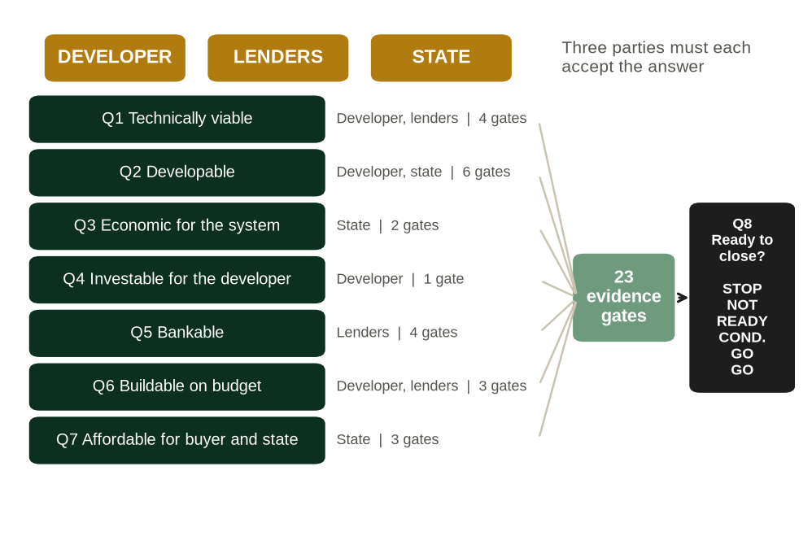

# About this book

Book 7. Hydropower Development and Finance. From River to Financial Close: A Developer, Lender and Government Framework for Hydropower Projects in Africa. First edition, version 0.2 (pre-publication).

The book belongs to the Africa Energy Finance collection, Business & Financial Models: a series of books, financial models, manuals, case studies and decision tools for energy businesses in African markets. Each book is built around one central question.

| Book | Subject | Central question | Status |
|---|---|---|---|
| Book 1 | Mini grids | Can this mini grid become a sustainable business? | Planned |
| Book 2 | Solar home systems (PAYGo) | Can PAYGo solar become profitable and financeable? | First edition |
| Book 3 | Clean cooking | Can clean cooking scale as a commercial business? | Planned |
| Book 4 | Commercial and industrial solar with storage | Should the customer invest, sign a PPA or use an energy service company? | Planned |
| Book 5 | Energy access fund | Can a fund mobilise capital and generate sustainable returns? | Planned |
| Book 6 | Power utilities | Can the utility become financially sustainable? | Planned |
| Book 7 | Hydropower: this book | Can this hydropower project be developed to financial close and financed on terms the developer, the lenders and the state can each accept? | First edition, v0.2 |

Each book is the centre of a set of products that share one method. For Book 7 they are:

| Product | Name | Role |
|---|---|---|
| Book | Hydropower Development and Finance (this book) | Explains the method and why it works |
| Model | MODEL 7: Hydropower Development and Finance Model | Quantifies the method: annual, 40 period, integrated project, utility and public-finance model with a development module and 23 financial close gates |
| Manual | MANUAL 7: User and Methodology Manual | Teaches the reader to operate the model |
| Case | CASE 7: Kasiri River Hydro | Demonstrates the method on a fictional 60 MW run-of-river project |
| Training | Video course | Walks through the book and the model |

The book is written to stand on its own. A reader who never opens the model loses the worked numbers, not the argument.

## What this book is, and what it is not

This is an investment committee guide to developing and financing hydropower projects in Africa. It connects hydrology, development risk, the power purchase agreement, construction, project finance, the developer's returns, the buyer's creditworthiness and the state's exposure in one route to financial close, and it asks for evidence at every step.

It is not a hydropower engineering textbook: the design of dams, waterways and turbines is covered well elsewhere, and the book takes the engineer's numbers as inputs to be tested. It is not a general project finance book: debt sizing, cover ratios and security packages are treated only as far as hydro and African buyers change them. And it is not a guide to writing a feasibility study.

It is a decision framework for four questions that every hydro project faces before anyone puts more money into it. Should the project proceed? Who should fund each stage? Who should carry each risk? And is it actually ready to close?

Africa is not a chapter of the book; it is the setting of every chapter. Currency, the creditworthiness of state utilities, the role of development finance institutions and blended finance, the cost of transmission, the fiscal capacity of the state and the risk of regulatory change shape the answers throughout, and the evidence cited comes mostly from African projects.

# Preface

This book asks one question: can a given hydropower project be developed to financial close and financed on terms that the developer, the lenders and the state can each accept? Most hydro projects in Africa that never reach close do not fail on engineering. They fail because one of the three parties cannot accept the terms the other two need. The developer cannot earn enough to justify years of at-risk spending. The lenders cannot get comfortable with the river, the contractor or the buyer. Or the state is asked to carry obligations its budget cannot bear.

The book is written for the people who make those decisions. Developers and their finance directors building a development plan and a financing case. Credit officers and investment officers at development finance institutions and commercial banks sizing debt. Fund managers deciding whether to buy into a project before or after close. Transaction advisers who have to reconcile all of them. And staff in finance ministries and PPP units, who get one full chapter written for them, because a support package the ministry will not sign does not close.

Each chapter supports one decision. Chapter 1 sets out the business model and the reason why a hydro project has to be read as three investments, not one. Chapters 2 to 4 cover the resource and the commercial route: the river, the configuration and the path to a power purchase agreement. Chapters 5 to 8 deal with development: the stage gates, the development budget, the consents and the contract set. Chapters 9 to 11 turn to construction and operation. Chapters 12 to 15 are about financing: sizing the debt, assembling the lender group, the developer's returns and the public side. Chapters 16 and 17 bring the analysis together for the people who carry the risk, through stress testing and the financial close gates. Chapter 18 walks through the complete case.

## Four ideas that run through the book

Four ideas recur in every chapter, and together they are the book's method.

The first is that a hydro project is three investments in one asset: a development option, a construction contract and an operating annuity. Each has its own risk, its own capital, its own cost of capital and its own way of failing. A project can be a good asset after commercial operation and a poor decision at the development stage, and the Kasiri case shows exactly that.

The second is that "feasible", "bankable", "investable", "affordable" and "ready" are different words for different tests. The book separates eight questions and answers each with its own evidence.

The third is that a project closes only if three parties accept it at once: the developer, the lenders and the state. A structure that satisfies two of them by moving risk onto the third is not a solution; it is a transfer, and the book measures it.

The fourth is that financial close is the result of evidence, not of negotiation alone. The book's 23 readiness gates, applied in the model, turn the eight questions into a close decision: STOP, NOT READY, CONDITIONAL GO or GO.

The second and fourth ideas together form the Hydro Readiness Framework, set out in the Introduction: eight questions, 23 gates, one close decision.

## How this book relates to other works

Book 7 is not the first work to connect hydropower with finance, and it does not try to replace the works that came before it.

The most complete public guide is the IFC's *Hydroelectric Power: A Guide for Developers and Investors*, published in 2015 [LIT:S1]. It covers the whole development cycle, from site selection to operation. By its own account, its technical sections "are more detailed and can be used as reference, while the permitting/licensing and financing sections are intended more as a high-level review" [LIT:S1]. Book 7 starts where that guide stops. The IFC guide explains how a hydro project is developed; this book explains how to decide whether it should continue, how it should be financed, who should bear each risk and whether it is ready to close.

The closest predecessor in purpose is the *Hydro Finance Handbook* of 2008, written as a companion to a hydro finance tutorial and covering the financial aspects of hydro development and the steps towards financial close [LIT:S2]. We could see only a search summary of it, and its publisher and authors are not confirmed here. Book 7 goes further in three directions: it values the development stage itself, before any financing; it tests the project from the positions of the developer, the lenders and the state at once; and it treats financial close as the outcome of 23 evidence gates rather than as a sequence of steps.

The University of Cambridge Institute for Sustainability Leadership published in 2019 an introduction to the concepts and terminology of financing sustainable hydropower in emerging markets [LIT:S3]. Its purpose is to help a reader who knows either hydropower or finance understand the other. This book assumes that understanding and uses it to reach a decision.

General project finance works treat debt sizing, cash flow available for debt service and lender requirements in far more depth than this book does, among them Gatti's textbook [LIT:S5] and, for the power sector, Nongena's practical guide to senior debt for electricity projects, published by Springer in 2026 [LIT:S4]. They are not specific to hydrology, to African utilities or to the state's balance sheet. Readers who need the full mechanics of project finance should read them alongside this book.

The book also has a companion in the author's own work. The author's *Bankable Is Not Enough* argues, across African independent power projects, that bankability alone can produce poor power deals. Book 7 applies that argument inside one sector, where the capital is heavy, the revenue depends on a river and the state is almost always a party, and turns it into a method for deciding whether a project should be developed, financed and closed.

## How the book works with the model

The book has a companion workbook, MODEL 7, together with a user manual and a worked case on Kasiri River Hydro, a fictional 60 MW run-of-river project in the fictional Republic of Navaria, developed by the fictional Tamarind Hydro Ltd. The chapters refer to the workbook by sheet name, so that each concept can be tested on numbers. A reader who prefers to stay with the text can ignore those references. A reader who works through them will finish the book able to build, challenge and defend a hydro investment case.

All default inputs in the workbook, and all Kasiri figures, are illustrative. They were chosen to make the mechanics visible and to sit inside the ranges found in public sources, not to describe any real project. Where the book cites figures about real projects or about the sector, it says where they come from and how far they have been verified. Where public sources conflict, the book reports the conflict rather than choosing the more convenient number. Where no public figure exists, as for development premiums or stage-by-stage attrition in African hydro, the book says so and treats the value as a model assumption.

A second fictional project, Lumora Falls, a 400 MW scheme structured as a public-private partnership, appears as a contrast in Chapters 1, 15 and 16. It comes from the author's earlier policy paper on hydro and public liabilities, which is now a companion paper to this book.

## Conventions

Currency amounts are in US dollars (USD) unless stated, and "USDm" means millions of US dollars. Unless stated otherwise, amounts in the model are nominal; capital costs quoted "real 2026" are before escalation. Energy is in GWh and capacity in MW. P50 and P90 denote the energy exceeded with 50 and 90 percent probability; "one-year" and "ten-year" P90 are distinguished in Chapter 2. Unit costs are labelled by scope (plant, funding base, total uses or system), because a USD/kW figure without a scope cannot be compared with anything. Negative amounts are shown with a minus sign. British spelling is used throughout.

## Sources and evidence

The book draws on four kinds of material and labels each one. Institutional evidence comes from bodies such as the World Bank Group, the African Development Bank, IRENA and national regulators; project disclosures by development finance institutions are placed in the same class. Secondary reporting is trade press and law-firm guides that report those documents. A model assumption is an input of the companion workbook, chosen to make the mechanics visible. An illustrative case output is a figure produced by the workbook for Kasiri; it is never a benchmark for real projects.

Every external claim carries a source identifier in square brackets, such as [HY-08] or [DE:S1], which points to Annex L. The annex records, for each source, whether its full text was read, only its landing page, or only a search-engine summary. Claims resting on a summary are flagged as such and should be checked against the original before they are quoted.

## Status of this edition

This is the first edition of Book 7, issued as version 0.2 for pre-publication review. It replaces, for developers and lenders, the author's earlier policy paper on structuring hydro without unsustainable public liabilities, whose material is condensed in Chapter 15. Three things must happen before release: the sources marked as summaries in Annex L must be read in full; the companion model must complete its test in Microsoft Excel (it has been tested in LibreOffice, adversarially reviewed and corrected); and practitioners must review the text.

## Acknowledgements and disclaimer

The analysis and any errors are the author's. Nothing in this book is investment, legal, tax or accounting advice. Readers should take professional advice in the jurisdiction concerned before acting on any of it.

# Introduction: how to read a hydro project

A hydro project can be read in a fixed order, and the order matters more than any single ratio. Each link in the chain below takes an input from the link before it and passes a result to the next. A weakness found early, in the flow record or the permitting sequence, travels down the chain and arrives, larger, at the debt sizing and the close.

| Link | Question | What it passes on | Chapters |
|---|---|---|---|
| River and site | Is there a resource worth developing here? | Catchment, head, access, competing uses | 2, 3 |
| Hydrology evidence | How good is the flow record, and how uncertain is the energy? | Flow series, P50, one-year and ten-year P90 | 2 |
| Configuration | What should be built? | Design flow, MW, energy by season, cost envelope | 3 |
| Offtake route | Who buys, through which route, on which tariff? | PPA route, tariff form, indexation, currency | 4 |
| Development plan | What must be done, in what order, at what cost and probability? | Stage plan, budget, stage-gate probabilities | 5, 6 |
| Consents | Which permits gate which others? | Consent sequence, critical path, E&S conditions | 7 |
| Contract set | Is the chain of contracts bankable and consistent? | Concession, PPA, grid, direct agreements, termination amounts | 8 |
| Construction | Who takes geology and delay, and at what price? | Contract structure, contingency, owner's share of overruns | 9, 10 |
| Operations | Who runs it, and what will it cost to keep it available? | O&M model, availability, reserves, insurance | 11 |
| Debt | How much senior debt, at what tenor, on which case? | Debt quantum, DSCR, LLCR, reserve accounts | 12 |
| Lender group | Which lenders, guarantees and insurances? | DFI club, cover, local-currency tranches | 13 |
| Developer returns | Is it investable for the developer, and at what price can it sell down? | Risk-weighted NPV, premium, IRR, sell-down value | 14 |
| Public obligations | What does the state commit, and can it carry it? | Payment capacity, support, contingent liabilities | 15 |
| Stress | What breaks first, and who holds it? | Break-even flow, overrun, distance to default | 16 |
| Financial close | Go, conditional go or stop, on what evidence? | Gate status, decision and conditions | 17, 18 |

## The Hydro Readiness Framework: eight questions, 23 gates, one close decision

Hydro projects are often described as "feasible" or "bankable" as if those words meant one thing. The book separates eight questions, because a project can pass one and fail the next, and each is answered by a different document or test. Each question must be accepted by a particular party, and each is tested by a set of the 23 financial close gates of Chapter 17. The eighth question, ready to close, is the sum of the other seven.

| Question | Answered by | Must be accepted by | Gates | Typical trap |
|---|---|---|---|---|
| Q1. Is the site technically viable? | Feasibility study and geotechnical investigation (Chapters 2, 3, 9) | Developer, lenders | 1 to 4 | A feasibility study built on a short or synthetic flow record presented as a long one |
| Q2. Is the project developable? | Consent sequence, land and water rights, PPA route (Chapters 5, 7) | Developer, state | 5 to 10 | Spending on bankable feasibility before the PPA route and water rights are secure |
| Q3. Is it economic for the power system? | Least-cost plan, LCOE against alternatives (Chapters 3, 4) | State | 11, 12 | Quoting plant cost when the system pays for plant and line |
| Q4. Is it investable for the developer? | Risk-weighted development NPV, premium, sell-down value (Chapters 6, 14) | Developer | 19 | Reading the equity IRR at close as the developer's return, ignoring at-risk spend and the chance of failure |
| Q5. Is it bankable? | Lender case, DSCR, LLCR, security package (Chapters 12, 13) | Lenders | 17, 18, 20, 23 | A project protected by backstops, so that lenders see none of the risk |
| Q6. Is it buildable on budget? | Contract structure, contingency, reference class (Chapters 9, 10) | Developer, lenders | 13, 14, 22 | A "fixed-price" EPC contract with ground conditions excluded |
| Q7. Is it affordable for the buyer and the state? | Payment capacity, support package, contingent liabilities (Chapter 15) | State | 15, 16, 21 | A bankable project whose arrangements move the risk onto the Treasury |
| Q8. Is it ready to close? | Evidence-based financial close gates (Chapter 17) | All three | All 23 | Treating a signed term sheet as a closed deal |

A project that passes Q1 to Q7 on evidence reaches CONDITIONAL GO when every critical gate is met, and GO when all 23 are. For Kasiri, at the start of permitting, the answer is STOP: the framework does not say the project is bad, it says which questions are still open and who has to close them.

The rest of the book follows the chain in order.
