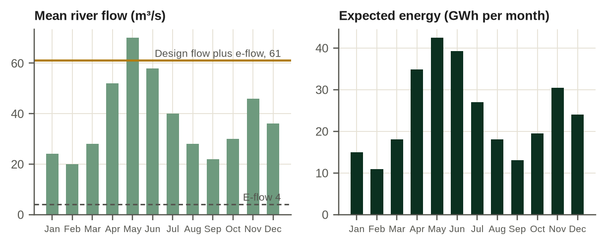

# Chapter 2. River, flow record and hydrology risk

This chapter supports a decision that is taken twice: is the hydrological evidence good enough to spend feasibility money, and later, is it good enough to size debt? The two thresholds are different. A developer can justify a feasibility study on a short record and a regional correlation; a lender cannot justify a sixteen-year loan on the same evidence. The chapter explains how flow becomes energy, how uncertainty in energy is measured, why a one-year P90 and a ten-year P90 answer different questions, and why the tariff structure decides who carries the river.

*Place in the analytical chain: hydrology evidence, the first link that every later number depends on.*

## 2.1 Four kinds of capacity

Financing documents are full of capacity numbers, and they do not mean the same thing. Installed capacity is the nameplate rating of the generating units. Available capacity is installed capacity multiplied by the share of time the units can run, after planned and forced outages. Expected generation is the energy the river allows on average, which depends on flow, head and how often the flow exceeds what the turbines can use. Contracted energy is whatever the PPA refers to, and it may differ both from what is delivered, because of curtailment, and from what is paid for, because of deemed-energy clauses.

The gap between nameplate and energy can be large. Belo Monte in Brazil has 11,233 MW installed against 4,571 MW of assured energy [INT:S8]. For a run-of-river plant like Kasiri, the gap is set by the shape of the river's seasons: in the dry months the turbines run well below their rating.

## 2.2 The flow record

Everything in this book that depends on energy depends on the flow record. The IFC's guide for hydro developers sets a minimum of about 15 years of hydrological data for lenders [DE:S1]. Few African sites have that much measured data at the intake. Most developers start a gauging programme at pre-feasibility and extend the short on-site record by correlation with a longer regional gauge.

That practice is sound if it is done well and described honestly. The questions a lender's adviser will ask are concrete. How many years were measured on site, and how many were synthesised? How good is the correlation, and over which flow range was it tested? Were the rating curves checked at high flows, where most of the uncertainty sits? Are there gaps, and how were they filled? Has upstream land use, abstraction or a new dam changed the river since the regional record began?

In the model, the record is described by two inputs on *03_HYDROLOGY*: the number of reliable years and the maturity of the hydrology study, from desk study to independent review. Kasiri has {{m.rec_years|n0}} years, a mix of on-site gauging since pre-feasibility and regional correlation, and a feasibility-level study that has not yet been independently reviewed. Gate 1 of the financial close readiness sheet therefore reads NOT MET. That is the normal state of a project at Kasiri's stage, and it tells the developer where to spend next.

## 2.3 From flow to energy

For each month, the model computes usable flow, average power and energy:

> Q~usable~ = min( max(Q − Q~env~, 0), Q~design~ )
>
> P = min( ρ · g · Q~usable~ · H · η~turbine~ · η~generator~ / 10^6^ , P~installed~ )
>
> E = P × hours × availability / 1000

Q is mean river flow in m³/s, Q~env~ the environmental flow release, Q~design~ the rated turbine flow, H the net head in metres, η the efficiencies, P in MW and E in GWh. For Kasiri, mean monthly flows range from 20 to 70 m³/s, the design flow is 57 m³/s, the environmental release 4 m³/s and the net head 120 m. The long-term mean energy, the P50, is about {{m.p50|n0}} GWh a year, a capacity factor of {{m.cf|pct1}}. IRENA reports a weighted average capacity factor of 55 percent for small hydro commissioned in Africa between 2018 and 2024, within a 5th to 95th percentile band of 50 to 66 percent [HY-01].

The equations hide a bias that matters for finance. Energy is a concave function of flow: it rises with flow until the turbines are full and then stops. Applying the function to mean monthly flows overstates mean energy, because the water spilled in wet years cannot make up for the energy lost in dry ones. For a bankable estimate, energy should be computed month by month over the whole record and then averaged. The model accepts a simulated series when one exists and flags the bias when it does not.

## 2.4 P50, one-year P90 and ten-year P90

Lenders size debt on a downside generation case. The usual reference is a P90: the energy exceeded with 90 percent probability. Without a full simulated series, the model uses the coefficient of variation (CV) of annual energy:

> P90~one-year~ = P50 × (1 − 1.2816 × CV)

With a CV of 15 percent, Kasiri's one-year P90 is about {{m.p90|n0}} GWh.

A one-year P90 describes a single bad year. A sixteen-year loan is serviced by many years, and the average of many years is much less uncertain than any one of them, unless dry years cluster. The model therefore also computes the P90 of the ten-year average, allowing for persistence through a year-to-year correlation coefficient ρ:

> P90~ten-year~ = P50 × (1 − 1.2816 × CV × √((1 + ρ) / (1 − ρ) / 10))

With ρ = 0.3, Kasiri's ten-year P90 is about {{m.p90_10|n0}} GWh, much closer to P50 than the one-year figure.

The choice between the two is not technical. It is a negotiation about who carries persistence risk. Sizing debt on the one-year P90 for every year of the loan is conservative for the average and says nothing about runs of dry years; sizing on the ten-year P90 is more generous but needs a separate test for a multi-year drought. The model's default sizes on the ten-year P90 and then tests a three-year drought explicitly, with the debt service reserve available. Chapter 12 shows the effect on debt capacity.

## 2.5 Who carries the river

The tariff structure decides who carries hydrology risk. Under a two-part tariff, a capacity charge pays the fixed costs whether or not the river flows, and the buyer carries most of the hydrology risk. Under an energy-only tariff, as in East African feed-in tariffs, the project is paid only for what it delivers, and the river is the project's problem [DE:S8; DE:S42].

Kasiri has an energy-only tariff. With the financing package fixed at its base-case terms, a three-year drought at 55 percent of normal flow from the fourth operating year reduces the minimum DSCR from {{base_locked.kpi_min_dscr|x2}} to {{drought.kpi_min_dscr|x2}} and the equity return from {{base_locked.kpi_eirr|pct1}} to {{drought.kpi_eirr|pct1}}. Running the whole cash flow on the one-year P90 instead of P50 gives a minimum DSCR of {{p90cf.kpi_min_dscr|x2}} and an equity return of {{p90cf.kpi_eirr|pct1}}. The contrast with Lumora, where a similar drought barely moved the equity return, is the tariff, not the river.

The drought factor deserves a word. In 2024 the water allocation for generation at Kariba was cut from 30 to 16 billion cubic metres, according to news reporting [CL-04]. The model's default of 55 percent of normal flow for three years is set close to that event. A single-year statistic would never produce it.

## 2.6 Climate

Peer-reviewed work warns that planned hydro expansion in eastern and southern Africa concentrates capacity in basins with correlated rainfall, which raises the risk of concurrent supply disruption across interconnected systems [CL-03]. For a single project, the practical consequence is that the historical record may not describe the next thirty years. The IHA's climate resilience guide sets out how to test a design against climate scenarios [CL-01]. The model offers a flow trend per decade as a stress, labelled illustrative until a basin study supports a number. With a decline of 3 percent per decade, Kasiri's equity return falls from {{base_locked.kpi_eirr|pct1}} to {{climate.kpi_eirr|pct1}}.

## 2.7 What the Kasiri case shows

Kasiri's hydrology is adequate for a developer to keep spending and inadequate for a lender to commit. The record is shorter than 15 years and has not been independently reviewed. Because the tariff pays only for energy, the project's credit rests on that record. The next development money should go into extending the record, checking the rating curves and commissioning the independent review, before the bankable feasibility study is finalised.

## Points for the investment and credit committees

1. Ask how many years of the flow record were measured at or near the intake, and how many were synthesised by correlation. Treat the two differently.
2. Require energy to be computed month by month over the whole record, not from mean monthly flows.
3. Ask for both the one-year and the ten-year P90, and agree explicitly which one sizes the debt and how runs of dry years are tested.
4. Identify who carries hydrology risk under the tariff, and size reserves accordingly.
5. Test at least one multi-year drought set close to the worst sequence in the region's record.
6. Treat a climate trend as a stress, not a base case, unless a basin-specific study supports it.

## Working with the model

*03_HYDROLOGY* holds the monthly flows, the plant parameters, the P-values and the record inputs. *04_GENERATION* shows installed capacity, available capacity, generation, evacuable energy, delivered energy and contracted energy year by year. On *01_CONTROL_PANEL*, switch the generation case for cash flows between P50, P75 and P90, and the lender sizing case between one-year and ten-year P90. Switch on the drought and climate toggles and read the minimum DSCR on *20_CASH_FLOW*. Gate 1 on *30A_CLOSE_READINESS* reads the record inputs automatically.
