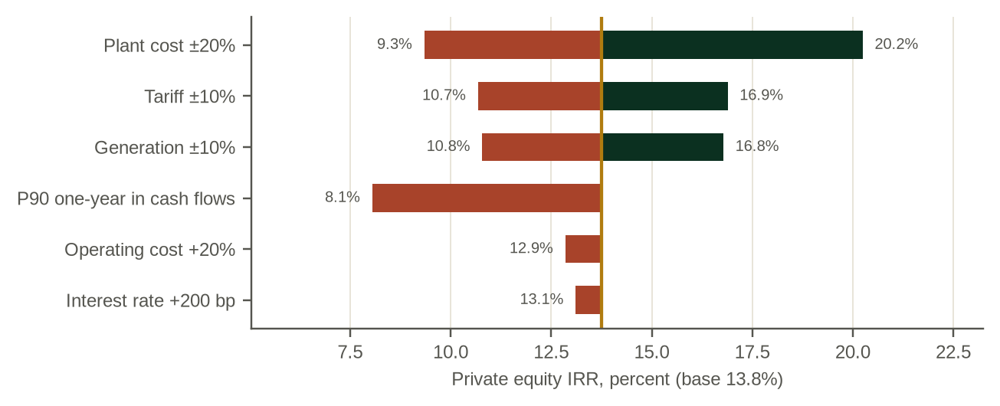

# Chapter 16. Risk allocation and stress testing

This chapter supports the decision every lender and investor makes before committing: what breaks first, when, and who holds it. Stress testing is often presented as a list of sensitivities. It is more useful as a search for the point at which the project fails.

*Place in the analytical chain: stress, which brings the earlier links together for the people who carry the risk.*

*Who must accept the answer: the developer, the lenders and the state.*

## 16.1 Who carries what

The model maps sixteen risks against eight parties: government, developer, construction contractor, lender, utility, consumer, insurer and development finance institution. The table shows the main ones for Kasiri. The allocation for a private IPP with an energy-only tariff differs from the earlier paper's PPP in one important way: the developer is the primary bearer of hydrology risk, because the tariff pays only for energy delivered.

| Risk | Primary bearer at Kasiri | Main instruments | Model stress |
|---|---|---|---|
| Hydrology | Developer | P90 sizing, debt service reserve, cash sweep | Drought, climate, P90 cash flows |
| Construction and overrun | Contractor and developer, by contract structure | Contract structure, contingency, standby equity | Overrun, delay |
| Transmission and grid | Developer (own interconnector); utility (grid) | Construction contract, deemed energy for grid curtailment | Transmission delay |
| Offtaker payment | Utility, then government | Payment security, guarantee, liquidity facility | Offtaker stress, FX step |
| Currency | Utility and government | Partial local-currency tariff, convertibility undertaking | FX step |
| Interest rate | Developer, for the unhedged share | Hedging | Interest +300 bp |
| Political and termination | Government | Political risk insurance, termination compensation | Termination exposure |

## 16.2 Stress results

All stresses below hold the financing package at its base-case terms.

Table: Table 16.1. Kasiri River Hydro: stress results with the financing package locked
| Scenario | Equity IRR | Minimum DSCR | Financing gap (USDm) | Utility payment capacity | Consolidated fiscal NPV (USDm) |
|---|---|---|---|---|---|
| Base | {{base_locked.kpi_eirr|pct1}} | {{base_locked.kpi_min_dscr|x2}} | {{base_locked.fin_gap|n1}} | {{base_locked.ut_ratio10|x1}} | {{base_locked.fis_npv_cons|n0}} |
| Low case | {{low.kpi_eirr|pct1}} | {{low.kpi_min_dscr|x2}} | {{low.fin_gap|n1}} | {{low.ut_ratio10|x1}} | {{low.fis_npv_cons|n0}} |
| High case | {{high.kpi_eirr|pct1}} | {{high.kpi_min_dscr|x2}} | {{high.fin_gap|n1}} | {{high.ut_ratio10|x1}} | {{high.fis_npv_cons|n0}} |
| Three-year drought | {{drought.kpi_eirr|pct1}} | {{drought.kpi_min_dscr|x2}} | {{drought.fin_gap|n1}} | {{drought.ut_ratio10|x1}} | {{drought.fis_npv_cons|n0}} |
| P90 one-year in every year | {{p90cf.kpi_eirr|pct1}} | {{p90cf.kpi_min_dscr|x2}} | {{p90cf.fin_gap|n1}} | {{p90cf.ut_ratio10|x1}} | {{p90cf.fis_npv_cons|n0}} |
| Climate trend | {{climate.kpi_eirr|pct1}} | {{climate.kpi_min_dscr|x2}} | {{climate.fin_gap|n1}} | {{climate.ut_ratio10|x1}} | {{climate.fis_npv_cons|n0}} |
| Overrun 27% | {{overrun.kpi_eirr|pct1}} | {{overrun.kpi_min_dscr|x2}} | {{overrun.fin_gap|n1}} | {{overrun.ut_ratio10|x1}} | {{overrun.fis_npv_cons|n0}} |
| Overrun 96% | {{overrun96.kpi_eirr|pct1}} | {{overrun96.kpi_min_dscr|x2}} | {{overrun96.fin_gap|n1}} | {{overrun96.ut_ratio10|x1}} | {{overrun96.fis_npv_cons|n0}} |
| Two-year delay | {{delay.kpi_eirr|pct1}} | {{delay.kpi_min_dscr|x2}} | {{delay.fin_gap|n1}} | {{delay.ut_ratio10|x1}} | {{delay.fis_npv_cons|n0}} |
| Transmission two years late | {{trans.kpi_eirr|pct1}} | {{trans.kpi_min_dscr|x2}} | {{trans.fin_gap|n1}} | {{trans.ut_ratio10|x1}} | {{trans.fis_npv_cons|n0}} |
| Interest +300 bp (unhedged share) | {{rate.kpi_eirr|pct1}} | {{rate.kpi_min_dscr|x2}} | {{rate.fin_gap|n1}} | {{rate.ut_ratio10|x1}} | {{rate.fis_npv_cons|n0}} |
| Offtaker stress, budget backstop | {{offtaker.kpi_eirr|pct1}} | {{offtaker.kpi_min_dscr|x2}} | {{offtaker.fin_gap|n1}} | {{offtaker.ut_ratio10|x1}} | {{offtaker.fis_npv_cons|n0}} |
| Offtaker stress, no backstop | {{offtaker_nobs.kpi_eirr|pct1}} | {{offtaker_nobs.kpi_min_dscr|x2}} | {{offtaker_nobs.fin_gap|n1}} | {{offtaker_nobs.ut_ratio10|x1}} | {{offtaker_nobs.fis_npv_cons|n0}} |
| FX step 50% | {{fx.kpi_eirr|pct1}} | {{fx.kpi_min_dscr|x2}} | {{fx.fin_gap|n1}} | {{fx.ut_ratio10|x1}} | {{fx.fis_npv_cons|n0}} |
| Combined (overrun, delay, offtaker, FX) | {{combined.kpi_eirr|pct1}} | {{combined.kpi_min_dscr|x2}} | {{combined.fin_gap|n1}} | {{combined.ut_ratio10|x1}} | {{combined.fis_npv_cons|n0}} |
Note: An equity IRR of −100% means the equity is wiped out. Utility payment capacity is the worst ratio of the first ten operating years.

## 16.3 What breaks first

Three results stand out.

The river breaks the debt first. Under an energy-only tariff, a three-year drought at 55 percent of normal flow pushes the minimum DSCR to {{drought.kpi_min_dscr|x2}}. The reserve is drawn but does not cover the whole shortfall. A lender sizing on the ten-year P90 needs a larger reserve, a cash sweep in wet years or a smaller loan, and should see the drought test before close.

The buyer breaks the project only if the state steps aside. With a budget backstop, the offtaker stress costs the state and leaves the project whole; without one, the project defaults. The project's credit is therefore partly the state's credit, whatever the structure says.

African experience gives the drought and buyer stresses a real shape. For 2024 the Zambezi River Authority cut the water allocated for generation at Kariba by about 47 percent [CL-04], and the output of the 1,080 MW Kariba North Bank station was reported at 98 MW in June 2024, down from 166 MW a month earlier [R3:S2]. On the buyer side, Ghana's Electricity Company owed the Bui Power Authority about USD 612 million in March 2023 [A1:S40]. Neither event is a tail case for the region; both are recent.

Construction overruns break the equity, not the debt. With the financing locked, an overrun at the reference-class mean leaves a financing gap of about USD {{overrun96.fin_gap|n0}} million that only standby equity or new money can fill.

## 16.4 Reverse stress

Reverse stress asks how far a variable must move before the project fails. With the financing locked, the minimum DSCR reaches 1.0 when river flows fall by about {{x.be_flow_pct|pct0}} in every year. That is a larger move than the one-year P90 implies on average, and a smaller one than a severe multi-year drought produces in the years it lasts, which is why the drought test matters more than the average.

## Points for the investment and credit committees

1. Test with the financing package locked, and read the financing gap as well as the DSCR.
2. Test at least one multi-year drought under an energy-only tariff, and check the reserve against it.
3. Run the offtaker stress with and without a budget backstop, and record who carries the difference.
4. Ask for reverse stress results: the flow reduction and the overrun at which the project fails.
5. Read the allocation matrix for the specific tariff and structure; do not borrow it from another project.

## Working with the model

*27_SCENARIOS* holds the cases, stress parameters and the full-engine scenario snapshot; *28_SENSITIVITY* holds the tornado and the sensitivity snapshot. *29_RISK_ALLOCATION* holds the matrix. Stress toggles are on *01_CONTROL_PANEL*.
