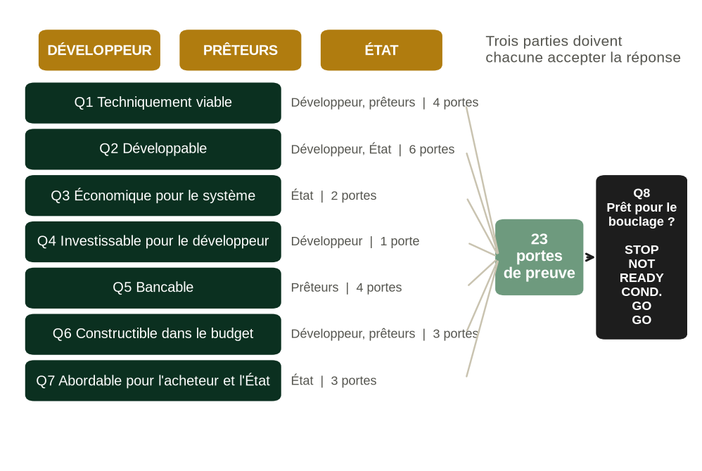

# À propos de ce livre

Livre 7. Développement et financement de l'hydroélectricité. De la rivière au bouclage financier : un cadre pour les développeurs, les prêteurs et les États, appliqué aux projets hydroélectriques en Afrique. Première édition française, version 1.0 release candidate 1 (prépublication), traduite de l'édition anglaise (édition brochée, ISBN-13 : 979-8178961780, publiée à compte d'auteur). L'ISBN de l'édition française reste à attribuer.

Le livre fait partie de la collection Africa Energy Finance, Business & Financial Models : une série de livres, de modèles financiers, de manuels, d'études de cas et d'outils de décision destinés aux entreprises du secteur de l'énergie sur les marchés africains. Chaque livre est construit autour d'une question centrale.

| Livre | Sujet | Question centrale | Statut |
|---|---|---|---|
| Livre 1 | Mini-réseaux | Ce mini-réseau peut-il devenir une entreprise durable ? | Prévu |
| Livre 2 | Systèmes solaires domestiques (PAYGo) | Le solaire PAYGo peut-il devenir rentable et finançable ? | Première édition |
| Livre 3 | Cuisson propre | La cuisson propre peut-elle se développer à grande échelle comme activité commerciale ? | Prévu |
| Livre 4 | Solaire commercial et industriel avec stockage | Le client doit-il investir, signer un contrat d'achat d'électricité (CAE) ou recourir à une société de services énergétiques ? | Prévu |
| Livre 5 | Fonds d'accès à l'énergie | Un fonds peut-il mobiliser des capitaux et générer des rendements durables ? | Prévu |
| Livre 6 | Compagnies d'électricité | La compagnie d'électricité peut-elle devenir financièrement viable ? | Prévu |
| Livre 7 | Hydroélectricité : ce livre | Ce projet hydroélectrique peut-il être développé jusqu'au bouclage financier et financé à des conditions que le développeur, les prêteurs et l'État peuvent chacun accepter ? | Première édition, v1.0 RC1 |

Chaque livre est au centre d'un ensemble de produits qui partagent une même méthode. Pour le Livre 7, ce sont :

| Produit | Nom | Rôle |
|---|---|---|
| Livre | Développement et financement de l'hydroélectricité (ce livre) | Expose la méthode et explique pourquoi elle fonctionne |
| Modèle | MODEL 7 : modèle de développement et de financement de l'hydroélectricité, v1.0 RC1 | Chiffre la méthode : modèle annuel sur 40 périodes, intégrant le projet, la compagnie d'électricité et les finances publiques, avec un module de développement, un filtre de développement à neuf portes, les 23 portes du bouclage financier, une carte du cadre et un contrôle de cohérence avec le livre |
| Manuel | MANUAL 7 : manuel d'utilisation et de méthodologie, v1.0 RC1 | Apprend au lecteur à utiliser le modèle |
| Cas | CASE 7 : Kasiri River Hydro, v1.0 RC1 | Applique la méthode à un projet fictif au fil de l'eau de 60 MW |
| Formation | Cours vidéo | Parcourt le livre et le modèle |

Le livre est conçu pour se suffire à lui-même. Un lecteur qui n'ouvre jamais le modèle perd les calculs chiffrés, pas le raisonnement.

## Ce que ce livre est, et ce qu'il n'est pas

Ce livre est un guide, à l'usage des comités d'investissement, du développement et du financement des projets hydroélectriques en Afrique. Il relie l'hydrologie, le risque de développement, le contrat d'achat d'électricité, la construction, le financement de projet, les rendements du développeur, la solvabilité de l'acheteur et l'exposition de l'État en un seul parcours jusqu'au bouclage financier, et il exige des preuves à chaque étape.

Ce n'est pas un manuel d'ingénierie hydroélectrique : la conception détaillée des barrages, des ouvrages hydrauliques et des turbines est bien traitée ailleurs. Mais un décideur doit pouvoir contester les chiffres de l'ingénieur ; le livre comporte donc un référentiel technique, les annexes N à R, sur l'hydrologie et l'énergie, l'aménagement et le génie civil, les équipements électromécaniques, la construction et l'exploitation, et la due diligence (audit préalable) environnementale et sociale, avec le niveau de détail nécessaire pour poser les bonnes questions et lire les réponses. Ce n'est pas non plus un ouvrage général de financement de projet : le dimensionnement de la dette, les ratios de couverture et les dispositifs de sûretés ne sont traités que dans la mesure où l'hydroélectricité et les acheteurs africains les modifient. Et ce n'est pas un guide de rédaction d'une étude de faisabilité.

C'est un cadre de décision pour quatre questions que se pose tout projet hydroélectrique avant que quiconque y engage davantage d'argent. Le projet doit-il se poursuivre ? Qui doit financer chaque étape ? Qui doit porter chaque risque ? Et est-il réellement prêt pour le bouclage ?

L'Afrique n'est pas un chapitre du livre ; elle est le cadre de chaque chapitre. La monnaie, la solvabilité des compagnies d'électricité publiques, le rôle des institutions de financement du développement (IFD) et du financement mixte, le coût du transport d'électricité, la capacité budgétaire de l'État et le risque de changement réglementaire déterminent les réponses tout au long du livre, et les preuves citées proviennent pour l'essentiel de projets africains.

# Préface

Ce livre pose une seule question : un projet hydroélectrique donné peut-il être développé jusqu'au bouclage financier et financé à des conditions que le développeur, les prêteurs et l'État peuvent chacun accepter ? La plupart des projets hydroélectriques africains qui n'atteignent jamais le bouclage n'échouent pas sur l'ingénierie. Ils échouent parce que l'une des trois parties ne peut pas accepter les conditions dont les deux autres ont besoin. Le développeur ne peut pas gagner assez pour justifier des années de dépenses à risque. Les prêteurs ne parviennent pas à se rassurer sur la rivière, l'entrepreneur ou l'acheteur. Ou bien l'on demande à l'État de porter des obligations que son budget ne peut pas supporter.

Le livre s'adresse aux personnes qui prennent ces décisions. Les développeurs et leurs directeurs financiers, qui construisent un plan de développement et un dossier de financement. Les chargés de crédit et les chargés d'investissement des institutions de financement du développement et des banques commerciales, qui dimensionnent la dette. Les gérants de fonds qui décident d'entrer ou non dans un projet avant ou après le bouclage. Les conseillers en transaction, qui doivent concilier tous ces acteurs. Et les agents des ministères des Finances et des cellules PPP, à qui un chapitre entier est consacré, car un dispositif de soutien que le ministère ne signera pas ne mène pas au bouclage.

Chaque chapitre éclaire une décision. Le chapitre 1 présente le modèle économique et explique pourquoi un projet hydroélectrique doit se lire comme trois investissements, et non un seul. Les chapitres 2 à 4 couvrent la ressource et la voie commerciale : la rivière, la configuration et le chemin vers un contrat d'achat d'électricité. Les chapitres 5 à 8 traitent du développement : les portes d'étape, le budget de développement, les autorisations et l'ensemble contractuel. Les chapitres 9 à 11 portent sur la construction et l'exploitation. Les chapitres 12 à 15 concernent le financement : le dimensionnement de la dette, la constitution du pool de prêteurs, les rendements du développeur et le volet public. Les chapitres 16 et 17 rassemblent l'analyse pour ceux qui portent le risque, au moyen des tests de résistance et des portes du bouclage financier. Le chapitre 18 déroule le cas complet.

## Quatre idées qui traversent le livre

Quatre idées reviennent dans chaque chapitre ; ensemble, elles forment la méthode du livre.

La première est qu'un projet hydroélectrique, ce sont trois investissements dans un seul actif : une option de développement, un contrat de construction et une rente d'exploitation. Chacun a son propre risque, son propre capital, son propre coût du capital et sa propre manière d'échouer. Un projet peut être un bon actif après la mise en service commerciale et une mauvaise décision au stade du développement ; le cas Kasiri le montre précisément.

La deuxième est que « faisable », « bancable », « investissable », « abordable » et « prêt » sont des mots différents pour des tests différents. Le livre distingue huit questions et répond à chacune avec ses propres preuves.

La troisième est qu'un projet n'atteint le bouclage que si trois parties l'acceptent en même temps : le développeur, les prêteurs et l'État. Une structure qui satisfait deux d'entre elles en reportant le risque sur la troisième n'est pas une solution ; c'est un transfert, et le livre le mesure.

La quatrième est que le bouclage financier résulte des preuves, et pas seulement de la négociation. Les 23 portes de maturité du livre, appliquées dans le modèle, transforment les huit questions en une décision de bouclage : STOP (arrêt), NOT READY (non prêt), CONDITIONAL GO (feu vert sous conditions) ou GO (feu vert).

La deuxième et la quatrième idée forment ensemble le Hydro Readiness Framework™, présenté dans l'introduction : huit questions, 23 portes, une décision de bouclage financier.

## La place de ce livre parmi les autres ouvrages

Le Livre 7 n'est pas le premier ouvrage à relier l'hydroélectricité et la finance, et il ne cherche pas à remplacer les ouvrages qui l'ont précédé.

Le guide public le plus complet est celui de l'IFC, *Hydroelectric Power: A Guide for Developers and Investors*, publié en 2015 [LIT:S1]. Il couvre l'ensemble du cycle de développement, du choix du site à l'exploitation. Selon ses propres termes, ses sections techniques « sont plus détaillées et peuvent servir de référence, tandis que les sections sur les permis et licences et sur le financement sont davantage conçues comme une vue d'ensemble » (notre traduction) [LIT:S1]. Le Livre 7 commence là où ce guide s'arrête. Le guide de l'IFC explique comment un projet hydroélectrique se développe ; ce livre explique comment décider s'il doit se poursuivre, comment il doit être financé, qui doit porter chaque risque et s'il est prêt pour le bouclage.

Le prédécesseur le plus proche par son objet semble être le *Hydro Finance Handbook* de 2008, décrit comme le support d'un tutoriel sur le financement de l'hydroélectricité donné à HydroVision 2008 et comme couvrant les aspects financiers du développement hydroélectrique et les étapes menant au bouclage financier [LIT:S2]. Nous n'avons pu en consulter qu'un résumé de recherche, et son éditeur et ses auteurs ne sont pas confirmés ici ; la comparaison repose donc sur cette description. Sur cette base, le Livre 7 s'en distingue de trois manières : il valorise l'étape de développement elle-même, avant tout financement ; il teste le projet à la fois du point de vue du développeur, des prêteurs et de l'État ; et il traite le bouclage financier comme le résultat de 23 portes de preuve plutôt que comme une suite d'étapes.

Le University of Cambridge Institute for Sustainability Leadership a publié en 2019 une introduction aux concepts et à la terminologie du financement de l'hydroélectricité durable dans les marchés émergents [LIT:S3]. Elle présente les termes et les concepts du financement de la grande hydroélectricité dans les marchés émergents, pour des lecteurs qui découvrent la finance, l'hydroélectricité ou les deux. Ce livre suppose ces bases acquises et s'en sert pour aboutir à une décision.

Les ouvrages généraux de financement de projet traitent le dimensionnement de la dette, les flux de trésorerie disponibles pour le service de la dette et les exigences des prêteurs de façon bien plus approfondie que ce livre ; parmi eux, le manuel de Gatti [LIT:S5] et, pour le secteur électrique, le guide pratique de Nongena sur la dette senior des projets d'électricité, annoncé par Springer pour 2026 [LIT:S4]. Ils ne sont spécifiques ni à l'hydrologie, ni aux compagnies d'électricité africaines, ni au bilan de l'État. Les lecteurs qui ont besoin de toute la mécanique du financement de projet devraient les lire en parallèle de ce livre.

Table: Tableau P.1. Ce que ce livre ajoute aux ouvrages existants
| Ouvrage | Son point fort | Ce qu'il laisse à d'autres | Ce que ce livre ajoute |
|---|---|---|---|
| Guide de l'IFC (2015) [LIT:S1] | Cycle de développement complet ; référentiel technique détaillé | Le financement et les permis, traités comme une vue d'ensemble | Les décisions de poursuivre, de financer et de boucler, avec les tests du développeur, des prêteurs et de l'État côte à côte |
| Hydro Finance Handbook (2008) [LIT:S2] | Les aspects financiers et les étapes jusqu'au bouclage financier, selon un résumé de recherche | Non confirmé : le texte intégral n'a pas été consulté | Valeur de développement pondérée par le risque ; le test de l'État à côté de celui des prêteurs ; 23 portes de preuve ; un modèle opérationnel |
| Document de travail du CISL (2019) [LIT:S3] | Concepts et terminologie pour les lecteurs qui découvrent la finance, l'hydroélectricité ou les deux | Une méthode de décision | Une séquence de décision chiffrée à chaque étape |
| Ouvrages de financement de projet [LIT:S4; LIT:S5] | Approfondissement des flux de trésorerie, du dimensionnement de la dette et des sûretés | L'hydrologie, les compagnies d'électricité africaines, l'exposition souveraine | Cas prêteurs propres à l'hydroélectricité, capacité de paiement de l'acheteur, passifs éventuels |
| Ce livre | Un cadre pour comité d'investissement consacré à l'hydroélectricité en Afrique, de la rivière au bouclage financier | La conception technique détaillée, couverte par le guide de l'IFC et les ouvrages d'ingénierie | |
Note: Le tableau compare l'objet et le champ couvert tels que chaque ouvrage les présente ou, pour le manuel de 2008, tels qu'ils sont décrits dans un résumé de recherche ; ce n'est pas un classement.

Le livre a aussi un pendant dans l'œuvre de l'auteur. Dans *Bankable Is Not Enough*, l'auteur soutient, à partir des projets de producteurs indépendants d'électricité (PIE) en Afrique, que la bancabilité seule peut aboutir à de mauvais contrats d'électricité. Le Livre 7 applique ce raisonnement à un seul secteur, où le capital est lourd, les recettes dépendent d'une rivière et l'État est presque toujours partie prenante, et il en fait une méthode pour décider si un projet doit être développé, financé et bouclé.

## Comment le livre s'articule avec le modèle

Le livre s'accompagne d'un classeur, MODEL 7, ainsi que d'un manuel d'utilisation et d'un cas pratique sur Kasiri River Hydro, un projet fictif au fil de l'eau de 60 MW situé dans la République de Navaria, elle aussi fictive, et développé par la société fictive Tamarind Hydro Ltd. Les chapitres renvoient au classeur par nom de feuille, afin que chaque concept puisse être testé sur des chiffres. Un lecteur qui préfère s'en tenir au texte peut ignorer ces renvois. Un lecteur qui les suit terminera le livre en sachant construire, contester et défendre un dossier d'investissement hydroélectrique.

Toutes les données d'entrée par défaut du classeur, et tous les chiffres de Kasiri, sont illustratifs. Ils ont été choisis pour rendre la mécanique visible et pour rester dans les fourchettes observées dans les sources publiques, non pour décrire un projet réel. Lorsque le livre cite des chiffres relatifs à des projets réels ou au secteur, il en indique la provenance et le degré de vérification. Lorsque des sources publiques se contredisent, le livre signale la contradiction plutôt que de retenir le chiffre le plus commode. Lorsqu'aucun chiffre public n'existe, comme pour les primes de développement ou le taux d'abandon étape par étape dans l'hydroélectricité africaine, le livre le dit et traite la valeur comme une hypothèse du modèle.

Un second projet fictif, Lumora Falls, un aménagement de 400 MW structuré en partenariat public-privé (PPP), sert de contrepoint aux chapitres 1, 2, 4 et 15. Il provient d'une note de politique publique antérieure de l'auteur sur l'hydroélectricité et les passifs publics, devenue un document d'accompagnement de ce livre.

## Ressources d'accompagnement

Les ressources qui accompagnent ce livre sont réunies dans un seul dossier en ligne. Scannez le code ci-dessous avec l'appareil photo d'un téléphone, ou saisissez l'adresse dans un navigateur web.

{: style="width:32mm"}

L'adresse, si vous préférez la saisir :

https://drive.google.com/drive/folders/1cLpEF8qvR_OMg0JKVFHKvLxtROvZAmfr

Le dossier contient sept sous-dossiers :

- **01_Hydro_Readiness_Framework** : le livre complet en PDF, ainsi que les huit questions, les 23 portes et l'échelle de décision sous forme de référence autonome.
- **02_Bankable_Hydro_Model** : MODEL 7, le classeur qui produit chaque chiffre de ce livre, avec ses rapports de test.
- **03_Model_User_Manual** : MANUAL 7, le manuel d'utilisation et de méthodologie, des guides vidéo commentés du modèle en anglais et en français, sous-titrés, et un guide audio.
- **04_Kasiri_River_Case** : le cas pratique du chapitre 18 et ses chiffres clés.
- **05_Transaction_Tools** : les versions modifiables des listes de contrôle et des modèles de documents des annexes A à I.
- **06_Technical_Due_Diligence** : les annexes N à R sous forme de référence autonome, en PDF et au format Word.
- **07_Sources_and_References** : la liste des sources avec leur statut de vérification, et les fichiers de recherche sur lesquels elle repose.

Les ressources en français se trouvent dans les mêmes dossiers, avec le suffixe _FR lorsqu'une version française existe.

Pour utiliser les ressources :

1. Ouvrez le dossier dans un navigateur web. Les fichiers peuvent être consultés et téléchargés, mais pas modifiés en ligne.
2. Téléchargez le classeur et ouvrez-le dans Microsoft Excel ou un tableur compatible. Il ne contient aucune macro.
3. Commencez par la feuille de couverture du classeur, puis suivez le guide vidéo ou le guide de démarrage rapide du manuel.
4. Travaillez sur votre propre copie. Ne remplacez les données d'entrée illustratives de Kasiri par les données d'un projet que dans cette copie, et consignez chaque hypothèse et sa source.
5. Vérifiez que la version indiquée sur la couverture du classeur correspond à celle de ce livre. Des ressources mises à jour peuvent être ajoutées au même dossier sous un nouveau numéro de version.

Si le code ou l'adresse n'ouvre plus le dossier, cherchez une adresse mise à jour sur la page de l'auteur chez le libraire auprès duquel vous avez acheté ce livre.

## Conventions

Le cas Kasiri se déroule en temps de modèle : développement à partir de 2021, bouclage financier en 2027 et mise en service commerciale en 2030. Quand le livre indique que Tamarind en est au début de l'obtention des permis, il désigne l'étape atteinte, non une date du calendrier.

Sauf indication contraire, les montants sont exprimés en dollars des États-Unis (USD), et « M USD » signifie millions de dollars des États-Unis. Sauf mention contraire, les montants du modèle sont nominaux ; les coûts d'investissement exprimés « en termes réels 2026 » s'entendent avant indexation. L'énergie est exprimée en GWh et la puissance en MW. P50 et P90 désignent l'énergie dépassée avec une probabilité de 50 et de 90 % ; la distinction entre P90 à un an et P90 à dix ans est expliquée au chapitre 2. Les coûts unitaires sont étiquetés selon leur périmètre (centrale, base de financement, emplois totaux ou système), car un chiffre en USD/kW sans périmètre ne peut être comparé à rien. Les montants négatifs sont précédés du signe moins. L'édition anglaise suit l'orthographe britannique.

## Sources et preuves

Le livre s'appuie sur quatre types de matériaux et indique pour chacun sa nature. Les preuves institutionnelles proviennent d'organismes tels que le Groupe de la Banque mondiale, la Banque africaine de développement, l'IRENA et les régulateurs nationaux ; les informations publiées par les institutions de financement du développement sur leurs projets sont rangées dans la même catégorie. Les sources secondaires sont la presse spécialisée et les guides de cabinets d'avocats qui rendent compte de ces documents. Une hypothèse du modèle est une donnée d'entrée du classeur d'accompagnement, choisie pour rendre la mécanique visible. Un résultat illustratif du cas est un chiffre produit par le classeur pour Kasiri ; ce n'est jamais une référence pour des projets réels.

Plusieurs chiffres de ce livre peuvent facilement être pris pour des constats sur l'hydroélectricité africaine. La plupart n'en sont pas, et le tableau ci-dessous donne le statut de chacun.

Table: Tableau P.2. Statut des principaux chiffres utilisés dans le livre
| Chiffre | Valeur | Statut | Ce qu'il n'est pas |
|---|---|---|---|
| Facteur de charge de Kasiri | {{m.cf|pct1}} | Résultat illustratif du cas | Une référence pour l'hydroélectricité africaine ; les chiffres de l'IRENA sont cités séparément aux chapitres 2 et 3 |
| Probabilité d'atteindre le bouclage à partir de la reconnaissance | {{m.dev_pfc|pct0}} | Hypothèse du modèle, éclairée par le chapitre 5 | Un taux d'abandon mesuré ; aucun n'est publié pour l'hydroélectricité africaine |
| Dépassement de coûts réel des grands barrages, médiane et moyenne de la classe de référence | 27 % et 96 % | Preuve publique [HY-08] | Une prévision pour un projet donné |
| Prime de développement | 3 % du coût de la centrale | Hypothèse du modèle | Un taux de marché ; aucune donnée publique n'a été trouvée [DE:BENCH] |
| TRI du développeur sur le scénario de succès | {{m.dev_irr|pct1}} | Résultat illustratif du cas | Un rendement espéré |
| VAN du développeur pondérée par le risque | {{m.dev_enpv|n2}} millions USD | Résultat illustratif du cas | Une valorisation d'une position réelle |
| Décision de bouclage financier | {{m.fc_decision|t0}} | Résultat illustratif du cas, à partir des statuts de preuve saisis pour le cas | Un verdict sur un projet réel |

Chaque affirmation externe porte un identifiant de source entre crochets, par exemple [HY-08] ou [DE:S1], qui renvoie à l'annexe L. L'annexe indique, pour chaque source, si son texte intégral a été lu, seulement sa page d'accueil, ou seulement un résumé de moteur de recherche. Les affirmations qui reposent sur un résumé sont signalées comme telles et doivent être vérifiées sur l'original avant d'être citées.

## Statut de cette édition

Ceci est la première édition du Livre 7, diffusée en version 1.0 release candidate 1 pour relecture avant publication. Elle remplace, pour les développeurs et les prêteurs, la note de politique publique antérieure de l'auteur sur la structuration de l'hydroélectricité sans passifs publics insoutenables, dont le contenu est condensé au chapitre 15. Trois conditions doivent être remplies avant la publication : les sources signalées comme résumés à l'annexe L doivent être lues en intégralité ; le modèle d'accompagnement doit achever son test dans Microsoft Excel (il a été recalculé dans LibreOffice, reproduit cellule par cellule par un second moteur de calcul, soumis deux fois à une revue contradictoire et corrigé ; l'annexe K en donne les résultats) ; et des praticiens doivent relire le texte.

## Remerciements et avertissement

L'analyse et les éventuelles erreurs relèvent de l'auteur. Rien dans ce livre ne constitue un conseil en investissement, ni un conseil juridique, fiscal ou comptable. Les lecteurs doivent consulter un professionnel dans la juridiction concernée avant d'agir sur cette base.

# Introduction : comment lire un projet hydroélectrique

Un projet hydroélectrique se lit dans un ordre fixe, et cet ordre compte davantage que n'importe quel ratio pris isolément. Chaque maillon de la chaîne ci-dessous reçoit une donnée du maillon précédent et transmet un résultat au suivant. Une faiblesse repérée tôt, dans la série de débits ou dans la séquence des permis, descend la chaîne et arrive, amplifiée, au dimensionnement de la dette et au bouclage.

| Maillon | Question | Ce qu'il transmet | Chapitres |
|---|---|---|---|
| Rivière et site | Y a-t-il ici une ressource qui mérite d'être développée ? | Bassin versant, hauteur de chute, accès, usages concurrents | 2, 3 |
| Preuves hydrologiques | Quelle est la qualité de la série de débits, et quelle est l'incertitude sur l'énergie ? | Série de débits, P50, P90 à un an et à dix ans | 2 |
| Configuration | Que faut-il construire ? | Débit d'équipement, MW, énergie par saison, enveloppe de coûts | 3 |
| Voie de commercialisation | Qui achète, par quelle voie, à quel tarif ? | Voie du CAE (PPA), forme du tarif, indexation, monnaie | 4 |
| Plan de développement | Que faut-il faire, dans quel ordre, à quel coût et avec quelle probabilité ? | Plan par étapes, budget, probabilités de passage des portes d'étape | 5, 6 |
| Autorisations | Quels permis conditionnent quels autres ? | Séquence des autorisations, chemin critique, conditions environnementales et sociales | 7 |
| Ensemble contractuel | La chaîne de contrats est-elle bancable et cohérente ? | Concession, CAE, raccordement au réseau, accords directs, indemnités de résiliation | 8 |
| Construction | Qui prend en charge la géologie et les retards, et à quel prix ? | Structure contractuelle, provisions pour aléas, part des dépassements à la charge du maître d'ouvrage | 9, 10 |
| Exploitation | Qui exploite l'ouvrage, et combien coûtera son maintien en disponibilité ? | Modèle d'O&M, disponibilité, réserves, assurances | 11 |
| Dette | Combien de dette senior, sur quelle durée, sur quel cas ? | Montant de la dette, DSCR, LLCR, comptes de réserve | 12 |
| Pool de prêteurs | Quels prêteurs, quelles garanties et quelles assurances ? | Club d'IFD, couverture, tranches en monnaie locale | 13 |
| Rendements du développeur | Le projet est-il investissable pour le développeur, et à quel prix peut-il céder une partie de sa participation ? | VAN pondérée par le risque, prime, TRI, valeur de cession partielle | 14 |
| Obligations publiques | À quoi l'État s'engage-t-il, et peut-il le supporter ? | Capacité de paiement, soutien, passifs éventuels | 15 |
| Résistance | Qu'est-ce qui cède en premier, et qui le porte ? | Débit de point mort, dépassement, distance au défaut | 16 |
| Bouclage financier | Feu vert, feu vert sous conditions ou arrêt, sur quelles preuves ? | Statut des portes, décision et conditions | 17, 18 |

## Le Hydro Readiness Framework™ : huit questions, 23 portes, une décision de bouclage financier

On qualifie souvent les projets hydroélectriques de « faisables » ou de « bancables » comme si ces mots signifiaient la même chose. Le livre distingue huit questions, car un projet peut réussir l'une et échouer à la suivante, et chacune trouve sa réponse dans un document ou un test différent. Chaque question doit être acceptée par une partie donnée, et chacune est testée par un sous-ensemble des 23 portes du bouclage financier du chapitre 17. La huitième question, prêt pour le bouclage, est la somme des sept autres.

| Question | Réponse apportée par | Doit être acceptée par | Portes | Piège typique |
|---|---|---|---|---|
| Q1. Le site est-il techniquement viable ? | Étude de faisabilité et reconnaissance géotechnique (chapitres 2, 3, 9) | Développeur, prêteurs | 1 à 4 | Une étude de faisabilité fondée sur une série de débits courte ou synthétique présentée comme une longue série |
| Q2. Le projet est-il développable ? | Séquence des autorisations, droits fonciers et droits d'eau, voie du CAE (chapitres 5, 7) | Développeur, État | 5 à 10 | Engager des dépenses de faisabilité bancable avant que la voie du CAE et les droits d'eau soient sécurisés |
| Q3. Est-il économique pour le système électrique ? | Plan de développement à moindre coût, LCOE comparé aux solutions de rechange (chapitres 3, 4) | État | 11, 12 | Citer le coût de la centrale alors que le système paie la centrale et la ligne |
| Q4. Est-il investissable pour le développeur ? | VAN de développement pondérée par le risque, prime, valeur de cession partielle (chapitres 6, 14) | Développeur | 19 | Prendre le TRI des fonds propres au bouclage pour le rendement du développeur, en ignorant les dépenses à risque et la probabilité d'échec |
| Q5. Est-il bancable ? | Cas prêteurs, DSCR, LLCR, dispositif de sûretés (chapitres 12, 13) | Prêteurs | 17, 18, 20, 23 | Un projet protégé par des garanties de dernier recours, de sorte que les prêteurs ne voient aucun risque |
| Q6. Est-il réalisable dans le budget ? | Structure contractuelle, provisions pour aléas, classe de référence (chapitres 9, 10) | Développeur, prêteurs | 13, 14, 22 | Un contrat EPC « à prix fixe » qui exclut les conditions géologiques |
| Q7. Est-il abordable pour l'acheteur et l'État ? | Capacité de paiement, dispositif de soutien, passifs éventuels (chapitre 15) | État | 15, 16, 21 | Un projet bancable dont les montages reportent le risque sur le Trésor |
| Q8. Est-il prêt pour le bouclage ? | Portes du bouclage financier fondées sur les preuves (chapitre 17) | Les trois parties | Les 23 | Considérer une term sheet (feuille de modalités) signée comme une opération bouclée |

Un projet qui franchit Q1 à Q7 sur preuves atteint CONDITIONAL GO lorsque toutes les portes critiques sont franchies, et GO lorsque les 23 le sont. Pour Kasiri, au début de l'obtention des permis, la réponse est STOP : le cadre ne dit pas que le projet est mauvais, il dit quelles questions restent ouvertes et qui doit les régler.

La suite du livre suit la chaîne dans l'ordre.
