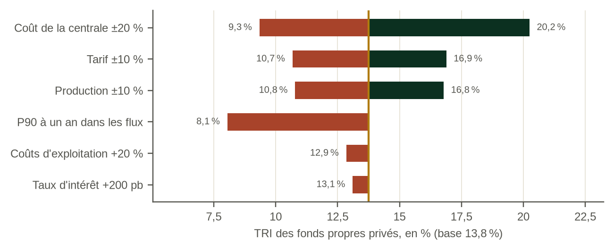

# Chapitre 16. Répartition des risques et tests de résistance

Ce chapitre éclaire la décision que tout prêteur et tout investisseur prend avant de s'engager : qu'est-ce qui cède en premier, à quel moment, et qui en supporte la charge ? Les tests de résistance sont souvent présentés comme une liste de sensibilités. Ils sont plus utiles comme recherche du point à partir duquel le projet échoue.

*Place dans la chaîne d'analyse : les tests de résistance, qui réunissent les maillons précédents pour ceux qui portent le risque.*

*Qui doit accepter la réponse : le développeur, les prêteurs et l'État.*

## 16.1 Qui porte quoi

Le modèle met en regard seize risques et huit parties : l'État, le développeur, l'entrepreneur de construction, le prêteur, la compagnie d'électricité, le consommateur, l'assureur et l'institution de financement du développement (IFD). Le tableau présente les principaux risques pour Kasiri. La répartition pour un producteur indépendant d'électricité (PIE) privé doté d'un tarif rémunérant uniquement l'énergie diffère sur un point important de celle du partenariat public-privé (PPP) de l'étude antérieure : le développeur est le premier à porter le risque hydrologique, parce que le tarif ne rémunère que l'énergie livrée.

| Risque | Porteur principal à Kasiri | Principaux instruments | Test de résistance du modèle |
|---|---|---|---|
| Hydrologie | Développeur | Dimensionnement sur le P90, réserve du service de la dette, balayage de trésorerie (cash sweep) | Sécheresse, climat, flux de trésorerie P90 |
| Construction et dépassement | Entrepreneur et développeur, selon la structure contractuelle | Structure contractuelle, provisions pour aléas, fonds propres de réserve (standby equity) | Dépassement, retard |
| Transport et réseau | Développeur (son propre raccordement) ; compagnie d'électricité (réseau) | Contrat de construction, énergie réputée livrée en cas d'écrêtement imposé par le réseau | Retard de la ligne de transport |
| Paiement par l'acheteur | Compagnie d'électricité, puis État | Garantie de paiement, garantie, facilité de liquidité | Test de résistance de l'acheteur, choc de change |
| Change | Compagnie d'électricité et État | Tarif partiellement en monnaie locale, engagement de convertibilité | Choc de change |
| Taux d'intérêt | Développeur, pour la part non couverte | Couverture | Taux d'intérêt +300 pb |
| Risque politique et résiliation | État | Assurance contre le risque politique, indemnité de résiliation | Exposition en cas de résiliation |

## 16.2 Résultats des tests de résistance

Tous les tests ci-dessous maintiennent le plan de financement aux conditions du cas de base.

Table: Tableau 16.1. Kasiri River Hydro : résultats des tests de résistance avec le plan de financement figé
| Scénario | TRI des fonds propres | DSCR minimum | Besoin de financement non couvert (M USD) | Capacité de paiement de la compagnie d'électricité | VAN budgétaire consolidée (M USD) |
|---|---|---|---|---|---|
| Cas de base | {{base_locked.kpi_eirr|pct1}} | {{base_locked.kpi_min_dscr|x2}} | {{base_locked.fin_gap|n1}} | {{base_locked.ut_ratio10|x1}} | {{base_locked.fis_npv_cons|n0}} |
| Cas bas | {{low.kpi_eirr|pct1}} | {{low.kpi_min_dscr|x2}} | {{low.fin_gap|n1}} | {{low.ut_ratio10|x1}} | {{low.fis_npv_cons|n0}} |
| Cas haut | {{high.kpi_eirr|pct1}} | {{high.kpi_min_dscr|x2}} | {{high.fin_gap|n1}} | {{high.ut_ratio10|x1}} | {{high.fis_npv_cons|n0}} |
| Sécheresse de trois ans | {{drought.kpi_eirr|pct1}} | {{drought.kpi_min_dscr|x2}} | {{drought.fin_gap|n1}} | {{drought.ut_ratio10|x1}} | {{drought.fis_npv_cons|n0}} |
| P90 à un an chaque année | {{p90cf.kpi_eirr|pct1}} | {{p90cf.kpi_min_dscr|x2}} | {{p90cf.fin_gap|n1}} | {{p90cf.ut_ratio10|x1}} | {{p90cf.fis_npv_cons|n0}} |
| Tendance climatique | {{climate.kpi_eirr|pct1}} | {{climate.kpi_min_dscr|x2}} | {{climate.fin_gap|n1}} | {{climate.ut_ratio10|x1}} | {{climate.fis_npv_cons|n0}} |
| Dépassement de 27 % | {{overrun.kpi_eirr|pct1}} | {{overrun.kpi_min_dscr|x2}} | {{overrun.fin_gap|n1}} | {{overrun.ut_ratio10|x1}} | {{overrun.fis_npv_cons|n0}} |
| Dépassement de 96 % | {{overrun96.kpi_eirr|pct1}} | {{overrun96.kpi_min_dscr|x2}} | {{overrun96.fin_gap|n1}} | {{overrun96.ut_ratio10|x1}} | {{overrun96.fis_npv_cons|n0}} |
| Retard de deux ans | {{delay.kpi_eirr|pct1}} | {{delay.kpi_min_dscr|x2}} | {{delay.fin_gap|n1}} | {{delay.ut_ratio10|x1}} | {{delay.fis_npv_cons|n0}} |
| Ligne de transport en retard de deux ans | {{trans.kpi_eirr|pct1}} | {{trans.kpi_min_dscr|x2}} | {{trans.fin_gap|n1}} | {{trans.ut_ratio10|x1}} | {{trans.fis_npv_cons|n0}} |
| Taux d'intérêt +300 pb (part non couverte) | {{rate.kpi_eirr|pct1}} | {{rate.kpi_min_dscr|x2}} | {{rate.fin_gap|n1}} | {{rate.ut_ratio10|x1}} | {{rate.fis_npv_cons|n0}} |
| Acheteur en difficulté, avec garantie budgétaire | {{offtaker.kpi_eirr|pct1}} | {{offtaker.kpi_min_dscr|x2}} | {{offtaker.fin_gap|n1}} | {{offtaker.ut_ratio10|x1}} | {{offtaker.fis_npv_cons|n0}} |
| Acheteur en difficulté, sans garantie budgétaire | {{offtaker_nobs.kpi_eirr|pct1}} | {{offtaker_nobs.kpi_min_dscr|x2}} | {{offtaker_nobs.fin_gap|n1}} | {{offtaker_nobs.ut_ratio10|x1}} | {{offtaker_nobs.fis_npv_cons|n0}} |
| Choc de change de 50 % | {{fx.kpi_eirr|pct1}} | {{fx.kpi_min_dscr|x2}} | {{fx.fin_gap|n1}} | {{fx.ut_ratio10|x1}} | {{fx.fis_npv_cons|n0}} |
| Combiné (dépassement, retard, acheteur, change) | {{combined.kpi_eirr|pct1}} | {{combined.kpi_min_dscr|x2}} | {{combined.fin_gap|n1}} | {{combined.ut_ratio10|x1}} | {{combined.fis_npv_cons|n0}} |
Note: Un TRI des fonds propres de −100 % signifie que les fonds propres sont entièrement perdus. La capacité de paiement de la compagnie d'électricité correspond au ratio le plus défavorable des dix premières années d'exploitation.

## 16.3 Ce qui cède en premier

Trois résultats ressortent.

C'est la rivière qui fait céder la dette en premier. Avec un tarif rémunérant uniquement l'énergie, une sécheresse de trois ans à 55 % du débit normal fait tomber le ratio de couverture du service de la dette (DSCR) minimum à {{drought.kpi_min_dscr|x2}}. La réserve est mobilisée mais ne couvre pas la totalité du manque. Un prêteur qui dimensionne sur le P90 à dix ans a besoin d'une réserve plus importante, d'un balayage de trésorerie les années humides ou d'un prêt plus petit, et doit voir le test de sécheresse avant le bouclage financier.

L'acheteur ne fait céder le projet que si l'État se retire. Avec une garantie budgétaire, le test de résistance de l'acheteur coûte à l'État et laisse le projet intact ; sans elle, le projet fait défaut. Le crédit du projet est donc en partie celui de l'État, quoi qu'en dise la structure.

L'expérience africaine donne une forme concrète aux tests de sécheresse et de défaillance de l'acheteur. Pour 2024, la Zambezi River Authority a réduit d'environ 47 % l'eau allouée à la production à Kariba [CL-04], et la production de la centrale de Kariba North Bank, d'une puissance de 1 080 MW, a été rapportée à 98 MW en juin 2024, contre 166 MW un mois plus tôt [R3:S2]. Du côté de l'acheteur, l'Electricity Company of Ghana devait environ 612 millions USD à la Bui Power Authority en mars 2023 [A1:S40]. Aucun de ces événements n'est un cas extrême pour la région ; tous deux sont récents.

Les dépassements de coûts de construction font céder les fonds propres, pas la dette. Avec le financement figé, un dépassement égal à la moyenne de la classe de référence laisse un besoin de financement non couvert d'environ {{overrun96.fin_gap|n0}} millions USD, que seuls des fonds propres de réserve ou de l'argent frais peuvent combler.

## 16.4 Test de résistance inversé

Le test de résistance inversé cherche de combien une variable doit varier avant que le projet n'échoue. Avec le financement figé, le DSCR minimum atteint 1,0 lorsque les débits de la rivière baissent d'environ {{x.be_flow_pct|pct0}} chaque année. C'est une variation plus forte que celle qu'implique en moyenne le P90 à un an, et plus faible que celle que produit une sécheresse pluriannuelle sévère pendant les années où elle dure ; c'est pourquoi le test de sécheresse compte davantage que la moyenne.

## Points pour les comités d'investissement et de crédit

1. Tester avec le plan de financement figé, et lire le besoin de financement non couvert autant que le DSCR.
2. Tester au moins une sécheresse pluriannuelle avec un tarif rémunérant uniquement l'énergie, et vérifier la réserve au regard de ce test.
3. Mener le test de résistance de l'acheteur avec et sans garantie budgétaire, et consigner qui porte la différence.
4. Demander les résultats du test de résistance inversé : la baisse de débit et le dépassement à partir desquels le projet échoue.
5. Lire la matrice de répartition pour le tarif et la structure du projet concerné ; ne pas la reprendre d'un autre projet.

## Travailler avec le modèle

*27_SCENARIOS* regroupe les cas, les paramètres des tests de résistance et l'instantané des scénarios du moteur complet ; *28_SENSITIVITY* regroupe le diagramme en tornade et l'instantané des sensibilités. *29_RISK_ALLOCATION* contient la matrice. Les commutateurs des tests de résistance se trouvent dans *01_CONTROL_PANEL*.
