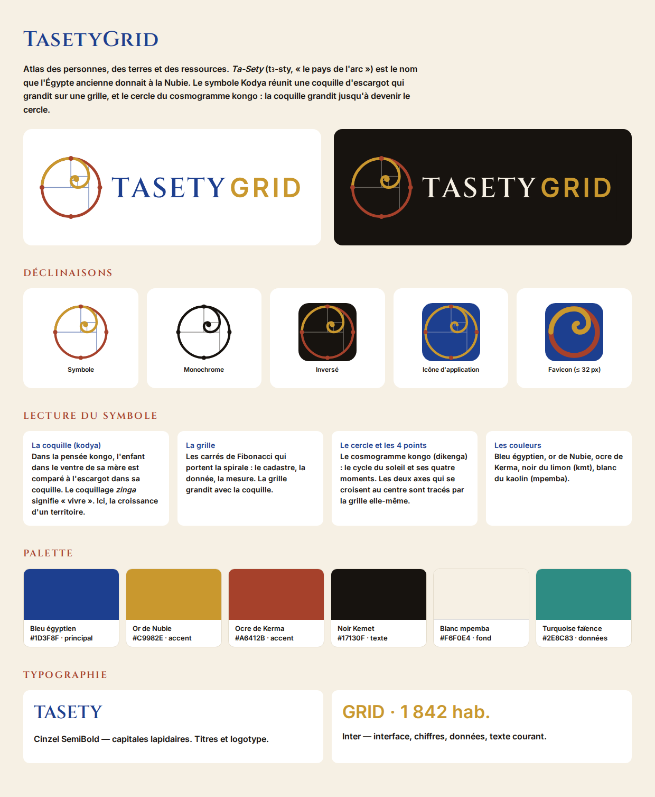

# TasetyGrid — Charte de marque

## 1. Le nom

**TasetyGrid** = *Ta-Sety* + *Grid*.

- **Ta-Sety** (égyptien ancien *tꜣ-stj*, souvent transcrit *Ta-Seti*) signifie très probablement
  **« le pays de l'arc »**. C'est le nom que l'Égypte ancienne donnait à la Nubie, en référence à la
  réputation de ses archers. C'était aussi le nom du 1ᵉʳ nome (province) de Haute-Égypte, à la frontière nubienne
  ([Wikipédia — Ta-Seti](https://en.wikipedia.org/wiki/Ta-Seti)).
- **Grid** : la grille, c'est-à-dire la donnée géolocalisée, le cadastre, le maillage du territoire.

Lecture proposée : *la grille du pays*, une infrastructure africaine qui cartographie le territoire.

**Signature** : *Atlas des personnes, des terres et des ressources* (EN : *Atlas of People, Land & Resources*).

**Architecture des modules** : TasetyGrid People · TasetyGrid Land · TasetyGrid Assets ·
TasetyGrid Resources · TasetyGrid Intelligence.

**Écriture** : toujours *TasetyGrid*, en un mot, avec T et G majuscules. Le logotype est en capitales
(TASETY GRID) pour des raisons graphiques uniquement.

## 2. Le symbole « Kodya »

Le symbole réunit trois idées en une seule forme géométrique.

| Élément | Origine | Ce qu'il dit du projet |
|---|---|---|
| **La coquille d'escargot** (spirale) | Dans la pensée kongo, la coquille (*kodya*) de l'escargot géant d'Afrique de l'Ouest est associée à la gestation : l'enfant dans le ventre de sa mère est comparé à l'escargot dans sa coquille. Un coquillage de l'estuaire du Congo est appelé *zinga*, « vivre ». Certains travaux présentent la spirale comme le signe de base de la religion kongo | La croissance, la vie, un territoire qui se développe |
| **La grille** (carrés de Fibonacci) | Les carrés dont les côtés suivent la suite 1, 1, 2, 3, 5, 8, 13, 21… portent la spirale | La donnée, le cadastre, la mesure. La grille et la coquille sont une seule et même figure |
| **Le cercle et ses 4 points** | Le cosmogramme kongo (*dikenga* ou *yowa*) : le soleil qui tourne autour des deux mondes, ses quatre moments, la ligne horizontale *Kalûnga* et l'axe vertical | Le cycle de la mise à jour continue, la vue d'ensemble du pays |

**Construction** : le cercle est le prolongement exact du dernier arc de la spirale (même centre,
même rayon). **La coquille grandit jusqu'à devenir le cercle.** Le centre du cercle tombe sur un coin
de la grille : deux lignes de la grille s'y croisent et tracent, sans ajout, les deux axes du cosmogramme.

Sources sur le symbolisme kongo : [Wikipédia — Kongo cosmogram](https://en.wikipedia.org/wiki/Kongo_cosmogram) ;
[Seattle Art Museum — Fu-Kiau](https://www1.seattleartmuseum.org/Exhibit/Archive/longsteps/fukiau.htm) ;
article « The spiral as the basic semiotic of the Kongo religion »
([MetaTOC](https://www.metatoc.com/papers/94955-the-spiral-as-the-basic-semiotic-of-the-kongo-religion-the-bukongo)).

## 3. Palette

| Nom | Hex | Inspiration | Rôle |
|---|---|---|---|
| **Bleu égyptien** | `#1D3F8F` | Le « bleu égyptien », pigment synthétique de l'Égypte ancienne, et le lapis-lazuli | Couleur principale, logotype |
| **Or de Nubie** | `#C9982E` | L'or, richesse emblématique de la Nubie | Spirale, accent |
| **Ocre de Kerma** | `#A6412B` | La céramique rouge à bord noir de la culture de Kerma (Nubie) | Cercle, titres, alertes |
| **Noir Kemet** | `#17130F` | *Kmt*, « la terre noire », le limon du Nil | Texte, fonds sombres |
| **Blanc mpemba** | `#F6F0E4` | *Mpemba*, le kaolin blanc kongo, couleur du monde des ancêtres | Fond |
| **Turquoise faïence** | `#2E8C83` | La faïence égyptienne | Couleur secondaire pour les cartes et graphiques |

Les couleurs historiques sont interprétées et non reproduites à l'identique : les teintes ont été choisies
pour l'écran et l'impression.

### Contrastes (WCAG 2.1, calculés)

| Couleur | sur blanc mpemba | sur noir Kemet | Texte courant ? |
|---|---|---|---|
| Bleu égyptien | 8,6:1 | 1,9:1 | ✅ sur fond clair |
| Noir Kemet | 16,3:1 | — | ✅ |
| Ocre de Kerma | 5,4:1 | 3,0:1 | ✅ sur fond clair |
| Or de Nubie | **2,3:1** | 7,1:1 | ❌ jamais en texte sur fond clair ; ✅ sur fond sombre |
| Turquoise faïence | 3,6:1 | 4,6:1 | Grands textes seulement sur fond clair |
| Blanc mpemba | — | 16,3:1 | ✅ sur fond sombre |

## 4. Typographie

- **Cinzel SemiBold** : logotype « TASETY » et grands titres. Ce sont des capitales inspirées des
  inscriptions lapidaires (à noter : leur origine est **romaine**, pas égyptienne).
- **Inter** : « GRID », interface, chiffres, tableaux, texte courant. Très lisible, chiffres tabulaires.
- Les deux polices sont sous licence **SIL Open Font License** et disponibles sur Google Fonts.
- Dans les fichiers SVG du logo, le texte est **vectorisé** : il ne dépend d'aucune police installée.

## 5. Fichiers

| Fichier | Usage |
|---|---|
| `logo/tasetygrid-logo-horizontal.svg` | Logo principal (en-têtes, documents) |
| `logo/tasetygrid-logo-horizontal-inverse.svg` | Sur fond sombre |
| `logo/tasetygrid-logo-vertical.svg` | Couverture, affiche, avec signature |
| `logo/tasetygrid-symbole.svg` | Symbole seul |
| `logo/tasetygrid-symbole-mono.svg` | Impression une couleur, tampon, gravure |
| `logo/tasetygrid-symbole-inverse.svg` | Symbole sur fond sombre |
| `logo/tasetygrid-icone.svg` | Icône d'application mobile |
| `logo/tasetygrid-favicon.svg` | Favicon et toute taille ≤ 32 px (version simplifiée, sans grille ni points) |

Régénération : `python3 tools/generate_logo.py --cinzel <Cinzel-SemiBold.ttf> --inter <Inter-SemiBold.ttf>`
(nécessite `fonttools`).

## 6. Règles d'usage

- Zone de protection autour du logo : au moins le **diamètre d'un des 4 points** × 3.
- Taille minimale : symbole complet ≥ 48 px ; en dessous, utiliser le favicon.
- Ne pas déformer, faire pivoter, changer les couleurs hors palette ni ajouter d'effets (ombres, dégradés).
- Ne pas séparer « TASETY » et « GRID » sur deux lignes.

## 7. Précautions culturelles et juridiques

1. **Symboles sacrés.** Le dikenga et la symbolique de la coquille sont des éléments religieux kongo
   vivants, pas de simples motifs décoratifs. Le logo s'en inspire par la géométrie (cercle, quatre points,
   spirale) sans reproduire de *nkisi* ni d'objet rituel. **Recommandation : présenter le symbole à des
   personnes ressources kongo** (chercheurs, autorités traditionnelles) avant son lancement public, et
   adapter si nécessaire.
2. **Cohérence géographique.** La plateforme cible d'abord le **Cameroun**. Ta-Sety (Nubie, actuel Soudan
   et sud de l'Égypte) et le Kongo (Angola, RDC, République du Congo) ne sont pas camerounais. Le nom porte
   donc une **vision panafricaine**, ce qui est cohérent avec « TasetyGrid Africa ». Au Cameroun, il faudra
   peut-être l'expliquer, voire compléter le logo par des références locales dans les déclinaisons nationales.
3. **Prononciation.** « Ta-sé-ti-grid » (FR) / « ta-SEH-tee-grid » (EN). À tester auprès des utilisateurs francophones et anglophones.
4. **Disponibilité du nom.** Une recherche web (octobre 2026) n'a trouvé **aucune utilisation** de
   « TasetyGrid ». **Ce n'est pas une recherche d'antériorité de marque.** Avant dépôt, faire une recherche à
   l'**OAPI** (marque valable au Cameroun et dans les autres États membres), à l'EUIPO, à l'OMPI (Madrid) et
   sur les noms de domaine.
5. **Ressemblance.** L'association spirale + carrés de Fibonacci est un motif répandu en design. La
   singularité du logo tient à la combinaison avec le cercle-cosmogramme et à la palette ; une vérification
   de similarité avec des logos existants fait partie de la recherche d'antériorité.
