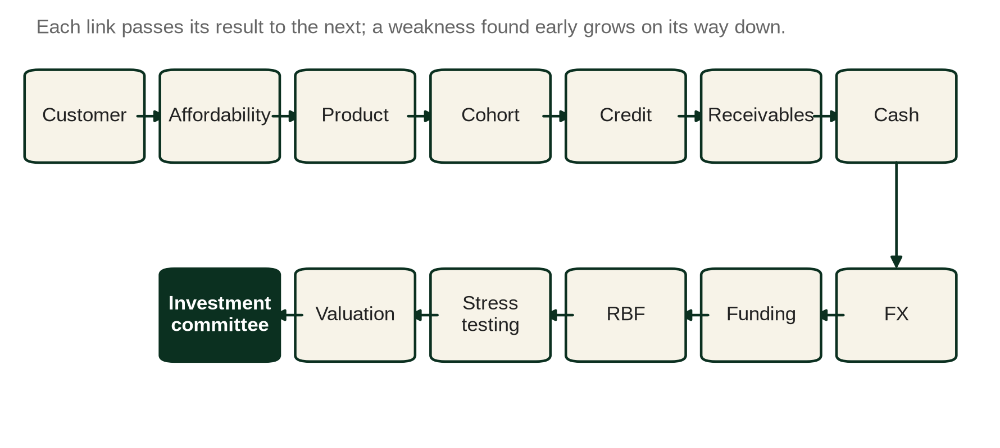
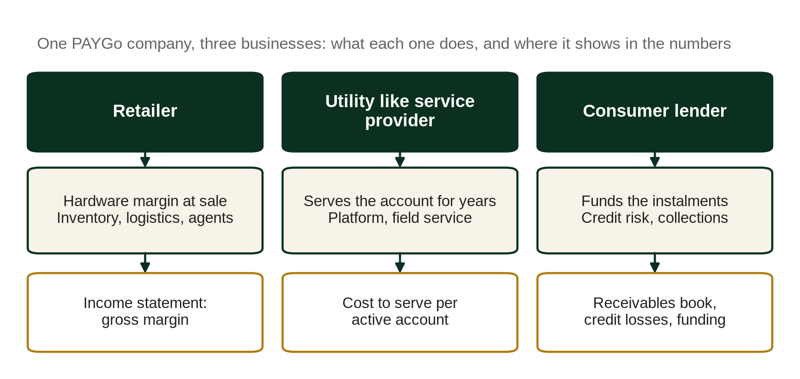
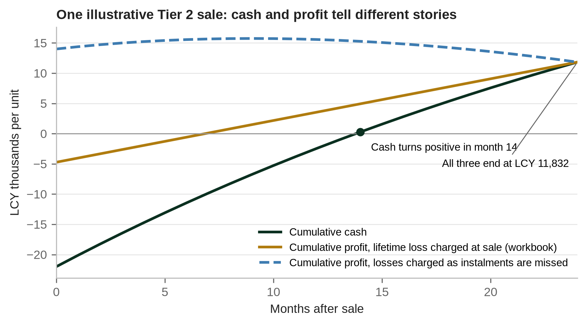
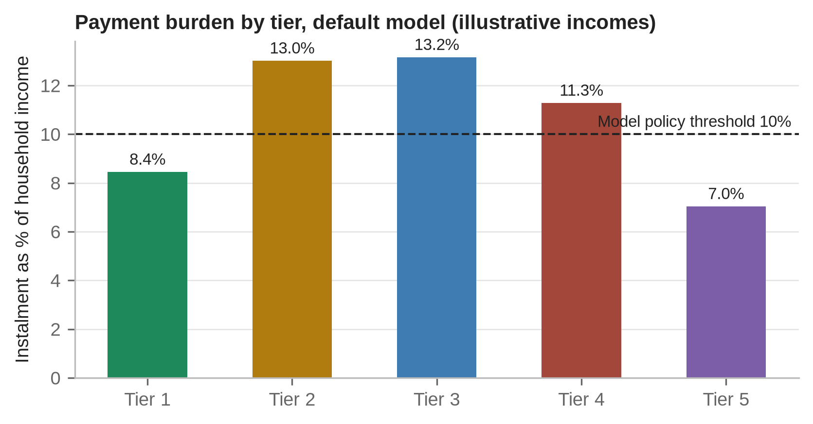
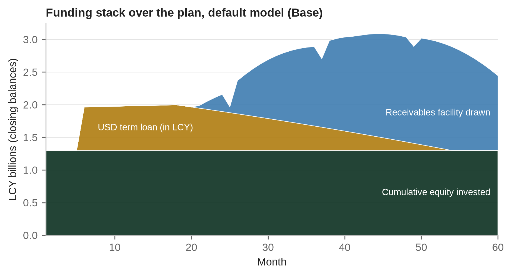
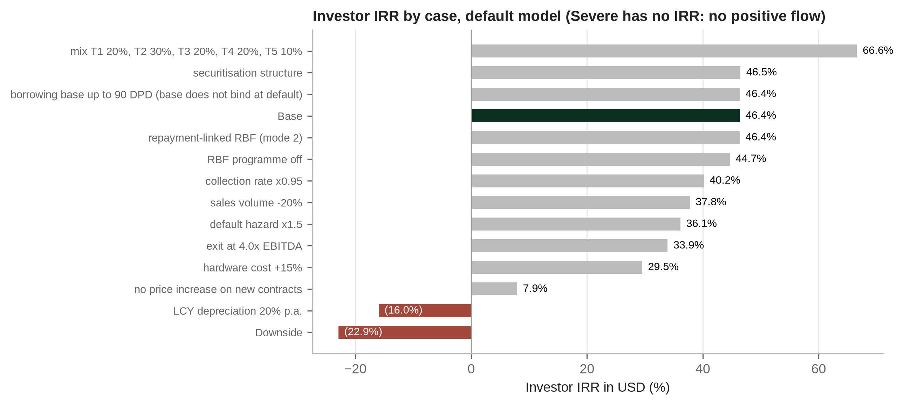
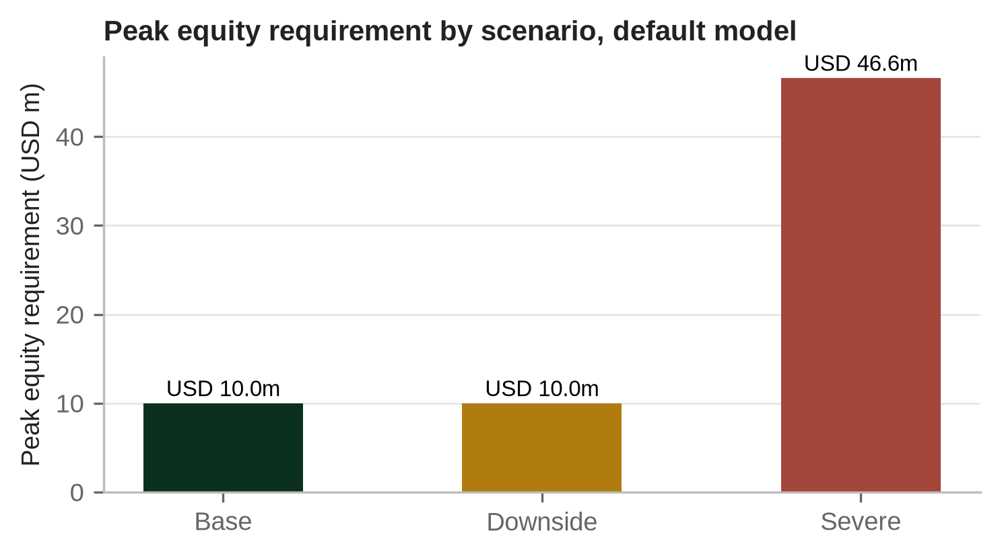
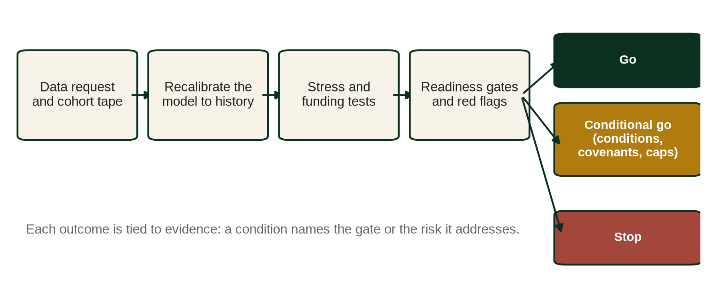

# About this book

**Book 2. PAYGo Solar Finance: Business Models, Credit Risk and Financial Structuring for Solar Home Systems.** First edition, version 0.2 (pre-publication).

The book belongs to the Africa Energy Finance collection, Business & Financial Models: a series of books, financial models, manuals, case studies and investment tools for energy businesses in African markets. Each book is built around one central question:

| Book | Subject | Central question | Status |
|---|---|---|---|
| Book 1 | Mini grids | Can this mini grid become a sustainable business? | Planned |
| Book 2 | Solar home systems (PAYGo): this book | Can PAYGo solar become profitable and financeable? | First edition |
| Book 3 | Clean cooking | Can clean cooking scale as a commercial business? | Planned |
| Book 4 | Commercial and industrial solar with battery storage | Should the customer invest, sign a power purchase agreement or use an energy service company? | Planned |
| Book 5 | Energy access fund | Can a fund mobilise capital and generate sustainable returns? | Planned |
| Book 6 | Power utilities | Can the utility become financially sustainable? | Planned |

Book numbers follow the editorial plan of the collection; the books are produced in the order of market need, and Book 2 comes first.

Each book is the centre of a set of products that share one method. For Book 2 they are:

| Product | Name | Role |
|---|---|---|
| Book | PAYGo Solar Finance (this book) | Explains the method and why it works |
| Model | MODEL 2: PAYGo Company Financial and Investment Model | Quantifies the method: monthly, five year, integrated three statement model |
| Manual | MANUAL 2: PAYGo Solar Finance Model User and Methodology Manual | Teaches the reader to operate the model |
| Case | CASE 2: SolaraPay | Demonstrates the method on a fictional company with a synthetic history |
| Training | Video course | Walks through the book and the model |

The book is written to stand on its own. A reader who never opens the model loses the worked numbers, not the argument.

# Preface

This book asks one question: can pay as you go solar become profitable and financeable? The record of the sector so far suggests that the answer can be yes, but only for companies that understand what kind of business they are running. A PAYGo solar home system company is a retailer, a utility like service provider and a consumer lender at the same time. The retailer books margin on the day of sale; the service provider keeps the device working and the customer engaged for years; the lender waits for the cash, a few shillings or naira or kwacha a day, from households whose incomes rise and fall with harvests and remittances. Many of the strategic and financial mistakes seen in this sector come from analysing one of those three businesses and forgetting the other two.

The book is written for the people who have to make decisions about such companies: founders and finance directors building a plan, credit officers at banks and development finance institutions sizing a facility, investment managers at impact funds preparing an investment committee memo, and the programme managers who design results based financing (RBF). It is also meant for graduate students who want to understand how distributed energy access is financed, beyond the headline numbers.

Each chapter supports one decision. Chapter 1 sets out the business model and the reasons why cohorts and the receivables book, rather than the sales line, are the unit of analysis. Chapters 2 to 5 cover the commercial foundations: customers and affordability, regulation, product and price plan design, and distribution. Chapters 6 to 9 deal with credit and profitability: repayment behaviour, portfolio KPIs, revenue recognition and credit losses, and unit economics. Chapters 10 to 13 turn to cash and capital: working capital and currency, the funding stack, securitisation and subsidies. Chapters 14 and 15 bring the analysis together for the people who carry the risk, through stress testing and the investor's diligence and memo. Chapter 16 walks through a complete case.

## How the book works with the model

The book has a companion workbook, MODEL 2, the PAYGo Company Financial and Investment Model, together with a user manual and a worked case study on SolaraPay Ltd, a fictional company in the fictional Republic of Kivara. The workbook is at version 0.8, in development at the time of this edition; the projections and valuations quoted in the book are identical in the released version 0.7, while the readiness results, the treatment of external references and the integrity checks follow version 0.8. The chapters refer to the workbook by sheet name, so that each concept can be tested on numbers. A reader who prefers to stay with the text can ignore those references; the argument stands without them. A reader who works through them will finish the book able to build, challenge and defend a PAYGo investment case.

All default inputs in the workbook, and all SolaraPay figures, are illustrative. They were chosen to make the mechanics visible and to resemble the orders of magnitude found in the sector, not to describe any real company. Where the book cites figures about real companies or about the sector, it says where they come from and how far they have been verified. Several published figures conflict with each other; the book reports the conflict rather than choosing the more convenient number.

## Conventions

Currency amounts are in US dollars (USD) or in the local currency of the example (LCY in the generic model, KVS in the SolaraPay case). Negative amounts and percentages are shown in parentheses. "Tier" refers to the capacity attribute of the Multi-Tier Framework used to label products in the workbook, not to a full tier assessment. DPD means days past due. Unless stated otherwise, rates are annual and percentages of a portfolio are measured on gross receivables.

## Sources and evidence

The book draws on six kinds of material and labels each one. A primary source is an official, regulatory or audited document, such as statutory accounts filed with a companies registry or a notice in an official gazette. Institutional evidence comes from bodies such as ESMAP and the World Bank, GOGLA and the PAYGo PERFORM initiative; a company's own announcements are placed in the same class, as primary but unaudited statements. Secondary reporting is news and trade press about those documents. A model assumption is an input of the companion workbook, chosen to make the mechanics visible; the default inputs describe a fictional market. A calibrated assumption is an input revised against a company's observed data, as in the SolaraPay case. An illustrative case output is a figure produced by the workbook for SolaraPay; it is never a benchmark for real companies.

Every external claim is recorded in a source register with two separate judgements. The grade describes the source: A for primary official, regulatory or audited documents; B for institutional sources and company disclosures; C for reputable secondary reporting; D for unverified or informal material. The status describes what has actually been checked: verified, verified but historical (the document has been superseded), pending the primary document, unverified, conflicting sources or not used. A claim can cite a grade A source and still be pending, because the grade describes the document and the status describes whether its page has been read. Only verified claims feed a calculation or a diagnostic in the workbook; the others appear in the text with their caveat. Pages are cited from the document held, and where a page has not been seen the register says so rather than guessing. Annex G summarises the register for this edition.

## Status of this edition

This is the first edition of Book 2, issued as version 0.2 for pre-publication review. It replaces the first full draft (version 0.1) of the series volume on solar home systems. Three things must happen before it is released for publication: the primary documents behind the claims marked as pending in Annex G must be read and cited by page; the companion model must complete its test in Microsoft Excel (it has been tested in LibreOffice and with an independent formula engine); and practitioners must review the text. Claims marked as pending or conflicting in Annex G must not be quoted from this edition without checking the original source.

## Acknowledgements and disclaimer

The analysis and any errors are the author's. Nothing in this book is investment, legal, tax or accounting advice. Readers should take professional advice in the jurisdiction concerned before acting on any of it.

# Introduction: how to read a PAYGo company

A PAYGo company can be read in a fixed order, and the order matters more than any single ratio. Each link in the chain below takes an input from the link before it and passes a result to the next. A weakness found early, in affordability or in the first cohorts, travels down the chain and arrives, larger, at the funding plan and the investment committee.

| Link | Question | What it passes on | Chapters |
|---|---|---|---|
| Customer | Who buys, and how stable is their income? | Segments, income levels and seasonality | 2 |
| Affordability | Can the household carry the instalment through a lean month? | Payment burden by product and segment | 2, 13 |
| Product | Which price plan, deposit and tenor? | Instalment, contract value, implied APR | 4, 5 |
| Cohort | How do customers sold in the same month actually pay? | Repayment and survival curves by tier | 6 |
| Credit | How much of what falls due will never be paid? | Default, roll rates, loss given default | 6, 7, 8 |
| Receivables | How large is the book, and how good is it? | Gross receivables, arrears, write offs, eligibility | 7, 10 |
| Cash | When does the cash arrive? | Operating cash flow, working capital | 1, 9, 10 |
| FX | Which costs and liabilities sit in another currency? | Translation and transaction effects | 10 |
| Funding | Who funds the gap, at what cost, against what security? | Equity, debt, receivables facilities | 11, 12 |
| Results based financing (RBF) | Does subsidy money arrive, when, and against what evidence? | Results based payments and their timing | 13 |
| Stress testing | What breaks first, and when? | Peak equity, covenant breaches, distance to failure | 14 |
| Valuation | What is the business worth, on whose assumptions? | Enterprise value, investor returns | 9, 15 |
| Investment committee | Go, conditional go or stop, on what evidence? | Decision and conditions | 15, 16 |

## Six questions that are not the same question

PAYGo companies are often described as "profitable" or "bankable" as if those words meant one thing. The book separates six questions, because a company can pass one and fail the next, and because each is answered by a different statement or test.

| Question | Answered by | Typical trap |
|---|---|---|
| Is the business commercially viable? | Unit economics: lifetime contribution per unit after acquisition, servicing and credit losses (Chapter 9) | Reading gross margin at sale as if it were contribution |
| Is it profitable in its accounts? | The income statement under the company's accounting policies (Chapter 8) | Profit booked at sale on contracts that will not be paid |
| Does it generate cash? | The cash flow statement and the month from which operating cash flow stays positive (Chapters 1, 10) | Growth that turns every sale into a receivable to be funded |
| Is the portfolio of good quality? | Cohort repayment against plan, arrears and write offs measured on consistent definitions (Chapters 6, 7) | Portfolio ratios flattered by fast growth |
| Can the book be funded? | Borrowing base, covenants, currency match and facility headroom (Chapters 11, 12) | Facilities sized on plan curves rather than observed ones |
| Is the company ready for investment? | Evidence that the numbers can be independently validated: data, governance, controls (Chapter 15) | Treating a polished model as evidence |

The income statement, the cash flow statement, the receivables book, the credit metrics, the funding plan and the equity returns therefore tell six different stories about the same company. The analyst's job is to read all six and to explain where they diverge. The rest of the book follows the chain in order.

# Chapter 1. The PAYGo business: retailer, utility like service provider and lender

This chapter supports one decision, which comes before any other in the book: what business is a PAYGo solar company really in, and therefore which numbers should an investor, a lender or a board read first? A company analysed as a retailer will be funded as a retailer, and a retailer's funding will not carry a two year consumer credit book. The chapter sets out the three businesses that sit inside one PAYGo company, shows how value and cash are created and where they diverge, works through a single sale to make the gap visible, and explains how the rest of the book and the companion workbook are organised.

*Place in the analytical chain: The frame for the whole chain, the three businesses inside one company.*

## 1.1 Three businesses in one legal entity

A PAYGo solar home system (SHS) company sells a physical product (a panel, a battery, a controller and a set of appliances) to a household that usually cannot pay the cash price up front. The customer pays a deposit, takes the system home and then pays a daily rate, in practice through mobile money, for a fixed tenor. A software lock in the device switches it off when the customer runs out of paid days and switches it back on when a payment arrives. At the end of the tenor the device unlocks permanently and the customer owns it.

Seen from the outside this is one business. Inside, it is three.

The first is a retailer. The company sources hardware, imports it, holds inventory, runs a network of agents and installers, and earns a gross margin on the hardware. Its economics are those of any consumer durables distributor: landed cost, freight and duty, agent commission, warranty and stock turn.

The second is a utility like service provider. For the life of the contract the customer experiences the product as a supply of light, phone charging and television, bought by the day. The company serves an active account for two to four years, answering calls, sending technicians and running a payment platform, at a cost to serve per active account per month that is largely independent of the original sale.

The third is a consumer finance company. Every unit sold on PAYGo creates a receivable equal to the cash price less the deposit, plus a financing charge (the PAYGo premium) that is earned over the tenor. The company has made an unsecured, or at best lightly secured, loan to a household with irregular income and often no credit history. It must fund the book, which means it has a balance sheet problem that neither the retailer nor the service provider would recognise.

Many of the analytical errors seen in this sector come from reading the company through one of the three lenses and ignoring the other two. Read as a retailer, the business looks highly profitable on the day of sale. Read as a utility like service, it looks like a stable annuity. Read as a lender, it looks like a high risk unsecured portfolio with thin recovery prospects. Each reading is partly right. The investment case depends on how the three interact.

"Utility like" describes how the customer experiences the product, as energy bought by the day, and how the company must serve the account for years. It does not mean that PAYGo companies are regulated as utilities; whether any utility, consumer credit or hire purchase rule applies depends on the law of each jurisdiction (Chapter 3).

| Area | Retailer | Utility like service provider | Consumer lender |
|---|---|---|---|
| Cash flow | Cash out at sale: hardware, logistics, commission | Steady servicing cost per active account | Cash in over the tenor, if customers keep paying |
| Credit risk | None on cash sales | Service quality affects willingness to pay | The main risk: default and loss given default |
| Customer retention | Ends at the sale | Drives renewals, upgrades and repeat sales | Paying accounts are the collateral |
| Collections | Not relevant | Platform and field teams keep accounts active | Arrears management, lockout, repossession |
| Working capital | Inventory and supplier credit | Small | The receivables book, by far the largest item |
| Funding | Trade finance and supplier credit | Operating cash | Equity, receivables facilities, securitisation |

## 1.2 How value and cash are created

Value in a PAYGo company is created when a customer who would otherwise have bought kerosene, batteries and phone charging pays, over time, more than the full cost of acquiring, financing and serving that customer. Cash is created later, and only if the customer keeps paying.

On day one the company pays for the hardware, freight and duty, installation and the agent's commission, and receives the deposit. Over the following months it receives instalments, less mobile money fees, and spends on servicing. If the customer stops paying, the company may repossess the device, refurbish it and resell it, recovering a fraction of the cash price after costs. If the customer completes the plan, the device unlocks and the relationship can continue through upgrades or add on products.

The workbook follows a simplified IFRS 15 logic for revenue. Hardware revenue equals the cash price and is recognised at the date of sale. PAYGo financing income equals the premium divided by the tenor and is recognised straight line over the life of each cohort. The loss allowance is charged at origination equal to the lifetime expected missed instalments, and it is consumed as instalments are missed. These are stated simplifications (the allowance is not staged under IFRS 9 and financing income does not follow the effective interest method). They are analytical modelling treatments and do not constitute a determination of the applicable accounting treatment under IFRS (Chapter 8). They were chosen because they make the lifetime accounting result and the lifetime cash result of each cohort reconcile exactly, which is the property a reader most needs when learning to see the gap between them.

## 1.3 The lockout and unlock mechanism

The lockout is the feature that made PAYGo possible, and its financial meaning is often misread. It does not secure the receivable in the way a charge over an asset secures a loan. A locked device has limited resale value in the hands of the customer, so the lockout gives the customer a reason to keep paying. It turns a credit decision that is made once at origination into a repayment decision that the customer makes every few days.

Three consequences follow. First, the lockout makes collection behaviour observable at very high frequency. A company knows within days which accounts have stopped paying. Second, the deterrent weakens as the customer approaches the end of the tenor and as the device ages; a battery that has lost capacity is worth less to keep running, and so the incentive to pay falls just as the remaining balance becomes small relative to the effort of paying it. Third, the lockout does not create recovery value. When a customer stops paying for good, the company recovers money only if it can find the device, retrieve it, refurbish it and resell it at a price that exceeds the cost of doing so. The observed loss given default can be close to total. In the SolaraPay case that runs through this book, the observed loss given default (LGD) proxy is about 99%.

The unlock at the end of the tenor matters for a different reason. It is the moment the receivable is extinguished and the customer becomes an owner. Ownership matters to impact investors and results based financing (RBF) programmes, and it is the base for repeat sales. Yet many companies cannot report, with evidence, how many customers have reached ownership. The workbook will not manufacture that number from proxy data.

## 1.4 The gap between booked margin and cash

A PAYGo company books most of its hardware margin on the day of sale. The cash for that sale arrives over the tenor, in small amounts, from customers whose income is seasonal and whose survival as paying accounts declines month by month. The income statement and the cash flow statement therefore tell different stories, and the difference grows with the rate of growth.

The workbook expresses repayment through a simple unit curve. At account age a months, with a constant monthly default hazard h, the share of accounts still paying is S(a) = (1 − h)^a. The expected collection in month a equals the instalment multiplied by the collection rate on paying accounts and by S(a). The collection rate captures the fact that even paying accounts do not pay every day of every month; the hazard captures accounts that stop paying altogether.

The illustration below uses the default Tier 2 parameters of the workbook: a monthly default hazard of 2.6% and a collection rate on paying accounts of 88%. The price plan and the costs are clean illustrative numbers chosen for this chapter, not the workbook's default price plan.

### A worked example: one Tier 2 sale

Consider an SHS with a television, sold in the fictional model market in local currency (LCY).

| Item | Amount (LCY) | Arithmetic |
|---|---|---|
| Cash price | 40,000 | Input |
| Deposit | 4,000 | Input |
| Amount financed | 36,000 | 40,000 less 4,000 |
| Daily rate | 72 | Input |
| Monthly instalment | 2,190 | 72 × 365 ÷ 12 |
| Tenor | 24 months | Input |
| Scheduled instalments | 52,560 | 2,190 × 24 |
| Total contract value | 56,560 | 52,560 + 4,000 |
| PAYGo premium | 16,560 | 56,560 less 40,000 |
| Landed hardware cost | 22,000 | Illustrative |
| Agent commission and acquisition cost | 4,000 | Illustrative |

On the day of sale the income statement shows hardware revenue of LCY 40,000 against a cost of sales of LCY 22,000, a gross margin of LCY 18,000, or 45.0% of the cash price. After the acquisition cost of LCY 4,000, the contribution on the day of sale is LCY 14,000. Financing income of LCY 690 a month (16,560 ÷ 24) follows over the tenor.

The cash position on the same day is different. The company has paid LCY 22,000 for the hardware and LCY 4,000 to acquire the customer, and it has received LCY 4,000 of deposit. Cash is (LCY 22,000).

Expected collections then arrive month by month. In month 1 the expected collection is 2,190 × 0.88 × 0.974, which is LCY 1,877. By month 12 it has fallen to LCY 1,405, and by month 24 to LCY 1,024, because fewer accounts are still paying. The sum of S(a) for a = 1 to 24 is 17.5548, so the expected lifetime collection is 2,190 × 0.88 × 17.5548, which is LCY 33,832, or 64.4% of the scheduled instalments.

| Month | Cumulative cash (LCY) |
|---|---|
| 0 | (22,000) |
| 6 | (11,445) |
| 12 | (2,433) |
| 13 | (1,064) |
| 14 | 269 |
| 18 | 5,262 |
| 24 | 11,832 |

The unit recovers its cash outlay in month 14. Over the full tenor it returns LCY 11,832 in cash: the deposit of 4,000 plus collections of 33,832, less the 26,000 spent on day one. That figure is before mobile money fees, servicing costs, warranty claims and the cost of the money that funded the LCY 22,000 deficit for more than a year. It also ignores repossession recoveries, which the default Tier 2 assumptions (20% repossession, 15% recovery cost) would add back only modestly.

Now compare the accounting. Expected missed instalments over the life of the contract are 52,560 less 33,832, which is LCY 18,728. If the company charges that amount as a loss allowance at origination, as the workbook does, the day one result is 18,000 less 4,000 less 18,728, a result of (LCY 4,728), and the financing income of LCY 16,560 then brings the lifetime result to LCY 11,832. Accounting and cash reconcile over the life of the unit.

A company that does not provision at origination, and recognises losses only as accounts fall behind, reports LCY 14,000 of contribution on day one and LCY 690 a month of financing income thereafter. The losses arrive later, spread across future periods. If sales are growing quickly, each period's income statement is dominated by the margin on new sales while the losses belong to older, smaller cohorts. Reported profit looks healthy. Cash, meanwhile, is (LCY 22,000) per unit at the point of sale and remains negative for over a year. A company selling 3,000 such units a month at this deficit needs LCY 66m of new funding every month before the first of those cohorts has paid back.

That is the gap. Everything that matters in the business sits in it.

## 1.5 Why cohorts and the receivables book are the unit of analysis

Because the economics of each sale unfold over the tenor, the company's results in any one period are a blend of cohorts at different ages. A month's collections mix the strong early payments of last quarter's sales with the thin late payments of contracts in their second year. A rising or falling portfolio collection rate can therefore reflect a change in credit quality, a change in growth rate, or both. Without cohort data there is no way to tell.

This is why the book treats the cohort (or vintage) and the receivables book as the primary objects of analysis. A cohort is the group of contracts originated in the same month, by tier; its repayment curve, read against plan at the same age, is the most direct evidence of whether underwriting works. The receivables book is the sum of all open cohorts, valued net of expected losses. It is the company's largest asset, the collateral for its debt and, in most cases, the main use of the equity raised.

PAYGo PERFORM is the industry KPI standard. Its first guide (CGAP, GOGLA and IFC Lighting Global, 2021, now historical) defined portfolio ratios such as the collection rate, receivables at risk and the write off ratio. The current standard (GOGLA, June 2026) narrows it to five KPIs on repayment and ownership, computed by the company on contract level data (Chapter 7). The workbook keeps the older ratios as operational and lender metrics, each with its definition printed, and reports PERFORM 2026 figures only when the company supplies them.

The sector evidence is sobering, although it still has to be read in the original. The ESMAP Off-Grid Solar Market Trends Report 2024 is reported to show an average PAYGo collection rate across reporting companies that stayed at about 62% from 2021 to 2023, with the top quartile at 75% to 80% and the bottom quartile below 50%. It is also reported that about half of companies had a write off ratio plus 30 day receivables at risk of between 30% and 50% in 2023, against 18% of companies in 2021 (Annex G, E1; the report's pages and definitions are still to be checked). A collection rate of this kind is not the Repayment Rate defined by the PAYGo PERFORM standard (Chapter 7), and neither figure describes any single company.

## 1.6 How PAYGo companies fail

The failure modes are few, and they compound.

Growth outrunning funding is the first. A company that accelerates sales to meet a revenue target increases its funding need faster than its profit, and if a facility is delayed or a covenant trips, the sales engine stalls with the cost base still in place. The workbook's default case shows the shape: in the Base case the fictional company needs peak equity of USD 10.0m, while the Severe case, which combines higher defaults, weaker collections, lower volume, dearer hardware and faster depreciation, takes it to USD 46.6m.

Credit drift is the second. Underwriting standards loosen quietly as agents chase volume, tenors lengthen to make larger products affordable, and new segments are added before their repayment is known. Each new cohort performs a little worse than the last. Recent losses have not yet appeared, so the portfolio looks stable for a year or more. In the SolaraPay case, the portfolio collection rate fell from 77.4% in the first history year to 69.3% in the second, and each tier's cumulative repayment at month 12 sits below plan.

Foreign exchange is the third. A PAYGo company typically buys hardware and borrows in US dollars while it collects in local currency over two years or more. Depreciation raises the cost of each new unit and the burden of hard currency debt, while the receivables already booked are fixed in local currency. In the workbook's default sensitivities, local currency depreciation of 20% a year turns a Base investor IRR of 46.4% into (16.0%). Freezing prices on new contracts, which is what a company does when it cannot pass FX through to customers, cuts the IRR to 7.9%.

None of these three failures is visible first on the income statement. All of them are visible first in the cohort curves, the funding plan and the FX bridge. The sector has not been spared distress. BBOXX LTD, a UK company, is recorded as having entered administration on 19 May 2025, with its latest filed accounts made up to the end of 2022 (Annex G, E7; the Gazette notice and the register entry have not yet been read for this edition). This book does not speculate on the causes of that administration; the three patterns above are simply the ones any investor should test for.

## 1.7 How the book and the workbook are organised

The book has 16 chapters and is built around a single question: can PAYGo solar become profitable and financeable? Chapters 2 to 5 cover the commercial foundations: customers and affordability, regulation, product and price plan design, and distribution. Chapters 6 to 9 deal with credit and profitability: repayment behaviour, portfolio KPIs, revenue recognition and credit losses, and unit economics. Chapters 10 to 13 turn to cash and capital: working capital and currency, the funding stack, securitisation and subsidies. Chapters 14 and 15 cover stress testing and the investor's diligence and memo, and Chapter 16 walks through a complete case.

The companion workbook is MODEL 2, the PAYGo Company Financial and Investment Model: a monthly, five year, integrated three statement model with 47 sheets and about 101,500 formulas, no macros and no circular references. Its integrity is tested on the *Checks* sheet by 38 tests, from the balance sheet and the monthly cash reconciliation to the roll forward of receivables, debt and equity. Its outputs have been checked three ways: against a secondary calculation written separately by the model's developer, which agrees to rounding precision; by an independent formula engine; and by a full recalculation in LibreOffice, which agrees on every formula cell. A test in Microsoft Excel is pending. None of these tests says anything about the realism of the assumptions, which is the subject of the rest of the book. The calculation chain runs from Inputs and Products, through Sales, Customers, PAYGo receivables, the Credit engine, the Vintage engine and Collections and recoveries, to the RBF engine, Working capital, Financing, the Financial statements, Covenants, Valuation, Investor returns, the Market benchmark, Calibration and Investment readiness. It carries five product tiers, from a pico solar kit on a 12 month plan to a large solar inverter with lithium storage on a 48 month plan.

The SolaraPay case, a fictional company in the fictional Republic of Kivara with a synthetic 24 month history, runs through every chapter. It is asking an impact fund for USD 4.0m of equity at USD 8.0m pre money and a local bank for a KVS 4.5bn receivables facility. Its management plan looks attractive; once the model is calibrated to its own history, the case becomes conditional. The way it moves from one to the other is the method this book teaches.

The workbook never rates a company. Its *Investment_Readiness* sheet runs 23 gates, counts each one only on evidence, and applies a fixed rule: STOP when a test fails or critical evidence is missing, CONDITIONAL GO when every critical gate is met, GO only when all 23 are. A GO says that the evidence file is complete for a committee to decide; it is not a recommendation. In its default state the workbook passes 2 of the 23 gates and reads STOP on a failed test: the Base projection fails the lender's annual debt service coverage ratio (DSCR) test in Years 1 to 4, so the covenant gate is not met. SolaraPay, with its history loaded, passes 4 and reads STOP for the same reason. That STOP is a finding against the business plan as modelled, not only a gap in the evidence.

## Points for the investment committee

1. Ask management to present the business as three businesses, with gross margin, cost to serve per active account and credit losses shown separately, and check that each one stands on its own assumptions.
2. Reconcile day one margin to cash for a representative unit in each tier, and confirm the month in which each tier recovers its cash outlay under the company's observed curves rather than its plan curves.
3. Require cohort repayment curves by tier and month of origination, compared with plan at the same age, before reading any portfolio level KPI.
4. Test the funding plan against growth: how much new funding is needed per month of sales, and what happens to the sales engine if the next facility is delayed by six months.
5. Identify every hard currency cost and liability and decide whether the price plan, the funding structure or both will absorb depreciation.
6. Confirm whether the company can evidence ownership at the end of tenor; if it cannot, treat any ownership based impact or RBF claim as unproven.

## Working with the model

Open the *Start* sheet first: it sets out what to input, what the model calculates, what the results mean and what an investor should read, and it counts the inputs by provenance label (model assumption, company data, external evidence, calibrated assumption, unverified). Then use the *Dashboard* and *KPIs* sheets to see the company as management presents it, and go to *Unit_Economics* to see the per unit margin and payback by tier. *Credit_Portfolio* and *Vintage_Dashboard* show the receivables book and the cohort curves. The *Checks* sheet should read OK before any output is relied on; it confirms internal consistency, not the realism of the assumptions. *Investment_Readiness* shows which of the 23 gates the company passes, where the evidence for each is held and who signed it off, and the decision that follows from the evidence alone.

# Chapter 2. Market, customers and affordability

This chapter supports the decision of who can pay, and how much. Every PAYGo price plan is a bet that a particular household can meet a particular instalment, every month, for a particular tenor, out of an income that is small and irregular. Sizing the market by counting households without grid access answers a different question. The investor needs to know how many of those households can carry the instalment without defaulting, and the lender needs to know how the answer changes in a bad harvest. The chapter sets out the customer segments by product tier, the effect of income seasonality, the payment burden ratio and the threshold used in the workbook, the deposit as a screening device, the implied annual percentage rate (APR), the Multi-Tier Framework (MTF) and the data that can be used to test affordability.

*Place in the analytical chain: Customer and affordability.*

## 2.1 Segments by tier

The workbook carries five product tiers, labelled by the capacity attribute of ESMAP's Multi-Tier Framework. Each tier implies a different customer.

| Tier | Default product | Default tenor | Typical segment |
|---|---|---|---|
| 1 | Pico solar kit | 12 months | Rural, first time PAYGo customers |
| 2 | SHS with TV | 24 months | Rural and peri urban households |
| 3 | Large SHS with DC fridge | 30 months | Peri urban households, kiosks |
| 4 | Solar inverter with lithium, about 1.2 kWp | 36 months | Urban households and small businesses on a weak grid |
| 5 | Solar inverter with lithium, about 3 kWp | 48 months | Upper income households, SMEs, productive use |

The segments differ in more than income. Tier 1 customers are often new to formal credit of any kind; the product replaces kerosene and torch batteries, and the instalment competes with those costs. Tier 2 customers are buying a television as much as electricity, which raises the perceived value of the product and also its discretionary character: when money is short, television is easier to give up than light. Tier 3 adds a fridge, which can turn the product into an income source for a kiosk or small shop. Tiers 4 and 5 serve customers who may already have a grid connection that fails often, and who are buying reliability and backup. Their incomes are higher and more regular, but the amounts financed are an order of magnitude larger and their repayment behaviour is, for most companies, unknown.

The workbook's default hazard assumptions reflect a common view of how risk falls as tiers rise: a monthly default hazard of 3.5% for Tier 1, falling to 2.6%, 1.9%, 1.3% and 1.0% for Tiers 2 to 5. These are model defaults for a fictional market, not sector evidence. A company should replace them with its own cohort data where it has them and treat them as assumptions to be tested where it does not.

## 2.2 Income seasonality

Most rural PAYGo customers earn from farming, casual labour, small trading or remittances. Their income is irregular within the month and seasonal across the year. Cash is plentiful after harvest and scarce in the months before it, when food stocks run down and school fees fall due. A household whose average monthly income comfortably covers the instalment may still be unable to pay in the lean months.

Seasonality has three consequences for analysis. First, any affordability ratio computed on average income overstates the household's capacity in the months that matter. Second, collection rates have a seasonal pattern, so a month's collection ratio must be compared with the same month in previous years before it is read as a trend. Third, cohorts originated in different seasons can behave differently: a customer who buys just after harvest pays the deposit easily and then meets the lean season a few months into the contract, when the lockout deterrent is weakest relative to other claims on the household's cash.

The companion model does not model seasonality in sales or collections. It works with monthly averages. The analyst must therefore apply seasonality outside the model, in the affordability test and in the reading of monthly KPIs, and should be cautious about any monthly covenant tested on a trailing window short enough to be dominated by a single lean season.

## 2.3 Payment burden

The core affordability measure is the payment burden: the monthly instalment divided by the household's monthly income.

Payment burden = monthly instalment ÷ monthly household income

The workbook computes it on the *Consumer_Risk* sheet for each tier, together with the deposit as a share of income, the implied APR and an affordability flag. The flag is raised when the burden exceeds a maximum set from the company's credit policy. The default maximum is 10%.

The 10% threshold is a policy choice. It is not a law, a regulatory standard or an empirical boundary between good and bad credit. It is a convenient, conservative line that a lender or a programme can write into a credit policy and test. A company may justify a different threshold, for example by segment or by income type, provided it can show repayment evidence that supports it. What it should not do is leave the threshold unexamined or set it after the fact to clear the products it wants to sell.

Sector studies use thresholds of the same order, but as conventions of their own method. The ESMAP Off-Grid Solar Market Trends Report 2024 is reported to treat a monthly payment of up to 5% of household income as affordable and up to 10% as affordable "at a stretch", and to price a Tier 1 PAYGo contract with a 20% deposit, two years of instalments and a 40% annual interest rate. On that basis it is reported to find that a Tier 1 PAYGo product is affordable for about 22% of people without access worldwide and affordable at a stretch for a further 27%, with far lower shares for a Tier 2 product. For Sub-Saharan Africa the reported shares are about 16% and a further 46% (Annex G, E1; to be checked against the report). These results depend on the method's own price, deposit, tenor and rate as much as on household incomes: change the contract and the shares change. The workbook's default of 10% therefore corresponds to the upper end of "at a stretch". Neither figure is a law of household finance.

Whether a given instalment is affordable depends on more than a single ratio:

| Driver | Why it matters |
|---|---|
| Level and source of income | Wage, farm and remittance incomes behave differently through the year |
| Seasonality | Lean months, not average months, decide whether a payment is missed (section 2.2) |
| Current energy spending | Kerosene, batteries and phone charging that the system replaces free up part of the payment |
| Payment frequency | Daily or weekly payments suit irregular incomes better than monthly ones |
| Contract duration | A longer tenor lowers the instalment and raises the total paid and the time at risk |
| Deposit | A higher deposit screens customers and lowers the amount financed, but excludes some households |
| Financing cost | The implied APR sets how much of the instalment pays for credit rather than for the system |
| Household liquidity | Savings, mobile money balances and access to informal credit absorb shocks |
| Product configuration | Appliances that earn income, such as a fridge for a shop, change the calculation |
| Local market conditions | Inflation, currency moves and prices of alternatives move the line over time |

### Worked example: burden for an illustrative Tier 2 plan

Take the illustrative Tier 2 plan used in Chapter 1: cash price LCY 40,000, deposit LCY 4,000, daily rate LCY 72, tenor 24 months. The monthly instalment is 72 × 365 ÷ 12, which is LCY 2,190. Assume, for illustration, a target household with average monthly income of LCY 18,000, made up of six lean months at LCY 12,000 and six good months at LCY 24,000.

| Measure | Arithmetic | Result |
|---|---|---|
| Burden on average income | 2,190 ÷ 18,000 | 12.2% |
| Burden in a lean month | 2,190 ÷ 12,000 | 18.3% |
| Burden in a good month | 2,190 ÷ 24,000 | 9.1% |
| Deposit as share of average monthly income | 4,000 ÷ 18,000 | 22.2% |

On average income the plan fails the 10% test. In good months it passes; in lean months the instalment takes nearly a fifth of income. To meet the threshold on average income, either the household must earn at least LCY 21,900 a month (2,190 ÷ 0.10), or the instalment must fall to LCY 1,800. At the workbook's conversion, an instalment of LCY 1,800 implies a daily rate of 1,800 × 12 ÷ 365, which is about LCY 59. Rounding to a daily rate of LCY 59 gives an instalment of 59 × 365 ÷ 12, which is LCY 1,795, a burden of 10.0% on LCY 18,000. Chapter 4 discusses how to get there: a longer tenor, a higher deposit, a lower premium or a smaller product, each with its own cost.

The SolaraPay case shows the same issue in its own plan. On the illustrative incomes in its *Consumer_Risk* sheet, the payment burden is 13.0% for Tier 2, 13.2% for Tier 3 and 11.3% for Tier 4, all above the model's 10% policy threshold. One of the seven conditions of the recommendation in that case is an affordability redesign to keep the instalment within 10% of income.

## 2.4 The deposit as a screening device

The deposit does two jobs. It reduces the amount financed, and therefore the exposure at default. It also screens customers. A household that can assemble a deposit of a few weeks' income has shown that it can save, that it has access to cash or family support, and that it values the product enough to commit. A household that cannot is more likely to struggle with the instalments.

The screening effect is the more important of the two, and the harder to measure. A higher deposit will reduce conversion: fewer prospects become customers. The customers who remain will, on the screening argument, repay better. The trade off is between volume and credit quality, and only data can settle where the optimum lies. A company that has varied its deposit across regions or over time, and tracked the subsequent cohorts, has evidence. One that has always used the same deposit has none.

In the worked example above the deposit is 22.2% of average monthly income, 16.7% of income in a good month (4,000 ÷ 24,000) and 33.3% in a lean one (4,000 ÷ 12,000). Deposits that are cut sharply during sales campaigns deserve attention in diligence; they tend to be followed by weaker cohorts, and the effect does not show in portfolio KPIs for several months.

## 2.5 Implied APR

PAYGo contracts are rarely described to customers as loans. The customer sees a deposit, a daily rate and a number of days. The implied APR is the figure that a regulator, a consumer advocate or a journalist will compute from those terms, and management should know it before anyone else does.

The implied APR is derived from the internal rate of return of the contract from the lender's point of view. The amount financed is the cash price less the deposit. The monthly rate r solves:

Amount financed = instalment × [1 − (1 + r)^(−T)] ÷ r

where T is the tenor in months. Two conventions then convert the monthly rate into an annual figure. The nominal APR is 12 × r. The effective annual rate is (1 + r)^12 − 1. The two can differ by several percentage points at PAYGo rates, so any disclosure must state which convention it uses, and the company must confirm with local counsel which one the applicable disclosure rules require.

### Worked example: APR for the illustrative Tier 2 plan

For the plan above, the amount financed is LCY 36,000, the instalment is LCY 2,190 and the tenor is 24 months. Solving the equation gives a monthly rate of about 3.28%. As a check, at r = 3.28% the annuity factor (1 less 1 ÷ 1.0328^24) ÷ 0.0328 is about 16.44, and 2,190 × 16.44 is about LCY 36,000.

| Measure | Arithmetic | Result |
|---|---|---|
| Amount financed | 40,000 less 4,000 | LCY 36,000 |
| PAYGo premium | (4,000 + 2,190 × 24) less 40,000 | LCY 16,560 |
| Monthly rate | Solved from the annuity equation | 3.28% |
| Nominal APR | 12 × 3.28% | 39.3% |
| Effective annual rate | 1.0328^12 less 1 | 47.3% |
| Flat rate, for comparison | 16,560 ÷ 36,000 ÷ 2 | 23.0% a year |

The flat rate, the premium divided by the amount financed and the number of years, is the figure a company may be tempted to quote. Against the effective rate it understates the cost by about half, because the balance declines as the customer pays. The SolaraPay plan reports implied APRs of 106% for Tier 1, 50% for Tier 2, 39% for Tier 3, 32% for Tier 4 and 25% for Tier 5. The pattern, with the highest rate on the smallest product and the shortest tenor, follows from the economics of PAYGo pricing: the fixed costs of acquisition and servicing are spread over a small amount financed. It is also the pattern most exposed to an APR cap or to public criticism, which Chapter 3 takes up.

## 2.6 The Multi-Tier Framework

ESMAP's Multi-Tier Framework, set out in Beyond Connections (2015), defines Tiers 0 to 5 of household electricity access across a set of attributes: capacity, duration, reliability, quality, affordability, legality, and health and safety. In the framework, a household's overall tier is generally set by the lowest tier it reaches across the attributes.

The workbook uses the framework's tier labels for its five products, but only on the capacity attribute. A full MTF assessment would also ask how many hours a day the supply is available, whether it is reliable, whether its quality damages appliances, whether it is affordable, whether the connection is legal, and whether it is safe. A product labelled Tier 2 on capacity may deliver a lower tier in practice if the battery is undersized for the household's evening use, or if the instalment is unaffordable. Affordability is an attribute of the framework, which links the access measure directly to the payment burden discussed above. Two common errors are labelling a product one tier above what its capacity supports, and treating the capacity label as a full access assessment in impact reporting.

## 2.7 Data sources for affordability

The illustrative incomes in the workbook are placeholders. A readiness flag on the *Checks* sheet stays raised until the analyst has replaced them and recorded that affordability has been reviewed, with an evidence status of Not provided, Provided or Validated. Three kinds of data can fill them.

Customer surveys at the point of sale or after installation can capture household income, its sources and its seasonality, together with what the household spent on energy before the purchase. They suffer from self reporting bias, from the incentive agents have to record answers that pass the credit check, and from small samples. They are most useful when collected by staff who are not paid on sales and when repeated over time.

Agent data, including the agent's own assessment of the customer, the location and the product chosen, are abundant and cheap but carry the same incentive problem. Their main value lies in comparison: cohorts sold by different agents, in different areas, can be compared on repayment, and agents whose customers persistently underperform can be identified.

Mobile money histories are the richest source where the customer consents to their use and the provider makes them available. The pattern of inflows over several months shows both the level and the regularity of income, and a history of previous PAYGo or digital credit payments, where it exists, is direct evidence of repayment behaviour. Access depends on the commercial terms with the mobile money operator and on data protection rules, which Chapter 3 covers.

The company's own repayment data are, in the end, the best affordability test. A customer who pays on time for twelve months has shown that the instalment was affordable over a full seasonal cycle. Linking repayment outcomes back to the income and deposit data captured at origination is how a company learns which threshold actually works for its customers.

## 2.8 From affordability to default risk

Affordability is a credit risk before it is a social one. A high payment burden is an early predictor of default; in a lean month it is the instalment that is dropped first when the lockout deterrent is weaker than the competing demand on the household's cash. A high burden can also disqualify a portfolio from results based financing programmes or attract regulatory attention, which converts a credit risk into a revenue and licence risk.

The workbook does not link burden to the default hazard by formula. The analyst makes that link through the hazard assumptions on *Products* and tests it with the *Scenarios* sheet. The SolaraPay case shows why the link matters. Its Tier 2 plan carries a burden of 13.0%, and when the model is calibrated to the company's history the Tier 2 monthly hazard rises from 2.60% to 3.38%, with cumulative repayment at month 12 observed at 69.4% against a plan of 74.5%. The data do not prove that burden caused the shortfall, but they are consistent with it, and an investment committee would not accept a plan that assumed the problem away.

## Points for the investment committee

1. Check that the incomes on *Consumer_Risk* come from evidence (survey, agent data or mobile money histories) and record their status; do not accept the illustrative placeholders.
2. Compute the payment burden on lean month income as well as on average income, by tier, and decide whether the 10% threshold or another documented threshold applies.
3. Ask for cohort performance split by deposit level and by season of origination, and confirm whether deposit discounts in sales campaigns were followed by weaker cohorts.
4. Recompute the implied APR for each plan, state both the nominal and effective conventions, and confirm with local counsel which one the disclosure rules require.
5. Confirm that tier labels reflect product capacity and that impact reporting does not present a capacity label as a full MTF assessment.
6. Require the hazard assumptions for any tier with a burden above threshold to be stressed, and see what the stressed hazard does to unit economics and covenants.

## Working with the model

*Consumer_Risk* holds incomes, the burden threshold, the evidence status and the affordability flag by tier. *Products* holds the price plan from which the instalment and APR are derived. *Products* and *Scenarios* hold the hazard and collection assumptions through which affordability concerns are expressed as credit risk. *Investment_Readiness* shows whether the affordability review gate has been passed.

# Chapter 3. The regulatory checklist

This chapter supports the decision of what could stop the company operating, or stop it scaling. A PAYGo company sits under several regulatory regimes at once: consumer credit, payments, data protection, tax, product standards, environmental rules and exchange control. Each can change the economics of the business, and some can halt it. The chapter is organised as a checklist of rule categories. For each it states the question to ask, why the answer matters financially and what evidence an investor should expect to see. It deliberately names no country's law and no regulator's rule. Rules differ by jurisdiction and change often, and in every category the position must be confirmed with local counsel before an investment committee relies on it.

*Place in the analytical chain: Constraints that apply to every link of the chain.*

## 3.1 How to use the checklist

Regulatory diligence on a PAYGo company is often done late and narrowly, confirming incorporation and the enforceability of facility documents while the commercial risks go unexamined. The better approach treats each rule category as a potential driver of the financial model. A licence requirement is a cost and a timing risk. An annual percentage rate (APR) cap is a constraint on the price plan. A ban on remote lockout is a change to the default hazard. An exchange control is a constraint on distributions and debt service.

The financial question in each case is the same: if the rule applies, or changes, which line of the model moves, and by how much? Where the answer is material, the committee should see the scenario run, not only the legal memo.

Three general points apply throughout. First, the relevant law is usually that of each operating country, and a group selling in several countries carries several positions. Second, the regulatory perimeter around PAYGo has in many markets been unclear, because the product sits between a hire purchase sale, a consumer loan and a utility service. Unclear rules can become clear quickly, and rarely in the company's favour. Third, a company's own description of its legal position is a starting point for diligence, not a substitute for it.

## 3.2 Consumer credit and lending licences

The question to ask is whether the PAYGo contract is characterised as credit under local law, and if so whether the company, or the entity that holds the receivables, needs a lending, credit or hire purchase licence to originate, hold or collect it.

The financial consequence is direct. If a licence is required and the company does not hold one, its contracts may be unenforceable, its collections may be challenged and its lenders may find that their security over the receivables is impaired. Obtaining a licence may impose capital requirements, reporting obligations and restrictions on the activities of the licensed entity, all of which add cost. In a group structure the question also arises for the entity that buys or holds receivables, such as a financing subsidiary or a special purpose vehicle (SPV).

The evidence an investor expects is a legal opinion on the characterisation of the contract, copies of any licences held with their conditions and expiry dates, correspondence with the regulator where the position is under review, and confirmation that the contract template has been reviewed against the applicable consumer credit rules.

## 3.3 Pricing disclosure and APR caps

The question is whether the company must disclose the cost of credit in a prescribed form, and whether any interest rate or APR cap applies to its contracts.

Disclosure rules matter because they change how the product is sold. A customer who is told the effective annual rate may react differently from one who is told the daily rate. They also matter because a company that has not computed its own APR will learn it from someone else. Chapter 2 showed that an illustrative Tier 2 plan with a flat rate of 23.0% a year has an effective annual rate of 47.3%, and that the SolaraPay plan has implied APRs from 25% on Tier 5 to 106% on Tier 1.

An APR cap, where it exists or is introduced, constrains the PAYGo premium. The effect falls hardest on small, short tenor products, where acquisition and servicing costs are spread over a small amount financed. A cap that the Tier 1 product breaches would force the company to raise the cash price (which moves margin from financing income to hardware revenue but does not change what the customer pays), to accept a lower return on the product or to withdraw it. Each option should be modelled. Where the cap applies to the total cost of credit including fees, the definition matters as much as the level.

The evidence expected is a schedule of the implied APR for every live price plan, computed on the basis the law requires, a sample of customer facing disclosures, and counsel's view on whether any cap applies and how it is measured.

## 3.4 Debt collection conduct and lockout practices

The question is whether there are rules on how the company may collect, including whether it may lock a device remotely, how much notice it must give, whether it may repossess, and what conduct is prohibited in contacting customers.

The lockout is the company's main collection tool. A rule that restricts remote disablement, requires a grace period before lockout, or limits repossession changes the default hazard and the recovery assumptions directly. A requirement for, say, a longer notice period before lockout will, other things equal, raise the share of customers who fall behind. A prohibition on repossession removes the recovery line altogether, although in many portfolios that line is already small: the SolaraPay case shows an observed loss given default (LGD) proxy of about 99%.

Conduct rules also carry reputational and licence risk. Aggressive collection by agents paid on recoveries, or repossession without due process, can lead to complaints, sanctions or loss of a licence, and to exclusion from results based financing (RBF) programmes or development finance institution (DFI) funding with consumer protection requirements.

The evidence expected is the company's collections policy, its lockout and repossession procedures, its agent incentive structure for collections, its complaints log and resolution data, and counsel's confirmation that the procedures meet the applicable conduct rules.

## 3.5 Data protection and credit bureau reporting

The question is what consent the company needs to collect, use and share customer data (including mobile money histories and device usage data), whether it must register as a data controller, whether data may be transferred across borders, and whether it must, or may, report to a credit bureau.

Data are central to a PAYGo company's underwriting and to its lenders' monitoring. A rule that restricts the use of mobile money histories in credit decisions removes one of the affordability data sources discussed in Chapter 2. A restriction on cross border transfer can affect a group that runs its credit platform from another country, and can complicate reporting to offshore lenders.

Credit bureau reporting works in two directions. Reporting repayment behaviour can improve customer discipline and allow good payers to build a credit history, which supports upgrades. Mandatory reporting brings compliance cost, and errors in reporting bring complaints. The company should also know whether it can draw on bureau data in underwriting.

The evidence expected is the company's privacy notice and consent forms, any registration with a data protection authority, the data processing agreements with its mobile money and technology providers, its data transfer arrangements, and its bureau reporting status.

## 3.6 Mobile money and payments

The question is whether the company's collection model depends on any payments licence, either its own or that of its mobile money partners, and on what terms it can access mobile money channels.

Almost all PAYGo collections arrive through mobile money. The company is exposed to the fees charged by operators, which in the workbook are an input as a percentage of cash collected (deposits and instalments), and to the risk that a channel is interrupted, repriced or restricted. If the company holds customer funds or operates a wallet, it may need a payments licence of its own. Settlement terms with operators determine how quickly collected cash reaches the company's bank account, and therefore how much cash sits outside the borrowing base at any time.

The evidence expected is the agreements with each mobile money operator, including fees, settlement times, exclusivity and termination clauses; any payments licence held or counsel's view that none is needed; and the reconciliation process between the payment platform, the device management system and the general ledger.

## 3.7 Tax

Tax affects the PAYGo company in several places, and the questions differ by tax.

For VAT and import duty, the question is whether solar equipment benefits from an exemption or reduced rate, which components qualify, and how stable that treatment is. Many PAYGo cost structures are built on a favourable treatment of solar products. A change in the treatment raises the landed cost of every new unit; it can also create disputes over whether a bundle that includes a television or fridge qualifies in full. The workbook carries freight, duty and clearing as a percentage of free on board (FOB) cost, so the effect of a change can be run directly. The VAT treatment of the PAYGo premium, and whether it is treated as a supply of goods or as financing, also needs to be confirmed.

For withholding tax, the question is what rate applies to interest, fees and dividends paid to foreign lenders and shareholders, and whether a treaty reduces it. Withholding on interest raises the cost of offshore debt where the lender requires a gross up; withholding on dividends reduces what an equity investor receives.

For transfer pricing, the question applies to groups: are the prices at which a holding or procurement company sells hardware to operating subsidiaries, and the fees it charges for technology, brand or management services, set on an arm's length basis and documented? Transfer pricing adjustments can create tax liabilities in the operating country and double taxation across the group.

The workbook applies corporate tax at a default rate of 30% with unlimited loss carry forward, paying tax only once accumulated losses have been absorbed. The analyst should confirm that loss carry forward is available locally and whether it is time limited, since a cap on carry forward brings tax forward in a business that loses money for its first years.

The evidence expected is tax opinions or rulings on VAT and duty treatment, the company's tax filings and any open audits, a withholding tax map for all cross border payments, and transfer pricing documentation for intra group flows.

## 3.8 Product standards and quality verification

The question is whether the products must meet a national standard or a recognised quality verification framework to be sold, to qualify for tax exemptions, or to be eligible for results based financing.

Quality affects every part of the model. A product that fails in the field produces warranty claims, customer disputes and defaults, because customers stop paying for devices that do not work. A product that does not meet a required standard may be blocked at import or excluded from an RBF programme. Programmes that pay per verified connection, such as SEforALL's Universal Energy Facility, set eligibility conditions that the company must meet (amounts and conditions vary and are not quoted here).

The evidence expected is test reports or certificates for each product, the warranty terms offered to customers and those obtained from suppliers, field failure and warranty claim rates by product, and confirmation of eligibility for any RBF programme in the plan.

## 3.9 E-waste and battery take back

The question is whether the company is subject to extended producer responsibility, battery take back or e-waste disposal rules, and what it costs to comply.

Batteries have a limited life and are hazardous at end of life. A take back obligation creates a cost per unit that may fall years after the sale, and a disposal liability that may need to be provisioned. For Tiers 4 and 5, where lithium storage is a large share of the hardware cost, battery replacement and disposal are material. Repossessed and refurbished devices also need a compliant route for components that cannot be reused.

The evidence expected is counsel's view of the applicable obligations, the company's take back and disposal process, contracts with licensed recyclers where they exist, and any provision for end of life costs in the accounts.

## 3.10 Foreign exchange controls and repatriation

The question is whether the company can convert local currency into hard currency and remit it abroad, for debt service, hardware payments, dividends and exit proceeds, and whether any approval, registration or delay applies.

For an offshore investor this is frequently among the most important regulatory questions. A PAYGo company that buys hardware and borrows in US dollars while it collects in local currency needs access to hard currency on predictable terms. If conversion is rationed, delayed or subject to approval, the company may be unable to pay suppliers or service its debt even when it is solvent in local currency. For equity investors, the exit valuation is meaningless if proceeds cannot be repatriated. The registration of foreign investment and loans at the point of entry is often a condition for later repatriation, so the step cannot be left to the exit.

The financial effect of depreciation is already severe in the workbook: at default inputs, depreciation of 20% a year turns a Base investor IRR of 46.4% into (16.0%). Controls add a liquidity risk on top of the price risk.

The evidence expected is counsel's view on exchange control requirements, evidence that foreign investment and loans have been registered where required, the company's history of conversions and remittances including any delays, and the hedging or local currency funding arrangements in place.

## 3.11 Securitisation enabling law and true sale

The question is whether local law allows PAYGo receivables to be sold to an SPV in a transaction that achieves a true sale and bankruptcy remoteness, and what steps are needed to perfect the transfer against the originator, the customers and third parties.

Securitisation lets a company fund its receivables book at a cost and scale that a corporate balance sheet cannot reach. Sun King is reported to have completed local currency securitisations in Kenya of about USD 130m in May 2023 and about USD 156m (KES 20.1bn) in July 2025, the latter arranged with Citi, with an SPV purchasing PAYGo receivables (company and secondary reporting). d.light is reported to have five securitisation facilities with about USD 718m of purchasing capacity since 2020, which is purchasing capacity and not debt raised (secondary reporting). They show what is possible where the law allows it, not that it is possible everywhere.

The legal questions are specific. Can receivables be assigned without each customer's consent, or must customers be notified? Does a transfer survive the insolvency of the originator, or can it be recharacterised as a secured loan? Can the originator continue to service the receivables, including operating the lockout, without undermining the true sale? Does the SPV need a licence to hold consumer credit receivables? Is there a stamp duty or registration cost on transfer? If the answers are unfavourable, the company may still borrow against its receivables through a warehouse facility with a borrowing base, but the lender is then exposed to the originator's credit as well as the portfolio's.

The evidence expected is a true sale and non consolidation opinion from local counsel, a description of the servicing arrangements and backup servicer, the form of notice to customers if required, and the steps and costs of perfection. In the workbook, the securitisation structure in the default case leaves the investor IRR almost unchanged (46.5% against 46.4%); the value of securitisation lies in scale, tenor and cost of funding, which the analyst should test with the company's actual terms.

## 3.12 The checklist at a glance

| Rule category | Main financial impact | Evidence an investor expects |
|---|---|---|
| Consumer credit and lending licences | Enforceability of contracts and security; capital and compliance cost | Opinion on characterisation; licences and conditions; regulator correspondence |
| Pricing disclosure and APR caps | Constraint on PAYGo premium and price plan; reputational risk | APR schedule by plan on the legal basis; sample disclosures; counsel's view on caps |
| Debt collection conduct and lockout | Default hazard, recovery assumptions, licence and reputational risk | Collections and lockout policy; repossession procedure; complaints data |
| Data protection and credit bureau | Access to underwriting data; penalties; cross border reporting | Consent forms; registration; data processing agreements; bureau status |
| Mobile money and payments | Collection fees, settlement timing, channel dependency | Operator agreements; payments licence position; reconciliation process |
| Tax: VAT and import duty | Landed cost of every unit; disputes on bundles | Rulings or opinions; filings; open audits |
| Tax: withholding and transfer pricing | Cost of offshore debt; cash to investors; group tax exposure | Withholding map; treaty position; transfer pricing file |
| Product standards and quality verification | Warranty cost, defaults from faulty units, RBF eligibility | Test certificates; warranty terms; field failure rates |
| E-waste and battery take back | Deferred end of life cost; disposal liability | Counsel's view; take back process; recycler contracts; provisions |
| Foreign exchange controls and repatriation | Ability to pay suppliers, service debt and exit | Exchange control opinion; registrations; conversion history; hedging |
| Securitisation law and true sale | Scale and cost of receivables funding; lender exposure to originator | True sale and non consolidation opinion; servicing and backup servicer terms |

## Points for the investment committee

1. Obtain a single regulatory memo from local counsel in each operating country that addresses every category in the table in section 3.12, and record any category where the position is unclear or under review.
2. Recompute the implied APR for every live plan on the basis required by local rules, and run the price plan under any cap that applies or is under discussion.
3. Model the effect of a restriction on remote lockout or repossession as a change in default hazard and recovery, and decide whether the investment case survives it.
4. Map every cross border cash flow (hardware, debt service, fees, dividends, exit proceeds) against exchange control and withholding tax, and confirm the registrations needed to repatriate.
5. Confirm the tax treatment of solar equipment and of the PAYGo premium, and run the effect of losing any exemption on landed cost and gross margin.
6. If securitisation is part of the funding plan, make a true sale opinion a condition precedent, not a post closing item.

## Working with the model

Most regulatory risks are tested by changing inputs rather than through a dedicated sheet. *Products* holds the price plan, from which the APR is derived, and the warranty provision. *Inputs* holds freight, duty and clearing, mobile money fees, tax rate, FX and the financing terms. *Products* and *Scenarios* carry the hazard, collection and repossession assumptions through which collection conduct rules feed the model, and *Credit_Assumptions* holds the recovery cost and the days past due (DPD) definitions. Each legal opinion relied on should be listed in the data room index, and *Investment_Readiness* should not be advanced on any gate that depends on a legal position not yet confirmed.

# Chapter 4. Product and price plan design

This chapter supports the decision of which price plan maximises value without destroying repayment. A price plan has five components: the cash price, the deposit, the daily rate, the tenor and the PAYGo premium that results from them. Each one moves revenue, exposure, affordability and default risk at the same time, and in opposite directions. The plan that maximises contract value on paper is rarely the plan that maximises cash collected. The chapter sets out the components, works through the trade offs using the workbook's repayment mechanics, discusses upgrades, add ons, warranty and product mix, and closes with what the SolaraPay case shows about getting the design wrong.

*Place in the analytical chain: Product, meaning the price plan, deposit and tenor.*

## 4.1 The components of a price plan

The workbook takes four inputs for each tier on the *Products* sheet: cash price, down payment (the deposit), daily rate and tenor. From these it derives the rest.

| Derived item | Formula |
|---|---|
| Monthly instalment | Daily rate × 365 ÷ 12 |
| Scheduled instalments | Monthly instalment × tenor |
| Total contract value | Deposit + scheduled instalments |
| PAYGo premium | Total contract value less cash price |
| Amount financed | Cash price less deposit |
| Implied annual percentage rate (APR) | From the annuity equation in Chapter 2 |

The cash price matters beyond what a cash buyer pays. Under the workbook's revenue logic, hardware revenue equals the cash price and is recognised at sale, while the premium is recognised as financing income straight line over the tenor. Setting a high cash price and a low premium therefore brings revenue forward without changing what the customer pays. It also lowers the implied APR. A company facing an APR cap, or public scrutiny of its rates, has an incentive to move value from the premium into the cash price, and an investor should check whether the cash price is one at which the company actually sells for cash.

The daily rate is what the customer sees and what the agent sells. Customers compare it with their daily spending on kerosene, batteries and phone charging, which is why the rate is quoted by the day. The common error in data entry is to put a monthly instalment in the daily rate field. The common error in design is to set the daily rate from the target contract value and only then check whether the customer can pay it.

The tenor sets the number of instalments, the time the receivable is outstanding and the number of months through which the customer must survive as a paying account. In the workbook's default tiers it runs from 12 months for the pico kit to 48 months for the largest inverter system.

## 4.2 The main trade offs

Two trade offs dominate design.

A longer tenor lowers the instalment, and therefore the payment burden, for a given contract value. It also raises exposure: the amount financed is outstanding for longer, the company needs more funding per unit, and the customer must keep paying for more months. Because default is modelled as a monthly hazard, each additional month is another month in which the account may stop paying. Longer tenors also stretch the customer relationship past the point at which the product's perceived value is high. A battery in its fourth year is worth less to the customer than one in its first, and the lockout deterrent weakens with it.

A higher deposit screens customers and lowers exposure. In the illustrative Tier 2 plan of Chapter 2 (cash price LCY 40,000, deposit LCY 4,000), doubling the deposit to LCY 8,000 reduces the amount financed by 4,000 ÷ 36,000, or 11.1%. It also raises the deposit from 22.2% to 44.4% of an average monthly income of LCY 18,000, and from 33.3% to 66.7% of a lean month income of LCY 12,000. Conversion will fall. Whether the cohorts that remain repay well enough to compensate is an empirical question that a company can answer only by testing deposit levels and tracking the resulting cohorts.

The premium sits across both. A higher premium raises contract value and financing income but also the instalment, the burden and the APR. If the higher burden raises the default hazard, part of the extra premium is never collected.

## 4.3 How expected collection falls with tenor

The workbook's unit curve makes the tenor trade off measurable. With a monthly default hazard h, the share of accounts still paying at age a is S(a) = (1 − h)^a. Collected cash in month a equals the instalment multiplied by the collection rate on paying accounts, c, and by S(a). The expected share of scheduled instalments collected over a tenor of T months is therefore:

Expected collected share = c × (1 ÷ T) × Σ S(a), for a = 1 to T

The sum is a geometric series. Writing q = 1 − h:

Σ S(a) = q × (1 − q^T) ÷ (1 − q)

Take the workbook's default Tier 2 parameters: h = 2.6%, so q = 0.974, and c = 88%. Survival falls as follows.

| Age (months) | S(a) = 0.974^a |
|---|---|
| 6 | 0.8538 |
| 12 | 0.7290 |
| 18 | 0.6224 |
| 24 | 0.5314 |
| 30 | 0.4537 |

For an 18 month tenor, q^18 = 0.62239. The sum is 0.974 × (1 less 0.62239) ÷ 0.026, which is 0.974 × 0.37761 ÷ 0.026, or 14.1459. The average survival over the tenor is 14.1459 ÷ 18, or 0.78588. The expected collected share is 0.88 × 0.78588, which is 0.6916, or 69.2%.

For a 24 month tenor, q^24 = 0.53139. The sum is 0.974 × 0.46861 ÷ 0.026, or 17.5548. The average survival is 17.5548 ÷ 24, or 0.73145. The expected collected share is 0.88 × 0.73145, which is 0.6437, or 64.4%.

| Tenor | Σ S(a) | Average S(a) | Expected collected share |
|---|---|---|---|
| 18 months | 14.1459 | 0.7859 | 69.2% |
| 24 months | 17.5548 | 0.7314 | 64.4% |

Extending the tenor from 18 to 24 months lowers the expected share of scheduled instalments collected by 4.8 percentage points. The last six months of the 24 month plan carry 25% of the scheduled instalments but only 19.4% of the expected collections (the sum for months 19 to 24 is 17.5548 less 14.1459, or 3.4089, and 3.4089 ÷ 17.5548 is 19.4%). The company is lending into months in which a large share of its customers have already stopped paying.

### Holding expected cash constant

The same mechanics show what a shorter tenor costs in affordability. The illustrative Tier 2 plan from Chapters 1 and 2 has an instalment of LCY 2,190 over 24 months and expected collections of 2,190 × 0.88 × 17.5548, which is LCY 33,832. To collect the same expected cash over 18 months at the same hazard, the instalment would need to be 33,832 ÷ (0.6916 × 18), or about LCY 2,718. On an average income of LCY 18,000 the burden rises from 12.2% to 15.1%.

That is unlikely to leave the hazard unchanged. Suppose, for illustration, that the higher burden lifts the monthly hazard to 3.38%, the level to which SolaraPay's Tier 2 hazard was recalibrated from its own history. At h = 3.38% and c = 88%, the expected collected share over 18 months is 64.5%, so the 18 month plan at LCY 2,718 would collect 2,718 × 18 × 0.6449, or about LCY 31,552, less than the 24 month plan at the original hazard.

Lengthening the tenor to meet the model's 10% policy threshold has the opposite problem. At the default hazard, the expected collected share over 30 months is 60.0%, and the instalment needed to collect LCY 33,832 is 33,832 ÷ (0.6003 × 30), or about LCY 1,879. The burden is 10.4%, still above the threshold, and the company carries the exposure for six more months. Tenor alone cannot reconcile this product with this customer; the cash price, the premium or the product itself must change.

The workbook keeps the hazard constant across tenors. In practice, the analyst must decide whether a change in tenor or burden changes the hazard, and run that judgement through the hazard inputs on *Products* and the levers on *Scenarios*. The direction is rarely in doubt; the size is what the company's own cohort data must establish.

## 4.4 Upgrades, add ons and repeat customers

A customer who completes a plan has shown, over a full seasonal cycle or more, that they can pay. That customer is the lowest risk prospect the company will ever have, and selling them a second product (an upgrade to a larger system or an appliance on a short plan) is the cheapest acquisition available. Upgrades also give the company a reason to stay in contact with owners, which supports ownership reporting.

The economics need care. An upgrade that rolls the remaining balance of an existing contract into a new, larger contract can extend tenor and conceal arrears. A lender should ask for upgrade cohorts to be reported separately, and for any balance carried into a new contract to be disclosed.

The workbook carries other revenue (digital loans and add on services) as a net take rate per active account per month. It is switched off by default. An analyst who switches it on should be able to show the evidence behind the take rate, and should remember that digital loans to PAYGo customers add credit exposure to the same households.

## 4.5 Warranty and after sales

Warranty is part of the price plan whether or not it is priced separately. A customer whose system fails stops paying. A warranty that is honoured quickly keeps the account alive; one that is not converts a hardware fault into a credit loss.

The workbook expenses a warranty and after sales provision at sale, as a percentage of landed cost, by tier. The percentage should be set from field failure and claim data. For Tiers 4 and 5, where lithium storage is a large share of the hardware cost and the tenor runs to 36 or 48 months, the warranty period and the battery's useful life should both be checked against the tenor. A battery that degrades materially before the last instalment is due is a credit risk built into the product.

Supplier warranties matter as well. If the company's warranty to customers is longer than the supplier's warranty to the company, the company carries the gap.

## 4.6 Product mix across tiers

Higher tiers look more attractive per unit. They carry lower default hazards in the workbook's default assumptions, larger contract values, higher repossession rates and higher advance rates under the receivables facility (75% for Tiers 4 and 5 against 50% for Tier 1). In the default sensitivities, raising the Tier 4 and 5 mix to 20% and 10% lifts the investor IRR from 46.4% to 66.6% with no covenant breach.

The difficulty is that those assumptions are, for most companies, untested. Tier 4 and 5 customers are different people, buying a different product for a different reason, often in urban markets where the company has less experience. A company that shifts its mix towards them on the strength of assumed hazards is making the largest credit bet in its plan on the least evidence. The amounts financed are large, so a modest error in the hazard moves the portfolio. Recovery depends on repossessing and reselling high value equipment, which is harder to do well than the repossession rate assumption suggests.

The SolaraPay case quantifies the risk. Its plan introduces Tier 4 (cash price KVS 390,000, 36 months) and Tier 5 (KVS 845,000, 48 months) as new products. Calibrated unit economics give them the best ratios in the range: lifetime value to customer acquisition cost (LTV/CAC) of 11.0x and 14.9x, and unit IRRs of 67% and 54%. But they have no history, and doubling their hazard cuts the investor IRR in the calibrated case from 29.0% to 14.8%, and the multiple on invested capital (MOIC) from 3.6x to 2.0x, with 38 months in breach of covenants. The recommendation in the case caps Tiers 4 and 5 as a pilot, to be released only after 12 months of cohort data within 10% of plan.

## 4.7 What the SolaraPay case shows

SolaraPay's price plans illustrate most of the points in this chapter.

| Tier | Cash price (KVS) | Implied APR | Tenor | Expected loss | LTV/CAC | Payback (months) | Unit IRR |
|---|---|---|---|---|---|---|---|
| 1 | 6,500 | 106% | 12 | 35.6% | 2.4x | 9 | 66% |
| 2 | 39,000 | 50% | 24 | 41.8% | 3.5x | 17 | 37% |
| 3 | 117,000 | 39% | 30 | 38.2% | 5.5x | 18 | 47% |
| 4 | 390,000 | 32% | 36 | 27.1% | 11.0x | 17 | 67% |
| 5 | 845,000 | 25% | 48 | 26.6% | 14.9x | 22 | 54% |

Tier 2 is the weakest product per unit on the measures that matter most to a lender. It has the highest expected loss in the range, 41.8%, and the lowest unit IRR, 37%. Its LTV/CAC of 3.5x is above Tier 1's 2.4x, but Tier 1 pays back in 9 months on a 12 month plan, while Tier 2 takes 17 months on a 24 month plan. Its lifetime contribution of KVS 7,524 is 19.3% of its cash price (7,524 ÷ 39,000). Tier 2 is also the largest line in the plan, at 40% of the mix.

The affordability evidence points the same way. Tier 2's payment burden is 13.0% of illustrative income, above the model's 10% policy threshold, as are Tier 3 at 13.2% and Tier 4 at 11.3%. Tier 2's cumulative repayment at month 12 was 69.4% against a plan of 74.5%, and calibration raised its monthly hazard from 2.60% to 3.38% and cut its collection rate from 88% to 87%. Applying the mechanics of section 4.3 to the calibrated Tier 2 parameters, the expected collected share over 24 months falls from 64.4% to 58.2% (0.87 × 16.0613 ÷ 24).

The design response for Tier 2 is redesign rather than withdrawal: change the plan so that the instalment falls within the affordability threshold for the customers actually being sold to. That may mean a smaller product, a lower premium, a higher deposit for some segments or a different target customer, and the redesign should then be tested on new cohorts before it is scaled. The case's conditions also require foreign exchange (FX) indexation of new prices, because a plan that cannot pass currency depreciation through to new customers loses its margin over time; in the workbook's default sensitivities, freezing prices on new contracts cuts the Base investor IRR from 46.4% to 7.9%.

## Points for the investment committee

1. For each tier, compute the expected collected share over the plan tenor from observed hazard and collection rates, and compare it with the share assumed in the business plan.
2. Check whether the cash price is a price at which the company actually sells for cash, and whether value has been moved from the premium into the cash price to lower the reported APR.
3. Ask for evidence that the tenor of each plan is supported by cohort data at that tenor, and not extrapolated from shorter plans.
4. Require deposit tests by segment, with the resulting cohort performance, before accepting any deposit reduction in the sales plan.
5. Cap the mix of untested tiers until 12 months of cohort data are within an agreed tolerance of plan, and run the plan with doubled hazards on those tiers.
6. Confirm that the warranty period and battery life cover the tenor for Tiers 4 and 5, and that supplier warranties match customer warranties.
7. Decide how the company will reprice new contracts for currency depreciation, and test the plan with and without that pass through.

## Working with the model

*Products* holds the price plan, the warranty provision and the sales mix. *Consumer_Risk* returns the burden, the deposit share of income and the implied APR for each plan. *Products* also holds the hazard, collection and repossession assumptions by tier. *Unit_Economics* shows expected loss, lifetime contribution, LTV/CAC, payback and unit IRR. *Sensitivity* and *Scenarios* test mix, hazard and pricing changes, and *Vintage_Dashboard* shows how observed curves compare with the proxies once company history is loaded through *Credit_Input* and *Vintage_Input*.

# Chapter 5. Distribution and customer acquisition

This chapter supports one decision: what a customer really costs to acquire, and whether that cost is recovered before the customer stops paying. The question sounds like a marketing question. In a PAYGo company it is a credit question, because the people who find customers also decide, in practice, who gets credit. A cheap customer who defaults in month four is the most expensive customer the company will ever sign.

*Place in the analytical chain: From product to cohort: who acquires the customer and at what cost.*

## 5.1 Who finds the customer

PAYGo solar is sold through people, not shelves. The customer is usually a rural or peri urban household with no formal credit history, a mobile money wallet and a seasonal income. Someone has to explain the product, collect the deposit, register the customer on the platform, install the system and come back when the panel is loose or the customer is late. Three channel types carry most of that work, and many companies run all three at once.

Direct sales agents are the backbone of most operations. They are individuals recruited from the community, often paid entirely on commission, sometimes with a small retainer, and grouped under a field supervisor or area manager. Their strength is reach and local knowledge. Their weakness is that the company controls them only through the commission plan, the training it gives them and the data it watches.

Retail partners (agro dealers, mobile money agents, phone shops, cooperatives and microfinance branches) give the company a fixed point of sale and a partner who already knows the customer. The partner usually takes a margin or a fee per contract and carries some stock. The company gains footfall and loses some control over customer selection, because the partner's incentive is the sale, not the repayment.

Installers matter most for Tiers 3 to 5. A large SHS with a DC fridge, or a lithium inverter system of 1.2 to 3 kWp, needs wiring, mounting and a site check. The installer is often the last company representative to see the customer before the first instalment falls due, and is the first to hear that the system "does not work", which in collections language often means "I am not going to pay". Installer quality therefore shows up in early default rates as well as in warranty costs.

The channel choice is not neutral for credit. An agent paid only on a signed contract has every reason to sign marginal customers. A retailer who keeps the deposit margin has a similar bias. Companies that understand this design the incentives so that the person who originates the account shares in its performance.

## 5.2 Commission structures

The simplest plan pays a flat commission when the deposit is received and the system is activated. It is easy to explain and cheap to administer, and it is the plan most likely to fill the book with accounts that never make a second payment.

The alternatives split the commission. A typical structure pays part on activation and part later, conditional on the account being current at a checkpoint such as month three, or on a minimum share of instalments having been paid. Some companies add a portfolio bonus based on the agent's whole book, for example a share of collections on accounts the agent originated, or a bonus withheld if the agent's 30+ days past due (DPD) ratio exceeds a threshold. The most direct form is the clawback: commission already paid is recovered from future earnings if the account defaults within a defined window.

Each design has costs. Deferred and clawback commissions reduce agent cash income in the first months, which raises attrition among new recruits who cannot wait to be paid. They also require a reliable link between each account and its originating agent in the servicing platform, and a payroll process that can net clawbacks against new commissions without disputes. Where agents can simply leave and join a competitor, a clawback that exceeds the agent's pending earnings is uncollectable and acts only as a deterrent on paper.

A practical test for an investment committee is to ask what share of total commission paid in the last twelve months was contingent on repayment, and how much of the contingent amount was actually withheld. If the answer to the second question is close to zero, the contingency is either not enforced or not binding.

## 5.3 Fully loaded CAC

The workbook defines customer acquisition cost (CAC) on *Unit_Economics* as agent and installer commission plus marketing and acquisition, both entered per unit sold, by tier, on *Products*. That is the right structure for a unit model. It is also the place where most management plans understate the true cost, because the field organisation that makes those sales possible usually sits in fixed overheads.

A fully loaded CAC adds the costs that exist only because the company is acquiring customers: field supervisors and area managers; agent recruitment and training, which is recurring because agent attrition is high; transport, fuel and motorcycle costs for the sales force; demonstration kits and marketing materials; the verification team that calls new customers to confirm the sale; and losses on fraudulent or fictitious accounts. Installation and last mile logistics are better left in cost of sales, as the workbook does, because they scale with units delivered rather than with the effort to find buyers.

The following table builds an illustrative monthly CAC for one territory selling a Tier 2 system. All figures are assumptions for illustration in LCY. The territory has 50 agents averaging 6 sales each per month, so 300 sales.

| Cost line | Basis | Monthly cost (LCY) | Per sale (LCY) |
|---|---|---|---|
| Upfront commission | 300 sales × 1,800 | 540,000 | 1,800 |
| Repayment linked commission | 300 × 1,200 × 80% of accounts current at month 3 | 288,000 | 960 |
| Marketing (radio, roadshows, point of sale) | Territory budget | 150,000 | 500 |
| Narrow CAC | Commission plus marketing | 978,000 | 3,260 |
| Field supervisors | 5 × 90,000 | 450,000 | 1,500 |
| Recruitment and training | 8% monthly attrition, 4 new agents × 30,000 | 120,000 | 400 |
| Transport and fuel | Territory budget | 210,000 | 700 |
| Verification calls and fraud losses | Territory budget | 60,000 | 200 |
| Fully loaded CAC | Total | 1,818,000 | 6,060 |

The arithmetic is simple: 540,000 + 288,000 + 150,000 = 978,000, or 3,260 per sale; adding 450,000 + 120,000 + 210,000 + 60,000 = 840,000 of field costs gives 1,818,000, or 6,060 per sale. The fully loaded figure is 1.86 times the narrow one (6,060 ÷ 3,260). If the cash price of the system were LCY 36,000, the fully loaded CAC would be about 16.8% of it, against about 9.1% on the narrow definition.

Two cautions apply to the repayment linked line. First, the 80% qualification rate is itself a credit assumption; if early defaults rise, this line falls, which partly offsets the loss and is the whole point of the design. Second, the line should be accrued at the date of sale on the expected qualification rate, not expensed when paid, otherwise CAC per sale looks lower in a fast growing month and higher in a slow one.

Nothing here is wrong with the narrow figure as long as everyone knows what it is. The error is comparing a narrow CAC with a lifetime value that has already absorbed field overheads elsewhere, or presenting a narrow LTV to CAC ratio to an investment committee as if it covered the cost of the sales organisation. When a company quotes its CAC, ask for the reconciliation from the per unit figure to total sales and marketing expense in the management accounts for the same period. The gap between the two is usually where the field organisation lives.

## 5.4 Agent quality as a credit variable

Agents differ, and the difference shows up in cohort curves. Two agents in the same territory, selling the same product at the same price in the same month, can originate books that repay very differently. Some agents screen customers properly, explain the daily rate and the lockout, and install cleanly. Others sell to whoever pays the deposit.

A simple illustration shows why this matters more than the commission line. Take a Tier 2 contract with a monthly instalment of LCY 2,000. By month 12, LCY 24,000 of instalments have fallen due. Suppose accounts originated by the top half of agents have repaid 76% of that amount and accounts from the bottom half 62%. The difference is 14 percentage points of LCY 24,000, or LCY 3,360 per account by month 12 alone (0.14 × 24,000), more than the entire narrow CAC in the table above and still growing in the second year of the contract.

The implication is that agent identity belongs in the cohort data. A credit officer should be able to see vintage curves cut by originating agent, agent tenure, sales channel and territory, not only by product and month of sale. Where those cuts show persistent gaps, the company has three levers: retrain or remove weak agents, tie more of the commission to repayment, or apply tighter eligibility rules (larger deposits, shorter tenors, smaller products first) to accounts originated through weaker channels. All three cost sales volume in the short term. An investment committee that rewards volume alone is implicitly choosing not to pull them.

Early indicators help because full curves take two years to form. The share of accounts that pay the deposit and never make a further payment, the share more than 30 DPD at month three, and the share of accounts that were never active for a full month after installation are all available within one quarter of the sale. They are imperfect predictors of lifetime loss, but they are fast enough to manage agents with.

## 5.5 Fraud and ghost sales

Any plan that pays per activation invites fabricated activations. The patterns recur across markets. An agent registers a fictitious customer, pays the deposit from their own wallet, earns a commission larger than the deposit and either sells the unit for cash or keeps it. A real customer is registered under several identities to multiply commissions. Units are reported as installed at a household that does not exist, or diverted to a neighbouring market where the product sells for cash. A retailer swaps a working unit for a faulty one returned by another customer.

Most of these leave traces in the data. Deposit only accounts cluster by agent. Several accounts share a phone number, a mobile money wallet or a GPS location. Installation timestamps arrive in bursts at month end, just before the commission cut off. Deposits are paid from the same wallet that receives the agent's commission. Device telemetry shows a unit that has never been switched on, or that is drawing power hundreds of kilometres from the registered address.

The controls are routine but must be resourced: verification calls to a sample of new customers within days of the sale, GPS tagged installation photographs, a rule that deposit and commission wallets cannot coincide, commission paid only after a first instalment rather than on the deposit, and periodic field audits of a random sample of accounts per agent. The cost of these controls belongs in fully loaded CAC, as in the table above. A company that shows no fraud losses at all usually has not looked.

For a lender, ghost sales are worse than ordinary defaults because they inflate the borrowing base at origination. A fictitious account looks current for the first month and is eligible collateral until it crosses the eligibility threshold. Facility documents should therefore include eligibility criteria that exclude deposit only accounts and accounts that have not made a first instalment, and the lender's field audit rights should extend to customer verification.

## 5.6 Territory expansion economics

A company that has saturated its first region grows by opening new territories, and new territories are expensive before they are productive. A depot, an area manager, vehicles and the first cohort of agents arrive before the sales do. New agents sell less than seasoned ones, and the first customers in a new area are often the least well known.

A simple ramp makes the point. Suppose a new territory carries fixed costs of LCY 900,000 a month for the depot, the area manager and vehicles. At maturity it sells 300 units a month, so those costs add LCY 3,000 per sale (900,000 ÷ 300). In the first month, with 100 sales, they add LCY 9,000 per sale (900,000 ÷ 100); at 200 sales in the third month, LCY 4,500. Add the field costs of the previous table and the first quarter's CAC can be two or three times the steady state figure, before any difference in credit quality is considered.

Early cohorts in a new territory also tend to repay worse, because the agents are new, local knowledge is thin and the company has no repayment history to screen against. A plan that applies the mature territory's hazard rates to the first year of a new territory is optimistic twice: on cost and on credit.

Sector estimates point the same way. The ESMAP Off-Grid Solar Market Trends Report 2024 is reported to find that serving hard to reach areas can raise the price of a Tier 1 PAYGo system by up to 57%, from about USD 127 to about USD 199, because operating costs, distribution, finance and credit risk are all higher there (Annex G, E1; to be checked against the report). A territory plan that keeps the price and the loss rate of the first region is assuming that this premium does not exist.

The disciplined approach treats a new territory as a pilot with a budget, a ramp and stop criteria: a minimum sales productivity per agent by month six, an early repayment indicator within a stated band of the established territories, and a fully loaded CAC that converges towards the mature figure. The SolaraPay case uses the same logic for its new Tier 4 and 5 products, where the recommendation caps volumes until twelve months of cohort data sit within 10% of plan.

## 5.7 How CAC enters the unit economics

On *Unit_Economics*, the workbook sets lifetime customer cash, expected loss, recoveries, results based financing, hardware, installation, warranty, CAC and servicing cost against each other for each tier, and derives contribution, LTV to CAC, cash payback, unit IRR and unit NPV. CAC enters at the date of sale, as a cash outflow before the first instalment arrives. That timing is why it weighs so heavily on payback and unit IRR: every unit of CAC is funded in full on day one and recovered, if at all, in small daily payments over the tenor.

The calibrated SolaraPay case shows the pattern by tier. LTV to CAC runs from 2.4x for Tier 1 to 3.5x for Tier 2, 5.5x for Tier 3, 11.0x for Tier 4 and 14.9x for Tier 5, with cash payback of 9, 17, 18, 17 and 22 months respectively. The large systems look far better on LTV to CAC because acquisition cost does not rise in proportion to the contract value. They also carry the least evidence: Tiers 4 and 5 are new products with no repayment history, and their hazard rates remain at the proxy values.

Two points follow for anyone using the sheet. First, the CAC that *Unit_Economics* uses is whatever has been entered per unit on *Products*. If field supervisors, training and transport sit in fixed operating costs on *Inputs*, the unit view will flatter acquisition, while the consolidated statements still carry the full cost. An analyst who wants a fully loaded unit view can move those costs into the per unit marketing and acquisition line, but must then remove them from fixed costs to avoid counting them twice; the consolidated results should not change, only their attribution. Second, CAC should be tested together with credit, not apart from it. A plan that cuts commission to lower CAC may raise early defaults; a plan that shifts commission towards repayment linked payments may lower CAC per sale and loss rates at the same time. Running both changes through the workbook shows which effect dominates.

A payback period that is longer than the point at which a meaningful share of the cohort has stopped paying is a warning. For Tier 2 at the default monthly hazard of 2.6%, about 27% of accounts have stopped paying by month 12 (1 less 0.974^12, that is 1 less 0.729) and about 38% by month 18 (1 less 0.974^18, that is 1 less 0.622). A 17 month payback is recovered, on average, from the customers who are still paying, which is precisely why the curve in the next chapter matters.

## Points for the investment committee

1. Ask for CAC on both definitions, narrow and fully loaded, and for the reconciliation of per unit CAC to total sales and marketing expense in the management accounts.
2. Check what share of commission is contingent on repayment, and how much was actually withheld or clawed back in the last twelve months.
3. Require vintage curves cut by originating agent, channel and territory, and ask management what it did about the worst performing decile of agents.
4. Review fraud controls: verification calls, GPS tagged installations, wallet matching, field audits; and confirm that facility eligibility criteria exclude deposit only accounts.
5. Treat new territories and new tiers as pilots with explicit ramp costs, early credit indicators and stop criteria, rather than as extensions of the mature business.
6. Read LTV to CAC and payback alongside the share of each cohort still paying at the payback month, not on their own.

## Working with the model

Enter commission and marketing per unit by tier on *Products* and field overheads on *Inputs*, and decide deliberately where field costs sit. Read CAC, contribution, LTV to CAC, payback and unit IRR on *Unit_Economics*. Use *Vintage_Input* to load cohorts by month of sale; if the company can supply agent or channel level cohorts, analyse them outside the workbook first and use the results to set tier hazard rates on *Products*.

# Chapter 6. Repayment behaviour: cohorts, curves and defaults

This chapter supports the decision on which every other number in the plan depends: how the company's customers will actually pay. Revenue, receivables, the borrowing base, covenant headroom and valuation all flow from a small set of repayment assumptions. When those assumptions are wrong, the error is rarely visible in the first year, because new sales hide it. The tools in this chapter (cohorts, survival curves, days past due (DPD) buckets and roll rates) are how a credit officer finds the error before the lender's covenant test does.

*Place in the analytical chain: Cohort and credit: how customers actually repay.*

## 6.1 Cohorts and vintages

A cohort, or vintage, is the group of accounts originated in the same period, usually a calendar month, for the same product. Every analysis in this chapter starts there for a simple reason: customers behave according to how long they have had the product, not according to the calendar. A portfolio in which most accounts are three months old will look healthier than one in which most are eighteen months old, even if every customer behaves identically. Grouping accounts by origination month and measuring them against account age, in months since sale, removes that distortion.

The workbook follows this logic throughout. The *Curves* sheet defines how one unit of each tier behaves at each account age; the cohort sheets (*Cohort_T1* to *Cohort_T5*) apply those unit curves to every monthly cohort, scaled by units sold and by the price index; and *Ops* adds the cohorts up by calendar month. Portfolio figures are therefore always sums of cohort behaviour, never assumptions in their own right. That is the correct order of construction, and it is the order in which a lender should read a company's own data.

## 6.2 The survival model

The workbook's repayment engine rests on one assumption: in each month, a fixed share of the accounts that are still paying stops paying for good. That share is the monthly default hazard, h. If an account survives month one with probability (1 − h), it survives a months with probability

S(a) = (1 − h)^a

and the instalment collected from a unit at age a is the instalment times the collection rate on paying accounts times S(a). The collection rate captures the fact that customers who are still paying do not pay every day: they let the device lock for a few days at harvest time, pay late after school fees, or top up irregularly. The hazard captures the customers who leave altogether.

For the default Tier 2 product (SHS with TV, 24 month tenor, hazard 2.6%, collection on paying accounts 88%), the arithmetic is as follows. The share of accounts still paying at month 12 is 0.974^12 = 0.7290, so about 72.9% survive and 27.1% have stopped. At month 24, the end of the tenor, the share is 0.974^24 = 0.5314, so about 53.1% survive and 46.9% have stopped. Multiplying by the collection rate, the expected payment in month 24 is 0.88 × 0.5314 = 46.8% of the instalment due.

The same arithmetic applied to the other default tiers shows how the hazard and the tenor interact. Tier 1 (hazard 3.5%, 12 months) ends its tenor with 0.965^12 = 65.2% of accounts still paying. Tier 3 (hazard 1.9%, 30 months) ends with 0.981^30 = 56.2%. A lower monthly hazard over a longer tenor can leave a similar share of non payers at the end of the contract, which is why tenor extension is a credit decision and not only an affordability one.

The model is deliberately simple. Real hazards are not constant: they are usually higher in the first months (customers who never intended to pay, or whose installation failed) and lower later (customers who have paid for a year rarely walk away from an asset they nearly own). A constant hazard calibrated to month 12 will tend to understate early losses and overstate late ones. For portfolio planning the error partly cancels; for the timing of covenant tests it may not, and that is one reason to calibrate against observed cohorts as soon as they exist.

## 6.3 Cumulative repayment curves

The most useful single picture of a cohort is its cumulative repayment curve: cumulative collections divided by cumulative instalments due, at each account age. Deposits are excluded from both, because a deposit is paid by every customer by construction and would flatter the ratio. For the default Tier 2 curve:

| Account age (months) | Share still paying, S(a) | Cumulative repayment |
|---|---|---|
| 3 | 92.4% | 83.5% |
| 6 | 85.4% | 80.3% |
| 12 | 72.9% | 74.5% |
| 18 | 62.2% | 69.2% |
| 24 | 53.1% | 64.4% |

Cumulative repayment at age m is 0.88 × (S(1) + ... + S(m)) ÷ m. At month 12 that is 0.88 × 10.153 ÷ 12 = 74.5%; at month 24, 0.88 × 17.555 ÷ 24 = 64.4%. The curve falls throughout the tenor because each month adds an instalment due in full and a collection from a shrinking pool of payers.

Two features make the curve valuable in practice. It can be compared across cohorts at the same age regardless of when they were sold, so deterioration shows up as a later cohort sitting below an earlier one at month 6 or month 12. And it can be compared with plan from the first month, long before a cohort completes its tenor. A cohort that sits five points below plan at month 12 will not recover that gap by month 24 unless something has changed in collections; the constant hazard model says the gap will widen.

## 6.4 DPD buckets, roll rates and cures

Survival curves describe what happens on average. Day to day credit management works with arrears: how many days past due each account is, grouped in buckets. The workbook uses current, 1 to 30, 31 to 60, 61 to 90, 91 to 180 and over 180 DPD.

In PAYGo, DPD needs a definition before it can be compared. Some platforms measure days since the device last had credit; others measure the cumulative shortfall against the payment schedule, expressed in days of the daily rate. The two diverge for a customer who pays regularly but less than the rate: such a customer may never be locked for long, yet fall progressively behind schedule. The schedule based measure is closer to how a lender thinks about arrears and is the one that reconciles to the receivable balance. Whichever is used, it must be stated, applied consistently and kept the same in the data supplied to lenders.

Roll rates measure the share of accounts in one bucket that move to the next bucket a month later. An illustration, with assumed rates: of 10,000 current accounts this month, 10% (1,000) are in the 1 to 30 bucket next month; 40% of those (400) roll to 31 to 60; 60% of those (240) roll to 61 to 90; and 75% of those (180) roll to 91 to 180. The product of the roll rates, 0.10 × 0.40 × 0.60 × 0.75 = 1.8%, is the share of a current pool that reaches 91 days past due three months later on this path. The complement of each roll rate is the share that stays in the bucket or cures.

A cure is an account that returns to current from a delinquent bucket. PAYGo has more cures than most consumer lending, because the lockout gives customers a direct and immediate reason to pay: the lights go off. A household that skipped two weeks during a lean month can clear its arrears in one payment after harvest. Roll rates fall steeply as accounts age past 60 or 90 DPD, however. An account that has been dark for three months has usually found an alternative, moved, sold the device or decided the debt is not worth paying.

The workbook's proxy engine assumes that an account which stops paying never resumes. Cures therefore appear only in the indicative stage based expected credit loss (ECL), through a cure rate input of 30% applied to Stage 2 balances. That is a conservative simplification for the cash forecast and should be read as such. Where a company has real cure data, it belongs in the comparison between observed and proxy curves.

## 6.5 Lockout dynamics and the default definition

The lockout is both the PAYGo company's main collections tool and the reason PAYGo arrears behave differently from bank loan arrears. When credit runs out, the device stops working. Most customers respond quickly; the 1 to 30 DPD bucket is large and churns constantly. The lockout loses its force once the customer stops valuing the service: when the battery degrades, when the grid arrives, when another company offers a newer product, or when the household simply cannot find the money. At that point the account moves quickly through the buckets and stays there.

The workbook defines default at 180 DPD. Other definitions are possible, including 90 DPD (the IFRS 9 rebuttable presumption, discussed in Chapter 8) or a number of consecutive days without credit. A longer definition delays recognition of default and lifts reported cure rates; a shorter one may classify customers who would have resumed paying as defaulted. The choice matters less than consistency: the same definition should drive the default flag, the write off policy, the repossession trigger and the data supplied to the lender, and a change of definition should be disclosed with restated history.

## 6.6 Seasoning and the denominator effect

Seasoning is the process by which a cohort's arrears and losses build up as it ages. A new cohort has no arrears to speak of; its losses arrive over the following 12 to 30 months. A portfolio's ratios are therefore a weighted average of cohorts at different stages of seasoning, and the weights depend on how fast the company is growing.

The effect can be measured. Take the default Tier 2 curve and a company that originates the same number of units every month for two years. In a given month, its collection rate across all live cohorts is the average of 0.88 × S(a) over ages 1 to 24, which is 64.4%. Now suppose instead that originations have grown at 5% a month for the same period, so that younger cohorts carry more weight. The same customers, behaving identically, now produce a portfolio collection rate of 68.3%. At 10% monthly growth, the figure is 71.6%. Nothing about credit quality has changed. Only the denominator has.

This is one of the most common misreadings of PAYGo portfolios. A growing book shows a falling ratio of arrears to receivables, because each month's new, current accounts enter the denominator before their arrears have had time to form. When growth slows, the ratios deteriorate even if customer behaviour is stable. The workbook's default Base case shows the pattern: the collection rate falls from 84.5% in Year 1 to 79.8%, 76.5%, 74.5% and 73.3% in Years 2 to 5 as the book seasons, without any change in the underlying hazards. The calibrated SolaraPay plan follows the same path, from 82.3% in Year 1 to 70.3% in Year 5, while its 30+ DPD ratio rises from 8.4% to 14.4%.

Two corrections help. The first is to read cohort curves rather than portfolio ratios, which removes the weighting problem altogether. The second is to use lagged ratios for the portfolio: arrears today divided by the receivables of some months earlier, which approximates the balance from which today's arrears actually arose. Neither replaces the other.

## 6.7 Calibrating against observed cohorts

The default curves in the workbook are proxies. They are reasonable starting points for a fictional market and nothing more. Once a company has twelve or more months of cohort history, the proxies should be replaced by values calibrated to that history.

The SolaraPay case shows the method. The company supplied 24 months of synthetic cohort data. At month 12, cumulative repayment observed was 64.6% for Tier 1 against a plan of 70.3%, 69.4% for Tier 2 against 74.5%, and 76.3% for Tier 3 against 79.6%. Every tier sat below plan, by 5.7, 5.1 and 3.3 percentage points respectively. The plan figures are exactly what the survival formula gives at the default inputs: for Tier 2, the 74.5% computed in section 6.3.

Recalibration raised the hazards and trimmed the collection rates on paying accounts. Tier 1 moved from a hazard of 3.50% to 4.55% and a collection rate of 88% to 86%; Tier 2 from 2.60% to 3.38% and 88% to 87%; Tier 3 from 1.90% to 2.47% and 90% to 89%. Each new hazard is 1.3 times the old one. The fit can be checked with the same formula. For Tier 2, 0.87 × (sum of 0.9662^a for a from 1 to 12) ÷ 12 gives 70.1%, against 69.4% observed; for Tier 1 the recalibrated month 12 figure is 64.4% against 64.6% observed; for Tier 3, 75.9% against 76.3%. Each calibrated curve sits within one percentage point of the observed point. The consequence over the full tenor is larger than the month 12 gap suggests: at the recalibrated Tier 2 hazard, the share of accounts still paying at month 24 falls to 0.9662^24 = 43.8%, against 53.1% on the default curve.

Three cautions apply. A single checkpoint can be matched by many combinations of hazard and collection rate; the M6 and M18 points, and the DPD curves, should be used to choose between them. Tiers 4 and 5 had no history and kept their proxy values, which is a statement of ignorance, not of comfort; the SolaraPay recommendation therefore caps their volumes until twelve months of cohort data sit within 10% of plan. And synthetic or short histories describe one set of conditions; a drought year or a currency shock will move the curves again.

## 6.8 Proxy and Actual modes

The workbook keeps history and projection apart on purpose. On *Credit_Assumptions*, the credit data mode is set to 1 (Proxy) or 2 (Actual). In Proxy mode, the credit engine splits balances on paying accounts between current and 1 to 30 DPD by an input share, and splits receivables at risk across the later buckets by input shares that reconcile to gross receivables. In Actual mode, *Credit_Portfolio* and the selected block of *Credit_Engine* report the company's own month end DPD buckets, write offs, recoveries and cures from *Credit_Input*, while projections and the facility continue to run on the calibrated curves.

Cohort observations go into *Vintage_Input*, one row per monthly cohort, with cumulative collections, instalments due, 30+, 90+ and 180+ exposure, recoveries and active accounts at M3, M6, M12, M18, M24, M36, M48 and M60. An actual cohort with no data shows a blank, never a proxy. *Vintage_Dashboard* then sets company data beside the proxy curves, which is where the calibration in section 6.7 starts.

The separation matters for credibility. A model that blends history into its forecast without saying so cannot be audited, and a lender who finds that out once will discount every later submission.

## Points for the investment committee

1. Obtain cumulative repayment curves by monthly cohort and tier, excluding deposits, and compare each cohort with plan at M3, M6 and M12.
2. Confirm how DPD is measured (days without credit or shortfall against schedule) and that the same definition drives the default flag, write offs, repossession and lender reporting.
3. Ask for roll rates and cure rates by bucket for the last twelve months, and check whether cures from 61 to 90 DPD or later are material or anecdotal.
4. Do not accept improving portfolio ratios from a fast growing book as evidence of better credit; ask for the same ratios on a lagged basis and by cohort.
5. Check that the hazards and collection rates in the plan reproduce the observed M12 points within a narrow margin, and that the M6 and M18 points were used to choose between fits.
6. Treat products without history as unknowns, with volume caps and a review date, rather than as proxies with a comforting average.

## Working with the model

Set the hazard and collection rate by tier on *Products* and inspect the resulting unit curves on *Curves*. Load portfolio history into *Credit_Input* and cohort history into *Vintage_Input*, switch *Credit_Assumptions* to Actual mode, and compare company data with proxy curves on *Vintage_Dashboard*. Use *Credit_Portfolio* for the DPD distribution and *Checks* to confirm that the buckets reconcile to gross receivables before any figure leaves the building.

# Chapter 7. Portfolio KPIs and PAYGo PERFORM

This chapter supports the decision a board, an investor and a lender all take every month: whether the portfolio is healthy. The answer depends less on which ratios are reported than on how they are defined, what sits in the denominator and how fast the book is growing. A portfolio can show improving ratios while its customers behave worse, and the reverse is also possible. The purpose here is to fix definitions, show where the common ratios mislead, and design a monthly reporting pack that a credit committee can rely on.

*Place in the analytical chain: Credit and receivables, measuring portfolio quality on consistent definitions.*

## 7.1 Why a common framework matters

Before common frameworks took hold, PAYGo companies often defined their own portfolio metrics. "Collection rate" might include deposits or exclude them; "default" might mean 60, 90 or 180 days without payment; "at risk" might refer to accounts or to balances. Comparisons across companies were close to meaningless, and investors learned to ask for the raw data instead.

PAYGo PERFORM is the industry's answer. Its first technical guide, published in July 2021 by CGAP, GOGLA and IFC Lighting Global, set out portfolio quality indicators such as the collection rate, receivables at risk and the write off ratio, alongside unit, firm level and operational indicators. That guide is now historical. The current standard is the PAYGo PERFORM KPIs technical guide published by GOGLA in June 2026, which narrows the standard to repayment and ownership and defines exactly how they are calculated (Annex G, E2 and E2a). This chapter follows the 2026 standard for the PERFORM KPIs and treats the older portfolio ratios for what they now are: operational and lender metrics, useful in their place, each with its own definition printed beside it.

## 7.2 The PAYGo PERFORM KPIs

The 2026 standard defines five KPIs.

| KPI | What it measures | Formula | Type |
|---|---|---|---|
| Repayment Rate, paid versus plan (RR PvP) | Share of the instalments due to date that have been paid | Payments applied to due instalments to date ÷ instalments due to date | Time series |
| Repayment Rate, paid versus financed (RR PvFin) | Share of the total amount financed that is both due and paid | Payments applied to due instalments to date ÷ total amount financed | Time series |
| RR PvP at 90 days | Share of the instalments due in the first 90 days that have been paid by day 90 | Payments applied to instalments due by day 90 ÷ instalments due by day 90 | Cohort milestone |
| RR PvP at twice the contract term | Share of the full contract's instalments that have been paid by twice the contract term | Payments applied to due instalments by 2x the term ÷ instalments due over 1x the term | Cohort outcome |
| Ownership rate at twice the contract term (OR @2x) | Share of contracts fully paid by twice the contract term | Contracts fully paid by 2x ÷ contracts that have reached at least 2x | Cohort outcome |

The calculation rules matter as much as the formulas, and they are where most company figures depart from the standard (Technical Guide, June 2026, pages 8 to 10):

1. Repayment Rates exclude deposits, prepayments for future periods, penalties, fees and subsidies. They include arrears payments and contracts that have been written off.
2. They are cumulative from the contract start date, after any free use period, and measured against the original contract terms; rescheduling, grace periods and "free token days" granted later are ignored.
3. Instalments are normalised to daily equivalents and payments are recognised, day by day, when they are applied to instalments due, not when the cash is received.
4. Cohort and portfolio results are built by adding up the numerators and denominators of the individual contracts, not by averaging ratios.
5. Twice the contract term is the standard cut off for outcomes; results at one and one and a half times the term may be shown as early milestones.
6. Substitute metrics, such as a collection rate or days locked or enabled, must not be used in place of the Repayment Rate. The only accepted alternative basis is to derive the result from cumulative arrears.

Two consequences follow for anyone reading a company's figures. First, a Repayment Rate is a contract level calculation: it needs contract data, payment allocation rules and a daily calendar, and it cannot be rebuilt from a monthly management account. Second, subsidies are excluded from the numerator, so results based financing (RBF) paid to the company never improves its Repayment Rate (Chapter 13).

The companion model is a planning model with monthly cohorts, not a contract level platform. Its *Vintage_Dashboard* reports a cohort repayment ratio, cumulative collections divided by cumulative instalments due at account ages from three to sixty months, which follows the logic of RR PvP but is not a PERFORM calculation: it is monthly, not daily, and it does not allocate payments to instalments. The ownership rate at twice the tenor is accepted only from company data; the model will not derive it from its own curves. A company reporting PERFORM figures should compute them on its own contract data, following the guide, and load the numerators and denominators by monthly cohort on the *PERFORM_2026* sheet. That sheet aggregates them by adding numerators and denominators, as the standard requires, and shows beside them the model's approximations, labelled as such.

## 7.3 Operational and lender metrics

Lenders and management teams use further ratios every month. None of them is a PERFORM KPI under the 2026 standard, so each must be reported with its definition.

The operational collection rate for a period is the cash collected against scheduled instalments divided by the instalments that fell due in that period. Deposits are excluded from both sides. The reason is mechanical: every customer pays the deposit, so including it lifts the ratio in proportion to sales volume and tells the reader nothing about repayment. In a month where instalments due are LCY 100m, instalments collected LCY 74m and deposits LCY 12m, the collection rate is 74.0% (74 ÷ 100). Including deposits on the numerator alone would show 86.0% (86 ÷ 100), a figure that would rise further if the company simply sold more. The collection rate is a measure of cash conversion in a period. It is the usual covenant measure, and the 2021 PERFORM guide defined it (pages 18 and 19), but under the 2026 standard it may not stand in for the Repayment Rate.

Receivables at risk (RaR) measures the share of the receivables book that sits on accounts that have stopped paying or are seriously late. The 2021 guide defined it as the gross outstanding receivables of contracts more than a stated number of consecutive days unpaid, divided by gross outstanding receivables, with ageing such as RAR30 and RAR90 (pages 21 to 23). The companion model uses a curve based proxy instead: (1 − S(a)) × (T − a) × (instalment − premium ÷ T), the carrying amount of accounts that have left the paying pool, divided by gross receivables. The covenant default in the workbook is RaR of no more than 15%.

Portfolio at risk, PAR30 and PAR90, is the outstanding balance of accounts more than 30 (or 90) days past due, divided by gross receivables. It is the banker's version of RaR and the measure most local lenders already use for their microfinance and SME books. The whole balance of a late account counts, not only the arrears.

The write off ratio is the amount written off in a period divided by average gross receivables over the same period, annualised where the period is shorter than a year (2021 guide, pages 27 and 28). Its value depends heavily on the write off policy. A company that writes off at 180 days past due (DPD) will show lower write offs, and higher PAR90, than one that writes off at 90 DPD with the same customers. The workbook's simplified accounting writes off missed instalments as they fall due (Chapter 8), so its write off line is not comparable with a company that writes off whole balances on default.

Two operational ratios complete the set. The active ratio is the number of accounts that made a payment in the last 30 days divided by the number of accounts not yet paid off or written off. The enabled rate is the share of active accounts whose device had credit and was working at the end of the period (some companies instead report average enabled days per account). Operations teams often call this the unlock rate; this book reserves "unlock" for the permanent release of the device at the end of the plan, as in Annex A. Neither has a single accepted definition, so the definition used must be printed beside the figure.

## 7.4 Vintage metrics and portfolio metrics

Every ratio in section 7.2 can be computed for the whole portfolio at a date or for each cohort at an account age. The two answer different questions. Portfolio metrics tell a lender how much of today's collateral is performing, which is what the borrowing base and the covenants need. Vintage metrics tell an analyst whether customers originated recently behave better or worse than customers originated earlier, which is what the forecast needs.

Portfolio metrics are distorted by growth, as Chapter 6 showed for the collection rate. The same applies to PAR. An illustration with assumed figures makes the point. A company has a seasoned book with gross receivables of LCY 800m and PAR30 of 20%, so LCY 160m at risk. In the next quarter it originates new accounts that add LCY 400m of receivables; those accounts are young, and 3% of the new balance (LCY 12m) is more than 30 DPD at quarter end. Assume, to isolate the effect, that the seasoned book's balance and arrears are unchanged. The reported PAR30 falls to 14.3% ((160 + 12) ÷ (800 + 400) = 172 ÷ 1,200). No customer behaved better. The ratio improved because the denominator grew faster than arrears can form.

A lagged ratio corrects much of this. Dividing today's 30+ DPD balance by gross receivables three months earlier gives 21.5% (172 ÷ 800), close to the seasoned book's true condition. Lagged PAR is not a standard covenant measure, but as a rule of thumb it belongs in the internal pack of any company whose book is growing by more than a few per cent a month.

The workbook's Base case shows the opposite movement as growth slows. The collection rate falls from 84.5% in Year 1 to 73.3% in Year 5 with no change in assumptions; in the calibrated SolaraPay plan, 30+ DPD rises from 8.4% to 14.4% over the same period. A lender who sets covenants on the Year 1 ratios of a fast growing borrower is setting them on the most flattering numbers the business will ever produce.

## 7.5 Reading external benchmarks

Sector wide figures are useful only as context. The ESMAP and World Bank Off-Grid Solar Market Trends Report 2024 is reported to show an average PAYGo collection rate that stayed at about 62% from 2021 to 2023, with a top quartile of 75% to 80% and a bottom quartile below 50%. It is also reported that about one PAYGo customer in four faced payment difficulties in 2023, against fewer than one in five about four years earlier (Annex G, E1; pages and definitions to be checked). It is a collection rate, not a PERFORM Repayment Rate, and its numerator, denominator and treatment of deposits must be confirmed before it is set beside any company's ratio. Even if confirmed, such a figure blends companies with different products, definitions, growth rates and write off policies. It cannot tell a credit committee whether a particular company's 70% is good or bad. It can tell the committee that a plan assuming collection rates well above 80% for five years needs strong evidence. The calibrated SolaraPay plan ends Year 5 at 70.3% against that reported average; the comparison is a sense check and nothing more, and the workbook does not use the sector figure in its diagnostics until the report has been read.

## 7.6 A monthly dashboard for lender reporting

A lender report should allow the reader to answer four questions without asking for more data: is the collateral performing, are newer cohorts behaving better or worse, are the covenants met and with what headroom, and do the numbers reconcile. The following layout does that in two pages.

| Block | Metric | Definition note | Source sheet |
|---|---|---|---|
| Book | Gross receivables by tier | Month end, before allowance | Credit_Portfolio |
| Book | Active accounts, originations, paid off, written off | Counts for the month | KPIs |
| Performance | Operational collection rate, month and trailing 3 months | Excluding deposits | Credit_Portfolio, Covenants |
| Performance | Active ratio and enabled rate | Definitions printed | Company data |
| Risk | DPD buckets: current, 1 to 30, 31 to 60, 61 to 90, 91 to 180, over 180 | Balances, reconciled to gross receivables | Credit_Portfolio |
| Risk | PAR30, PAR90, RaR; PAR30 lagged 3 months | Lagged figure for internal use | Credit_Portfolio |
| Losses | Write offs, recoveries, net loss rate | Annualised on average receivables | Credit_Portfolio |
| Losses | Indicative expected credit loss (ECL) and coverage | Stage based diagnostic | Credit_Portfolio |
| Vintage | Cohort repayment ratio at M3, M6, M12 against plan; PERFORM RR PvP and RR @90 days from contract data | Excluding deposits; PERFORM rules for the PERFORM figures | Vintage_Dashboard; company platform |
| Vintage | 30+ and 90+ exposure at M6 and M12 by cohort | Including amounts written off | Vintage_Dashboard |
| Facility | Eligible receivables, borrowing base, drawn, headroom | Eligibility to 30 DPD by default | Credit_Portfolio |
| Covenants | Each test, threshold, actual, headroom | Flag if headroom under 10% of threshold | Covenants |
| Integrity | Bucket reconciliation, cash tie out | Must read zero difference | Checks |

The vintage block is the one most often missing from lender packs, and the one that gives the earliest warning. The covenant block should show headroom, not only pass or fail: the calibrated SolaraPay case passes its trailing three month collection rate covenant of 70% with a lowest reading of exactly 70.0%, which is a pass with no headroom at all.

## 7.7 Reconciling DPD buckets to gross receivables

The DPD buckets must add up to gross receivables. That sounds obvious; in practice, servicing platform exports often omit written off accounts, double count accounts that cured during the month, or report arrears instead of balances. The workbook's *Checks* sheet enforces the reconciliation in Actual mode, and no figure should leave the company until it passes.

An illustrative month end, in LCY millions:

| Bucket | Balance | Share |
|---|---|---|
| Current | 700 | 70.0% |
| 1 to 30 DPD | 120 | 12.0% |
| 31 to 60 DPD | 50 | 5.0% |
| 61 to 90 DPD | 40 | 4.0% |
| 91 to 180 DPD | 60 | 6.0% |
| Over 180 DPD | 30 | 3.0% |
| Gross receivables | 1,000 | 100.0% |

PAR30 is the sum of the buckets beyond 30 days, 50 + 40 + 60 + 30 = 180, or 18.0%. PAR90 is 60 + 30 = 90, or 9.0%. Eligible receivables at the default eligibility of 30 DPD are 700 + 120 = 820; at an advance rate of 70%, the borrowing base would be 574.

The reconciliation also tests the write off policy. If the over 180 bucket is large, the company is carrying defaulted balances it has not written off, which inflates gross receivables and, depending on the definition, the denominator of every ratio. If the bucket is zero while the 91 to 180 bucket is large, the company may be writing off early, which lowers PAR and raises write offs. Either is acceptable if disclosed. Neither is acceptable if it changes from month to month.

## 7.8 The SolaraPay history as an illustration

The SolaraPay case, a fictional company with 24 months of synthetic history, shows what a deteriorating portfolio looks like when read properly. The portfolio collection rate was 77.4% in the first history year and 69.3% in the second. The latest month's collection ratio was 66.5%, PAR30 was 17.0% and indicative ECL coverage was 36.5%. Cohort repayment at month 12 sat below plan in every tier with history (Chapter 6).

Read in isolation, a 69.3% collection rate might pass for an acceptable sector figure, particularly against the reported sector average of about 62% for 2021 to 2023. Read with the cohort data, it shows a company whose customers are repaying below plan in every product, whose book is seasoning and whose ratios will drift further as growth slows. The latest month's 66.5% already sits below the 70% trailing covenant level; the trailing three month average is what decides the test, which is why the dashboard reports both. The recommendation in the case responds with a collections plan and a 65% trailing collection covenant with a cure period, rather than a covenant set at a level the company would breach in its first quarter.

The case also shows the gap that matters most for impact funders: no ownership evidence yet. A company two years into operation with 24 month products cannot yet show ownership at twice the tenor, but it should already be tracking the customers who complete payment, so that the evidence exists when the first cohorts reach the checkpoint.

## Points for the investment committee

1. Ask for repayment and ownership rates calculated on contract data under the PAYGo PERFORM 2026 standard, with the calculation basis (paid versus plan or paid versus financed) stated, and refuse a collection rate offered in their place.
2. Print the definition beside every operational and lender metric in the lender pack.
3. Confirm that the collection rate excludes deposits on both sides, and ask for it monthly and on a trailing three month basis.
4. Require the DPD buckets to reconcile to gross receivables every month, and review the over 180 bucket against the stated write off policy.
5. Ask for lagged PAR30 alongside the reported figure whenever the book is growing quickly, and set covenants with the seasoning path in mind, not on Year 1 ratios.
6. Insist on a vintage block in every monthly report, with repayment rates by cohort against plan at M3, M6 and M12.
7. Show covenant headroom, not only compliance, and treat any test passing with less than a tenth of its threshold in headroom as a watch item.
8. Start tracking paid off customers now if ownership rates will be needed later for funders or for outcome linked RBF.

## Working with the model

*PERFORM_2026* holds the company reported PERFORM KPIs and the labelled approximations from *Vintage_Input*; a check stops any numerator exceeding its denominator. *Credit_Portfolio* holds the consolidated DPD distribution, the collection ratio, probability of default (PD) and loss given default (LGD) proxies, indicative ECL, the borrowing base and the 30+ and 90+ ratios. *KPIs* and *Covenants* carry the monthly tests and headroom; *Vintage_Dashboard* sets cohort data against the proxy curves. Load company history through *Credit_Input* and *Vintage_Input* in Actual mode, and confirm the reconciliation on *Checks* before any report is issued.

# Chapter 8. Revenue recognition and credit losses

This chapter supports the decision behind every profit figure in a PAYGo plan: what profit the company is really making. The answer depends on two accounting judgements. The first is how much of each contract is a sale of hardware and how much is interest. The second is how much of the receivable the company expects never to collect, and when that expectation reaches the income statement. Management, auditors and lenders often reach different answers to both, and the differences are large enough to move a company from profit to loss.

*Place in the analytical chain: Credit and receivables in the accounts, covering revenue, losses and write offs.*

> The accounting described in this chapter is how the standards are commonly read for PAYGo contracts. The companion model's treatment is an analytical modelling treatment and does not constitute a determination of the applicable accounting treatment under IFRS, which depends on each company's contracts, facts and circumstances and on its auditor's judgement.

## 8.1 Revenue: a sale with a financing component

Under IFRS 15, a PAYGo contract is usually analysed as the sale of a good (the solar system) with a significant financing component. The customer takes the device home on day one and pays for it over 12 to 48 months, at a total price well above what a cash buyer would pay. The standard requires the transaction price to be adjusted for the time value of money when the financing is significant, so that revenue for the good reflects the price a customer would have paid in cash at the time of transfer. The difference between the total contract value and that cash selling price is recognised as interest income over the contract, not as sales revenue.

The practical consequence is a split. Hardware revenue is recognised at the cash price when control of the device passes to the customer, which in PAYGo is normally at installation. Financing income is recognised over the tenor. A company that books the whole contract value as revenue on day one overstates revenue at the point of sale and, in a growing book, overstates it every year.

Several judgements sit inside this. The first is whether control passes at installation at all. The device locks when the customer stops paying and title usually passes only on the final payment, so some practitioners ask whether the arrangement is closer to a lease or a rental. The common view is that the lockout protects the seller's security and does not prevent the customer from directing the use of the device, so control passes on delivery. That view is widely held but it is a judgement, and some companies and auditors analyse the arrangement differently. The second judgement is how to identify the cash selling price, which is easy where the company sells the same product for cash and harder where almost every sale is on credit. The third is the method. IFRS 15 and IFRS 9 together point to the effective interest method for the financing income, which front loads interest relative to a straight line. IFRS 15 also offers a practical expedient for contracts where the period between transfer and payment is one year or less; whether it applies to a 12 month Tier 1 contract with a deposit at sale is a matter to agree with the auditor rather than to assume.

## 8.2 Credit losses under IFRS 9

PAYGo receivables are financial assets measured at amortised cost, and the loss allowance on them follows the IFRS 9 expected credit loss (ECL) model. The general approach has three stages. Stage 1 covers assets whose credit risk has not increased significantly since origination; the allowance is the 12 month ECL. Stage 2 covers assets with a significant increase in credit risk (SICR); the allowance becomes the lifetime ECL. Stage 3 covers credit impaired assets, also at lifetime ECL, with interest income computed on the net carrying amount.

The standard contains two rebuttable presumptions that matter for PAYGo. Credit risk is presumed to have increased significantly when contractual payments are more than 30 days past due, and default is presumed not to occur later than 90 days past due. Both can be rebutted with reasonable and supportable information. A PAYGo company may argue that its customers routinely lock for short periods and cure, so 30 days past due (DPD) is not a reliable signal of SICR; or that its default definition should sit beyond 90 days because cure rates between 90 and 180 DPD are material. Such arguments need data, and auditors tend to accept them only with cohort evidence of cures.

There is a second debate. IFRS 9 allows, and for trade receivables without a significant financing component requires, a simplified approach under which the allowance is always lifetime ECL, with no staging. Entities may also elect the simplified approach for trade receivables that do contain a significant financing component and for lease receivables. Some PAYGo companies apply it, on the view that their receivables arise from IFRS 15 sales; others apply the general approach, on the view that the contracts are consumer loans in substance. Practice varies across the sector, and auditors' positions differ. The choice matters most for young accounts: under the simplified approach a current account carries a lifetime allowance from day one, while under the general approach it carries a 12 month allowance until it reaches Stage 2. For a 24 month product the difference is not small.

Whatever the approach, ECL must reflect forward looking information. A drought, a currency shock or a change in mobile money fees that will affect repayment is relevant even if current arrears do not yet show it.

## 8.3 Write offs and repossession

IFRS 9 requires a write off when the company has no reasonable expectation of recovering the asset in whole or in part. It does not specify a number of days. Companies set a policy, typically tied to the default definition (180 DPD in the workbook) or to the end of active collections, and continue enforcement after write off where it is economic. Amounts recovered after write off are credited to the income statement when received.

Repossession is where PAYGo differs from unsecured consumer lending. A device recovered from a defaulted customer can be refurbished and resold, or used for parts. On repossession, the receivable is derecognised and the recovered device is recognised as inventory at an amount that should not exceed its net realisable value, meaning the expected resale price less refurbishment and selling costs. The difference between the receivable written off and the value of the device reduces the loss.

The workbook models net recovery as defaults at age (a − lag), times the repossession rate, times the gross resale share, times the cash price, times (1 − recovery cost), with recovery cost at 15% of gross resale proceeds. Repossession rates rise with tier, from 0% for Tier 1 to 70% for Tier 5, because large systems are worth collecting and small ones are not. The evidence often disappoints. The SolaraPay history shows an observed loss given default (LGD) proxy of about 99%, meaning recoveries offset almost nothing of the defaulted balance, and the case recommendation requires recovery assumptions to be cut to observed levels. A plan that relies on resale values for Tiers 4 and 5 before the company has repossessed and resold a meaningful number of those systems is relying on a hope.

## 8.4 How the workbook simplifies

The companion model applies a simplified form of these rules, chosen for transparency in a planning model. Hardware revenue equals the cash price at sale. Financing income equals the PAYGo premium divided by the tenor, recognised straight line. The loss allowance is set up at origination equal to the lifetime expected missed instalments of the cohort, and is consumed as instalments are missed. Missed instalments are written off as they fall due, rather than when the account reaches default.

Three consequences follow. Because the whole lifetime loss is charged when the sale is made, the income statement takes the credit cost of growth immediately; compared with a staged allowance under the general approach, this brings losses forward. Because financing income is straight line, it is lower in early months than under the effective interest method. Both effects make early profit lower than under the general approach, which is a useful property for planning; it is an analytical observation, not a claim that the treatment is prudent or acceptable under IFRS. Because missed instalments are written off as they fall due, the workbook's gross receivables and write off line are not comparable with a company's audited figures, where balances stay on the books until the write off policy is triggered. The manual says plainly that audited accounts will differ.

| Area | Model treatment (analytical) | What the company's accounting policy must decide |
|---|---|---|
| Revenue on the device | Cash price at the date of sale | Whether and when control passes; how the cash selling price is identified |
| Financing income | PAYGo premium ÷ tenor, straight line | Effective interest method; treatment of fees and late payments |
| Loss allowance | Lifetime expected missed instalments, charged at origination, no staging | General or simplified approach; staging, SICR and default definitions; forward looking information |
| Write offs | Missed instalments written off as they fall due | Write off policy (days past due or end of collections); recoveries after write off |
| Repossessed units | Net recovery credited when received | Recognition of recovered devices as inventory at net realisable value |
| Results based financing (RBF) | Other income when received (cash basis) | Grant accounting, conditions and timing of recognition |
| Tax | Single rate on cumulative profit, losses carried forward without limit | Local tax law, deductibility of allowances, withholding taxes |

Beside the booked allowance, *Credit_Portfolio* computes an indicative stage based ECL as a diagnostic. Buckets beyond 30 DPD are Stage 2 and beyond 90 DPD Stage 3. The loss factor is PD12 × LGD × discount factor for Stage 1, (1 − cure rate) × LGD × discount factor for Stage 2, and LGD for Stage 3, with a cure rate of 30% and a discount factor of 1 ÷ 1.20^0.5 = 0.9129 at the default ECL discount rate of 20%. In Proxy mode PD12 is 1 − (1 − h)^12 and LGD is 1 − repossession rate × resale share × (1 − recovery cost) × cash price ÷ amount financed.

## 8.5 A worked example: one cohort

Take an illustrative Tier 2 cohort of 1,000 units sold in one month. Each system has a cash price of LCY 36,000 and a deposit of LCY 4,000, so the amount financed is LCY 32,000. The customer then pays LCY 2,000 a month for 24 months, LCY 48,000 in total. The total contract value is LCY 52,000 and the PAYGo premium is LCY 16,000 (52,000 less 36,000). The cohort uses the default Tier 2 credit inputs: a monthly hazard of 2.6% and a collection rate on paying accounts of 88%.

Per unit, expected collections over the tenor are 2,000 × 0.88 × (sum of 0.974^a for a from 1 to 24) = 2,000 × 0.88 × 17.555 = LCY 30,896. Expected missed instalments are 48,000 less 30,896, or LCY 17,104, which is 35.6% of instalments due. For the cohort, the allowance booked at origination is therefore LCY 17.10m.

Splitting by year: in months 1 to 12, expected collections are 2,000 × 0.88 × 10.153 = LCY 17,870 per unit, and missed instalments 24,000 less 17,870 = LCY 6,130. In months 13 to 24, collections are LCY 13,027 and missed instalments LCY 10,973. The two years' missed amounts add to 17,104.

The cohort's accounts, in LCY millions, then read as follows.

| Line | Year 1 | Year 2 | Total |
|---|---|---|---|
| Hardware revenue | 36.00 | 0.00 | 36.00 |
| Financing income (16.00 ÷ 24 × 12) | 8.00 | 8.00 | 16.00 |
| ECL charge | (17.10) | 0.00 | (17.10) |
| Allowance consumed by missed instalments | 6.13 | 10.97 | 17.10 |
| Allowance at year end | 10.97 | 0.00 | |
| Cash collected excluding deposits | 17.87 | 13.03 | 30.90 |

The receivable rolls forward as the manual describes. In Year 1, the amount financed of 32.00 plus financing income of 8.00, less collections of 17.87 and missed instalments of 6.13, leaves gross receivables of 16.00 at year end, against an allowance of 10.97. In Year 2, 16.00 plus 8.00, less 13.03 and 10.97, brings the balance to zero. If customers behave exactly as the curve says, the allowance is used up exactly over the cohort's life.

The pattern is the point. In Year 1, this cohort contributes LCY 44.00m of revenue (36.00 + 8.00) and LCY 17.10m of credit cost. In Year 2, it contributes LCY 8.00m of revenue and no credit cost. A growing company sells a new and larger cohort every month, so its income statement always carries the full lifetime loss of the newest cohorts against only the first months of their financing income.

For comparison, the effective interest method would recognise more financing income earlier. The rate that discounts 24 payments of LCY 2,000 to the amount financed of LCY 32,000 is about 3.53% a month, about 51.7% a year compounded. On that basis, financing income for the cohort would be about LCY 11.29m in Year 1 and LCY 4.71m in Year 2, against LCY 8.00m in each year on the straight line. The total is the same; the timing is not. An IFRS 9 allowance would also be measured differently: it would be a discounted estimate of cash shortfalls on the carrying amount, and, under the general approach, only a 12 month estimate for accounts still in Stage 1.

## 8.6 The indicative stage based ECL

The diagnostic ECL on *Credit_Portfolio* gives a closer approximation to how an auditor might view the book at a reporting date. Using the illustrative month end distribution of Chapter 7 (LCY 1,000m of gross receivables, of which 820m is current or 1 to 30 DPD, 90m is 31 to 90 DPD and 90m is beyond 90 DPD) and the Tier 2 inputs, with an assumed resale share of 40% for the purpose of the example, the factors are as follows.

PD12 is 1 less 0.974^12 (that is, 1 less 0.7290), or 27.10%. LGD is 1 less the recovery share, where the recovery share is 0.20 × 0.40 × 0.85 × 36,000 ÷ 32,000 = 0.0765; LGD is therefore 92.35%. The Stage 1 factor is 0.2710 × 0.9235 × 0.9129 = 22.85%; the Stage 2 factor is 0.70 × 0.9235 × 0.9129 = 59.01%; the Stage 3 factor is 92.35%. The indicative ECL is 820 × 22.85% + 90 × 59.01% + 90 × 92.35% = 187.4 + 53.1 + 83.1 = LCY 323.6m, a coverage of 32.4% of gross receivables.

The SolaraPay history reports indicative ECL coverage of 36.5% in its latest month. Coverage of that order follows directly from monthly hazards of this size, and it shows why the effective advance rate a lender offers on gross receivables (50% to 75% in the case) is not as generous as it first appears.

## 8.7 Reading ECL against financing revenue

The calibrated SolaraPay plan shows an ECL charge equal to 1.28 times its financing revenue. Earlier drafts set this against a reference of about 0.38x drawn from reported M-KOPA group figures; that reference has been withdrawn because the group figures conflict and have not been read in the consolidated accounts (Annex G, E4). Without a verified peer, the ratio is read on its own terms: financing income that does not cover expected losses means the price of credit does not pay for its risk, and the plan relies on the hardware margin instead.

Part of it is mechanical. The worked example shows that a single Tier 2 cohort, on the default curve, has a lifetime ratio of ECL to financing income of 1.07x (17.10 ÷ 16.00), and a first year ratio of 2.14x (17.10 ÷ 8.00). Any growing book on the workbook's conventions will show a ratio above the lifetime figure, because each year's charge carries the full lifetime loss of new cohorts while their financing income is spread over the tenor. A company reporting under the effective interest method and a staged allowance will show a lower ratio for the same customers. Part of it is credit: the SolaraPay hazards for Tiers 1 to 3 were recalibrated upwards by 30% after cohorts underperformed, and the calibrated expected loss rates run from 26.6% to 41.8% by tier. And part of it is pricing: the premium charged over the cash price determines the denominator, so a company with a lower annual percentage rate (APR) will show a higher ratio for the same losses.

The reading for a credit committee is that the ratio is a good question and a poor verdict. It asks whether pricing covers expected losses with something left for funding and operating costs. Net credit losses in the calibrated plan run at 37.5% of revenue in Year 1 falling to 27.5% in Year 5, which is the more direct answer to that question.

## 8.8 Why auditors and lenders will differ from management

Management's numbers, the auditor's numbers and the lender's numbers answer different questions and will not agree.

Management tends to prefer judgements that smooth the income statement: a general approach with a 12 month allowance on current accounts, a default definition beyond 90 DPD supported by cure data, optimistic recovery values and the effective interest method. Each can be defended. Together they move credit cost later and income earlier.

The auditor tests whether those judgements are supportable. Expect challenge on the rebuttal of the 30 and 90 DPD presumptions, on the source of probability of default (PD) and LGD estimates, on forward looking adjustments, on the value of repossessed stock and on whether the simplified or general approach has been applied consistently. An auditor with little PAYGo experience may push towards bank style definitions; one with more may accept sector practice if the data support it.

The lender does not rely on either. Its borrowing base counts eligible receivables, typically those up to 30 DPD, at an advance rate; it ignores the allowance and looks at cash. Its covenants test collection rates, portfolio at risk (PAR) and receivables at risk, not ECL. A company that improves its reported profit by changing ECL assumptions has not changed its borrowing base or its covenant headroom by a single unit of currency.

The practical answer is to present all three views side by side and reconcile them: the workbook's analytical planning view, the audited or expected audited view, and the lender's cash and collateral view.

## Points for the investment committee

1. Confirm that hardware revenue is recognised at the cash selling price and that the financing component is separated, and ask which method (effective interest or straight line) the auditor has accepted.
2. Ask whether the company applies the simplified or the general approach under IFRS 9, and on what basis; obtain the auditor's position in writing where possible.
3. Review any rebuttal of the 30 and 90 DPD presumptions against cohort evidence of cures.
4. Check the write off policy, the treatment of repossessed devices and recovery values against observed resale proceeds, and cut recovery assumptions where history does not support them.
5. Read ECL against financing revenue together with net credit losses against revenue, and adjust for growth before comparing with peers.
6. Reconcile the planning, audited and lender views of profit and collateral before the investment committee memo is finalised.

## Working with the model

The workbook states on its *Contents*, *Glossary* and credit sheets that its treatment is an analytical modelling treatment and does not constitute a determination of the applicable accounting treatment under IFRS. Revenue recognition and the booked allowance run through the cohort sheets and the financial statements on *FS* and *Annual*. The indicative stage based ECL, PD and LGD proxies and coverage sit on *Credit_Portfolio*, with staging thresholds, cure rate and discount rate on *Credit_Assumptions*. Repossession rates and resale shares by tier are set on *Products*; the recovery cost and the repossession lag are linked on *Credit_Assumptions*. *Benchmark_Compare* and *Calibration* hold the ECL to financing revenue reference, and *Investment_Readiness* carries the manual gate for auditor review of the ECL approach.

# Chapter 9. Unit economics

This chapter supports one decision: does each sale create value once the cost of acquiring, equipping, financing and servicing the customer is set against the cash that customer will actually pay? If the answer is no at the level of a single unit, no amount of volume, pricing of the equity round or cleverness in the facility will rescue the company. If the answer is yes, the question moves to whether the company can carry its overheads and fund the growth that the unit economics invite. The chapter builds a unit from first principles, reads the SolaraPay unit table, and then links the unit to company level returns.

*Place in the analytical chain: Unit value, the bridge from credit to cash and to valuation.*

## 9.1 What a unit is, and why it is not a sale

In a cash retailer a unit is a sale: price less cost of goods, booked and collected on the same day. In a PAYGo company a unit is a customer relationship that lasts the full tenor and sometimes longer, because servicing, warranty claims and repossession continue after the last instalment would have fallen due. The income statement recognises the hardware margin at the date of sale and spreads the financing income over the tenor. The cash arrives instalment by instalment, from a population that thins out each month as accounts lock out and are not reactivated.

Unit economics is therefore a cash exercise. The useful unit is the expected lifetime cash flow of one customer at origination: everything the company spends to put the system on the roof and keep it there, against everything it expects to collect, recover and receive from a results based programme. "Expected" is the operative word. A unit is a probability weighted customer, not the median good payer, and the probability weights come from the cohort curves discussed in Chapters 6 and 7.

## 9.2 The components of the unit

The *Unit_Economics* sheet of the companion model sets out, for each tier, nine lines that together describe the unit. They fall naturally into inflows and outflows.

On the inflow side, lifetime customer cash is the deposit plus the expected value of instalments collected over the tenor. The expected loss rate is the share of contractual instalments that the curve says will not be collected, because the account has stopped paying or pays only in part. Recoveries are the net cash from repossessed systems that are refurbished and resold, after recovery costs. Results based financing (RBF) is any results based payment the programme attaches to the unit, which may be paid on the sale, on repayment performance or on ownership depending on the programme design (Chapter 13).

On the outflow side, the hardware landed cost is the free on board (FOB) cost translated at the exchange rate of the month, plus freight, duty and clearing. Installation and last mile logistics are local currency costs and are material for Tiers 4 and 5. Warranty is a provision set as a share of landed cost. Customer acquisition cost (CAC) is agent commission plus marketing per unit sold. Servicing covers customer care, collections effort and payment fees over the life of the account.

Two points of discipline apply. First, every line must be expressed per unit sold, not per surviving account; servicing cost per active account must be multiplied by the expected number of active months, which is lower than the tenor because the survival curve falls. Second, the expected loss and recovery lines must come from the same curve. A team that takes its loss rate from one source and its recovery rate from a more optimistic one will produce a unit that never existed.

## 9.3 An illustrative unit build

The following example is illustrative and uses round numbers in a fictional local currency (LCY). It is a mid tier system with a television, priced at a deposit of LCY 3,000 and 24 monthly instalments of LCY 1,500, a total contract value of LCY 39,000. The expected loss rate is 30% of contractual instalments.

| Line | Arithmetic | LCY per unit |
|---|---|---|
| Deposit | | 3,000 |
| Contractual instalments | 24 × 1,500 | 36,000 |
| Expected loss | 30% × 36,000 | (10,800) |
| Expected instalments collected | 36,000 less 10,800 | 25,200 |
| Lifetime customer cash | 3,000 + 25,200 | 28,200 |
| Recoveries, net of costs | | 1,200 |
| RBF | | 1,000 |
| Total expected inflows | | 30,400 |
| Hardware landed cost | | (14,000) |
| Installation and last mile | | (1,000) |
| Warranty | 5% × 14,000 | (700) |
| CAC (commission 2,500, marketing 1,000) | | (3,500) |
| Servicing and payment costs | | (2,400) |
| Total expected outflows | | (21,600) |
| Lifetime contribution | 30,400 less 21,600 | 8,800 |

The unit contributes LCY 8,800 over its life, about 23% of contract value. That is a respectable figure, and it is also the most flattering number in the analysis, because it is undiscounted and takes no account of when the cash arrives.

### Timing the cash

Contribution says nothing about the funding the unit consumes. To see that, the cash must be laid out over time. The table below spreads the same lifetime figures over four half years. Month 0 carries the deposit, the hardware, installation, the warranty provision and CAC. Collections decline as the survival curve falls; recoveries arrive in the second year, after the repossession lag; the RBF payment arrives within the first six months after verification.

| Period | Collections | Recoveries | RBF | Servicing | Net cash | Cumulative |
|---|---|---|---|---|---|---|
| Month 0 | 3,000 | | | | (16,200) | (16,200) |
| Months 1 to 6 | 7,800 | | 1,000 | (750) | 8,050 | (8,150) |
| Months 7 to 12 | 6,900 | | | (650) | 6,250 | (1,900) |
| Months 13 to 18 | 5,700 | 600 | | (550) | 5,750 | 3,850 |
| Months 19 to 24 | 4,800 | 600 | | (450) | 4,950 | 8,800 |

The month 0 figure is 3,000 less 14,000, 1,000, 700 and 3,500, which gives (16,200). Collections after the deposit total 7,800 + 6,900 + 5,700 + 4,800 = 25,200, matching the unit build, and the net cash column sums to the lifetime contribution of 8,800.

Three measures follow from this profile.

Cash payback is the point at which cumulative cash turns positive. At the end of month 12 the unit is still LCY 1,900 short. Months 13 to 18 generate 5,750, so payback falls about 1,900 ÷ 5,750 × 6 = 2.0 months into that period, at roughly month 14. For a 24 month product that is acceptable but not generous: the company carries the unit's funding gap for well over half its tenor.

Unit IRR is the discount rate that sets the net present value of the profile to zero. Treating each half year's cash as arriving at the end of the period, which is a conservative simplification, the half yearly IRR is 22.0%, equivalent to (1.220)² less 1, or about 48.8% a year.

Unit NPV at a chosen hurdle rate measures the value created per unit, in present value terms at origination. At 25% a year, the half yearly discount factor is 1 ÷ 1.118, and the present values are as follows.

| Period | Net cash | Discount factor | Present value |
|---|---|---|---|
| Month 0 | (16,200) | 1.0000 | (16,200) |
| End of month 6 | 8,050 | 0.8944 | 7,200 |
| End of month 12 | 6,250 | 0.8000 | 5,000 |
| End of month 18 | 5,750 | 0.7155 | 4,114 |
| End of month 24 | 4,950 | 0.6400 | 3,168 |
| Unit NPV | | | 3,282 |

At a 25% hurdle the unit is worth about LCY 3,280 at origination, a little over a third of its undiscounted contribution. That gap is the first reason to treat contribution with care.

## 9.4 LTV/CAC and its pitfalls

The ratio of lifetime value to customer acquisition cost (LTV/CAC) is the most quoted unit metric in pitch decks and the least reliable one in credit papers. The definition used here takes lifetime value as the unit's cash margin before acquisition cost, that is contribution plus CAC: 8,800 + 3,500 = 12,300. Divided by CAC of 3,500, the ratio is 3.5x. Definitions vary across companies and across the sector's reporting, so the first question in any diligence is which numerator and which denominator have been used; a ratio that sets gross hardware margin against marketing alone can easily be double the figure above.

The ratio has three structural weaknesses, and an investment committee should test each one.

It is undiscounted. A 48 month Tier 5 unit and a 12 month Tier 1 unit with the same ratio are not equally attractive; the longer product ties up capital for four times as long and carries more exposure to currency and credit drift. The NPV of LCY 3,280 against undiscounted contribution of LCY 8,800 in the example shows how much the timing matters even at 24 months.

It is struck before overheads. Contribution covers the costs that vary with each unit. It does not pay for the head office, the data team, the collections call centre beyond its variable element, the audit or the cost of raising the next round. A ratio of 3x can coexist with a loss making company, and in a growing PAYGo business usually does for several years.

It is highly sensitive to the loss assumption. Suppose the expected loss rate in the example is 40% rather than 30%. Expected collections fall by 10% × 36,000 = 3,600, from 25,200 to 21,600. Holding everything else constant, contribution falls from 8,800 to 5,200, a drop of 41%, and the ratio falls from 3.5x to (5,200 + 3,500) ÷ 3,500 = 2.5x. The cash profile moves too. Scaling each period's collections by 21,600 ÷ 25,200, the cumulative position at month 12 is (4,000) rather than (1,900), payback slips to about month 17, the unit IRR drops from about 49% to about 28% a year and the NPV at 25% falls from about 3,280 to about 480. A ten point error in the loss rate, which is well within the range of disagreement between a management plan and a calibrated curve, takes the unit from comfortably value creating to marginal.

This sensitivity is asymmetric in practice. Loss rates in plans are usually set from early cohorts, which have had the most management attention, the best agents and the least time to go wrong. The calibration of SolaraPay's Tiers 1 to 3 raised the monthly hazards by 30%, a correction an investment committee should be prepared to see rather than treat as exceptional.

## 9.5 Cash payback, unit IRR and unit NPV as a set

No single metric answers the question. Payback tells the lender how long each unit consumes facility headroom and the CFO how long the company carries the unit's funding gap. Unit IRR tells the investor whether the unit earns more than its cost of capital, but like any IRR it says nothing about scale and can rank a small, fast unit above a large, slow one that creates more value. Unit NPV at a stated hurdle gives the value per unit, which can be multiplied by the sales plan to estimate the value of each year's origination, before overheads.

A useful habit is to read the three together with the payment burden, defined as the monthly instalment as a share of an illustrative household income. A unit that looks strong on IRR because it is priced aggressively may carry a payment burden that will itself produce the losses that undermine it. The model flags burdens above 10% of income.

## 9.6 The SolaraPay unit table

The calibrated *Unit_Economics* output for SolaraPay, the fictional company that serves as the book's worked case (Chapter 16), is set out below. Figures are in KVS per unit sold. The Tier 1 to 3 hazards and collection rates have been recalibrated to 24 months of synthetic history; Tiers 4 and 5 are new products and carry the default assumptions unchanged, because no history exists.

| Tier | Expected loss | Lifetime contribution (KVS) | LTV/CAC | Payback (months) | Unit IRR |
|---|---|---|---|---|---|
| 1 | 35.6% | 1,092 | 2.4x | 9 | 66% |
| 2 | 41.8% | 7,524 | 3.5x | 17 | 37% |
| 3 | 38.2% | 33,897 | 5.5x | 18 | 47% |
| 4 | 27.1% | 180,443 | 11.0x | 17 | 67% |
| 5 | 26.6% | 416,975 | 14.9x | 22 | 54% |

On *Consumer_Risk*, three tiers exceed the 10% payment burden threshold: Tier 2 at 13.0% of illustrative household income, Tier 3 at 13.2% and Tier 4 at 11.3%.

### Reading the table

Every tier has positive contribution, so the business does not lose money on each sale. That is a minimum condition and no more.

Tier 2 is the weakest tier on the measures that matter most. It carries the highest expected loss in the range, 41.8%, the lowest unit IRR at 37% and a 17 month payback on a 24 month tenor, which leaves the unit cash negative for about 70% of its contractual life. Its payment burden of 13.0% is above the model's 10% policy threshold, which suggests that part of the expected loss is a pricing and affordability problem rather than a collections problem. Tier 2 is also 40% of the planned sales mix. The weakness is therefore concentrated in the volume that drives the book, and an investment committee should treat Tier 2 redesign as a condition of investment.

Tier 1 looks odd at first sight: the lowest LTV/CAC at 2.4x and the smallest contribution at KVS 1,092, yet the highest IRR in Tiers 1 to 3 at 66% and the shortest payback at nine months. Both readings are correct. A pico kit with a 12 month tenor returns its small investment quickly, so the IRR is high, but each unit creates very little absolute value. Tier 1 is an acquisition channel and an upgrade funnel, and should be judged on whether its customers move up the range, which the current data cannot yet show.

Tier 3 is the steadiest of the established tiers: an expected loss of 38.2%, LTV/CAC of 5.5x and a unit IRR of 47%, though its payment burden of 13.2% carries the same warning as Tier 2.

Tiers 4 and 5 are the most attractive on paper and the least proven. LTV/CAC ratios of 11.0x and 14.9x and unit IRRs of 67% and 54% would make them the obvious place to direct growth. But their expected losses of 27.1% and 26.6% rest on default hazards of 1.3% and 1.0% a month that no SolaraPay cohort has tested, and their recovery assumptions depend on repossession rates of 60% and 70% when the observed loss given default (LGD) proxy on the existing book is about 99%. The stress case in which Tier 4 and 5 hazards are doubled cuts the investor IRR from 29.0% to 14.8% and the multiple from 3.6x to 2.0x. That is why the SolaraPay recommendation caps these tiers as a pilot until twelve months of cohort data sit within 10% of plan.

Payback periods of 17 to 22 months on the larger tiers also matter for the facility. Each of these units consumes borrowing base for most of its life, and a mix shift towards them raises the funding requirement before it raises cash generation.

## 9.7 From the unit to the company

A company is a portfolio of units plus a cost base that the units must carry, financed by capital that has its own price. Three bridges connect unit economics to company returns.

The first is overheads. Fixed and semi fixed costs must be covered by the aggregate contribution of the units sold. In the illustrative example, if central costs run at LCY 600m a year, the company needs 600,000,000 ÷ 8,800, or about 68,200 units a year at that contribution, simply to cover them on an undiscounted lifetime basis. The timing gap is again material: the contribution of each year's units arrives over two years, while overheads are paid monthly. Under the 40% loss case, the same overheads need 600,000,000 ÷ 5,200, or about 115,400 units, an increase of about 69%. Operating leverage in PAYGo runs through the loss rate as much as through volume.

The second is growth. Each unit needs LCY 16,200 at origination in the example and does not repay it until about month 14. A company that doubles its sales doubles the investment in new units before the earlier units have paid back. Strong unit economics therefore increase the funding requirement in the short run; this is the subject of Chapter 10. The default model results make the same point from the other direction: a 20% cut in volume lowers the Base investor IRR from 46.4% to 37.8%, whereas weaker unit economics (no price increase on new contracts, or a 15% rise in hardware cost) do more damage, taking it to 7.9% and 29.5% respectively.

The third is the cost of funding. A unit IRR must be compared with the blended cost of the capital that finances it. If 70% of each unit's receivable is funded by a facility at 16% and the remaining 30% by equity expecting 25%, the blended cost is 0.70 × 16% + 0.30 × 25% = 11.2% + 7.5% = 18.7%, before fees, currency risk on any hard currency debt, and the drag of cash held at the minimum balance. The illustrative unit at about 49% clears that comfortably. At about 28% under the 40% loss case, the margin for overheads is thin.

SolaraPay shows how these bridges work in practice. Every tier has positive contribution, yet the calibrated Base EBITDA margin is (35.2%) in Year 1 and (9.4%) in Year 2 and turns positive only in Year 3 at 2.9%, reaching 16.4% in Year 5. Net income is negative for three years. Net credit losses run at 37.5% of revenue in Year 1 and still 27.5% in Year 5. The units are profitable; the company becomes so only once the book is large enough to absorb the overheads and the cost of its own financing.

## Points for the investment committee

1. Confirm the definition of LTV/CAC used by management, and recompute it on lifetime contribution before CAC, with servicing costs scaled to expected active months rather than the full tenor.
2. Require unit NPV at a stated hurdle and cash payback alongside LTV/CAC for each tier; reject any unit case presented on undiscounted ratios alone.
3. Check that expected loss and recovery assumptions come from the same calibrated curves, and that recoveries reflect observed repossession and resale performance (for SolaraPay, an LGD proxy of about 99%).
4. Rerun the unit table with expected losses ten points higher on each tier and note which tiers fall below the blended cost of funding.
5. Treat Tier 2 redesign at SolaraPay as a condition: price, tenor or deposit changes that bring the payment burden within 10% of income.
6. Cap volume in unproven tiers until cohort evidence supports the hazard and repossession assumptions; for SolaraPay, Tiers 4 and 5 should remain a pilot until twelve months of data sit within 10% of plan.
7. Reconcile aggregate unit contribution with the overhead budget in the plan year by year, and identify the year in which contribution covers central costs.

## Working with the model

*Unit_Economics* holds the tier by tier build and the derived metrics. The cost lines are driven from *Products* (hardware FOB, installation, warranty, commission and marketing) and *Inputs* (freight and duty, payment fees, servicing cost per active account). The loss and recovery lines come from the curves on *Curves*, which in turn take hazards, collection rates and repossession rates from *Products* and the scenario levers on *Scenarios*. For a calibrated view, load company history into *Credit_Input* and *Vintage_Input* and compare observed and proxy curves on *Vintage_Dashboard* before setting recalibrated hazards on *Products*. The stress on unproven tiers can be run by doubling the Tier 4 and 5 hazards on a copy of the workbook and reading the change on *Unit_Economics* and *Investment_Summary*.

# Chapter 10. Working capital, inventory and FX

This chapter supports the decision that most often goes wrong in PAYGo: how much cash a growth plan will consume before it returns any, and in which currency. Growing PAYGo companies run out of cash for reasons that are visible in advance. The receivables book absorbs cash in proportion to growth, inventory must be paid for in hard currency months before it is sold, and the collections that eventually repay both arrive in a local currency that tends to weaken over the life of the contract. The chapter quantifies each of these, shows how the companion model turns them into a funding requirement, and reads the currency sensitivities for the default company and for SolaraPay.

*Place in the analytical chain: Receivables, cash and FX.*

## 10.1 The receivables book is the main investment

A PAYGo company has little in the way of fixed assets. Depots, vehicles and IT are a small share of total assets. The main investment is the receivables book: every unit sold on credit leaves the company out of pocket for the hardware, installation and acquisition cost on the day of sale, and recovers that outlay over the tenor. The cash price less the deposit is, in substance, a loan to the customer, and the sum of those loans outstanding is the balance that has to be funded.

The income statement does not show this. Hardware revenue is booked at the cash price on the day of sale, so a company that sells more units reports more gross profit in the same period. The cash flow statement shows the opposite: more sales mean a larger increase in receivables, and operating cash flow after working capital falls as growth accelerates. A board that reads the first statement and not the second will approve a sales plan the balance sheet cannot carry.

### An illustrative receivables build

The following example is illustrative and uses a fictional local currency (LCY). A company sells a single product with a cash price of LCY 27,000, a deposit of LCY 3,000 and a 24 month tenor, so each unit adds LCY 24,000 of principal to the book. For simplicity, principal is repaid in equal monthly amounts, sales are spread evenly through each year, and losses and financing income are ignored. Under these assumptions a unit sold during a year has an average age of six months at the year end, so 18 ÷ 24 = 75% of its principal is still outstanding. A unit sold in the previous year has an average age of 18 months and 25% outstanding. Units sold two or more years earlier have fully amortised.

Year end receivables are therefore 75% of the current year's amount financed plus 25% of the previous year's.

| Year | Units sold | Amount financed (LCY m) | Year end receivables (LCY m) | Increase in receivables (LCY m) | Principal collected (LCY m) |
|---|---|---|---|---|---|
| 1 | 10,000 | 240 | 0.75 × 240 = 180 | 180 | 60 |
| 2 | 20,000 | 480 | 360 + 60 = 420 | 240 | 240 |
| 3 | 35,000 | 840 | 630 + 120 = 750 | 330 | 510 |
| 4 | 50,000 | 1,200 | 900 + 210 = 1,110 | 360 | 840 |
| 5 | 50,000 | 1,200 | 900 + 300 = 1,200 | 90 | 1,110 |

Principal collected is the amount financed less the increase in receivables; in Year 4, for example, 1,200 less 360 gives 840.

Three readings follow. First, the investment in the book grows every year while sales grow, reaching LCY 360m in Year 4. Second, when sales stop growing in Year 5, the increase drops to LCY 90m and principal collected almost matches new lending; the company moves from cash consumption towards cash generation without any change in its unit economics. Third, the book at the end of Year 4 equals about 0.93 times the year's amount financed (1,110 ÷ 1,200). For a 24 month product growing quickly, a reasonable rule of thumb is that gross receivables sit at roughly one year of origination; for 36 or 48 month products the multiple is higher, which is why a shift towards Tiers 4 and 5 increases the funding requirement before it increases cash generation.

The real book is larger than this sketch in one respect and smaller in another. Gross receivables in the model include the PAYGo premium, so the balance is the contractual instalments still due rather than principal alone; and missed instalments are written off as they fall due, which reduces the balance. Neither changes the shape of the result.

### Who funds the increase

Suppose a lender advances 75% against eligible receivables, and 80% of the gross book is eligible. The effective advance is 0.75 × 0.80 = 60% of gross receivables. At the end of Year 4, the facility can fund at most 60% × 1,110 = LCY 666m, and the remaining LCY 444m must come from equity and retained cash. The equity contribution scales with the book, not with the sales line, and it rises again whenever credit quality slips and eligibility shrinks.

## 10.2 Inventory and supplier credit

Hardware is bought in US dollars, shipped, cleared and held in local depots before it reaches a customer. The model sets inventory as months of hardware cost cover and trade payables as days of supplier credit.

Continuing the illustration, assume a landed hardware cost of LCY 14,000 per unit. At 50,000 units a year, hardware purchases run at 50,000 × 14,000 = LCY 700m a year. Three months of inventory cover ties up 700 × 3 ÷ 12 = LCY 175m. Sixty days of supplier credit funds 700 × 60 ÷ 365 = about LCY 115m. Net inventory funding is about LCY 60m.

Inventory is small next to the receivables book, but it has three features that make it dangerous. It is bought ahead of sales, so in a growing company it is sized on next quarter's volume rather than last quarter's. It is denominated in hard currency, so a depreciation between purchase and sale is a direct loss unless prices adjust. And supplier credit is the first line of funding to disappear in a stress, because suppliers read the same signals as lenders and shorten terms or demand letters of credit when the company most needs room. A plan that relies on 90 or 120 days of supplier credit should show what happens at zero.

## 10.3 Two currencies, one balance sheet

The structural problem is simple to state. Hardware and, frequently, term debt are in US dollars. Collections are in local currency, fixed at the contract price for the whole tenor. When the local currency weakens, three things happen at once.

The cost of new hardware rises in local currency. In the illustration, a landed cost of USD 100 per unit costs LCY 13,000 at an exchange rate of 130 per USD. If the rate moves to 156, a 20% rise in the price of the dollar, the same unit costs LCY 15,600, an increase of LCY 2,600.

The value of the existing book falls in hard currency. A receivables book of LCY 1,110m is worth 1,110 ÷ 130 = USD 8.5m at 130 and 1,110 ÷ 156 = USD 7.1m at 156. The contracts already signed cannot be repriced; the company bears the full movement on them.

The cost of hard currency debt rises. A USD 3.0m term loan is LCY 390m at 130 and LCY 468m at 156, a translation loss of LCY 78m that runs through the income statement. At 10% interest, the annual charge rises from LCY 39m to LCY 46.8m. The model tracks the term loan in USD and books the unrealised foreign exchange (FX) loss each month as the opening USD balance times the change in the rate.

A currency stress is therefore not a single percentage applied to the result. It works through specific lines, in specific ways, and the analyst should map them before reading any sensitivity. The map for the companion model is as follows.

| Item | Currency | How it is converted in the model | Type of FX effect |
|---|---|---|---|
| Revenue, deposits and instalments | Local | Not converted; contract prices fixed for the tenor | Value in USD falls as the currency weakens |
| PAYGo receivables | Local | Not converted | Translation of the book's USD value (not booked) |
| Hardware cost | USD | At the rate of the month of sale, plus duty | Transaction effect on every new unit |
| Installation, servicing, staff and overheads | Local, indexed to inflation | Not converted | Indirect, through inflation |
| Results based financing (RBF) payments | USD per unit | At the rate of the month of receipt | Transaction effect, favourable when the currency weakens |
| USD term loan | USD | Balance translated at the month end rate; interest at the month's rate | Translation loss or gain booked in the income statement each month; transaction effect on interest and repayments |
| Receivables facility or securitisation | Local | Not converted | None: matched to the receivables |
| Initial equity | Local (investor ticket set in USD) | Investor flows converted at the year's average rate, exit at the year end rate | Investor returns measured in USD fall as the currency weakens |
| Hedges | None modelled | | The analyst must add any hedge and its cost outside the model |

Two effects must be kept apart. A translation effect restates a balance, such as the dollar loan in local currency or the book in dollars, without any cash moving. A transaction effect changes the cash paid or received, such as a dearer container of hardware or a larger loan repayment in local currency. The model books the translation loss on the dollar loan in the income statement, which lowers profit and equity; the cash damage comes from the transactions.

### FX pass through

Pass through is the share of the currency move that the company recovers by raising prices on new contracts. The default in the model is 50%. In the illustration, a 20% rise in the dollar with 50% pass through raises the cash price of new contracts by 10%, from LCY 27,000 to LCY 29,700. Hardware cost rises by LCY 2,600 and price by LCY 2,700, so the local currency margin per unit is roughly preserved: 27,000 less 13,000 = 14,000 before the move and 29,700 less 15,600 = 14,100 after. Measured in dollars, though, the margin falls from 14,000 ÷ 130 = USD 108 to 14,100 ÷ 156 = USD 90, a decline of about 16%, and nothing has been done for the book already on the balance sheet.

Higher pass through protects the margin on new sales but has a cost of its own. Each price increase raises the instalment and the payment burden, and a tier already above the affordability threshold will feel it in arrears. Pass through is a pricing decision and a credit decision at once, and an investor who assumes full pass through should ask to see evidence that customers absorbed past increases without a step up in default rates.

## 10.4 What the default sensitivities say

The *Sensitivity* sheet records one at a time tests from the default Base case, in which the investor IRR is 46.4% and there are no covenant breach months. Three of those tests concern this chapter.

| Sensitivity from Base | Investor IRR | Covenant breach months |
|---|---|---|
| Base | 46.4% | 0 |
| LCY depreciation of 20% a year | (16.0%) | 41 |
| No price increase on new contracts | 7.9% | 35 |
| Hardware cost +15% | 29.5% | 38 |
| Volume 20% lower | 37.8% | 0 |

The volume row is included for contrast. Losing a fifth of planned sales costs about nine points of IRR and no covenant breaches. Sustained depreciation of 20% a year destroys the investment: the IRR moves from 46.4% to (16.0%), and the company is in breach for 41 of 60 months. Freezing prices on new contracts takes the IRR to 7.9%, and a 15% rise in hardware cost takes it to 29.5% with 38 breach months.

The ranking is the point. In this sector currency and pricing are larger value drivers than volume. A management team that spends its board time on the sales plan and treats pricing policy as an operational detail has its priorities in the wrong order. The same is true of an investor whose Downside case cuts volume but leaves the exchange rate on its Base path.

## 10.5 Managing the mismatch

There is no complete hedge for a PAYGo company in a market with a thin forward market and long contract tenors. There are partial ones, and a credible plan uses several.

Natural hedges are limited. Local assembly, local installation and local staff costs are in local currency, but hardware is usually the largest cost line and is imported. Revenue from RBF programmes may be denominated in hard currency, which offsets some exposure, though it should not be relied on beyond the programme's committed term.

Local currency debt removes the translation risk on the liability side. A receivables facility in local currency, sized against a local currency book, matches the currency of collections to the currency of repayment. The price is a higher nominal rate; SolaraPay's proposed facility is at 16% in KVS against 10% on its USD term loan. The comparison that matters is between the local currency rate and the dollar rate plus expected depreciation plus the cost of the volatility around that expectation. At 5% expected depreciation a year, 10% in dollars is roughly 15.5% in local currency before any allowance for the risk of a sharper move (1.10 × 1.05 = 1.155).

Indexation of new contract prices to the exchange rate, adopted as board policy or written into the price list, sets pass through at or near 100% for new sales. It does nothing for the existing book, and it raises the instalment when the currency weakens, so it must be paired with affordability limits. It is nonetheless the most effective Downside mitigant identified in the SolaraPay case.

Shorter tenors reduce the period over which each contract is exposed, and limiting the share of hard currency debt in the funding stack caps the translation loss. Both have a cost in volume or in the price of funding.

## 10.6 Cash before facility and the funding requirement

The model builds the funding requirement in a fixed order. It first computes cash before facility: opening cash plus all operating, investing and term debt flows for the month, before any drawing or repayment of the receivables facility. The facility drawing is then set to hold cash at the minimum balance, within the lower of the facility limit and the borrowing base:

drawn balance = max(0, min(limit, borrowing base, previous balance + minimum cash less cash before facility))

Any shortfall that remains is met by an automatic equity top up, and the cumulative top up is the funding requirement.

A short illustration shows how the borrowing base binds. Suppose the facility balance at the start of the month is LCY 800m, the minimum cash balance is LCY 100m and cash before facility is LCY 40m. The company would like the balance to rise to 800 + 100 less 40 = LCY 860m. With a limit of LCY 1,000m and a borrowing base of LCY 900m, it can draw to 860 and closes the month at the minimum cash balance. If deterioration in the book has cut the borrowing base to LCY 820m, the drawn balance is capped at 820, an increase of only 20 on the month. Cash closes at 40 + 20 = LCY 60m, LCY 40m below the minimum, and that LCY 40m is the equity top up.

The lesson is that the facility limit is rarely the binding constraint. The borrowing base is, and it shrinks in exactly the conditions in which the company needs it: when collections weaken, accounts move beyond the eligibility threshold, and cash before facility falls at the same time. At default inputs, peak equity is USD 10.0m in Base and USD 46.6m in Severe.

## 10.7 SolaraPay: currency as the deciding variable

SolaraPay's plan is denominated in KVS at an opening rate of 135 per USD, with USD hardware, a USD 3.0m term loan at 10% and a proposed KVS 4.5bn receivables facility at 16%. Initial equity of USD 9.0m (KVS 1,215m) is sufficient in the calibrated Base: peak equity stays at USD 9.0m, so no top up is required.

The stress cases show where the risk sits.

| Case | Peak equity (USD m) | Y5 EBITDA margin | Y5 collection rate | Investor IRR | MOIC | Breach months |
|---|---|---|---|---|---|---|
| Calibrated Base | 9.0 | 16.4% | 70.3% | 29.0% | 3.6x | 0 |
| Calibrated Downside | 9.0 | 1.3% | 63.9% | total loss | 0.0x | 40 |
| Calibrated Downside with full FX indexation | 9.0 | 14.2% | 64.4% | 23.6% | 2.9x | 38 |
| Calibrated Severe | 41.9 | (25.4%) | 55.4% | total loss | 0.0x | 45 |

By default, the Downside combines several levers: default hazard 1.30 times Base, collection rates 0.97 times, volume 0.90 times, hardware cost 1.05 times and depreciation of 12% a year. Under that combination the investor loses everything. Changing one input, so that new contract prices are fully indexed to the KVS/USD rate, restores an IRR of 23.6% and a multiple of 2.9x, and lifts the Year 5 EBITDA margin from 1.3% to 14.2%.

Two cautions apply to that result. Indexation rescues the equity value but not covenant compliance: the indexed Downside still shows 38 breach months against 40 without it, because the credit levers are untouched and the collection rate falls to 64.4% by Year 5. And the indexed case assumes customers accept the higher prices without further deterioration in repayment. That is why the SolaraPay recommendation pairs FX indexation of new prices with an affordability redesign that keeps the instalment within 10% of income. Each condition on its own is weaker than the two together.

## Points for the investment committee

1. Reconcile the projected increase in receivables to the sales plan year by year, and confirm that the funding plan covers the part of the book the borrowing base will not finance.
2. Check inventory cover and supplier credit assumptions against current supplier terms, and rerun the case with supplier credit at zero.
3. Identify every hard currency liability and every hard currency cost line, and compute the translation loss and margin effect of a 20% rise in the dollar.
4. Decide whether FX indexation of new contract prices should be a condition of investment, and require evidence on how past price increases affected arrears.
5. Compare the cost of local currency debt with the dollar rate plus expected depreciation, and prefer local currency funding for the receivables book where the gap is reasonable.
6. Make sure the Downside case moves the exchange rate, prices and hardware cost, not only volume, and that peak equity is read from that case.

## Working with the model

The macro block on *Inputs* holds the opening FX rate, inflation, the annual price increase on new contracts and the FX pass through share; depreciation by scenario sits on *Scenarios*. Inventory cover, supplier credit and freight and duty are on *Inputs*, and hardware FOB costs by tier on *Products*. The working capital lines flow to the cash flow statement on *FS* (monthly) and *Annual*. Eligible receivables, the borrowing base and headroom against the facility are on *Credit_Portfolio*, and the peak equity requirement is reported on *Investment_Summary*. *FX_Exposure* maps each item to its currency, states that no hedge is modelled, and separates by year the transaction effects on cash (USD hardware, USD debt service, USD RBF), the remeasurement of USD debt and the translation of LCY results into USD. A memo row shows the hardware revenue added by price pass through, booked at sale and collected over the tenor. The default one at a time tests are on *Sensitivity*; to test full indexation, set pass through to 100% on a copy of the workbook and compare the Downside results.

# Chapter 11. Funding the book: equity, debt and receivables facilities

This chapter supports the decision of how growth should be financed: how much equity the business needs, which debt it can carry at each stage, in which currency, and on what terms. The answer follows from the previous chapter. The receivables book is the main investment, it grows with sales and it is denominated in local currency. The funding stack has to match that asset in size, tenor and currency, and the covenants that come with each layer have to measure the things that actually predict repayment. The chapter sets out the stack by stage, works through a borrowing base, and reads the SolaraPay facility from the lender's side of the table.

*Place in the analytical chain: Funding.*

## 11.1 The funding stack by stage

The right mix changes as the company accumulates evidence. Lenders lend against data: cohort curves, days past due (DPD) history that reconciles to the accounts, and recoveries. A company with six months of history can raise equity and little else; a company with several years of clean vintages can sell receivables to a special purpose vehicle (SPV).

| Stage | Typical evidence available | Main sources of funds | What each source relies on |
|---|---|---|---|
| Launch and pilot | A few cohorts, no full tenor yet | Equity, grants, results based financing (RBF), supplier credit | Management, product and market thesis |
| Early growth | 12 to 24 months of vintages, early DPD data | Equity, hard currency term debt from impact lenders, small local facilities | Equity cushion and early repayment curves |
| Scale | Full tenor cohorts, audited accounts, stable KPIs | Local currency receivables facilities, warehouse lines | Borrowing base and portfolio covenants |
| Mature | Several years of vintages, servicing record, data tape | Securitisation, local capital markets | Asset performance, structure and servicer |

The table describes tendencies, and a market downturn can push a company back a stage. GOGLA reports off grid solar investment of about USD 299m in 2024, down about 30% (secondary reporting; to be checked against the primary source), which is a reminder that the availability of each layer depends on the cycle as well as on the company.

Mixed rounds are common at the growth stage; ZOLA Electric's USD 90m round in September 2021 was reported as USD 45m of equity and USD 45m of debt (secondary reporting). Such combinations work when the equity is sized to absorb losses ahead of the debt.

Each instrument in the stack has its own cost, tenor, security and currency, and each allocates risk differently. The table compares them, and shows how the companion model treats each one at its default inputs.

| Instrument | Cost | Tenor and repayment | Security | Currency | Who bears the credit risk | Cash flow effect | In the companion model |
|---|---|---|---|---|---|---|---|
| Equity | Highest expected return; no contractual cost | Permanent; returns through exit | None | Usually hard currency for foreign investors | The equity holder, first | Funds losses and the part of the book no lender will finance | LCY 1.3bn initial equity, plus an automatic top up whenever cash would fall below the minimum |
| Senior term debt (hard currency) | Interest, often with fees | Fixed tenor, grace period, amortisation | Corporate guarantee, share pledge, sometimes receivables | USD or EUR | The lender after equity; the company bears the currency risk | Repayments fixed in hard currency regardless of collections | USD 5.0m drawn in month 6 at 10%, 12 month grace, 36 month amortisation, translated monthly |
| Working capital or trade facility | Interest and fees | Short, revolving | Inventory, supplier receivables | Varies | The lender, on short duration assets | Finances stock before sale | Not modelled; supplier credit enters through payable days |
| Receivables facility (warehouse) | Interest at a margin over local rates; arrangement fees | Revolving, with an availability period | Eligible receivables, cash accounts, servicing rights | Local, matching the receivables | Lender, protected by advance rates and eligibility | Drawn and repaid with the borrowing base | LCY 6.5bn limit at 16% from month 7; eligibility up to 30 DPD; advance rates by tier |
| Securitisation or term ABS | Senior coupon plus structuring and running costs | Amortises with the pool | Pool of receivables sold to an SPV | Local, matching the receivables | Note holders by tranche; originator keeps the first loss | Upfront cash for the pool; excess spread returns over time | Structure 2, modelled on balance sheet: 13% all in, advance rates at 95% of the warehouse, 2% fee on new drawings |
| Results based financing | No interest; verification and reporting cost | Paid per verified result, after a lag | None | Usually hard currency | The company, until the result is verified | Arrives after the cost has been incurred | Per unit amounts by tier, after a verification lag; four designs (Chapter 13) |
| Grant | No interest; conditions and reporting | One off or tranched | None | Varies | The donor | Reduces the equity needed | Not modelled separately; can be entered as equity or RBF |
| End user subsidy | Paid to or for the customer | Per sale | None | Varies | Programme | Lowers the price or the deposit the customer pays | Not modelled; test through price inputs |
| Convertible or quasi equity | Coupon or discount on conversion | Converts or repays at maturity | Usually unsecured, subordinated | Usually hard currency | The holder, behind senior debt | Defers cash cost; may dilute | Not modelled |

The amounts in the model column are illustrative defaults for a fictional company, not market terms.

## 11.2 What equity is for

Equity in a PAYGo company does three jobs. It funds the losses of the early years, when overheads run ahead of contribution and credit losses are recognised at origination. It funds the part of the receivables book that lenders will not advance against: the haircut implied by the advance rate and the receivables that fall outside the eligibility criteria. And it absorbs first loss on the whole balance sheet, which is what allows lenders to advance at all.

The third job is the one founders tend to underestimate. A lender advancing 70% against current receivables relies on the remaining 30% of the asset, and on the company's equity beyond it, to absorb losses before its own principal is impaired. When credit deteriorates, eligibility shrinks and the advance falls, and the shortfall is met either by collections or by new equity. The companion model represents this through an automatic equity top up: whenever cash would fall below the minimum balance after the facility has been drawn to the borrowing base, the model injects equity, and the cumulative top up is the funding requirement. At default inputs, peak equity is USD 10.0m in Base and USD 46.6m in Severe. For SolaraPay it is USD 9.0m in the calibrated Base and USD 41.9m in the calibrated Severe case. An investor who commits to a round should know which of those figures it is underwriting, and whether it is prepared to fund its pro rata share of any top up.

## 11.3 Hard currency term debt

Term loans in US dollars from impact lenders and development finance institutions are often the first debt a PAYGo company raises. They are relatively patient, with grace periods and amortising profiles, and they do not require a borrowing base. Their weakness is currency.

A dollar loan funding a local currency book creates translation risk on the full principal for the full term. SolaraPay's USD 3.0m term loan at 10%, with a 12 month grace period and 36 months of amortisation, is KVS 405m at the opening rate of 135 per USD. If the rate moves to 162, a 20% rise in the price of the dollar, the same principal is KVS 486m. The company has lost KVS 81m before it has paid a single instalment of principal, and the interest charge in local currency has risen in proportion. The model books this loss each month as the opening USD balance times the change in the rate.

Hard currency debt is available earlier and on longer terms, and it does not tie the company to a borrowing base. The discipline is to size it against the company's ability to absorb a depreciation shock (Chapter 10), to use it for the equity like parts of the balance sheet such as early losses and inventory rather than for the receivables book, and to prefer local currency for the book as soon as a facility becomes available. The sector is reported to be moving that way: more than one third of off-grid solar investment in 2023 is reported to have been in local currency, against an average share of about 20% for local currency debt over 2017 to 2023 (ESMAP Off-Grid Solar Market Trends Report 2024; Annex G, E1; to be checked against the report).

## 11.4 Receivables facilities

A receivables facility is a revolving loan secured on the company's PAYGo receivables, usually in local currency, with the amount available each month determined by a borrowing base. Its terms settle what the lender will count, how much it advances and how quickly it can get out.

### Borrowing base and advance rates

The borrowing base is the sum, across products, of the advance rate times eligible receivables, less any deductions for concentrations. Advance rates reflect expected loss and recovery by product: a pico kit with a 12 month tenor and no realistic repossession earns a lower advance than a large inverter system with a high repossession rate. The default product table in the model sets 50% for Tier 1, 70% for Tiers 2 and 3 and 75% for Tiers 4 and 5, and SolaraPay's proposed facility uses the same rates.

### Eligibility criteria

Eligibility determines which receivables count at all. Common criteria include a maximum DPD (30 days by default in the model), a minimum number of payments made, a maximum remaining tenor, a contract originated under the approved credit policy, a device that can be locked remotely, a customer with verified identity, no restructuring or only a limited number of restructurings, and a receivable not already pledged elsewhere. Each criterion needs a data field that can be audited.

### Concentration limits

Concentration limits cap the share of the borrowing base that can come from a single product, region, agent network or vintage. Their purpose is to stop the borrowing base from drifting towards the assets the lender knows least about. A limit on unproven products is a common example and is used in the worked borrowing base below.

### Cash sweep

Under a cash sweep, collections are paid into an account controlled by the lender or a security agent, and cash above an agreed minimum is applied to reduce the facility before it is released to the company. The model draws the facility only to hold cash at the minimum balance, which is the same economic effect: the company never holds surplus cash funded by the lender. In practice, the sweep percentage often steps up when a covenant is close to breach, and reaches 100% during an early amortisation event.

## 11.5 A worked borrowing base

The following example is illustrative and does not describe SolaraPay's book. Receivables are in KVS m and grouped by DPD bucket and tier. Eligibility extends to 30 DPD, and the advance rates are those in the default product table.

| Tier | Current | 1 to 30 DPD | 31 to 90 DPD | Over 90 DPD | Gross | Eligible | Advance rate | Borrowing base |
|---|---|---|---|---|---|---|---|---|
| 1 | 120 | 20 | 15 | 25 | 180 | 140 | 50% | 70 |
| 2 | 930 | 150 | 110 | 140 | 1,330 | 1,080 | 70% | 756 |
| 3 | 700 | 100 | 60 | 70 | 930 | 800 | 70% | 560 |
| 4 | 290 | 30 | 10 | 10 | 340 | 320 | 75% | 240 |
| 5 | 145 | 15 | 5 | 5 | 170 | 160 | 75% | 120 |
| Total | 2,185 | 315 | 200 | 250 | 2,950 | 2,500 | | 1,746 |

Eligible receivables are current plus 1 to 30 DPD: for Tier 2, 930 + 150 = 1,080, and 70% of 1,080 gives 756. Across all tiers, eligible receivables are 2,500 of a gross book of 2,950, or about 85%.

Now apply a concentration limit: receivables from products with less than twelve months of cohort history, here Tiers 4 and 5, may not exceed 12% of the eligible pool. The cap is 12% × 2,500 = 300. Tiers 4 and 5 together contribute 320 + 160 = 480 of eligible receivables, so 180 is excess. At the 75% advance rate the deduction is 0.75 × 180 = 135.

| Step | KVS m |
|---|---|
| Borrowing base before concentration limits | 1,746 |
| Less excess concentration (180 × 75%) | (135) |
| Borrowing base | 1,611 |
| Facility limit | 2,000 |
| Available (lower of limit and borrowing base) | 1,611 |
| Drawn | 1,500 |
| Headroom | 111 |

The facility limit of 2,000 is not the constraint; the borrowing base is. The effective advance against the gross book is 1,611 ÷ 2,950, or about 55%, well below any of the headline advance rates.

### How quickly headroom disappears

Suppose that in the following month KVS 100m of Tier 2 receivables move from 1 to 30 DPD to 31 to 60 DPD, and nothing else changes. Tier 2 eligible receivables fall to 980 and its contribution to the base falls by 0.70 × 100 = 70, to 686. The eligible pool falls to 2,400, so the concentration cap falls to 12% × 2,400 = 288; the excess on Tiers 4 and 5 rises to 480 less 288 = 192, and the deduction to 0.75 × 192 = 144. The borrowing base becomes 1,746 less 70 less 144 = 1,532, and headroom on a drawn balance of 1,500 falls from 111 to 32.

A migration of 100 in a book of 2,950, about 3.4%, has removed 79 of headroom, more than 70% of it. The concentration limit amplified the direct effect, because a smaller eligible pool supports less exposure to new products. Another such month would breach the borrowing base and force repayment from collections that are themselves weakening.

## 11.6 Covenants

Portfolio covenants test the quality of the asset; corporate covenants test the strength of the borrower. A PAYGo facility needs both, but the first set does most of the work. The model's default covenants are a trailing three month collection rate of at least 70%, receivables at risk of no more than 15%, 30+ DPD of no more than 25%, 90+ DPD of no more than 18%, borrowing base headroom of at least zero, debt to book equity of no more than 3.0x, and an annual debt service coverage ratio (DSCR) of at least 1.20x.

The collection rate covenant is the most direct test of the asset, and its definition matters. The 2021 PAYGo PERFORM guide, now historical, defined the collection rate excluding deposits, along with receivables at risk and write offs. The 2026 standard does not include them and forbids presenting a collection rate as the Repayment Rate (Chapter 7). A facility should therefore print its own definition of every covenant ratio, rather than borrow a company's internal dashboard, and may add the PERFORM 2026 Repayment Rate as a reporting line once the company computes it on its contract data. Receivables at risk and portfolio at risk (PAR) measures capture stock deterioration that a collection rate on a growing book can hide, because new cohorts pay well in their early months. Debt to book equity limits leverage, though book equity in PAYGo depends heavily on the expected credit loss (ECL) methodology and should be read alongside it.

### Why DSCR is ill suited to a growing book

The debt service coverage ratio divides cash available for debt service by scheduled interest and principal. In a mature business that is a good test of repayment capacity. In a growing PAYGo company it measures something else. Investment in the receivables book runs through operating cash flow, so cash available for debt service is depressed precisely because the company is lending to new customers. DSCR falls when growth accelerates and rises when growth stops, whatever the quality of the book. A company can fail the test while every cohort repays to plan, and pass it while the book deteriorates, provided it has stopped selling.

SolaraPay illustrates the problem. In the calibrated Base the annual DSCR is below 1.20x in each of Years 1 to 4, yet the monthly portfolio covenants show no breach and the facility stays within its borrowing base throughout. A lender that insists on a conventional DSCR covenant will either waive it every year or force the company to slow growth its unit economics support. Portfolio covenants with a cash sweep are the better instrument. Where a lender wants a cash flow test, one on the run off of the existing book (collections from receivables already originated, less servicing costs, against debt service) is closer to the question it is trying to answer.

### Cure periods and consequences

A cure period gives the company a defined interval, often one or two monthly test dates, to bring a breached covenant back into compliance before an event of default. During the cure period the facility typically blocks new drawings, raises the cash sweep or steps down advance rates. Equity cures, in which the sponsor injects cash to restore a ratio, make sense for leverage covenants; they do not make sense for collection or PAR covenants, because new equity does not change how customers pay. The design question is whether the cure period is long enough for a collections plan to show results, and short enough that the lender does not watch the book deteriorate for a quarter before it can act.

## 11.7 Conditions precedent and reporting

Conditions precedent to first drawing usually include executed security over receivables and collection accounts, legal opinions on the enforceability of the security and of the customer contracts, evidence that collections flow into a controlled account, an agreed eligibility file with a reconciliation of receivables by DPD bucket to the management accounts, the credit policy and any approved changes, and confirmation of insurance and licences. For a first facility the lender will also want an independent review of the data that feed the borrowing base. The position on security, assignment of receivables and consumer credit rules differs between jurisdictions and must be confirmed with local counsel.

Ongoing reporting is the lender's early warning system. A monthly borrowing base certificate by tier and DPD bucket, PAYGo PERFORM 2026 KPIs where the company computes them, cohort repayment curves, write offs and recoveries, and covenant calculations are the minimum. The model's *Credit_Input* and *Vintage_Input* templates are laid out to capture exactly this history, so that the projection and the reporting draw on the same data.

## 11.8 SolaraPay from the lender's side

SolaraPay is asking a local bank for a KVS 4.5bn receivables facility at 16%, with advance rates of 50% for Tier 1, 70% for Tiers 2 and 3 and 75% for Tiers 4 and 5, and eligibility to 30 DPD. The company already carries a USD 3.0m term loan and USD 9.0m of initial equity.

On the calibrated projection the facility passes every monthly covenant, but only just. Year end debt to book equity peaks at 2.51x in Year 3 against a limit of 3.0x, and the facility stays within the borrowing base. The weak point is the collection covenant. The lowest trailing three month collection rate in the projection is 70.0% against a 70% covenant, so there is no headroom at all. The history is worse than the projection: the portfolio collection rate fell from 77.4% in the first history year to 69.3% in the second, and the latest monthly collection ratio is 66.5%, below the 70% level at which the covenant is set. PAR30 stands at 17.0%, within the 25% limit on 30+ DPD but rising, and indicative ECL coverage is 36.5%.

A lender has two sound options. The first is to set the collection covenant at a level the book can meet, such as 65% on a trailing three month basis, with a cure period, a written collections improvement plan with monthly targets, and a step up in the covenant as performance improves. The second is to defer the facility until the trend has turned. Lending at 70% and waiving the breach in the first month is not a third option; it trains the borrower to ignore the covenant and leaves the lender without a credible trigger when one is needed.

Larger issuers show where such a facility can eventually lead. Sun King is reported to have completed local currency securitisations in Kenya of about USD 130m in May 2023 and about USD 156m (KES 20.1bn) in July 2025, the latter with an SPV purchasing PAYGo receivables (company and secondary reporting). d.light is reported to have five securitisation facilities with about USD 718m of purchasing capacity since 2020, a figure that measures capacity, not debt raised (secondary reporting). These are companies with many years of vintages and very large books; they indicate the direction of travel, not terms SolaraPay could expect. Chapter 12 sets out what a company needs before it attempts such a structure.

## Points for the investment committee

1. Read peak equity from the Downside and Severe cases as well as Base, and decide whether the fund is prepared to meet its pro rata share of any top up.
2. Check the currency of every debt instrument against the currency of the asset it finances, and quantify the translation loss on hard currency debt under a 20% depreciation.
3. Rebuild the borrowing base from the latest DPD file by tier, apply the eligibility criteria and concentration limits, and compare the effective advance with the headline rates.
4. Test how much DPD migration it takes to eliminate borrowing base headroom, and compare that with the worst monthly migration in the company's history.
5. For SolaraPay, decide between a 65% trailing collection covenant with a cure period and a collections plan, or deferral of the facility; do not accept a 70% covenant on a book already collecting 66.5%.
6. Replace or supplement any annual DSCR covenant with portfolio covenants, and if a cash flow test is required, define it on the run off of the existing book.
7. Confirm that every covenant ratio has its definition printed in the facility documents, that none presents a collection rate as the PERFORM Repayment Rate, and that the company can report them monthly from auditable data fields.

## Working with the model

Financing terms (term loan amount, rate, grace and amortisation; facility structure, limit and rate; minimum cash) and covenant thresholds are on *Inputs*. Advance rates by tier are on *Products*, and eligibility and the default and staging definitions on *Credit_Assumptions*. *Credit_Portfolio* shows receivables by DPD bucket, eligible receivables, the borrowing base and headroom. *Covenants* tests each portfolio covenant monthly and counts breach months; the annual DSCR sits on *KPIs*. The *Covenant definition* input at the end of *Inputs* sets whether the facility has a DSCR test and on what basis (0 = none, 1 = operating cash flow, 2 = cash basis excluding growth in PAYGo receivables). Use the facility's own definition, and note that basis 0 models a facility without a DSCR test, as section 16.9 recommends for a growing book. Company history goes into *Credit_Input* and *Vintage_Input* in Actual mode, which drives reporting while projections continue on the calibrated curves. *Sensitivity* records the default case in which eligibility is extended to 90 DPD; at default inputs it leaves the investor IRR unchanged at 46.4%. A lender would still resist the change, because receivables beyond 30 DPD are where most of the eventual losses sit.

# Chapter 12. Securitisation and off balance sheet structures

This chapter supports a decision that is usually taken too early: when is a securitisation feasible, and is it worth the effort? A securitisation can give a PAYGo company access to larger pools of local currency capital at longer tenors than a bank facility, priced on the performance of the receivables rather than on the company's own credit. It also demands years of clean data, a servicing operation that a third party could take over, a legal framework that supports the transfer of receivables and a deal large enough to carry its fixed costs. The chapter explains the mechanics, shows how tranching and excess spread work with illustrative numbers, sets out what the companion model does and does not capture, and ends with readiness criteria.

*Place in the analytical chain: Funding through securitisation and off balance sheet structures.*

## 12.1 What a securitisation changes

A receivables facility is a secured loan to the company. The lender has a claim on the company and security over its receivables, and if the company fails the lender enforces that security alongside, and sometimes in competition with, other creditors. A securitisation separates the receivables from the company. The originator sells a pool of receivables to a special purpose vehicle (SPV) in a true sale; the SPV funds the purchase by issuing notes to investors; collections on the pool flow to the SPV and pay the notes according to a priority of payments.

Two legal properties carry the structure. A true sale means the receivables have left the originator's estate, so that the originator's creditors cannot claim them in an insolvency. Bankruptcy remoteness means the SPV itself is set up so that it is unlikely to become insolvent for reasons unrelated to the pool: it has no other business, no employees, limited permitted activities, independent directors and covenants that restrict additional debt. Together these allow investors to analyse the pool rather than the company.

That separation is never complete in PAYGo. The pool depends on the originator to service it: to run the payment platform, issue unlock codes, collect through mobile money, manage agents and repossess devices. If the originator fails, the receivables still belong to the SPV, but someone must keep collecting them. That is why the servicer, discussed below, matters more in PAYGo than in most asset classes.

## 12.2 Tranching, overcollateralisation and excess spread

The SPV issues notes in layers. Senior notes are paid first and absorb losses last. Mezzanine notes sit below them. A junior or first loss tranche, usually retained by the originator, absorbs losses first and receives whatever is left after the senior and mezzanine notes have been paid. The credit enhancement for each tranche is the share of the pool that ranks below it.

The following capital structure is illustrative, in a fictional local currency (LCY), for a pool of LCY 5,000m of PAYGo receivables.

| Tranche | Amount (LCY m) | Share of pool | Subordination below the tranche | Illustrative coupon |
|---|---|---|---|---|
| Senior notes | 3,000 | 60% | 40% | 14% |
| Mezzanine notes | 750 | 15% | 25% | 20% |
| First loss, retained by originator | 1,250 | 25% | 0% | residual |
| Pool | 5,000 | 100% | | |

The senior notes are protected by 40% of the pool ranking below them (750 + 1,250 = 2,000, and 2,000 ÷ 5,000 = 40%). Where notes issued are less than the pool balance, the difference is overcollateralisation, which works in the same way: assets in excess of the notes absorb losses before the notes do. A retained first loss of this size is consistent with PAYGo expected losses. With lifetime expected losses of about 27% to 42% by tier in the calibrated SolaraPay case, a senior tranche needs to be protected against a multiple of expected loss, not just against the expected figure itself.

### Excess spread

The second line of defence is excess spread: the income on the pool less losses, fees and note interest. The following one year snapshot is stylised. It applies annual rates to the average pool balance and ignores amortisation and timing, but it shows the arithmetic.

| Line | Rate | LCY m |
|---|---|---|
| Gross yield on the pool | 45% × 5,000 | 2,250 |
| Credit losses | 20% × 5,000 | (1,000) |
| Servicing fee | 8% × 5,000 | (400) |
| Senior interest | 14% × 3,000 | (420) |
| Mezzanine interest | 20% × 750 | (150) |
| Trustee, agency and other costs | 1% × 5,000 | (50) |
| Excess spread | | 230 |

Excess spread is 230, or 4.6% of the pool. In a structure where excess spread is trapped in a reserve rather than released to the originator, that cushion builds over time.

The figure is thin relative to PAYGo loss volatility. If credit losses rise from 20% to 25% of the pool, losses become 1,250 and excess spread falls to 230 less 250 = (20). A five point rise in losses, well within the range between a management plan and a calibrated case, eliminates the cushion and starts to erode the first loss tranche. PAYGo pools carry high gross yields because they carry high losses, and the margin between the two is what a structurer must protect.

## 12.3 Triggers

Triggers change the flow of cash when performance deteriorates. The most important is early amortisation: once a trigger is hit, the SPV stops buying new receivables (if the structure revolves), stops releasing excess spread to the originator, and applies all collections to repay the senior notes in sequence. Common trigger metrics in consumer receivables structures include the collection rate over a trailing period, the share of the pool beyond a days past due (DPD) threshold such as PAR30, cumulative defaults against a schedule by vintage, excess spread averaged over three months falling below zero, and servicer events such as insolvency, a breach of the servicing agreement or a failure to report.

The levels must be set from the company's own history. A collection rate trigger set at a level the book has already breached, as SolaraPay's history shows for a 70% collection covenant on the bank facility (Chapter 11), would amortise the deal on day one. A trigger set too loosely protects nobody. Triggers should be tested against the Downside and Severe paths before they are agreed: if the Downside trips early amortisation in Year 2, the originator must be able to fund new sales without the structure.

## 12.4 Servicer and backup servicer

The servicer collects the receivables, manages arrears, controls device locking, repossesses and refurbishes, and reports to investors. In PAYGo this is the originator, because only the originator runs the platform, the agent network and the mobile money integration.

A backup servicer is appointed at closing to step in if the servicer fails. A cold backup has the contract and the data specification and would need months to take over. A warm backup receives regular data, has tested access to the platform and could take over within weeks. For PAYGo the questions an investor should ask are specific. Can the backup issue unlock codes or keep devices unlocked for paying customers? Does it have access to the payment platform and the mobile money collection accounts? Does it hold, or can it obtain, the customer data it needs within data protection rules? Can it pay agents and run repossessions? A backup servicer that cannot keep devices unlocked for paying customers cannot protect the collection rate, and without collections the structure fails whatever its legal form.

## 12.5 The data tape

Investors and rating agencies analyse the pool through a loan level data tape. For PAYGo, a usable tape includes for each contract: an identifier, origination date, product tier and device identifier, cash price, deposit, daily rate and tenor; the full payment history at daily or at least monthly frequency; days of lockout and DPD at each month end; status (active, paid off and unlocked, defaulted, written off, repossessed, restructured); write off amounts and recoveries; agent and region; and the customer verification flags that eligibility criteria rely on.

Three properties matter more than the field list. The tape must cover several vintages that have reached full tenor, so that lifetime loss and recovery curves can be observed rather than extrapolated. It must reconcile to the audited accounts, by month, for gross receivables and write offs. And definitions (collection rate excluding deposits, receivables at risk, write offs) must be printed, consistent over time and, for the repayment and ownership rates, follow the PAYGo PERFORM 2026 standard. An independent review of the tape against source systems is normal before a first transaction.

The *Credit_Input* and *Vintage_Input* templates of the workbook capture monthly DPD buckets, write offs, recoveries and cohort repayment, which is a subset of a full tape. A company that cannot fill those templates from its own systems is not ready to produce one.

## 12.6 Local currency issuance and local investors

The main attraction of securitisation in PAYGo is local currency funding at scale. The receivables are in local currency, so notes issued in the same currency remove the translation risk that Chapters 10 and 11 describe. Local institutional investors such as pension funds, insurers and banks hold long term local currency liabilities and may welcome a rated or well structured asset backed note, if the rules that govern their investments allow it.

The reported transactions give a sense of scale, with the caution that the figures come from company and secondary reporting. Sun King is reported to have completed local currency securitisations in Kenya of about USD 130m in May 2023 and about USD 156m (KES 20.1bn) in July 2025, the latter arranged with Citi, with an SPV purchasing PAYGo receivables. It reports cumulative solar loans of about USD 1.3bn to almost 10 million cumulative loan customers to July 2025. d.light is reported to have five securitisation facilities with about USD 718m of purchasing capacity since 2020, including a USD 176m multi currency facility in 2024 covering Kenya, Tanzania and Uganda. The 718m is purchasing capacity, not debt raised. These are among the largest PAYGo originators, with long histories. Their transactions show that the structure can work in the sector; they say nothing about the terms available to a company a fraction of their size.

### Legal enabling framework

Whether a securitisation is possible in a given market is first a legal question. The position must be confirmed with local counsel, and the questions to ask fall into a few categories. Does local law recognise a true sale of receivables, including future instalments under contracts that are not yet due? Can receivables be assigned without notice to, or consent from, each customer? Can an SPV be established, and will it be treated as tax neutral, or will the transfer attract stamp duty, VAT or withholding tax? Do consumer credit, data protection and mobile money rules permit the transfer of customer contracts and data to an SPV and to a backup servicer? Do capital markets rules permit the issue of notes to the intended investors, and on what disclosure terms? Is the SPV, or the servicer acting for it, required to hold a lending licence? A negative answer to any of these does not always prevent a transaction, but it changes its form and cost.

## 12.7 Cost and minimum size

Securitisations carry large fixed costs: legal counsel on both sides, structuring and arranging fees, rating fees where a rating is sought, the trustee and paying agent, the backup servicer, the tape review and the management time absorbed over many months. These costs do not scale with deal size, which sets a minimum size below which the transaction cannot pay for itself.

An illustration with round numbers shows the logic. Suppose fixed costs are USD 1.0m and the notes have an expected average life of three years. On a USD 20m deal the cost is 5% upfront, or about 1.67% a year. On a USD 100m deal it is 1% upfront, or about 0.33% a year. If the structure saves two percentage points a year against the company's existing facility, the small deal keeps about 0.33 points of that saving after costs and the large deal keeps about 1.67 points. The small deal is barely worth doing; the large one is. The figures are illustrative, but the shape holds: a first transaction should wait until the eligible book is large enough that the saving clearly exceeds the fixed costs, and until the company can absorb a failed process.

## 12.8 Accounting and derecognition

A securitisation is often described as off balance sheet. For a PAYGo originator under IFRS that description is usually wrong, and the investment committee should assume it is wrong until the auditors have confirmed otherwise.

Under IFRS 9, the originator derecognises a financial asset only if it transfers the contractual rights to the cash flows (or passes them through under strict conditions) and transfers substantially all the risks and rewards of ownership, or, where it neither transfers nor retains substantially all of them, gives up control. An originator that retains the first loss tranche usually retains most of the variability in the pool's cash flows, and therefore most of the risks and rewards. The receivables then stay on its balance sheet, and the notes appear as a financing liability. Separately, the SPV may have to be consolidated if the originator controls it, which is common when the originator is servicer and holds the junior tranche. The economic benefit of most PAYGo securitisations is better funding, not deconsolidation. The specific treatment depends on the structure and must be confirmed with auditors.

## 12.9 What the model does

The companion model offers two structures for the receivables facility. Structure 1 is a warehouse line. Structure 2 is a securitisation or term ABS, modelled on balance sheet: it has its own interest rate, a haircut to the advance rates, and an upfront fee paid in the month after each drawing. True sale structures through an SPV are not modelled in the current version of the companion model.

On that basis, the securitisation option barely changes returns. For the default fictional company, the investor IRR moves from 46.4% in Base to 46.5% with the securitisation structure, with no covenant breaches in either case. For SolaraPay, the calibrated Base IRR moves from 29.0% to 29.1%, with the multiple unchanged at 3.6x and no breach months.

The result is not surprising. The structure changes the price of one layer of funding, net of a haircut that reduces the amount available and a fee that is paid upfront. Investor returns in a PAYGo company are dominated by credit performance, pricing and currency, as Chapters 9 and 10 show. A structure cannot fix a pool; at best it prices a good one more efficiently. For a company of SolaraPay's size and history, the effort of a securitisation would be better spent on the collections plan and the data that a future transaction will require.

## 12.10 Readiness criteria

A company should be able to meet the following criteria before it appoints an arranger.

1. Several vintages in each material product have reached full tenor, with observed lifetime loss and recovery curves that support the advance rates and credit enhancement proposed.
2. A loan level data tape can be produced from the company's systems, reconciles to audited accounts by month, and has passed an independent review.
3. KPI definitions are printed and stable over time; repayment and ownership rates follow the PAYGo PERFORM 2026 standard.
4. Local counsel has confirmed that a true sale, assignment of receivables, an SPV and the intended note issue are possible, and has identified the tax and licensing consequences.
5. A backup servicer has been identified that can take over platform access, device locking and mobile money collections within an agreed period.
6. The eligible book is large enough that the expected funding saving clearly exceeds the fixed costs of the transaction.
7. Triggers have been tested against the company's Downside and Severe cases, and the company can fund new sales if early amortisation occurs.
8. The auditors have given a view on derecognition and consolidation, and the board understands that the receivables will probably remain on the balance sheet.

## Points for the investment committee

1. Decide whether securitisation is a realistic funding route within the investment horizon, or whether the plan should assume a bank facility throughout.
2. Check the company against the readiness criteria above, and do not credit any securitisation funding saving in the valuation until most are met.
3. Ask for excess spread to be computed on the calibrated loss curves and on the Downside, and note at what loss rate it turns negative.
4. Confirm with local counsel the legal questions on true sale, assignment, SPV taxation, data transfer and licensing before any arranger is mandated.
5. Treat any claim of off balance sheet treatment as unproven until confirmed by the auditors, and assess leverage on the consolidated balance sheet.
6. Read the sector's reported transactions as evidence that the structure can work for large originators with long histories, not as a benchmark for the company's own terms.

## Working with the model

The facility structure is selected on *Inputs* (structure 1 for a warehouse line, structure 2 for a securitisation or term ABS), together with the securitisation rate, the advance rate haircut and the upfront fee. Advance rates by tier are on *Products*, and eligibility on *Credit_Assumptions*. *Credit_Portfolio* shows the borrowing base under either structure, and *Sensitivity* records the default securitisation case (46.5% against 46.4%). For data readiness, *Credit_Input* and *Vintage_Input* show what the company can already report, and *Investment_Readiness* lists the gates on data, legal review and auditor review that a transaction would also require.

# Chapter 13. RBF, subsidies and affordability

This chapter supports a decision that sits with two different people. The first is the programme manager who has a budget of public or philanthropic money and must decide what to pay for, how to verify it and how to stop the payment from rewarding the wrong behaviour. The second is the investor or lender who must decide how much weight to put on subsidy income when sizing a PAYGo company's returns and debt capacity. Both questions come down to the same one: how should subsidies be used in a business whose real product is consumer credit?

*Place in the analytical chain: RBF and subsidies.*

## 13.1 Why subsidy money behaves differently in PAYGo

A subsidy to a PAYGo company buys something less tangible than a grid asset. The company sells a device on credit to a household with irregular income, and the public benefit is realised only if the device keeps working and the household keeps paying, or finishes paying and owns it. A subsidy paid at the point of sale therefore pays for the start of a two to four year relationship, not for its outcome.

That gap between what is paid for and what is wanted is the central design problem. It is also why results based financing (RBF) has been widely used in the sector: the ESMAP Off-Grid Solar Market Trends Report 2024 is reported to count USD 733m of RBF commitments since 2018, of which about USD 350m had been disbursed (Annex G, E1; to be checked against the report). The difference is a reminder that a commitment is not cash until the results have been verified and paid. Under RBF the funder pays a fixed amount per verified result after the event, and the company pre finances the activity and carries the execution risk. Everything then depends on what the "result" is defined to be.

## 13.2 What is being bought

There are four candidate results in a PAYGo programme, and they sit at increasing distance from the sale.

The first is a sale. It is easy to verify through a serial number, a mobile money deposit and call backs to a sample of households. It says nothing about whether the customer will pay.

The second is a connection, typically defined as a sale that has been installed and is functioning at a stated access level. SEforALL's Universal Energy Facility is described as a results based financing facility that pays per verified connection (secondary reporting; amounts are not quoted here and programme rules must be read in the facility's own documents). A connection is a better result than a sale because it requires the system to work, but verification at a single date still says little about the following two years.

The third is repayment. The funder pays according to the share of scheduled instalments a cohort has actually paid by a verification date. This is the first result that carries credit information, and it can be measured from the same platform data a lender uses: instalments due, cash collected, days past due.

The fourth is ownership. The funder pays when a customer has completed the contract and the device has unlocked permanently. It is the outcome closest to the public interest. The PAYGo PERFORM 2026 standard defines it as the Ownership Rate at twice the contract term (Chapter 7). Ownership is also the slowest result to observe. On a 24 month contract, a reasonable measurement point is twice the tenor, so the first reading arrives four years after the first sale.

## 13.3 The four designs in the companion model

The *RBF_Engine* sheet of the companion model implements four programme designs. Each is a different answer to the question of what is being bought.

| Mode | Payment basis | Data required |
|---|---|---|
| 1 Sales based | USD per verified unit sold, after a verification lag | Sales verification only |
| 2 Repayment linked | Sales based amount × (repayment rate at verification ÷ target), capped at 100% | Repayment rate data |
| 3 Ownership linked | Paid at twice the tenor on the share of customers who own their device | Validated ownership data in *Vintage_Input*, with the evidence switch set to 1 |
| 4 Hybrid | Weighted combination of modes 1 to 3 | Weights totalling 100% |

RBF is denominated in USD and translated into local currency along the foreign exchange (FX) path on *Timeline*. It sits below gross profit and is recognised when the cash is received, not when the sale is made. Recognition on receipt keeps RBF out of the product margin. Translation at the month's rate means that depreciation raises the local currency value of each USD of RBF, a small natural hedge for a company that buys hardware in USD, and no more than that.

Subsidy money and customer money must never be mixed. In the model, collections come only from the cohort curves; RBF is a separate line of other income, and a check on the *Checks* sheet confirms that the RBF in the statements equals the amount produced by the selected design. The PAYGo PERFORM standard draws the same line from the other side: subsidies are excluded from the Repayment Rate, so RBF cannot improve a company's reported repayment (Chapter 7). An investor who sees RBF receipts inside "collections" in a management pack should ask for the two to be separated before reading any credit ratio.

Timing matters as much as amount. The company pays for the hardware, the installation and the agent when it makes the sale; the programme pays only after the result has been claimed, verified and approved, and the disbursement itself can take months. Until then the company finances the subsidy as working capital.

The model represents this cycle with a single verification lag, in months, between the sale (or the ownership checkpoint) and the receipt. It does not model eligibility screening, claim rejection or partial disbursement separately; an analyst who expects them should reduce the per unit amount or lengthen the lag, and say so in the memo.

### Worked illustration of the four designs

The following figures are an illustration, not programme parameters. Assume a programme offers USD 25 per verified Tier 2 unit, the opening rate is LCY 130 per USD, and the tenor is 24 months.

Under mode 1 the company receives USD 25 per unit after the verification lag, which is LCY 3,250 at the opening rate (25 × 130).

Under mode 2, assume the programme sets a repayment target of 80% at the verification date and the cohort has repaid 68%. The payout factor is 68 ÷ 80 = 85%, so the company receives USD 25 × 0.85 = USD 21.25 per unit, or LCY 2,762.50 at the opening rate. Had the cohort repaid 84%, the factor would have been capped at 100% and the payment would have stayed at USD 25.

Under mode 3, assume the programme pays USD 40 per owner at twice the tenor (month 48) and 55% of the cohort own their device by then. The payment is USD 40 × 0.55 = USD 22 per unit sold. Nominally close to mode 2, it is worth far less: discounted at 20% a year over four years, USD 22 is worth 22 ÷ 1.2^4 = 22 ÷ 2.0736 = about USD 10.61 at the date of sale.

Under mode 4 with weights of 50%, 30% and 20% on modes 1, 2 and 3, the nominal payment is 0.5 × 25 + 0.3 × 21.25 + 0.2 × 22 = 12.50 + 6.375 + 4.40 = USD 23.275 per unit. Most of it arrives early; the 20% ownership weight waits for the evidence.

## 13.4 The incentives each design creates

### Sales based RBF rewards volume, and can reward bad credit

A sales based payment is a subsidy to customer acquisition. It lowers effective customer acquisition cost (CAC) and shortens payback, which is exactly what a programme designed to accelerate access wants. The trouble is that the cheapest way to increase verified sales is to relax underwriting. Approve more marginal customers, lower the deposit, extend the tenor, and sales rise. The programme pays for every one of them.

A simple comparison makes the point. Two companies operate in the same programme at USD 25 per unit (illustration). Company A underwrites tightly, sells 1,000 units and its cohort repays 80% of scheduled instalments by the verification date. Company B underwrites loosely, sells 1,300 units, and its cohort repays 60%. Under sales based RBF, A receives USD 25,000 and B receives USD 32,500. The programme pays 30% more to the company whose customers are in arrears more often, and whose lockouts and repossessions will, in time, produce more households that paid for a device they no longer use.

Under repayment linked RBF with an 80% target, A still receives USD 25,000 (factor 100%). B receives 1,300 × 25 × (60 ÷ 80) = USD 24,375. The ranking reverses, though only modestly. B is no longer rewarded for its looser credit, but it is barely penalised either, because the payout falls only in proportion to the shortfall in repayment. A programme that wants a sharper incentive can set the target higher or apply a steeper function below a floor, at the cost of making payments more volatile for well run companies in a bad season.

### Repayment linked RBF pays for credit discipline

Repayment linked RBF brings the programme's interest into line with the lender's. Both now want cohorts that pay. The verification burden is moderate, because the data already exist on the lockout platform, but the definitions must be tight. Is the repayment rate measured on instalments due including or excluding the deposit? Are written off accounts in the denominator? Is the measurement made on a cohort basis at a fixed age, or on the portfolio at a calendar date? A programme that does not specify these lets each company choose the definition that suits it. The PAYGo PERFORM 2026 Repayment Rate is the natural reference: it excludes deposits and subsidies, includes write offs and is cumulative from contract start (Chapter 7). A collection rate is not a substitute.

### Ownership linked RBF pays for the outcome, late

Ownership linked RBF buys the outcome closest to the public purpose. It has two weaknesses. The first is timing: on a 24 month contract the company waits four years for the payment, so the subsidy contributes little to the cash constraint that limits growth. The second is evidence. Ownership is easy to claim and harder to prove. The platform records unlocks, but an unlock token can be issued for reasons other than full payment (a commercial settlement, a warranty swap, a goodwill gesture), and a device that has unlocked may already have been sold on or have failed.

The workbook is strict about this. Mode 3 pays zero until validated ownership data exist in *Vintage_Input* and the evidence switch has been set to 1. It will not derive ownership from the proxy curves, because an unobserved KPI should not produce income in a model used for an investment decision, and setting the switch without data raises a readiness flag. A company with no cohort old enough to measure ownership shows no mode 3 income, which is the correct answer.

### Hybrid designs trade off the three

A hybrid pays part of the subsidy early, against sales, to ease the cash constraint, and holds part back against repayment or ownership to protect the programme's purpose. The weights are a policy choice: heavier on sales where companies need cash to build distribution, heavier on repayment and ownership where customer outcomes are the binding constraint. The workbook checks only that they total 100%.

## 13.5 What the model says about RBF value

At default inputs the sensitivity table gives two results that are worth reading together. Switching RBF off lowers the investor IRR in Base from 46.4% to 44.7%, a fall of 1.7 percentage points, with no covenant breach months in either case. Switching from sales based to repayment linked RBF leaves the investor IRR unchanged at 46.4%.

The first result says that RBF is helpful but not decisive in the default case. An investment case that needs RBF to clear the hurdle rate depends on a programme being renewed on the same terms, which no investor can assume.

The second result says that, at Base credit quality, the repayment rate at verification is at or near the target, so the payout factor sits at or close to its 100% cap and the repayment linked design costs the company nothing. For a programme manager this is the useful finding: the change of design is free for good performers and costly only for companies whose credit is weak. The same test run on a Downside case should show the difference, because the repayment rate would be expected to fall below target, at which point the factor bites.

## 13.6 Consumer subsidies and supplier subsidies

RBF paid to the company is a supplier subsidy. The alternative is to subsidise the customer directly, either through a lower price or through a voucher.

A supplier subsidy relies on the company to pass the benefit through. Some will cut prices or deposits; others will use the payment to fund acquisition cost, expansion into new areas, or margin. Any of these may serve a programme whose purpose is to expand access, but the programme cannot assume that a USD 25 payment per unit means a USD 25 lower price to the household.

A consumer subsidy, in contrast, is visible in the price. It reduces the cash price or the instalment, and so reduces the payment burden directly. Payment burden is one of the better predictors of default available before a cohort has any history, so a consumer subsidy also changes the credit profile of the contract.

### Demand side vouchers

A demand side voucher is a consumer subsidy routed through the customer. An eligible household receives a voucher (paper, mobile or registered against its identity) that it can redeem with any approved company. The voucher preserves competition between suppliers, which is its main advantage over a supplier subsidy tied to one firm. It also targets more precisely, because eligibility is set by the programme rather than by each company's sales strategy.

The costs are administrative: eligibility, duplication, supplier approval and reconciliation. The voucher must also fit the credit contract. If it covers the deposit, it removes the one signal of willingness to pay the company sees before lending. If it covers part of the instalments, the programme is in effect co-lending, and the voucher's terms must specify what happens when the customer defaults on the remainder.

## 13.7 Affordability gaps

The workbook's *Consumer_Risk* sheet compares each tier's monthly instalment with an illustrative household income for the target segment and flags any tier where the payment burden exceeds a threshold, 10% by default. The incomes are placeholders, and a readiness flag stays raised until they have been reviewed against survey data.

The affordability gap is the cut in monthly instalment needed to bring the burden to the threshold: a direct measure of the subsidy or redesign a tier needs.

A worked illustration, with figures chosen for the arithmetic. A household in the target segment earns LCY 30,000 a month. A Tier 2 instalment is LCY 3,900 a month over 24 months, a burden of 3,900 ÷ 30,000 = 13.0%. To reach 10% the instalment must fall to LCY 3,000, a cut of LCY 900 a month, or 23.1% of the instalment (1 less 10 ÷ 13).

There are four ways to close that gap, and they have different costs.

1. Extend the tenor. This lowers the instalment, but default hazard acts on every extra month, so fewer contracts complete.
2. Raise the deposit. This lowers the financed amount and screens for willingness to pay, but it excludes the households with the least liquidity, which may be the ones the programme exists to reach.
3. Lower the price through a consumer subsidy. The subsidy needed is the present value of the instalment reduction at the contract's own rate. At an annual rate of 50% (4.17% a month), LCY 900 a month for 24 months has a present value of about LCY 13,490 (900 × an annuity factor of about 14.99). That buy down at origination is well below the nominal LCY 21,600 (900 × 24), because it also removes the financing premium on the amount bought down.
4. Redesign the product. A smaller panel or battery, a television option sold separately, or an upgrade path from a lower tier.

The third option looks expensive per unit, but an affordable contract is more likely to be completed, so the programme manager should compare subsidy cost per completed contract, not per sale.

### Affordability is a credit variable

Affordability is often filed under consumer protection, apart from the credit analysis. Other things equal, a tier priced at 13% of income will show higher arrears than one priced at 9%, so payment burden is a leading indicator of credit loss, available at origination, long before portfolio at risk (PAR30) moves. It is also a figure a regulator or a journalist will compute, alongside the implied annual percentage rate (APR).

### The gap at sector level

The same arithmetic, summed across a market, gives the size of the public money question. The ESMAP Off-Grid Solar Market Trends Report 2024 is reported to estimate about USD 21bn to reach, by 2030, the 398 million people for whom off-grid solar is the least cost option. Of that total, about USD 6.4bn would be debt, USD 4.3bn equity, USD 1.5bn grants and USD 9.2bn an affordability gap, associated with about 240 million people who cannot carry a commercially priced contract (Annex G, E1; the components add to USD 21.4bn against a reported total of USD 21.3bn, a rounding difference to be checked). On those figures, commercial debt and equity cover about half of the need. A company plan that assumes the poorest segment can be served at commercial prices is assuming the gap away, and an RBF or subsidy design is what closes it.

## 13.8 Programme design recommendations

The recommendations below are addressed to programme managers, but investors can use them to judge how durable a company's subsidy income is.

1. Pay for repayment as well as sales. A repayment linked basis costs a well performing company little, as the default model shows, and redirects subsidy away from loose underwriting.
2. Specify the repayment metric precisely, by reference to the PAYGo PERFORM 2026 definitions (which exclude deposits and subsidies and include write offs), and state the cohort age at verification.
3. Build ownership evidence from the start, even if ownership payments are a small share of the programme. Require unlock tracking at twice the tenor, with full payment unlocks separated from others.
4. Use hybrid weights that match the market's binding constraint. Early weighting relieves cash; late weighting protects outcomes.
5. Tie eligibility to affordability. Require each company to report the payment burden by tier against surveyed incomes, and consider making some portion of the subsidy conditional on keeping the burden within a stated threshold.
6. Set verification lags and audit rights in the agreement, and fund the verification agent properly. A programme whose verification is weak is, in effect, a sales based programme whatever its stated design.
7. Expect to be read by lenders. A receivables lender will ask whether RBF receipts are pledged, whether they can be clawed back, and whether they depend on renewal.

For the investor, the conclusion is narrower. Model the company without RBF as well as with it. If the investment case holds without the subsidy, as the default case largely does, RBF is a welcome margin. If it does not, the investment is partly a bet on a programme's renewal and its terms, and should be priced accordingly.

## Points for the investment committee

1. Check what the company's RBF programmes actually pay for (sales, connections, repayment or ownership), and whether the definitions match the platform data the company reports.
2. Run the case with RBF switched off and confirm the investment still clears the hurdle rate; in the default model the fall is from 46.4% to 44.7%.
3. Confirm that no ownership linked income is modelled unless validated ownership data exist in *Vintage_Input* and the evidence switch is backed by actual records.
4. Review payment burden by tier on *Consumer_Risk* against surveyed incomes, not illustrative ones, and require a plan for any tier above the threshold.
5. Ask whether RBF receipts are pledged to a lender, subject to clawback, or dependent on programme renewal, and reflect the answer in the borrowing base and the Downside case.
6. Where the company is applying to a new programme, decide whether a repayment linked design would change its payout under the Downside case, and treat the difference as a measure of credit quality.

## Working with the model

Use the RBF block of *Inputs* to select the programme design and set its parameters, including the hybrid weights. *RBF_Engine* shows the monthly payments by design and tier, and a claim cycle block that follows eligible units, claims submitted at sale, claims reaching verification and amounts disbursed, with the cumulative gap between claims and cash that the company must finance. A check confirms that disbursements never exceed claims and that RBF never enters customer collections. *Vintage_Input* holds ownership observations and the evidence switch. *Consumer_Risk* reports payment burden and implied APR by tier. *Unit_Economics* shows the RBF contribution per unit alongside CAC and payback, and *Sensitivity* records the default cases for RBF off and repayment linked RBF. The *Checks* sheet flags hybrid weights that do not total 100%, and the readiness flags below the checks catch an ownership switch set without data.

# Chapter 14. Stress testing

The decision this chapter supports is blunt: what can kill the company? A base case tells an investment committee what management hopes will happen. A stress test tells it which combination of plausible events would leave the company unable to pay its lenders, unable to raise the next round, or worth nothing to its shareholders at exit. The committee does not need to believe the stress will happen. It needs to know how far away it is, and what the company and its financiers can do before they get there.

*Place in the analytical chain: Stress testing.*

## 14.1 How PAYGo companies fail

A PAYGo company usually runs out of cash while its income statement still looks acceptable. Hardware revenue is booked at the date of sale; the cash for it arrives over 12 to 48 months. The book is funded partly by borrowing against eligible receivables, so when credit weakens three things happen at once: collections fall, the borrowing base shrinks because more of the book ages beyond the eligibility cut off, and covenants on collection rate, receivables at risk and days past due (DPD) move towards their limits. The lender's protection is triggered at the moment the company most needs the facility.

That chain is why stress testing a PAYGo company is mostly an exercise in credit and liquidity, with currency as the main amplifier. Volume, which often dominates founders' worries, is usually the least dangerous of the major variables.

## 14.2 Designing a stress

### Correlated shocks

The commonest mistake in stress design is to move one variable and call the result a Downside. Real stress arrives in combinations. Depreciation raises the local cost of USD priced hardware and often comes with inflation that squeezes household incomes; squeezed households pay less reliably; price rises to protect margin worsen affordability and slow sales; and lenders reading the same macro data grow cautious. A credible Downside moves all of these levers together.

The five channels to cover are the following.

1. Credit: the monthly default hazard and the collection rate on paying accounts, which together determine the repayment curve of each cohort.
2. Foreign exchange (FX): depreciation of the local currency against the USD, which affects hardware cost, USD debt service, USD results based financing (RBF) receipts and the USD value of exit equity.
3. Volume: units sold, which drive revenue, customer acquisition cost (CAC) and the growth of the book.
4. Hardware cost: the USD price of equipment, independent of the exchange rate.
5. Funding: the availability of the receivables facility and the terms on which new equity can be raised.

### Scenario levers in the model

The companion model holds three scenarios on the *Scenarios* sheet, selected on *Inputs*. Each scales a small set of levers.

| Lever | Base | Downside | Severe |
|---|---|---|---|
| Default hazard multiplier | 1.00 | 1.30 | 1.75 |
| Collection rate multiplier (paying accounts) | 1.00 | 0.97 | 0.92 |
| Sales volume multiplier | 1.00 | 0.90 | 0.75 |
| Hardware cost multiplier (USD) | 1.00 | 1.05 | 1.10 |
| Local currency depreciation against the USD, per year | 5% | 12% | 25% |

The levers are deliberately simple. The Downside raises default hazard by 30% and depreciation by seven points a year while trimming volume by 10%. It is a bad period, not a catastrophe. The Severe case is closer to a crisis, with a 75% higher hazard and a currency that loses a fifth of its value each year (a 25% rise in the local currency price of a dollar each year).

Two features are missing from the levers and must be tested separately. The first is funding availability: the scenarios keep the facility in place. The second is pricing response: the scenarios keep the default 5% annual price increase on new contracts and 50% FX pass through, whereas a stressed company may be unable to raise prices, or may choose to raise them fully.

## 14.3 Default results

At default inputs, for the fictional company in the workbook with an investor putting in USD 4.0m, the three scenarios give the following.

| Case | Peak equity (USD m) | Y5 EBITDA margin | Investor IRR | MOIC | Monthly covenant breach months |
|---|---|---|---|---|---|
| Base | 10.0 | 21.6% | 46.4% | 6.7x | 0 |
| Downside | 10.0 | 7.3% | (22.9%) | 0.3x | 44 |
| Severe | 46.6 | (18.4%) | total loss | 0.0x | 48 |

The Downside is the more instructive row. Peak equity does not move from the Base figure of USD 10.0m. Yet the investor loses about 70% of its money, and the company is in breach of at least one covenant for 44 of 60 months. A cash survival test alone would miss both facts, and a breach for most of the horizon leaves the facility at the lender's discretion for most of the horizon.

The Severe case adds a funding crisis. Peak equity rises from USD 10.0m to USD 46.6m; the increase is the workbook's automatic equity top up, filling the cash gap as collections fall and the borrowing base contracts. In practice no shareholder group would supply some USD 36.6m more than the Base requirement on those numbers. The Severe case should be read as "the company fails or is sold under distress", not as "the company raises USD 46.6m".

### One at a time sensitivities

The *Sensitivity* sheet holds single lever cases computed at default inputs. Selected results, each moving one assumption from Base:

| Case | Investor IRR | Monthly covenant breach months |
|---|---|---|
| Base | 46.4% | 0 |
| Default hazard ×1.5 | 36.1% | 40 |
| Collection rate ×0.95 | 40.2% | 27 |
| Volume 20% lower | 37.8% | 0 |
| Hardware cost 15% higher | 29.5% | 38 |
| LCY depreciation 20% a year | (16.0%) | 41 |
| No price increase on new contracts | 7.9% | 35 |
| RBF off | 44.7% | 0 |
| Higher Tier 4 and 5 mix (Tiers 1 to 5: 20%, 30%, 20%, 20%, 10%) | 66.6% | 0 |
| Exit at 4.0x EBITDA instead of the base multiple | 33.9% | 0 |
| Repayment linked RBF | 46.4% | 0 |
| Securitisation structure | 46.5% | 0 |
| Borrowing base eligibility extended to 90 DPD | 46.4% | 0 |

Breach months count the monthly covenants on the *Covenants* sheet. The annual debt service coverage ratio (DSCR) test is reported separately on *KPIs*: at default inputs the DSCR is below the 1.2x minimum in Years 1 to 4, which a lender would treat as a breach even though the column reads 0 in Base. The readiness test counts it: gate 10 on *Investment_Readiness* fails on a DSCR year as well as on a breach month (Chapter 15).

Five readings follow.

Currency and pricing are the variables that destroy equity. A 20% annual depreciation alone takes the IRR negative. Removing the 5% annual price increase on new contracts takes it from 46.4% to 7.9%. These two are connected: the price increase is how the company passes some of its USD cost inflation to customers, and without it each new cohort earns less in real terms than the one before.

Credit hurts the lender more than the equity, at least at these magnitudes. A 50% higher default hazard costs the investor about ten points of IRR but puts the company in breach for 40 months. The investor still earns 36.1%; the lender's protection is in breach for two thirds of the horizon. The same asset looks different through two contracts.

Volume is the least dangerous major lever. A 20% fall in volume reduces the IRR to 37.8% and causes no breaches. Slower growth means a smaller book to fund and fewer early losses on new cohorts.

Structural choices barely move returns. Securitisation adds 0.1 points; extending borrowing base eligibility to 90 DPD changes nothing in Base, which indicates that in Base the borrowing base is not the binding constraint on the facility. It is no argument for the extension: its effect would appear in the stress cases, where receivables between 31 and 90 DPD are exactly those a lender least wants to advance against.

The higher Tier 4 and 5 mix case, at 66.6%, is the most dangerous number in the table because it is the most attractive. It assumes that larger systems repay at the default credit parameters, which a young company rarely has the cohort history to support. It belongs in the upside only once that evidence exists.

## 14.4 Reverse stress testing

A forward stress asks what happens under a given scenario. A reverse stress asks what scenario would cause a given failure. The reverse question turns an abstract scenario into a distance: how far must collections fall before the facility covenant breaks, or how far must EBITDA fall before the equity is worth nothing?

### What breaks the collection covenant

The default covenant requires a trailing three month collection rate of at least 70%. In Base the annual collection rate declines from 84.5% in Year 1 to 79.8%, 76.5%, 74.5% and 73.3% in Year 5, as the book seasons and older cohorts with more defaulted accounts make up a larger share.

A first pass estimate of the distance to breach in Year 5 is the uniform proportional fall that takes 73.3% to 70%: 1 less 70 ÷ 73.3 = about 4.5%. A collection multiplier of about 0.955 should therefore be enough to bring the Year 5 rate to the limit.

The model then corrects the first pass. With the collection multiplier at 0.95, a fall of 5%, the company is in breach for 27 months, which is longer than the annual rates alone suggest. Two features of the covenant set are the likely reasons. The covenant is tested on a trailing three month rate, which is more volatile than an annual average and touches the limit sooner. And the lower collection rate also feeds receivables at risk and the DPD ratios, which carry their own covenants. The lesson is general: use arithmetic to locate the threshold, then confirm it in the workbook, because covenants interact.

### What wipes out the equity

At exit, equity value equals the enterprise value less net debt. With an exit multiple of EBITDA, the equity is zero when EBITDA × multiple equals net debt.

An illustration, with figures chosen for the arithmetic. A company exits at 6.0x EBITDA, with Year 5 EBITDA of LCY 1.0bn and net debt of LCY 4.0bn. Enterprise value is LCY 6.0bn and equity is LCY 2.0bn. Equity is wiped out when EBITDA falls to 4.0 ÷ 6.0 = LCY 0.667bn, a fall of a third. If the same stress also raises net debt to LCY 4.5bn, because weaker collections are financed by more borrowing, the threshold EBITDA rises to 4.5 ÷ 6.0 = LCY 0.75bn, a fall of only a quarter.

Gearing at exit therefore sets the sensitivity of the equity to EBITDA, and a Downside usually worsens both at once. In the default Downside, the Year 5 EBITDA margin falls from 21.6% to 7.3%, about two thirds lower on a smaller revenue base, and the multiple on invested capital (MOIC) falls from 6.7x to 0.3x. The reverse stress on equity is a question about the exit balance sheet as much as about operating performance.

### Reverse stress in practice

A useful discipline is to report, for each main covenant and for equity value at exit, the single lever change that causes failure, and then the combined change that causes failure when the levers move together in Downside proportions. The committee can then judge that distance against the company's history. A company whose collection rate has moved by five points in a year is closer to a breach than a 4.5% reverse stress suggests on paper.

## 14.5 Funding drought

The scenario levers keep the receivables facility in place. A funding drought tests what happens when it is not: the lender declines to renew, a warehouse facility hits a trigger and stops advancing, or a planned securitisation does not close. Capital for the sector moves: GOGLA is reported to put off grid solar investment at about USD 299m in 2024, down about 30% (secondary reporting; to be checked against the primary document). Whatever the exact figure, a company cannot assume that its next facility will be available on time.

To run a funding drought in the workbook, set the facility start month beyond the horizon or its limit to zero on *Inputs*, on a copy of the file. The receivables book is then funded entirely by equity, and the automatic equity top up shows the size of the gap. The peak equity figure becomes the measure of the drought's cost.

The order of magnitude is easy to estimate. Suppose eligible receivables reach LCY 4.0bn at an average advance rate of 70%. The facility provides LCY 2.8bn. Without it that LCY 2.8bn must come from equity or from slower growth; at LCY 130 per USD it is about USD 21.5m. A company that cannot raise that sum must cut sales until the book shrinks to what its equity can carry, which turns a growth company into a run off. In the Severe case similar mechanics arrive through credit: as the borrowing base contracts the facility must be repaid, and peak equity rises from USD 10.0m to USD 46.6m.

Three mitigants deserve testing. A committed facility with a longer availability period reduces renewal risk. Diversifying funding across a local bank, a development finance institution (DFI) and a securitisation programme reduces dependence on any one lender's credit appetite. And a growth plan that can be throttled, with sales capacity that can be cut within a quarter, limits the damage when funding stops.

## 14.6 Reading total loss against IRR

Investor IRR is a poor statistic in the tails. When exit equity is zero there is no positive investor cash flow, and the IRR cannot be computed; the workbook shows "n/a" and the summary reports a total loss. Between a modest loss and a total loss, IRR moves non linearly and says little about the scale of capital lost.

For stress cases the committee should therefore read three figures together: the MOIC (how much of the money comes back), peak equity (how much money had to be put in), and covenant breach months (how long the lenders were in control). The default Downside at (22.9%) IRR and 0.3x MOIC is a large loss, but part of the money comes back. The Severe case at 0.0x MOIC with USD 46.6m of peak equity is a failure. The two IRR labels, a negative figure and "total loss", understate how different those outcomes are.

## 14.7 A sector reminder

Failures do happen in this sector. BBOXX LTD (UK company 07177839) is recorded as having entered administration on 19 May 2025, with its latest filed accounts made up to the end of 2022 (Annex G, E7; the Gazette notice and the register entry have not yet been read for this edition). This book does not speculate on the causes. The register entry makes a narrower point: by the time a failure is public, the most recent filed accounts may be well over a year old. Stress testing on current portfolio data, rather than on the last audited statements, is the practical way to see the distance to failure in time to act.

## 14.8 SolaraPay: the stress table

The SolaraPay case, worked in full in Chapter 16, applies the same scenarios to a fictional company whose credit assumptions have been recalibrated on 24 months of synthetic history.

| Case | Peak equity (USD m) | Y5 EBITDA margin | Y5 collection rate | Investor IRR | MOIC | Breach months |
|---|---|---|---|---|---|---|
| Management plan, Base | 9.0 | 18.6% | 73.0% | 33.1% | 4.2x | 0 |
| Management plan, Downside | 9.0 | 3.7% | 66.8% | total loss | 0.0x | 39 |
| Calibrated, Base | 9.0 | 16.4% | 70.3% | 29.0% | 3.6x | 0 |
| Calibrated, Downside | 9.0 | 1.3% | 63.9% | total loss | 0.0x | 40 |
| Calibrated, Severe | 41.9 | (25.4%) | 55.4% | total loss | 0.0x | 45 |
| Calibrated Downside, full FX price indexation | 9.0 | 14.2% | 64.4% | 23.6% | 2.9x | 38 |
| Calibrated, Tier 4 and 5 hazard ×2 | 9.0 | 10.3% | 63.8% | 14.8% | 2.0x | 38 |
| Calibrated, securitisation | 9.0 | 16.4% | 70.3% | 29.1% | 3.6x | 0 |
| Calibrated, entry at USD 6m pre money | 9.0 | 16.4% | 70.3% | 33.8% | 4.3x | 0 |

Four conclusions follow from the table.

The Downside wipes out the equity without a call for new cash. Peak equity stays at USD 9.0m, the initial equity, but at the Year 5 exit net debt exceeds six times a much reduced EBITDA and exit equity is zero. This is the reverse stress on equity in practice.

Pricing power is the strongest mitigant available. Indexing new contract prices fully to the exchange rate turns the calibrated Downside from a total loss into a 23.6% IRR and restores a Year 5 EBITDA margin of 14.2%. It does not cure the covenant position, which still shows 38 breach months, so it is a protection for equity rather than for the lender.

Credit on the new tiers is the largest unproven risk. Doubling the default hazard on Tiers 4 and 5, which have no history, roughly halves the IRR from 29.0% to 14.8% and produces 38 breach months.

Structure and entry price matter less than credit, though they are not negligible. A securitisation structure adds 0.1 points; entering at USD 6m pre money rather than USD 8m lifts the IRR from 29.0% to 33.8%, which is worth negotiating but does not change the risk.

## Points for the investment committee

1. Require a Downside that moves credit, currency, volume and hardware cost together, and decline to review a case presented on Base alone.
2. For each covenant, ask for the reverse stress: the change in collections or default hazard that causes a breach, and how that distance compares with the company's own month to month variation.
3. Read MOIC, peak equity and breach months together in every stress case; do not rely on IRR once returns are negative.
4. Run a funding drought with the facility removed, and decide whether the company could throttle growth fast enough to survive it.
5. Test the pricing response explicitly: no price increase, and full FX indexation, since in the default sensitivities pricing and currency move returns more than any credit or volume assumption.
6. Treat any upside that depends on untested product tiers as unproven until cohort data exist, and stress those tiers separately.

## Working with the model

Switch scenarios with the selector on *Inputs* and read *Investment_Summary* and *Dashboard* for each. *Scenarios* holds the levers. *Sensitivity* records single lever cases at default inputs, dated and recomputed in the workbook before release, and does not recalculate when inputs change. Its live row shows the active case with the current inputs, so run company specific sensitivities on a copy, changing one input at a time and restoring it before the next test. *Covenants* reports monthly breach flags by covenant; *Credit_Portfolio* shows the borrowing base and headroom; *Valuation* shows exit equity and net debt for the reverse stress on equity. For a funding drought, set the facility start month beyond the horizon or its limit to zero on a copy, and read the equity top up.

# Chapter 15. The investor view: due diligence and the investment memo

This chapter supports the decision at the end of every preceding chapter: would I invest or lend, and on what terms? It covers how to organise diligence, what data to request, which findings should stop a transaction, how to value a business whose free cash flow is negative by design, and how to write the memo. Equity and debt are treated together, because the same receivables book carries both.

*Place in the analytical chain: Valuation and the investment committee.*

## 15.1 One asset, two contracts

An equity investor in a PAYGo company is buying a residual claim on a consumer credit book, a distribution network and a hardware margin. A receivables lender is buying a senior claim on the same book, protected by an advance rate, eligibility criteria and covenants. The two read the same cohort curves and draw different conclusions. The investor asks whether growth will compound into exit value. The lender asks whether, if growth stops tomorrow, the book will repay the facility.

Each needs the other's view. The investor must know when the lender's covenants will bite, since a breach hands control of cash to the bank when the equity case needs it most. The lender must know whether the equity cushion is real, since book equity is only as good as the loss allowance.

## 15.2 Diligence workstreams

A full diligence on a PAYGo company has eight workstreams. They overlap, and the overlaps are where the problems hide.

### Commercial

The commercial workstream tests the market, the product range and the sales plan. It asks who the customers are by tier, what alternatives they have, how prices compare, and whether planned volumes fit the agent and installer network. The output for the model is a defensible volume path and product mix. A shift of mix towards larger systems deserves particular scrutiny, because mix moves value sharply and often rests on the least evidence.

### Credit and the data tape

This is the core workstream, and it should start first. The team obtains an account level loan tape and the monthly portfolio and cohort data, rebuilds the collection rate, portfolio at risk (PAR30), receivables at risk and cohort repayment curves independently, and reconciles them to the general ledger. The objective is to replace assumed credit behaviour with behaviour the company's history supports. In the SolaraPay case (Chapter 16), recalibration on 24 months of history raised the Tier 1 to 3 default hazards by 30% and lowered the investor IRR from 33.1% to 29.0%.

### Operations and agents

Agents originate the credit. The workstream examines agent recruitment, training, commission structure, clawbacks on early default, sales concentration by agent and region, and the evidence of fraud controls (ghost sales, recycled devices, deposits paid by agents to hit targets). It also covers repossession and refurbishment, since modelled recoveries need a repossession process that actually exists.

### Technology and the lockout platform

The lockout platform is the company's collateral; if it can be bypassed, the device stops being security for the loan. The workstream tests who can issue unlock tokens and with what audit trail, how many devices are tampered with, how payments flow from mobile money into the servicing system, and whether the platform can produce the monthly exports a lender will require. Unlock logs should be reconciled to payments: an unlock without full payment is a settlement, a goodwill gesture or a control failure, and each means something different for the ownership rate.

### Finance and accounting

This workstream reconciles management accounts to audited accounts, tests revenue recognition (hardware at sale, financing income over the tenor, the treatment of a significant financing component), and reviews the loss allowance. Under IFRS 9 the team should check the staging approach (Stage 2 on a significant increase in credit risk, with the 30 days past due (DPD) rebuttable presumption; Stage 3 on default, with the 90 DPD presumption), the write off policy, and whether the allowance moves with the DPD profile. An allowance that stays flat while PAR30 rises is a finding in its own right.

### Legal and regulatory

The legal workstream maps the rules that apply to consumer credit, mobile money collections, data protection, repossession, debt collection practices, pricing disclosure and the import and taxation of solar equipment, and checks the company's licences against them. The categories recur across markets; the rules do not, and the position must be confirmed with local counsel. For a lender, the workstream also covers security over the receivables, the enforceability of assignment, and, for a securitisation, whether a true sale to a special purpose vehicle (SPV) would be respected in the company's insolvency.

### ESG and consumer protection

The questions here are the ones a regulator, a DFI's ESG team or a journalist will ask: payment burden relative to income, the implied annual percentage rate (APR) and how it is disclosed, the conduct of collections and lockouts, complaint handling, the treatment of customers in hardship, and the end of life collection of batteries and electronics. Affordability belongs here and in credit at the same time.

### Management

The last workstream asks whether the team can run a lending business. The question is whether the company has a credit function with authority to slow sales, a finance function that can produce reconciled monthly data, and a board that reads cohort curves rather than unit sales.

## 15.3 The data request list

Issue the data request at the start, not after the commercial work. The minimum for a credit led diligence:

1. Account level loan tape: account identifier, tier, origination date, cash price, deposit, daily rate, tenor, cumulative paid, days past due, status (active, paid off, defaulted, repossessed, written off, restructured), agent and region.
2. Monthly portfolio data by tier for at least 24 months: gross receivables, DPD buckets, default exposure, originations, instalments due, collections, write offs, repossessions, resale proceeds and costs, cures and unlocks. This is the structure of *Credit_Input*.
3. Cohort observations by tier at fixed ages: cumulative collections, instalments due, 30+, 90+ and 180+ exposure, recoveries, active accounts and ownership at twice the tenor where available. This is the structure of *Vintage_Input*.
4. Reconciliation of the DPD buckets and gross receivables to the general ledger at each month end.
5. Credit, write off, restructuring and repossession policies, with the dates each version applied.
6. Price plan history by tier, including deposits, daily rates, tenors and promotional terms.
7. Agent register, commission schedules, clawback rules and sales by agent.
8. Unlock logs, separated between full payment unlocks and other unlocks.
9. Audited accounts, monthly management accounts and the current budget.
10. All financing agreements, compliance certificates and any waiver or amendment correspondence.
11. Results based financing (RBF) and grant agreements, with verification reports and any clawback provisions.
12. Customer complaint logs and any regulatory correspondence.
13. Hardware supply contracts, warranty terms and foreign exchange (FX) exposure by currency.

## 15.4 Red flags

The following findings should pause a transaction until explained.

1. DPD buckets that do not add up to gross receivables, or that do not reconcile to the ledger.
2. A collection rate that includes deposits, or a denominator that excludes written off accounts, without saying so.
3. Restructurings or tenor extensions that reset days past due (re-ageing), particularly if they cluster before a reporting or covenant date.
4. Unlocks issued without matching payment, or a rising share of "other" unlocks.
5. A loss allowance that does not move with PAR30, or a write off policy that has changed during the history period.
6. Recovery assumptions well above observed resale proceeds.
7. Sales concentrated in a few agents or regions with weaker cohort performance.
8. An investment case that clears the fund's hurdle only with RBF income, a higher mix of untested tiers, or an exit multiple above the reference range.
9. A management team that cannot produce cohort data within two weeks of the request.

The last deserves more weight than its position suggests: a company that cannot produce its cohort data quickly is unlikely to be managing to it.

## 15.5 Valuation

### DCF on normalised cash flow

A discounted cash flow (DCF) valuation of unlevered free cash flow produces a low number in a growing PAYGo company for a sound reason. Free cash flow is EBITDA less tax, capex and the increase in net working capital, which here is mainly the receivables book. While the book grows, free cash flow is negative and the value sits in the terminal year.

A terminal value built on raw Year 5 free cash flow would capitalise a year of heavy investment in the book. The companion model instead reinvests only what the book needs to grow at the long run rate:

Terminal value = [(EBITDA less tax less capex) in Year 5 × (1 + g) less g × NWC in Year 5] ÷ (r less g)

An illustration, with figures chosen for the arithmetic. Year 5 EBITDA is LCY 1.5bn, tax LCY 0.3bn and capex LCY 0.1bn, so operating cash flow before working capital is LCY 1.1bn. Net working capital at the end of Year 5 is LCY 6.0bn, long run growth is 5% and the discount rate is 22%. The terminal value is (1.1 × 1.05 less 0.05 × 6.0) ÷ (0.22 less 0.05) = (1.155 less 0.300) ÷ 0.17 = about LCY 5.03bn. Had Year 5 free cash flow been used directly, with the book growing by LCY 1.2bn in that year, free cash flow would have been (LCY 0.1bn) and the terminal value would have been negative.

Even normalised, the DCF tends to understate a growth book: the explicit period is dominated by negative cash flow and the terminal value is discounted at a venture style rate. In the SolaraPay case the DCF enterprise value is USD 6.1m at 22%, below the USD 8.0m pre money valuation, and the terminal value accounts for more than the whole enterprise value. The price is therefore a position on the exit multiple and on credit quality, and should be protected accordingly.

### Exit multiple

The exit valuation applies a multiple of EBITDA at the end of Year 5 and deducts net debt to reach equity value. It carries two sensitivities. The multiple itself is a judgement, and in a sector with few disclosed transactions it rests on thin evidence; in the default model, exiting at 4.0x EBITDA instead of the base multiple lowers the investor IRR from 46.4% to 33.9%. And net debt at exit is large in a PAYGo company, because the receivables facility grows with the book, so a modest fall in EBITDA produces a much larger fall in equity value.

### Price to book

A price to book multiple treats the company as a lender, which is closer to how a buyer of a mature book would value it. Its weakness is that book equity depends on the loss allowance. An illustration: book equity of LCY 2.0bn at 1.5x is worth LCY 3.0bn. If the allowance is understated by LCY 0.3bn, true book equity is LCY 1.7bn and the same multiple gives LCY 2.55bn, a fall of LCY 0.45bn (0.3 × 1.5).

### IRR and MOIC in USD

An investor holding USD capital is judged on USD returns. In the workbook the investor buys a stake equal to the ticket divided by the sum of the pre money valuation and the ticket, funds its share of any equity top up, and receives its share of exit equity translated at the exit rate.

For SolaraPay, the fund invests USD 4.0m at USD 8.0m pre money: 4.0 ÷ (8.0 + 4.0) = 33.3%. Exit equity at the end of Year 5 in the calibrated Base is USD 42.9m. The fund's share is 42.9 × 1/3 = USD 14.3m, a multiple on invested capital (MOIC) of 14.3 ÷ 4.0 = about 3.6x. With no top up and a single exit after five years, the IRR is 3.575 raised to the power one fifth, less one, which is about 29.0%, the figure the workbook reports.

The currency effect deserves its own line in every memo. A given local currency equity value is worth less in USD the faster the currency depreciates. Over five years, depreciation of 5% a year leaves a USD investor with 1 ÷ 1.05^5 = about 78.4% of the value at a constant rate; 12% a year leaves about 56.7%; 25% a year leaves about 32.8%. Those are the Base, Downside and Severe paths in the model, applied to the same local currency outcome.

### What the valuation can and cannot say

The valuation outputs of the companion model, for the default company or for SolaraPay, are illustrative. They show how value responds to credit, currency and funding; they are not market valuations, and no transaction evidence stands behind the multiples. Three links should be checked before any of them is quoted. First, the valuation must rest on the same cash flows as the statements: the model tests on its *Checks* sheet that EBITDA, tax, capex and Year 5 working capital in *Valuation* equal those in the monthly statements. Second, EBITDA includes RBF income, so a valuation that relies on a programme should be read again with the programme switched off; in the default model the investor IRR falls from 46.4% to 44.7% without RBF. Third, net debt at exit includes the receivables facility, so the equity value depends on the funding structure as much as on the business, and the investor's return depends on the currency path as much as on either.

## 15.6 Readiness gates

The *Investment_Readiness* sheet lists 23 gates. Automatic gates are tested by the workbook: model integrity, covenant compliance (the monthly covenants and the annual debt service coverage ratio, DSCR), positive unit contribution, a credit engine running on actual data, consumer protection evidence, support for outcome linked RBF and data reconciliation. Manual gates rest on external evidence: management sign off, term sheets, legal review, a full test of the workbook in Excel, auditor review of the expected credit loss (ECL) approach and similar items. A manual gate counts only when it is marked Met and the sheet records where the evidence is held and who signed it off; a gate marked Met without both is shown as not counted.

Thirteen gates are marked critical. The sheet then applies a rule that uses these results and nothing else. STOP when a test fails: the master check, a covenant breach in the active scenario (any month in breach of a monthly covenant, or any year with DSCR below the 1.2x minimum), or a tier with negative lifetime contribution. GO only when all 23 gates are met. CONDITIONAL GO when every critical gate is met, with the open gates as conditions. Otherwise STOP, with the reason that the evidence is incomplete. A STOP on incomplete evidence says that the file is not ready for a decision; it is not a verdict on the business. A STOP on a failed test is different: it is a finding against the business plan as modelled. A GO says that the evidence is complete; it is not an investment recommendation, and no memo should present it as one. At default inputs two gates are met and the rule reads STOP on a failed test: the Base projection fails the lender's DSCR test in Years 1 to 4, and 11 of the 13 critical gates are open. In the SolaraPay case, after loading 24 months of history, four gates are met, 9 critical gates remain open, and the rule reads STOP on the same failed test. Section 11.6 explains why a DSCR covenant suits a growing book poorly; while the facility carries one, the projection fails it, and the remedy is to replace or reset the covenant with the lender, not to read past the test.

The gates show on one page which conclusions rest on company data and which on proxy curves, and they translate naturally into conditions precedent: a gate not yet met is often a condition to attach.

## 15.7 The investment memo

The memo should follow an order that lets a committee member test each claim against the workbook. The twelve section structure below works well.

1. Recommendation (Go, Conditional Go or Stop) and conditions.
2. Company, market and product range.
3. Unit economics by tier.
4. Portfolio quality and data: actual against proxy, cohort curves.
5. Financial projections and funding requirement.
6. Scenarios and stress tests.
7. Financing structure, borrowing base and covenants.
8. Valuation and returns.
9. Benchmarking and calibration.
10. Consumer protection and impact.
11. Readiness gates and outstanding diligence.
12. Risks and mitigants.

Putting the recommendation and conditions first means every later section is read as evidence for or against them. Present the DCF and the exit based value side by side, with the gap explained.

## 15.8 Conditions precedent and covenants as levers

A committee that accepts the case only with changes should write them as conditions precedent, covenants or structural features, not as hopes.

Conditions precedent are the right tool for things that must be true before money moves: delivery of a reconciled data tape, an independent review of the ECL approach, a board approved pricing policy, a written collections plan, ownership tracking from launch on new tiers. They cost the company time, not money, and they are the cheapest protection the committee will ever buy.

Covenants are the right tool for things that must stay true. For a receivables lender, portfolio covenants (trailing collection rate, receivables at risk, 30+ and 90+ DPD, borrowing base headroom) are better suited to a growing PAYGo book than a cash flow DSCR, which will often sit below 1.20x for several years by construction. Set a covenant at a level the book can meet on its own history, with a cure period and a step up; a covenant breached at signing is a waiver waiting to be requested. Information covenants (monthly portfolio and cohort reporting with every definition printed, and the PAYGo PERFORM 2026 KPIs once the company computes them) are often worth more than any financial ratio.

For equity, the structural levers are tranching tied to cohort performance, a valuation ratchet, caps on exposure to untested tiers, reserved matters on pricing and credit policy, and board representation with a credit committee seat.

## 15.9 Benchmarks and their limits

External benchmarks are a sanity check, not a target. The sector publishes little, and much of what circulates is secondary reporting. The workbook's benchmark layer (*Benchmark_DB* feeding *Benchmark_Compare*, and *Source_Register* feeding *Market_Benchmark* and *Calibration*) grades each source from A to D, records separately whether the claim has been verified, flags ranges built on fewer than three peers as anecdotal and excludes unresolved conflicts. *Calibration* uses a reference only once its source is verified; until then the reference is shown as suspended.

M-KOPA's FY2024 figures show why that discipline matters. One outlet, citing UK filings, reported group revenue of about USD 416m and net profit of about USD 9.2m (TechCabal, October 2025); another reported FY2024 revenue of USD 253.5m. The two revenue figures differ by a factor of about 1.64 (416 ÷ 253.5), so any ratio built on revenue, a net margin or a credit loss ratio, moves by the same factor depending on which source is used. Reading a filing settles less than one might hope. The accounts held for this edition are those of M-KOPA UK LIMITED (company 10229661) for the year to 31 December 2024: a research and development subsidiary with no employees, whose revenue of GBP 1.7m comes from the sale of carbon credits earned by solar home systems that group companies sold in Kenya and Uganda. The accounts are audited and genuine, and they say nothing about the group's PAYGo business. A group figure would have to come from the consolidated accounts of the ultimate parent, M-Kopa Holdings Limited, which have not been read. Until they are, the workbook suspends the M-KOPA reference in *Calibration* and the book quotes neither revenue figure as fact (Annex G, E4). The practical lesson for a diligence team is to identify the reporting entity, its currency and its revenue line before using any figure said to come from the filings.

Sector aggregates carry the same caution. The ESMAP Off-Grid Solar Market Trends Report 2024 is reported to give an average PAYGo collection rate of about 62% for 2021 to 2023, and to show the share of companies with a write off ratio plus 30 day receivables at risk of 30% to 50% rising from 18% in 2021 to about half in 2023 (Annex G, E1; to be checked against the report). Scale figures such as Sun King's reported cumulative solar loans of about USD 1.3bn to almost 10 million cumulative loan customers (to July 2025), or d.light's reported USD 718m of securitisation purchasing capacity since 2020 (company and secondary reporting; purchasing capacity, not debt raised), show that the sector can raise capital at scale. They say nothing about the company in front of the committee, whose own cohort history is the benchmark that matters most.

## Points for the investment committee

1. Confirm that the credit workstream rebuilt the collection rate, PAR30 and cohort curves from the loan tape and reconciled them to the ledger before any projection was reviewed.
2. Check every red flag in section 15.4 and require an explanation in the memo for each one found.
3. Read the DCF and the exit based value together, and decide explicitly what exit multiple and what credit performance the entry price assumes.
4. Translate every unmet readiness gate into a condition precedent, a covenant or an accepted risk, and record which.
5. Set lender covenants at levels the company's own history supports, with cure periods, and prefer portfolio covenants to a DSCR test during growth.
6. Treat any benchmark marked as conflicting or unconfirmed as a sense check only, never as evidence, and treat ranges built on one or two peers as anecdotal.
7. Never present the workbook's decision as a rating or a recommendation. A GO means only that the evidence file is complete.

## Working with the model

*Valuation* holds the DCF, the exit valuation and the investor returns in USD. *Investment_Summary* presents the one page view for the memo. *Unit_Economics* supports section 3 of the memo, *Credit_Portfolio* and *Vintage_Dashboard* support section 4, and *Covenants* section 7. *Benchmark_Compare*, *Calibration* and *Source_Register* support section 9, and the status of each external figure should be read in *Source_Register* before it is quoted. *Investment_Readiness* gives the gate count, the missing evidence and the evidence based decision for section 11. Load the company's data into *Credit_Input* and *Vintage_Input* before any of these outputs are used.

# Chapter 16. Case walk through: SolaraPay

This chapter supports the decision the book has been building towards: applying the method end to end to one company and reaching a recommendation a committee can act on. It follows an analyst at an impact fund through the SolaraPay file in the order the work should be done. SolaraPay Ltd and the Republic of Kivara are fictional, and the 24 month history is synthetic teaching data. Every figure comes from the case workbook, a version of the companion model loaded with that history.

*Place in the analytical chain: The whole chain, applied to one company.*

## 16.1 The ask

SolaraPay sells solar products on PAYGo terms in Kivara, whose currency is the Kivara shilling (KVS), at an opening rate of KVS 135 per USD. It has traded for two years and is raising money on two fronts at once.

From the analyst's fund it asks for USD 4.0m of equity at a pre money valuation of USD 8.0m. The fund's stake would be 4.0 ÷ (8.0 + 4.0) = 33.3%, at a post money valuation of USD 12.0m. From a local bank it asks for a KVS 4.5bn receivables facility at 16%, about USD 33.3m at the opening rate. The bank would advance 50% of eligible Tier 1 receivables, 70% for Tiers 2 and 3 and 75% for Tiers 4 and 5, with eligibility up to 30 days past due (DPD).

The rest of the capital structure is already defined. Initial equity, including the fund's ticket, totals USD 9.0m, or KVS 1,215m at the opening rate (9.0 × 135). A USD 3.0m term loan carries 10% interest, a twelve month grace period and 36 months of amortisation.

The product range and plan are as follows.

| Tier | Product | Cash price (KVS) | Implied APR | Tenor | Planned mix |
|---|---|---|---|---|---|
| 1 | Pico solar kit | 6,500 | 106% | 12 months | 25% |
| 2 | SHS with TV | 39,000 | 50% | 24 months | 40% |
| 3 | Large SHS with DC fridge | 117,000 | 39% | 30 months | 22% |
| 4 | Inverter with lithium (new) | 390,000 | 32% | 36 months | 9% |
| 5 | Inverter with lithium (new) | 845,000 | 25% | 48 months | 4% |

Unit sales are planned at 9,000, 18,000, 28,000, 36,000 and 42,000 over Years 1 to 5. Tiers 4 and 5 are new: the company has never sold them.

The analyst's first note to file is about what the ask implies. About two thirds of planned volume (65%) sits in Tiers 1 and 2, small tickets with two years of history. Most of the value, as the unit economics will show, sits in Tiers 4 and 5, which have no history at all. And the bank facility is roughly 3.7 times the total equity in local currency terms (4,500 ÷ 1,215), so the equity case depends on the facility being available and on its covenants holding.

## 16.2 Loading the history

Management built its plan on the workbook's default credit assumptions: a monthly default hazard of 3.5%, 2.6% and 1.9% for Tiers 1 to 3, and collection rates on paying accounts of 88%, 88% and 90%. The temptation is to open the projections, adjust a few inputs and start forming a view. The analyst does the opposite and loads the company's own data first.

The 24 months of monthly portfolio data for Tiers 1 to 3 go into *Credit_Input*, one block per tier: month end stocks such as balances and DPD buckets, and monthly flows such as collections, write offs and repossessions. The DPD buckets must reconcile to gross receivables each month, and a check enforces it. Eighteen monthly cohorts per tier go into *Vintage_Input*, with cumulative collections, instalments due and DPD exposure observed at fixed ages. The credit data mode on *Credit_Assumptions* is set to Actual.

Actual mode changes what *Credit_Portfolio* and *Vintage_Dashboard* report (company history) but not what the projections use (the curves on *Products*). History is never blended silently into the forecast; the analyst must decide whether the curves need to change.

## 16.3 What the data show

The history tells a consistent story, and it is not the story in the plan.

Collections are weakening as the book seasons. The portfolio collection rate fell from 77.4% in the first year of history to 69.3% in the second. In the latest month, *Credit_Portfolio* reports a collection ratio of 66.5%, 17.0% of receivables more than 30 days past due, and indicative expected credit loss (ECL) coverage of 36.5%. Some decline is expected as older cohorts accumulate defaulted accounts, and only the cohort data can say how much of the eight point fall is seasoning. What the portfolio figures do say is that 69.3% over a full year is already below the 70% covenant the bank has proposed.

Cohorts repay below plan at every age. At month 12, observed cumulative repayment compares with plan as follows.

| Tier | Observed | Plan | Shortfall, points | Shortfall, relative |
|---|---|---|---|---|
| 1 | 64.6% | 70.3% | 5.7 | 8.1% |
| 2 | 69.4% | 74.5% | 5.1 | 6.8% |
| 3 | 76.3% | 79.6% | 3.3 | 4.1% |

The shortfall is largest on the smallest product and smallest on the largest. That pattern should not be read as evidence for Tiers 4 and 5, whose customers and price points are different.

Recoveries are close to nil. The observed loss given default (LGD) proxy is about 99%: almost nothing comes back from defaulted accounts. The plan assumes repossession rates of 20% for Tier 2 and 40% for Tier 3, rising to 60% and 70% for the new tiers. Either repossession is not happening at scale or repossessed units are not being resold; until the operations workstream finds out which, the plan's recovery assumptions have no support.

There is no ownership evidence. No cohort is old enough to be measured at twice its tenor, so the company cannot yet show what share of customers end up owning their device. An ownership linked results based financing (RBF) design would pay nothing, and the workbook correctly pays zero under that mode.

## 16.4 Recalibration

The analyst now re-estimates the Tier 1 to 3 credit curves so that the projected cohorts sit on the observed points.

| Tier | Default hazard, plan | Calibrated | Collection on paying accounts, plan | Calibrated |
|---|---|---|---|---|
| 1 | 3.50% | 4.55% | 88% | 86% |
| 2 | 2.60% | 3.38% | 88% | 87% |
| 3 | 1.90% | 2.47% | 90% | 89% |
| 4 and 5 | unchanged | unchanged | unchanged | unchanged |

Each calibrated hazard is exactly 1.30 times the plan figure (4.55 ÷ 3.50, 3.38 ÷ 2.60 and 2.47 ÷ 1.90). That multiplier is the same one the workbook's Downside scenario applies. On credit hazard, the company's history already sits at management's Downside.

The effect on the share of accounts still paying at the end of each contract is large. In the workbook's unit curve, survival to age a is (1 less h) raised to the power a. For Tier 2 over 24 months, survival falls from 0.974^24 = 53.1% on the plan hazard to 0.9662^24 = 43.8% on the calibrated one. For Tier 1 over 12 months it falls from 65.2% to 57.2%; for Tier 3 over 30 months, from 56.2% to 47.2%. Eight to nine points fewer customers in each tier reach the end of their contract.

The collection adjustments are smaller, one or two points, but they apply to every paying account in every month.

Tiers 4 and 5 are left on the default curves because there is no history to calibrate them against. That is not a neutral act: it assumes that customers of products never sold before will repay better than any tier the company has sold, which may be true, and which the stress tests will need to probe.

A caution: the synthetic history was built from known credit behaviour with random variation, so a careful fit recovers it closely. Real data are noisier and the fit will be worse. The principle does not change: a plan built on assumptions the company's own history contradicts cannot serve as a base case.

## 16.5 Unit economics

With calibrated curves, *Unit_Economics* gives the following per unit view.

| Tier | Expected loss | Lifetime contribution (KVS) | LTV to CAC | Payback | Unit IRR |
|---|---|---|---|---|---|
| 1 | 35.6% | 1,092 | 2.4x | 9 months | 66% |
| 2 | 41.8% | 7,524 | 3.5x | 17 months | 37% |
| 3 | 38.2% | 33,897 | 5.5x | 18 months | 47% |
| 4 | 27.1% | 180,443 | 11.0x | 17 months | 67% |
| 5 | 26.6% | 416,975 | 14.9x | 22 months | 54% |

Every tier still creates value per unit. The distribution is the issue.

Tier 2 is the largest product, at 40% of planned units, and the weakest per unit. It loses 41.8% of scheduled instalments, takes 17 months to pay back and earns a unit IRR of 37%, the lowest in the range. A plan that grows by selling more Tier 2 is growing its weakest product fastest.

Tiers 4 and 5 look the most attractive, with LTV to CAC of 11.0x and 14.9x, but those ratios rest entirely on default curves with no history. Tier 1 pays back fastest, but KVS 1,092 of contribution per unit leaves little margin for error, and its 106% implied annual percentage rate (APR) will draw regulatory and reputational attention.

Affordability adds a second lens. *Consumer_Risk* shows the monthly instalment above the 10% payment burden threshold for three tiers: Tier 2 at 13.0% of illustrative household income, Tier 3 at 13.2% and Tier 4 at 11.3%. To bring each to 10%, the instalment would have to fall by 23.1% for Tier 2 (1 less 10 ÷ 13.0), 24.2% for Tier 3 and 11.5% for Tier 4. Tier 2 combines the highest expected loss with a burden well above threshold. The incomes are illustrative, so the analyst records affordability as a finding to confirm with survey data.

## 16.6 Calibrated projections

The calibrated Base gives the following five year path.

| Calibrated Base | Y1 | Y2 | Y3 | Y4 | Y5 |
|---|---|---|---|---|---|
| Revenue (KVS bn) | 1.13 | 2.60 | 4.58 | 6.63 | 8.62 |
| Gross margin | 41.5% | 46.8% | 50.7% | 54.0% | 56.6% |
| EBITDA margin | (35.2%) | (9.4%) | 2.9% | 10.9% | 16.4% |
| Net income (KVS bn) | (0.43) | (0.31) | (0.01) | 0.49 | 0.91 |
| Net credit losses to revenue | 37.5% | 33.9% | 31.3% | 29.2% | 27.5% |
| Operational collection rate | 82.3% | 76.8% | 73.3% | 71.5% | 70.3% |
| 30+ DPD | 8.4% | 11.4% | 12.8% | 13.7% | 14.4% |
| Debt to book equity (year end) | 0.54x | 0.98x | 2.51x | 1.47x | 0.65x |

Revenue grows from USD 8.1m to USD 51.2m. In local currency the growth is about 7.6 times over four years (8.62 ÷ 1.13); in USD it is about 6.3 times (51.2 ÷ 8.1), the gap reflecting the shilling's depreciation.

Net losses over Years 1 to 3 total KVS 0.75bn (0.43 + 0.31 + 0.01), recovered by profits of KVS 1.40bn in Years 4 and 5. Net credit losses still consume more than a quarter of revenue in Year 5. The collection rate declines in every year and ends at 70.3%, a fraction above the proposed 70% covenant. Leverage peaks at 2.51x debt to book equity in Year 3, within the 3.0x limit by 0.49x.

Peak equity in Base is USD 9.0m, equal to the initial equity, so no top up is needed. The annual debt service coverage ratio (DSCR) stays below 1.20x in Years 1 to 4. That is a feature of a growing book, where cash is reinvested in receivables, and a reason why a DSCR covenant is the wrong instrument for the bank.

Against the management plan, calibration lowers the Year 5 EBITDA margin from 18.6% to 16.4%, the Year 5 collection rate from 73.0% to 70.3%, and the investor IRR from 33.1% to 29.0%, about four points. The plan survives its own data, but loses most of its headroom.

## 16.7 Stress tests

The analyst runs the scenarios on both sets of assumptions, then targeted cases.

| Case | Peak equity (USD m) | Y5 EBITDA margin | Y5 collection rate | Investor IRR | MOIC | Breach months |
|---|---|---|---|---|---|---|
| Management Base | 9.0 | 18.6% | 73.0% | 33.1% | 4.2x | 0 |
| Management Downside | 9.0 | 3.7% | 66.8% | total loss | 0.0x | 39 |
| Calibrated Base | 9.0 | 16.4% | 70.3% | 29.0% | 3.6x | 0 |
| Calibrated Downside | 9.0 | 1.3% | 63.9% | total loss | 0.0x | 40 |
| Calibrated Severe | 41.9 | (25.4%) | 55.4% | total loss | 0.0x | 45 |
| Calibrated Downside, full FX price indexation | 9.0 | 14.2% | 64.4% | 23.6% | 2.9x | 38 |
| Tier 4 and 5 hazard ×2 | 9.0 | 10.3% | 63.8% | 14.8% | 2.0x | 38 |
| Securitisation | 9.0 | 16.4% | 70.3% | 29.1% | 3.6x | 0 |
| Entry at USD 6m pre money | 9.0 | 16.4% | 70.3% | 33.8% | 4.3x | 0 |

The calibrated Downside deserves a moment. It applies the Downside hazard multiplier of 1.30 on top of a calibrated hazard that is already 1.30 times the plan. Relative to management's assumptions, Tier 1 to 3 hazards are therefore 1.69 times the plan (1.30 × 1.30), close to the 1.75 multiplier of the workbook's Severe case. The committee should ask whether, on this company's data, the Downside is more probable than its label suggests.

Four conclusions follow.

The Downside wipes out the equity without calling for new cash. Peak equity stays at USD 9.0m, but at the Year 5 exit net debt exceeds six times a much reduced EBITDA, so exit equity is zero.

Pricing power is the strongest mitigant available. Indexing new contract prices fully to the exchange rate turns the calibrated Downside from a total loss into a 23.6% IRR and restores a 14.2% EBITDA margin. It leaves 38 breach months, so it protects the equity more than the lender.

Tier 4 and 5 credit is the largest unproven risk. Doubling the hazard on those tiers roughly halves the IRR, from 29.0% to 14.8%, and produces 38 breach months. The upside in the unit economics and the largest single downside both sit in the two products the company has never sold.

Structure and entry price matter less than credit. Securitisation adds 0.1 points. Entering at USD 6m pre money raises the stake to 4.0 ÷ (6.0 + 4.0) = 40% and the IRR to 33.8%, roughly where the management plan stood at the original price.

## 16.8 Valuation

| Metric (calibrated Base) | Value |
|---|---|
| DCF enterprise value at entry (22% discount rate) | USD 6.1m |
| Exit equity value, 100%, end of Year 5 (6x EBITDA less net debt) | USD 42.9m |
| Investor stake | 33.3% |
| Investor IRR and MOIC (USD) | 29.0% and 3.6x |

The returns follow directly. A third of USD 42.9m is USD 14.3m; divided by the USD 4.0m ticket, that is a multiple on invested capital (MOIC) of about 3.6x. Over five years with no top up, the IRR is 3.575 raised to the power one fifth, less one, or about 29.0%. At USD 6m pre money, 40% of USD 42.9m is about USD 17.2m, a MOIC of about 4.3x.

The discounted cash flow (DCF) value of USD 6.1m sits below the USD 8.0m pre money valuation, and the terminal value exceeds the whole enterprise value. Both are normal for a PAYGo company in growth, where each credit sale is an investment in working capital. The analyst does not conclude that the price is too high, only that the entry price is a position on the exit multiple and on credit quality, and the fund should negotiate protection for both, through a lower pre money valuation, a ratchet or staged tranches tied to cohort performance.

## 16.9 The lender view

In the calibrated Base projection, the facility covenants hold, but barely. The lowest trailing three month collection rate is 70.0% against a 70% minimum: no headroom at all. The 30+ DPD ratio reaches 14.4% by Year 5, inside the 25% limit. Debt to book equity peaks at 2.51x at the end of Year 3 against a 3.0x limit.

On actual data the position is worse. The collection rate over the second year of history was 69.3% and the latest monthly collection ratio 66.5%, so a 70% trailing collection covenant would very likely be in breach at the first test date.

The bank has two sound options. It can set the collection covenant at a level the book can meet, for example 65% with a cure period and a collections improvement plan, stepping up as performance recovers. Or it can defer the facility until the collection trend has turned. Either way it should replace the DSCR test, which the projection fails in Years 1 to 4, with portfolio covenants. It should also require monthly reporting of the operational and lender metrics (operational collection rate, receivables at risk, write offs), each with its definition printed, and of the PAYGo PERFORM 2026 KPIs once the company computes them on its contract data. Any request to extend eligibility beyond 30 DPD should be refused: it adds little in Base and advances against the receivables most likely to default.

## 16.10 Benchmarks

The analyst sets the calibrated Base against the workbook's references and finds that none can be used as a test. The scale references for net margin, credit losses and return on equity rested on M-KOPA group figures that conflict between sources, and the only primary filing held concerns a UK subsidiary rather than the group (Chapter 15; Annex G, E4). The sector collection rate is reported but its page and definition have not yet been read (Annex G, E1). *Calibration* therefore shows every reference as suspended.

| Ratio, Year 5 | SolaraPay | Reference |
|---|---|---|
| Net margin | 10.5% | None verified (M-KOPA group figures conflict; reference suspended) |
| Expected credit losses to financing revenue | 1.28x | None verified |
| Return on equity | 49.8% | None verified |
| Operational collection rate | 70.3% | ESMAP Off-Grid Solar Market Trends Report 2024, reported average of about 62% for 2021 to 2023 (context only; pending the report) |

The ratios still speak for themselves. Expected credit losses at 1.28 times financing revenue mean that the financing income does not cover the losses it is meant to price; the hardware margin is carrying them. A net margin of 10.5% and a return on equity of 49.8% in Year 5 are high for a company whose own history shows collections falling, and they call for the cost and credit assumptions to be justified on the company's data rather than against a peer. The collection rate sits about eight points above the reported sector average, which is plausible but not reassuring: the sector figure is a collection rate, not a PERFORM Repayment Rate, and it is not yet verified.

With no usable external reference, the benchmark that matters is the one the analyst already has: SolaraPay's own cohort history, set against the plan in *Vintage_Dashboard*. The memo says so, and it records that the M-KOPA comparison used in earlier drafts has been withdrawn until the group's consolidated accounts are read.

## 16.11 Recommendation and conditions

The analyst recommends a Conditional Go: invest USD 4.0m, subject to seven conditions.

The workbook's own rule reads STOP for the same file, on a failed test: the calibrated Base fails the annual DSCR covenant in Years 1 to 4 (section 16.6), and 9 of its 13 critical gates still lack evidence. The STOP is therefore a finding against the business plan as modelled under the assumed facility terms, not only a gap in the file. The recommendation remains the analyst's judgement of what the investment needs, and it is explicitly conditional: the Conditional Go stands only if the DSCR covenant is replaced or reset with the lender, as section 16.9 proposes, and if the critical gates are evidenced before disbursement. The committee should see both, and the conditions below are written so that disbursement waits for both.

1. Pricing policy. Contractual or board approved indexation of new contract prices to the KVS/USD rate, equivalent to 100% foreign exchange (FX) pass through in the model. This is the most effective Downside mitigant identified.
2. Tier 4 and 5 pilot cap. Tiers 4 and 5 held to their planned 13% of units and released in tranches only after twelve months of cohort data show repayment within 10% of plan, with portfolio at risk reported separately for these tiers.
3. Collections plan before the facility. A written collections improvement plan with monthly targets, and a facility covenant the book can meet: 65% trailing collection with a cure period, stepping up as performance improves. The annual DSCR covenant, which the projection fails in Years 1 to 4, is replaced by portfolio covenants or reset with the lender.
4. Recovery assumptions. Repossession and resale rates cut to observed levels until a six month repossession programme demonstrates otherwise.
5. Affordability redesign. Tier 2 to 4 price plans restructured, through longer tenors or higher deposits, so that the instalment stays within 10% of target segment income, with incomes validated by customer surveys.
6. Valuation protection. A pre money valuation closer to USD 6m, or a ratchet tied to Year 2 cohort performance.
7. Data and validation. Monthly updates of *Credit_Input* and *Vintage_Input*, ownership tracking at twice the tenor from launch, independent review of the ECL approach and accounting, a full test of the workbook in Excel, and management sign off.

The case meets 4 of the 23 readiness gates, and the workbook's rule reads STOP on a failed test, the annual DSCR, with 9 critical gates still to be evidenced. The memo says so. The conditions close the most material gaps: two address the largest equity risks, two align the lender's protection with the evidence, one addresses affordability, one price, and one creates the data the next review will need.

Condition 5 contains a tension the committee should see. Longer tenors lower the instalment but give default hazard more months to act; higher deposits avoid that but screen out the poorest households. Both should be tested on *Unit_Economics* and *Consumer_Risk*.

## 16.12 Reflections on method

Looking back on the file, a desk analyst would change several things next time.

The data request would go out on the first day, with the account level tape, unlock logs and repossession records named explicitly. The near zero recoveries and missing ownership evidence would then have shaped the operations diligence from the start.

The covenant test on actual data would come before the projection. The most decisive finding for the bank, a covenant very likely to be breached at the first test date, needed only the last twelve months of collections.

The management plan would be treated as one scenario among several from the outset, not as the base to be adjusted. Once the history showed hazards 30% above plan, the company's Base sat at the plan's Downside on credit hazard, and the analysis should have been framed that way.

The cohorts would be cut by agent and region as well as by tier. Tier level data hide concentration, and weak cohorts traced to particular channels would sharpen the Tier 2 redesign.

A reverse stress on the collection covenant and on exit equity would sit alongside the forward scenarios, to show the distance to failure.

The workbook has limits the analyst must state in the memo: monthly granularity with no seasonality, a single currency and country, simplified revenue recognition and ECL, and peer benchmarks that remain thin.

Finally, the analyst would resist the attraction of Tiers 4 and 5. They are where the unit economics look best and the evidence is weakest; the most important number in a PAYGo file is often the one the company cannot yet produce.

## Points for the investment committee

1. Check that the base case presented is the calibrated case, not the management plan, and that the four point IRR difference is explained.
2. Decide whether the Downside, which on this company's data compounds to a hazard 1.69 times the plan, should be weighted as more likely than its label implies.
3. Confirm that full FX price indexation is achievable in Kivara commercially and legally (to be confirmed with local counsel) before relying on it.
4. Agree the Tier 4 and 5 pilot cap and the evidence required to release it, and do not price the investment on those tiers' unit economics.
5. Coordinate with the bank on the collection covenant level, cure period and reporting.
6. Record that the case meets 4 of 23 readiness gates and that the rule reads STOP on a failed test (DSCR below 1.2x in Years 1 to 4), make the Conditional Go conditional on the DSCR covenant being replaced or reset with the lender, and map each condition to the gate or risk it addresses.

## Working with the model

Load history into *Credit_Input* and *Vintage_Input*, set the credit data mode to Actual on *Credit_Assumptions*, and compare *Vintage_Dashboard* with the plan curves before touching the projections. Recalibrate default hazard and collection rates on *Products*. Read *Unit_Economics* and *Consumer_Risk*, then *Dashboard*, *KPIs* and *Covenants*. Run scenarios from *Inputs*, and single lever tests on a copy. *Valuation* gives the DCF, exit value and USD returns; *Benchmark_Compare* and *Calibration* give the external checks; *Investment_Readiness* gives the gate count, the evidence held for each gate and the workbook's decision for the memo. Set the *Covenant definition* input on *Inputs* to the facility's own DSCR definition; basis 0 models a facility without a DSCR test, as section 16.9 recommends, and is the setting to use once the bank has replaced the test with portfolio covenants.

# Annex A. PAYGo KPI dictionary

The dictionary has two parts. Part 1 lists the five PAYGo PERFORM KPIs as defined in the June 2026 technical guide, which is the current industry standard (Annex G, E2). Part 2 lists the operational, lender and model metrics used in this book and in the companion workbook; none of them is a PERFORM KPI under the 2026 standard, and several follow definitions from the July 2021 guide, which is historical.

**Part 1. PAYGo PERFORM KPIs (June 2026)**

| KPI | Formula | Key rules |
|---|---|---|
| RR, paid versus plan (PvP) | Payments applied to due instalments to date ÷ instalments due to date | Excludes deposits, prepayments, penalties, fees and subsidies; includes arrears payments and write offs; cumulative from contract start after any free use period; daily normalised, payments recognised when applied |
| RR, paid versus financed (PvFin) | Payments applied to due instalments to date ÷ total amount financed | As above; state the basis (PvP or PvFin) |
| RR PvP at 90 days | Payments applied to instalments due by day 90 ÷ instalments due by day 90 | Cohort milestone |
| RR PvP at twice the term | Payments applied by 2x the term ÷ instalments due over 1x the term | Standard outcome cut off |
| Ownership rate at twice the term | Contracts fully paid by 2x ÷ contracts that have reached at least 2x | Includes written off contracts; excludes contracts not yet at 2x, even if paid |

Results for cohorts and portfolios are built from contract level numerators and denominators. A collection rate, or days locked or enabled, may not be used as a substitute for the Repayment Rate. In the companion model, company reported results are loaded on the *PERFORM_2026* sheet.

**Part 2. Operational, lender and model metrics**

| KPI | Definition used in the workbook | Level | Comment |
|---|---|---|---|
| Collection rate (operational) | Instalments collected ÷ instalments due in the period, excluding deposits | Portfolio and cohort | Cash conversion in a period; defined in the 2021 PERFORM guide; not a substitute for the Repayment Rate |
| Trailing three month collection rate | Collections ÷ instalments due over the last three months | Portfolio | The usual covenant measure; smooths one off months |
| Cohort repayment ratio (model) | Cumulative collections ÷ cumulative instalments due, at a given account age, monthly | Cohort | Follows the logic of RR PvP but is not a PERFORM calculation (monthly, no payment allocation) |
| Receivables at risk (RaR) | Carrying amount of accounts that have stopped paying ÷ gross receivables | Portfolio | 2021 guide: balances more than a stated number of consecutive days unpaid; the model's Proxy mode uses a curve based carrying amount; Actual mode uses the company's figure |
| PAR30, PAR90 | Gross receivables of accounts more than 30 (90) days past due ÷ gross receivables | Portfolio | Growth in the denominator flatters the ratio in a young book |
| DPD exposure at 30+, 90+, 180+ (vintage) | Arrears of accounts at or beyond the threshold, including amounts already written off, plus their outstanding balance, ÷ instalments due | Cohort | Cumulative, so that a cohort's history stays visible after its plan ends |
| Write off ratio | Amounts written off in the last twelve months ÷ average gross receivables | Portfolio | 2021 guide definition; depends heavily on the write off policy |
| Default | Account 180 days past due (workbook default) | Account | Set on Credit_Assumptions |
| Recovery rate | Net resale proceeds of repossessed units ÷ defaulted exposure | Cohort | Net of recovery cost (15% of gross proceeds by default) |
| LGD proxy | 1 less net recoveries ÷ defaulted exposure | Portfolio | Not an IFRS 9 LGD |
| PD proxy, twelve months | Proxy mode 1 − (1 − h)^12; Actual mode trailing write offs ÷ average gross receivables | Portfolio | Not an IFRS 9 PD |
| Active ratio | Accounts that made a payment in the last 30 days ÷ accounts not yet paid off or written off | Portfolio | Read with the enabled rate (Chapter 7) |
| Unlock rate | Accounts fully repaid and unlocked ÷ accounts reaching the end of tenor | Cohort | The basis of ownership based results |
| Ownership at twice the tenor (input) | Company reported ownership rate at 2x, loaded in Vintage_Input | Cohort | Should follow the PERFORM OR @2x definition in Part 1; required for ownership linked RBF in the workbook |
| CAC | Commission plus marketing and acquisition cost per unit sold | Tier | A fully loaded CAC also carries agent management cost (Chapter 5) |
| LTV to CAC | Lifetime contribution before CAC ÷ CAC | Tier | Undiscounted; read with payback and unit IRR |
| Cash payback | Months after sale until cumulative unit cash turns positive | Tier | |
| Payment burden | Monthly instalment ÷ monthly household income of the target segment | Tier | The workbook's 10% threshold is a model policy assumption, not a rule (Chapter 2) |

# Annex B. Credit policy template

A credit policy for a PAYGo company should be short enough to be applied by field staff and specific enough to be audited. The outline below lists the sections that lenders and investors expect to see.

1. Scope and governance: products covered, approval authority, credit committee composition, frequency of review, exceptions log.
2. Eligibility: identification, minimum age, location within the service area, mobile money account, prohibited segments.
3. Affordability assessment: income evidence accepted, maximum payment burden by tier, deposit rules, treatment of existing PAYGo or digital loans.
4. Scoring and approval: data used, score cut offs by tier, manual review triggers, agent override rules.
5. Pricing and disclosure: price plans by tier, APR computation and disclosure, fees, early repayment terms.
6. Servicing: payment channels, reminders, grace periods, lockout rules and customer communication before lockout.
7. Collections: contact strategy by DPD bucket, restructuring and payment holidays, conduct standards for collectors, complaints handling.
8. Default, repossession and write off: default definition, repossession criteria, refurbishment and resale, write off triggers and approval.
9. Monitoring: KPIs by cohort, tier and agent, reporting calendar, early warning thresholds and actions.
10. Data and model governance: data retention, reconciliation of the servicing platform to the ledger, validation of scorecards and provisioning models.

# Annex C. Agent economics template

| Line | Unit | Notes |
|---|---|---|
| Units sold per agent per month | Units | By tier and territory |
| Upfront commission per unit | LCY | By tier |
| Deferred commission per unit | LCY | Paid on repayment milestones; clawed back on early default |
| Agent fixed allowance | LCY per month | Airtime, transport |
| Training and onboarding | LCY per new agent | Amortised over expected agent tenure |
| Agent supervision | LCY per month | Area manager cost divided by agents supervised |
| Agent churn | % per month | Drives onboarding cost |
| Fraud and ghost sales losses | % of units | From audit sampling |
| Cohort credit quality by agent | Repayment rate at M6 and M12 | Ranking used for commission tiers and offboarding |
| Fully loaded CAC | LCY per unit | Sum of the above per unit sold |

# Annex D. Investor due diligence checklist

| Workstream | Key requests | Typical red flags |
|---|---|---|
| Commercial | Sales by tier, territory and channel; price plan history; customer survey results | Sales growth driven by price cuts or deposit waivers |
| Credit and data tape | Account level tape with origination date, tier, price plan, payments, DPD, status; cohort curves; write off and repossession history | Tape that does not reconcile to the ledger; missing early cohorts; frequent restructuring |
| Operations and agents | Agent list with productivity and cohort quality; commission plans; fraud audits | Commission paid fully at sale with no clawback |
| Technology and lockout | Platform description, uptime, lockout logic, data security | Manual overrides of lockout without audit trail |
| Finance and accounting | Audited accounts, revenue recognition and ECL policies, management accounts, budget against actual | ECL policy unchanged while collections deteriorate |
| Legal and regulatory | Licences, consumer protection compliance, data protection, tax position, facility documents | Unlicensed lending activity; disputes with tax authorities |
| ESG and consumer protection | Complaints log, pricing disclosure, collection conduct, e-waste and battery take back | Aggressive collections; no complaints mechanism |
| Management and governance | Board composition, key person risk, incentive plans, related party transactions | Finance function too thin for the size of the book |

# Annex E. Investment memo template

1. Recommendation (Go, Conditional Go or Stop) and conditions.
2. Company, market and product range.
3. Unit economics by tier.
4. Portfolio quality and data: actual against proxy, cohort curves.
5. Financial projections and funding requirement.
6. Scenarios and stress tests.
7. Financing structure, borrowing base and covenants.
8. Valuation and returns.
9. Benchmarking and calibration.
10. Consumer protection and impact.
11. Readiness gates and outstanding diligence.
12. Risks and mitigants.

Each section should state the evidence it rests on (company data, model output or external source) and the confidence attached to it.

# Annex F. Receivables facility term sheet checklist

| Term | Points to settle |
|---|---|
| Borrower and structure | Operating company or SPV; security package; true sale or secured loan |
| Facility amount and tenor | Commitment, availability period, amortisation after availability ends |
| Currency and pricing | Local or hard currency; margin, fees, hedging cost |
| Borrowing base | Eligible receivables definition, advance rates by tier, concentration limits by product, region and agent |
| Eligibility criteria | Maximum DPD, minimum payments made, no restructured accounts, contracts compliant with consumer law |
| Cash management | Collection accounts, sweep mechanics, priority of payments |
| Portfolio covenants | Collection rate, RaR, PAR30 and PAR90, write off ratio, with definitions and calculation dates |
| Corporate covenants | Debt to equity, minimum liquidity, DSCR if any, equity cure rights |
| Cure periods and triggers | Cure mechanics; triggers for stop of advances and early amortisation |
| Reporting | Monthly tape and KPI report, audit rights, servicer reports |
| Conditions precedent | Legal opinions, data tape audit, platform review, insurance |
| Events of default | Payment default, covenant breach after cure, change of control, licence loss |

# Annex G. Sources and verification status

This annex summarises the source register for this edition (the full register, with publisher, date, document, page, section, location and evidence for every claim, is kept with the workbook as the source register file and as the *Source_Register* sheet). The grade describes the source: A primary official, regulatory or audited; B institutional or company disclosure; C reputable secondary reporting; D unverified or informal. The status describes what has been checked for this edition. Only verified claims feed the workbook's diagnostics; every other claim appears in the text with its caveat. Pages are those of the document held; "page to verify" means the page has not been seen.

| Ref. | Claim as used in the text | Source | Grade | Status |
|---|---|---|---|---|
| E1 | Average PAYGo collection rate stayed at about 62% from 2021 to 2023 (top quartile 75% to 80%, bottom quartile below 50%); about one customer in four facing payment difficulties in 2023; share of companies with write off ratio plus RAR30 of 30% to 50% about half in 2023 against 18% in 2021; affordability shares and method (5% and 10% of income; 20% deposit, two years, 40% a year); cost to serve hard to reach areas up to 57% higher; local currency share of investment; RBF committed USD 733m and disbursed about USD 350m since 2018; universal access need about USD 21bn and its components | ESMAP and World Bank, Off-Grid Solar Market Trends Report 2024 (prepared with GOGLA and Dalberg, as reported; October 2024, as reported) | B | Pending the primary document: figures from two client extractions of the report (3 and 4 October 2026), which agree on the figures used; pages and definitions to verify. An earlier wording, "about half of PAYGo customers written off or more than 30 days late", has been withdrawn because the extraction concerns companies, not customers. Two internal differences are recorded for checking: the universal access components add to USD 21.4bn against USD 21.3bn, and World Bank lending for FY2024 appears as USD 660m and USD 626m (not used). |
| E2 | The five PAYGo PERFORM KPIs (repayment rate on four bases and ownership rate at twice the contract term); collection rate not to be used as a substitute for the repayment rate | GOGLA, PAYGo PERFORM KPIs Technical Guide, June 2026, pages 8 to 10 and 16 to 18 | B | Verified |
| E2a | Collection rate, receivables at risk and write off ratio as portfolio quality KPIs | CGAP, GOGLA and IFC Lighting Global, PAYGo PERFORM Technical Guide, July 2021, pages 18 to 28 | B | Verified, historical: superseded by E2 |
| E3 | Multi-Tier Framework for household electricity access, Tiers 0 to 5 | ESMAP, Beyond Connections (2015) | B | Pending the primary document; numeric thresholds not quoted |
| E4 | M-KOPA FY2024 group revenue reported as about USD 416m and as USD 253.5m; net profit about USD 9.2m | TechCabal (October 2025) and a second outlet | C | Conflicting sources; not used in the workbook |
| E4 | M-KOPA UK LIMITED (10229661), year to 31 December 2024: revenue GBP 1,712,776 from sales of carbon credits; a research and development subsidiary with no employees | Audited accounts filed at Companies House, filing pages 8 and 16 | A | Verified; not a PAYGo benchmark (different entity and activity) |
| E5 | Sun King cumulative solar loans about USD 1.3bn to almost 10 million cumulative loan customers; Kenyan securitisations of about USD 130m (2023) and USD 156m (2025) | Company and bank announcements | B | Pending the primary documents |
| E6 | d.light securitisation purchasing capacity about USD 718m since 2020, including a USD 176m facility in 2024 | Secondary reporting | C | Pending; purchasing capacity, not debt raised |
| E7 | BBOXX LTD (07177839) recorded in administration from 19 May 2025; latest filed accounts made up to 2022 | The Gazette; Companies House register | A | Pending the primary documents: the date must be the date of appointment in the formal notice |
| E8 | Off-grid solar investment about USD 299m in 2024, down about 30% | GOGLA investment data | B | Pending the primary document |
| E9 | ZOLA Electric USD 90m round (USD 45m equity, USD 45m debt), September 2021 | Secondary reporting | C | Pending; not used |
| E10 | Universal Energy Facility pays per verified connection | SEforALL | B | Pending; amounts not quoted |

# Annex H. Glossary

| Term | Meaning |
|---|---|
| Advance rate | Share of eligible receivables a lender will fund |
| APR | Annual percentage rate |
| Borrowing base | Maximum facility drawing allowed by eligible receivables and advance rates |
| CAC | Customer acquisition cost |
| Cohort (vintage) | All accounts originated in the same month, for one product tier |
| Collection rate (operational) | Collections ÷ instalments due in a period, excluding deposits; an operational metric, not a PERFORM KPI |
| Cure | Return of a delinquent account to current status |
| Daily rate | Price of one day of service, paid in advance through mobile money |
| Deposit | Upfront payment that activates the device and screens customers |
| DPD | Days past due |
| DSCR | Debt service coverage ratio |
| ECL | Expected credit loss |
| Excess spread | Interest and fee income on securitised assets above the cost of the notes and expenses |
| First loss | Tranche or equity that absorbs losses before any other investor |
| FX | Foreign exchange |
| LCY | Local currency of the generic model (KVS in the SolaraPay case) |
| Lockout | Remote disabling of a device when payments stop |
| LGD | Loss given default |
| MTF | Multi-Tier Framework (ESMAP) |
| Ownership rate @2x | PAYGo PERFORM 2026 KPI: contracts fully paid by twice the contract term ÷ contracts that have reached it |
| PAR30 | Portfolio at risk, more than 30 days past due |
| PD | Probability of default |
| RaR | Receivables at risk |
| Repayment Rate (RR) | PAYGo PERFORM 2026 KPI family: payments applied to due instalments ÷ instalments due (PvP) or ÷ amount financed (PvFin), on contract data |
| RBF | Results based financing |
| SICR | Significant increase in credit risk (IFRS 9) |
| SPV | Special purpose vehicle |
| Tenor | Length of the payment plan |
| True sale | Transfer of receivables to an SPV that removes them from the originator's estate in insolvency |
| Unlock | Permanent release of the device once the plan is fully paid |
