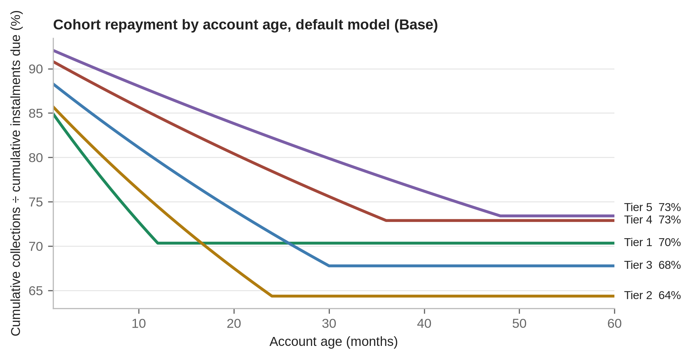
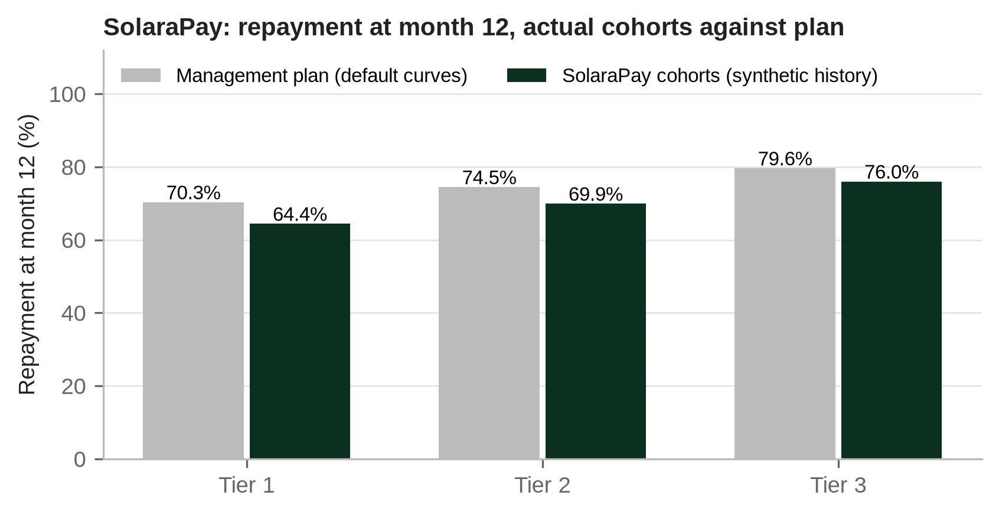

# Chapter 6. Repayment behaviour: cohorts, curves and defaults

This chapter supports the decision on which every other number in the plan depends: how the company's customers will actually pay. Revenue, receivables, the borrowing base, covenant headroom and valuation all flow from a small set of repayment assumptions. When those assumptions are wrong, the error is rarely visible in the first year, because new sales hide it. The tools in this chapter (cohorts, survival curves, DPD buckets and roll rates) are how a credit officer finds the error before the lender's covenant test does.

*Place in the analytical chain: Cohort and credit: how customers actually repay.*

## 6.1 Cohorts and vintages

A cohort, or vintage, is the group of accounts originated in the same period, usually a calendar month, for the same product. Every analysis in this chapter starts there for a simple reason: customers behave according to how long they have had the product, not according to the calendar. A portfolio in which most accounts are three months old will look healthier than one in which most are eighteen months old, even if every customer behaves identically. Grouping accounts by origination month and measuring them against account age, in months since sale, removes that distortion.

The workbook follows this logic throughout. The *Curves* sheet defines how one unit of each tier behaves at each account age; the cohort sheets (*Cohort_T1* to *Cohort_T5*) apply those unit curves to every monthly cohort, scaled by units sold and by the price index; and *Ops* adds the cohorts up by calendar month. Portfolio figures are therefore always sums of cohort behaviour, never assumptions in their own right. That is the correct order of construction, and it is the order in which a lender should read a company's own data.

## 6.2 The survival model

The workbook's repayment engine rests on one assumption: in each month, a fixed share of the accounts that are still paying stops paying for good. That share is the monthly default hazard, h. If an account survives month one with probability (1 − h), it survives a months with probability

S(a) = (1 − h)^a

and the instalment collected from a unit at age a is the instalment times the collection rate on paying accounts times S(a). The collection rate captures the fact that customers who are still paying do not pay every day: they let the device lock for a few days at harvest time, pay late after school fees, or top up irregularly. The hazard captures the customers who leave altogether.

For the default Tier 2 product (SHS with TV, 24 month tenor, hazard 2.6%, collection on paying accounts 88%), the arithmetic is as follows. The share of accounts still paying at month 12 is 0.974^12 = 0.7290, so about 72.9% survive and 27.1% have stopped. At month 24, the end of the tenor, the share is 0.974^24 = 0.5314, so about 53.1% survive and 46.9% have stopped. Multiplying by the collection rate, the expected payment in month 24 is 0.88 × 0.5314 = 46.8% of the instalment due.

The same arithmetic applied to the other default tiers shows how the hazard and the tenor interact. Tier 1 (hazard 3.5%, 12 months) ends its tenor with 0.965^12 = 65.2% of accounts still paying. Tier 3 (hazard 1.9%, 30 months) ends with 0.981^30 = 56.2%. A lower monthly hazard over a longer tenor can leave a similar share of non payers at the end of the contract, which is why tenor extension is a credit decision and not only an affordability one.

The model is deliberately simple. Real hazards are not constant: they are usually higher in the first months (customers who never intended to pay, or whose installation failed) and lower later (customers who have paid for a year rarely walk away from an asset they nearly own). A constant hazard calibrated to month 12 will tend to understate early losses and overstate late ones. For portfolio planning the error partly cancels; for the timing of covenant tests it may not, and that is one reason to calibrate against observed cohorts as soon as they exist.

## 6.3 Cumulative repayment curves

The most useful single picture of a cohort is its cumulative repayment curve: cumulative collections divided by cumulative instalments due, at each account age. Deposits are excluded from both, because a deposit is paid by every customer by construction and would flatter the ratio. For the default Tier 2 curve:

| Account age (months) | Share still paying, S(a) | Cumulative repayment |
|---|---|---|
| 3 | 92.4% | 83.5% |
| 6 | 85.4% | 80.3% |
| 12 | 72.9% | 74.5% |
| 18 | 62.2% | 69.2% |
| 24 | 53.1% | 64.4% |

Cumulative repayment at age m is 0.88 × (S(1) + ... + S(m)) ÷ m. At month 12 that is 0.88 × 10.153 ÷ 12 = 74.5%; at month 24, 0.88 × 17.555 ÷ 24 = 64.4%. The curve falls throughout the tenor because each month adds an instalment due in full and a collection from a shrinking pool of payers.

Two features make the curve valuable in practice. It can be compared across cohorts at the same age regardless of when they were sold, so deterioration shows up as a later cohort sitting below an earlier one at month 6 or month 12. And it can be compared with plan from the first month, long before a cohort completes its tenor. A cohort that sits five points below plan at month 12 will not recover that gap by month 24 unless something has changed in collections; the constant hazard model says the gap will widen.

## 6.4 DPD buckets, roll rates and cures

Survival curves describe what happens on average. Day to day credit management works with arrears: how many days past due each account is, grouped in buckets. The workbook uses current, 1 to 30, 31 to 60, 61 to 90, 91 to 180 and over 180 DPD.

In PAYGo, DPD needs a definition before it can be compared. Some platforms measure days since the device last had credit; others measure the cumulative shortfall against the payment schedule, expressed in days of the daily rate. The two diverge for a customer who pays regularly but less than the rate: such a customer may never be locked for long, yet fall progressively behind schedule. The schedule based measure is closer to how a lender thinks about arrears and is the one that reconciles to the receivable balance. Whichever is used, it must be stated, applied consistently and kept the same in the data supplied to lenders.

Roll rates measure the share of accounts in one bucket that move to the next bucket a month later. An illustration, with assumed rates: of 10,000 current accounts this month, 10% (1,000) are in the 1 to 30 bucket next month; 40% of those (400) roll to 31 to 60; 60% of those (240) roll to 61 to 90; and 75% of those (180) roll to 91 to 180. The product of the roll rates, 0.10 × 0.40 × 0.60 × 0.75 = 1.8%, is the share of a current pool that reaches 91 days past due three months later on this path. The complement of each roll rate is the share that stays in the bucket or cures.

A cure is an account that returns to current from a delinquent bucket. PAYGo has more cures than most consumer lending, because the lockout gives customers a direct and immediate reason to pay: the lights go off. A household that skipped two weeks during a lean month can clear its arrears in one payment after harvest. Roll rates fall steeply as accounts age past 60 or 90 DPD, however. An account that has been dark for three months has usually found an alternative, moved, sold the device, or decided the debt is not worth paying.

The workbook's proxy engine assumes that an account which stops paying never resumes. Cures therefore appear only in the indicative stage based ECL, through a cure rate input of 30% applied to Stage 2 balances. That is a conservative simplification for the cash forecast and should be read as such. Where a company has real cure data, it belongs in the comparison between observed and proxy curves.

## 6.5 Lockout dynamics and the default definition

The lockout is both the PAYGo company's main collections tool and the reason PAYGo arrears behave differently from bank loan arrears. When credit runs out, the device stops working. Most customers respond quickly; the 1 to 30 DPD bucket is large and churns constantly. The lockout loses its force once the customer stops valuing the service: when the battery degrades, when the grid arrives, when another company offers a newer product, or when the household simply cannot find the money. At that point the account moves quickly through the buckets and stays there.

The workbook defines default at 180 DPD. Other definitions are possible, including 90 DPD (the IFRS 9 rebuttable presumption, discussed in Chapter 8) or a number of consecutive days without credit. A longer definition delays recognition of default and lifts reported cure rates; a shorter one may classify customers who would have resumed paying as defaulted. The choice matters less than consistency: the same definition should drive the default flag, the write off policy, the repossession trigger and the data supplied to the lender, and a change of definition should be disclosed with restated history.

## 6.6 Seasoning and the denominator effect

Seasoning is the process by which a cohort's arrears and losses build up as it ages. A new cohort has no arrears to speak of; its losses arrive over the following 12 to 30 months. A portfolio's ratios are therefore a weighted average of cohorts at different stages of seasoning, and the weights depend on how fast the company is growing.

The effect can be measured. Take the default Tier 2 curve and a company that originates the same number of units every month for two years. In a given month, its collection rate across all live cohorts is the average of 0.88 × S(a) over ages 1 to 24, which is 64.4%. Now suppose instead that originations have grown at 5% a month for the same period, so that younger cohorts carry more weight. The same customers, behaving identically, now produce a portfolio collection rate of 68.3%. At 10% monthly growth, the figure is 71.6%. Nothing about credit quality has changed. Only the denominator has.

This is one of the most common misreadings of PAYGo portfolios. A growing book shows a falling ratio of arrears to receivables, because each month's new, current accounts enter the denominator before their arrears have had time to form. When growth slows, the ratios deteriorate even if customer behaviour is stable. The workbook's default Base case shows the pattern: the collection rate falls from 84.5% in Year 1 to 79.8%, 76.5%, 74.5% and 73.3% in Years 2 to 5 as the book seasons, without any change in the underlying hazards. The calibrated SolaraPay plan follows the same path, from 82.3% in Year 1 to 70.3% in Year 5, while its 30+ DPD ratio rises from 8.4% to 14.4%.

Two corrections help. The first is to read cohort curves rather than portfolio ratios, which removes the weighting problem altogether. The second is to use lagged ratios for the portfolio: arrears today divided by the receivables of some months earlier, which approximates the balance from which today's arrears actually arose. Neither replaces the other.

## 6.7 Calibrating against observed cohorts

The default curves in the workbook are proxies. They are reasonable starting points for a fictional market and nothing more. Once a company has twelve or more months of cohort history, the proxies should be replaced by values calibrated to that history.

The SolaraPay case shows the method. The company supplied 24 months of synthetic cohort data. At month 12, cumulative repayment observed was 64.6% for Tier 1 against a plan of 70.3%, 69.4% for Tier 2 against 74.5%, and 76.3% for Tier 3 against 79.6%. Every tier sat below plan, by 5.7, 5.1 and 3.3 percentage points respectively. The plan figures are exactly what the survival formula gives at the default inputs: for Tier 2, the 74.5% computed in section 6.3.

Recalibration raised the hazards and trimmed the collection rates on paying accounts. Tier 1 moved from a hazard of 3.50% to 4.55% and a collection rate of 88% to 86%; Tier 2 from 2.60% to 3.38% and 88% to 87%; Tier 3 from 1.90% to 2.47% and 90% to 89%. Each new hazard is 1.3 times the old one. The fit can be checked with the same formula. For Tier 2, 0.87 × (sum of 0.9662^a for a from 1 to 12) ÷ 12 gives 70.1%, against 69.4% observed; for Tier 1 the recalibrated month 12 figure is 64.4% against 64.6% observed; for Tier 3, 75.9% against 76.3%. Each calibrated curve sits within one percentage point of the observed point. The consequence over the full tenor is larger than the month 12 gap suggests: at the recalibrated Tier 2 hazard, the share of accounts still paying at month 24 falls to 0.9662^24 = 43.8%, against 53.1% on the default curve.

Three cautions apply. A single checkpoint can be matched by many combinations of hazard and collection rate; the M6 and M18 points, and the DPD curves, should be used to choose between them. Tiers 4 and 5 had no history and kept their proxy values, which is a statement of ignorance, not of comfort; the SolaraPay recommendation therefore caps their volumes until twelve months of cohort data sit within 10% of plan. And synthetic or short histories describe one set of conditions; a drought year or a currency shock will move the curves again.

## 6.8 Proxy and Actual modes

The workbook keeps history and projection apart on purpose. On *Credit_Assumptions*, the credit data mode is set to 1 (Proxy) or 2 (Actual). In Proxy mode, the credit engine splits balances on paying accounts between current and 1 to 30 DPD by an input share, and splits receivables at risk across the later buckets by input shares that reconcile to gross receivables. In Actual mode, *Credit_Portfolio* and the selected block of *Credit_Engine* report the company's own month end DPD buckets, write offs, recoveries and cures from *Credit_Input*, while projections and the facility continue to run on the calibrated curves.

Cohort observations go into *Vintage_Input*, one row per monthly cohort, with cumulative collections, instalments due, 30+, 90+ and 180+ exposure, recoveries and active accounts at M3, M6, M12, M18, M24, M36, M48 and M60. An actual cohort with no data shows a blank, never a proxy. *Vintage_Dashboard* then sets company data beside the proxy curves, which is where the calibration in section 6.7 starts.

The separation matters for credibility. A model that blends history into its forecast without saying so cannot be audited, and a lender who finds that out once will discount every later submission.

## Points for the investment committee

1. Obtain cumulative repayment curves by monthly cohort and tier, excluding deposits, and compare each cohort with plan at M3, M6 and M12.
2. Confirm how DPD is measured (days without credit or shortfall against schedule) and that the same definition drives the default flag, write offs, repossession and lender reporting.
3. Ask for roll rates and cure rates by bucket for the last twelve months, and check whether cures from 61 to 90 DPD or later are material or anecdotal.
4. Do not accept improving portfolio ratios from a fast growing book as evidence of better credit; ask for the same ratios on a lagged basis and by cohort.
5. Check that the hazards and collection rates in the plan reproduce the observed M12 points within a narrow margin, and that the M6 and M18 points were used to choose between fits.
6. Treat products without history as unknowns, with volume caps and a review date, rather than as proxies with a comforting average.

## Working with the model

Set the hazard and collection rate by tier on *Products* and inspect the resulting unit curves on *Curves*. Load portfolio history into *Credit_Input* and cohort history into *Vintage_Input*, switch *Credit_Assumptions* to Actual mode, and compare company data with proxy curves on *Vintage_Dashboard*. Use *Credit_Portfolio* for the DPD distribution and *Checks* to confirm that the buckets reconcile to gross receivables before any figure leaves the building.
