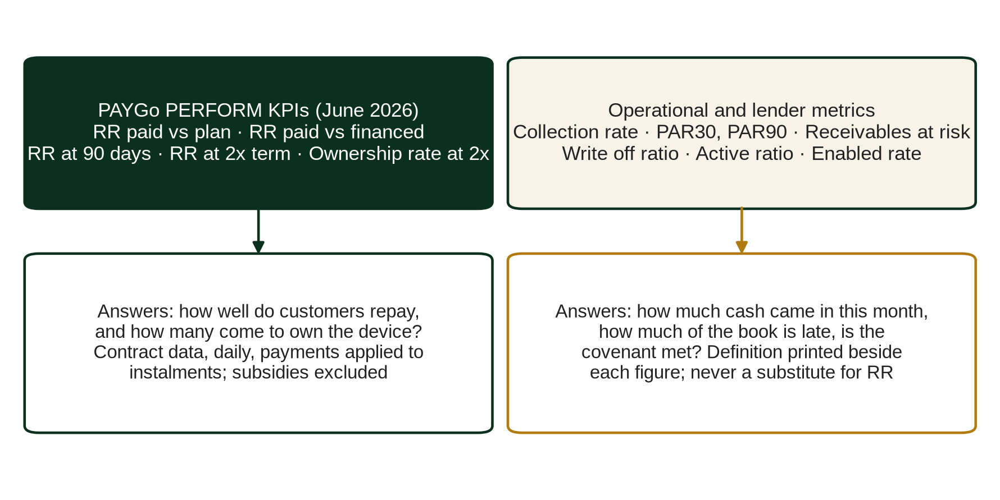
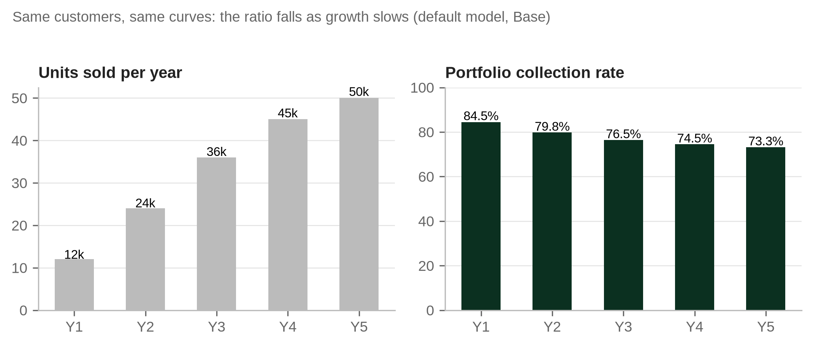

# Chapter 7. Portfolio KPIs and PAYGo PERFORM

This chapter supports the decision a board, an investor and a lender all take every month: whether the portfolio is healthy. The answer depends less on which ratios are reported than on how they are defined, what sits in the denominator and how fast the book is growing. A portfolio can show improving ratios while its customers behave worse, and the reverse is also possible. The purpose here is to fix definitions, show where the common ratios mislead, and design a monthly reporting pack that a credit committee can rely on.

*Place in the analytical chain: Credit and receivables, measuring portfolio quality on consistent definitions.*

## 7.1 Why a common framework matters

Before common frameworks took hold, PAYGo companies often defined their own portfolio metrics. "Collection rate" might include deposits or exclude them; "default" might mean 60, 90 or 180 days without payment; "at risk" might refer to accounts or to balances. Comparisons across companies were close to meaningless, and investors learned to ask for the raw data instead.

PAYGo PERFORM is the industry's answer. Its first technical guide, published in July 2021 by CGAP, GOGLA and IFC Lighting Global, set out portfolio quality indicators such as the collection rate, receivables at risk and the write off ratio, alongside unit, firm level and operational indicators. That guide is now historical. The current standard is the PAYGo PERFORM KPIs technical guide published by GOGLA in June 2026, which narrows the standard to repayment and ownership and defines exactly how they are calculated (Annex G, E2 and E2a). This chapter follows the 2026 standard for the PERFORM KPIs and treats the older portfolio ratios for what they now are: operational and lender metrics, useful in their place, each with its own definition printed beside it.

## 7.2 The PAYGo PERFORM KPIs

The 2026 standard defines five KPIs.

| KPI | What it measures | Formula | Type |
|---|---|---|---|
| Repayment Rate, paid versus plan (RR PvP) | Share of the instalments due to date that have been paid | Payments applied to due instalments to date ÷ instalments due to date | Time series |
| Repayment Rate, paid versus financed (RR PvFin) | Share of the total amount financed that is both due and paid | Payments applied to due instalments to date ÷ total amount financed | Time series |
| RR PvP at 90 days | Share of the instalments due in the first 90 days that have been paid by day 90 | Payments applied to instalments due by day 90 ÷ instalments due by day 90 | Cohort milestone |
| RR PvP at twice the contract term | Share of the full contract's instalments that have been paid by twice the contract term | Payments applied to due instalments by 2x the term ÷ instalments due over 1x the term | Cohort outcome |
| Ownership rate at twice the contract term (OR @2x) | Share of contracts fully paid by twice the contract term | Contracts fully paid by 2x ÷ contracts that have reached at least 2x | Cohort outcome |

The calculation rules matter as much as the formulas, and they are where most company figures depart from the standard (Technical Guide, June 2026, pages 8 to 10):

1. Repayment Rates exclude deposits, prepayments for future periods, penalties, fees and subsidies. They include arrears payments and contracts that have been written off.
2. They are cumulative from the contract start date, after any free use period, and measured against the original contract terms; rescheduling, grace periods and "free token days" granted later are ignored.
3. Instalments are normalised to daily equivalents and payments are recognised, day by day, when they are applied to instalments due, not when the cash is received.
4. Cohort and portfolio results are built by adding up the numerators and denominators of the individual contracts, not by averaging ratios.
5. Twice the contract term is the standard cut off for outcomes; results at one and one and a half times the term may be shown as early milestones.
6. Substitute metrics, such as a collection rate or days locked or enabled, must not be used in place of the Repayment Rate. The only accepted alternative basis is to derive the result from cumulative arrears.

Two consequences follow for anyone reading a company's figures. First, a Repayment Rate is a contract level calculation: it needs contract data, payment allocation rules and a daily calendar, and it cannot be rebuilt from a monthly management account. Second, subsidies are excluded from the numerator, so results based financing (RBF) paid to the company never improves its Repayment Rate (Chapter 13).

The companion model is a planning model with monthly cohorts, not a contract level platform. Its *Vintage_Dashboard* reports a cohort repayment ratio, cumulative collections divided by cumulative instalments due at account ages from three to sixty months, which follows the logic of RR PvP but is not a PERFORM calculation: it is monthly, not daily, and it does not allocate payments to instalments. The ownership rate at twice the tenor is accepted only from company data; the model will not derive it from its own curves. A company reporting PERFORM figures should compute them on its own contract data, following the guide, and load the numerators and denominators by monthly cohort on the *PERFORM_2026* sheet. That sheet aggregates them by adding numerators and denominators, as the standard requires, and shows beside them the model's approximations, labelled as such.

## 7.3 Operational and lender metrics

Lenders and management teams use further ratios every month. None of them is a PERFORM KPI under the 2026 standard, so each must be reported with its definition.

The operational collection rate for a period is the cash collected against scheduled instalments divided by the instalments that fell due in that period. Deposits are excluded from both sides. The reason is mechanical: every customer pays the deposit, so including it lifts the ratio in proportion to sales volume and tells the reader nothing about repayment. In a month where instalments due are LCY 100m, instalments collected LCY 74m and deposits LCY 12m, the collection rate is 74.0% (74 ÷ 100). Including deposits on the numerator alone would show 86.0% (86 ÷ 100), a figure that would rise further if the company simply sold more. The collection rate is a measure of cash conversion in a period. It is the usual covenant measure, and the 2021 PERFORM guide defined it (pages 18 and 19), but under the 2026 standard it may not stand in for the Repayment Rate.

Receivables at risk (RaR) measures the share of the receivables book that sits on accounts that have stopped paying or are seriously late. The 2021 guide defined it as the gross outstanding receivables of contracts more than a stated number of consecutive days unpaid, divided by gross outstanding receivables, with ageing such as RAR30 and RAR90 (pages 21 to 23). The companion model uses a curve based proxy instead: (1 − S(a)) × (T − a) × (instalment − premium ÷ T), the carrying amount of accounts that have left the paying pool, divided by gross receivables. The covenant default in the workbook is RaR of no more than 15%.

Portfolio at risk, PAR30 and PAR90, is the outstanding balance of accounts more than 30 (or 90) days past due, divided by gross receivables. It is the banker's version of RaR and the measure most local lenders already use for their microfinance and SME books. The whole balance of a late account counts, not only the arrears.

The write off ratio is the amount written off in a period divided by average gross receivables over the same period, annualised where the period is shorter than a year (2021 guide, pages 27 and 28). Its value depends heavily on the write off policy. A company that writes off at 180 days past due (DPD) will show lower write offs, and higher PAR90, than one that writes off at 90 DPD with the same customers. The workbook's simplified accounting writes off missed instalments as they fall due (Chapter 8), so its write off line is not comparable with a company that writes off whole balances on default.

Two operational ratios complete the set. The active ratio is the number of accounts that made a payment in the last 30 days divided by the number of accounts not yet paid off or written off. The enabled rate is the share of active accounts whose device had credit and was working at the end of the period (some companies instead report average enabled days per account). Operations teams often call this the unlock rate; this book reserves "unlock" for the permanent release of the device at the end of the plan, as in Annex A. Neither has a single accepted definition, so the definition used must be printed beside the figure.

## 7.4 Vintage metrics and portfolio metrics

Every ratio in section 7.2 can be computed for the whole portfolio at a date or for each cohort at an account age. The two answer different questions. Portfolio metrics tell a lender how much of today's collateral is performing, which is what the borrowing base and the covenants need. Vintage metrics tell an analyst whether customers originated recently behave better or worse than customers originated earlier, which is what the forecast needs.

Portfolio metrics are distorted by growth, as Chapter 6 showed for the collection rate. The same applies to PAR. An illustration with assumed figures makes the point. A company has a seasoned book with gross receivables of LCY 800m and PAR30 of 20%, so LCY 160m at risk. In the next quarter it originates new accounts that add LCY 400m of receivables; those accounts are young, and 3% of the new balance (LCY 12m) is more than 30 DPD at quarter end. Assume, to isolate the effect, that the seasoned book's balance and arrears are unchanged. The reported PAR30 falls to 14.3% ((160 + 12) ÷ (800 + 400) = 172 ÷ 1,200). No customer behaved better. The ratio improved because the denominator grew faster than arrears can form.

A lagged ratio corrects much of this. Dividing today's 30+ DPD balance by gross receivables three months earlier gives 21.5% (172 ÷ 800), close to the seasoned book's true condition. Lagged PAR is not a standard covenant measure, but as a rule of thumb it belongs in the internal pack of any company whose book is growing by more than a few per cent a month.

The workbook's Base case shows the opposite movement as growth slows. The collection rate falls from 84.5% in Year 1 to 73.3% in Year 5 with no change in assumptions; in the calibrated SolaraPay plan, 30+ DPD rises from 8.4% to 14.4% over the same period. A lender who sets covenants on the Year 1 ratios of a fast growing borrower is setting them on the most flattering numbers the business will ever produce.

## 7.5 Reading external benchmarks

Sector wide figures are useful only as context. The ESMAP and World Bank Off-Grid Solar Market Trends Report 2024 is reported to show an average PAYGo collection rate that stayed at about 62% from 2021 to 2023, with a top quartile of 75% to 80% and a bottom quartile below 50%. It is also reported that about one PAYGo customer in four faced payment difficulties in 2023, against fewer than one in five about four years earlier (Annex G, E1; pages and definitions to be checked). It is a collection rate, not a PERFORM Repayment Rate, and its numerator, denominator and treatment of deposits must be confirmed before it is set beside any company's ratio. Even if confirmed, such a figure blends companies with different products, definitions, growth rates and write off policies. It cannot tell a credit committee whether a particular company's 70% is good or bad. It can tell the committee that a plan assuming collection rates well above 80% for five years needs strong evidence. The calibrated SolaraPay plan ends Year 5 at 70.3% against that reported average; the comparison is a sense check and nothing more, and the workbook does not use the sector figure in its diagnostics until the report has been read.

## 7.6 A monthly dashboard for lender reporting

A lender report should allow the reader to answer four questions without asking for more data: is the collateral performing, are newer cohorts behaving better or worse, are the covenants met and with what headroom, and do the numbers reconcile. The following layout does that in two pages.

| Block | Metric | Definition note | Source sheet |
|---|---|---|---|
| Book | Gross receivables by tier | Month end, before allowance | Credit_Portfolio |
| Book | Active accounts, originations, paid off, written off | Counts for the month | KPIs |
| Performance | Operational collection rate, month and trailing 3 months | Excluding deposits | Credit_Portfolio, Covenants |
| Performance | Active ratio and enabled rate | Definitions printed | Company data |
| Risk | DPD buckets: current, 1 to 30, 31 to 60, 61 to 90, 91 to 180, over 180 | Balances, reconciled to gross receivables | Credit_Portfolio |
| Risk | PAR30, PAR90, RaR; PAR30 lagged 3 months | Lagged figure for internal use | Credit_Portfolio |
| Losses | Write offs, recoveries, net loss rate | Annualised on average receivables | Credit_Portfolio |
| Losses | Indicative expected credit loss (ECL) and coverage | Stage based diagnostic | Credit_Portfolio |
| Vintage | Cohort repayment ratio at M3, M6, M12 against plan; PERFORM RR PvP and RR @90 days from contract data | Excluding deposits; PERFORM rules for the PERFORM figures | Vintage_Dashboard; company platform |
| Vintage | 30+ and 90+ exposure at M6 and M12 by cohort | Including amounts written off | Vintage_Dashboard |
| Facility | Eligible receivables, borrowing base, drawn, headroom | Eligibility to 30 DPD by default | Credit_Portfolio |
| Covenants | Each test, threshold, actual, headroom | Flag if headroom under 10% of threshold | Covenants |
| Integrity | Bucket reconciliation, cash tie out | Must read zero difference | Checks |

The vintage block is the one most often missing from lender packs, and the one that gives the earliest warning. The covenant block should show headroom, not only pass or fail: the calibrated SolaraPay case passes its trailing three month collection rate covenant of 70% with a lowest reading of exactly 70.0%, which is a pass with no headroom at all.

## 7.7 Reconciling DPD buckets to gross receivables

The DPD buckets must add up to gross receivables. That sounds obvious; in practice, servicing platform exports often omit written off accounts, double count accounts that cured during the month, or report arrears instead of balances. The workbook's *Checks* sheet enforces the reconciliation in Actual mode, and no figure should leave the company until it passes.

An illustrative month end, in LCY millions:

| Bucket | Balance | Share |
|---|---|---|
| Current | 700 | 70.0% |
| 1 to 30 DPD | 120 | 12.0% |
| 31 to 60 DPD | 50 | 5.0% |
| 61 to 90 DPD | 40 | 4.0% |
| 91 to 180 DPD | 60 | 6.0% |
| Over 180 DPD | 30 | 3.0% |
| Gross receivables | 1,000 | 100.0% |

PAR30 is the sum of the buckets beyond 30 days, 50 + 40 + 60 + 30 = 180, or 18.0%. PAR90 is 60 + 30 = 90, or 9.0%. Eligible receivables at the default eligibility of 30 DPD are 700 + 120 = 820; at an advance rate of 70%, the borrowing base would be 574.

The reconciliation also tests the write off policy. If the over 180 bucket is large, the company is carrying defaulted balances it has not written off, which inflates gross receivables and, depending on the definition, the denominator of every ratio. If the bucket is zero while the 91 to 180 bucket is large, the company may be writing off early, which lowers PAR and raises write offs. Either is acceptable if disclosed. Neither is acceptable if it changes from month to month.

## 7.8 The SolaraPay history as an illustration

The SolaraPay case, a fictional company with 24 months of synthetic history, shows what a deteriorating portfolio looks like when read properly. The portfolio collection rate was 77.4% in the first history year and 69.3% in the second. The latest month's collection ratio was 66.5%, PAR30 was 17.0% and indicative ECL coverage was 36.5%. Cohort repayment at month 12 sat below plan in every tier with history (Chapter 6).

Read in isolation, a 69.3% collection rate might pass for an acceptable sector figure, particularly against the reported sector average of about 62% for 2021 to 2023. Read with the cohort data, it shows a company whose customers are repaying below plan in every product, whose book is seasoning and whose ratios will drift further as growth slows. The latest month's 66.5% already sits below the 70% trailing covenant level; the trailing three month average is what decides the test, which is why the dashboard reports both. The recommendation in the case responds with a collections plan and a 65% trailing collection covenant with a cure period, rather than a covenant set at a level the company would breach in its first quarter.

The case also shows the gap that matters most for impact funders: no ownership evidence yet. A company two years into operation with 24 month products cannot yet show ownership at twice the tenor, but it should already be tracking the customers who complete payment, so that the evidence exists when the first cohorts reach the checkpoint.

## Points for the investment committee

1. Ask for repayment and ownership rates calculated on contract data under the PAYGo PERFORM 2026 standard, with the calculation basis (paid versus plan or paid versus financed) stated, and refuse a collection rate offered in their place.
2. Print the definition beside every operational and lender metric in the lender pack.
3. Confirm that the collection rate excludes deposits on both sides, and ask for it monthly and on a trailing three month basis.
4. Require the DPD buckets to reconcile to gross receivables every month, and review the over 180 bucket against the stated write off policy.
5. Ask for lagged PAR30 alongside the reported figure whenever the book is growing quickly, and set covenants with the seasoning path in mind, not on Year 1 ratios.
6. Insist on a vintage block in every monthly report, with repayment rates by cohort against plan at M3, M6 and M12.
7. Show covenant headroom, not only compliance, and treat any test passing with less than a tenth of its threshold in headroom as a watch item.
8. Start tracking paid off customers now if ownership rates will be needed later for funders or for outcome linked RBF.

## Working with the model

*PERFORM_2026* holds the company reported PERFORM KPIs and the labelled approximations from *Vintage_Input*; a check stops any numerator exceeding its denominator. *Credit_Portfolio* holds the consolidated DPD distribution, the collection ratio, probability of default (PD) and loss given default (LGD) proxies, indicative ECL, the borrowing base and the 30+ and 90+ ratios. *KPIs* and *Covenants* carry the monthly tests and headroom; *Vintage_Dashboard* sets cohort data against the proxy curves. Load company history through *Credit_Input* and *Vintage_Input* in Actual mode, and confirm the reconciliation on *Checks* before any report is issued.
