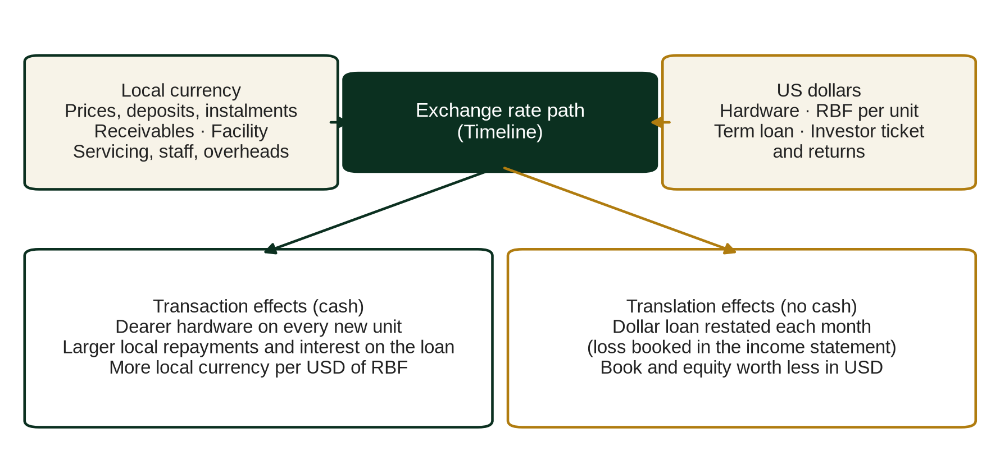

# Chapter 10. Working capital, inventory and FX

This chapter supports the decision that most often goes wrong in PAYGo: how much cash a growth plan will consume before it returns any, and in which currency. Growing PAYGo companies run out of cash for reasons that are visible in advance. The receivables book absorbs cash in proportion to growth, inventory must be paid for in hard currency months before it is sold, and the collections that eventually repay both arrive in a local currency that tends to weaken over the life of the contract. The chapter quantifies each of these, shows how the companion model turns them into a funding requirement, and reads the currency sensitivities for the default company and for SolaraPay.

*Place in the analytical chain: Receivables, cash and FX.*

## 10.1 The receivables book is the main investment

A PAYGo company has little in the way of fixed assets. Depots, vehicles and IT are a small share of total assets. The main investment is the receivables book: every unit sold on credit leaves the company out of pocket for the hardware, installation and acquisition cost on the day of sale, and recovers that outlay over the tenor. The cash price less the deposit is, in substance, a loan to the customer, and the sum of those loans outstanding is the balance that has to be funded.

The income statement does not show this. Hardware revenue is booked at the cash price on the day of sale, so a company that sells more units reports more gross profit in the same period. The cash flow statement shows the opposite: more sales mean a larger increase in receivables, and operating cash flow after working capital falls as growth accelerates. A board that reads the first statement and not the second will approve a sales plan the balance sheet cannot carry.

### An illustrative receivables build

The following example is illustrative. A company sells a single product with a cash price of LCY 27,000, a deposit of LCY 3,000 and a 24 month tenor, so each unit adds LCY 24,000 of principal to the book. For simplicity, principal is repaid in equal monthly amounts, sales are spread evenly through each year, and losses and financing income are ignored. Under these assumptions a unit sold during a year has an average age of six months at the year end, so 18 ÷ 24 = 75% of its principal is still outstanding. A unit sold in the previous year has an average age of 18 months and 25% outstanding. Units sold two or more years earlier have fully amortised.

Year end receivables are therefore 75% of the current year's amount financed plus 25% of the previous year's.

| Year | Units sold | Amount financed (LCY m) | Year end receivables (LCY m) | Increase in receivables (LCY m) | Principal collected (LCY m) |
|---|---|---|---|---|---|
| 1 | 10,000 | 240 | 0.75 × 240 = 180 | 180 | 60 |
| 2 | 20,000 | 480 | 360 + 60 = 420 | 240 | 240 |
| 3 | 35,000 | 840 | 630 + 120 = 750 | 330 | 510 |
| 4 | 50,000 | 1,200 | 900 + 210 = 1,110 | 360 | 840 |
| 5 | 50,000 | 1,200 | 900 + 300 = 1,200 | 90 | 1,110 |

Principal collected is the amount financed less the increase in receivables; in Year 4, for example, 1,200 less 360 gives 840.

Three readings follow. First, the investment in the book grows every year while sales grow, reaching LCY 360m in Year 4. Second, when sales stop growing in Year 5, the increase drops to LCY 90m and principal collected almost matches new lending; the company moves from cash consumption towards cash generation without any change in its unit economics. Third, the book at the end of Year 4 equals about 0.93 times the year's amount financed (1,110 ÷ 1,200). For a 24 month product growing quickly, a reasonable rule of thumb is that gross receivables sit at roughly one year of origination; for 36 or 48 month products the multiple is higher, which is why a shift towards Tiers 4 and 5 increases the funding requirement before it increases cash generation.

The real book is larger than this sketch in one respect and smaller in another. Gross receivables in the model include the PAYGo premium, so the balance is the contractual instalments still due rather than principal alone; and missed instalments are written off as they fall due, which reduces the balance. Neither changes the shape of the result.

### Who funds the increase

Suppose a lender advances 75% against eligible receivables, and 80% of the gross book is eligible. The effective advance is 0.75 × 0.80 = 60% of gross receivables. At the end of Year 4, the facility can fund at most 60% × 1,110 = LCY 666m, and the remaining LCY 444m must come from equity and retained cash. The equity contribution scales with the book, not with the sales line, and it rises again whenever credit quality slips and eligibility shrinks.

## 10.2 Inventory and supplier credit

Hardware is bought in US dollars, shipped, cleared and held in local depots before it reaches a customer. The model sets inventory as months of hardware cost cover and trade payables as days of supplier credit.

Continuing the illustration, assume a landed hardware cost of LCY 14,000 per unit. At 50,000 units a year, hardware purchases run at 50,000 × 14,000 = LCY 700m a year. Three months of inventory cover ties up 700 × 3 ÷ 12 = LCY 175m. Sixty days of supplier credit funds 700 × 60 ÷ 365 = about LCY 115m. Net inventory funding is about LCY 60m.

Inventory is small next to the receivables book, but it has three features that make it dangerous. It is bought ahead of sales, so in a growing company it is sized on next quarter's volume rather than last quarter's. It is denominated in hard currency, so a depreciation between purchase and sale is a direct loss unless prices adjust. And supplier credit is the first line of funding to disappear in a stress, because suppliers read the same signals as lenders and shorten terms or demand letters of credit when the company most needs room. A plan that relies on 90 or 120 days of supplier credit should show what happens at zero.

## 10.3 Two currencies, one balance sheet

The structural problem is simple to state. Hardware and, frequently, term debt are in US dollars. Collections are in local currency, fixed at the contract price for the whole tenor. When the local currency weakens, three things happen at once.

The cost of new hardware rises in local currency. In the illustration, a landed cost of USD 100 per unit costs LCY 13,000 at an exchange rate of 130 per USD. If the rate moves to 156, a 20% rise in the price of the dollar, the same unit costs LCY 15,600, an increase of LCY 2,600.

The value of the existing book falls in hard currency. A receivables book of LCY 1,110m is worth 1,110 ÷ 130 = USD 8.5m at 130 and 1,110 ÷ 156 = USD 7.1m at 156. The contracts already signed cannot be repriced; the company bears the full movement on them.

The cost of hard currency debt rises. A USD 3.0m term loan is LCY 390m at 130 and LCY 468m at 156, a translation loss of LCY 78m that runs through the income statement. At 10% interest, the annual charge rises from LCY 39m to LCY 46.8m. The model tracks the term loan in USD and books the unrealised FX loss each month as the opening USD balance times the change in the rate.

A currency stress is therefore not a single percentage applied to the result. It works through specific lines, in specific ways, and the analyst should map them before reading any sensitivity. The map for the companion model is as follows.

| Item | Currency | How it is converted in the model | Type of FX effect |
|---|---|---|---|
| Revenue, deposits and instalments | Local | Not converted; contract prices fixed for the tenor | Value in USD falls as the currency weakens |
| PAYGo receivables | Local | Not converted | Translation of the book's USD value (not booked) |
| Hardware cost | USD | At the rate of the month of sale, plus duty | Transaction effect on every new unit |
| Installation, servicing, staff and overheads | Local, indexed to inflation | Not converted | Indirect, through inflation |
| RBF payments | USD per unit | At the rate of the month of receipt | Transaction effect, favourable when the currency weakens |
| USD term loan | USD | Balance translated at the month end rate; interest at the month's rate | Translation loss or gain booked in the income statement each month; transaction effect on interest and repayments |
| Receivables facility or securitisation | Local | Not converted | None: matched to the receivables |
| Initial equity | Local (investor ticket set in USD) | Investor flows converted at the year's average rate, exit at the year end rate | Investor returns measured in USD fall as the currency weakens |
| Hedges | None modelled | | The analyst must add any hedge and its cost outside the model |

Two effects must be kept apart. A translation effect restates a balance, such as the dollar loan in local currency or the book in dollars, without any cash moving. A transaction effect changes the cash paid or received, such as a dearer container of hardware or a larger loan repayment in local currency. The model books the translation loss on the dollar loan in the income statement, which lowers profit and equity; the cash damage comes from the transactions.

### FX pass through

Pass through is the share of the currency move that the company recovers by raising prices on new contracts. The default in the model is 50%. In the illustration, a 20% rise in the dollar with 50% pass through raises the cash price of new contracts by 10%, from LCY 27,000 to LCY 29,700. Hardware cost rises by LCY 2,600 and price by LCY 2,700, so the local currency margin per unit is roughly preserved: 27,000 less 13,000 = 14,000 before the move and 29,700 less 15,600 = 14,100 after. Measured in dollars, though, the margin falls from 14,000 ÷ 130 = USD 108 to 14,100 ÷ 156 = USD 90, a decline of about 16%, and nothing has been done for the book already on the balance sheet.

Higher pass through protects the margin on new sales but has a cost of its own. Each price increase raises the instalment and the payment burden, and a tier already above the affordability threshold will feel it in arrears. Pass through is a pricing decision and a credit decision at once, and an investor who assumes full pass through should ask to see evidence that customers absorbed past increases without a step up in default rates.

## 10.4 What the default sensitivities say

The *Sensitivity* sheet records one at a time tests from the default Base case, in which the investor IRR is 46.4% and there are no covenant breach months. Three of those tests concern this chapter.

| Sensitivity from Base | Investor IRR | Covenant breach months |
|---|---|---|
| Base | 46.4% | 0 |
| LCY depreciation of 20% a year | (16.0%) | 41 |
| No price increase on new contracts | 7.9% | 35 |
| Hardware cost +15% | 29.5% | 38 |
| Volume 20% lower | 37.8% | 0 |

The volume row is included for contrast. Losing a fifth of planned sales costs about nine points of IRR and no covenant breaches. Sustained depreciation of 20% a year destroys the investment: the IRR moves from 46.4% to (16.0%), and the company is in breach for 41 of 60 months. Freezing prices on new contracts takes the IRR to 7.9%, and a 15% rise in hardware cost takes it to 29.5% with 38 breach months.

The ranking is the point. In this sector currency and pricing are larger value drivers than volume. A management team that spends its board time on the sales plan and treats pricing policy as an operational detail has its priorities in the wrong order. The same is true of an investor whose Downside case cuts volume but leaves the exchange rate on its Base path.

## 10.5 Managing the mismatch

There is no complete hedge for a PAYGo company in a market with a thin forward market and long contract tenors. There are partial ones, and a credible plan uses several.

Natural hedges are limited. Local assembly, local installation and local staff costs are in local currency, but hardware is usually the largest cost line and is imported. Revenue from RBF programmes may be denominated in hard currency, which offsets some exposure, though it should not be relied on beyond the programme's committed term.

Local currency debt removes the translation risk on the liability side. A receivables facility in local currency, sized against a local currency book, matches the currency of collections to the currency of repayment. The price is a higher nominal rate; SolaraPay's proposed facility is at 16% in KVS against 10% on its USD term loan. The comparison that matters is between the local currency rate and the dollar rate plus expected depreciation plus the cost of the volatility around that expectation. At 5% expected depreciation a year, 10% in dollars is roughly 15.5% in local currency before any allowance for the risk of a sharper move (1.10 × 1.05 = 1.155).

Indexation of new contract prices to the exchange rate, adopted as board policy or written into the price list, sets pass through at or near 100% for new sales. It does nothing for the existing book, and it raises the instalment when the currency weakens, so it must be paired with affordability limits. It is nonetheless the most effective Downside mitigant identified in the SolaraPay case.

Shorter tenors reduce the period over which each contract is exposed, and limiting the share of hard currency debt in the funding stack caps the translation loss. Both have a cost in volume or in the price of funding.

## 10.6 Cash before facility and the funding requirement

The model builds the funding requirement in a fixed order. It first computes cash before facility: opening cash plus all operating, investing and term debt flows for the month, before any drawing or repayment of the receivables facility. The facility drawing is then set to hold cash at the minimum balance, within the lower of the facility limit and the borrowing base:

drawn balance = max(0, min(limit, borrowing base, previous balance + minimum cash less cash before facility))

Any shortfall that remains is met by an automatic equity top up, and the cumulative top up is the funding requirement.

A short illustration shows how the borrowing base binds. Suppose the facility balance at the start of the month is LCY 800m, the minimum cash balance is LCY 100m and cash before facility is LCY 40m. The company would like the balance to rise to 800 + 100 less 40 = LCY 860m. With a limit of LCY 1,000m and a borrowing base of LCY 900m, it can draw to 860 and closes the month at the minimum cash balance. If deterioration in the book has cut the borrowing base to LCY 820m, the drawn balance is capped at 820, an increase of only 20 on the month. Cash closes at 40 + 20 = LCY 60m, LCY 40m below the minimum, and that LCY 40m is the equity top up.

The lesson is that the facility limit is rarely the binding constraint. The borrowing base is, and it shrinks in exactly the conditions in which the company needs it: when collections weaken, accounts move beyond the eligibility threshold, and cash before facility falls at the same time. At default inputs, peak equity is USD 10.0m in Base and USD 46.6m in Severe.

## 10.7 SolaraPay: currency as the deciding variable

SolaraPay's plan is denominated in KVS at an opening rate of 135 per USD, with USD hardware, a USD 3.0m term loan at 10% and a proposed KVS 4.5bn receivables facility at 16%. Initial equity of USD 9.0m (KVS 1,215m) is sufficient in the calibrated Base: peak equity stays at USD 9.0m, so no top up is required.

The stress cases show where the risk sits.

| Case | Peak equity (USD m) | Y5 EBITDA margin | Y5 collection rate | Investor IRR | MOIC | Breach months |
|---|---|---|---|---|---|---|
| Calibrated Base | 9.0 | 16.4% | 70.3% | 29.0% | 3.6x | 0 |
| Calibrated Downside | 9.0 | 1.3% | 63.9% | total loss | 0.0x | 40 |
| Calibrated Downside with full FX indexation | 9.0 | 14.2% | 64.4% | 23.6% | 2.9x | 38 |
| Calibrated Severe | 41.9 | (25.4%) | 55.4% | total loss | 0.0x | 45 |

By default, the Downside combines several levers: default hazard 1.30 times Base, collection rates 0.97 times, volume 0.90 times, hardware cost 1.05 times and depreciation of 12% a year. Under that combination the investor loses everything. Changing one input, so that new contract prices are fully indexed to the KVS/USD rate, restores an IRR of 23.6% and a multiple of 2.9x, and lifts the Year 5 EBITDA margin from 1.3% to 14.2%.

Two cautions apply to that result. Indexation rescues the equity value but not covenant compliance: the indexed Downside still shows 38 breach months against 40 without it, because the credit levers are untouched and the collection rate falls to 64.4% by Year 5. And the indexed case assumes customers accept the higher prices without further deterioration in repayment. That is why the SolaraPay recommendation pairs FX indexation of new prices with an affordability redesign that keeps the instalment within 10% of income. Each condition on its own is weaker than the two together.

## Points for the investment committee

1. Reconcile the projected increase in receivables to the sales plan year by year, and confirm that the funding plan covers the part of the book the borrowing base will not finance.
2. Check inventory cover and supplier credit assumptions against current supplier terms, and rerun the case with supplier credit at zero.
3. Identify every hard currency liability and every hard currency cost line, and compute the translation loss and margin effect of a 20% rise in the dollar.
4. Decide whether FX indexation of new contract prices should be a condition of investment, and require evidence on how past price increases affected arrears.
5. Compare the cost of local currency debt with the dollar rate plus expected depreciation, and prefer local currency funding for the receivables book where the gap is reasonable.
6. Make sure the Downside case moves the exchange rate, prices and hardware cost, not only volume, and that peak equity is read from that case.

## Working with the model

The macro block on *Inputs* holds the opening FX rate, inflation, the annual price increase on new contracts and the FX pass through share; depreciation by scenario sits on *Scenarios*. Inventory cover, supplier credit and freight and duty are on *Inputs*, and hardware FOB costs by tier on *Products*. The working capital lines flow to the cash flow statement on *FS* (monthly) and *Annual*. Eligible receivables, the borrowing base and headroom against the facility are on *Credit_Portfolio*, and the peak equity requirement is reported on *Investment_Summary*. The default one at a time tests are on *Sensitivity*; to test full indexation, set pass through to 100% on a copy of the workbook and compare the Downside results.
