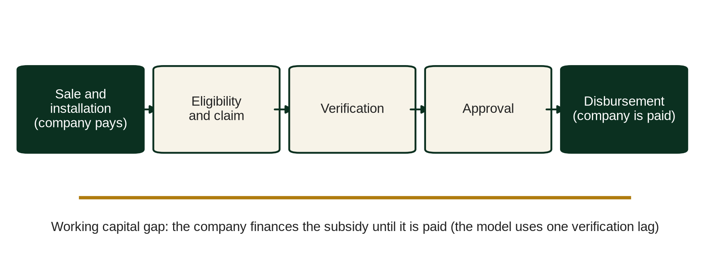

# Chapter 13. RBF, subsidies and affordability

This chapter supports a decision that sits with two different people. The first is the programme manager who has a budget of public or philanthropic money and must decide what to pay for, how to verify it and how to stop the payment from rewarding the wrong behaviour. The second is the investor or lender who must decide how much weight to put on subsidy income when sizing a PAYGo company's returns and debt capacity. Both questions come down to the same one: how should subsidies be used in a business whose real product is consumer credit?

*Place in the analytical chain: RBF and subsidies.*

## 13.1 Why subsidy money behaves differently in PAYGo

A subsidy to a PAYGo company buys something less tangible than a grid asset. The company sells a device on credit to a household with irregular income, and the public benefit is realised only if the device keeps working and the household keeps paying, or finishes paying and owns it. A subsidy paid at the point of sale therefore pays for the start of a two to four year relationship, not for its outcome.

That gap between what is paid for and what is wanted is the central design problem. It is also why results based financing (RBF) has been widely used in the sector. Under RBF the funder pays a fixed amount per verified result after the event, and the company pre finances the activity and carries the execution risk. Everything then depends on what the "result" is defined to be.

## 13.2 What is being bought

There are four candidate results in a PAYGo programme, and they sit at increasing distance from the sale.

The first is a sale. It is easy to verify through a serial number, a mobile money deposit and call backs to a sample of households. It says nothing about whether the customer will pay.

The second is a connection, typically defined as a sale that has been installed and is functioning at a stated access level. SEforALL's Universal Energy Facility is described as a results based financing facility that pays per verified connection (secondary reporting; amounts are not quoted here and programme rules must be read in the facility's own documents). A connection is a better result than a sale because it requires the system to work, but verification at a single date still says little about the following two years.

The third is repayment. The funder pays according to the share of scheduled instalments a cohort has actually paid by a verification date. This is the first result that carries credit information, and it can be measured from the same platform data a lender uses: instalments due, cash collected, days past due.

The fourth is ownership. The funder pays when a customer has completed the contract and the device has unlocked permanently. It is the outcome closest to the public interest. PAYGo PERFORM, the industry KPI framework developed by CGAP, GOGLA and Lighting Global with other partners, includes a customer ownership rate in its later versions (definitions to be aligned with the current published PERFORM documents). Ownership is also the slowest result to observe. On a 24 month contract, a reasonable measurement point is twice the tenor, so the first reading arrives four years after the first sale.

## 13.3 The four designs in the companion model

The *RBF_Engine* sheet of the companion model implements four programme designs. Each is a different answer to the question of what is being bought.

| Mode | Payment basis | Data required |
|---|---|---|
| 1 Sales based | USD per verified unit sold, after a verification lag | Sales verification only |
| 2 Repayment linked | Sales based amount × (repayment rate at verification ÷ target), capped at 100% | Repayment rate data |
| 3 Ownership linked | Paid at twice the tenor on the share of customers who own their device | Validated ownership data in *Vintage_Input*, with the evidence switch set to 1 |
| 4 Hybrid | Weighted combination of modes 1 to 3 | Weights totalling 100% |

RBF is denominated in USD and translated into local currency along the FX path on *Timeline*. It sits below gross profit and is recognised when the cash is received, not when the sale is made. Recognition on receipt keeps RBF out of the product margin. Translation at the month's rate means that depreciation raises the local currency value of each USD of RBF, a small natural hedge for a company that buys hardware in USD, and no more than that.

Subsidy money and customer money must never be mixed. In the model, collections come only from the cohort curves; RBF is a separate line of other income, and a check on the *Checks* sheet confirms that the RBF in the statements equals the amount produced by the selected design. The PAYGo PERFORM standard draws the same line from the other side: subsidies are excluded from the repayment rate, so RBF cannot improve a company's reported repayment (Chapter 7). An investor who sees RBF receipts inside "collections" in a management pack should ask for the two to be separated before reading any credit ratio.

Timing matters as much as amount. The company pays for the hardware, the installation and the agent when it makes the sale; the programme pays only after the result has been claimed, verified and approved, and the disbursement itself can take months. Until then the company finances the subsidy as working capital.

The model represents this cycle with a single verification lag, in months, between the sale (or the ownership checkpoint) and the receipt. It does not model eligibility screening, claim rejection or partial disbursement separately; an analyst who expects them should reduce the per unit amount or lengthen the lag, and say so in the memo.

### Worked illustration of the four designs

The following figures are an illustration, not programme parameters. Assume a programme offers USD 25 per verified Tier 2 unit, the opening rate is LCY 130 per USD, and the tenor is 24 months.

Under mode 1 the company receives USD 25 per unit after the verification lag, which is LCY 3,250 at the opening rate (25 × 130).

Under mode 2, assume the programme sets a repayment target of 80% at the verification date and the cohort has repaid 68%. The payout factor is 68 ÷ 80 = 85%, so the company receives USD 25 × 0.85 = USD 21.25 per unit, or LCY 2,762.50 at the opening rate. Had the cohort repaid 84%, the factor would have been capped at 100% and the payment would have stayed at USD 25.

Under mode 3, assume the programme pays USD 40 per owner at twice the tenor (month 48) and 55% of the cohort own their device by then. The payment is USD 40 × 0.55 = USD 22 per unit sold. Nominally close to mode 2, it is worth far less: discounted at 20% a year over four years, USD 22 is worth 22 ÷ 1.2^4 = 22 ÷ 2.0736 = about USD 10.61 at the date of sale.

Under mode 4 with weights of 50%, 30% and 20% on modes 1, 2 and 3, the nominal payment is 0.5 × 25 + 0.3 × 21.25 + 0.2 × 22 = 12.50 + 6.375 + 4.40 = USD 23.275 per unit. Most of it arrives early; the 20% ownership weight waits for the evidence.

## 13.4 The incentives each design creates

### Sales based RBF rewards volume, and can reward bad credit

A sales based payment is a subsidy to customer acquisition. It lowers effective CAC and shortens payback, which is exactly what a programme designed to accelerate access wants. The trouble is that the cheapest way to increase verified sales is to relax underwriting. Approve more marginal customers, lower the deposit, extend the tenor, and sales rise. The programme pays for every one of them.

A simple comparison makes the point. Two companies operate in the same programme at USD 25 per unit (illustration). Company A underwrites tightly, sells 1,000 units and its cohort repays 80% of scheduled instalments by the verification date. Company B underwrites loosely, sells 1,300 units, and its cohort repays 60%. Under sales based RBF, A receives USD 25,000 and B receives USD 32,500. The programme pays 30% more to the company whose customers are in arrears more often, and whose lockouts and repossessions will, in time, produce more households that paid for a device they no longer use.

Under repayment linked RBF with an 80% target, A still receives USD 25,000 (factor 100%). B receives 1,300 × 25 × (60 ÷ 80) = USD 24,375. The ranking reverses, though only modestly. B is no longer rewarded for its looser credit, but it is barely penalised either, because the payout falls only in proportion to the shortfall in repayment. A programme that wants a sharper incentive can set the target higher or apply a steeper function below a floor, at the cost of making payments more volatile for well run companies in a bad season.

### Repayment linked RBF pays for credit discipline

Repayment linked RBF brings the programme's interest into line with the lender's. Both now want cohorts that pay. The verification burden is moderate, because the data already exist on the lockout platform, but the definitions must be tight. Is the repayment rate measured on instalments due including or excluding the deposit? Are written off accounts in the denominator? Is the measurement made on a cohort basis at a fixed age, or on the portfolio at a calendar date? A programme that does not specify these lets each company choose the definition that suits it. PAYGo PERFORM is the natural reference here, since it standardises collection rate (excluding deposits), receivables at risk and repayment rate, subject to alignment with the current published documents.

### Ownership linked RBF pays for the outcome, late

Ownership linked RBF buys the outcome closest to the public purpose. It has two weaknesses. The first is timing: on a 24 month contract the company waits four years for the payment, so the subsidy contributes little to the cash constraint that limits growth. The second is evidence. Ownership is easy to claim and harder to prove. The platform records unlocks, but an unlock token can be issued for reasons other than full payment (a commercial settlement, a warranty swap, a goodwill gesture), and a device that has unlocked may already have been sold on or have failed.

The workbook is strict about this. Mode 3 pays zero until validated ownership data exist in *Vintage_Input* and the evidence switch has been set to 1. It will not derive ownership from the proxy curves, because an unobserved KPI should not produce income in a model used for an investment decision, and setting the switch without data raises a readiness flag. A company with no cohort old enough to measure ownership shows no mode 3 income, which is the correct answer.

### Hybrid designs trade off the three

A hybrid pays part of the subsidy early, against sales, to ease the cash constraint, and holds part back against repayment or ownership to protect the programme's purpose. The weights are a policy choice: heavier on sales where companies need cash to build distribution, heavier on repayment and ownership where customer outcomes are the binding constraint. The workbook checks only that they total 100%.

## 13.5 What the model says about RBF value

At default inputs the sensitivity table gives two results that are worth reading together. Switching RBF off lowers the investor IRR in Base from 46.4% to 44.7%, a fall of 1.7 percentage points, with no covenant breach months in either case. Switching from sales based to repayment linked RBF leaves the investor IRR unchanged at 46.4%.

The first result says that RBF is helpful but not decisive in the default case. An investment case that needs RBF to clear the hurdle rate depends on a programme being renewed on the same terms, which no investor can assume.

The second result says that, at Base credit quality, the repayment rate at verification is at or near the target, so the payout factor sits at or close to its 100% cap and the repayment linked design costs the company nothing. For a programme manager this is the useful finding: the change of design is free for good performers and costly only for companies whose credit is weak. The same test run on a Downside case should show the difference, because the repayment rate would be expected to fall below target, at which point the factor bites.

## 13.6 Consumer subsidies and supplier subsidies

RBF paid to the company is a supplier subsidy. The alternative is to subsidise the customer directly, either through a lower price or through a voucher.

A supplier subsidy relies on the company to pass the benefit through. Some will cut prices or deposits; others will use the payment to fund acquisition cost, expansion into new areas, or margin. Any of these may serve a programme whose purpose is to expand access, but the programme cannot assume that a USD 25 payment per unit means a USD 25 lower price to the household.

A consumer subsidy, in contrast, is visible in the price. It reduces the cash price or the instalment, and so reduces the payment burden directly. Payment burden is one of the better predictors of default available before a cohort has any history, so a consumer subsidy also changes the credit profile of the contract.

### Demand side vouchers

A demand side voucher is a consumer subsidy routed through the customer. An eligible household receives a voucher (paper, mobile or registered against its identity) that it can redeem with any approved company. The voucher preserves competition between suppliers, which is its main advantage over a supplier subsidy tied to one firm. It also targets more precisely, because eligibility is set by the programme rather than by each company's sales strategy.

The costs are administrative: eligibility, duplication, supplier approval and reconciliation. The voucher must also fit the credit contract. If it covers the deposit, it removes the one signal of willingness to pay the company sees before lending. If it covers part of the instalments, the programme is in effect co-lending, and the voucher's terms must specify what happens when the customer defaults on the remainder.

## 13.7 Affordability gaps

The workbook's *Consumer_Risk* sheet compares each tier's monthly instalment with an illustrative household income for the target segment and flags any tier where the payment burden exceeds a threshold, 10% by default. The incomes are placeholders, and a readiness flag stays raised until they have been reviewed against survey data.

The affordability gap is the cut in monthly instalment needed to bring the burden to the threshold: a direct measure of the subsidy or redesign a tier needs.

A worked illustration, with figures chosen for the arithmetic. A household in the target segment earns LCY 30,000 a month. A Tier 2 instalment is LCY 3,900 a month over 24 months, a burden of 3,900 ÷ 30,000 = 13.0%. To reach 10% the instalment must fall to LCY 3,000, a cut of LCY 900 a month, or 23.1% of the instalment (1 less 10 ÷ 13).

There are four ways to close that gap, and they have different costs.

1. Extend the tenor. This lowers the instalment, but default hazard acts on every extra month, so fewer contracts complete.
2. Raise the deposit. This lowers the financed amount and screens for willingness to pay, but it excludes the households with the least liquidity, which may be the ones the programme exists to reach.
3. Lower the price through a consumer subsidy. The subsidy needed is the present value of the instalment reduction at the contract's own rate. At an annual rate of 50% (4.17% a month), LCY 900 a month for 24 months has a present value of about LCY 13,490 (900 × an annuity factor of about 14.99). That buy down at origination is well below the nominal LCY 21,600 (900 × 24), because it also removes the financing premium on the amount bought down.
4. Redesign the product. A smaller panel or battery, a television option sold separately, or an upgrade path from a lower tier.

The third option looks expensive per unit, but an affordable contract is more likely to be completed, so the programme manager should compare subsidy cost per completed contract, not per sale.

### Affordability is a credit variable

Affordability is often filed under consumer protection, apart from the credit analysis. Other things equal, a tier priced at 13% of income will show higher arrears than one priced at 9%, so payment burden is a leading indicator of credit loss, available at origination, long before PAR30 moves. It is also a figure a regulator or a journalist will compute, alongside the implied APR.

## 13.8 Programme design recommendations

The recommendations below are addressed to programme managers, but investors can use them to judge how durable a company's subsidy income is.

1. Pay for repayment as well as sales. A repayment linked basis costs a well performing company little, as the default model shows, and redirects subsidy away from loose underwriting.
2. Specify the repayment metric precisely, by reference to PAYGo PERFORM definitions, including the treatment of deposits, write offs and cohort age at verification.
3. Build ownership evidence from the start, even if ownership payments are a small share of the programme. Require unlock tracking at twice the tenor, with full payment unlocks separated from others.
4. Use hybrid weights that match the market's binding constraint. Early weighting relieves cash; late weighting protects outcomes.
5. Tie eligibility to affordability. Require each company to report the payment burden by tier against surveyed incomes, and consider making some portion of the subsidy conditional on keeping the burden within a stated threshold.
6. Set verification lags and audit rights in the agreement, and fund the verification agent properly. A programme whose verification is weak is, in effect, a sales based programme whatever its stated design.
7. Expect to be read by lenders. A receivables lender will ask whether RBF receipts are pledged, whether they can be clawed back, and whether they depend on renewal.

For the investor, the conclusion is narrower. Model the company without RBF as well as with it. If the investment case holds without the subsidy, as the default case largely does, RBF is a welcome margin. If it does not, the investment is partly a bet on a programme's renewal and its terms, and should be priced accordingly.

## Points for the investment committee

1. Check what the company's RBF programmes actually pay for (sales, connections, repayment or ownership), and whether the definitions match the platform data the company reports.
2. Run the case with RBF switched off and confirm the investment still clears the hurdle rate; in the default model the fall is from 46.4% to 44.7%.
3. Confirm that no ownership linked income is modelled unless validated ownership data exist in *Vintage_Input* and the evidence switch is backed by actual records.
4. Review payment burden by tier on *Consumer_Risk* against surveyed incomes, not illustrative ones, and require a plan for any tier above the threshold.
5. Ask whether RBF receipts are pledged to a lender, subject to clawback, or dependent on programme renewal, and reflect the answer in the borrowing base and the Downside case.
6. Where the company is applying to a new programme, decide whether a repayment linked design would change its payout under the Downside case, and treat the difference as a measure of credit quality.

## Working with the model

Use the RBF block of *Inputs* to select the programme design and set its parameters, including the hybrid weights. *RBF_Engine* shows the monthly payments by design and tier, and a claim cycle block that follows eligible units, claims submitted at sale, claims reaching verification and amounts disbursed, with the cumulative gap between claims and cash that the company must finance. A check confirms that disbursements never exceed claims and that RBF never enters customer collections. *Vintage_Input* holds ownership observations and the evidence switch. *Consumer_Risk* reports payment burden and implied APR by tier. *Unit_Economics* shows the RBF contribution per unit alongside CAC and payback, and *Sensitivity* records the default cases for RBF off and repayment linked RBF. The *Checks* sheet flags hybrid weights that do not total 100%, and the readiness flags below the checks catch an ownership switch set without data.
