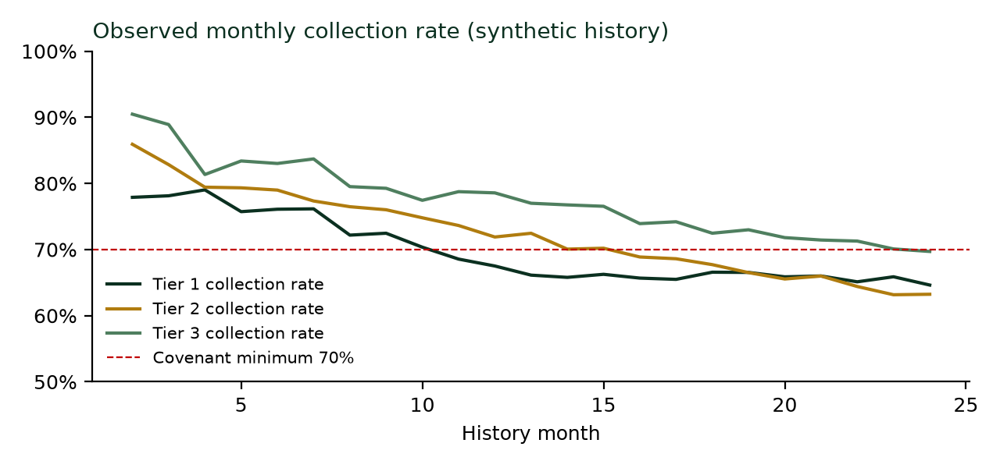
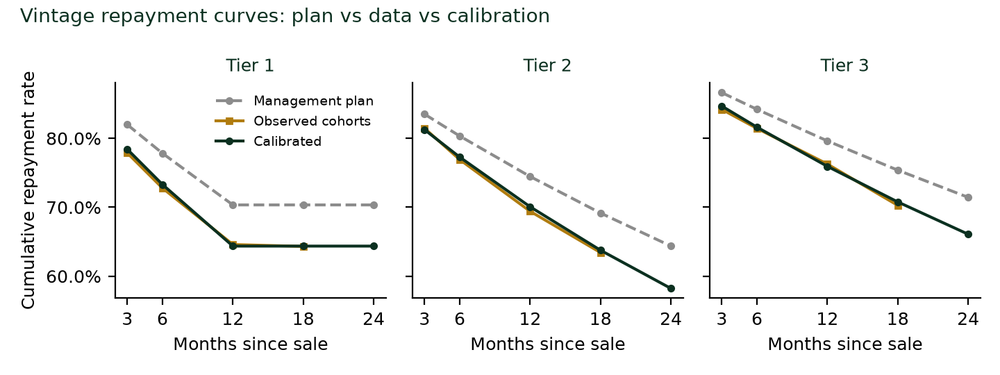
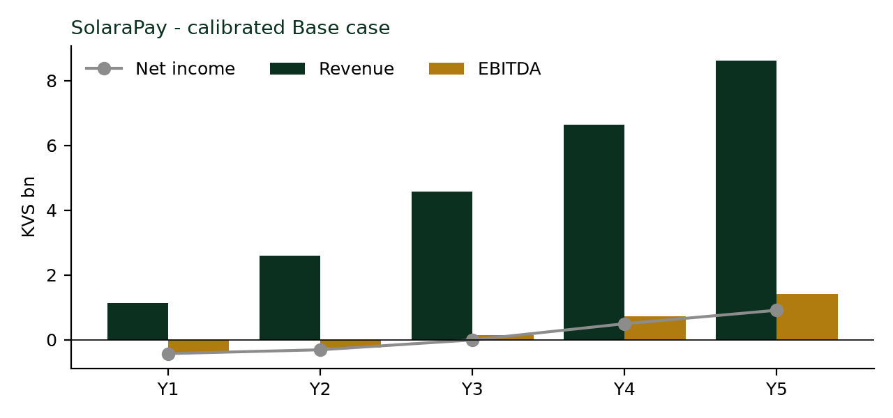
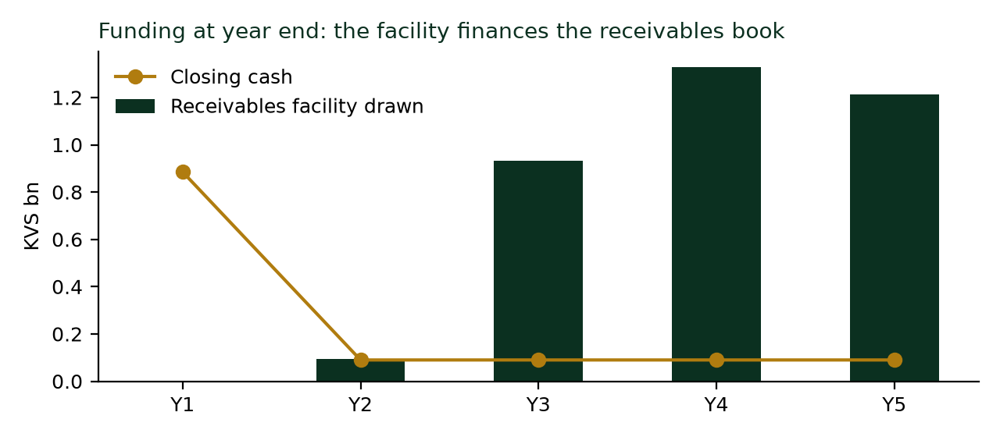
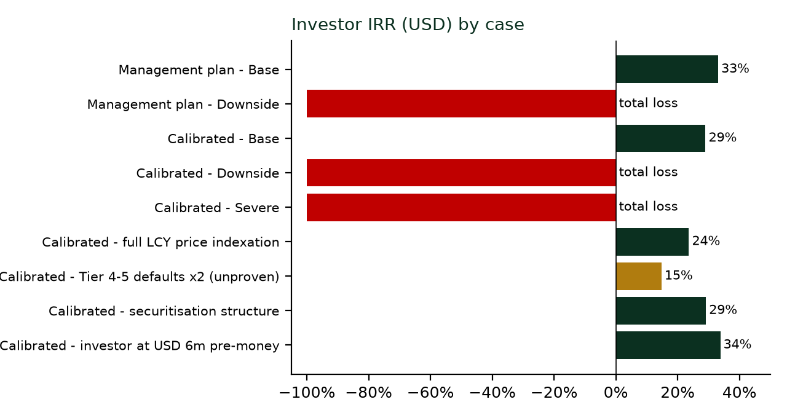

# Case summary

> **Teaching case.** SolaraPay Ltd and the Republic of Kivara are fictional. Every figure, including the 24 month portfolio history, is synthetic teaching data generated under a fixed random seed so that the case can be reproduced exactly. All numbers quoted here come from the case workbook `SolaraPay_Case_Model_v0.7.xlsx`, whose outputs have been reproduced to rounding precision by an independent shadow calculation of the full model.

**The decision.** SolaraPay Ltd, a PAYGo solar distributor in the Republic of Kivara (currency: the Kivara shilling, KVS; opening rate KVS 135 per USD), is raising USD 4.0 million of equity from an impact fund at a pre money valuation of USD 8.0 million, which gives the fund a 33.3% stake. In parallel it has asked a local bank for a KVS 4.5 billion receivables facility. The fund's investment committee must choose between Go, Conditional Go and Stop.

**Recommendation: Conditional Go.** The business can create value, but the management plan overstates repayment, recoveries and covenant headroom. The investment holds up only if conditions are attached on pricing, Tier 4 and 5 exposure, collections, recovery evidence and valuation (Section 9).

| Key figure (calibrated Base unless stated) | Value |
|---|---|
| Revenue, Year 1 and Year 5 | USD 8.1m and USD 51.2m |
| EBITDA margin, Year 5 | 16.4% (management plan 18.6%) |
| Peak equity required | USD 9.0m; no top up needed in Base |
| Investor IRR and multiple (USD) | 29.0% and 3.6x (management plan 33.1% and 4.2x) |
| Investor outcome, Downside | Total loss (exit equity of zero) |
| Lowest trailing three month collection rate against a 70% covenant | 70.0%, with no headroom |
| Observed collection rate, last twelve months of history | 69.3%, already below the proposed covenant |
| Investment readiness | 5 of 23 gates met; not investment grade |

# 1. Company and market

SolaraPay has sold solar products on pay as you go terms in Kivara for two years. Customers pay a deposit and then a daily rate through mobile money; the device locks remotely when payments stop and unlocks permanently at the end of the plan.

The company sells Tiers 1 to 3 today. Its plan adds two solar inverter systems with lithium storage (Tiers 4 and 5), aimed at urban households and small businesses on an unreliable grid.

| Tier | Product | Cash price (KVS) | Implied APR | Tenor | Planned sales mix |
|---|---|---|---|---|---|
| 1 | Pico solar kit, 10 Wp | 6,500 | 106% | 12 months | 25% |
| 2 | SHS with TV, 80 Wp | 39,000 | 50% | 24 months | 40% |
| 3 | Large SHS with DC fridge, 300 Wp | 117,000 | 39% | 30 months | 22% |
| 4 | Inverter with lithium, about 1.2 kWp and 5 kWh (new) | 390,000 | 32% | 36 months | 9% |
| 5 | Inverter with lithium, about 3 kWp and 10 kWh (new) | 845,000 | 25% | 48 months | 4% |

| Year | 1 | 2 | 3 | 4 | 5 |
|---|---|---|---|---|---|
| Units sold | 9,000 | 18,000 | 28,000 | 36,000 | 42,000 |

The proposed capital structure has three layers. Initial equity totals USD 9.0m (KVS 1,215m), including the fund's USD 4.0m. A USD 3.0m term loan carries 10% interest, a twelve month grace period and 36 months of amortisation. The KVS 4.5bn receivables facility is priced at 16% and advances 50% of eligible Tier 1 receivables, 70% for Tiers 2 and 3 and 75% for Tiers 4 and 5, drawn as needed.

# 2. Testing the plan against SolaraPay's own data

Management built its plan on the model's default credit assumptions: a monthly default hazard of 3.5% for Tier 1, 2.6% for Tier 2 and 1.9% for Tier 3, and collection rates on paying accounts of 88% to 90%.

Before projecting anything, the analyst loaded SolaraPay's 24 month portfolio history into *Credit_Input* and eighteen monthly cohorts per tier into *Vintage_Input*, and switched the credit data mode to Actual.

The history tells a consistent story.

Collections are weakening as the book seasons. The portfolio collection rate fell from 77.4% in the first year of history to 69.3% in the second. In the latest month, *Credit_Portfolio* reports a collection ratio of 66.5%, 17.0% of receivables more than 30 days past due and indicative ECL coverage of 36.5%.

Cohorts repay below plan at every age. At month 12, observed cumulative repayment compares with the plan as follows:

| Tier | Observed | Plan |
|---|---|---|
| Tier 1 | 64.6% | 70.3% |
| Tier 2 | 69.4% | 74.5% |
| Tier 3 | 76.3% | 79.6% |

Recoveries are close to nil. The observed LGD proxy is about 99%, meaning almost nothing comes back from repossessed units, whereas the plan assumes that 20% to 70% of defaulted units are repossessed, depending on the tier.

There is no ownership evidence yet. No cohort is old enough to measure ownership at twice the tenor, so an ownership linked RBF programme cannot pay for now, and the model correctly pays zero under that design.

**Recalibration.** The analyst re-estimated Tier 1 to 3 credit behaviour from the cohort data. The calibrated curves (green) sit on the observed points (gold).

| Tier | Monthly default hazard, plan | Calibrated | Collection on paying accounts, plan | Calibrated |
|---|---|---|---|---|
| 1 | 3.50% | 4.55% | 88% | 86% |
| 2 | 2.60% | 3.38% | 88% | 87% |
| 3 | 1.90% | 2.47% | 90% | 89% |
| 4 and 5 | Unchanged, no history | Unchanged | Unchanged, no history | Unchanged |

> **Lesson.** The most productive hour of this analysis went into SolaraPay's own cohort data, not into the projections. A plan built on assumptions that the company's history already contradicts cannot serve as a base case.

# 3. Unit economics by tier

Calibrated Base, from *Unit_Economics*:

| Tier | Expected loss rate | Lifetime contribution (KVS) | LTV to CAC | Cash payback | Unit IRR |
|---|---|---|---|---|---|
| 1 | 35.6% | 1,092 | 2.4x | 9 months | 66% |
| 2 | 41.8% | 7,524 | 3.5x | 17 months | 37% |
| 3 | 38.2% | 33,897 | 5.5x | 18 months | 47% |
| 4 | 27.1% | 180,443 | 11.0x | 17 months | 67% |
| 5 | 26.6% | 416,975 | 14.9x | 22 months | 54% |

Every tier still creates value per unit, but the distribution matters. Tier 2, which carries 40% of planned volume, is the weakest product per unit: it loses 41.8% of scheduled instalments and takes 17 months to pay back. Tiers 4 and 5 look the most attractive, with LTV to CAC of 11x to 15x, yet their credit assumptions have no history behind them.

**Affordability.** On *Consumer_Risk*, the instalment exceeds the 10% payment burden threshold for three tiers: Tier 2 at 13.0% of illustrative household income, Tier 3 at 13.2% and Tier 4 at 11.3%. A high burden is a leading indicator of the defaults already visible in Tier 2. Tier 1's implied APR of 106% will draw regulatory and reputational attention.

# 4. Calibrated projections

| Calibrated Base | Y1 | Y2 | Y3 | Y4 | Y5 |
|---|---|---|---|---|---|
| Revenue (KVS bn) | 1.13 | 2.60 | 4.58 | 6.63 | 8.62 |
| Gross margin | 41.5% | 46.8% | 50.7% | 54.0% | 56.6% |
| EBITDA margin | (35.2%) | (9.4%) | 2.9% | 10.9% | 16.4% |
| Net income (KVS bn) | (0.43) | (0.31) | (0.01) | 0.49 | 0.91 |
| Net credit losses to revenue | 37.5% | 33.9% | 31.3% | 29.2% | 27.5% |
| Collection rate | 82.3% | 76.8% | 73.3% | 71.5% | 70.3% |
| 30+ DPD to gross receivables | 8.4% | 11.4% | 12.8% | 13.7% | 14.4% |
| Debt to book equity (year end) | 0.54x | 0.98x | 2.51x | 1.47x | 0.65x |

EBITDA turns positive in month [[EBITDA_MONTH]], and operating cash flow stays positive from month [[CFO_MONTH]] to the end of the horizon. The USD 9.0m of initial equity is sufficient in Base: the receivables facility finances the growing book and peaks at KVS [[RF_PEAK]]bn in month [[RF_PEAK_MONTH]]. The annual DSCR stays below 1.20x in Years 1 to 4. A cash flow DSCR covenant is ill suited to a PAYGo book in growth; portfolio covenants are the better instrument (Section 7).

# 5. Stress tests

| Case | Peak equity (USD m) | Y5 EBITDA margin | Y5 collection rate | Investor IRR | Multiple | Months in covenant breach |
|---|---|---|---|---|---|---|
| Management plan, Base | 9.0 | 18.6% | 73.0% | 33.1% | 4.2x | 0 |
| Management plan, Downside | 9.0 | 3.7% | 66.8% | Total loss | 0.0x | 39 |
| Calibrated, Base | 9.0 | 16.4% | 70.3% | 29.0% | 3.6x | 0 |
| Calibrated, Downside | 9.0 | 1.3% | 63.9% | Total loss | 0.0x | 40 |
| Calibrated, Severe | 41.9 | (25.4%) | 55.4% | Total loss | 0.0x | 45 |
| Calibrated Downside with full FX price indexation | 9.0 | 14.2% | 64.4% | 23.6% | 2.9x | 38 |
| Calibrated, Tier 4 and 5 default hazard doubled | 9.0 | 10.3% | 63.8% | 14.8% | 2.0x | 38 |
| Calibrated, securitisation structure | 9.0 | 16.4% | 70.3% | 29.1% | 3.6x | 0 |
| Calibrated, investor entering at USD 6m pre money | 9.0 | 16.4% | 70.3% | 33.8% | 4.3x | 0 |

Four conclusions follow.

The Downside wipes out the equity. At the Year 5 exit, net debt exceeds six times a much reduced EBITDA, so exit equity is zero. No new equity is called during the five years, but the stake is worth nothing at exit.

Pricing power is the strongest mitigant available. Indexing new contract prices fully to the exchange rate turns the Downside from a total loss into a 23.6% IRR.

Tier 4 and 5 credit is the largest unproven risk. Doubling the default hazard on those two tiers halves the IRR to 14.8% and produces 38 months of covenant breaches.

Structure and entry price matter less than credit, though they are not negligible. A securitisation structure barely moves returns, while entering at a USD 6m pre money valuation lifts the IRR to 33.8%.

# 6. Valuation and returns

| Metric (calibrated Base) | Value |
|---|---|
| DCF enterprise value at entry (22% discount rate) | USD 6.1m |
| Exit equity value, 100%, end of Year 5 (6x EBITDA less net debt) | USD 42.9m |
| Investor stake | 33.3% |
| Investor IRR and multiple (USD) | 29.0% and 3.6x |

**Why the DCF is low.** The DCF value sits below the USD 8m pre money valuation, and the terminal value accounts for more than the whole enterprise value. Both are normal for a PAYGo company in its growth phase. Each sale on credit is an investment in working capital, so free cash flow over the first five years is negative in aggregate and the value is concentrated in the terminal year.

The fund should therefore treat the entry price as a position on the exit multiple and on credit quality, and negotiate protection accordingly: a lower pre money valuation, a ratchet, or staged tranches tied to cohort performance.

# 7. Lender view

| Test (calibrated Base, projection) | Result |
|---|---|
| Trailing three month collection rate, minimum 70% | Lowest 70.0%, no headroom |
| Receivables at risk, maximum 15% | Highest 14.4% |
| 30+ DPD maximum 25%; 90+ DPD maximum 18% | Within limits |
| Debt to book equity, maximum 3.0x | Highest at year end 2.51x (Year 3) |
| Annual DSCR, minimum 1.20x | Below the minimum in Years 1 to 4 |
| Borrowing base (eligibility up to 30 DPD, advance rates of 50% to 75% by tier) | Facility always within the base |

The projection passes, but only just. On actual data, the latest trailing collection ratio of 66.5% would already breach a 70% covenant.

A lender has two sound options. The first is to set the collection covenant at a level the book can meet, for example 65% with a cure period and a collections improvement plan. The second is to defer the facility until the collection trend has turned. In either case the bank should require monthly reporting on PAYGo PERFORM lines: collection rate, receivables at risk and cohort repayment curves.

# 8. Benchmarks and calibration

*Benchmark_Compare* and *Calibration* set the calibrated Base against graded records of real companies. Peer coverage is thin, with one or two companies per ratio, so the comparisons below are anecdotal checks rather than sector norms.

| Ratio, Year 5 | SolaraPay | Reference | Reading |
|---|---|---|---|
| Net margin | 10.5% | M-KOPA FY2024, about 2.2% (provisional: published revenue figures conflict) | 4.8 times the scale reference; the cost and credit assumptions need justification |
| Expected credit losses to financing revenue | 1.28x | M-KOPA FY2024, about 0.38x | Credit losses are heavy relative to financing income |
| Return on equity | 49.8% | M-KOPA FY2024, about 11% (equity derived as total assets less liabilities) | Optimistic against a scaled peer |
| Collection rate | 70.3% | ESMAP sector figure of about 62% for 2023 (secondary reporting; the primary report has not yet been reviewed) | Within ten points of the sector figure after calibration |

# 9. Recommendation and conditions

**Conditional Go:** invest USD 4.0m, subject to seven conditions.

1. **Pricing policy.** Contractual or board approved indexation of new contract prices to the KVS/USD rate, which corresponds to setting pass through to 100% in the model. This is the most effective Downside mitigant identified.
2. **Tier 4 and 5 pilot cap.** Tiers 4 and 5 are held to their planned 13% of units and released in tranches only after twelve months of cohort data confirm repayment within 10% of plan, with portfolio at risk reported separately for these tiers.
3. **Collections plan before the facility.** A written collections improvement plan with monthly targets, and a facility covenant set at a level the book can meet (65% trailing collection with a cure period), stepping up as performance improves.
4. **Recovery assumptions.** Repossession and resale rates cut to observed levels until a six month repossession programme demonstrates otherwise.
5. **Affordability redesign.** The Tier 2 to 4 price plans are restructured, through longer tenors or higher deposits, so that the instalment stays within 10% of target segment income, with incomes validated by customer surveys.
6. **Valuation protection.** A pre money valuation closer to USD 6m, or a ratchet tied to Year 2 cohort performance.
7. **Data and validation.** Monthly updates of *Credit_Input* and *Vintage_Input*, ownership tracking at twice the tenor from launch, independent review of the ECL approach and accounting (gate 19), a full test of the workbook in Excel (gate 17) and management sign off (gate 2).

**Readiness today.** Five of the 23 gates are met: model integrity, covenant compliance in Base, positive unit contribution, a credit engine running on actual data, and data reconciliation. The case is not investment grade; the conditions above close the most material gaps.

# 10. Questions for discussion

1. Reset the credit assumptions to the management plan (default hazard and collection rate on *Products*). Which outputs move most, and why does the investor IRR shift by about four points?
2. Set FX pass through to 100% in Base. What happens to affordability on *Consumer_Risk*, and what does that imply for defaults?
3. Cut the Tier 2 tenor from 24 to 18 months at the same cash price. How do the payment burden, the expected loss rate and the unit IRR respond?
4. Switch the RBF design to repayment linked (mode 2), then to ownership linked (mode 3). Why does mode 3 pay nothing, and what data would SolaraPay need to start collecting?
5. Extend borrowing base eligibility to 90 DPD on *Credit_Assumptions*. Why does Base barely change, and why would a lender still refuse the request?
6. Using the 24 month history, draft the collections covenant you would accept as a lender, and justify both the level and the cure period.

# Appendix. Case files and data

| File | Content |
|---|---|
| `SolaraPay_Case_Model_v0.7.xlsx` | Case workbook on the calibrated inputs, with the synthetic history loaded in *Credit_Input* and *Vintage_Input* |
| `case_exhibits.json` | The figures quoted in this case, extracted from the evaluated workbook, together with the management plan comparison |
| `figures/` | The five charts reproduced in this document |

**Synthetic data.** The history applies the calibrated credit behaviour with random variation under a fixed seed (20261002): 24 months of portfolio data for Tiers 1 to 3 and eighteen cohorts per tier observed at checkpoints from M3 to M24. It is teaching material only and describes no real company.

**Management plan comparison.** The management plan figures in Sections 2, 5 and 10 come from the same model run on management's original credit assumptions; only the default hazard and collection rates of Tiers 1 to 3 differ from the calibrated case.
